# JVM基础
## 定义&结构图解
定义：Java Virtual Machine--java程序的运行环境
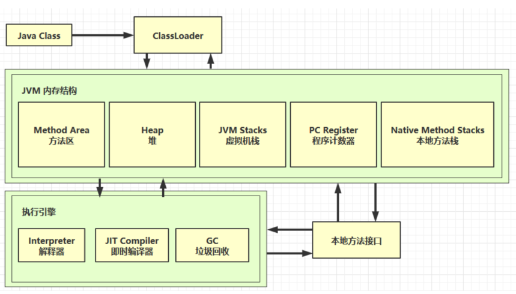
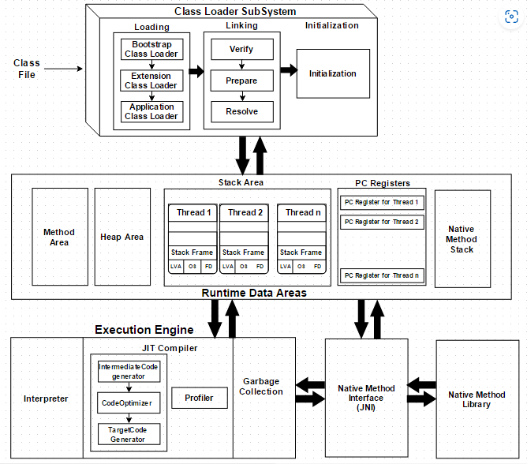
[参考资料](https://www.javainterviewpoint.com/java-virtual-machine-architecture-in-java/)

## 程序计数器
Program Counter Register 程序计数器（物理实现：寄存器）

- 作用：记住下一条jvm指令的执行地址
- 特点
    - 是线程私有的
    - 不会存在内存溢出

## 栈
Java Virtual Machine Stacks （Java 虚拟机栈）

- 每个线程运行时所需要的内存，称为虚拟机栈
- 每个栈由多个栈帧（Frame）组成，对应着每次方法调用时所占用的内存
- 每个线程只能有一个活动栈帧，对应着当前正在执行的那个方法

`-Xss256K`:修改栈空间大小
> 问题辨析

1. 垃圾回收是否涉及栈内存？
    1. 不会，每次出栈，都会直接释放
2. 栈内存分配越大越好吗？
    1. 不是越大越好
3. 方法内的局部变量是否线程安全？
-  如果方法内局部变量没有逃离方法的作用范围，它是线程安全的
- 如果是局部变量引用了对象，并逃离方法的作用范围，需要考虑线程安全
> 栈内存溢出 java.lang.StackOverflowError

- 栈帧过多导致栈内存溢出
- 栈帧过大导致栈内存溢出
> 线程运行诊断

定位：

- 用top定位哪个进程(取pid)对cpu的占用过高
- ps H -eo pid,tid,%cpu | grep 进程id （用ps命令进一步定位是哪个线程引起的cpu占用过高）
- jstack 进程id
    - 可以根据线程id 找到有问题的线程，进一步定位到问题代码的源码行号

## 本地方法栈
Native Method Stacks 本地方法栈
关键字：**native**
Java有时候不能直接操作系统底层资源，需要通过C/C++写的本地方法操作系统资源，而这些C/C++写的本地方法则存放在**本地方法栈**中

## 堆
Heap 堆  `-Xmx8m`：修改堆空间大小

- 通过 new 关键字，创建对象都会使用堆内存

特点

- 它是线程共享的，堆中对象都需要考虑线程安全的问题
- 有垃圾回收机制
> 堆内存溢出 java.lang.OutOfMemoryError:Java heap space

1. jps 工具
   查看当前系统中有哪些 java 进程
2. jmap 工具
   查看堆内存占用情况 jmap - heap 进程id
3. jconsole 工具
   图形界面的，多功能的监测工具，可以连续监测
4. visualVm

图形界面的多功能的监测工具，可以连续监测

## 方法区
组成：
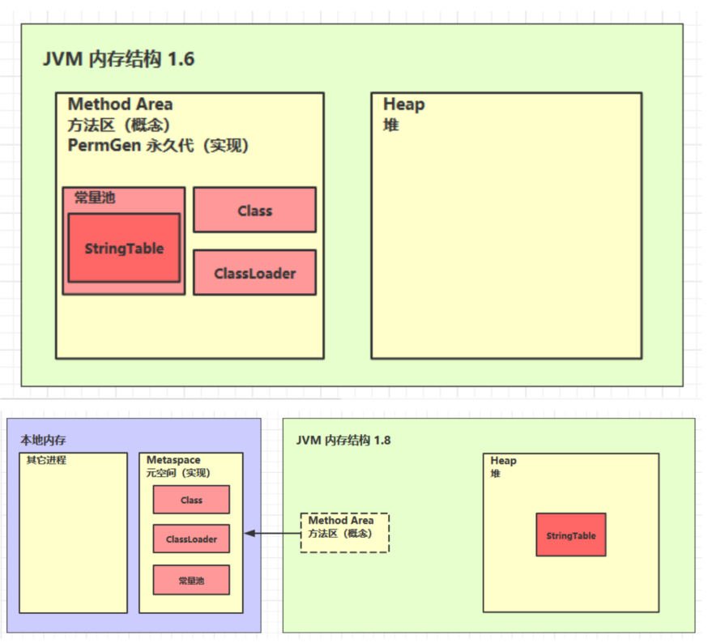

> 方法区内存溢出

- 1.8以前会导致永久代内存溢出
    - 演示永久代内存溢出 java.lang.OutOfMemoryError: PermGen space
    - `-XX:MaxPermSize=8m`设置永久代的大小
- 1.8之后会导致元空间内存溢出
    - 演示元空间内存溢出 java.lang.OutOfMemoryError: Metaspace
    - `-XX:MaxMetaspaceSize=8m`设置元空间的大小

### 运行时常量池

- 常量池，就是一张表，虚拟机指令根据这张常量表找到要执行的类名、方法名、参数类型、字面量等信息
- 运行时常量池，常量池是 *.class 文件中的，当该类被加载，它的常量池信息就会放入运行时常量池，并把里面的符号地址变为真实地址
- 使用` javap -v **.class`查看编译器的实际执行过程


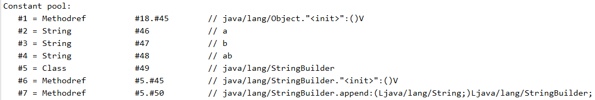
### StringTable
```java
String s1 = "a";
String s2 = "b";
String s3 = "a" + "b";
//new String("ab") <== new StringBuilder().append("a").append("b").toString() 在堆中
String s4 = s1 + s2; 
String s6 = s4.intern();//"ab"已存在 返回串池中的位置 s4仍在堆中
String s5 = "ab";
// 问
System.out.println(s3 == s4); //false s3在串池 s4在堆中
System.out.println(s3 == s5); //true  s5在串池
System.out.println(s3 == s6); //true  s6在串池
String x2 = new String("c") + new String("d"); //new String("cd")
String x1 = "cd";
x2.intern();
// 问，如果调换了【最后两行代码】的位置呢，如果是jdk1.6呢  
//调换：true 调换后，x2.intern()执行时，串池中没有"cd"，则将x2放入串池
//1.6中 原顺序：false 调换：false
System.out.println(x1 == x2); //false
```

- 常量池中的字符串仅是符号，第一次用到时才变为对象
- 利用串池的机制，来避免重复创建字符串对象
- 字符串变量拼接的原理是 StringBuilder （1.8）
- 字符串常量拼接的原理是编译期优化
- 可以使用 intern 方法，主动将串池中还没有的字符串对象放入串池
    - 1.8 将这个字符串对象尝试放入串池，如果有则并不会放入，如果没有则放入串池， 会把串池中的对象返回
    - 1.6 将这个字符串对象尝试放入串池，如果有则并不会放入，如果没有会把此对象复制一份，放入串池， 会把串池中的对象返回
### StringTable垃圾回收
当串池中的大小快满的时候会触发GC垃圾回收机制
### StringTable性能调优
- 当有许多字符串需要处理时，适当调整`-XX:StringTableSize=桶个数`有助于优化执行速度
- 考虑将字符串对象是否入池
- 提示：`-XX:+PrintStringTableStatistics`打印串池的信息


## 直接内存
### 定义
Direct Memory

- 常见于 NIO 操作时，用于数据缓冲区
- 分配回收成本较高，但读写性能高
- 不受 JVM 内存回收管理
### 分配和回收原理

- 使用了 Unsafe 对象完成直接内存的分配回收，并且回收需要主动调用 freeMemory 方法
- ByteBuffffer 的实现类内部，使用了 Cleaner （虚引用）来监测 ByteBuffffer 对象，一旦 ByteBuffffer 对象被垃圾回收，那么就会由 ReferenceHandler 线程通过 Cleaner 的 clean 方法调用 freeMemory 来释放直接内存
> 在JVM调优时一般添加 `-XX:+DisableExplicitGC` 禁用显示的垃圾回收(System.gc()方法)
> 会对使用直接内存造成影响，解决方式：使用UnSafe手动管理分配的内存

# 垃圾回收
## 如何判断对象可以回收
### 引用计数法
解释：当一个对象被引用时，引用计数加+1 取消引用时计数-1，当引用为0时表示可以进行垃圾回收
弊端：当存在**循环引用**的问题时，对于存在循环引用的对象不会对其进行垃圾回收

### 可达分析(Java中使用)
- Java 虚拟机中的垃圾回收器采用可达性分析来探索所有存活的对象
- 扫描堆中的对象，看是否能够沿着 GC Root对象 为起点的引用链找到该对象，找不到，表示可以回收
- 哪些对象可以作为`GC Root`？
### 四种引用
1. 强引用
    - 只有所有 GC Roots 对象都不通过【强引用】引用该对象，该对象才能被垃圾回收
2. 软引用(SoftReference)
    - 仅有软引用引用该对象时，在垃圾回收后，内存仍不足时会再次出发垃圾回收，回收软引用对象
    - 可以配合引用队列来释放软引用自身
```java
private static final int _4MB = 4 * 1024 * 1024;

public static void main(String[] args) {
    List<SoftReference<byte[]>> list = new ArrayList<>();

    // 引用队列
    ReferenceQueue<byte[]> queue = new ReferenceQueue<>();

    for (int i = 0; i < 5; i++) {
        // 关联了引用队列， 当软引用所关联的 byte[]被回收时，软引用自己会加入到 queue 中去
        SoftReference<byte[]> ref = new SoftReference<>(new byte[_4MB], queue);
        System.out.println(ref.get());
        list.add(ref);
        System.out.println(list.size());
    }

    // 从队列中获取无用的 软引用对象，并移除
    Reference<? extends byte[]> poll = queue.poll();
    while( poll != null) {
        list.remove(poll);
        poll = queue.poll();
    }

    System.out.println("===========================");
    for (SoftReference<byte[]> reference : list) {
        System.out.println(reference.get());
    }

}
```
3. 弱引用(WeakReference)
    - 仅有弱引用引用该对象时，在垃圾回收时，无论内存是否充足，都会回收弱引用对象
    - 可以配合引用队列来释放弱引用自身
```java
private static final int _4MB = 4 * 1024 * 1024;

public static void main(String[] args) {
    //  list --> WeakReference --> byte[]
    List<WeakReference<byte[]>> list = new ArrayList<>();
    for (int i = 0; i < 10; i++) {
        WeakReference<byte[]> ref = new WeakReference<>(new byte[_4MB]);
        list.add(ref);
        for (WeakReference<byte[]> w : list) {
            System.out.print(w.get()+" ");
        }
        System.out.println();

    }
    System.out.println("循环结束：" + list.size());
}
```

4. 虚引用(PhantomReference)
    - 必须配合引用队列使用，主要配合 ByteBuffer 使用，被引用对象回收时，会将虚引用入队,由 Reference Handler 线程调用虚引用相关方法(Unsafe.freeMemory)释放直接内存
5. 终结器引用(FinalReference)
    - 无需手动编码，但其内部配合引用队列使用，在垃圾回收时，终结器引用入队（被引用对象暂时没有被回收），再由 Finalizer 线程通过终结器引用找到被引用对象并调用它的 finalize方法，第二次 GC 时才能回收被引用对象

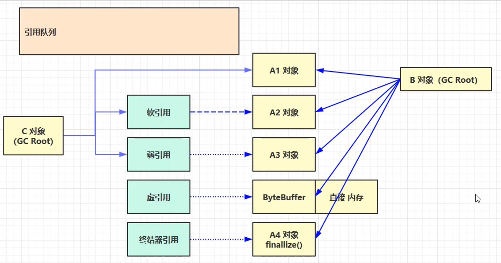
## 垃圾回收算法

1. **标记清除**
    1. 速度快
    2. 会造成内存碎片

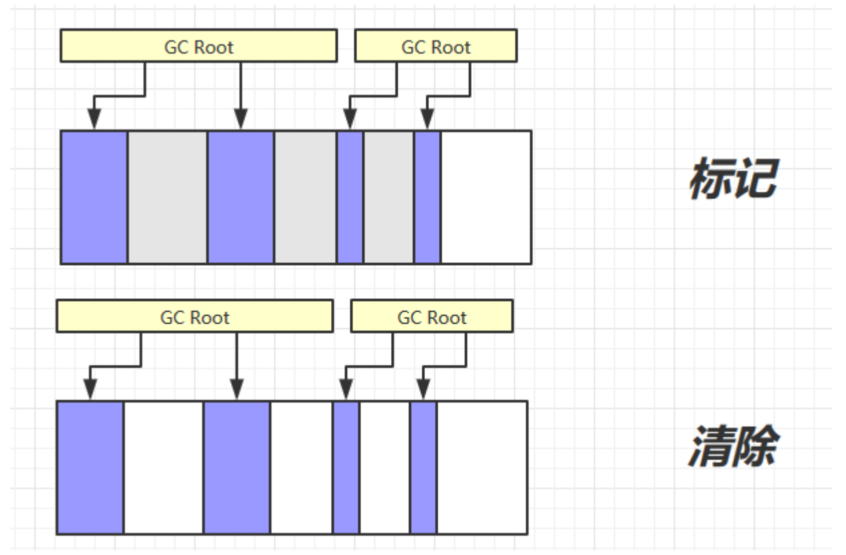

2. **标记整理**
    1. 速度慢（整理时需要改变对象引用地址等等）
    2. 没有内存碎片

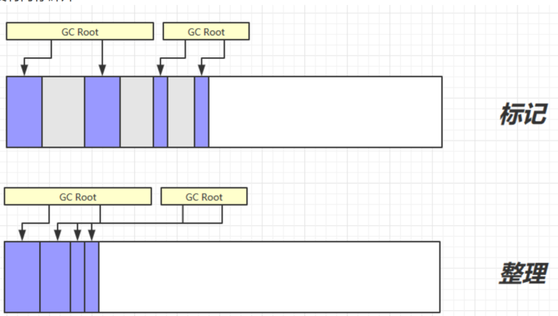

3. **复制**
    1. 不会有内存碎片
    2. 需要占用双倍内存空间

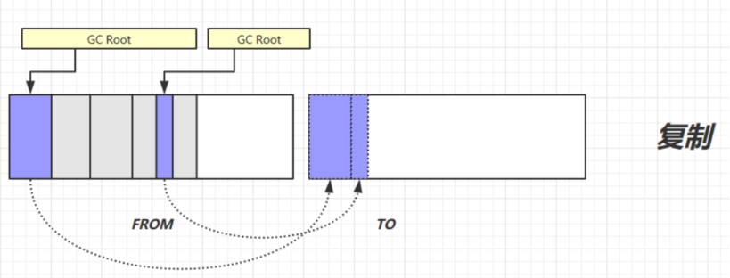
## 分代垃圾回收
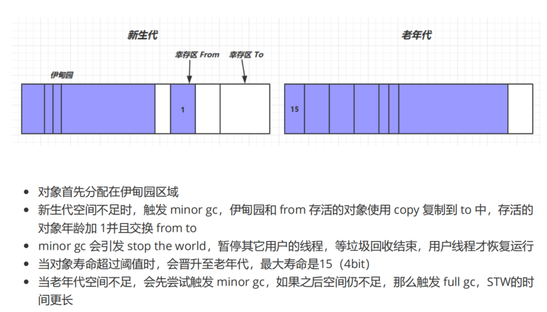
### 相关VM参数

| 堆初始大小  | -Xms |
| --- | --- |
| 堆最大大小  | -Xmx 或 -XX:MaxHeapSize=size |
| 新生代大小 | -Xmn 或 (-XX:NewSize=size + -XX:MaxNewSize=size ) |
| 幸存区比例（动态） | -XX:InitialSurvivorRatio=ratio 和 -XX:+UseAdaptiveSizePolicy |
| 幸存区比例 | -XX:SurvivorRatio=ratio |
| 晋升阈值  | -XX:MaxTenuringThreshold=threshold |
| 晋升详情 | -XX:+PrintTenuringDistribution |
| GC详情  | -XX:+PrintGCDetails -verbose:gc |
| FullGC 前 MinorGC  | -XX:+ScavengeBeforeFullGC |

> 注意：在抛出内存溢出的异常后，程序不会终止

## 垃圾回收器
### 串行

- 单线程
- 堆内存较小，适合个人电脑

`-XX:+UseSerialGC = Serial + SerialOld`开启串行垃圾回收器
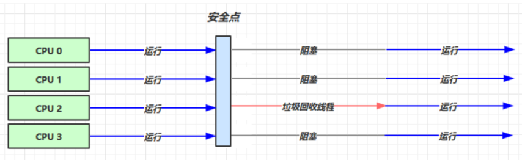

### 吞吐量优先

- 多线程
- 堆内存较大，多核 cpu
- 让单位时间内，STW 的时间最短 0.2 0.2 = 0.4，垃圾回收时间占比最低，这样就称吞吐量高
```java
//只要开启一个 另外一个就会开启
-XX:+UseParallelGC ~ -XX:+UseParallelOldGC
//自适应的大小调整：新生代（eden和form、to的比例）
-XX:+UseAdaptiveSizePolicy
//调整GC堆的大小去适应设置的比例   1/(1+ratio)  一般设置为19  
-XX:GCTimeRatio=ratio
//最大暂停毫秒数
-XX:MaxGCPauseMillis=ms
//控制垃圾回收线程的线程数
-XX:ParallelGCThreads=n
```
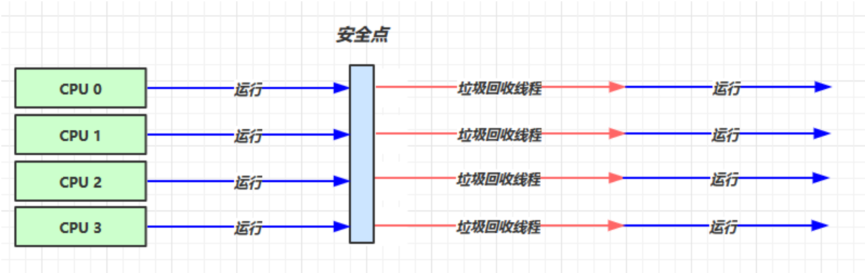
### 响应时间优先

- 多线程
- 堆内存较大，多核 cpu
- 尽可能让单次 STW 的时间最短 0.1 0.1 0.1 0.1 0.1 = 0.5
```java
-XX:+UseConcMarkSweepGC ~ -XX:+UseParNewGC ~ SerialOld
-XX:ParallelGCThreads=n ~ -XX:ConcGCThreads=threads
-XX:CMSInitiatingOccupancyFraction=percent
-XX:+CMSScavengeBeforeRemark
```
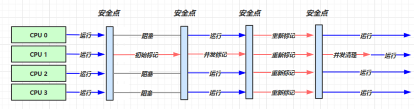
### G1

**定义：Garbage First**

- 2004 论文发布
- 2009 JDK 6u14 体验
- 2012 JDK 7u4 官方支持
- 2017 JDK 9 默认

适用场景

- 同时注重吞吐量（Throughput）和低延迟（Low latency），默认的暂停目标是 200 ms
- 超大堆内存，会将堆划分为多个大小相等的 Region
- 整体上是 标记+整理 算法，两个区域之间是 复制 算法

相关 JVM 参数
`-XX:+UseG1GC`
`-XX:G1HeapRegionSize=size`
`-XX:MaxGCPauseMillis=time`
G1垃圾回收阶段
`Young Collection ==> Young Collection + Concurrent Mark ==> Mixed Collection ==> Young Collection`
**Young Collection**

- 会STW
  **YoungCollection+CM**

- 在Young GC时会进行GC Root的初始标记
- 老年代占用堆空间比例达到阈值时，进行并发标记（不会 STW），由下面的 JVM 参数决定
- `-XX:InitiatingHeapOccupancyPercent=percent` （默认45%）

**Mixed Collection **

- 会对 E、S、O 进行全面垃圾回收
- 最终标记（Remark）会 STW
- 拷贝存活（Evacuation）会 STW
- `-XX:MaxGCPauseMillis=ms`

** Full GC **

- SerialGC
    - 新生代内存不足发生的垃圾收集 - minor gc
    - 老年代内存不足发生的垃圾收集 - full gc
- ParallelGC
    - 新生代内存不足发生的垃圾收集 - minor gc
    - 老年代内存不足发生的垃圾收集 - full gc
- CMS
    - 新生代内存不足发生的垃圾收集 - minor gc
    - 老年代内存不足
- G1
    - 新生代内存不足发生的垃圾收集 - minor gc
    - 老年代内存不足

**Young Collection 跨代引用 **
新生代回收的跨代引用（老年代引用新生代）问题
卡表与`Remembered Set`
在引用变更时通过 `post-write barrier + dirty card queue`
`concurrent refinement threads` 更新 `Remembered Set`
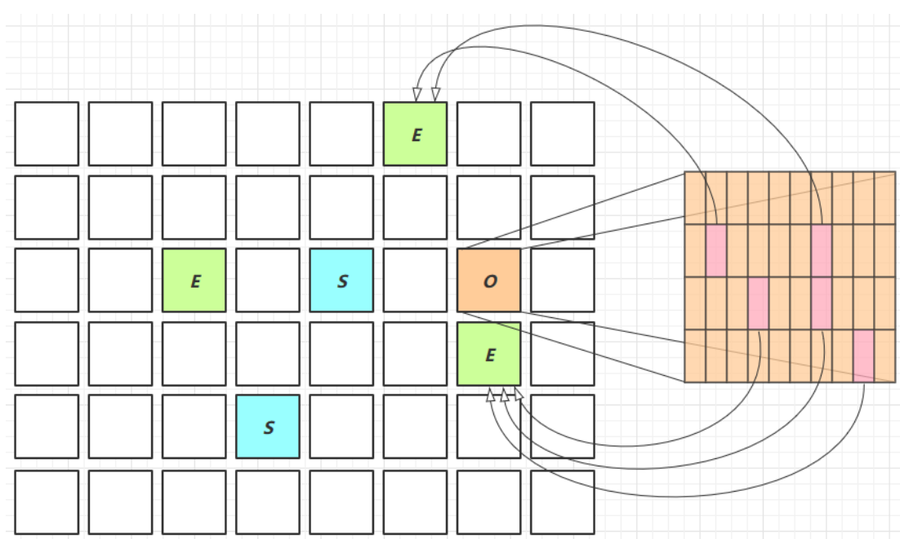
**Remark**

- `pre-write barrier + satb_mark_queue`
  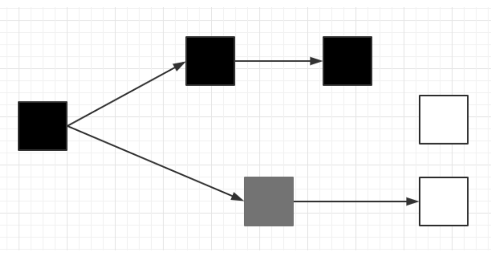
  ** JDK 8u20 字符串去重 **

- 优点：节省大量内存
- 缺点：略微多占用了 cpu 时间，新生代回收时间略微增加

`-XX:+UseStringDeduplication`

- 将所有新分配的字符串放入一个队列
- 当新生代回收时，G1并发检查是否有字符串重复
- 如果它们值一样，让它们引用同一个 char[]
- 注意，与 String.intern() 不一样
    - String.intern() 关注的是字符串对象
    - 而字符串去重关注的是 char[]
    - 在 JVM 内部，使用了不同的字符串表

**JDK 8u40 并发标记类卸载 **
所有对象都经过并发标记后，就能知道哪些类不再被使用，当一个类加载器的所有类都不再使用，则卸
载它所加载的所有类
`-XX:+ClassUnloadingWithConcurrentMark` 默认启用
** JDK 8u60 回收巨型对象 **

- 一个对象大于 region 的一半时，称之为巨型对象
- G1 不会对巨型对象进行拷贝
- 回收时被优先考虑
- G1 会跟踪老年代所有 incoming 引用，这样老年代 incoming 引用为0 的巨型对象就可以在新生代垃圾回收时处理掉

** JDK 9 并发标记起始时间的调整 **

- 并发标记必须在堆空间占满前完成，否则退化为 FullGC
- JDK 9 之前需要使用 -XX:InitiatingHeapOccupancyPercent
- JDK 9 可以动态调整
    - `-XX:InitiatingHeapOccupancyPercent` 用来设置初始值
    - 进行数据采样并动态调整
    - 总会添加一个安全的空档空间
# 类加载与字节码技术
```java
int a = 10;
int b = a++ + ++a + a--;
字节码：
0: bipush 10   //压入操作栈
2: istore_1    //存入slot1  a
3: iload_1		//加slot 1的值到操作栈
4: iinc 1, 1	//在slot上进行运算
7: iinc 1, 1   
10: iload_1     //读取slot1的值
11: iadd		//操作栈中的值相加
12: iload_1     //读取
13: iinc 1, -1  //自减
16: iadd        //相加
17: istore_2    //存入slot2   b

分析：
注意 iinc 指令是直接在局部变量 slot 上进行运算
a++ 和 ++a 的区别是先执行 iload 还是 先执行 iinc
```
## 条件判断指令
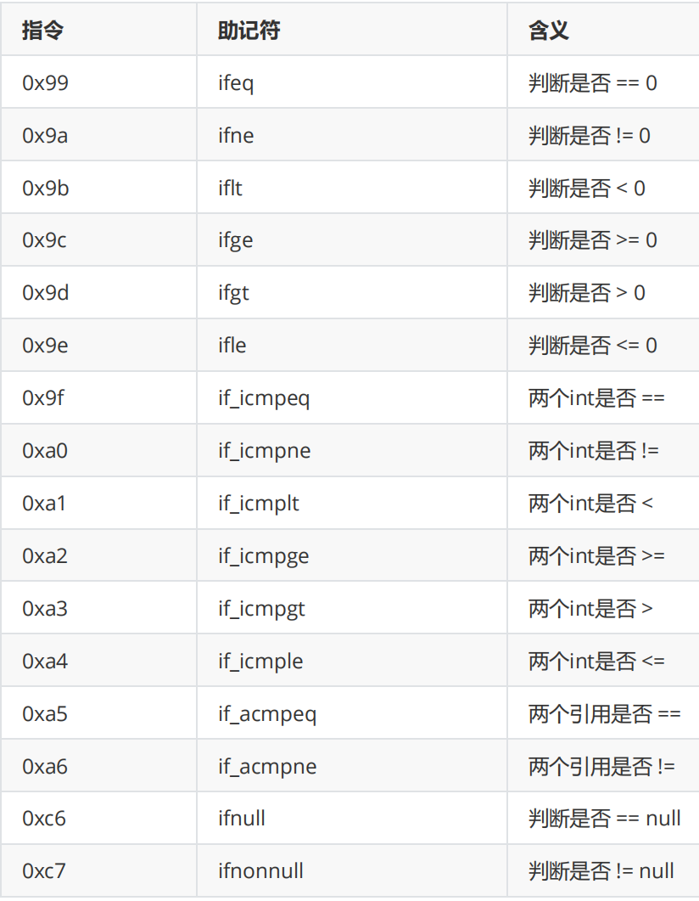
几点说明：

- byte，short，char 都会按 int 比较，因为操作数栈都是 4 字节
- goto 用来进行跳转到指定行号的字节码
```java
while循环
int a = 0;
while (a < 10) {
	a++;
}
字节码：
0: iconst_0
1: istore_1
2: iload_1
3: bipush 10
5: if_icmpge 14
8: iinc 1, 1
11: goto 2
14: return

do循环
int a = 0;
do {
   a++;
} while (a < 10);
字节码：
 0: iconst_0
 1: istore_1
 2: iinc 1, 1
 5: iload_1
 6: bipush 10
 8: if_icmplt 2
11: return

for 循环
for (int i = 0; i < 10; i++) {}
字节码：
0: iconst_0
1: istore_1
2: iload_1
3: bipush 10
5: if_icmpge 14
8: iinc 1, 1
11: goto 2
14: return
```

## 构造方法
### `<cinit>()V`
编译器会按从上至下的顺序，收集所有 static 静态代码块和静态成员赋值的代码，合并为一个特殊的方法`<cinit>()V` ：
```java
public class Demo3_8_1 {
	static int i = 10;
	static {i = 20;}
	static {i = 30;}
}
字节码：
0: bipush 10
2: putstatic #2 // Field i:I
5: bipush 20
7: putstatic #2 // Field i:I
10: bipush 30
12: putstatic #2 // Field i:I
15: return

<cinit>()V 方法会在类加载的初始化阶段被调用
```
### `<init>()V`
```java
public class Demo3_8_2 {
	private String a = "s1";
	{ b = 20; }
	private int b = 10;
    { a = "s2";}
    public Demo3_8_2(String a, int b) {
        this.a = a; this.b = b;
    }
	public static void main(String[] args) {
		Demo3_8_2 d = new Demo3_8_2("s3", 30);
		System.out.println(d.a);
		System.out.println(d.b);
	}
}
编译器会按从上至下的顺序，收集所有 {} 代码块和成员变量赋值的代码，形成新的构造方法，但原始构
造方法内的代码总是在最后
字节码：
public cn.itcast.jvm.t3.bytecode.Demo3_8_2(java.lang.String, int);
descriptor: (Ljava/lang/String;I)V
flags: ACC_PUBLIC
Code:
    stack=2, locals=3, args_size=3
        0: aload_0
        1: invokespecial #1 // super.<init>()V
        4: aload_0
        5: ldc #2 // <- "s1"
        7: putfield #3 // -> this.a
        10: aload_0
        11: bipush 20 // <- 20
        13: putfield #4 // -> this.b
        16: aload_0
        17: bipush 10 // <- 10
        19: putfield #4 // -> this.b
        22: aload_0
        23: ldc #5 // <- "s2"
        25: putfield #3 // -> this.a
        28: aload_0 // ------------------------------
        29: aload_1 // <- slot 1(a) "s3" |
        30: putfield #3 // -> this.a |
        33: aload_0 |
        34: iload_2 // <- slot 2(b) 30 |
        35: putfield #4 // -> this.b --------------------
        38: return
LineNumberTable: ...
LocalVariableTable:
    Start Length Slot Name Signature
        0 39 0 this Lcn/itcast/jvm/t3/bytecode/Demo3_8_2;
        0 39 1 a Ljava/lang/String;
        0 39 2 b I
MethodParameters: ...
```
## 方法调用
```text
public class Demo3_9 {
    public Demo3_9() { }
    private void test1() { }
    private final void test2() { }
    public void test3() { }
    public static void test4() { }
    public static void main(String[] args) {
        Demo3_9 d = new Demo3_9();
        d.test1();
        d.test2();
        d.test3();
        d.test4();
        Demo3_9.test4();
    }
}
字节码：
0: new #2 // class cn/itcast/jvm/t3/bytecode/Demo3_9
3: dup
4: invokespecial #3 // Method "<init>":()V
7: astore_1
8: aload_1
9: invokespecial #4 // Method test1:()V
12: aload_1
13: invokespecial #5 // Method test2:()V
16: aload_1
17: invokevirtual #6 // Method test3:()V
20: aload_1
21: pop
22: invokestatic #7 // Method test4:()V
25: invokestatic #7 // Method test4:()V
28: return
new 是创建【对象】，给对象分配堆内存，执行成功会将【对象引用】压入操作数栈
dup 是赋值操作数栈栈顶的内容，本例即为【对象引用】，为什么需要两份引用呢，一个是要配
合 invokespecial 调用该对象的构造方法 "<init>":()V （会消耗掉栈顶一个引用），另一个要
配合 astore_1 赋值给局部变量
最终方法（final），私有方法（private），构造方法都是由 invokespecial 指令来调用，属于静
态绑定
普通成员方法是由 invokevirtual 调用，属于动态绑定，即支持多态
成员方法与静态方法调用的另一个区别是，执行方法前是否需要【对象引用】
比较有意思的是 d.test4(); 是通过【对象引用】调用一个静态方法，可以看到在调用
invokestatic 之前执行了 pop 指令，把【对象引用】从操作数栈弹掉了😂
还有一个执行 invokespecial 的情况是通过 super 调用父类方法
```
## 多态的原理
当执行 invokevirtual 指令时，
1. 先通过栈帧中的对象引用找到对象
2. 分析对象头，找到对象的实际 Class
3. Class 结构中有 vtable，它在类加载的链接阶段就已经根据方法的重写规则生成好了
4. 查表得到方法的具体地址
5. 执行方法的字节码
## 异常处理
```java
public class Demo3_11_1 {
    public static void main(String[] args) {
        int i = 0;
        try {
        	i = 10;
        } catch (Exception e) {
        	i = 20;
        }
    }
}
public static void main(java.lang.String[]);
    descriptor: ([Ljava/lang/String;)V
    flags: ACC_PUBLIC, ACC_STATIC
    Code:
        stack=1, locals=3, args_size=1
        0: iconst_0
        1: istore_1
        2: bipush 10
        4: istore_1
        5: goto 12
        8: astore_2
        9: bipush 20
        11: istore_1
        12: return
    Exception table:
        from to target type
        	2 5 8 Class java/lang/Exception
    LineNumberTable: ...
    LocalVariableTable:
        Start Length Slot Name Signature
            9 3 2 e Ljava/lang/Exception;
            0 13 0 args [Ljava/lang/String;
            2 11 1 i I
    StackMapTable: ...
    MethodParameters: ...
}
可以看到多出来一个 Exception table 的结构，[from, to) 是前闭后开的检测范围，
    一旦这个范围内的字节码执行出现异常，则通过 type 匹配异常类型，如果一致，
    进入 target 所指示行号
8 行的字节码指令 astore_2 是将异常对象引用存入局部变量表的 slot 2 位置
```
```java
public class Demo3_11_2 {
    public static void main(String[] args) {
        int i = 0;
        try {i = 10;
        } catch (ArithmeticException e) {i = 30;
        } catch (NullPointerException e) {i = 40;
        } catch (Exception e) {i = 50;}
    }
}
字节码：
Code:
    stack=1, locals=3, args_size=1
        0: iconst_0
        1: istore_1
        2: bipush 10
        4: istore_1
        5: goto 26
        8: astore_2
        9: bipush 30
        11: istore_1
        12: goto 26
        15: astore_2
        16: bipush 40
        18: istore_1
        19: goto 26
        22: astore_2
        23: bipush 50
        25: istore_1
        26: return
Exception table:
    from to target type
        2 5 8 Class java/lang/ArithmeticException
        2 5 15 Class java/lang/NullPointerException
        2 5 22 Class java/lang/Exception
LineNumberTable: ...
LocalVariableTable:
    Start Length Slot Name Signature
  	  9		3 	   2	e 	Ljava/lang/ArithmeticException;
      16	3	   2    e   Ljava/lang/NullPointerException;
      23    3      2    e Ljava/lang/Exception;
      0     27     0    args [Ljava/lang/String;
      2     25     1    i I

因为异常出现时，只能进入 Exception table 中一个分支，所以局部变量表 slot 2 位置被共用
```
```java
public static void main(String[] args) {
    try {
        Method test = Demo3_11_3.class.getMethod("test");
        test.invoke(null);
    } catch (NoSuchMethodException | IllegalAccessException |
    InvocationTargetException e) {
    	e.printStackTrace();
    }
}
public static void test() {
	System.out.println("ok");
}
字节码：
Code:
    stack=3, locals=2, args_size=1
        0: ldc #2
        2: ldc #3
        4: iconst_0
        5: anewarray #4
        8: invokevirtual #5
        11: astore_1
        12: aload_1
        13: aconst_null
        14: iconst_0
        15: anewarray #6
        18: invokevirtual #7
        21: pop
        22: goto 30
        25: astore_1
        26: aload_1
        27: invokevirtual #11 // e.printStackTrace:()V
        30: return
Exception table:
    from to target type
    0 22 25 Class java/lang/NoSuchMethodException
    0 22 25 Class java/lang/IllegalAccessException
    0 22 25 Class java/lang/reflect/InvocationTargetException
LineNumberTable: ...
LocalVariableTable:
	Start Length Slot Name Signature
    12	 10	 1 test Ljava/lang/reflect/Method;
    26	 4 1 e Ljava/lang/ReflectiveOperationException;
    0 	 31 0 args [Ljava/lang/String;
```
```java
public static void main(String[] args) {
    int i = 0;
    try {
    	i = 10;
    } catch (Exception e) {
    	i = 20;
    } finally {
    	i = 30;
    }
}
字节码：
Code:
    stack=1, locals=4, args_size=1
        0: iconst_0
        1: istore_1 // 0 -> i
        2: bipush 10 // try --------------------------------------
        4: istore_1 // 10 -> i 
        5: bipush 30 // finally 
        7: istore_1 // 30 -> i 
        8: goto 27 // return -----------------------------------
        11: astore_2 // catch Exceptin -> e ----------------------
        12: bipush 20 // 
        14: istore_1 // 20 -> i 
        15: bipush 30 // finally 
        17: istore_1 // 30 -> i 
        18: goto 27 // return -----------------------------------
        21: astore_3 // catch any -> slot 3 ----------------------
        22: bipush 30 // finally 
        24: istore_1 // 30 -> i 
        25: aload_3 // <- slot 3 
        26: athrow // throw ------------------------------------
        27: return
Exception table:
    from to target type
    2 5 11 Class java/lang/Exception
    2 5 21 any // 剩余的异常类型，比如 Error
    11 15 21 any // 剩余的异常类型，比如 Error
LineNumberTable: ...
LocalVariableTable:
    Start Length Slot Name Signature
    12 3 2 e Ljava/lang/Exception;
    0 28 0 args [Ljava/lang/String;
    2 26 1 i I

可以看到 finally 中的代码被复制了 3 份，分别放入 try 流程，catch 流程以及
    catch 剩余的异常类型流程
```
```java
public static void main(String[] args) {
    Object lock = new Object();
    synchronized (lock) {
    	System.out.println("ok");
    }
}
字节码
Code:
stack=2, locals=4, args_size=1
    0: new #2 // new Object
    3: dup
    4: invokespecial #1 // invokespecial <init>:()V
    7: astore_1 // lock引用 -> lock
    8: aload_1 // <- lock （synchronized开始）
    9: dup
    10: astore_2 // lock引用 -> slot 2
    11: monitorenter // monitorenter(lock引用)
    12: getstatic #3 // <- System.out
    15: ldc #4 // <- "ok"
    17: invokevirtual #5 // invokevirtual println:
    (Ljava/lang/String;)V
    20: aload_2 // <- slot 2(lock引用)
    21: monitorexit // monitorexit(lock引用)
    22: goto 30
    25: astore_3 // any -> slot 3
    26: aload_2 // <- slot 2(lock引用)
    27: monitorexit // monitorexit(lock引用)
    28: aload_3
    29: athrow
    30: return
Exception table:
    from to target type
    12 22 25 any
    25 28 25 any
LineNumberTable: ...
LocalVariableTable:
    Start Length Slot Name Signature
    0 31 0 args [Ljava/lang/String;
    8 23 1 lock Ljava/lang/Object;
注意：方法级别的 synchronized 不会在字节码指令中有所体现

```