# Java虚拟机

### 概述

[黑马JVM在线文档](https://lisxpq12rl7.feishu.cn/wiki/ZaKnwhhhmiDu9ekUnRNcv2iNnof)

JVM 全称是 Java Virtual Machine，中文译名 Java虚拟机。JVM 本质上是一个运行在计算机上的程序，它的职责是运行Java字节码文件。

Java源代码执行流程如下：

 

分为三个步骤：

1、编写Java源代码文件。

2、使用Java编译器（javac命令）将源代码编译成Java字节码文件。

3、使用Java虚拟机加载并运行Java字节码文件，此时会启动一个新的进程。


#### JVM功能

- 1 - 解释和运行
- 2 - 内存管理
- 3 - 即时编译

**解释和运行**

对字节码文件中的指令，实时的解释成机器码，让计算机执行。

字节码文件中包含了字节码指令，计算器无法直接执行，JVM会将字节码文件中的字节码指令实时地解释成计算器可以运行的机器码


**内存管理**

- 自动为对象、方法等分配内存
- 自动的垃圾回收机制，回收不再使用的对象

Java虚拟机会帮助程序员为对象分配内存，同时将不用的对象使用垃圾回收器回收掉


**即时编译**

对热点代码进行优化，提升执行效率。即时编译可以说是提升Java程序性能最核心的手段。


#### JVM架构图

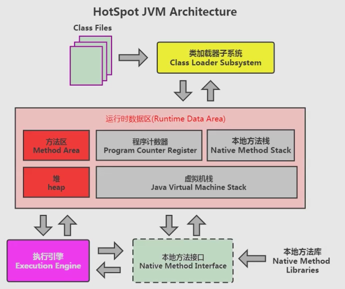 

这个架构可以分成三层看：

- 最上层：javac编译器将编译好的字节码class文件，通过java 类装载器执行机制，把对象或class文件存放在 jvm划分内存区域。
- 中间层：称为Runtime Data Area，主要是在Java代码运行时用于存放数据的，从左至右为方法区、堆、栈、程序计数器、寄存器、本地方法栈(私有)。
- 最下层：解释器、JIT(just in time)编译器和 GC（Garbage Collection，垃圾回收器）

### 字节码文件

字节码文件总共可以分为以下几个部分：
- 基础信息：魔数、字节码文件对应的Java版本号、访问标识(public final等等)、父类和接口信息
- 常量池： 保存了字符串常量、类或接口名、字段名，主要在字节码指令中使用
- 字段： 当前类或接口声明的字段信息
- 方法： 当前类或接口声明的方法信息，核心内容为方法的字节码指令
- 属性： 类的属性，比如源码的文件名、内部类的列表等

### 类生命周期

#### 加载阶段-Loading

加载(Loading)阶段第一步是类加载器根据类的全限定名通过不同的渠道以二进制流的方式获取字节码信息，程序员可以使用Java代码拓展的不同的渠道。

- 从本地磁盘上获取文件
- 运行时通过动态代理生成，比如Spring框架
- Applet技术通过网络获取字节码文件

类加载器在加载完类之后，Java虚拟机会将字节码中的信息保存到方法区中，方法区中生成一个InstanceKlass对象，保存类的所有信息，里边还包含实现特定功能比如多态的信息。


Java虚拟机同时会在堆上生成与方法区中数据类似的java.lang.Class对象，作用是在Java代码中去获取类的信息以及存储静态字段的数据（JDK8及之后）。


#### 连接阶段-Linking

连接阶段分为三个子阶段:

- 验证，验证内容是否满足《Java虚拟机规范》。
- 准备，给静态变量赋初值。
- 解析，将常量池中的符号引用替换成指向内存的直接引用。

**验证**

验证的主要目的是检测Java字节码文件是否遵守了《Java虚拟机规范》中的约束。这个阶段一般不需要程序员参与。主要包含如下四部分，具体详见《Java虚拟机规范》：

1、文件格式验证，比如文件是否以0xCAFEBABE开头，主次版本号是否满足当前Java虚拟机版本要求。


2、元信息验证，例如类必须有父类（super不能为空）。

3、验证程序执行指令的语义，比如方法内的指令执行中跳转到不正确的位置。

4、符号引用验证，例如是否访问了其他类中private的方法等。

**准备**

准备阶段为静态变量（static）分配内存并设置初值，每一种基本数据类型和引用数据类型都有其初值。

| **数据类型**     | **初始值**   |
| ---------------- | ------------ |
| **int**          | **0**        |
| **long**         | **0L**       |
| **short**        | **0**        |
| **char**         | **‘\u0000’** |
| **byte**         | **0**        |
| **boolean**      | **false**    |
| **double**       | **0.0**      |
| **引用数据类型** | **null**     |

如下代码：

```java
public class Student{
	public static int value = 1;
}
// 在准备阶段会为value分配内存并赋初值为0，在初始化阶段才会将值修改为1。
// final修饰的基本数据类型的静态变量，准备阶段直接会将代码中的值进行赋值。
```

**解析**

解析阶段主要是将常量池中的符号引用替换为直接引用，符号引用就是在字节码文件中使用编号来访问常量池中的内容。


直接引用不在使用编号，而是使用内存中地址进行访问具体的数据。


#### 初始化阶段-Initialization

初始化阶段会执行字节码文件中clinit（class init 类的初始化）方法的字节码指令，包含了静态代码块中的代码，并为静态变量赋值。

如下代码编译成字节码文件之后，会生成三个方法：

- init方法，会在对象初始化时执行
- main方法，主方法
- clinit方法，类的初始化阶段执行


**以下几种方式会导致类的初始化**：

1、访问一个类的静态变量或者静态方法，注意变量是final修饰的并且等号右边是常量不会触发初始化。

2、调用Class.forName(String className)。

3、new一个该类的对象时。

4、执行Main方法的当前类。

添加-XX:+TraceClassLoading 参数可以打印出加载并初始化的类


**clinit不会执行的几种情况**：

如下几种情况是不会进行初始化指令执行的：

1.无静态代码块且无静态变量赋值语句。

2.有静态变量的声明，但是没有赋值语句。


3.静态变量的定义使用final关键字，这类变量会在准备阶段直接进行初始化。


#### 使用阶段-Using


#### 卸载阶段-Unloadingb

### 类加载器

#### 什么是类加载器

类加载器（ClassLoader）是Java虚拟机提供给应用程序去实现获取类和接口字节码数据的技术，类加载器只参与加载过程中的字节码获取并加载到内存这一部分。

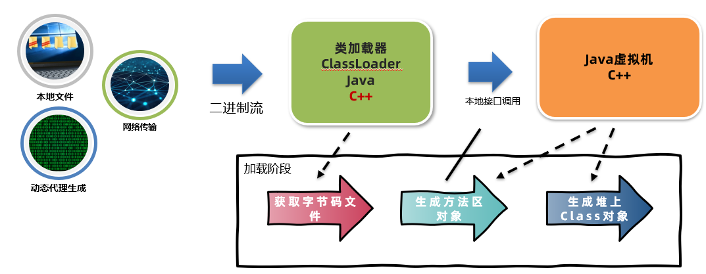

类加载器会通过二进制流的方式获取到字节码文件的内容，接下来将获取到的数据交给Java虚拟机，虚拟机会在方法区和堆上生成对应的对象保存字节码信息。

#### 类加载器的分类

类加载器分为两类，一类是Java代码中实现的，一类是Java虚拟机底层源码实现的。

- 虚拟机底层实现：源代码位于Java虚拟机的源码中，实现语言与虚拟机底层语言一致，比如Hotspot使用C++。主要目的是保证Java程序运行中基础类被正确地加载，比如java.lang.String，Java虚拟机需要确保其可靠性。
- JDK中默认提供或者自定义：JDK中默认提供了多种处理不同渠道的类加载器，程序员也可以自己根据需求定制，使用Java语言。所有Java中实现的类加载器都需要继承ClassLoader这个抽象类。

类加载器的设计 jdk8和8之后的版本差别较大，首先来看jdk8及之前的版本，这些版本中默认的类加载器有如下几种：


类加载器的详细信息可以通过Arthas的classloader命令查看：

> `classloader` - 查看 classloader 的继承树，urls，类加载信息，使用 classloader 去 getResource


- `BootstrapClassLoader`是启动类加载器，`numberOfInstances`是类加载器的数量只有1个，`loadedCountTotal`是加载类的数量1861个。
- `ExtClassLoader`是扩展类加载器
- `AppClassLoader`是应用程序类加载器

#### 启动类加载器

- 启动类加载器（Bootstrap ClassLoader）是由Hotspot虚拟机提供的、使用C++编写的类加载器。
- 默认加载Java安装目录/jre/lib下的类文件，比如rt.jar，tools.jar，resources.jar等。

运行如下代码：

```java
/**
 * 启动程序类加载器案例
 */
public class BootstrapClassLoaderDemo {
    public static void main(String[] args) throws IOException {
        ClassLoader classLoader = String.class.getClassLoader();
        System.out.println(classLoader);

        System.in.read();
    }
}
```

这段代码通过String类获取到它的类加载器并且打印，结果是`null`。这是因为启动类加载器在JDK8中是由C++语言来编写的，在Java代码中去获取既不适合也不安全，所以才返回`null`

在Arthas中可以通过`sc -d 类名`的方式查看加载这个类的类加载器详细的信息，比如：


通过上图可以看到，java.lang.String类的类加载器是空的，Hash值也是null。

**用户扩展基础jar包**

如果用户想扩展一些比较基础的jar包，让启动类加载器加载，有两种途径：

- **放入jre/lib下进行扩展**。不推荐，尽可能不要去更改JDK安装目录中的内容，会出现即时放进去由于文件名不匹配的问题也不会正常地被加载。
- **使用参数进行扩展。**推荐，使用`-Xbootclasspath/a:jar包目录/jar包名` 进行扩展，参数中的`/a`代表新增。

如下图，在IDEA配置中添加虚拟机参数，就可以加载`D:/jvm/jar/classloader-test.jar`这个jar包了。

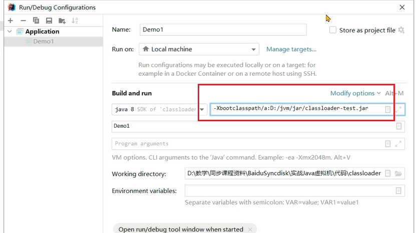

#### 扩展类加载器

**扩展类加载器和应用程序类加载器概述**

- 扩展类加载器和应用程序类加载器都是JDK中提供的、使用Java编写的类加载器。
- 它们的源码都位于sun.misc.Launcher中，是一个静态内部类。继承自URLClassLoader。具备通过目录或者指定jar包将字节码文件加载到内存中。

继承关系图如下：

- ClassLoader类定义了具体的行为模式，简单来说就是先从本地或者网络获得字节码信息，然后调用虚拟机底层的方法创建方法区和堆上的对象。这样的好处就是让子类只需要去实现如何获取字节码信息这部分代码。
- SecureClassLoader提供了证书机制，提升了安全性。
- URLClassLoader提供了根据URL获取目录下或者指定jar包进行加载，获取字节码的数据。
- 扩展类加载器和应用程序类加载器继承自URLClassLoader，获得了上述的三种能力。


扩展类加载器（Extension Class Loader）是JDK中提供的、使用Java编写的类加载器。默认加载Java安装目录/jre/lib/ext下的类文件。


如下代码会打印ScriptEnvironment类的类加载器。ScriptEnvironment是nashorn框架中用来运行javascript语言代码的环境类，他位于nashorn.jar包中被扩展类加载器加载

```java
/**
 * 扩展类加载器
 */
public class ExtClassLoaderDemo {
    public static void main(String[] args) throws IOException {
        ClassLoader classLoader = ScriptEnvironment.class.getClassLoader();
        System.out.println(classLoader);
    }
}
// sun.misc.Launcher$ExtClassLoader@85ede7b
```

通过扩展类加载器去加载用户jar包：

- **放入/jre/lib/ext下进行扩展**。不推荐，尽可能不要去更改JDK安装目录中的内容。
- **使用参数进行扩展使用参数进行扩展**。推荐，使用`-Djava.ext.dirs=jar`包目录 进行扩展,这种方式会覆盖掉原始目录，可以用`;`(windows) `:`(macos/linux)追加上原始目录

如下图中：


使用`引号`将整个地址包裹起来，这样路径中即便是有空格也不需要额外处理。路径中要包含原来ext文件夹，同时在最后加上扩展的路径。

#### 应用程序类加载器

应用程序类加载器会加载classpath下的类文件，默认加载的是项目中的类以及通过maven引入的第三方jar包中的类。

如下案例中，打印出`Student`和`FileUtils`的类加载器：

```java
/**
 * 应用程序类加载器案例
 */
public class AppClassLoaderDemo {
    public static void main(String[] args) throws IOException, InterruptedException {
        //当前项目中创建的Student类
        Student student = new Student();
        ClassLoader classLoader = Student.class.getClassLoader();
        System.out.println(classLoader);
        //maven依赖中包含的类
        ClassLoader classLoader1 = FileUtils.class.getClassLoader();
        System.out.println(classLoader1);
        Thread.sleep(1000);
        System.in.read();
    }
}

// sun.misc.Launcher$AppClassLoader@18b4aac2
// sun.misc.Launcher$AppClassLoader@18b4aac2
```

这两个类均由应用程序类加载器加载。

类加载器的加载路径可以通过classloader –c hash值 查看：


### 双亲委派机制

#### 双亲委派概述

双亲委派机制指的是：当一个类加载器接收到加载类的任务时，会自底向上查找是否加载过，再由顶向下进行加载。

核心是解决一个类到底由谁加载的问题

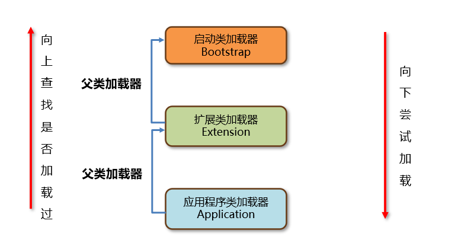

详细流程：

每个类加载器都有一个父类加载器。父类加载器的关系如下，启动类加载器没有父类加载器：


在类加载的过程中，每个类加载器都会先检查是否已经加载了该类，如果已经加载则直接返回，否则会将加载请求委派给父类加载器。

**示例1**

B类在扩展类加载器加载路径中，同样应用程序类加载器接到了加载任务，按照案例1中的方式一层一层向上查找，发现都没有加载过。那么启动类加载器会首先尝试加载。它发现这类不在它的加载目录中，向下传递给扩展类加载器。


扩展类加载器发现这个类在它加载路径中，加载成功并返回。


如果第二次再接收到加载任务，同样地向上查找。扩展类加载器发现已经加载过，就可以返回了。

#### 双亲委派机制的作用

1.保证类加载的安全性。通过双亲委派机制避免恶意代码替换JDK中的核心类库，比如java.lang.String，确保核心类库的完整性和安全性。

2.避免重复加载。双亲委派机制可以避免同一个类被多次加载。

#### 如何指定加载类的类加载器？

在Java中如何使用代码的方式去主动加载一个类呢？

方式1：使用Class.forName方法，使用当前类的类加载器去加载指定的类。

方式2：获取到类加载器，通过类加载器的loadClass方法指定某个类加载器加载。

例如：


**问题：**

1、如果一个类重复出现在三个类加载器的加载位置，应该由谁来加载？

启动类加载器加载，根据双亲委派机制，它的优先级是最高的

2、String类能覆盖吗，在自己的项目中去创建一个java.lang.String类，会被加载吗？

不能，会返回启动类加载器加载在rt.jar包中的String类。

3、**类的双亲委派机制是什么？**

- 当一个类加载器去加载某个类的时候，会自底向上查找是否加载过，如果加载过就直接返回，如果一直到最顶层的类加载器都没有加载，再由顶向下进行加载。
- 应用程序类加载器的父类加载器是扩展类加载器，扩展类加载器的父类加载器是启动类加载器。
- 双亲委派机制的好处有两点：第一是避免恶意代码替换JDK中的核心类库，比如java.lang.String，确保核心类库的完整性和安全性。第二是避免一个类重复地被加载。

#### 打破双亲委派机制

打破双亲委派机制历史上有三种方式，但本质上只有第一种算是真正的打破了双亲委派机制：

- 自定义类加载器并且重写loadClass方法。Tomcat通过这种方式实现应用之间类隔离
- 线程上下文类加载器。利用上下文类加载器加载类，比如JDBC和JNDI等。
- Osgi框架的类加载器。历史上Osgi框架实现了一套新的类加载器机制，允许同级之间委托进行类的加载，目前很少使用。

**自定义类加载器**

自定义类加载器打破双亲委派机制的主要不实现向上委托父类加载器加载类

ClassLoader中包含了4个核心方法，双亲委派机制的核心代码就位于loadClass方法中。

```java
public Class<?> loadClass(String name)
类加载的入口，提供了双亲委派机制。内部会调用findClass   重要

protected Class<?> findClass(String name)
由类加载器子类实现,获取二进制数据调用defineClass ，比如URLClassLoader会根据文件路径去获取类文件中的二进制数据。重要

protected final Class<?> defineClass(String name, byte[] b, int off, int len)
做一些类名的校验，然后调用虚拟机底层的方法将字节码信息加载到虚拟机内存中

protected final void resolveClass(Class<?> c)
执行类生命周期中的连接阶段
```

1、入口方法：

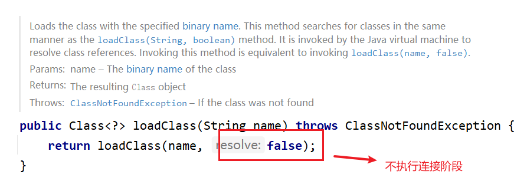

2、再进入看下：

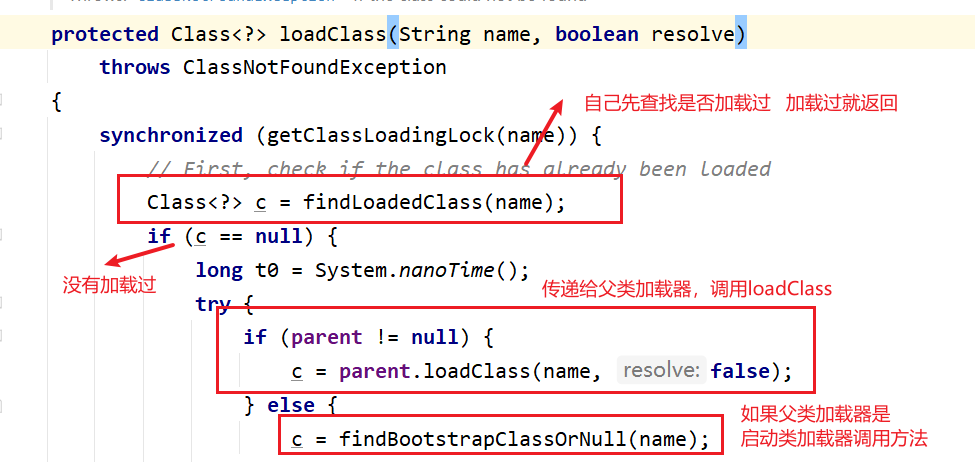

如果查找都失败，进入加载阶段，首先会由启动类加载器加载，这段代码在`findBootstrapClassOrNull`中。如果失败会抛出异常，接下来执行下面这段代码：


父类加载器加载失败就会抛出异常，回到子类加载器的这段代码，这样就实现了加载并向下传递。

3、最后根据传入的参数判断是否进入连接阶段：

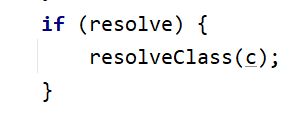


### JDK9之后的类加载器

JDK8及之前的版本中，扩展类加载器和应用程序类加载器的源码位于rt.jar包中的sun.misc.Launcher.java。


由于JDK9引入了module的概念，类加载器在设计上发生了很多变化。

1. 启动类加载器使用Java编写，位于jdk.internal.loader.ClassLoaders类中。

   Java中的BootClassLoader继承自BuiltinClassLoader实现从模块中找到要加载的字节码资源文件。

   启动类加载器依然无法通过java代码获取到，返回的仍然是null，保持了统一。

2. 扩展类加载器被替换成了平台类加载器（Platform Class Loader）。

   平台类加载器遵循模块化方式加载字节码文件，所以继承关系从URLClassLoader变成了BuiltinClassLoader，BuiltinClassLoader实现了从模块中加载字节码文件。平台类加载器的存在更多的是为了与老版本的设计方案兼容，自身没有特殊的逻辑。

### 运行时数据区

Java虚拟机在运行Java程序过程中管理的内存区域，称之为运行时数据区。《Java虚拟机规范》中规定了每一部分的作用。


#### 程序计数器

程序计数器（Program Counter Register）也叫PC寄存器，每个线程会通过程序计数器记录当前要执行的的字节码指令的地址。


在多线程执行情况下，Java虚拟机需要通过程序计数器记录CPU切换前解释执行到那一句指令并继续解释运行。


**程序计数器会出现内存溢出吗**？

**内存溢出**指的是程序在使用某一块内存区域时，存放的数据需要占用的内存大小超过了虚拟机能提供的内存上限。由于每个线程只存储一个固定长度的内存地址，程序计数器是不会发生内存溢出的。程序员无需对程序计数器做任何处理。

#### Java虚拟机栈

Java虚拟机栈（Java Virtual Machine Stack）采用栈的数据结构来管理方法调用中的基本数据，先进后出（First In Last Out）,每一个方法的调用使用一个栈帧（Stack Frame）来保存。

```java
package chapter03.frame;

/**
 * 栈帧测试1
 */
public class FrameDemo {
    public static void main(String[] args) {
        A();
    }

    public static void A() {
        System.out.println("A执行了...");
        B();
    }

    public static void B() {
        System.out.println("B执行了...");
        C();
    }

    public static void C() {
        System.out.println("C执行了...");
        throw new RuntimeException("测试");
    }
}
```

打上断点debug之后会出现栈帧内容：


Java虚拟机栈随着线程的创建而创建，而回收则会在线程的销毁时进行。由于方法可能会在不同线程中执行，每个线程都会包含一个自己的虚拟机栈。如下就有两个线程的虚拟机栈，main线程和线程A。

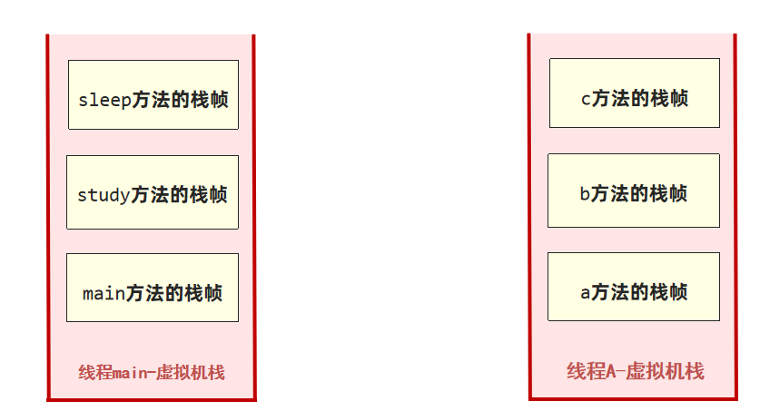

Java虚拟机栈的栈帧中主要包含三方面的内容：

- 局部变量表，局部变量表的作用是在运行过程中存放所有的局部变量
- 操作数栈，操作数栈是栈帧中虚拟机在执行指令过程中用来存放临时数据的一块区域
- 帧数据，帧数据主要包含动态链接、方法出口、异常表的引用

##### 局部变量表

局部变量表的作用是在方法执行过程中存放所有的局部变量。局部变量表分为两种，一种是字节码文件中的，另外一种是栈帧中的也就是保存在内存中。栈帧中的局部变量表是根据字节码文件中的内容生成的。

局部变量表是一个数组，数组中每一个位置称之为槽(slot) ，long和double类型占用两个槽，其他类型占用一个槽。

通常情况下，通过指令`istore_index` 将操作数栈中顶部的数据存入局部变量表的`index`位置


对于不再使用的变量占用的槽位，后续变量声明时可以占用

##### 操作数栈

操作数栈是栈帧中虚拟机在执行指令过程中用来存放中间数据的一块区域。他是一种栈式的数据结构，如果一条指令将一个值压入操作数栈，则后面的指令可以弹出并使用该值。

在编译期就可以确定操作数栈的最大深度，从而在执行时正确的分配内存大小。

通常情况下，通过指令`iconst_num`将`num`存入操作数栈

##### 帧数据

帧数据主要包含动态链接、方法出口、异常表的引用。

**动态链接**：

当前类的字节码指令引用了其他类的属性或者方法时，需要将符号引用（编号）转换成对应的运行时常量池中的内存地址。动态链接就保存了编号到运行时常量池的内存地址的映射关系。

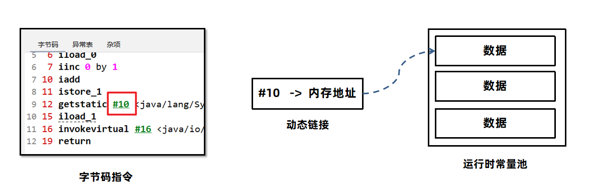

**方法出口**

方法出口指的是方法在正确或者异常结束时，当前栈帧会被弹出，同时程序计数器应该指向上一个栈帧中的下一条指令的地址。所以在当前栈帧中，需要存储此方法出口的地址。


**异常表**

异常表存放的是代码中异常的处理信息，包含了异常捕获的生效范围以及异常发生后跳转到的字节码指令位置。


`如下案例：i=1`这行源代码编译成字节码指令之后，会包含偏移量2-4这三行指令。其中2-3是对i进行赋值1的操作，4的没有异常就跳转到10方法结束。如果出现异常的情况下，继续执行到7这行指令，7会将异常对象放入操作数栈中，这样在catch代码块中就可以使用异常对象了。接下来执行8-9，对i进行赋值为2的操作。


所以异常表中，异常捕获的起始偏移量就是2，结束偏移量是4，在2-4执行过程中抛出了`java.lang.Exception`对象或者子类对象，就会将其捕获，然后跳转到偏移量为7的指令。

##### 栈内存溢出

Java虚拟机栈如果栈帧过多，占用内存超过栈内存可以分配的最大大小就会出现内存溢出。Java虚拟机栈内存溢出时会出现StackOverflowError的错误。

如果我们不指定栈的大小，JVM 将创建一个具有默认大小的栈。大小取决于操作系统和计算机的体系结构。


要修改Java虚拟机栈的大小，可以使用虚拟机参数 `-Xss` 。

- 语法：`-Xss栈大小`
- 单位：字节（默认，必须是 1024 的倍数）、k或者K(KB)、m或者M(MB)、g或者G(GB)

例如：

```Java
-Xss1048576 
-Xss1024K      
-Xss1m
-Xss1g
```

**注意事项：**

1、与`-Xss`类似，也可以使用` -XX:ThreadStackSize` 调整标志来配置堆栈大小。

格式为： `-XX:ThreadStackSize=1024`

2、HotSpot JVM对栈大小的最大值和最小值有要求：

​      比如测试如下两个参数，会直接报错:

```
-Xss1k
-Xss1025m
```

Windows（64位）下的JDK8测试最小值为`180k`，最大值为`1024m`。

3、局部变量过多、操作数栈深度过大也会影响栈内存的大小。

一般情况下，工作中即便使用了递归进行操作，栈的深度最多也只能到几百,不会出现栈的溢出。所以此参数可以手动指定为-Xss256k节省内存。

#### 本地方法栈

Java虚拟机栈存储了Java方法调用时的栈帧，而本地方法栈存储的是native本地方法的栈帧。

在Hotspot虚拟机中，Java虚拟机栈和本地方法栈实现上使用了同一个栈空间。本地方法栈会在栈内存上生成一个栈帧，临时保存方法的参数同时方便出现异常时也把本地方法的栈信息打印出来。


#### 堆内存

一般Java程序中堆内存是空间最大的一块内存区域。创建出来的对象都存在于堆上。栈上的局部变量表中，可以存放堆上对象的引用。静态变量也可以存放堆对象的引用，通过静态变量就可以实现对象在线程之间共享。

```Java
public class Test {    
    public static void main(String[] args) {        
        Student s1 = new Student();        
        s1.name = "张三";       
        s1.age = 18;       
        s1.id = 1;
        s1.printTotalScore();        
        s1.printAverageScore();        
        
        Student s2 = new Student();       
        s2.name = "李四";        
        s2.age = 19;        
        s2.id= 2;        
        s2.printTotalScore();        
        s2.printAverageScore();    
    }
}
```

这段代码中通过`new`关键字创建了两个`Student`类的对象，这两个对象会被存放在堆上。在栈上通过`s1`和`s2`两个局部变量保存堆上两个对象的地址，从而实现了引用关系的建立。


##### 堆内存的溢出

堆内存大小是有上限的，当对象一直向堆中放入对象达到上限之后，就会抛出OutOfMemory错误。在这段代码中，不停创建100M大小的字节数组并放入ArrayList集合中，最终超过了堆内存的上限。抛出如下错误：


##### 三个重要的值

堆空间有三个需要关注的值，`used`、`total`、`max`。`used`指的是当前已使用的堆内存，`total`是java虚拟机已经分配的可用堆内存，`max`是java虚拟机可以分配的最大堆内存。

堆内存used total max三个值可以通过dashboard命令看到。

> 手动指定刷新频率（不指定默认5秒一次）：`dashboard –i  刷新频率(毫秒)`

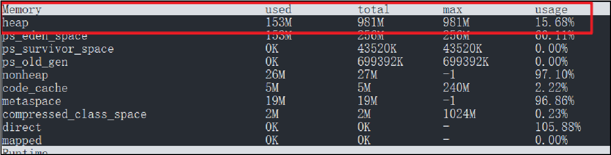

随着堆中的对象增多，当total可以使用的内存即将不足时，java虚拟机会继续分配内存给堆。

此时used达到了total的大小，Java虚拟机会向操作系统申请更大的内存。

但是这个申请过程不是无限的，total最多只能与max相等。

如果不设置任何的虚拟机参数，max默认是系统内存的1/4，total默认是系统内存的1/64。在实际应用中一般都需要设置total和max的值。

##### 设置堆的大小

要修改堆的大小，可以使用虚拟机参数 –Xmx（max最大值）和-Xms (初始的total)。

语法：`-Xmx值 -Xms值`

单位：字节（默认，必须是 1024 的倍数）、k或者K(KB)、m或者M(MB)、g或者G(GB)

限制：Xmx必须大于 2 MB，Xms必须大于1MB

```Java
-Xms6291456
-Xms6144k
-Xms6m
-Xmx83886080
-Xmx81920k
-Xmx80m
```

这样可以将max和初始的total都设置为4g，在启动后就已经获得了最大的堆内存大小。运行过程中不需要向操作系统申请。


Java服务端程序开发时，建议将-Xmx和-Xms设置为相同的值，这样在程序启动之后可使用的总内存就是最大内存，而无需向java虚拟机再次申请，减少了申请并分配内存时间上的开销，同时也不会出现内存过剩之后堆收缩的情况。

#### 方法区

方法区是存放基础信息的位置，线程共享，主要包含三部分内容：

- 类的元信息，保存了所有类的基本信息
- 运行时常量池，保存了字节码文件中的常量池内容
- 字符串常量池，保存了字符串常量

##### 方法区的实现

方法区是《Java虚拟机规范》中设计的虚拟概念，每款Java虚拟机在实现上都各不相同。

Hotspot设计如下：

JDK7及之前的版本将方法区存放在堆区域中的永久代空间，堆的大小由虚拟机参数来控制。

JDK8及之后的版本将方法区存放在元空间中，元空间位于操作系统维护的直接内存中，默认情况下只要不超过操作系统承受的上限，可以一直分配。


##### 方法区的溢出

JDK7和JDK8在方法区的存放上，采用了不同的设计。

- JDK7将方法区存放在堆区域中的永久代空间，堆的大小由虚拟机参数-XX:MaxPermSize=值来控制。
- JDK8将方法区存放在元空间中，元空间位于操作系统维护的直接内存中，默认情况下只要不超过操作系统承受的上限，可以一直分配。可以使用-XX:MaxMetaspaceSize=值将元空间最大大小进行限制。


##### 类的元信息

方法区是用来存储每个类的基本信息（元信息），一般称之为InstanceKlass对象。在类的加载阶段完成。其中就包含了类的字段、方法等字节码文件中的内容，同时还保存了运行过程中需要使用的虚方法表（实现多态的基础）等信息。

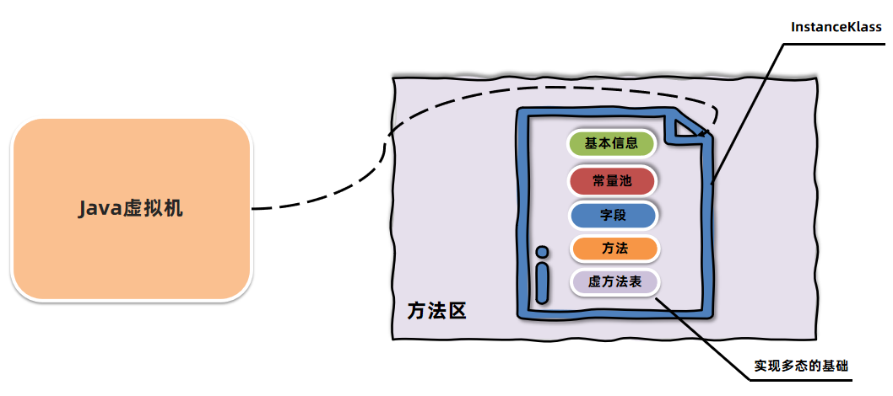

##### 运行时常量池

方法区除了存储类的元信息之外，还存放了运行时常量池。常量池中存放的是字节码中的常量池内容。

字节码文件中通过编号查表的方式找到常量，这种常量池称为静态常量池。当常量池加载到内存中之后，可以通过内存地址快速的定位到常量池中的内容，这种常量池称为运行时常量池。


##### 字符串常量池

方法区中除了类的元信息、运行时常量池之外，还有一块区域叫字符串常量池(StringTable)。

字符串常量池存储在代码中定义的常量字符串内容。比如“123” 这个123就会被放入字符串常量池。

如下代码执行时，代码中包含`abc`字符串，就会被直接放入字符串常量池。在堆上创建String对象，并通过局部变量s1引用堆上的对象。


接下来通过s2局部变量引用字符串常量池的`abc`。


所以s1和s2指向的不是同一个对象，打印出`false`。

**字符串常量池和运行时常量池有什么关系？**

早期设计时，字符串常量池是属于运行时常量池的一部分，他们存储的位置也是一致的。后续做出了调整，将字符串常量池和运行时常量池做了拆分。


**intern**

JDK6及以前，String.intern()方法是可以手动将字符串放入字符串常量池中并返回对象引用

```Java
/**
 * intern案例
 */
public class Demo4 {
    public static void main(String[] args) {
        String s1 = new StringBuilder().append("think").append("123").toString();

        System.out.println(s1.intern() == s1);
//        System.out.println(s1.intern() == s1.intern());

        String s2 = new StringBuilder().append("ja").append("va").toString();

        System.out.println(s2.intern() == s2);
    }
}
```


这里注意字符串常量池中本来就有一个java字符串对象，这是java虚拟机自身使用的所以启动时就会创建出来。

JDK7及之后版本中由于字符串常量池在堆上，所以intern () 方法会把第一次遇到的字符串的引用放入字符串常量池。


**静态变量存储在哪里呢**？

- JDK6及之前的版本中，静态变量是存放在方法区中的，也就是永久代。
- JDK7及之后的版本中，静态变量是存放在堆中的Class对象中，脱离了永久代。具体源码可参考虚拟机源码：BytecodeInterpreter针对putstatic指令的处理。

#### 直接内存

##### 概述

直接内存（Direct Memory）并不在《Java虚拟机规范》中存在，所以并不属于Java运行时的内存区域。

在 JDK 1.4 中引入了 NIO 机制，使用了直接内存，主要为了解决以下两个问题:

1、Java堆中的对象如果不再使用要回收，回收时会影响对象的创建和使用。

2、IO操作比如读文件，需要先把文件读入直接内存（缓冲区）再把数据复制到Java堆中。

现在直接放入直接内存即可，同时Java堆上维护直接内存的引用，减少了数据复制的开销。写文件也是类似的思路。

使用堆创建对象的过程：


使用直接内存创建对象的过程，不需要进行复制对象，数据直接存放在直接内存中：


##### 使用方法：

要创建直接内存上的数据，可以使用`ByteBuffer`。

语法： `ByteBuffer directBuffer = ByteBuffer.allocateDirect(size);`

注意事项： arthas的memory命令可以查看直接内存大小，属性名direct。


工作中服务器上有可能部署了其他应用，为了避免将内存耗尽，需要设置直接内存的最大值。如果需要手动调整直接内存的大小，可以使用`XX:MaxDirectMemorySize=大小`

单位k或K表示千字节，m或M表示兆字节，g或G表示千兆字节。默认不设置该参数情况下，JVM 自动选择 最大分配的大小。

以下示例以不同的单位说明如何将 直接内存大小设置为 1024 KB：

```Java
-XX:MaxDirectMemorySize=1m
-XX:MaxDirectMemorySize=1024k
-XX:MaxDirectMemorySize=1048576
```

### 垃圾回收

在C/C++这类没有自动垃圾回收机制的语言中，一个对象如果不再使用，需要手动释放，否则就会出现内存泄漏。

内存泄漏指的是不再使用的对象在系统中未被回收，内存泄漏的积累可能会导致内存溢出。   

我们称释放对象的过程为垃圾回收，而需要程序员编写代码进行回收的方式为手动回收。手动回收的方式相对来说回收比较及时，删除代码执行之后对象就被回收了，可以快速释放内存。缺点是对程序员要求比较高，很容易出现创建完对象之后，程序员忘记释放对象。

Java中为了简化对象的释放，引入了自动的垃圾回收（Garbage Collection简称GC）机制。通过垃圾回收器来对不再使用的对象完成自动的回收，垃圾回收器主要负责对堆上的内存进行回收。其他很多现代语言比如C#、Python、Go都拥有自己的垃圾回收器。

垃圾回收器如果发现某个对象不再使用，就可以回收该对象。

- 自动垃圾回收，自动根据对象是否使用由虚拟机来回收对象
  - 优点：降低程序员实现难度、降低对象回收bug的可能性
  - 缺点：程序员无法控制内存回收的及时性
- 手动垃圾回收，由程序员编程实现对象的删除
  - 优点：回收及时性高，由程序员把控回收的时机
  - 缺点：编写不当容易出现悬空指针、重复释放、内存泄漏等问题

那么垃圾回收器需要负责对哪些部分的内存进行回收呢？

首先是线程不共享的部分，都是伴随着线程的创建而创建，线程的销毁而销毁。而方法的栈帧在执行完方法之后就会自动弹出栈并释放掉对应的内存。所以这一部分不需要垃圾回收器负责回收。


#### 方法区的回收

方法区中能回收的内容主要就是不再使用的类。

判定一个类可以被卸载。需要同时满足下面三个条件：

1、此类所有实例对象都已经被回收，在堆中不存在任何该类的实例对象以及子类对象。

这段代码中就将局部变量对堆上实例对象的引用去除了，所以对象就可以被回收。


2、加载该类的类加载器已经被回收。

这段代码让局部变量对类加载器的引用去除，类加载器就可以回收。


3、该类对应的 java.lang.Class 对象没有在任何地方被引用。


#### 判断对象可否回收的方法

垃圾回收器要回收对象的第一步就是判断哪些对象可以回收。Java中的对象是否能被回收，是根据对象是否被引用来决定的。如果对象被引用了，说明该对象还在使用，不允许被回收。

##### 引用计数法

引用计数法会为每个对象维护一个引用计数器，当对象被引用时加1，取消引用时减1。

比如下图中，对象A的计数器初始为0，局部变量a1对它引用之后，计数器加1就变成了1。同样A对B产生了引用，B的计数器也是1。


引用计数法的优点是实现简单，C++中的智能指针就采用了引用计数法，但是它也存在缺点，主要有两点：

1.每次引用和取消引用都需要维护计数器，对系统性能会有一定的影响

2.存在循环引用问题，所谓循环引用就是当A引用B，B同时引用A时会出现对象无法回收的问题。

这张图上，由于A和B之间存在互相引用，所以计数器都为1，两个对象都不能被回收。但是由于没有局部变量对这两个代码产生引用，代码中已经无法访问到这两个对象，理应可以被回收。

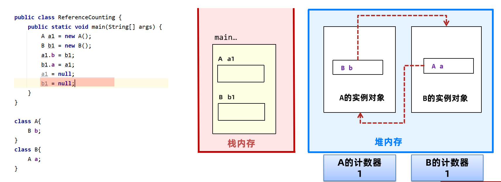

我们来做一个实验，验证下Java中循环引用不会导致内存泄漏，因为Java虚拟机根本没有使用引用计数法。首先我们要学会去看一个对象有没有被回收，可以通过垃圾回收日志来查看。

如果想要查看垃圾回收的信息，可以使用`-verbose:gc`参数。

语法： `-verbose:gc`


##### 可达性分析法

Java使用的是可达性分析算法来判断对象是否可以被回收。可达性分析将对象分为两类：垃圾回收的根对象（GC Root）和普通对象，对象与对象之间存在引用关系。

下图中A到B再到C和D，形成了一个引用链，可达性分析算法指的是如果从某个到GC Root对象是可达的，对象就不可被回收。


哪些对象被称之为GC Root对象呢？

- 线程Thread对象，引用线程栈帧中的方法参数、局部变量等。
- 系统类加载器加载的java.lang.Class对象，引用类中的静态变量。


- 监视器对象，用来保存同步锁synchronized关键字持有的对象。


- 本地方法调用时使用的全局对象。

通过arthas和eclipse Memory Analyzer (MAT) 工具可以查看GC Root，MAT工具是eclipse推出的Java堆内存检测工具。具体操作步骤如下：

1、使用arthas的heapdump命令将堆内存快照保存到本地磁盘中。

2、使用MAT工具打开堆内存快照文件。

3、选择GC Roots功能查看所有的GC Root。

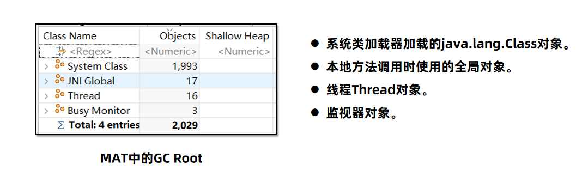

#### 常见引用对象

##### 强引用

GCRoot对象对普通对象有引用关系，只要这层关系存在，普通对象就不会被回收

##### 软引用

软引用相对于强引用是一种比较弱的引用关系，如果一个对象只有软引用关联到它，当程序内存不足时，就会将软引用中的数据进行回收。

**软引用的使用方法**

软引用的执行过程如下：

1.将对象使用软引用包装起来，new SoftReference<对象类型>(对象)。

2.内存不足时，虚拟机尝试进行垃圾回收。

3.如果垃圾回收仍不能解决内存不足的问题，回收软引用中的对象。

4.如果依然内存不足，抛出OutOfMemory异常。

**软引用对象本身怎么回收呢**？

如果软引用对象里边包含的数据已经被回收了，那么软引用对象本身其实也可以被回收了。

SoftReference提供了一套队列机制：

1、软引用创建时，通过构造器传入引用队列

2、在软引用中包含的对象被回收时，该软引用对象会被放入引用队列

3、通过代码遍历引用队列，将SoftReference的强引用删除

```Java
/**
 * 软引用案例3 - 引用队列使用
 */
public class SoftReferenceDemo3 {

    public static void main(String[] args) throws IOException {

        ArrayList<SoftReference> softReferences = new ArrayList<>();
        ReferenceQueue<byte[]> queues = new ReferenceQueue<byte[]>();
        for (int i = 0; i < 10; i++) {
            byte[] bytes = new byte[1024 * 1024 * 100];
            SoftReference studentRef = new SoftReference<byte[]>(bytes,queues);
            softReferences.add(studentRef);
        }

        SoftReference<byte[]> ref = null;
        int count = 0;
        while ((ref = (SoftReference<byte[]>) queues.poll()) != null) {
            count++;
        }
        System.out.println(count);
    }
}
```

##### 弱引用

弱引用的整体机制和软引用基本一致，区别在于弱引用包含的对象在垃圾回收时，不管内存够不够都会直接被回收。

##### 虚引用和终结器引用

这两种引用在常规开发中是不会使用的。

- 虚引用也叫幽灵引用/幻影引用，不能通过虚引用对象获取到包含的对象。虚引用唯一的用途是当对象被垃圾回收器回收时可以接收到对应的通知。Java中使用PhantomReference实现了虚引用，直接内存中为了及时知道直接内存对象不再使用，从而回收内存，使用了虚引用来实现。

- 终结器引用指的是在对象需要被回收时，终结器引用会关联对象并放置在Finalizer类中的引用队列中，在稍后由一条由FinalizerThread线程从队列中获取对象，然后执行对象的finalize方法，在对象第二次被回收时，该对象才真正的被回收。在这个过程中可以在finalize方法中再将自身对象使用强引用关联上，但是不建议这样做。

#### 垃圾回收算法

Java是如何实现垃圾回收的呢？简单来说，垃圾回收要做的有两件事：

1、找到内存中存活的对象

2、释放不再存活对象的内存，使得程序能再次利用这部分空间 

##### 回收算法的历史和分类

1960年John McCarthy发布了第一个GC算法：标记-清除算法。

1963年Marvin L. Minsky 发布了复制算法。

本质上后续所有的垃圾回收算法，都是在上述两种算法的基础上优化而来。

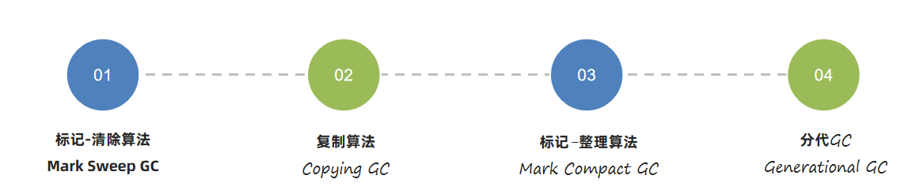

##### 回收算法的评价标准

Java垃圾回收过程会通过单独的GC线程来完成，但是不管使用哪一种GC算法，都会有部分阶段需要停止所有的用户线程。这个过程被称之为Stop The World简称STW，如果STW时间过长则会影响用户的使用。

如下图，用户代码执行和垃圾回收执行让用户线程停止执行（STW）是交替执行的。

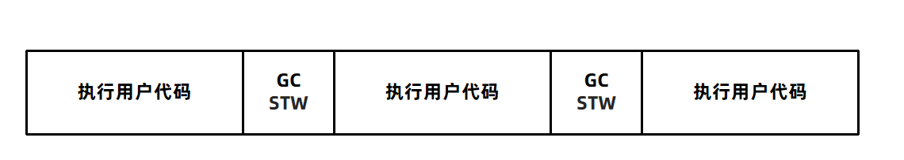

所以判断GC算法是否优秀，可以从三个方面来考虑：

1.吞吐量

吞吐量指的是 CPU 用于执行用户代码的时间与 CPU 总执行时间的比值，即吞吐量 = 执行用户代码时间 /（执行用户代码时间 + GC时间）。吞吐量数值越高，垃圾回收的效率就越高。


2.最大暂停时间

最大暂停时间指的是所有在垃圾回收过程中的STW时间最大值。比如如下的图中，黄色部分的STW就是最大暂停时间，显而易见上面的图比下面的图拥有更少的最大暂停时间。最大暂停时间越短，用户使用系统时受到的影响就越短。

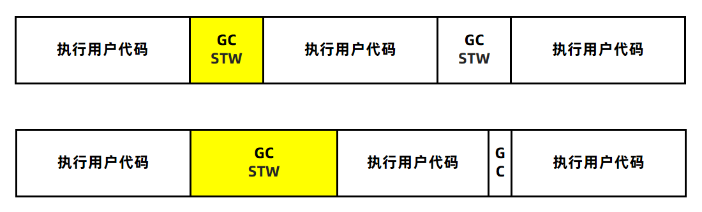

3.堆使用效率

不同垃圾回收算法，对堆内存的使用方式是不同的。比如标记清除算法，可以使用完整的堆内存。而复制算法会将堆内存一分为二，每次只能使用一半内存。从堆使用效率上来说，标记清除算法要优于复制算法。

上述三种评价标准：堆使用效率、吞吐量，以及最大暂停时间不可兼得。

一般来说，堆内存越大，最大暂停时间就越长。想要减少最大暂停时间，就会降低吞吐量。


没有一个垃圾回收算法能兼顾上述三点评价标准，所以不同的垃圾回收算法它的侧重点是不同的，适用于不同的应用场景。

##### 标记清除算法

标记清除算法的核心思想分为两个阶段：

1.标记阶段，将所有存活的对象进行标记。Java中使用可达性分析算法，从GC Root开始通过引用链遍历出所有存活对象。

2.清除阶段，从内存中删除没有被标记也就是非存活对象。

第一个阶段，从GC Root对象开始扫描，将对象A、B、C在引用链上的对象标记出来：

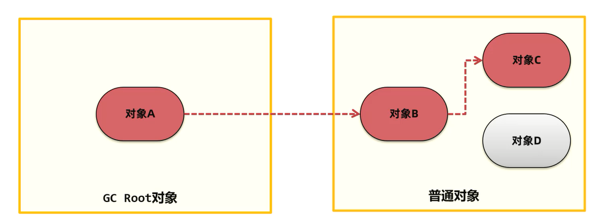

第二个阶段，将没有标记的对象清理掉，所以对象D就被清理掉了。

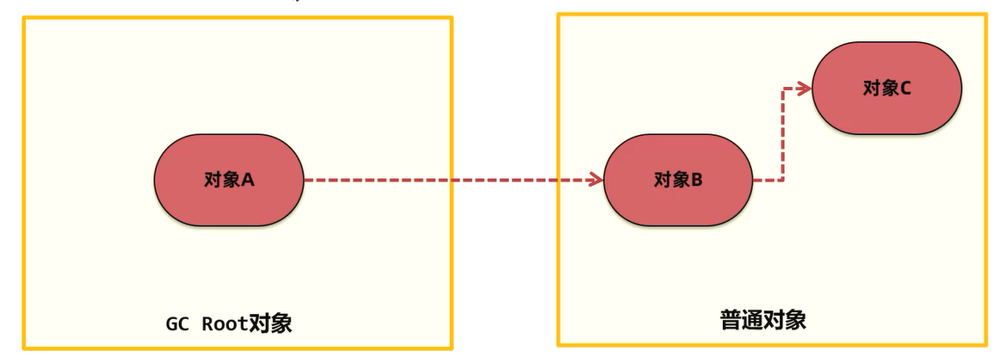

优点：实现简单，只需要在第一阶段给每个对象维护标志位，第二阶段删除对象即可。

缺点：1.碎片化问题

由于内存是连续的，所以在对象被删除之后，内存中会出现很多细小的可用内存单元。如果我们需要的是一个比较大的空间，很有可能这些内存单元的大小过小无法进行分配。

如下图，红色部分已经被清理掉了，总共回收了9个字节，但是每个都是一个小碎片，无法为5个字节的对象分配空间。

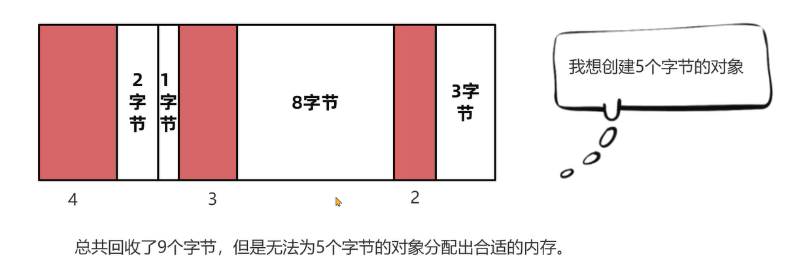

标记清除算法的缺点：

2.分配速度慢。由于内存碎片的存在，需要维护一个空闲链表，极有可能发生每次需要遍历到链表的最后才能获得合适的内存空间。 我们需要用一个链表来维护，哪些空间可以分配对象，很有可能需要遍历这个链表到最后，才能发现这块空间足够我们去创建一个对象。如下图，遍历到最后才发现有足够的空间分配3个字节的对象了。如果链表很长，遍历也会花费较长的时间。


##### 复制算法

复制算法的核心思想是：

1.准备两块空间From空间和To空间，每次在对象分配阶段，只能使用其中一块空间（From空间）。

对象A首先分配在From空间：


2.在垃圾回收GC阶段，将From中存活对象复制到To空间。

在垃圾回收阶段，如果对象A存活，就将其复制到To空间。然后将From空间直接清空。


3.将两块空间的From和To名字互换。

接下来将两块空间的名称互换，下次依然在From空间上创建对象。


完整的复制算法的例子：

1.将堆内存分割成两块From空间 To空间，对象分配阶段，创建对象。


2.GC阶段开始，将GC Root搬运到To空间

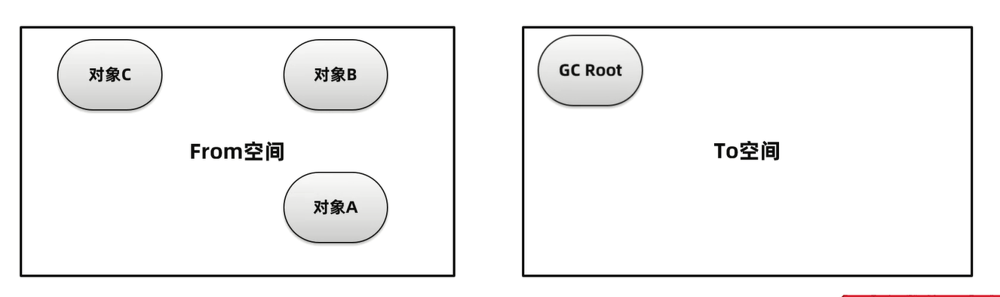

3.将GC Root关联的对象，搬运到To空间

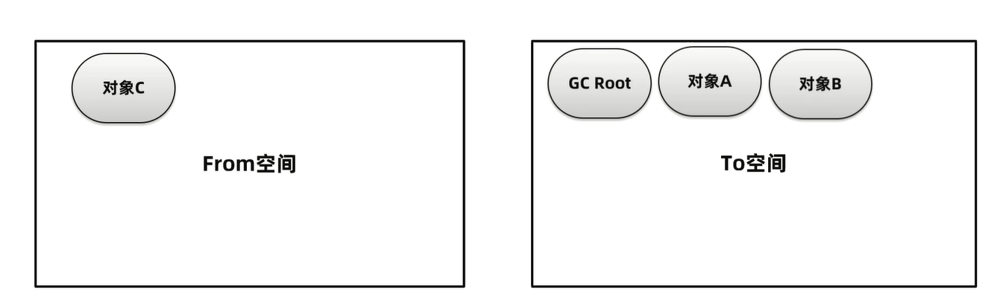

4.清理From空间，并把名称互换


优点：

- 吞吐量高，复制算法只需要遍历一次存活对象复制到To空间即可，比标记-整理算法少了一次遍历的过程，因而性能较好，但是不如标记-清除算法，因为标记清除算法不需要进行对象的移动
- 不会发生碎片化，复制算法在复制之后就会将对象按顺序放入To空间中，所以对象以外的区域都是可用空间，不存在碎片化内存空间。

缺点：

内存使用效率低，每次只能让一半的内存空间来为创建对象使用。

##### 标记整理算法

标记整理算法也叫标记压缩算法，是对标记清理算法中容易产生内存碎片问题的一种解决方案。

核心思想分为两个阶段：

1.标记阶段，将所有存活的对象进行标记。Java中使用可达性分析算法，从GC Root开始通过引用链遍历出所有存活对象。

2.整理阶段，将存活对象移动到堆的一端。清理掉存活对象的内存空间。


优点：

- 内存使用效率高，整个堆内存都可以使用，不会像复制算法只能使用半个堆内存
- 不会发生碎片化，在整理阶段可以将对象往内存的一侧进行移动，剩下的空间都是可以分配对象的有效空间

缺点：

整理阶段的效率不高，整理算法有很多种，比如Lisp2整理算法需要对整个堆中的对象搜索3次，整体性能不佳。可以通过Two-Finger、表格算法、ImmixGC等高效的整理算法优化此阶段的性能。

##### 分代垃圾回收算法

现代优秀的垃圾回收算法，会将上述描述的垃圾回收算法组合进行使用，其中应用最广的就是分代垃圾回收算法(Generational GC)。

分代垃圾回收将整个内存区域划分为年轻代和老年代：

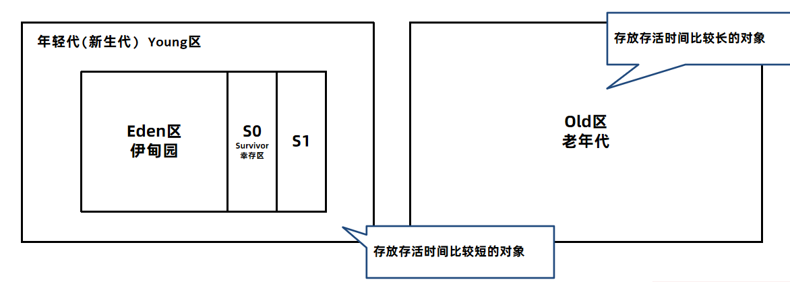

我们通过arthas来验证下内存划分的情况：

在JDK8中，添加-XX:+UseSerialGC参数使用分代回收的垃圾回收器，运行程序。

在arthas中使用memory命令查看内存，显示出三个区域的内存情况。


Eden + survivor 这两块区域组成了年轻代。

tenured_gen指的是晋升区域，其实就是老年代。

另外还可以选择的虚拟机参数如下

| 参数名                        | 参数含义                                                     | 示例                                                    |
| ----------------------------- | ------------------------------------------------------------ | ------------------------------------------------------- |
| -Xms                          | 设置堆的最小和初始大小，必须是1024倍数且大于1MB              | 比如初始大小6MB的写法： -Xms6291456 -Xms6144k -Xms6m    |
| -Xmx                          | 设置最大堆的大小，必须是1024倍数且大于2MB                    | 比如最大堆80 MB的写法： -Xmx83886080 -Xmx81920k -Xmx80m |
| -Xmn                          | 新生代的大小                                                 | 新生代256 MB的写法： -Xmn256m -Xmn262144k -Xmn268435456 |
| -XX:SurvivorRatio             | 伊甸园区和幸存区的比例，默认为8 新生代1g内存，伊甸园区800MB,S0和S1各100MB | 比例调整为4的写法：-XX:SurvivorRatio=4                  |
| -XX:+PrintGCDetailsverbose:gc | 打印GC日志                                                   | 无                                                      |

```Java
/**
 * 垃圾回收器案例1
 */
//-XX:+UseSerialGC  -Xms60m -Xmn20m -Xmx60m -XX:SurvivorRatio=3  -XX:+PrintGCDetails
public class GcDemo0 {

    public static void main(String[] args) throws IOException {
        List<Object> list = new ArrayList<>();
        int count = 0;
        while (true){
            System.in.read();
            System.out.println(++count);
            //每次添加1m的数据
            list.add(new byte[1024 * 1024 * 1]);
        }
    }
}
```

使用arthas的memory展示出来的效果：


heap展示的是可用堆，survivor区每次只有一块能使用，所以60 - 4 = 56m。

1、分代回收时，创建出来的对象，首先会被放入Eden伊甸园区。


2、随着对象在Eden区越来越多，如果Eden区满，新创建的对象已经无法放入，就会触发年轻代的GC，称为Minor GC或者Young GC。

Minor GC会把需要eden中和From需要回收的对象回收，把没有回收的对象放入To区。


3、接下来，S0会变成To区，S1变成From区。当eden区满时再往里放入对象，依然会发生Minor GC。


此时会回收eden区和S1(from)中的对象，并把eden和from区中剩余的对象放入S0。

注意：每次Minor GC中都会为对象记录他的年龄，初始值为0，每次GC完加1。


4、如果Minor GC后对象的年龄达到阈值（最大15，默认值和垃圾回收器有关），对象就会被晋升至老年代。

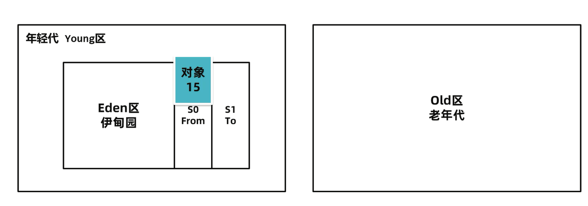


当老年代中空间不足，无法放入新的对象时，先尝试minor gc如果还是不足，就会触发Full GC，Full GC会对整个堆进行垃圾回收。

如果Full GC依然无法回收掉老年代的对象，那么当对象继续放入老年代时，就会抛出Out Of Memory异常。


下图中的程序为什么会出现OutOfMemory？


从上图可以看到，Full GC无法回收掉老年代的对象，那么当对象继续放入老年代时，就会抛出Out Of Memory异常。

```Java
//-XX:+UseSerialGC  -Xms60m -Xmn20m -Xmx60m -XX:SurvivorRatio=3  -XX:+PrintGCDetails
public class GcDemo0 {

    public static void main(String[] args) throws IOException {
        List<Object> list = new ArrayList<>();
        int count = 0;
        while (true){
            System.in.read();
            System.out.println(++count);
            //每次添加1m的数据
            list.add(new byte[1024 * 1024 * 1]);
        }
    }
}
```

结果如下：


老年代已经满了，而且垃圾回收无法回收掉对象，如果还想往里面放就发生了`OutOfMemoryError`。

#### 垃圾回收器

为什么分代GC算法要把堆分成年轻代和老年代？首先我们要知道堆内存中对象的特性：

- 系统中的大部分对象，都是创建出来之后很快就不再使用可以被回收，比如用户获取订单数据，订单数据返回给用户之后就可以释放了。
- 老年代中会存放长期存活的对象，比如Spring的大部分bean对象，在程序启动之后就不会被回收了。
- 在虚拟机的默认设置中，新生代大小要远小于老年代的大小。

分代GC算法将堆分成年轻代和老年代主要原因有：

1、可以通过调整年轻代和老年代的比例来适应不同类型的应用程序，提高内存的利用率和性能。

2、新生代和老年代使用不同的垃圾回收算法，新生代一般选择复制算法，老年代可以选择标记-清除和标记-整理算法，由程序员来选择灵活度较高。

3、分代的设计中允许只回收新生代（minor gc），如果能满足对象分配的要求就不需要对整个堆进行回收(full gc),STW时间就会减少。

垃圾回收器是垃圾回收算法的具体实现。

由于垃圾回收器分为年轻代和老年代，除了G1之外其他垃圾回收器必须成对组合进行使用。

具体的关系图如下：


##### 年轻代-Serial垃圾回收器

Serial是是一种单线程串行回收年轻代的垃圾回收器。


**回收年代和算法：**

- 年轻代

- 复制算法

**优点**

- 单CPU处理器下吞吐量非常出色

**缺点**

- 多CPU下吞吐量不如其他垃圾回收器，堆如果偏大会让用户线程处于长时间的等待

**适用场景**

- Java编写的客户端程序或者硬件配置有限的场景

##### 老年代-SerialOld垃圾回收器

SerialOld是Serial垃圾回收器的老年代版本，采用单线程串行回收

-XX:+UseSerialGC 新生代、老年代都使用串行回收器。


**回收年代和算法：**

- 老年代

- 标记-整理算法

**优点**

- 单CPU处理器下吞吐量非常出色

**缺点**

- 多CPU下吞吐量不如其他垃圾回收器，堆如果偏大会让用户线程处于长时间的等待

**适用场景**

- 与Serial垃圾回收器搭配使用，或者在CMS特殊情况下使用

##### 年轻代-ParNew垃圾回收器

ParNew垃圾回收器本质上是对Serial在多CPU下的优化，使用多线程进行垃圾回收

-XX:+UseParNewGC 新生代使用ParNew回收器， 老年代使用串行回收器

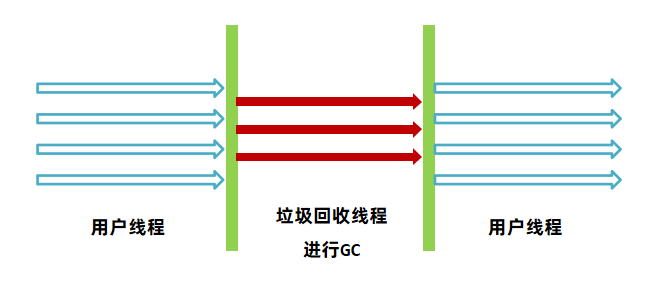

**回收年代和算法：**

年轻代

复制算法

**优点**

多CPU处理器下停顿时间较短

**缺点**

吞吐量和停顿时间不如G1，所以在JDK9之后不建议使用

**适用场景**

 JDK8及之前的版本中，与CMS老年代垃圾回收器搭配使用

##### 老年代- CMS(Concurrent Mark Sweep)垃圾回收器

CMS垃圾回收器关注的是系统的暂停时间，允许用户线程和垃圾回收线程在某些步骤中同时执行，减少了用户线程的等待时间。

参数：XX:+UseConcMarkSweepGC


**回收年代和算法：**

老年代

标记清除算法

**优点**

系统由于垃圾回收出现的停顿时间较短，用户体验好

**缺点**

1、内存碎片问题

2、退化问题

3、浮动垃圾问题

**适用场景**

 大型的互联网系统中用户请求数据量大、频率高的场景，比如订单接口、商品接口等

CMS执行步骤：

1.初始标记，用极短的时间标记出GC Roots能直接关联到的对象。

2.并发标记,   标记所有的对象，用户线程不需要暂停。

3.重新标记，由于并发标记阶段有些对象会发生了变化，存在错标、漏标等情况，需要重新标记。

4.并发清理，清理死亡的对象，用户线程不需要暂停。

缺点：

1、CMS使用了标记-清除算法，在垃圾收集结束之后会出现大量的内存碎片，CMS会在Full GC时进行碎片的整理。这样会导致用户线程暂停，可以使用-XX:CMSFullGCsBeforeCompaction=N 参数（默认0）调整N次Full GC之后再整理。

2.、无法处理在并发清理过程中产生的“浮动垃圾”，不能做到完全的垃圾回收。

3、如果老年代内存不足无法分配对象，CMS就会退化成Serial Old单线程回收老年代。

并发线程数：

在CMS中并发阶段运行时的线程数可以通过-XX:ConcGCThreads参数设置，默认值为0，由系统计算得出。

计算公式为(-XX:ParallelGCThreads定义的线程数 + 3) / 4， ParallelGCThreads是STW停顿之后的并行线程数

ParallelGCThreads是由处理器核数决定的：

  1、当cpu核数小于8时，ParallelGCThreads = CPU核数

  2、否则 ParallelGCThreads = 8 + (CPU核数 – 8 )*5/8 

我的电脑上逻辑处理器有12个，所以ParallelGCThreads  =  8 + （12 - 8）* 5/8 = 10，ConcGCThreads = (-XX:ParallelGCThreads定义的线程数 + 3) / 4 = （10 + 3） / 4 = 3


最终可以得到这张图：


并发标记和并发清理阶段，会使用3个线程并行处理。重新标记阶段会使用10个线程处理。

由于CPU的核心数有限，并发阶段会影响用户线程执行的性能。


##### 年轻代-Parallel Scavenge垃圾回收器

Parallel Scavenge是JDK8默认的年轻代垃圾回收器，多线程并行回收，关注的是系统的吞吐量。具备自动调整堆内存大小的特点。


**回收年代和算法：**

年轻代

复制算法

**优点**

吞吐量高，而且手动可控。为了提高吞吐量，虚拟机会动态调整堆的参数

**缺点**

不能保证单次的停顿时间

**适用场景**

后台任务，不需要与用户交互，并且容易产生大量的对象。比如：大数据的处理，大文件导出

**常用参数：**

Parallel Scavenge允许手动设置最大暂停时间和吞吐量。Oracle官方建议在使用这个组合时，不要设置堆内存的最大值，垃圾回收器会根据最大暂停时间和吞吐量自动调整内存大小。

- 最大暂停时间，`-XX:MaxGCPauseMillis=n` 设置每次垃圾回收时的最大停顿毫秒数
- 吞吐量，`-XX:GCTimeRatio=n` 设置吞吐量为n（用户线程执行时间 = n/n + 1）
- 自动调整内存大小, `-XX:+UseAdaptiveSizePolicy`设置可以让垃圾回收器根据吞吐量和最大停顿的毫秒数自动调整内存大小


##### 老年代-Parallel Old垃圾回收器

Parallel Old是为Parallel Scavenge收集器设计的老年代版本，利用多线程并发收集。

参数： -XX:+UseParallelGC  或

​           -XX:+UseParallelOldGC可以使用Parallel Scavenge + Parallel Old这种组合。


**回收年代和算法：**

老年代

标记-整理算法

**优点**

并发收集，在多核CPU下效率较高

**缺点**

暂停时间会比较长

**适用场景**

与Parallel Scavenge配套使用


##### G1垃圾回收器

JDK9之后默认的垃圾回收器是G1（Garbage First）垃圾回收器。Parallel Scavenge关注吞吐量，允许用户设置最大暂停时间 ，但是会减少年轻代可用空间的大小。CMS关注暂停时间，但是吞吐量方面会下降。

而G1设计目标就是将上述两种垃圾回收器的优点融合：

1.支持巨大的堆空间回收，并有较高的吞吐量。

2.支持多CPU并行垃圾回收。

3.允许用户设置最大暂停时间。

JDK9之后强烈建议使用G1垃圾回收器。

G1出现之前的垃圾回收器，年轻代和老年代一般是连续的，如下图：


G1的整个堆会被划分成多个大小相等的区域，称之为区Region，区域不要求是连续的。分为Eden、Survivor、Old区。Region的大小通过堆空间大小/2048计算得到，也可以通过参数-XX:G1HeapRegionSize=32m指定(其中32m指定region大小为32M)，Region size必须是2的指数幂，取值范围从1M到32M。


G1垃圾回收有两种方式：

1、年轻代回收（Young GC）

2、混合回收（Mixed GC）

###### 年轻代回收

年轻代回收（Young GC），回收Eden区和Survivor区中不用的对象。会导致STW，G1中可以通过参数

-XX:MaxGCPauseMillis=n（默认200）  设置每次垃圾回收时的最大暂停时间毫秒数，G1垃圾回收器会尽可能地保证暂停时间。

1、新创建的对象会存放在Eden区。当G1判断年轻代区不足（max默认60%），无法分配对象时需要回收时会执行Young GC。


2、标记出Eden和Survivor区域中的存活对象，

3、根据配置的最大暂停时间选择某些区域将存活对象复制到一个新的Survivor区中（年龄+1），清空这些区域。


G1在进行Young GC的过程中会去记录每次垃圾回收时每个Eden区和Survivor区的平均耗时，以作为下次回收时的参考依据。这样就可以根据配置的最大暂停时间计算出本次回收时最多能回收多少个Region区域了。

比如 -XX:MaxGCPauseMillis=n（默认200），每个Region回收耗时40ms，那么这次回收最多只能回收4个Region。

4、后续Young GC时与之前相同，只不过Survivor区中存活对象会被搬运到另一个Survivor区。


5、当某个存活对象的年龄到达阈值（默认15），将被放入老年代。


6、部分对象如果大小超过Region的一半，会直接放入老年代，这类老年代被称为Humongous区。比如堆内存是4G，每个Region是2M，只要一个大对象超过了1M就被放入Humongous区，如果对象过大会横跨多个Region。

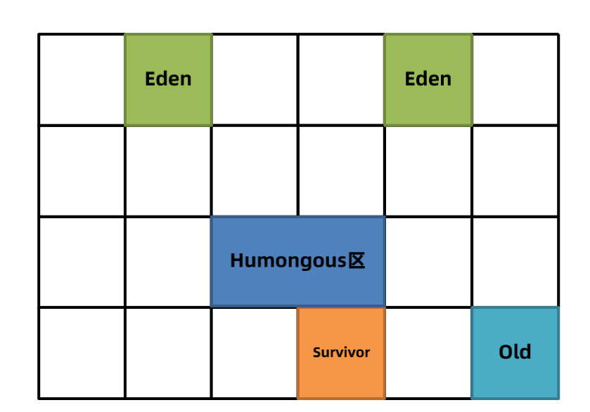

7、多次回收之后，会出现很多Old老年代区，此时总堆占有率达到阈值时

（-XX:InitiatingHeapOccupancyPercent默认45%）会触发混合回收MixedGC。回收所有年轻代和部分老年代的对象以及大对象区。采用复制算法来完成。


###### 混合回收

混合回收分为：初始标记（initial mark）、并发标记（concurrent mark）、最终标记（remark或者Finalize Marking）、并发清理（cleanup）

G1对老年代的清理会选择存活度最低的区域来进行回收，这样可以保证回收效率最高，这也是G1（Garbage first）名称的由来。

   


G1对老年代的清理会选择存活度最低的区域来进行回收，这样可以保证回收效率最高，这也是G1（Garbage first）名称的由来。最后清理阶段使用复制算法，不会产生内存碎片。


注意：如果清理过程中发现没有足够的空Region存放转移的对象，会出现Full GC。单线程执行标记-整理算法，此时会导致用户线程的暂停。所以尽量保证应该用的堆内存有一定多余的空间。


##### G1 – Garbage First 垃圾回收器

参数1： `-XX:+UseG1GC`  打开G1的开关，JDK9之后默认不需要打开

参数2：`-XX:MaxGCPauseMillis=毫秒值` 最大暂停的时

**回收年代和算法：**

年轻代+老年代

复制算法

**优点**

对比较大的堆如超过6G的堆回收时，延迟可控

不会产生内存碎片

并发标记的SATB算法效率高

**缺点**

JDK8之前还不够成熟

**适用场景**

JDK8最新版本、JDK9之后建议默认使用

使用以下代码测试g1垃圾回收器，打印出每个阶段的时间:

```Java
package chapter04.gc;

import java.io.IOException;
import java.util.ArrayList;
import java.util.List;

/**
 * 垃圾回收器案例3
 */
//-XX:+UseG1GC   -Xmn8g -Xmx16g -XX:SurvivorRatio=8  -XX:+PrintGCDetails -verbose:gc 
public class GcDemo2 {

    public static void main(String[] args) throws IOException {
        int count = 0;
        List<Object> list = new ArrayList<>();
        while (true){
            //System.out.println(++count);
            if(count++ % 10240 == 0){
                list.clear();
            }
//            byte[] bytes = new byte[1024 * 1024 * 1];
            list.add(new byte[1024 * 1024 * 1 / 2]);
//            System.gc();
        }
    }
}
```

每个region大小为2m，一共有84个young区，26个幸存者区。


初始标记花了0.0478秒。

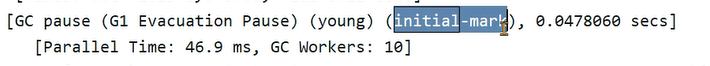

并发标记总共耗时10ms，不会产生STW。


### 总结

垃圾回收器的组合关系虽然很多，但是针对几个特定的版本，比较好的组合选择如下：

JDK8及之前：

ParNew + CMS（关注暂停时间）、Parallel Scavenge + Parallel Old (关注吞吐量)、 G1（JDK8之前不建议，较大堆并且关注暂停时间）

JDK9之后:

G1（默认）

从JDK9之后，由于G1日趋成熟，JDK默认的垃圾回收器已经修改为G1，所以强烈建议在生产环境上使用G1。

