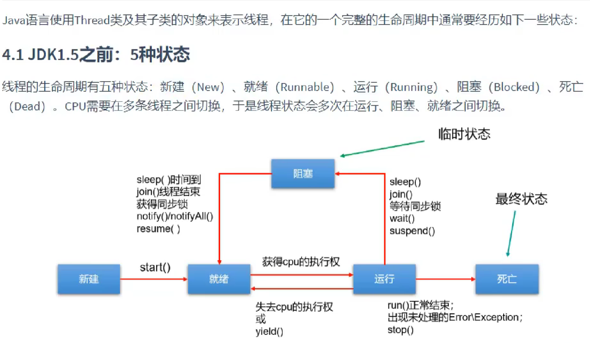
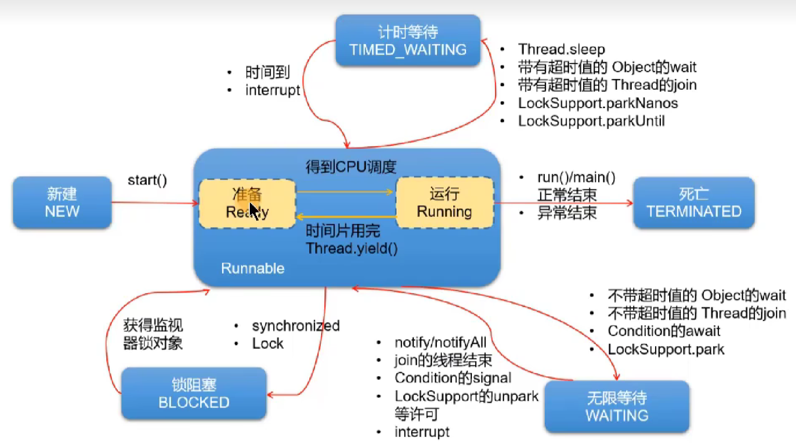

# 注解、枚举
[视频](https://www.bilibili.com/video/BV1PY411e7J6?p=118&vd_source=b65df187291916e801dd2d3d831fb71e)
# 多线程
## 线程的创建
### 方式一：继承Thread类

- 创建一个继承于Thread类的子类
- 重写Thread的run() --->将此线程要执行的操作，声明在此方法体中
- 创建当前Thread子类的对象
- 通过对象调用start()
```java
new Thread(){
    public void run(){
        //operation
    }
}.start();
```
### 方式二：实现Runnable接口

- 创建一个实现Runnable接口的类
- 实现接口中的run() --> 将此线程要执行的操作，声明在此方法体中
- 创建当前实现类的对象
- 将此对象作为参数传递到Thread类的构造器中，创建Thread类的实现
- Thread类的实例调用start()：1.启动线程 2.调用当前线程的run()
```java
new Thread(new Runnable(){
    public void run(){
        //operation
    }
}).start();
```
## 注意事项

- 不能让已经start()的线程，再次执行start()，否则报异常
- 

## 常用方法
> 线程的构造器
> public Thread()：分配一个新的线程对象。
> public Thread(String name)：分配一个指定名字的新的线程对象。
> public Thread(Runnable target)：指定创建线程的目标对象，它实现了Runnable接口中的run方法
> public Thread(Runnable target,String name)：分配一个带有指定目标新的线程对象并指定名字。

> 常用方法
> start()：①调用线程②调用线程的run()
> currentThread()：获取当前线程
> getName()：获取当前线程的名称
> setName()：设置线程名
> sleep(long millis)：睡眠多少毫秒
> yield()：静态方法，一旦执行此方法，就释放CPU的执行权
> join()：在线程a中通过线程b调用join()，意味着线程a进入阻塞状态，直到线程b执行结束，线程a才结束阻塞状态，继续执行。
> isAlive()：判断当前线程是否存活

> 过时方法:
>  stop():强行结束一个线程的执行，直接进入死亡状态。不建议使用
> void suspend() / void resume():可能造成死锁，所以也不建议使用

## 线程的优先级
> 线程调度策略
> 分时调度:所有线程`轮流使用`CPU 的使用权，并且平均分配每个线程占用CPU的时间。
> 抢占式调度:让`优先级高`的线程以`较大的概率`优先使用CPU。如果线程的优先级相同，那么会随机选择一个(线程随机性)

> MAX_PRIORITY：最大优先级 MIN_PRIORITY：最小优先级
> getPriority()：获取线程的优先级
> setPriority()：设置线程优先级

## 线程的生命周期



## 线程同步
> Java是如何解决线程的安全问题的？使用线程的同步机制

**方式一：同步代码块**
```java
synchronized(同步监视器){
    //需要被同步的代码
}
```
**说明**

- 需要被同步的代码，即为操作共享数据的代码。
- 共享数据：即多个线程多需要操作的数据。比如：ticket
- 需要被同步的代码，在被synchronized包裹以后，就使得一个线程在操作这些代码的过程中，其它线程必须等待。
- 同步监视器，俗称锁。哪个线程获取了锁，哪个线程就能执行需要被同步的代码。
- 同步监视器，可以使用任何一个类的对象充当。但是，多个线程必须共用同一个同步监视器。

**注意**

- 在实现Runnable接口的方式中，同步监视器可以考虑使用：this。
- 在继承Thread类的方式中，同步监视器要慎用this,可以考虑使用：当前类.class。

---

**方式二：同步方法**
> 定义：如果操作共享数据的代码完整的声明在了一个方法中，那么我们就可以将此方法声明为同步方法即可
> 非静态的同步方法，默认同步监视器是**this**
> 静态的同步方法，默认同步监视器是**当前类本身**。

> synchronized好处：解决了线程的安全问题。
> 弊端：在操作共享数据时，多线程其实是串行执行的，意味着性能低。

## 死锁
/1677414412263-a9c0bd29-3b6f-460d-83d0-1522dfe3b1c0.png)
诱发死锁的原因：

- 互斥条件 
- 占用且等待 
- 不可抢夺（或不可抢占）
- 循环等待

以上4个条件，同时出现就会触发死锁。
解决死锁：

- 死锁一旦出现，基本很难人为干预，只能尽量规避。可以考虑打破上面的诱发条件。
- 针对条件1：互斥条件基本上无法被破坏。因为线程需要通过互斥解决安全问题。
- 针对条件2：可以考虑一次性申请所有所需的资源，这样就不存在等待的问题：
- 针对条件3：占用部分资源的线程在进一步申请其他资源时，如果申请不到，就主动释放掉已经占用的资源。
- 针对条件4：可以将资源改为线性顺序。申请资源时，先申请序号较小的，这样避免循环等待问题。
## Lock
> 除了使用synchronized同步机制处理线程安全问题之外，还可以使用jdk5.0提供的Lock锁的方式

Lock锁实现步骤：
步骤1.创建Lock的实例，需要确保多个线程共用同一个Lock实例！需要考虑将此对象声明为static final
步骤2.执行Lock()方法，锁定对共享资源的调用
步骤3.unlock()的调用，释放对共享数据的锁定
## 线程的通信
1.线程间通信的理解
当我们`需要多个线程`来共同完成一件任务，并且我们希望他们有规律的执行，那么多线程之间需要一些通信机制，可以协调它们的工作，以此实现多线程共同操作一份数据。
2.涉及到三个方法的使用：

- wait():线程一旦执行此方法，就进入等待状态。同时，会释放对同步监视器的调用
- notify():一旦执行此方法，就会唤醒被wait()的线程中优先级最高的那一个线程。（如果被wait()的多个线程的优先级相同则会随机唤醒一个)。被唤醒的线程从当初被wait的位置继续执行。
- notifyAll():一旦执行此方法，就会唤醒所有被wait的线程。

3.注意点：

- 此三个方法的使用，必须是在同步代码块或同步方法中。
(超钢：Lock需要配合Condition实现线程间的通信)
- 此三个方法的调用者，必须是同步监视器，否则报异常：`IllegalMonitorStateException`
- 此三个方法声明在Object类中
## 线程安全的单例模式
```java
public final class Singleton{
	private singleton(){}
	//问题1：解释为什么要加volatile?
	private static volatile Singleton INSTANCE =  null;
	//问题2：对比实现3，说出这样做的意义
	public static Singleton getInstance(){
	if (INSTANCE !null){
		return INSTANCE;
    }
	synchronized (Singleton.class){
	//问题3：为什么还要在这里加为空判断，之前不是判断过了吗
	if (INSTANCE !null){
		return INSTANCE;
    }
	INSTANCE = new Singleton();
	return INSTANCE;
}
```
# 泛型
> 自定义泛型

```java
class A<T>{
	private ArrayList<T> records;
}

interface B<T1,T2>{}

//泛型类不能是静态的
```
```java
//<T> 声明泛型
public <T> void method(T t){}

//泛型方法可以是静态的
```
```java
<? extends Person> ==> ? <= Person 
<? super Person> ==> ? >= Person
```
```java
实现Comparable<T>接口，重写compareTo(T t)方法  默认从小到大
Comparator<T>对象，重写compare(T o1,T o2)方法  默认从小到大
```
# File类&IO流
## File类
> 创建 File类实例

- File(String pathname)
- File(String parent, String child)
- File(File parent, String child)
> 路径

相对路径：相较于某个路径下，指明的路径
绝对路径：包含盘符在内的文件或文件目录路径
说明：

- IDEA中
	如果开发中使用JUnit中的单元测试方法测试，相对路径即为当前Module下。
    	如果开发中使用main()方法测试，相对路径即为当前的Project下。
- Eclipse中
	不管使用单元测试方法还是main()方法测试，相对路径都是当前的Project下。

路径分隔符：

- windows：\
- unix：/
> File常用方法

public String getAbsolutePath():获取绝对路径
public String getPath():获取路径
public String getName():获取文件名
public String getParent():获取上层文件目录路径。若无，返回null
public long length():获取文件长度（即：字节数）。不能获取目录的长度
public long lastModified():获取最后一次的修改时间，毫秒值 
如下的两个方法适用于文件目录
public String[] list():获取指定目录下的所有文件或者文件目录的名称数组。
public File[] listFiles():获取指定目录下的所有文件或者文件目录的File数据
public boolean renameTo(File dest):把文件重命名为指定的文件路径
比如：file1.renameTo(file2)为例：要保证返回true，需要file1在硬盘中是存在的，且file2在硬盘中是不存在的。
判断功能的方法：
public boolean isDirectory():判断是否为文件目录
public boolean isFile():判断是否为文件
public boolean exists():判断是否存在
public boolean canRead():判断是否可读
public boolean canWrite():判断是否可写
public boolean isHidden():判断是否隐藏
public boolean creatNewFile():创建文件。若文件存在，则不创建，返回false
public boolean mkdir():创建文件目录。如果此文件目录存在或者此文件目录的上层目录不存在，就不创建了。
public boolean mkdirs():创建文件目录。如果上层文件目录不存在，一并创建。
public boolean delete():删除文件或者文件目录(只能删除空目录)。
注意：

- 如果创建文件或者文件目录时没有写盘符路径，那么，默认在项目路径下。
- java中的删除不走回收站。
- 要删除一个文件目录，请注意该文件目录内不能包含文件或者文件目录
## IO流
```latex
*  抽象基类        节点流（或文件流） 缓冲流（处理流的一种）
*  InputStream    FileInputStream   BufferedInputStream(read(byte[] buffer))
*  OutputStream   FileOutputStream  BufferedOutputStream(write(byte[] buffer,0,len))
*  Reader         FileReader        BufferedReader(read(char[] cbuf) / readLine() )
*  Writer         FileWriter        BufferedWriter(write(char[] cbuf,0,len)/flush())
```
> 输入输出标准化过程

> 输入过程

①创建File类的对象，指明读取的数据的来源。（要求此文件一定要存在）
②创建相应的输入流，将File类的对象作为参数，传入流的构造器中
③具体的读入过程
创建相应的byte[] 或 char[]。
④关闭流资源
说明：处理异常仍然应该使用try-catch-finally
> 输出过程

①创建File类的对象，指明写出的数据的位置。（不要求此文件一定要存在）
②创建相应的输入流，将File类的对象作为参数，传入流的构造器中
③具体的写出过程
write(char[] cbuf/byte[] buffer,0,len)
④关闭流资源
说明：处理异常仍然应该使用try-catch-finally
### 字符流FileReader&FileWriter
#### FileReader的使用
```java
将FileReaderWriter下的hello.txt文件内容读入到程序中，并输出到控制台。
说明点：
    *read()的理解：返回读入的一个字符。如果达到文件末尾，返回-1
    *异常的处理：为了保证流资源一定可以执行关闭操作。需要使用try-catch-finally处理
    *读入的文件一定要存在，否则就会报FileNotFoundException。
@Test
public void testFileReader1() throws IOException {
    //1.File类的实例化
    File file = new File("hello.txt");
    //2.FileReader流的实例化
    FileReader fr= null;
    fr= new FileReader(file);
    //3.读入的操作
    //read(char[] cbuf):返回每次读入cbuf数组中的字符的个数。如果达到文件末尾，返回-1.
    char[] cbuf = new char[5];
    int len;
    while((len = fr.read(cbuf))!= -1){
        //方式一
        //for (int i = 0; i < len; i++) {
        //    System.out.print(cbuf[i]);
        //}
        //方式二
        String str = new String(cbuf,0,len);
        System.out.print(str);
    }
    //4.资源的关闭
    fr.close();
}
从内存中写出数据到硬盘的文件
说明：
1.输出操作，对应的File可以不存在。
File对应的硬盘中的文件如果不存在，在输出的过程中，会自动创建文件
File对应的硬盘中的文件如果存在：
    如果流使用的构造器是：FileWriter(file，false)/FileWriter(file):对原有文件的覆盖
    如果流使用的构造器是：FileWriter(file,true):不会对原有文件覆盖，而是在原有文件基础上追加内容
```
#### FileWriter的使用
```java
@Test
public void testFileWriter() throws IOException{
    //1.提供File类的对象，指明写出到的文件
    File file = new File("hello.txt");
    //2.提供FileWriter的对象，用于数据的写出
    FileWriter fw = new FileWriter(file);
    //3.写出的操作
    fw.write("I have a stream!\n");
    fw.write("you need to have a dream!");
    //4.流资源的关闭
    fw.close();
}
```
### 字节流FileInputStream&FileOutputStream
```java
结论：*对于文本文件（.txt, .java,.cpp）：使用字符流处理
  *对于非文本文件（.jpg,.map,.avi,.doc,.ppt,...）：使用字节流处理
public class FileIOTest {
    @Test
    public void testCopy(){
        long start = System.currentTimeMillis();
        copyFile("D:\\Desktop\\JAVA 8实战.pdf","D:\\Desktop\\JAVA 8 1实战.pdf");
        long end = System.currentTimeMillis();
        System.out.println(end - start);//640
    }
    public void copyFile(String srcPath,String destPath){
        FileInputStream fi = null;
        FileOutputStream fo = null;
        int len;
        byte[] bytes = new byte[1024];
        try{
            fi = new FileInputStream(srcPath);
            fo = new FileOutputStream(destPath);
            while((len = fi.read(bytes))!=-1){//读入
                fo.write(bytes,0,len);//写出
            }
        }catch(IOException e){
            e.printStackTrace();
        }finally{
            ... //流关闭
        }
    }
}
```
### 缓冲字符流BufferedReader&BufferedWriter
```java
public class BufferedReaderWriterTest {
    @Test
    public void testBufferedReaderWriter(){
        long start = System.currentTimeMillis();
        copyFile("hello.txt","hlo.txt");
        long end = System.currentTimeMillis();
        System.out.println(end - start);//16
    }
    public void copyFile(String srcPath,String destPath){
        BufferedReader br = null;
        BufferedWriter bw = null;
        int len;
        char[] cbuf = new char[1024];
        try{
            br = new BufferedReader(new FileReader(new  File(srcPath)));//缩写
            bw = new BufferedWriter(new FileWriter(new File(destPath)));
            while((len = br.read(cbuf))!=-1){
                bw.write(cbuf,0,len);
            }
        }catch(IOException e){
            e.printStackTrace();
        }finally{
           ...//流关闭
        }
    }
}
```
### 缓冲字节流BufferedInputStream&BufferedOutputStream
```java
public class BufferedIOStreamTest {
    @Test
    public void testBufferedStream() {
        long start = System.currentTimeMillis();
        copyFile("D:\\Desktop\\JAVA 8实战.pdf","D:\\Desktop\\JAVA 8 2实战.pdf");
        long end = System.currentTimeMillis();
        System.out.println(end - start);//140
    }
    public void copyFile(String srcPath,String destPath){
        FileInputStream fis = null;
        FileOutputStream fos = null;
        BufferedInputStream bis = null;
        BufferedOutputStream bos = null;
        int len;
        byte[] bytes = new byte[1024];
        try{
            fis = new FileInputStream(srcPath);
            fos = new FileOutputStream(destPath);
            bis = new BufferedInputStream(fis);
            bos = new BufferedOutputStream(fos);
            while((len = bis.read(bytes))!=-1){
                bos.write(bytes,0,len);
                //bos.flush();//刷新缓冲区
            }
        }catch(IOException e){
            e.printStackTrace();
        }finally{
            ...//流关闭
        }
    }
}
```

6.注意点：
①如果不声明全局常量serialVersionUID,系统会自动声明生成一个针对于当前类的serialVersionUID。
如果修改此类的话，会导致serialVersionUID变化，进而导致反序列化时，出现InvalidClassException异常。
②类中的属性如果声明为transient或static,则不会实现序列化。

# 反射

# Java新特性
## Lambda语法格式

- 无参，无返回值 `()->{}`
- Lambda需要一个参数，但是没有返回值 `(T t)->{}`
- 数据类型可以省略，因为可由编译器推断得出，称为：类型推断 `(t)->{}` 
- Lambda 若只需要一个参数时，参数的小括号可以省略 `t->{}`
- Lambda 需要两个或以上的参数，有多条执行语句，并有返回值 `(t1,t2)->{ ...; return ...; }`
- 若Lambda体只有一条语句时，return与大括号若有，都可以省略 `Comparator<Integer> com = (o1,o2)-> o1.comparaTo(o2) ;`
## 方法引用
```java
* 方法引用的使用
*
* 1.使用情境：当要传递给Lambda体的操作，已经有实现的方法了，可以使用方法引用！
*
* 2.方法引用，本质上就是Lambda表达式，而Lambda表达式作为函数式接口的实例。所以
*   方法引用，也是函数式接口的实例。
*
* 3. 使用格式：  类(或对象) :: 方法名
*
* 4. 具体分为如下的三种情况：
*    情况1     对象 :: 非静态方法
*    情况2     类 :: 静态方法
*    情况3     类 :: 非静态方法
*
* 5. 方法引用使用的要求：要求接口中的抽象方法的形参列表和返回值类型与方法引用的方法的
*    形参列表和返回值类型相同！（针对于情况1和情况2）
*    当函数式接口方法的第一个参数是需要引用方法的调用者，并且第二个参数是需要引用方法的参数（或无参数）时，
     使用第三种引用方式ClassName::methodName
* 6.使用建议：
*    如果给函数式接口提供实例，恰好满足方法引用的使用情境，就可以考虑使用方法引用给函数式接口提供实例。
*    如果大家熟悉方法引用，还可以使用Lambda表达式。
```
## 流操作
```text
* 1.Stream关注的是对数据的运算，与CPU打交道
*    集合关注的是数据的存储，与内存打交道
*
* 2.
* ①Stream 自己不会存储元素。
* ②Stream 不会改变源对象。相反，他们会返回一个持有结果的新Stream。
* ③Stream 流的操作时尽可能惰性执行的，这意味着他们会等到需要结果的时候才执行
*
* 3.Stream 执行流程
* ① Stream的实例化
* ② 一系列的中间操作（过滤、映射、...)
* ③ 终止操作
*
* 4.说明：
* 4.1 一个中间操作链，对数据源的数据进行处理
* 4.2 一旦执行终止操作，就执行中间操作链，并产生结果。之后，不会再被使用再次执行会抛出异常：IllegalStateException
```
> 创建方法
```text
- 通过集合
  - default Stream<E> stream() : 返回一个顺序流
  - default Stream<E> parallelStream() : 返回一个并行流
- 通过数组
  - 调用 Arrays 类的static <T> Stream<T> stream(T[] array): 返回一个流
- 通过Stream的of()
  - Stream<Integer> stream = Stream.of(1, 2, 3, 4, 5, 6);
- 无限流
  - static <T> Stream<T> generate(Supplier<T> s) 产生一个无限流，它的值是通过反复调用函数s而构建的
  - static <T> Stream<T> iterate(T seed,UnaryOperator<T> f) 产生一个无限流，它的元素包含种子，在种子上调用f产生的值、在前一个元素上调用f产生的值
- 合并流
  - Static <T> Stream<T> concat(Stream<? extends T> a, Stream<? extends T> b) 将两个流连接到一起，第一个流不应该是无限的，不然第二个流永远都不会得到处理的机会
```
> 中间操作
```text
- 筛选与切片
   - filter(Predicate p)
   - limit(n)——截断流，使其元素不超过给定数量。
   - skip(n) —— 跳过元素，返回一个扔掉了前 n 个元素的流。若流中元素不足 n 个，则返回一个空流。与 limit(n) 互补
   - distinct()——筛选，通过流所生成元素的 hashCode() 和 equals() 去除重复元素
   - Stream<T> peek(Consumer<? super T> action) -----产生一个流，它与当前流中的元素相同，在获取其中每个元素是，会将其传递给action
- 映射
   - map(Function f)——接收一个函数作为参数，将元素转换成其他形式或提取信息，该函数会被应用到每个元素上，最终映射成一个包含所需元素的新流。
   - flatMap(Function f)——接收一个函数作为参数，将流中的每个值都换成另一个流，然后把所有流连接成一个流。（每个结果都是一个流）
- 排序
   - sorted()——自然排序
   - sorted(Comparator com)——定制排序
```
> 终结操作
```text
- 匹配与查找
   - allMatch(Predicate p)——检查是否匹配所有元素。
   - anyMatch(Predicate p)——检查是否至少匹配一个元素。
   - noneMatch(Predicate p)——检查是否没有匹配的元素。
   - findFirst——返回第一个元素
   - findAny——返回当前流中的任意元素
   - count——返回流中元素的总个数
   - max(Comparator c)——返回流中最大值
   - min(Comparator c)——返回流中最小值
   - forEach(Consumer c)——内部迭代
- 规约
   - reduce(T identity, BinaryOperator)——可以将流中元素反复结合起来，得到一个值。返回 T
   - reduce(BinaryOperator) ——可以将流中元素反复结合起来，得到一个值。返回 Optional<T>
- 收集
   - collect(Collector c)——将流转换为其他形式。接收一个 Collector接口的实现，用于给Stream中元素做汇总的方法
   - Object[] toArray()
   `<A> AIJ toArray(IntFunction<A[]>generator)`
   产生一个对象数组，或者在将引用 A[] :: new 传递给构造器时，返回一个 A类型的数组。
   - static <T> Collector<T,?,List<T>> tolist()
   static <T> Collector<T,?, Set<T>> toset()
   产生一个将元素收集到列表或集中的收集器。
   - static <T,C extends Collection<T>> Collector<T,?,C> toCollection(Supplier<C> collectionFactory)
   产生一个将元素收集到任意集合中的收集器。可以传递一个诸如 Treeset：：new 的构造器引用。
   - static Collector<CharSequence,?,String> joining()
   static Collector<CharSequence,?,String> joining(CharSequence delimiter)
   static Collector<CharSequence, ?,String> joining(CharSequence delimiter,CharSequence prefix, CharSequence suffix)
   产生一个连接字符串的收集器。分隔待会置于字符串之间，而第一个字符串之前可以有前缀，最后一个宇符串之后可以有后级。如果没有指定，那么它们都为空。  
   -  static <T> Collector<T,?,IntSurmarystatistics> summarizingInt ( ToIntFunction<? super T> mapper)
   static <T> Collector<T,?,LongSummaryStatistics> summarizingLong(ToLongFunction<? superT> mapper)
   static <T> Collector<T,?,DoubleSummaryStatistics> summarizingDouble(ToDoubleFunction<? super T> mapper)
   产生能够生成 (Int|Long|Double)SummaryStatistics 对象的收集器，通过它可以获得将mapper 应用于每个元素后所产生的结果的个数、总和、平均值、最大值和最小值。  
   -  long getCount()
   产生汇总后的元素的个数。
   (int | long | double) getSum()
   double getAverage()
   产生汇总后的元素的,总和或平均值，或者在没有任何元素时返回 0。
   (int | long | double) getMax()
   (int | long | double) getMin()
   产生汇总后的元素的最大值和最小值，或者在没有任何元素时，产生 (Integer | Long | Double). (MAX | MIN)_VALUE.  
- 映射表
   - toMap()
- 群组和分区
   - groupingBy()

```
