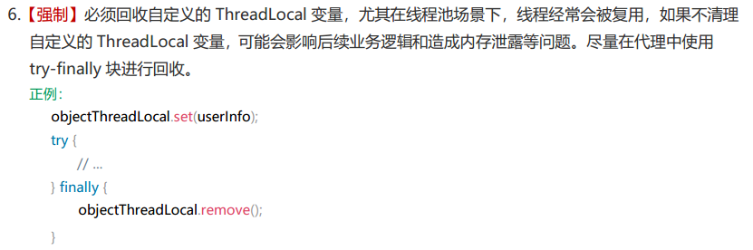

# ThreadLocal
### 是什么

[详细介绍](../A7-并发编程/JUC并发编程.html#threadlocal)

ThreadLocal提供线程局部变量。这些变量与正常的变量不同，因为每一个线程在访问ThreadLocal实例的时候（通过其get或set方法）都有自己的、独立初始化的变量副本。

ThreadLocal实例通常是类中的私有静态字段，使用它的目的是希望将状态（例如，用户ID或事务ID）与线程关联起来。

**注意点**：



> 如果不在线程的最后执行remove方法， 可能会导致该线程下次执行时获取到这次执行的数据

### 线程间数据传递和父子线程共享

#### InheritableThreadLocal

```java
InheritableThreadLocal<String> inheritableThreadLocal = new InheritableThreadLocal();

//这里是主线程，使用 InheritableThreadLocal.set 放入值：Java
inheritableThreadLocal.set(Thread.currentThread().getName()+"-Java");
log.info("major:{}", inheritableThreadLocal.get());

//新建线程thread1，在子线程thread1中去ThreadLocal中拿main线程放入值，能否拿到？
//使用InheritableThreadLocal，子线程可以获得父线程set进去的值
new Thread(() -> {
    log.info("major:{}", inheritableThreadLocal.get());
}, "thread1").start();

new Thread(() -> {
    log.info("major:{}", inheritableThreadLocal.get());
}, "thread2").start();

//16:18:52.744 [main] INFO com.wlpnz.interview.juc.ThreadLocalDemo -- major:main-Java
//16:18:52.747 [thread1] INFO com.wlpnz.interview.juc.ThreadLocalDemo -- major:main-Java
//16:18:52.748 [thread2] INFO com.wlpnz.interview.juc.ThreadLocalDemo -- major:main-Java
```

**注意点**

`InheritableThreadLocal`在使用时，子线程只会在第一次同步父线程的值

父线程修改`InheritableThreadLocal`值后，子线程再调用不会再次同步父线程的值

#### TransmittableThreadLocal

需要引入依赖

```xml
<dependency>
    <groupId>com.alibaba</groupId>
    <artifactId>transmittable-thread-local</artifactId>
    <version>2.14.3</version>
</dependency>
```

代码

```java
TransmittableThreadLocal<String> transmittableThreadLocal = new TransmittableThreadLocal<>();
//为了看到效果，这里创建大小为1的线程池方便看到效果,池中只有1个线程才有效果，池中只有1个线程才有效果
ExecutorService threadPool = Executors.newSingleThreadExecutor();
//这里需要用 TtlExecutors.getTtlExecutorService 将原线程池包装下
threadPool = TtlExecutors.getTtlExecutorService(threadPool);

//这里是主线程，使用 transmittableThreadLocal.set 放入值：Java
transmittableThreadLocal.set(Thread.currentThread().getName()+"-Java");
log.info("major:{}", transmittableThreadLocal.get());

//在线程池中通过 transmittableThreadLocal 拿值，看看能否拿到 刚才放入的Java？
threadPool.execute(() -> {
    log.info("threadPool第1次获取 major:{}", transmittableThreadLocal.get());
});

try { TimeUnit.SECONDS.sleep(1); } catch (InterruptedException e) { e.printStackTrace(); }
System.out.println();

//这里又在主线程中放入了Vue
transmittableThreadLocal.set(Thread.currentThread().getName()+"-Vue我已经修改了，O(∩_∩)O");
log.info("major:{}", transmittableThreadLocal.get());

//这里又在线程池中通过 transmittableThreadLocal.get 方法拿值，看看能否拿到 刚才放入的Vue？
threadPool.execute(() -> {
    //在线程池中通过 transmittableThreadLocal 拿值，看看能否拿到？
    log.info("threadPool第2次获取 major:{}", transmittableThreadLocal.get());
});
System.out.println();

try { TimeUnit.SECONDS.sleep(1); } catch (InterruptedException e) { e.printStackTrace(); }
threadPool.shutdown();

// 执行一次输出的值
16:24:58.653 [main] ... -- major:main-Java
16:24:58.662 [pool-1-thread-1] ... -- threadPool第1次获取 major:main-Java

16:24:59.667 [main] ... -- major:main-Vue我已经修改了，O(∩_∩)O
16:24:59.667 [pool-1-thread-1] ... -- threadPool第2次获取 major:main-Vue我已经修改了，O(∩_∩)O
```

