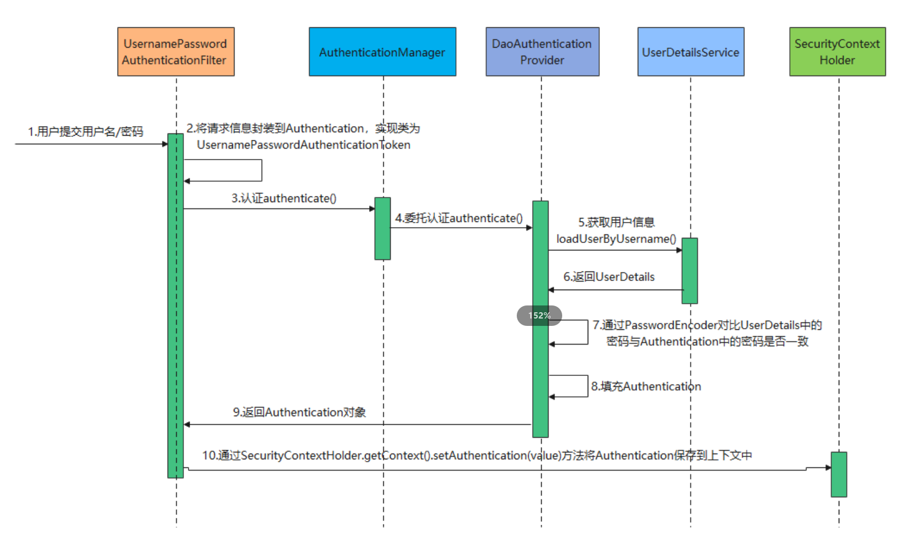

### 单词
Authentication：认证
Authorization：授权
### POM
```xml
<dependency>
    <groupId>org.springframework.boot</groupId>
    <artifactId>spring-boot-starter-security</artifactId>
</dependency>
```
### Filter
#### 常见过滤器
> **BasicAuthenticationFilter**
> 如果在请求中找到一个Basic Auth HTTP头，如果找到，则尝试用该头中的用户名和密码验证用户

> **UsernamePasswordAuthenticationFilter**
> 如果在请求参数或者POST的RequestBody中找到用户名/密码，则尝试用这些值对用户进行身份验证

> **DefaultLoginPageGeneratingFilter**
> 默认登录页面生成过滤器。用于生成一个登录页面，如果你没有明确地禁用这个功能，那么就会生成一个登录页面。这就是为什么在启用Spring Security时，会得到一个默认登录页面的原因。

> **DefaultLogoutPageGeneratingFilter**
> 如果没有禁用该功能，则会生成一个注销页面。

> **FilterSecurityInterceptor**
> 过滤安全拦截器。用于授权逻辑


### 认证-Authentication

自然语言描述：

1. 用户提交用户名/密码 ==> 调用`new UsernamePasswordAuthenticationToken(user.getUsername(), user.getPassword())`生成未认证的`Authentication`
2. 调用`authenticationManager.authenticate(authenticationToken)`认证
   1. 其具体实现为：`ProviderManager.authenticate(authentication)`
3. `ProviderManager`将委托`DaoAuthenticationProvider`去认证
   1. `DaoAuthenticationProvider`的`authenticate`方法是继承抽象父类`AbstractUserDetailsAuthenticationProvider`的
   2. 在父类的`authenticate`方法中 调用子类覆写的抽象方法 `retrieveUser`通过`UserDetailsService().loadUserByUsername`获取`**UserDetails**`对象
   3. 加载成功后调用子类覆写的抽象方法`additionalAuthenticationChecks`判断**密码**是否一致
   4. 最后调用方法`createSuccessAuthentication`构建认证后的`Authentication`
      1. 在这里会先调用`DaoAuthenticationProvider`的`createSuccessAuthentication`方法，判断是否需要升级密码，通过`userDetailsPasswordService.updatePassword`方法升级
   5. **注意**：`retrieveUser`、`additionalAuthenticationChecks`、`createSuccessAuthentication`在`DaoAuthenticationProvider`中均有覆写
4. 认证完成后返回`Authentication`
5. 在访问**非登录请求**时，可以通过请求携带的**token**获取**UserDetails**对象，然后构建**已经认证**的`Authenticate`，最后通过`SecurityContextHolder.getContext().setAuthentication(authenticationToken);`保存到上下文中，表示已经认证过了
6. **注意**：构建已经认证的`Authenticate`一般通过`UsernamePasswordAuthenticationToken`生成
### 授权-Authorization
@PreAuthorize：此注解用于在方法执行之前指定一个访问控制表达式。它允许您根据用户角色、权限或其他条件定义细粒度的授权规则。如果表达式的结果为false或抛出异常，则拒绝方法调用。
@PreFilter：此注解用于对传入的集合或数组参数进行过滤。它允许您在方法执行之前对参数进行自定义的过滤操作。您可以根据特定条件筛选集合中的元素，从而控制方法的输入。
@PostAuthorize：此注解用于在方法执行之后指定一个访问控制表达式。它允许您在方法返回结果之后对结果进行进一步的授权检查。如果表达式的结果为false或抛出异常，则拒绝方法的返回值。
@PostFilter：此注解用于对方法返回的集合或数组结果进行过滤。它允许您在方法执行之后对返回结果进行自定义的过滤操作。您可以根据特定条件筛选集合中的元素，从而控制方法的输出。
@PreAuthorize和@PreFilter会调用`PreInvocationAuthorizationAdviceVoter.vote`判断是否有权限
> 使用
> @PreAuthorize("hasAuthority('sys:test:access') or hasRole('ADMIN')")
> @PreAuthorize("@authorizationService.isValidUser(authentication,'zhangsan')") //方法返回boolean


### 其他配置
```java
@Override
public void configure(WebSecurity web) throws Exception {
    web
            //将匹配到的请求忽略，不过 过滤链
            .ignoring().antMatchers("/public/**");
}

@Bean
@Override
public AuthenticationManager authenticationManagerBean() throws Exception {
    //向容器中注入AuthenticationManager
    return super.authenticationManagerBean();
}

/**
 * DelegatingPasswordEncoder允许以不同的格式验证密码，提供升级的可能性
 * 密码格式  {bcrypt}password  
 */
@Bean
PasswordEncoder passwordEncoder(){
    String idForEncode = "bcrypt";
    HashMap<String, PasswordEncoder> map = new HashMap<>();
    map.put(idForEncode,new BCryptPasswordEncoder());
    map.put("SHA-1",new MessageDigestPasswordEncoder("SHA-1"));
    //以 bcrypt 为默认密码加密器
    return new DelegatingPasswordEncoder(idForEncode,map);
}

/**
 * 一般用于替换UsernamePasswordAuthenticationFilter时使用
 * 认证成功的处理器
 */
private AuthenticationSuccessHandler successHandler(){
    return (req,res,auth) -> {
        res.setStatus(HttpStatus.OK.value());
        res.getWriter().println(objectMapper.writeValueAsString(R.success(auth)));
        res.setCharacterEncoding("UTF-8");
        log.debug("认证成功");
    };
}

/**
 * 一般用于替换UsernamePasswordAuthenticationFilter时使用
 * 认证失败的处理器
 */
private AuthenticationFailureHandler failureHandler(){
    return (req,res,ex) -> {
        log.error(ex.getMessage());
        res.setStatus(HttpStatus.UNAUTHORIZED.value());//unauthorized
        res.setContentType(MediaType.APPLICATION_JSON_VALUE);
        res.setCharacterEncoding("UTF-8");
        res.getWriter().write(objectMapper.writeValueAsString(R.build(R.ERROR_CODE,ex.getMessage(),"认证失败")));
    };
}

/**
 * 替换UsernamePasswordAuthenticationFilter的Filter
 */
private RestAuthenticationFilter restAuthenticationFilter() throws Exception{
    RestAuthenticationFilter filter = new RestAuthenticationFilter(objectMapper);
    //必须配置登录成功 和 登录失败处理器
    filter.setAuthenticationSuccessHandler(successHandler());
    filter.setAuthenticationFailureHandler(failureHandler());
    filter.setAuthenticationManager(authenticationManager());
    filter.setFilterProcessesUrl("/authorize/login"); //该过滤器匹配的方法
    return filter;
}

//认证失败异常处理
@Slf4j
@RequiredArgsConstructor
public class AuthenticationEntryPointImpl implements AuthenticationEntryPoint {
    private final ObjectMapper objectMapper;
    @Override
    public void commence(HttpServletRequest httpServletRequest, HttpServletResponse httpServletResponse, AuthenticationException e) throws IOException, ServletException {
        log.error("AuthenticationEntryPointImpl:请先登录");
        httpServletResponse.setStatus(HttpStatus.OK.value());
        httpServletResponse.setCharacterEncoding("UTF-8");
        httpServletResponse.getWriter().println(objectMapper.writeValueAsString(R.error(50001,"请先登录")));
    }
}
//访问失败异常处理
@RequiredArgsConstructor
@Slf4j
public class AccessDeniedHandlerImpl implements AccessDeniedHandler {
    private final ObjectMapper objectMapper;
    @Override
    public void handle(HttpServletRequest httpServletRequest, HttpServletResponse httpServletResponse, AccessDeniedException e) throws IOException, ServletException {
        log.error("AccessDeniedHandlerImpl:"+e.getMessage());
        httpServletResponse.setStatus(HttpStatus.OK.value());
        httpServletResponse.setCharacterEncoding("UTF-8");
        httpServletResponse.getWriter().println(objectMapper.writeValueAsString(R.error(50002,"没有权限")));
    }
}
@Override
protected void configure(HttpSecurity http) throws Exception {
    http.exceptionHandling(exceptionHandling -> exceptionHandling
        //认证失败处理器
        .authenticationEntryPoint(new AuthenticationEntryPointImpl(objectMapper))
        //访问拒绝处理器 如果 AccessDeniedException 在全局异常处理器扫描的范围内 那这个异常会被全局异常处理器捕捉到 不会执行自定义的授权失败处理器
        .accessDeniedHandler(new AccessDeniedHandlerImpl(objectMapper)));
}
```
### Web方案
```java
@EnableGlobalMethodSecurity(prePostEnabled = true)
public class SecurityConfig extends WebSecurityConfigurerAdapter {

    @Autowired
    private SecurityUserDetailsService userDetailsService;

    @Override
    protected void configure(AuthenticationManagerBuilder auth) throws Exception {
        //使用自定义userDetailsService
        auth.userDetailsService(userDetailsService);
    }

    @Bean
    PasswordEncoder passwordEncoder(){
        //密码编码工具
        return new BCryptPasswordEncoder();
    }

    @Override
    protected void configure(HttpSecurity http) throws Exception {
        http
                .csrf(AbstractHttpConfigurer::disable) //csrf禁用
                .authorizeRequests(auth -> {
                    //这里可以放行部分请求
                    auth.antMatchers("/**").authenticated(); //所有请求需要认证
                })
                .formLogin(form->{
                    form
                            .loginProcessingUrl("/login") //登录请求
                            .successForwardUrl("/success")
                            .failureForwardUrl("/login")    
                    ;
                })
        ;
    }

    @Override
    public void configure(WebSecurity web) throws Exception {
        web
            //忽略匹配到的请求，不经过 过滤链
            //可以在这里放行 静态资源
                .ignoring().antMatchers("/public/**");
    }

}
```
### 使用API登录方案
#### 后端登录接口
```java
/**
 * 登录
 */
@PostMapping("/login")
public R login(@Valid @RequestBody LoginDto user){
    UsernamePasswordAuthenticationToken authentication = new UsernamePasswordAuthenticationToken(user.getUsername(), user.getPassword());
    Authentication authenticate = authenticationManager.authenticate(authentication);
    if(Objects.isNull(authenticate)){
        throw new RuntimeException("登录失败");
    }
    UserDetails principal = (UserDetails) authenticate.getPrincipal();
    String accessToken = jwtUtil.createAccessToken(principal);
    String refreshToken = jwtUtil.createRefreshToken(principal);
    return R.success(new Auth(accessToken,refreshToken));
}

/**
 * 刷新token
 */
@GetMapping("/refresh")
public R refresh(@RequestHeader(name = "Authorization") String authorization,
                 @RequestParam String refreshToken){
    String PREFIX = "Bearer ";
    String accessToken = authorization.replace(PREFIX, "");
    if (jwtUtil.validateRefreshToken(refreshToken) && jwtUtil.validateWithoutExpiration(accessToken)) {
        return R.success(new Auth(jwtUtil.buildAccessTokenWithRefreshToken(refreshToken), refreshToken));
    }
    return R.error(50001,"请先登录");
}
```
#### SecurityConfig
```java
//开启方法级安全注解  @preAuthorize,@PreFilter,@PostAuthorize,@PostFilter
@EnableGlobalMethodSecurity(prePostEnabled = true)
@RequiredArgsConstructor
@Slf4j
public class SecurityConfig extends WebSecurityConfigurerAdapter {
    private final ObjectMapper objectMapper;
    private final JwtFilter jwtFilter;
    @Override
    protected void configure(HttpSecurity http) throws Exception {
        http
                .csrf(c -> c.disable())
                .sessionManagement(sessionManagement -> sessionManagement
                        .sessionCreationPolicy(SessionCreationPolicy.STATELESS))
                .authorizeRequests(req -> req
                                .antMatchers("/authorize/**").permitAll()
                                .anyRequest().authenticated())
                .addFilterBefore(jwtFilter,UsernamePasswordAuthenticationFilter.class)
                .exceptionHandling(exceptionHandling -> exceptionHandling
                        //授权失败处理器
                        .authenticationEntryPoint(new AuthenticationEntryPointImpl(objectMapper))
                        //访问拒绝处理器 如果 AccessDeniedException 在全局异常处理器扫描的范围内 那这个异常会被全局异常处理器捕捉到 不会执行自定义的授权失败处理器
                        .accessDeniedHandler(new AccessDeniedHandlerImpl(objectMapper)))
                .formLogin(AbstractHttpConfigurer::disable)
        ;
    }
 
    @Override
    protected void configure(AuthenticationManagerBuilder auth) throws Exception {
        //重写 该配置方法 即可获取AuthenticationManager
        auth.inMemoryAuthentication()
                .withUser("user")
                .password("{bcrypt}$2a$10$12p6EtX5LKvLjK1ANdArT.Zo0vLsACEPuiljiwtWTDIgDIs3eq8G2")
                .roles("ADMIN")
                .and()
                .withUser("zhangsan")
                .password("{SHA-1}{X6Qh/736UeB/NWtrcr/20tgQvoMi+RIHJN2kG+IN1gg=}21d40b02864905624579031b45e95e62731dd264")
                .roles("USER")
        ;
        // 注意：这里使用固定的用户，如果配合数据库使用，需要覆写UserDetailsService
    }

    /**
     * DelegatingPasswordEncoder允许以不同的格式验证密码，提供升级的可能性
     */
    @Bean
    PasswordEncoder passwordEncoder(){
        String idForEncode = "bcrypt";
        HashMap<String, PasswordEncoder> map = new HashMap<>();
        map.put(idForEncode,new BCryptPasswordEncoder());
        map.put("SHA-1",new MessageDigestPasswordEncoder("SHA-1"));
        //以 bcrypt 为默认密码加密器
        return new DelegatingPasswordEncoder(idForEncode,map);
    }

    @Bean
    @Override
    public AuthenticationManager authenticationManagerBean() throws Exception {
        return super.authenticationManagerBean();
    }
}

```
#### JwtFilter
```java
@Component
@RequiredArgsConstructor
@Slf4j
public class JwtFilter extends OncePerRequestFilter{

    private final AppProperties appProperties;

    private final JwtUtil jwtUtil;

    @Override
    protected void doFilterInternal(HttpServletRequest httpServletRequest, HttpServletResponse httpServletResponse, FilterChain filterChain) throws ServletException, IOException {
        log.info("url:{}",httpServletRequest.getRequestURI());  //url:/member/hello
        if(jwtUtil.checkJwtToken(httpServletRequest)){
            Optional<Claims> optional = jwtUtil.validateToken(httpServletRequest);

            boolean present = optional.filter(claims -> claims.get("authorities") != null).isPresent();
            if (present) {
                Claims claims = optional.get();
                setupSpringAuthentication(claims);
            }else {
                SecurityContextHolder.clearContext();
            }
        }
        filterChain.doFilter(httpServletRequest, httpServletResponse);
    }

    /**
     * 设置授权信息
     */
    private void setupSpringAuthentication(Claims claims) {
        List<SimpleGrantedAuthority> authorities = CollectionUtil.convertObjectToList(claims.get("authorities"))
                .stream()
                .map(String::valueOf)
                .map(SimpleGrantedAuthority::new)
                .collect(Collectors.toList());
        //将登录信息保存到ThreadLocal中 ...
        UsernamePasswordAuthenticationToken authenticationToken = new UsernamePasswordAuthenticationToken(claims.getSubject(), null, authorities);
        SecurityContextHolder.getContext().setAuthentication(authenticationToken);
    }

}

```
#### JwtUtil
```java
//POM依赖
<jjwt.version>0.11.1</jjwt.version>
<!-- JWT 依赖开始 -->
<dependency>
    <groupId>io.jsonwebtoken</groupId>
    <artifactId>jjwt-api</artifactId>
    <version>${jjwt.version}</version>
</dependency>
<dependency>
    <groupId>io.jsonwebtoken</groupId>
    <artifactId>jjwt-impl</artifactId>
    <version>${jjwt.version}</version>
    <scope>runtime</scope>
</dependency>
<dependency>
    <groupId>io.jsonwebtoken</groupId>
    <artifactId>jjwt-jackson</artifactId>
    <version>${jjwt.version}</version>
    <scope>runtime</scope>
</dependency>
<!-- JWT 依赖结束 -->    


import io.jsonwebtoken.*;
import io.jsonwebtoken.security.Keys;
import lombok.RequiredArgsConstructor;
import lombok.val;
import org.springframework.security.access.AccessDeniedException;
import org.springframework.security.core.GrantedAuthority;
import org.springframework.security.core.userdetails.UserDetails;
import org.springframework.stereotype.Component;
import top.wlpnz.auth.config.AppProperties;

import javax.servlet.http.HttpServletRequest;
import java.security.Key;
import java.util.Date;
import java.util.Optional;
import java.util.stream.Collectors;

@RequiredArgsConstructor
@Component
public class JwtUtil {

    public static final Key key = Keys.secretKeyFor(SignatureAlgorithm.HS512); // 用于签名 Access Token
    public static final Key refreshKey = Keys.secretKeyFor(SignatureAlgorithm.HS512); // 用于签名 Refresh Token
    private final AppProperties appProperties;

    public String createJWTToken(UserDetails userDetails, long timeToExpire) {
        return createJWTToken(userDetails, timeToExpire, key);
    }

    /**
     * 根据用户信息生成一个 JWT
     *
     * @param userDetails  用户信息
     * @param timeToExpire 毫秒单位的失效时间
     * @param signKey      签名使用的 key
     * @return JWT
     */
    public String createJWTToken(UserDetails userDetails, long timeToExpire, Key signKey) {
        return Jwts
                .builder()
                .setId("wulan")
                .setSubject(userDetails.getUsername())
                .claim("authorities",
                        userDetails.getAuthorities().stream()
                                .map(GrantedAuthority::getAuthority)
                                .collect(Collectors.toList()))
                .setIssuedAt(new Date(System.currentTimeMillis()))
                .setExpiration(new Date(System.currentTimeMillis() + timeToExpire))
                .signWith(signKey, SignatureAlgorithm.HS512).compact();
    }

    /**
     * 创建jwtToken
     */
    public String createAccessToken(UserDetails userDetails) {
        return createJWTToken(userDetails, appProperties.getJwt().getAccessTokenExpireTime());
    }

    public String createRefreshToken(UserDetails userDetails) {
        return createJWTToken(userDetails, appProperties.getJwt().getRefreshTokenExpireTime(), refreshKey);
    }

    public boolean validateAccessToken(String jwtToken) {
        return validateToken(jwtToken, key);
    }

    public boolean validateRefreshToken(String jwtToken) {
        return validateToken(jwtToken, refreshKey);
    }

    public boolean validateToken(String jwtToken, Key signKey) {
        try {
            Jwts.parserBuilder().setSigningKey(signKey).build().parseClaimsJws(jwtToken);
            return true;
        } catch (ExpiredJwtException | SignatureException | MalformedJwtException | UnsupportedJwtException | IllegalArgumentException e) {
            return false;
        }
    }

    /**
     * 使用refreshToken 创建新的 accessToken
     */
    public String buildAccessTokenWithRefreshToken(String refreshToken) {
        return parseClaims(refreshToken, refreshKey)
                .map(claims -> Jwts.builder()
                        .setClaims(claims)
                        .setExpiration(new Date(System.currentTimeMillis() + appProperties.getJwt().getAccessTokenExpireTime()))
                        .signWith(key, SignatureAlgorithm.HS512).compact())
                .orElseThrow(()->new AccessDeniedException("访问被拒绝"));
    }

    public Optional<Claims> parseClaims(String jwtToken, Key signKey) {
        try {
            Claims claims = Jwts.parserBuilder().setSigningKey(signKey).build().parseClaimsJws(jwtToken).getBody();
            return Optional.of(claims);
        } catch (Exception e) {
            return Optional.empty();
        }
    }

    /**
     * 验证token 除去过期异常
     * @param jwtToken
     * @return
     */
    public boolean validateWithoutExpiration(String jwtToken) {
        try {
            Jwts.parserBuilder().setSigningKey(JwtUtil.key).build().parseClaimsJws(jwtToken);
            return true;
        } catch (ExpiredJwtException | SignatureException | MalformedJwtException | UnsupportedJwtException | IllegalArgumentException e) {
            if (e instanceof ExpiredJwtException) {
                return true;
            }
        }
        return false;
    }
    
    /**
     * 检查 JWT Access Token 是否在 HTTP 报头中
     */
    public boolean checkJwtToken(HttpServletRequest request) {
        String authenticationHeader = request.getHeader(appProperties.getJwt().getHeader());
        return authenticationHeader != null && authenticationHeader.startsWith(appProperties.getJwt().getPrefix());
    }

    /**
     * 通过request 获取封装认证信息的Optional对象
     */
    public Optional<Claims> validateToken(HttpServletRequest request){
        String jwtToken = request.getHeader(appProperties.getJwt().getHeader()).replace(appProperties.getJwt().getPrefix(), "");
        try {
            return parseClaims(jwtToken, JwtUtil.key);
        } catch ( ExpiredJwtException | SignatureException | MalformedJwtException | UnsupportedJwtException | IllegalArgumentException e) {
            return Optional.empty();
        }
    }
}

```
#### AppProperties
```java
@Component
@ConfigurationProperties(prefix = "wulan")
public class AppProperties {
    @Getter
    @Setter
    private Jwt jwt = new Jwt();
    
    @Getter
    @Setter
    public static class Jwt {

        private String header = "Authorization"; // HTTP 报头的认证字段的 key

        private String prefix = "Bearer "; // HTTP 报头的认证字段的值的前缀

        private long accessTokenExpireTime = 60 * 1000L; // Access Token 过期时间

        private long refreshTokenExpireTime = 30 * 24 * 3600 * 1000L; // Refresh Token 过期时间
    }
}
```
#### 全局异常处理
```java
@Slf4j
@RestControllerAdvice(basePackages = {"top.wlpnz.auth.controller"})
public class GlobalExceptionAdvice {


    @ExceptionHandler(MethodArgumentNotValidException.class)
    public R handleMethodArgumentNotValidException(MethodArgumentNotValidException ex){
        log.error("数据校验异常：{}，异常类型：{}", ex.getMessage(),ex.getClass());
        HashMap<String, Object> map = new HashMap<>();
        BindingResult result = ex.getBindingResult();
        result.getAllErrors().forEach(item -> map.put(Objects.requireNonNull(item.getCodes())[item.getCodes().length-1],item.getDefaultMessage()));
        return R.build(R.ERROR_CODE,map,"数据校验异常");
    }

    //权限校验失败
    @ExceptionHandler(value = AccessDeniedException.class)
    public R accessDeniedException(AccessDeniedException ex){
        log.error("class:{},msg:{}",ex.getClass(),ex.getMessage());
        return R.error("没有权限");
    }

    //密码验证失败
    @ExceptionHandler(BadCredentialsException.class)
    public R badCredentialsException(BadCredentialsException ex){
        log.error("class:{},msg:{}",ex.getClass(),ex.getMessage());
        return R.error("密码错误");
    }

    @ExceptionHandler(Exception.class)
    public R handleException(Exception ex){
        log.error("exception class:{},msg:{}",ex.getClass(),ex.getMessage());
        return R.error(ex.getMessage());
    }
}
```

### 使用技巧
> 在已经认证的security中，可以通过` SecurityContextHolder.getContext().getAuthentication().getName();`获取用户的唯一凭证，即在认证时保存的username

