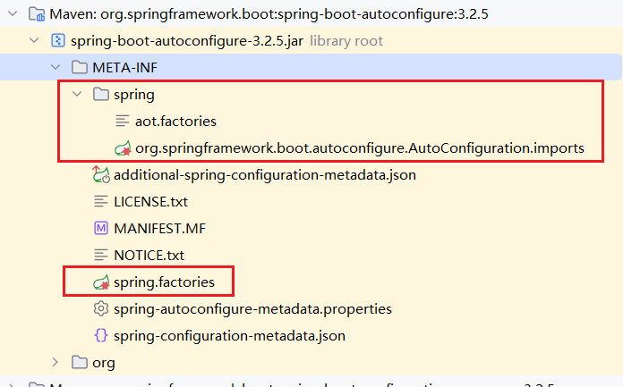

### SpringBoot自定义Starter

## SpringBoot2.7.x以下

POM
```xml
<parent>
    <groupId>org.springframework.boot</groupId>
    <artifactId>spring-boot-starter-parent</artifactId>
    <version>2.4.13</version>
    <relativePath/> <!-- lookup parent from repository -->
</parent>

<dependencies>
    <dependency>
        <groupId>org.springframework.boot</groupId>
        <artifactId>spring-boot-starter</artifactId>
    </dependency>
    <dependency>
        <groupId>org.springframework.boot</groupId>
        <artifactId>spring-boot-autoconfigure</artifactId>
    </dependency>
    <dependency>
        <groupId>org.springframework.boot</groupId>
        <artifactId>spring-boot-configuration-processor</artifactId>
    </dependency>

</dependencies>
```
application.yaml
```yaml
temp:
  name: temp-starter
  address: address
```
TempProperties
```java
@ConfigurationProperties(prefix = "temp")
public class TempProperties {
    private String name;

    private String address;
    public String getName() {
        return name;
    }

    public void setName(String name) {
        this.name = name;
    }

    public String getAddress() {
        return address;
    }

    public void setAddress(String address) {
        this.address = address;
    }

    public TempProperties() {
    }

    public TempProperties(String name, String address) {
        this.name = name;
        this.address = address;
    }
}
```
TempService
```java
public class TempService {
    private String name;
    private String address;

    public TempService(String name, String address) {
        this.name = name;
        this.address = address;
    }
    public String sayHello(){
        return "我的名字 " + this.name + ", 地址 " + this.address;
    }
}
```
TempAutoConfiguration
```java
@Configuration
@EnableConfigurationProperties(value = TempProperties.class)
public class TempAutoConfiguration {
    private final TempProperties tempProperties;

    public TempAutoConfiguration(TempProperties tempProperties){
        this.tempProperties = tempProperties;
    }

    @Bean
    public TempService tempService(){
        return new TempService(tempProperties.getName(), tempProperties.getAddress());
    }
}
```
在resources下创建文件夹`META-INF`**,**在META-INF下新建文件`spring.factories`
```latex
org.springframework.boot.autoconfigure.EnableAutoConfiguration=\
top.wlpnz.temp.TempAutoConfiguration,\
top.wlpnz.temp.OtherAutoConfiguration   # 演示多自动装配类情况
```
## SpringBoot2.7.x及以上
POM
```xml
<parent>
    <groupId>org.springframework.boot</groupId>
    <artifactId>spring-boot-starter-parent</artifactId>
    <version>3.2.5</version>
    <relativePath/> <!-- lookup parent from repository -->
</parent>

<dependencies>
    <dependency>
        <groupId>org.springframework.boot</groupId>
        <artifactId>spring-boot-starter</artifactId>
    </dependency>
    <dependency>
        <groupId>org.springframework.boot</groupId>
        <artifactId>spring-boot-autoconfigure</artifactId>
    </dependency>

    <dependency>
        <groupId>org.springframework.boot</groupId>
        <artifactId>spring-boot-configuration-processor</artifactId>
    </dependency>

</dependencies>
```
application.yaml、Properties、Service、AutoConfiguration同上
在resources下创建文件夹`META-INF/spring`**,**
在spring文件夹下新建文件`org.springframework.boot.autoconfigure.AutoConfiguration.imports`

```latex
top.wlpnz.hello.config.HelloServiceAutoConfiguration
top.wlpnz.hello.config.InterceptorAutoConfiguration  
# 多自动装配类 情况
```

## 注意
:::info
3.x可以引用2.x的starter，但存在兼容问题

2.7.x及以上可以引用3.x的starter，存在兼容问题

2.7.x以下不能引用3.x的starter，项目不能启动

这里的2.x，3.x指的SpringBoot Version

在自定义的starter中，所有注入到容器中的**类**，都应该有一个**空参**的构造函数
:::

SpringBoot 2.7.x开始，自动装配的机制开始改动，但是有向后兼容的机制





## 报错
问题一：

**Consider defining a bean of type ‘java.lang.String‘ in your configuration**

解决：

在相应的类中加入空参的构造函数


