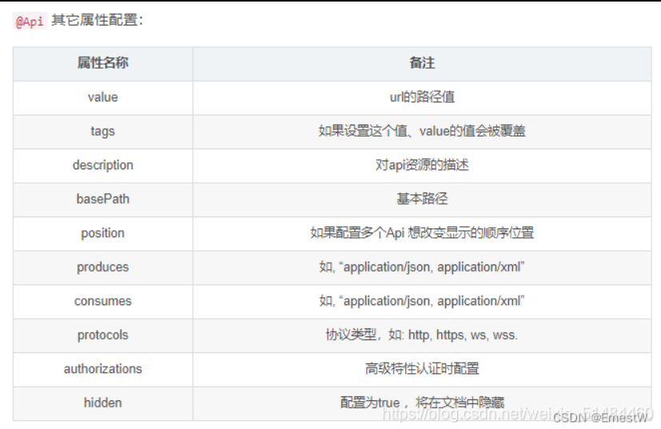

### SpringBoot集成knife4j
[快速开始 | Knife4j](https://doc.xiaominfo.com/docs/quick-start)

#### 快速开始
##### 依赖(springboot2.x)
```xml
<dependency>
    <groupId>com.github.xiaoymin</groupId>
    <artifactId>knife4j-openapi2-spring-boot-starter</artifactId>
    <version>4.3.0</version>
</dependency>
```
##### 配置

```yaml
# application.yml
knife4j:
  enable: true
  openapi:
    title: Knife4j文档
    description: "`这是一个测试`,**这里会加粗**"
    email: wl_pnz@163.com
    concat: 雾岚
    url: https://wlpnz.top
    version: v1.0
    license: Apache 2.0
    license-url: https://stackoverflow.com/
    terms-of-service-url: https://stackoverflow.com/
    group:
      default:
        group-name: default
        api-rule: package
        api-rule-resources:
          - top.wlpnz.auth.controller
      test1:
        group-name: test1
        api-rule: package
        api-rule-resources:
          - top.wlpnz.auth.new1
```
##### 访问
> http://ip:port/doc.html

如果项目中集成了安全框架则需要放行静态资源
```
/doc.html
/v2/api-docs/**
/webjars/**
/swagger-resources/**


```
#### 常用注解
##### 用于类上
@Api：用在请求的类上，表示对类的说明
tags=“说明该类的作用，可以在UI界面上看到的注解”
value=“该参数没什么意义，在UI界面上也看到，所以不需要配置”


##### 用在方法上
**@ApiOperation**：用在请求的方法上，说明方法的用途、作用
value=“说明方法的用途、作用”
notes=“方法的备注说明”
**@ApiImplicitParams**：用在请求的方法上，表示一组参数说明
**@ApiImplicitParam**：用在@ApiImplicitParams注解中，指定一个请求参数的各个方面
name：参数名
value：参数的汉字说明、解释
required：参数是否必须传
paramType：参数放在哪个地方
· header --> 请求参数的获取：@RequestHeader
· query --> 请求参数的获取：@RequestParam
· path（用于restful接口）–> 请求参数的获取：@PathVariable
· div（不常用）
· form（不常用）
dataType：参数类型，默认String，其它值dataType=“Integer”
defaultValue：参数的默认值
```java
@Api(tags="用户模块")
@Controller
public class UserController {

	@ApiOperation(value="用户登录",notes="随边说点啥")
	@ApiImplicitParams({
		@ApiImplicitParam(name="mobile",value="手机号",required=true,paramType="form"),
		@ApiImplicitParam(name="password",value="密码",required=true,paramType="form"),
		@ApiImplicitParam(name="age",value="年龄",required=true,paramType="form",dataType="Integer")
	})
	@PostMapping("/login")
	public JsonResult login(@RequestParam String mobile, @RequestParam String password,
	@RequestParam Integer age){
		//...
	    return JsonResult.ok(map);
	}
}
```
**@ApiResponses**：用在请求的方法上，表示一组响应
**@ApiResponse**：用在@ApiResponses中，一般用于表达一个错误的响应信息
code：数字，例如400
message：信息，例如"请求参数没填好"
response：抛出异常的类
```java
@Api(tags="用户模块")
@Controller
public class UserController {

	@ApiOperation("获取用户信息")
	@ApiImplicitParams({
		@ApiImplicitParam(paramType="query", name="userId", dataType="String", required=true, value="用户Id")
	}) 
	@ApiResponses({
		@ApiResponse(code = 200, message = "请求成功"),
		@ApiResponse(code = 400, message = "请求参数没填好"),
		@ApiResponse(code = 404, message = "请求路径没有或页面跳转路径不对")
	}) 
	@ResponseBody
	@RequestMapping("/list")
	public JsonResult list(@RequestParam String userId) {
		...
		return JsonResult.ok().put("page", pageUtil);
	}
}
```
##### 用在对象类上
@ApiModel：用于响应类上，表示一个返回响应数据的信息
（这种一般用在post创建的时候，使用@RequestBody这样的场景，
请求参数无法使用@ApiImplicitParam注解进行描述的时候）
@ApiModelProperty：用在属性上，描述响应类的属性
value–字段说明
name–重写属性名字
dataType–重写属性类型
required–是否必填
example–举例说明
hidden–隐藏

@ApiModel的功能：
1、当请求数据描述，即 @RequestBody 时， 用于封装请求（包括数据的各种校验）数据；
2、当响应值是对象时，即 @ResponseBody 时，用于返回值对象的描述。
当请求数据描述时， @RequestBody 时的使用
```java
@ApiModel(description = "用户登录")
public class UserLoginVO implements Serializable {

	private static final long serialVersionUID = 1L;

	@ApiModelProperty(value = "用户名",required=true)	
	private String username;

	@ApiModelProperty(value = "密码",required=true)	
	private String password;
}

```
##### 快捷链接
```java
Environment env = application.getEnvironment();
        log.info("\n----------------------------------------------------------\n\t" +
                        "应用 '{}' 运行成功! 访问连接:\n\t" +
                        "Swagger文档: \t\thttp://{}:{}{}/doc.html\n\t" +
                        "----------------------------------------------------------",
                env.getProperty("spring.application.name"),
                InetAddress.getLocalHost().getHostAddress(),
                env.getProperty("server.port"),
                env.getProperty("server.servlet.context-path") != null ? env.getProperty("server.servlet.context-path") : "" );
```

### SpringCloud Gateway集成Knife4j
#### 官网
[Spring Cloud Gateway网关聚合](https://doc.xiaominfo.com/docs/middleware-sources/spring-cloud-gateway/spring-gateway-introduction)
> 只提供聚合作用，接口来源于子服务的knife4j配置
#### POM
```xml
<dependency>
    <groupId>com.github.xiaoymin</groupId>
    <artifactId>knife4j-gateway-spring-boot-starter</artifactId>
    <version>4.3.0</version>
</dependency>
```
#### 配置文件
```yaml
knife4j:
  gateway:
    enabled: true
    tags-sorter: order
    operations-sorter: order
    # 自动发现（只扫描default分组的接口，且只扫描gateway的routes配置）
    strategy: discover  
    routes: # 将非default分组的接口手动加入聚合组件中
      - name: 用户服务1
        # 真实子服务访问url地址-提供OpenAPI的文档
        url: /user/v2/api-docs?group=default1
        service-name: user-server
        order: 2
    #扫描
    discover:
      enabled: true
      version: swagger2
```

### SpringBoot3.x集成

**依赖springboot3.x**

```xml
<dependency>
    <groupId>com.github.xiaoymin</groupId>
    <artifactId>knife4j-openapi3-jakarta-spring-boot-starter</artifactId>
    <version>4.4.0</version>
</dependency>
```

**放行资源**

```java
public static final String[] API_WHITELIST = {
            "/swagger-ui/**",
            "/swagger-ui/index.html",
            "/swagger-ui.html",
            "/swagger-ui.html/**",
            "/v3/api-docs",
            "/v3/api-docs/**",
            "/doc.html",
    		"/swagger-resources",
    };

@Override
public void addResourceHandlers(ResourceHandlerRegistry registry) {
    registry.addResourceHandler("doc.html").addResourceLocations("classpath:/META-INF/resources/");
    registry.addResourceHandler("/webjars/**").addResourceLocations("classpath:/META-INF/resources/webjars/");
}
```

