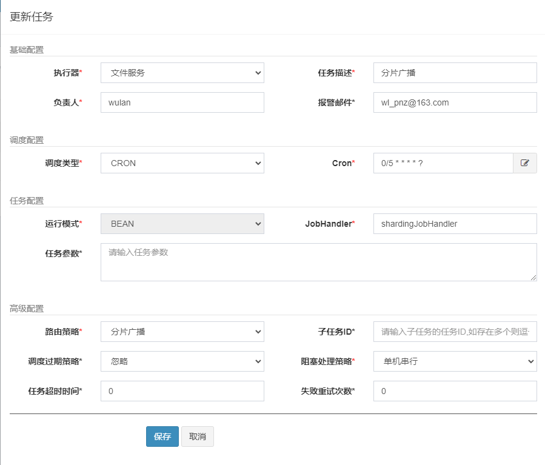

### SpringBoot集成Xxl-job
官网：[https://www.xuxueli.com/xxl-job/](https://www.xuxueli.com/xxl-job/)
github:[GitHub - xuxueli/xxl-job:分布式任务调度平台XXL-JOB）](https://github.com/xuxueli/xxl-job/tree/master)
#### docker部署xxl-job-admin容器
```latex
docker pull xuxueli/xxl-job-admin:2.4.0
sql地址：https://github.com/xuxueli/xxl-job/blob/master/doc/db/tables_xxl_job.sql
docker run -e PARAMS="--spring.datasource.url=jdbc:mysql://192.168.10.3:3306/xxl_job?useUnicode=true&characterEncoding=UTF-8&autoReconnect=true&serverTimezone=Asia/Shanghai --spring.datasource.username=tute --spring.datasource.password=abcd1234" -p 8090:8080 -v D:\software\xxl-job-admin:/data/applogs --name xxl-job-admin -d xuxueli/xxl-job-admin:2.4.0

访问路径：http://localhost:8090/xxl-job-admin/  账号密码：admin/123456
```
#### 执行器
**POM依赖**
```xml
<dependency>
    <groupId>com.xuxueli</groupId>
    <artifactId>xxl-job-core</artifactId>
    <version>2.4.0</version>
</dependency>
```
**application.yml**
```yaml
xxl:
  job:
    admin:
      addresses: http://localhost:8090/xxl-job-admin
    executor:
      appname: file-server-system # 执行器的名称
      address:
      ip:
      port: 9999 # 本地启动多个执行器注意端口不能重复
      logpath: /data/applogs/xxl-job/jobhandler
      logretentiondays: 30
    accessToken: default_token
```
**XxlJobConfig**
```java
@Configuration
public class XxlJobConfig {
    @Value("${xxl.job.admin.addresses}")
    private String adminAddresses;
    @Value("${xxl.job.accessToken}")
    private String accessToken;
    @Value("${xxl.job.executor.appname}")
    private String appname;
    @Value("${xxl.job.executor.address}")
    private String address;
    @Value("${xxl.job.executor.ip}")
    private String ip;
    @Value("${xxl.job.executor.port}")
    private int port;
    @Value("${xxl.job.executor.logpath}")
    private String logPath;
    @Value("${xxl.job.executor.logretentiondays}")
    private int logRetentionDays;
    @Bean
    public XxlJobSpringExecutor xxlJobExecutor() {
        XxlJobSpringExecutor xxlJobSpringExecutor = new XxlJobSpringExecutor();
        xxlJobSpringExecutor.setAdminAddresses(adminAddresses);
        xxlJobSpringExecutor.setAppname(appname);
        xxlJobSpringExecutor.setAddress(address);
        xxlJobSpringExecutor.setIp(ip);
        xxlJobSpringExecutor.setPort(port);
        xxlJobSpringExecutor.setAccessToken(accessToken);
        xxlJobSpringExecutor.setLogPath(logPath);
        xxlJobSpringExecutor.setLogRetentionDays(logRetentionDays);
        return xxlJobSpringExecutor;
    }
}
```
**设置执行任务**
```java
@Component
@Slf4j
public class SampleXxlJob {
    /**
     * 1、简单任务示例（Bean模式）
     */
    @XxlJob("demoJobHandler")
    public void demoJobHandler() throws Exception {
        log.info("XXL-JOB, Hello World.");
        // default success
    }
    /**
     * 2、分片广播任务
     */
    @XxlJob("shardingJobHandler")
    public void shardingJobHandler() throws Exception {
        // 分片参数
        int shardIndex = XxlJobHelper.getShardIndex(); //获取当前分片的序号
        int shardTotal = XxlJobHelper.getShardTotal();  //获取分片总数
        log.info("分片参数：当前分片序号 = {}, 总分片数 = {}", shardIndex, shardTotal);

        // 业务逻辑
        for (int i = 0; i < shardTotal; i++) {
            if (i == shardIndex) {
                log.info("第 {} 片, 命中分片开始处理", i);
            } else {
                log.info("第 {} 片, 忽略", i);
            }
        }
    }
}
```


