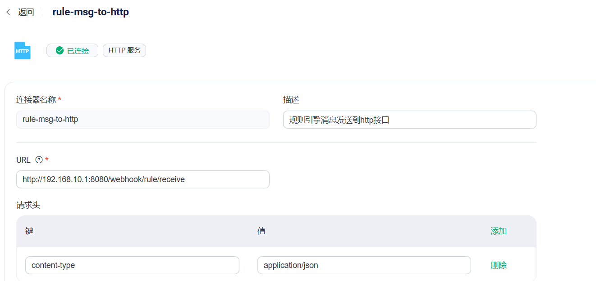

# MQTT的应用

## MQTT

### MQTT协议介绍

官网：

[MQTT协议5.0中文版 | MQTT中文网](https://mqtt.p2hp.com/mqtt-5-0)

[MQTT - The Standard for IoT Messaging](https://mqtt.org/)

MQTT 是基于 Publish/Subscribe 模式的物联网通信协议，凭借简单易实现、支持 QoS、报文小等特点，占据了物联网协议的半壁江山

#### MQTT简介

MQTT（Message Queuing Telemetry Transport，消息队列遥测传输协议），是一种基于发布/订阅（publish/subscribe）模式的"轻量级"通讯协议，该协议构建于TCP/IP协议上，由IBM在1999年发布。MQTT最大 优点在于，可以以极少的代码和有限的带宽，为连接远程设备提供实时可靠的消息服务。作为一种低开销、低带宽 占用的即时通讯协议，使其在物联网、小型设备、移动应用等方面有较广泛的应用。

MQTT是一个基于客户端-服务器的消息**发布/订阅**传输协议。MQTT协议是轻量、简单、开放和易于实现的，这些特点使它适用范围非常广泛。在很多情况下，包括受限的环境中，如：机器与机器（M2M）通信和物联网（IoT）。其在，通过卫星链路通信传感器、偶尔拨号的医疗设备、智能家居、及一些小型化设备中已广泛使用。


#### MQTT协议设计规范

由于物联网的环境是非常特别的，所以MQTT遵循以下设计原则：

- （1）精简，不添加可有可无的功能；  
- （2）发布/订阅（Pub/Sub）模式，方便消息在传感器之间传递，解耦Client/Server模式，带来的好处在于不必预先知道对方的存在（ip/port），不必同时运行； 
- （3）允许用户动态创建主题（不需要预先创建主题），零运维成本；  
- （4）把传输量降到最低以提高传输效率；  
- （5）把低带宽、高延迟、不稳定的网络等因素考虑在内；  
- （6）支持连续的会话保持和控制（心跳）；  
- （7）理解客户端计算能力可能很低；  
- （8）提供服务质量（ quality of service level：QoS）管理；  
- （9）不强求传输数据的类型与格式，保持灵活性（指的是应用层业务数据）。

#### MQTT协议主要特性

MQTT协议工作在低带宽、不可靠的网络的远程传感器和控制设备通讯而设计的协议，它具有以下主要的几项特性：

- （1）开放消息协议，简单易实现。 
- （2）使用发布/订阅消息模式，提供一对多的消息发布，解除应用程序耦合。 
- （3）对负载（协议携带的应用数据）内容屏蔽的消息传输。 
- （4）基于TCP/IP网络连接,提供有序，无损，双向连接。 主流的MQTT是基于TCP连接进行数据推送的，但是同样有基于UDP的版本，叫做MQTT-SN。这两种版 本由于基于不同的连接方式，优缺点自然也就各有不同了。 
- （5）消息服务质量（QoS）支持，可靠传输保证；有三种消息发布服务质量：
  - QoS0："至多一次"，消息发布完全依赖底层TCP/IP网络。会发生消息丢失或重复。这一级别可用于如下 情况，环境传感器数据，丢失一次读记录无所谓，因为不久后还会有第二次发送。这一种方式主要普通APP的 推送，倘若你的智能设备在消息推送时未联网，推送过去没收到，再次联网也就收不到了。 
  - QoS1："至少一次"，确保消息到达，但消息重复可能会发生。 
  - QoS2："只有一次"，确保消息到达一次。在一些要求比较严格的计费系统中，可以使用此级别。在计费 系统中，消息重复或丢失会导致不正确的结果。这种最高质量的消息发布服务还可以用于即时通讯类的APP的推送，确保用户收到且只会收到一次。

- （6）1字节固定报头，2字节心跳报文，最小化传输开销和协议交换，有效减少网络流量。 这就是为什么在介绍里说它非常适合"在物联网领域，传感器与服务器的通信，信息的收集，要知道嵌入 式设备的运算能力和带宽都相对薄弱，使用这种协议来传递消息再适合不过了。 
- （7）在线状态感知：使用Last Will和Testament特性通知有关各方客户端异常中断的机制。 **Last Will**：即遗言机制，用于通知同一主题下的其他设备，发送遗言的设备已经断开了连接。 **Testament**：遗嘱机制，功能类似于Last Will。

#### MQTT协议应用领域

MQTT协议广泛应用于物联网、移动互联网、智能硬件、车联网、电力能源等领域。 

- 物联网M2M通信，物联网大数据采集 
- Android消息推送，WEB消息推送 
- 移动即时消息，例如Facebook Messenger 
- 智能硬件、智能家具、智能电器 
- 车联网通信，电动车站桩采集 
- 智慧城市、远程医疗、远程教育 
- 电力、石油与能源等行业市场

### MQTT协议原理

#### MQTT协议实现方式

实现MQTT协议需要客户端和服务器端通讯完成，在通讯过程中，MQTT协议中有三种身份：**发布者（Publish）、代理（Broker）（服务器）、订阅者（Subscribe）**。其中，消息的发布者和订阅者都是客户端，消息代理是服务器，消息发布者可以同时是订阅者。 

MQTT传输的消息分为：主题（Topic）和负载（payload）两部分： 

- （1）Topic，可以理解为消息的类型，订阅者订阅（Subscribe）后，就会收到该主题的消息内（payload）；
- （2）payload，可以理解为消息的内容，是指订阅者具体要使用的内容。

####  网络传输与应用消息

MQTT会构建底层网络传输：它将建立客户端到服务器的连接，提供两者之间的一个有序的、无损的、基于字节流的双向传输。

当应用数据通过MQTT网络发送时，MQTT会把与之相关的服务质量（QoS）和主题名（Topic）相关连。

#### MQTT客户端

一个使用MQTT协议的应用程序或者设备，它总是建立到服务器的网络连接。客户端可以：

- （1）发布其他客户端可能会订阅的信息；  
- （2）订阅其它客户端发布的消息；  
- （3）退订或删除应用程序的消息；  
- （4）断开与服务器连接。

#### MQTT服务器端

MQTT服务器以称为"消息代理"（Broker），可以是一个应用程序或一台设备。它是位于消息发布者和订阅者 之间，它可以： 

- （1）接受来自客户的网络连接；  
- （2）接受客户发布的应用信息；  
- （3）处理来自客户端的订阅和退订请求；  
- （4）向订阅的客户转发应用程序消息。

#### 发布/订阅、主题、会话

MQTT 是基于 发布(Publish)/订阅(Subscribe) 模式来进行通信及数据交换的，与HTTP的请求(Request)/应答(Response)的模式有本质的不同。 

订阅者(Subscriber)会向消息服务器(Broker)订阅一个主题(Topic) 。成功订阅后，消息服务器会将该主题下的消息转发给所有的订阅者。 

主题(Topic)以 ‘/’ 为分隔符区分不同的层级。包含通配符 ‘+’ 或 ‘#’ 的主题又称为主题过滤器(Topic Filters); 不含通配符的称为主题名(Topic Names) 例如:

```txt
chat/room/1
 
sensor/10/temperature
 
sensor/+/temperature
 
$SYS/broker/metrics/packets/received
 
$SYS/broker/metrics/#
```

> '+': 表示通配一个层级，例如a/+，匹配a/x, a/y  
>
> '#': 表示通配多个层级，例如a/#，匹配a/x, a/b/c/d  注: 
>
> ‘+’ 通配一个层级，’#’ 通配多个层级(必须在末尾)。

发布者(Publisher) 只能向 ‘主题名’ 发布消息，订阅者(Subscriber) 则可以通过订阅‘主题过滤器’来通配多个主题名称。

**会话（Session）**

每个客户端与服务器建立连接后就是一个会话，客户端和服务器之间有状态交互。会话存在于一个网络之间，也可能在客户端和服务器之间跨越多个连续的网络连接。

#### MQTT协议中的方法

MQTT协议中定义了一些方法（也被称为动作），来于表示对确定资源所进行操作。这个资源可以代表预先存 在的数据或动态生成数据，这取决于服务器的实现。通常来说，资源指服务器上的文件或输出。主要方法有：

- （1）CONNECT：客户端连接到服务器 
- （2）CONNACK：连接确认 
- （3）PUBLISH：发布消息 
- （4）PUBACK：发布确认 
- （5）PUBREC：发布的消息已接收 
- （6）PUBREL：发布的消息已释放 
- （7）PUBCOMP：发布完成 
- （8）SUBSCRIBE：订阅请求 
- （9）SUBACK：订阅确认 
- （10）UNSUBSCRIBE：取消订阅 
- （11）UNSUBACK：取消订阅确认 
- （12）PINGREQ：客户端发送心跳 
- （13）PINGRESP：服务端心跳响应 
- （14）DISCONNECT：断开连接 
- （15）AUTH：认证

### MQTT协议数据包结构

在MQTT协议中，一个MQTT数据包由：固定头（Fixed header）、可变头（Variable header）、消息体（payload）三部分构成。MQTT数据包结构如下：


（1）固定头（Fixed header）。存在于所有MQTT数据包中，表示数据包类型及数据包的分组类标识， 如连接，发布，订阅，心跳等。其中固定头是必须的，所有类型的MQTT协议中，都必须包含固定头。 

（2）可变头（Variable header）。存在于部分MQTT数据包中，数据包类型决定了可变头是否存在及其 具体内容。可变头部不是可选的意思，而是指这部分在有些协议类型中存在，在有些协议中不存在。

（3）消息体（Payload）。存在于部分MQTT数据包中，表示客户端收到的具体内容。 与可变头一样， 在有些协议类型中有消息内容，有些协议类型中没有消息内容。

#### 固定头（Fixed header）


​	固定头存在于所有MQTT数据包中， 固定头包含两部分内容，首字节(字节1)和剩余消息报文长度(从第二个字 节开始，长度为1-4字节)，剩余长度是当前包中剩余内容长度的字节数，包括变量头和有效负载中的数据）。剩余 长度不包含用来编码剩余长度的字节。 

​	剩余长度使用了一种可变长度的结构来编码，这种结构使用单一字节表示0-127的值。大于127的值如下处 理。每个字节的低7位用来编码数据，最高位用来表示是否还有后续字节。因此每个字节可以编码128个值，再加 上一个标识位。剩余长度最多可以用四个字节来表示。

**数据包类型** 

位置：第一个字节(Byte 1) 中的7-4个bit位(Bit[7-4])，表示4位无符号值 通过第一个字节的高4位确定消息报文的类型，4个bit位能确定16种类型，其中0000和1111是保留字段。 MQTT消息报文类型如下：


**标志位** 

位置：第一个字节中的0-3个bit位(Bit[3-0])。意思是字节位Bit[3-0]用作报文的标识。 

首字节的低4位(bit3~bit0)用来表示某些报文类型的控制字段，实际上只有少数报文类型有控制位，如下图：


（1）：其中Bit[3]为DUP字段，如果该值为1，表明这个数据包是一条重复的消息；否则该数据包就是第一次 发布的消息。 

（2)：Bit[2-1]为Qos字段： 

如果Bit 1和Bit 2都为0，表示QoS 0：至多一次； 

如果Bit 1为1，表示QoS 1：至少一次； 

如果Bit 2为1，表示QoS 2：只有一次； 

如果同时将Bit 1和Bit 2都设置成1，那么客户端或服务器认为这是一条非法的消息，会关闭当前连接。

> 目前Bit[3-0]只在PUBLISH协议中使用有效，并且表中指明了是MQTT 3.1.1版本。对于其它MQTT协议版 本，内容可能不同。所有固定头标记为"保留"的协议类型，Bit[3-0]必须保持与表中保持一致，如SUBSCRIBE 协议，其Bit 1必须为1。如果接收方接收到非法的消息，会强行关闭当前连接。

**MQTT消息QoS**

MQTT发布消息服务质量保证（QoS）不是端到端的，是客户端与服务器之间的。订阅者收到MQTT消息的 QoS级别，最终取决于发布消息的QoS和主题订阅的QoS。


**可变头(Variable Header)**

可变头的意思是可变化的消息头部。有些报文类型包含可变头部有些报文则不包含。可变头部在固定头部和消 息内容之间，其内容根据报文类型不同而不同。


**消息体(Payload)**

有些报文类型是包含Payload的，Payload意思是消息载体的意思 如PUBLISH的Payload就是指消息内容（应用程序发布的消息内容）。

而CONNECT的Payload则包含Client Identifier，Will Topic，Will Message，Username，Password等信息。

包含payload的报文类型如下：


总结：我们介绍了MQTT协议的消息格式，MQTT消息格式包含Fixed Header， Variable Header和Payload。 

因为MQTT消息格式非常精简，所以可以高效的传输数据。 

Fixed Header中包含首字节，高4位用来表示报文类型，低4位用于类型控制。目前只有PUBLISH使用了类型 控制字段。其它控制字段被保留并且必须与协议定义保持一致。 

Fixed Header同时包含Remaining Length，这是剩余消息长度，最大长度为4字节，理论上一条MQTT最大可 以传输256MB数据。

Remaining Length=Variable Header+Payload长度。 

Variable Header是可变头部，有些报文类型中需要包含可变头部，可变头部根据报文类型不同而不同。比如 Packet Identifier在发布，订阅/取消订阅等报文中都使用到。 

Payload是消息内容，也只在某些报文类型中出现，其内容和格式也根据报文类型不同而不同。

## EMQX

文档：[EMQX 文档](https://docs.emqx.com/zh/emqx/v5.6/)

MQTT属于是物联网的通信协议，在MQTT协议中有两大角色：客户端（发布者/订阅者），服务端（Mqtt broker）；针对客户端和服务端需要有遵循该协议的的具体实现，EMQ/EMQ X就是MQTT Broker的一种实现。

EMQ X 基于 Erlang/OTP 平台开发的 MQTT 消息服务器，是开源社区中最流行的 MQTT 消息服务器

### EMQX安装

通过docker安装：[Docker | EMQX 5.6 文档安装](https://docs.emqx.com/zh/emqx/v5.6/deploy/install-docker.html)

```shell
mkdir -p /opt/emqx/data
mkdir -p /opt/emqx/log

docker pull emqx/emqx:5.6.1

docker run -d --name emqx \
  -p 1883:1883 -p 8083:8083 \
  -p 8084:8084 -p 8883:8883 \
  -p 18083:18083 \
  -v /opt/emqx/data:/opt/emqx/data \
  -v /opt/emqx/log:/opt/emqx/log \
  emqx/emqx:5.6.1
  
  如果说创建/opt/emqx/data/configs没有权限，是因为容器是用emqx这个用户创建的需要给他权限，或者把emqx这个文件夹的拥有者和用户组改成emqx
  如果容器内没有vi这些命令，可以通过 docker exec -u root -it emqx /bin/bash 进入容器
  然后通过apt安装，命令：apt update & apt Install vim
```

安装成功后，可以通过ip:18083访问EMQX Dashboard

默认用户名：admin、默认密码：public

### 认证

身份认证是大多数应用的重要组成部分，MQTT 协议支持用户名密码认证，启用身份认证能有效阻止非法客户 端的连接。 

EMQX 中的认证指的是当一个客户端连接到 EMQX 的时候，通过服务器端的配置来控制客户端连接服务器的权限。

EMQ X 的认证支持包括两个层面： 

- MQTT 协议本身在 CONNECT 报文中指定用户名和密码，EMQ X以插件形式支持基于 Username、 ClientID、HTTP、JWT、LDAP 及各类数据库如 MongoDB、MySQL、PostgreSQL、Redis 等多种形式的认 证。 
- 在传输层上，TLS 可以保证使用客户端证书的客户端到服务器的身份验证，并确保服务器向客户端验证服 务器证书。也支持基于 PSK 的 TLS/DTLS 认证。

[认证 | EMQX 5.6 文档](https://docs.emqx.com/zh/emqx/v5.6/access-control/authn/authn.html)

**示例一：使用内置数据库进行密码认证**

文档：[使用内置数据库进行密码认证 | EMQX 5.6 文档](https://docs.emqx.com/zh/emqx/v5.6/access-control/authn/mnesia.html)

1. 通过 Dashboard 配置

在 [EMQX Dashboard](http://127.0.0.1:18083/#/authentication) 页面，点击左侧导航栏的**访问控制** -> **客户端认证**，在随即打开的**认证**页面，单击**创建**，依次选择**认证方式**为 `Password-Based`，**数据源**为 `内置数据库`，进入**配置参数**页签


**账号类型**：指定用于客户端身份 ID 认证的字段，可选值： `username`、 `clientid`（分别对应于 MQTT 客户端 `CONNECT` 报文中的 `Username` 和 `Client Identifier` 字段）。

之后通过用户管理添加用户

**示例二：使用 HTTP 服务进行密码认证**

文档：[使用 HTTP 服务进行密码认证 | EMQX 5.6 文档](https://docs.emqx.com/zh/emqx/v5.6/access-control/authn/http.html)

Dashboard配置参考文档

java代码：

```java
@PostMapping("/authentication")
public HashMap<String, Object> authentication(@RequestBody HashMap<String, String> data) {
    System.out.println(data);
    String username = data.get("username");
    String password = data.get("password");
    String clientId = data.get("clientid");
    HashMap<String, Object> result = new HashMap<>();
    if(account.containsKey(username)){
        if(password.equals(account.get(username))){
            result.put("result", "allow");
            if( username.equals("client1")){
                // 超级用户 在订阅和发布的时候不会认证权限
                result.put("is_superuser", true);
            }
        }
        log.info("用户{}认证成功, clientId:{}", username, clientId);
    }else{
        result.put("result", "deny");
        log.error("用户{}认证失败, clientId:{}", username, clientId);
    }
    return result;
}
```

### 授权

文档：

[内置数据库 | EMQX 5.6 文档](https://docs.emqx.com/zh/emqx/v5.6/access-control/authz/mnesia.html)

[基于 HTTP 应用进行授权 | EMQX 5.6 文档](https://docs.emqx.com/zh/emqx/v5.6/access-control/authz/http.html)

### Java实现MQTT消息收发

[使用 Java SDK 连接 | EMQX 5.6 文档](https://docs.emqx.com/zh/emqx/v5.6/connect-emqx/java.html)

**依赖**：

```xml
<dependency>
  <groupId>org.eclipse.paho</groupId>
	<artifactId>org.eclipse.paho.client.mqttv3</artifactId>
	<version>1.2.2</version>
</dependency>
```

**连接-接收-发布**：

```java
@Component
@Slf4j
public class EmqClient {

    private IMqttClient mqttClient;

    @Autowired
    private MQTTProperties mqttProperties;

    @Autowired
    private MqttCallback mqttCallback;

    @PostConstruct
    private void init(){
        MemoryPersistence memoryPersistence = new MemoryPersistence();
        try {
            mqttClient = new MqttClient(
                    mqttProperties.getUrl(),
                    mqttProperties.getClientId(),
                    memoryPersistence
                    );
        } catch (MqttException e) {
            log.error("MqttClient初始化失败,url={},clientId= {}",mqttProperties.getUrl(),mqttProperties.getClientId());
        }
    }

    /**
     * 连接
     */
    public void connect(){
        MqttConnectionOptions connOpts = new MqttConnectionOptions();
        connOpts.setAutomaticReconnect(true);
        connOpts.setCleanStart(true);
        connOpts.setUserName(mqttProperties.getUsername());
        connOpts.setPassword(mqttProperties.getPassword().getBytes(StandardCharsets.UTF_8));
        mqttClient.setCallback(mqttCallback);
        //连接broker
        try {
            mqttClient.connect(connOpts);
        } catch (MqttException e) {
            log.error("连接mqtt broker失败,失败原因:{}",e.getMessage());
        }
    }


    /**
     * 发布
     */
    public void publish(String topic, String msg, QosEnum qos, boolean retain){
        MqttMessage mqttMessage = new MqttMessage();
        mqttMessage.setQos(2);
        mqttMessage.setRetained(retain);
        mqttMessage.setPayload(msg.getBytes());
        if(mqttClient.isConnected()){
            try {
                mqttClient.publish(topic,mqttMessage);
            } catch (MqttException e) {
                log.error("mqtt消息发布失败,topic={},msg={},qos={},retain={},error_msg={}",topic,msg,qos.getValue(),retain,e.getMessage());
            }
        }
    }

    public void subscribe(String topicFilter, QosEnum qos){
        try {
            mqttClient.subscribe(topicFilter, qos.getValue());
        } catch (MqttException e) {
            log.error("订阅失败,topic_filter={},qos={},error_msg={}",topicFilter,qos.getValue(),e.getMessage());
        }

    }

    /**
     * 断开连接
     */
    @PreDestroy
    public void disConnect(){
        try {
            mqttClient.disconnect();
        } catch (MqttException e) {
            log.error("断开连接出现异常,error_msg={}",e.getMessage());
        }
    }
}
```

**MqttCallback**

```java
@Component
@Slf4j
public class MessageCallback implements MqttCallback {

    @Override
    public void disconnected(MqttDisconnectResponse mqttDisconnectResponse) {
        //丢失对服务端的连接后触发该方法回调，此处可以做一些特殊处理，比如重连
        log.info("丢失了对broker的连接, reason:{}", mqttDisconnectResponse.getReasonString());
    }

    @Override
    public void mqttErrorOccurred(MqttException e) {
        log.error("mqtt异常:{}", e.getMessage());
    }

    /**
     * 订阅到消息后的回调
     * 该方法由mqtt客户端同步调用,在此方法未正确返回之前，不会发送ack确认消息到broker
     * 一旦该方法向外抛出了异常客户端将异常关闭，当再次连接时；所有QoS1,QoS2且客户端未进行ack确认的消息都将由
     * broker服务器再次发送到客户端
     */
    @Override
    public void messageArrived(String topic, MqttMessage message) throws Exception {
        log.info("订阅到了消息;topic={},messageid={},qos={},msg={}",
                topic,
                message.getId(),
                message.getQos(),
                new String(message.getPayload()));
    }

    @Override
    public void deliveryComplete(IMqttToken iMqttToken) {
        log.info("消息发送完成,messageId:{}, topics:{}", iMqttToken.getMessageId(), iMqttToken.getTopics());
    }

    @Override
    public void connectComplete(boolean reconnect, String serverURI) {
        log.info("连接成功,{}", reconnect);
    }

    @Override
    public void authPacketArrived(int i, MqttProperties mqttProperties) {

    }
}
```

**QosEnum**

```java
public enum QosEnum {
    QOS_0(0),
    QOS_1(1),
    QOS_2(2);

    private int value;
    private QosEnum(int value) {}

    public int getValue() {
        return value;
    }
}
```

**MQTTProperties**

```
@Configuration
@ConfigurationProperties(prefix = "mqtt")
@Data
public class MQTTProperties {
    private String url;
    private String clientId;
    private String username;
    private String password;
}

```

**调用mqtt方法**

```java
public void init(){
    emqClient.connect();
    //订阅某一主题
    emqClient.subscribe("testtopic/#", QosEnum.QOS_2);
    //开启一个新的线程向该主题发送消息
    new  Thread(()->{
        while (true){
            emqClient.publish("testtopic/123","mqtt msg:"+
                              LocalDateTime.now().format(DateTimeFormatter.ISO_DATE_TIME),QosEnum.QOS_2,false);
            try {
                TimeUnit.SECONDS.sleep(5);
            } catch (InterruptedException e) {
                e.printStackTrace();
            }
        }
    }).start();
}
```

### WebHook

文档：[Webhook | EMQX 5.6 文档](https://docs.emqx.com/zh/emqx/v5.6/data-integration/webhook.html)

事件类型：[SQL 数据源和字段 | EMQX文档](https://docs.emqx.com/zh/emqx/latest/data-integration/rule-sql-events-and-fields.html#mqtt-消息)


```java
@RestController
@RequestMapping("/webhook")
public class WebHookController {


    @RequestMapping
    public String webhook(@RequestBody HashMap<String, Object> data){
        System.out.println(data);
        /*
        必有字段：event、clientid、username
         */
        String event = (String) data.get("event");
        String username = (String) data.get("username");
        String clientid = (String) data.get("clientid");
        if(event.equals("client.disconnected")){
            System.out.println("clientid:"+clientid + " username:"+username + " 连接已断开");
        }
        return "test";
    }
}
```

```java
webhook参数内容：
{metadata={rule_id=demo-webhook_WH_D}, peerhost=192.168.10.1, clientid=mqttx_c1ad2070, flags={retain=false, dup=false}, node=emqx@172.17.0.4, qos=2, payload={
  "msg": "消息"
}, pub_props={User-Property={}}, publish_received_at=1729818959543, topic=t/1, id=00062542DC9BFC3632490000135F0004, event=message.publish, username=client1, timestamp=1729818959543}

```

### 保留消息

文档：[保留消息 | EMQX文档](https://docs.emqx.com/zh/emqx/latest/messaging/mqtt-retained-message.html)

服务端收到 Retain 标志为 1 的 PUBLISH 报文时，会将该报文视为保留消息，除了被正常转发以外，保留消息 会被存储在服务端，每个主题下只能存在一份保留消息，因此如果已经存在相同主题的保留消息，则该保留消息被替换。

当客户端建立订阅时，如果服务端存在主题匹配的保留消息，则这些保留消息将被立即发送给该客户端。借助保留消息，新的订阅者能够立即获取最近的状态，而不需要等待无法预期的时间，这在很多场景下非常重要的。


### 共享订阅

文档：[共享订阅 | EMQX 5.6 文档](https://docs.emqx.com/zh/emqx/v5.6/messaging/mqtt-shared-subscription.html)

EMQX 实现了 MQTT 的共享订阅功能。

共享订阅是一种订阅模式，用于在多个订阅者之间实现负载均衡。客户端可以分为多个订阅组，消息仍然会被转发到所有订阅组，但每个订阅组内只有一个客户端接收消息。您可以为一组订阅者的原始主题添加前缀以启用共享订阅。

EMQX 支持两种格式的共享订阅前缀，分别为带群组的共享订阅（前缀为 `$share/<group-name>/`）和不带群组的共享订阅（前缀为 `$queue/`）。两种共享订阅格式示例如下：

 

### 延迟发布

文档：[延迟发布 | EMQX 5.6 文档](https://docs.emqx.com/zh/emqx/v5.6/messaging/mqtt-delayed-publish.html)

延迟发布是 EMQX 支持的 MQTT 扩展功能。当客户端使用特殊主题前缀 `$delayed/{DelayInteval}` 发布消息时，将触发延迟发布功能，可以实现按照用户配置的时间间隔延迟发布消息。

延迟发布主题的具体格式如下：

```bash
$delayed/{DelayInterval}/{TopicName}
```

- `$delayed`：使用 `$delay` 作为主题前缀的消息都将被视为需要延迟发布的消息。延迟间隔由下一主题层级中的内容决定。
- `{DelayInterval}`：指定该 MQTT 消息延迟发布的时间间隔，单位是秒，允许的最大间隔是 4294967 秒。如果 `{DelayInterval}` 无法被解析为一个整型数字，EMQX 将丢弃该消息，客户端不会收到任何信息。
- `{TopicName}`：MQTT 消息的主题名称。

例如:

- `$delayed/15/x/y`：15 秒后将 MQTT 消息发布到主题 `x/y`。
- `$delayed/60/a/b`：1 分钟后将 MQTT 消息发布到 `a/b`。
- `$delayed/3600/$SYS/topic`：1 小时后将 MQTT 消息发布到 `$SYS/topic`

### 自动订阅

文档：[自动订阅 | EMQX 5.6 文档](https://docs.emqx.com/zh/emqx/v5.6/messaging/mqtt-auto-subscription.html)

自动订阅是 EMQX 支持的 MQTT 扩展功能。自动订阅能够给 EMQX 设置多个规则，在设备成功连接后按照规则为其订阅指定主题，不需要额外发起订阅。

在 EMQX 5.0 之前，该功能叫做代理订阅。

### 主题重写

文档：[主题重写 | EMQX 5.6 文档](https://docs.emqx.com/zh/emqx/v5.6/messaging/mqtt-topic-rewrite.html)

很多物联网设备不支持重新配置或升级，修改设备业务主题会非常困难。

主题重写功能可以帮助使这种业务升级变得更容易：通过给 EMQX 设置一套规则，它可以在订阅、发布时改变将原有主题重写为新的目标主题。

[保留消息](https://docs.emqx.com/zh/emqx/v5.6/messaging/mqtt-retained-message.html) 和 [延迟发布](https://docs.emqx.com/zh/emqx/v5.6/messaging/mqtt-delayed-publish.html) 也可以与主题重写结合使用。例如，当用户想使用延迟发布时，他们可以使用主题重写来将消息重定向到所需的主题。

### 规则引擎

文档：[规则引擎 | EMQX](https://docs.emqx.com/zh/emqx/latest/data-integration/rules.html)

规则引擎是 EMQX 内置基于 SQL 的数据处理组件，搭配[数据集成](https://docs.emqx.com/zh/emqx/latest/data-integration/data-bridges.html)无需编写代码即可实现一站式的 IoT 数据提取、过滤、转换、存储与处理，以加速应用集成和业务创新。

#### 规则的典型应用场景

- **动作监听**：智慧家庭智能门锁开发中，门锁会因为网络、电源故障、人为破坏等原因离线导致功能异常，使用规则配置监听离线事件向应用服务推送该故障信息，可以在接入层实现第一时间的故障检测的能力；
- **数据筛选**：车联网的卡车车队管理，车辆传感器采集并上报了大量运行数据，应用平台仅关注车速大于 40 km/h 时的数据，此场景下可以使用规则对消息进行条件过滤，向业务消息队列写入满足条件的数据；
- **消息路由**：智能计费应用中，终端设备通过不同主题区分业务类型，可通过配置规则将计费业务的消息接入计费消息队列并在消息抵达设备端后发送确认通知到业务系统，非计费信息接入其他消息队列，实现业务消息路由配置；
- **消息编解码**：其他公共协议 / 私有 TCP 协议接入、工控行业等应用场景下，可以通过规则的本地处理函数（可在 EMQX 上定制开发）做二进制 / 特殊格式消息体的编解码工作；亦可通过规则的消息路由将相关消息流向外部计算资源如函数计算进行处理（可由用户自行开发处理逻辑），将消息转为业务易于处理的 JSON 格式，简化项目集成难度、提升应用快速开发交付能力。

示例：

创建规则：


连接器



消息发送

 

http接口

```java
@RequestMapping("/rule/receive")
public String ruleReceive(@RequestBody HashMap<String, Object> data){
    System.out.println("===========ruleReceive-start======================");
    System.out.println(data);
    System.out.println("===========ruleReceive-end======================");
    System.out.println();
    return "success";
}

输出数据：
===========ruleReceive-start======================
{clientid=mqttx_7acc1390, qos=2, payload={
  "msg": "success",
  "data":"这是数据"
}}
===========ruleReceive-end======================
```

