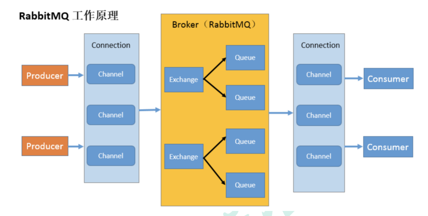

### 什么是MQ
MQ(message queue)，从字面意思上看，本质是个队列，FIFO 先入先出，只不过队列中存放的内容是message 而已，还是一种跨进程的通信机制，用于上下游传递消息。在互联网架构中，MQ 是一种非常常见的上下游“逻辑解耦+物理解耦”的消息通信服务。使用了 MQ 之后，消息发送上游只需要依赖 MQ，不用依赖其他服务。
### 为什么要用MQ
1. 流量消峰
举个例子，如果订单系统最多能处理一万次订单，这个处理能力应付正常时段的下单时绰绰有余，正常时段我们下单一秒后就能返回结果。但是在高峰期，如果有两万次下单操作系统是处理不了的，只能限制订单超过一万后不允许用户下单。使用消息队列做缓冲，我们可以取消这个限制，把一秒内下的订单分散成一段时间来处理，这时有些用户可能在下单十几秒后才能收到下单成功的操作，但是比不能下单的体验要好。

2. 应用解耦
以电商应用为例，应用中有订单系统、库存系统、物流系统、支付系统。用户创建订单后，如果耦合调用库存系统、物流系统、支付系统，任何一个子系统出了故障，都会造成下单操作异常。当转变成基于消息队列的方式后，系统间调用的问题会减少很多，比如物流系统因为发生故障，需要几分钟来修复。在这几分钟的时间里，物流系统要处理的内存被缓存在消息队列中，用户的下单操作可以正常完成。当物流系统恢复后，继续处理订单信息即可，中单用户感受不到物流系统的故障，提升系统的可用性。

3. 异步处理
有些服务间调用是异步的，例如 A 调用 B，B 需要花费很长时间执行，但是 A 需要知道 B 什么时候可以执行完，以前一般有两种方式，A 过一段时间去调用 B 的查询 api 查询。或者 A 提供一个 callback api，B 执行完之后调用 api 通知 A 服务。这两种方式都不是很优雅，使用消息总线，可以很方便解决这个问题，A 调用 B 服务后，只需要监听 B 处理完成的消息，当 B 处理完成后，会发送一条消息给 MQ，MQ 会将此消息转发给 A 服务。这样 A 服务既不用循环调用 B 的查询 api，也不用提供 callback api。同样 B 服务也不用做这些操作。A 服务还能及时的得到异步处理成功的消息。
### MQ的分类

1. ActiveMQ
2. Kafka
3. RocketMQ
4. RabbitMQ
### MQ的选择
1.Kafka
Kafka 主要特点是基于 Pull 的模式来处理消息消费，追求高吞吐量，一开始的目的就是用于日志收集
和传输，适合产生大量数据的互联网服务的数据收集业务。大型公司建议可以选用，如果有日志采集功能，肯定是首选 kafka 了。
2.RocketMQ
天生为金融互联网领域而生，对于可靠性要求很高的场景，尤其是电商里面的订单扣款，以及业务削
峰，在大量交易涌入时，后端可能无法及时处理的情况。RoketMQ 在稳定性上可能更值得信赖，这些业务场景在阿里双 11 已经经历了多次考验，如果你的业务有上述并发场景，建议可以选择 RocketMQ。
3.RabbitMQ
结合 erlang 语言本身的并发优势，性能好时效性微秒级，社区活跃度也比较高，管理界面用起来十分
方便，如果你的数据量没有那么大，中小型公司优先选择功能比较完备的 RabbitMQ。
### RabbitMQ的概念
RabbitMQ是一个消息中间件，它用于接收并转发消息。
生产者：
产生数据发送消息的程序是生产者
交换机：
 交换机是 RabbitMQ 非常重要的一个部件，一方面它接收来自生产者的消息，另一方面它将消息推送到队列中。交换机必须确切知道如何处理它接收到的消息，是将这些消息推送到特定队列还是推送到多个队列，亦或者是把消息丢弃，这个得有交换机类型决定 
队列：
 队列是 RabbitMQ 内部使用的一种数据结构，尽管消息流经 RabbitMQ 和应用程序，但它们只能存储在队列中。队列仅受主机的内存和磁盘限制的约束，本质上是一个大的消息缓冲区。许多生产者可以将消息发送到一个队列，许多消费者可以尝试从一个队列接收数据。这就是我们使用队列的方式  
消费者
 消费与接收具有相似的含义。消费者大多时候是一个等待接收消息的程序。请注意生产者，消费 者和消息中间件很多时候并不在同一机器上。同一个应用程序既可以是生产者又是可以是消费者。  
### RabbitMQ核心部分

### RabbitMQ名词介绍

**Broker**：接收和分发消息的应用，RabbitMQ Server 就是 Message Broker
**Virtual host**：出于多租户和安全因素设计的，把 AMQP 的基本组件划分到一个虚拟的分组中，类似
于网络中的 namespace 概念。当多个不同的用户使用同一个 RabbitMQ server 提供的服务时，可以划分出多个 vhost，每个用户在自己的 vhost 创建 exchange／queue 等
**Connection**：publisher／consumer 和 broker 之间的 TCP 连接
**Channel**：如果每一次访问 RabbitMQ 都建立一个 Connection，在消息量大的时候建立 TCP Connection 的开销将是巨大的，效率也较低。Channel 是在 connection 内部建立的逻辑连接，如果应用程序支持多线程，通常每个 thread 创建单独的 channel 进行通讯，AMQP method 包含了 channel id 帮助客户端和 message broker 识别 channel，所以 channel 之间是完全隔离的。Channel 作为轻量级的Connection 极大减少了操作系统建立 TCP connection 的开销 
**Exchange**：message 到达 broker 的第一站，根据分发规则，匹配查询表中的 routing key，分发
消息到 queue 中去。常用的类型有：direct (point-to-point), topic (publish-subscribe) and fanout (multicast)
**Queue**：消息最终被送到这里等待 consumer 取走 
**Binding**：exchange 和 queue 之间的虚拟连接，binding 中可以包含 routing key，Binding 信息被保存到 exchange 中的查询表中，用于 message 的分发依据

### RabbitMQ的安装
[erlang-rpm下载](https://github.com/rabbitmq/erlang-rpm/tags)

[安装RabbitMQ](https://www.rabbitmq.com/install-rpm.html)


```java
rpm -ivh erlang-21.3-1.el7.x86_64.rpm
yum install socat -y
rpm -ivh rabbitmq-server-3.8.8-1.el7.noarch.rpm
```
```text
开启web管理插件
rabbitmq-plugins enable rabbitmq_management

使用guest访问出现权限问题，需要添加账号并设置权限
创建账号
rabbitmqctl add_user pnz abc123
设置用户角色
 rabbitmqctl set_user_tags pnz administrator
 设置用户权限
 set_permissions [-p <vhostpath>] <user> <conf> <write> <read>
 rabbitmqctl set_permissions -p "/" pnz ".*" ".*" ".*"
 用户 user_pnz 具有/vhost1 这个 virtual host 中所有资源的配置、写、读权限
 查看当前用户和角色
 rabbitmqctl list_users
 关闭应用的命令
 rabbitmqctl_stop_app
 清除的命令为  清除命令会清除设置的用户，关闭不会
 rabbitmqctl reset
 重新启动的命令
 rabbitmqclt start_app
 访问：
 http://ip:15672  管理界面  
```

### RabbitMQ的模式
#### P2P

##### 依赖
```java
<!--rabbitmq 依赖客户端-->
<dependency>
    <groupId>com.rabbitmq</groupId>
    <artifactId>amqp-client</artifactId>
    <version>5.19.0</version>
</dependency>
<!--操作文件流的一个依赖-->
<dependency>
    <groupId>commons-io</groupId>
    <artifactId>commons-io</artifactId>
    <version>2.6</version>
</dependency>
```
##### 消息生产者
```java
public class Producer {
    public static final String QUEUE_NAME = "hello";

    public static void main(String[] args) throws IOException, TimeoutException {
        ConnectionFactory factory = new ConnectionFactory();
        factory.setHost("linux7");
        factory.setUsername("pnz");
        factory.setPassword("abc123");

        Connection conn = factory.newConnection();
        //获取信道
        Channel channel = conn.createChannel();
        /**
         * 生成一个队列
         * 1.队列名称
         * 2.队列里面的消息是否持久化 默认消息存储在内存中 false内存中，true写入磁盘
         * 3.该队列是否只供一个消费者进行消费 是否进行共享 true 可以多个消费者消费
         * 4.是否自动删除 最后一个消费者端开连接以后 该队列是否自动删除 true 自动删除
         * 5.其他参数
         */
        channel.queueDeclare(QUEUE_NAME,false,false,false,null);
        String message = "Hello World";
        /**
         * 发送一个消息
         * 1.发送到那个交换机
         * 2.路由的 key 是哪个
         * 3.其他的参数信息 --> 对应队列声明的第5个参数
         * 4.发送消息的消息体
         */
        channel.basicPublish("",QUEUE_NAME,null,message.getBytes(StandardCharsets.UTF_8));
        System.out.println("消息发送完毕");
    }
}
```
##### 消息消费者
```java
public class Consumer {
    public static final String QUEUE_NAME = "hello";

    public static void main(String[] args) throws IOException, TimeoutException {
        ConnectionFactory factory = new ConnectionFactory();
        factory.setHost("linux7");
        factory.setUsername("pnz");
        factory.setPassword("abc123");
        Connection conn = factory.newConnection();
        Channel channel = conn.createChannel();
        System.out.println("等待接收消息....");
        //推送的消息如何进行消费的接口回调
        DeliverCallback deliverCallback=(consumerTag, delivery)->{
            String message= new String(delivery.getBody());
            System.out.println(message);
        };
        //取消消费的一个回调接口 如在消费的时候队列被删除掉了
        CancelCallback cancelCallback=(consumerTag)->{
            System.out.println("消息消费被中断");
        };
        /**
         * 消费者消费消息
         * 1.消费哪个队列
         * 2.消费成功之后是否要自动应答 true 代表自动应答 false 手动应答
         * 3.处理消息的回调
         * 4.消费者取消消费的回调
         */
        channel.basicConsume(QUEUE_NAME,true,deliverCallback,cancelCallback);

    }
}
```
#### Work Queues

介绍：
代码部分与点对点模式一样，不过会启动两个工作线程(消费者)
RabbitMQ在分发消息时是通过轮训的方式分发

#### Publish/Subscribe

使用fanout(扇出)交换机

#### Routing

使用direct(直接)交换机

#### Topics

使用topic(主题)交换机

#### Publisher Confirms

发布确认模式，在发布消息后需要等待是否成功发布的确认
详情见发布确认(高级)

### 消息应答
因为RabbitMQ一旦向消费者发送完一条消息，便立即删除消息，如果消费者在处理消息的过程中突然挂掉了，那我们会丢失正在处理的消息。
为了保证消息在发送过程中不丢失，rabbitmq 引入消息应答机制，消息应答就是:消费者在接 收到消息并且处理该消息之后，告诉 rabbitmq 它已经处理了，rabbitmq 可以把该消息删除了。  

#### 自动应答
**消息发送后立即被认为已经传送成功**，这种模式需要在**高吞吐量和数据传输安全性方面做权衡**,因为这种模式如果消息在接收到之前，消费者那边出现连接或者 channel 关闭，那么消息就丢失了,当然另一方面这种模式消费者那边可以传递过载的消息，没有对传递的消息数量进行限制，当然这样有可能使得消费者这边由于接收太多还来不及处理的消息，导致这些消息的积压，最终使得内存耗尽，最终这些消费者线程被操作系统杀死，所以这种模式仅适用**在消费者可以高效并以某种速率能够处理这些消息的情况下使用**。

#### 手动应答
消息应答的方法

channel.basicAck(用于肯定确认) 

RabbitMQ 已知道该消息并且成功的处理消息，可以将其丢弃了 

channel.basicNack(用于否定确认) 

channel.basicReject(用于否定确认) 

Channel.basicNack 相比少一个参数 不处理该消息了直接拒绝，可以将其丢弃了

**Multiple的解释**

手动应答的好处就是可以批量应答并减少网络拥堵

channel.basicAck(deliveryTag,true)

basicAck的第二个参数就是multiple

true 代表批量应答 channel 上未应答的消息

比如说 channel 上有传送 tag 的消息 5,6,7,8 当前 tag 是 8 那么此时

5-8 的这些还未应答的消息都会被确认收到消息应答

false 同上面相比

只会应答 tag=8 的消息 5,6,7 这三个消息依然不会被确认收到消息应答

注意：当时用手动应答时，如果消费者因为某些原因导致消息未发送ack确认，RabbitMQ会将消息重新入队，这样即使消费者有问题，消息也不会丢失
**代码**

```java
public static final String QUEUE_NAME_ACK = "ack_queue";

public static void main(String[] args) throws Exception {
    Channel channel = RabbitMQUtils.getChannel();
    boolean durable = true; //开启队列持久化
    channel.queueDeclare(QUEUE_NAME_ACK,durable,false,false,null);
    Scanner scanner = new Scanner(System.in);
    System.out.print("输入待发送的消息：");
    while(scanner.hasNext()){
        System.out.print("输入待发送的消息：");
        String msg = scanner.next();
        channel.basicPublish("",QUEUE_NAME_ACK, null,msg.getBytes(StandardCharsets.UTF_8));
    }
}
```
```java
public static final String QUEUE_NAME_ACK = "ack_queue";

public static void main(String[] args) throws Exception {
    Channel channel = RabbitMQUtils.getChannel();
    int prefetchCount = 2;
    channel.basicQos(prefetchCount);
    DeliverCallback deliverCallback=(consumerTag, delivery)->{
        SleepUtils.sleep(1);
        String message= new String(delivery.getBody());
        System.out.println("C1接收到的消息"+message);
        /**
         * 1.消息标记 tag
         * 2.是否批量应答
         */
        channel.basicAck(delivery.getEnvelope().getDeliveryTag(),false);
    };
    //取消消费的一个回调接口 如在消费的时候队列被删除掉了
    CancelCallback cancelCallback=(consumerTag)->{
        System.out.println("C1消息消费被中断");
    };
    boolean autoAck = false; //手动应答
    channel.basicConsume(QUEUE_NAME_ACK,autoAck,deliverCallback,cancelCallback);
}
```
### RabbitMQ持久化
要保证RabbitMQ在出现宕机后重启消息不丢失，需要将**队列**和**消息**都进行持久化处理

**队列持久化**

队列持久化需要再队列声明时将durable参数设置为true

**消息持久化**

消息持久化需要在publish消息时设置 MessageProperties.PERSISTENT_TEXT_PLAIN  这个属性


### 预期值
本身消息的发送就是异步发送的，所以在任何时候，channel 上肯定不止只有一个消息另外来自消费者的手动确认本质上也是异步的。因此这里就存在一个未确认的消息缓冲区，因此希望开发人员能**限制此缓冲区的大小，以避免缓冲区里面无限制的未确认消息问题**。这个时候就可以通过使用**basic.qos **方法设置“**预取计数**”值来完成的。该值**定义通道上允许的未确认消息的最大数量**。一旦数量达到配置的数量，RabbitMQ 将停止在通道上传递更多消息，除非至少有一个未处理的消息被确认，例如，假设在通道上有未确认的消息 5、6、7，8，并且通道的预取计数设置为 4，此时 RabbitMQ 将不会在该通道上再传递任何消息，除非至少有一个未应答的消息被 ack。比方说 tag=6 这个消息刚刚被确认 ACK，RabbitMQ 将会感知这个情况到并再发送一条消息。消息应答和 QoS 预取值对用户吞吐量有重大影响。通常，增加预取将提高向消费者传递消息的速度。**虽然自动应答传输消息速率是最佳的，但是，在这种情况下已传递但尚未处理的消息的数量也会增加，从而增加了消费者的 RAM 消耗**(随机存取存储器)应该小心使用具有无限预处理的自动确认模式或手动确认模式，消费者消费了大量的消息如果没有确认的话，会导致消费者连接节点的内存消耗变大，所以找到合适的预取值是一个反复试验的过程，不同的负载该值取值也不同 100 到 300 范围内的值通常可提供最佳的吞吐量，并且不会给消费者带来太大的风险。预取值为 1 是最保守的。当然这将使吞吐量变得很低，特别是消费者连接延迟很严重的情况下，特别是在消费者连接等待时间较长的环境中。对于大多数应用来说，稍微高一点的值将是最佳的。


```java
public static final String QUEUE_NAME_ACK = "ack_queue";

public static void main(String[] args) throws Exception {
    Channel channel = RabbitMQUtils.getChannel();
    
    int prefetchCount = 2;
    channel.basicQos(prefetchCount); //设置预期值
    
    DeliverCallback deliverCallback=(consumerTag, delivery)->{
        String message= new String(delivery.getBody());
        System.out.println("C1接收到的消息"+message);
        channel.basicAck(delivery.getEnvelope().getDeliveryTag(),false);
    };
    boolean autoAck = false;
    channel.basicConsume(QUEUE_NAME_ACK,autoAck,deliverCallback,consumerTag -> {});
}
```

### 发布确认(基础)
生产者将信道设置成 confirm 模式，一旦信道进入 confirm 模式，**所有在该信道上面发布的消息都将会被指派一个唯一的 ID(从 1 开始)**，一旦消息被投递到所有匹配的队列之后，broker就会发送一个确认给生产者(包含消息的唯一 ID)，这就使得生产者知道消息已经正确到达目的队列了，如果消息和队列是可持久化的，那么确认消息会在将消息写入磁盘之后发出，broker 回传给生产者的确认消息中 delivery-tag 域包含了确认消息的序列号，此外 broker 也可以设置basic.ack 的 multiple 域，表示到这个序列号之前的所有消息都已经得到了处理。
confirm 模式最大的好处在于他是异步的，一旦发布一条消息，生产者应用程序就可以在等信道返回确认的同时继续发送下一条消息，当消息最终得到确认之后，生产者应用便可以通过回调方法来处理该确认消息，如果 RabbitMQ 因为自身内部错误导致消息丢失，就会发送一条 nack 消息，生产者应用程序同样可以在回调方法中处理该 nack 消息
**开启发布确认模式**


```java
public class ConfirmTask {

    public static void main(String[] args) throws Exception {
        //单个确认发布
//        publishMessageIndividually(); //发布1000个单独确认消息,耗时572ms
        //批量确认发布
//        publishMessageBatch();//发布1000个批量确认消息,耗时87ms
        //异步确认发布
        publishMessageAsync();//发布1000个异步确认消息,耗时22ms
    }

    public static final int MESSAGE_COUNT = 1000;

    public static void publishMessageIndividually() throws Exception {
        Channel channel = RabbitMQUtils.getChannel();
        String queueName = UUID.randomUUID().toString();
        channel.queueDeclare(queueName, false, false, false, null);
        //开启发布确认
        channel.confirmSelect();
        long begin = System.currentTimeMillis();
        for (int i = 0; i < MESSAGE_COUNT; i++) {
            String message = i + "";
            channel.basicPublish("", queueName, null, message.getBytes());
            //服务端返回 false 或超时时间内未返回，生产者可以消息重发
            boolean flag = channel.waitForConfirms();
            if (flag) {
                System.out.println("消息发送成功");
            }
        }
        long end = System.currentTimeMillis();
        System.out.println("发布" + MESSAGE_COUNT + "个单独确认消息,耗时" + (end - begin) + "ms");

    }

    public static void publishMessageBatch() throws Exception {
        try (Channel channel = RabbitMQUtils.getChannel()) {
            String queueName = UUID.randomUUID().toString();
            channel.queueDeclare(queueName, false, false, false, null);
            //开启发布确认
            channel.confirmSelect();
            //批量确认消息大小
            int batchSize = 100;
            //未确认消息个数
            int outstandingMessageCount = 0;
            long begin = System.currentTimeMillis();
            for (int i = 0; i < MESSAGE_COUNT; i++) {
                String message = i + "";
                channel.basicPublish("", queueName, null, message.getBytes());
                outstandingMessageCount++;
                if (outstandingMessageCount == batchSize) {
                    channel.waitForConfirms();
                    outstandingMessageCount = 0;
                }
            }
            //为了确保还有剩余没有确认消息 再次确认
            if (outstandingMessageCount > 0) {
                channel.waitForConfirms();
            }
            long end = System.currentTimeMillis();
            System.out.println("发布" + MESSAGE_COUNT + "个批量确认消息,耗时" + (end - begin) + "ms");
        }
    }

    public static void publishMessageAsync() throws Exception {
        Channel channel = RabbitMQUtils.getChannel();
        String queueName = UUID.randomUUID().toString();
        channel.queueDeclare(queueName, false, false, false, null);
        channel.confirmSelect();

        /**
         * 线程安全有序的一个哈希表，适用于高并发的情况
         * 1.轻松的将序号与消息进行关联
         * 2.轻松批量删除条目 只要给到序列号
         * 3.支持并发访问
         */
        ConcurrentSkipListMap<Long, String> outstandingConfirms = new ConcurrentSkipListMap<>();

        /**
         * 确认收到消息的一个回调
         * 1.消息序列号
         * 2.true 可以确认小于等于当前序列号的消息
         * false 确认当前序列号消息
         */
        ConfirmCallback ackCallback = (deliveryTag, multiple) -> {
            //确认的回调
            if (multiple) {
                //返回的是小于等于当前序列号的未确认消息 是一个 map
                ConcurrentNavigableMap<Long, String> confirmed = outstandingConfirms.headMap(deliveryTag, true);
                //清除该部分未确认消息
                confirmed.clear();

            } else {
                System.out.println("异步确认"+deliveryTag+"添加成功");
                outstandingConfirms.remove(deliveryTag);
            }

        };
        ConfirmCallback nackCallback = (deliveryTag, multiple) -> {
            //拒绝的回调
            String message = outstandingConfirms.get(deliveryTag);
            System.out.println("发布的消息" + message + "未被确认，序列号" + deliveryTag);
        };
        //添加异步确认监听器
        channel.addConfirmListener(ackCallback, nackCallback);

        long begin = System.currentTimeMillis();
        for (int i = 0; i < MESSAGE_COUNT; i++) {
            String message = i + "";
            /**
             * channel.getNextPublishSeqNo()获取下一个消息的序列号
             * 通过序列号与消息体进行一个关联
             * 全部都是未确认的消息体
             */
            outstandingConfirms.put(channel.getNextPublishSeqNo(), message);
            channel.basicPublish("", queueName, null, message.getBytes());
        }
        long end = System.currentTimeMillis();
        System.out.println("发布" + MESSAGE_COUNT + "个异步确认消息,耗时" + (end - begin) + "ms");
    }
}
```
### 交换机
#### 概念
RabbitMQ 消息传递模型的核心思想是: **生产者生产的消息从不会直接发送到队列**。通常生产者甚至都不知道这些消息传递传递到了哪些队列中。
 相反，**生产者只能将消息发送到交换机(exchange)**，交换机工作的内容非常简单，一方面它接收来 自生产者的消息，另一方面将它们推入队列。交换机必须确切知道如何处理收到的消息。是应该把这些消 息放到特定队列还是说把他们到许多队列中还是说应该丢弃它们。这就的由交换机的类型来决定。 

**交换机的类型**
 直接(direct), 主题(topic) ,标题(headers) , 扇出(fanout) 

**绑定binding**
是exchange和queue之间的桥梁，表明exchange和哪个队列绑定

#### 扇出(fanout)
将接收到的消息广播到绑定的队列


```java
//生产者
public class FanoutExchangeProducer {
    public static final String EXCHANGE_NAME = "logs";

    public static void main(String[] args) throws Exception{
        Channel channel = RabbitMQUtils.getChannel();
        //声明一个交换机
        channel.exchangeDeclare(EXCHANGE_NAME, BuiltinExchangeType.FANOUT);//扇出类型交换机
        Scanner scanner = new Scanner(System.in);
        System.out.print("输入待发送的消息：");
        while(scanner.hasNext()){
            System.out.print("输入待发送的消息：");
            String msg = scanner.next();
            channel.basicPublish(EXCHANGE_NAME,"", null,msg.getBytes(StandardCharsets.UTF_8));
        }
    }
}
//消费者1
public class FanoutExchangeConsumer {
    public static final String EXCHANGE_NAME = "logs";

    public static void main(String[] args) throws Exception{
        Channel channel = RabbitMQUtils.getChannel();

        //声明临时队列
        String queue = channel.queueDeclare().getQueue();
        //绑定交换机
        channel.queueBind(queue,EXCHANGE_NAME,"");
        //接收消息
        System.out.println("queue1等待接收消息....");
        DeliverCallback deliverCallback = (consumerTag,  message) ->{
            System.out.println("queue1接收到的消息为："+new String(message.getBody(), StandardCharsets.UTF_8));
        };
        channel.basicConsume(queue,true,deliverCallback,consumerTag->{});
    }
}
//消费者2
public class FanoutExchangeConsumer2 {
    public static final String EXCHANGE_NAME = "logs";

    public static void main(String[] args) throws Exception{
        Channel channel = RabbitMQUtils.getChannel();

        //声明临时队列
        String queue = channel.queueDeclare().getQueue();
        //绑定交换机
        channel.queueBind(queue,EXCHANGE_NAME,"");
        //接收消息
        System.out.println("queue2等待接收消息....");
        DeliverCallback deliverCallback = (consumerTag,  message) ->{
            System.out.println("queue2接收到的消息为："+new String(message.getBody(), StandardCharsets.UTF_8));
        };
        channel.basicConsume(queue,true,deliverCallback,consumerTag->{});
    }
}
```
#### 直接(direct)
将接收到的消息根据binding时指定routingKey发给指定的queue


```java
//生产者
public class DirectExchangeProducer {
    public static final String EXCHANGE_NAME = "direct_exchange";
    public static final String QUEUE_NAME_1 = "direct_queue_1";
    public static final String QUEUE_NAME_2 = "direct_queue_2";

    public static void main(String[] args) throws Exception{
        Channel channel = RabbitMQUtils.getChannel();
        channel.exchangeDeclare(EXCHANGE_NAME, BuiltinExchangeType.DIRECT);
        channel.queueDeclare(QUEUE_NAME_1,false,false,false,null);
        channel.queueDeclare(QUEUE_NAME_2,false,false,false,null);
        channel.queueBind(QUEUE_NAME_1,EXCHANGE_NAME,"orange");
        channel.queueBind(QUEUE_NAME_2,EXCHANGE_NAME,"black");
        channel.queueBind(QUEUE_NAME_2,EXCHANGE_NAME,"green");
        Scanner scanner = new Scanner(System.in);
        System.out.print("输入待发送的消息：");
        while(scanner.hasNext()){
            System.out.print("输入待发送的消息：");
            String msg = scanner.next();
            channel.basicPublish(EXCHANGE_NAME,"orange", null,msg.getBytes(StandardCharsets.UTF_8));
        	msg = msg + "+black";
            channel.basicPublish(EXCHANGE_NAME,"black", null,msg.getBytes(StandardCharsets.UTF_8));
        }
    }
}
//消费者1
public class DirectExchangeConsumer {
    public static final String QUEUE_NAME_1 = "direct_queue_1";

    public static void main(String[] args) throws Exception{
        Channel channel = RabbitMQUtils.getChannel();
        //接收消息
        System.out.println(QUEUE_NAME_1+"等待接收消息....");
        DeliverCallback deliverCallback = (consumerTag,  message) ->{
            System.out.println(QUEUE_NAME_1+"接收到的消息为："+new String(message.getBody(), StandardCharsets.UTF_8));
        };
        channel.basicConsume(QUEUE_NAME_1,true,deliverCallback,consumerTag->{});
    }
}
//消费者2
public class DirectExchangeConsumer2 {
    public static final String QUEUE_NAME_2 = "direct_queue_2";

    public static void main(String[] args) throws Exception{
        Channel channel = RabbitMQUtils.getChannel();
        //接收消息
        System.out.println(QUEUE_NAME_2+"等待接收消息....");
        DeliverCallback deliverCallback = (consumerTag,  message) ->{
            System.out.println(QUEUE_NAME_2+"接收到的消息为："+new String(message.getBody(), StandardCharsets.UTF_8));
        };
        channel.basicConsume(QUEUE_NAME_2,true,deliverCallback,consumerTag->{});
    }
}
```
#### 主题(topic)
与直接交换机类似，但binding的routingKey中使用 * 和 # 两个通配符
*： 代表一个单词
#：代表零个或多个单词

 上图是一个队列绑定关系图，我们来看看他们之间数据接收情况是怎么样的 

quick.orange.rabbit 被队列 Q1Q2 接收到 

lazy.orange.elephant 被队列 Q1Q2 接收到 

quick.orange.fox 被队列 Q1 接收到

lazy.brown.fox 被队列 Q2 接收到 

lazy.pink.rabbit 虽然满足两个绑定但只被队列 Q2 接收一次 

quick.brown.fox 不匹配任何绑定不会被任何队列接收到会被丢弃 

quick.orange.male.rabbit 是四个单词不匹配任何绑定会被丢弃 

lazy.orange.male.rabbit 是四个单词但匹配 Q2  

```
//生产者
public class TopicExchangeProducer {
    public static final String EXCHANGE_NAME = "topic_exchange";
    public static final String QUEUE_NAME_1 = "topic_queue_1";
    public static final String QUEUE_NAME_2 = "topic_queue_2";

    public static void main(String[] args) throws Exception{
        Channel channel = RabbitMQUtils.getChannel();
      	//声明交换机和队列
        channel.exchangeDeclare(EXCHANGE_NAME, BuiltinExchangeType.TOPIC);
        channel.queueDeclare(QUEUE_NAME_1,false,false,false,null);
        channel.queueDeclare(QUEUE_NAME_2,false,false,false,null);
      	//绑定routingKey
        channel.queueBind(QUEUE_NAME_1,EXCHANGE_NAME,"*.orange.*");
        channel.queueBind(QUEUE_NAME_2,EXCHANGE_NAME,"*.*.rabbit");
        channel.queueBind(QUEUE_NAME_2,EXCHANGE_NAME,"lazy.#");
        HashMap<String, String> map = new HashMap<>();
        map.put("quick.orange.rabbit","被队列 Q1Q2 接收到");
        map.put("lazy.orange.elephant","被队列 Q1Q2 接收到");
        map.put("quick.orange.fox","被队列 Q1 接收到");
        map.put("lazy.brown.fox","被队列 Q2 接收到");
        map.put("lazy.pink.rabbit","虽然满足两个绑定但只被队列 Q2 接收一次");
        map.put("quick.brown.fox","不匹配任何绑定不会被任何队列接收到会被丢弃");
        map.put("quick.orange.male.rabbit","是四个单词不匹配任何绑定会被丢弃");
        map.put("lazy.orange.male.rabbit","是四个单词但匹配 Q2");
        Set<Map.Entry<String, String>> setList = map.entrySet();
        for (Map.Entry<String, String> item : setList) {
            channel.basicPublish(EXCHANGE_NAME, item.getKey(), null, item.getValue().getBytes(StandardCharsets.UTF_8));
            System.out.println("消息："+item.getValue()+"已发送");
        }
    }
}
//消费者1
public class TopicExchangeConsumer {
    public static final String QUEUE_NAME_1 = "topic_queue_1";

    public static void main(String[] args) throws Exception{
        Channel channel = RabbitMQUtils.getChannel();
        //接收消息
        System.out.println(QUEUE_NAME_1+"等待接收消息....");
        DeliverCallback deliverCallback = (consumerTag,  message) ->{
            System.out.println(QUEUE_NAME_1+"接收到的消息为："+new String(message.getBody(), StandardCharsets.UTF_8));
        };
        channel.basicConsume(QUEUE_NAME_1,true,deliverCallback,consumerTag->{});
    }
}
//消费者2
public class TopicExchangeConsumer2 {
    public static final String QUEUE_NAME_2 = "topic_queue_2";

    public static void main(String[] args) throws Exception{
        Channel channel = RabbitMQUtils.getChannel();
        //接收消息
        System.out.println(QUEUE_NAME_2+"等待接收消息....");
        DeliverCallback deliverCallback = (consumerTag,  message) ->{
            System.out.println(QUEUE_NAME_2+"接收到的消息为："+new String(message.getBody(), StandardCharsets.UTF_8));
        };
        channel.basicConsume(QUEUE_NAME_2,true,deliverCallback,consumerTag->{});
    }
}
```
### 死信队列
#### 死信的概念
先从概念解释上搞清楚这个定义，死信，顾名思义就是无法被消费的消息，字面意思可以这样理 解，一般来说，producer 将消息投递到 broker 或者直接到 queue 里了，consumer 从 queue 取出消息 进行消费，但某些时候由于特定的**原因导致 queue 中的某些消息无法被消费**，这样的消息如果没有 后续的处理，就变成了死信，有死信自然就有了死信队列。  
#### 死信的来源
消息 TTL 过期 
队列达到最大长度(队列满了，无法再添加数据到 mq 中) 
消息被拒绝(basic.reject 或 basic.nack)并且 requeue=false.  

#### 代码示例

```java
//生产者
public class Producer {
    public static final String NORMAL_EXCHANGE = "normal_exchange";
    public static final String DEAD_LETTER_EXCHANGE = "dead_exchange";
    public static final String NORMAL_QUEUE = "normal_queue";
    public static final String DEAD_LETTER_QUEUE = "dead_queue";

    public static void main(String[] args) throws Exception{
        Channel channel = RabbitMQUtils.getChannel();
        //声明交换机
        channel.exchangeDeclare(NORMAL_EXCHANGE, BuiltinExchangeType.DIRECT);
        channel.exchangeDeclare(DEAD_LETTER_EXCHANGE, BuiltinExchangeType.DIRECT);
        //声明死信队列
        channel.queueDeclare(DEAD_LETTER_QUEUE,false,false,false,null);
        channel.queueBind(DEAD_LETTER_QUEUE,DEAD_LETTER_EXCHANGE,"lisi");
        //声明普通队列 关联死信队列
        HashMap<String, Object> params = new HashMap<>();
        params.put("x-dead-letter-exchange",DEAD_LETTER_EXCHANGE);
        params.put("x-dead-letter-routing-key","lisi");
        //        params.put("x-max-length",6); //设置最大长度 可以模拟队列达到最大长度
        channel.queueDeclare(NORMAL_QUEUE,false,false,false,params);
        channel.queueBind(NORMAL_QUEUE,NORMAL_EXCHANGE,"zhangsan");
        //设置过期时间，10000ms = 10s   模拟消息TTL过期
        //        AMQP.BasicProperties properties = new AMQP.BasicProperties().builder().expiration("10000").build();
        for (int i = 0; i < 10; i++) {
            String msg = "info "+ i;
            //            channel.basicPublish(NORMAL_EXCHANGE,"zhangsan",properties,msg.getBytes(StandardCharsets.UTF_8));
            channel.basicPublish(NORMAL_EXCHANGE,"zhangsan",null,msg.getBytes(StandardCharsets.UTF_8));
            System.out.println("生产者发送消息："+msg);
        }
    }
}
//普通消费者
public class NormalConsumer {
    public static final String NORMAL_QUEUE = "normal_queue";

    public static void main(String[] args) throws Exception{
        Channel channel = RabbitMQUtils.getChannel();
        //接收消息
        System.out.println(NORMAL_QUEUE+"等待接收消息....");
        DeliverCallback deliverCallback = (consumerTag,  message) ->{

            String msg = new String(message.getBody(), StandardCharsets.UTF_8);
            if(msg.equals("info 4")){
                //模拟消息被拒绝
                System.out.println(NORMAL_QUEUE+"拒绝收到的消息为："+ msg);
                //requeue设置为false，代表拒绝的消息禁止重新入队列
                channel.basicReject(message.getEnvelope().getDeliveryTag(),false);
            }else{
                System.out.println(NORMAL_QUEUE+"接收到的消息为："+ msg);
                channel.basicAck(message.getEnvelope().getDeliveryTag(),false);
            }
        };
        channel.basicConsume(NORMAL_QUEUE,false,deliverCallback,consumerTag->{});
    }
}
//死信队列消费者
public class DeadLetterConsumer {
    public static final String DEAD_LETTER_QUEUE = "dead_queue";

    public static void main(String[] args) throws Exception{
        Channel channel = RabbitMQUtils.getChannel();
        //接收消息
        System.out.println(DEAD_LETTER_QUEUE+"等待接收消息....");
        DeliverCallback deliverCallback = (consumerTag,  message) ->{
       		System.out.println(DEAD_LETTER_QUEUE+"接收到的消息为："+new String(message.getBody(), StandardCharsets.UTF_8));
       };
       channel.basicConsume(DEAD_LETTER_QUEUE,true,deliverCallback,consumerTag->{});
   }
}
```
### 延时队列
#### 基于死信队列
RabbitMQ可以通过死信队列的机制来实现延时队列
RabbitMQ中设置消息过期时间的方式有两种
一种是在声明队列时定义过期时间，通过`x-message-ttl`参数设置
另一种是在发布消息时定义过期时间


```java
@Configuration
public class DelayQueueConfig {
    public static final String X_EXCHANGE = "X";
    public static final String QUEUE_A = "QA";
    public static final String QUEUE_B = "QB";
    public static final String QUEUE_C = "QC";

    public static final String Y_DEAD_LETTER_EXCHANGE = "Y";
    public static final String DEAD_LETTER_QUEUE = "QD";
    
    //声明交换机
    @Bean
    public DirectExchange xExchange(){
        return new DirectExchange(X_EXCHANGE);
    }
    @Bean
    public DirectExchange yExchange(){
        return new DirectExchange(Y_DEAD_LETTER_EXCHANGE);
    }
    //声明队列
    @Bean
    public Queue queueA(){
        //关联死信队列
        HashMap<String, Object> map = new HashMap<>(3);
        map.put("x-dead-letter-exchange",Y_DEAD_LETTER_EXCHANGE);
        map.put("x-dead-letter-routing-key","YD");
        map.put("x-message-ttl",10000);
        return QueueBuilder.durable(QUEUE_A).withArguments(map).build();
    }
    @Bean
    public Queue queueB(){
        //关联死信队列
        HashMap<String, Object> map = new HashMap<>(3);
        map.put("x-dead-letter-exchange",Y_DEAD_LETTER_EXCHANGE);
        map.put("x-dead-letter-routing-key","YD");
        map.put("x-message-ttl",20000);
        return QueueBuilder.durable(QUEUE_B).withArguments(map).build();
    }
    @Bean
    public Queue queueC(){
        //关联死信队列
        HashMap<String, Object> map = new HashMap<>(2);
        map.put("x-dead-letter-exchange",Y_DEAD_LETTER_EXCHANGE);
        map.put("x-dead-letter-routing-key","YD");
        return QueueBuilder.durable(QUEUE_C).withArguments(map).build();
    }

    @Bean
    public Queue queueD(){
        return new Queue(DEAD_LETTER_QUEUE);
//        return QueueBuilder.durable(DEAD_LETTER_QUEUE).build();
    }

    //绑定routingkey
    @Bean
    public Binding deadLetterBindingYD(@Qualifier("queueD") Queue queueD, @Qualifier("yExchange")DirectExchange yExchange){
        return BindingBuilder.bind(queueD).to(yExchange).with("YD");
    }
    @Bean
    public Binding deadLetterBindingXA(@Qualifier("queueA") Queue queueA, @Qualifier("xExchange")DirectExchange xExchange){
        return BindingBuilder.bind(queueA).to(xExchange).with("XA");
    }
    @Bean
    public Binding deadLetterBindingXB(@Qualifier("queueB") Queue queueB, @Qualifier("xExchange")DirectExchange xExchange){
        return BindingBuilder.bind(queueB).to(xExchange).with("XB");
    }
    @Bean
    public Binding deadLetterBindingXC(@Qualifier("queueC") Queue queueC, @Qualifier("xExchange")DirectExchange xExchange){
        return BindingBuilder.bind(queueC).to(xExchange).with("XC");
    }
}
```
```java
@RestController
@Slf4j
public class DelayController {
    @Autowired
    private RabbitTemplate rabbitTemplate;

    @GetMapping("/ttl/{message}")
    public void sendMsg(@PathVariable String message){
        log.info("当前时间：{},发送一条信息给两个 TTL 队列:{}", new Date(), message);
        rabbitTemplate.convertAndSend("X","XA","消息来自ttl为10s的队列："+message);
        rabbitTemplate.convertAndSend("X","XB","消息来自ttl为20s的队列："+message);
    }

    @GetMapping("/ttl/sendExpirationMsg/{message}/{ttlTime}")
    public void sendMsg(@PathVariable String message,@PathVariable String ttlTime) {
        rabbitTemplate.convertAndSend("X", "XC", message, correlationData ->{
            correlationData.getMessageProperties().setExpiration(ttlTime);
            return correlationData;
        });
        log.info("当前时间：{},发送一条时长{}毫秒 TTL 信息给队列 C:{}", new Date(),ttlTime, message);
    }
}
```
```java
@Component
@Slf4j
public class DelayQueueConsume {
    @RabbitListener(queues =  DelayQueueConfig.DEAD_LETTER_QUEUE)
    public void received(Message message){
        String msg = new String(message.getBody());
        log.info("当前时间：{},收到死信队列信息{}", new Date().toString(), msg);
    }
}
```
**基于死信队列的缺点**
当生产者先发送过期时间20s的消息，再发送过期时间2s的消息，RabbitMQ会等待第一条消息过期才会将这两条消息都放进死信队列，而不是先将过期时间2s的消息先写入死信队列
 因为 RabbitMQ 只会检查第一个消息是否过期， 如果第一个消息的延时时长很长，而第二个消息的延时时长很短，第二个消息并不会优先得到执行。  
而基于插件的延时队列不会出现这种问题

#### 基于插件
安装延时队列插件
 在官网上下载 https://www.rabbitmq.com/community-plugins.html，下载  
 rabbitmq_delayed_message_exchange 插件，然后解压放置到 RabbitMQ 的插件目录。  
官网下载的是.ez安装包，可以通过unzip解压
插件目录：/usr/lib/rabbitmq/lib/rabbitmq_server-3.12.6/plugins
开启插件`rabbitmq-plugins enable rabbitmq_delayed_message_exchange`


```java
@Configuration
public class DelayPluginQueueConfig {
    public static final String DELAYED_QUEUE_NAME = "delayed.queue";
    public static final String DELAYED_EXCHANGE_NAME = "delayed.exchange";
    public static final String DELAYED_ROUTING_KEY = "delayed.routingkey";

    @Bean
    public Queue delayQueue(){
        return new Queue(DELAYED_QUEUE_NAME);
    }

    @Bean
    public CustomExchange delayedExchange(){
        HashMap<String, Object> params = new HashMap<>();
        params.put("x-delayed-type","direct");
        return new CustomExchange(DELAYED_EXCHANGE_NAME,"x-delayed-message",true,false,params);
    }

    @Bean
    public Binding delayedQueueBindingExchange(@Qualifier("delayQueue")Queue delayQueue,
                                               @Qualifier("delayedExchange")CustomExchange delayedExchange
                                               ){
        return BindingBuilder.bind(delayQueue).to(delayedExchange).with(DELAYED_ROUTING_KEY).noargs();
    }
}
```
```java
public static final String DELAYED_EXCHANGE_NAME = "delayed.exchange";
public static final String DELAYED_ROUTING_KEY = "delayed.routingkey";
@GetMapping("/ttl/sendDelayMsg/{message}/{delayTime}")
public void sendMsg(@PathVariable String message,@PathVariable Integer delayTime) {
    rabbitTemplate.convertAndSend(DELAYED_EXCHANGE_NAME, DELAYED_ROUTING_KEY, message,
            correlationData ->{
                correlationData.getMessageProperties().setDelay(delayTime);
                return correlationData;
            });
    log.info(" 当 前 时 间 ： {}, 发送一条延迟 {} 毫秒的信息给队列 delayed.queue:{}", new Date(),delayTime, message);
}
```
```java
@Component
@Slf4j
public class DelayPluginQueueConsume {
    public static final String DELAYED_QUEUE_NAME = "delayed.queue";
    @RabbitListener(queues = DELAYED_QUEUE_NAME)
    public void receiveDelayedQueue(Message message){
        String msg = new String(message.getBody());
        log.info("当前时间：{},收到延时队列的消息：{}", new Date().toString(), msg);
    }
}
```
### 发布确认高级
#### 发布确认SpringBoot版本
在配置文件中添加
 `spring.rabbitmq.publisher-confirm-type=correlated`
**none**:禁用发布确认模式，是默认值

**correlated**:发布消息成功到交换器后会触发回调方法

**simple**:经测试有两种效果，其一效果和 correlated 值一样会触发回调方法， 其二在发布消息成功后使用 rabbitTemplate 调用 waitForConfirms 或 waitForConfirmsOrDie 方法 等待 broker 节点返回发送结果，根据返回结果来判定下一步的逻辑，要注意的点是 waitForConfirmsOrDie 方法如果返回 false 则会关闭 channel，则接下来无法发送消息到 broker 


```java
@Configuration
public class ConfirmConfig {
    public static final String CONFIRM_EXCHANGE_NAME = "confirm.exchange";
    public static final String CONFIRM_QUEUE_NAME = "confirm.queue";
    //声明交换机
    @Bean
    public DirectExchange confirmExchange(){
        return ExchangeBuilder.directExchange(CONFIRM_EXCHANGE_NAME)
                .durable(true)
                .build();
    }
    //声明队列
    @Bean
    public Queue confirmQueue(){
        return QueueBuilder.durable(CONFIRM_QUEUE_NAME).build();
    }

    //绑定
    @Bean
    public Binding queueBindExchange(@Qualifier("confirmExchange")DirectExchange confirmExchange,
                                     @Qualifier("confirmQueue")Queue confirmQueue){
        return BindingBuilder.bind(confirmQueue).to(confirmExchange).with("key1");
    }
}
```
```java
@RestController
@RequestMapping("/confirm")
@Slf4j
public class ConfirmController {
    @Resource
    private RabbitTemplate rabbitTemplate;
    public static final String CONFIRM_EXCHANGE_NAME = "confirm.exchange";

    @GetMapping("/sendMessage/{message}")
    public void sendMessage(@PathVariable String message){
        //设置id
        CorrelationData correlationData = new CorrelationData("1");
        rabbitTemplate.convertAndSend(CONFIRM_EXCHANGE_NAME,"key1",message+"key1",correlationData);
        CorrelationData correlationData2 = new CorrelationData("2");
        rabbitTemplate.convertAndSend(CONFIRM_EXCHANGE_NAME,"key11",message+"key11",correlationData2);
        log.info("发送消息内容：{}",message);
    }
}
```
```java
@Component
@Slf4j
public class ConfirmConsumer {
    @RabbitListener(queues =  CONFIRM_QUEUE_NAME)
    public void received(Message message){
        String msg = new String(message.getBody());
        log.info("收到队列{}的信息{}", CONFIRM_EXCHANGE_NAME, msg);
    }
}
```
```java
@Component
@Slf4j
public class MyCallBack implements RabbitTemplate.ConfirmCallback,RabbitTemplate.ReturnsCallback {
    @Resource
    private RabbitTemplate rabbitTemplate;
    
    @PostConstruct
    public void init(){
        rabbitTemplate.setConfirmCallback(this);
        /**
         * true：
         * 交换机无法将消息进行路由时，会将该消息返回给生产者
         * false：
         * 如果发现消息无法进行路由，则直接丢弃
         */
        rabbitTemplate.setMandatory(true);
        rabbitTemplate.setReturnsCallback(this);
    }

    /**
     * ConfirmCallBack接口的实现方法，在发布到交换机后会回调
     * 交换机不管是否收到消息的一个回调方法
     * CorrelationData
     * 消息相关数据
     * ack
     * 交换机是否收到消息
     */
    @Override
    public void confirm(CorrelationData correlationData, boolean ack, String cause) {
        String id = correlationData != null ? correlationData.getId():"";
        if(ack){
            log.info("交换机已经收到 id 为:{}的消息",id);
        }else{
            log.info("交换机还未收到 id 为:{}消息,由于原因:{}",id,cause);
        }
    }

    /**
     * ReturnsCallback接口的回调
     * 无法路由的消息的回调
     * @param returned 无法路由消息的信息
     */
    @Override
    public void returnedMessage(ReturnedMessage returned) {
        log.info("消息:{}被服务器退回，退回原因:{}, 交换机是:{}, 路由 key:{}",
                new String(returned.getMessage().getBody()),returned.getReplyText(),
                returned.getExchange(), returned.getRoutingKey());
    }
}
```
#### 备份交换机
有了 mandatory 参数和回退消息，我们获得了对无法投递消息的感知能力，有机会在生产者的消息 无法被投递时发现并处理。但有时候，我们并不知道该如何处理这些无法路由的消息，最多打个日志，然 后触发报警，再来手动处理。而通过日志来处理这些无法路由的消息是很不优雅的做法，特别是当生产者 所在的服务有多台机器的时候，手动复制日志会更加麻烦而且容易出错。而且设置 mandatory 参数会增 加生产者的复杂性，需要添加处理这些被退回的消息的逻辑。如果既不想丢失消息，又不想增加生产者的 复杂性，该怎么做呢？前面在设置死信队列的文章中，我们提到，可以为队列设置死信交换机来存储那些 处理失败的消息，可是这些不可路由消息根本没有机会进入到队列，因此无法使用死信队列来保存消息。

在RabbitMQ 中，有一种备份交换机的机制存在，可以很好的应对这个问题。

什么是备份交换机呢？备份 交换机可以理解为 RabbitMQ 中交换机的“备胎”，当我们为某一个交换机声明一个对应的备份交换机时， 就是为它创建一个备胎，当交换机接收到一条不可路由消息时，将会把这条消息转发到备份交换机中，由 备份交换机来进行转发和处理，通常备份交换机的类型为 Fanout ，这样就能把所有消息都投递到与其绑 定的队列中，然后我们在备份交换机下绑定一个队列，这样所有那些原交换机无法被路由的消息，就会都 进入这个队列了。当然，我们还可以建立一个报警队列，用独立的消费者来进行监测和报警。
  

```java
@Configuration
public class ConfirmConfig {
    public static final String CONFIRM_EXCHANGE_NAME = "confirm.exchange";
    public static final String CONFIRM_QUEUE_NAME = "confirm.queue";
    public static final String BACKUP_EXCHANGE_NAME = "backup.exchange";
    public static final String BACKUP_QUEUE_NAME = "backup.queue";
    public static final String WARNING_QUEUE_NAME = "warning.queue";
    //声明交换机
    @Bean
    public DirectExchange confirmExchange(){
        return ExchangeBuilder.directExchange(CONFIRM_EXCHANGE_NAME)
                //设置该交换机的备份交换机
                .withArgument("alternate-exchange",BACKUP_EXCHANGE_NAME)
                .durable(true)
                .build();
    }
    @Bean
    public FanoutExchange backupExchange(){
        return new FanoutExchange(BACKUP_EXCHANGE_NAME);
    }

    //声明队列
    @Bean
    public Queue confirmQueue(){
        return QueueBuilder.durable(CONFIRM_QUEUE_NAME).build();
    }
    @Bean
    public Queue backupQueue(){
        return QueueBuilder.durable(BACKUP_QUEUE_NAME).build();
    }
    @Bean
    public Queue warningQueue(){
        return QueueBuilder.durable(WARNING_QUEUE_NAME).build();
    }

    //绑定
    @Bean
    public Binding queueBindExchange(@Qualifier("confirmExchange")DirectExchange confirmExchange,
                                     @Qualifier("confirmQueue")Queue confirmQueue){
        return BindingBuilder.bind(confirmQueue).to(confirmExchange).with("key1");
    }
    @Bean
    public Binding backupQueueBindExchange(@Qualifier("backupExchange")FanoutExchange backupExchange,
                                     @Qualifier("backupQueue")Queue backupQueue){
        return BindingBuilder.bind(backupQueue).to(backupExchange);
    }
    @Bean
    public Binding warningQueueBindExchange(@Qualifier("backupExchange")FanoutExchange backupExchange,
                                     @Qualifier("warningQueue")Queue warningQueue){
        return BindingBuilder.bind(warningQueue).to(backupExchange);
    }
}
```
```java
@Component
@Slf4j
public class WarningConsumer {
    public static final String WARNING_QUEUE_NAME = "warning.queue";
    @RabbitListener(queues = WARNING_QUEUE_NAME)
    public void receiveWarningMsg(Message message) {
        String msg = new String(message.getBody());
        log.error("报警发现不可路由消息：{}", msg);
    }
}
```
注意： mandatory 参数与备份交换机可以一起使用的时候，如果两者同时开启，消息会优先发送到备份交换机。  
### 消息优先级
当在使用过程中有消息需要优先处理，可以设置消息优先级
```java
public class Producer {
    private static final String queue_name = "priority";

    public static void main(String[] args) throws Exception{
        Channel channel = RabbitMQUtils.getChannel();
        AMQP.BasicProperties properties = new AMQP.BasicProperties().builder().priority(5).build();
        for (int i = 1; i < 11; i++) {
            String msg = "info:"+i;
            if(i == 5){
                channel.basicPublish("",queue_name,properties,msg.getBytes(StandardCharsets.UTF_8));
            }else{
                channel.basicPublish("",queue_name,null,msg.getBytes(StandardCharsets.UTF_8));
            }
        }
        System.out.println("消息发送完成");
    }
}
```
```java
public class Consumer {
    private static final String queue_name = "priority";

    public static void main(String[] args) throws Exception {
        Channel channel = RabbitMQUtils.getChannel();
        HashMap<String, Object> map = new HashMap<>();
        map.put("x-max-priority",10);
        channel.queueDeclare(queue_name,false,false,false,map);
        System.out.println("消费者启动等待消费...");
        channel.basicConsume(queue_name,true,(consumerTag, message) -> {
            String msg = new String(message.getBody());
            System.out.println("接收到消息:"+msg);
        },consumerTag -> {});
    }
}
/**
消费者启动等待消费...
接收到消息:info:5
接收到消息:info:1
接收到消息:info:2
接收到消息:info:3
接收到消息:info:4
接收到消息:info:6
接收到消息:info:7
接收到消息:info:8
接收到消息:info:9
接收到消息:info:10
*/
```
### RabbitMQ集群
:::info
集群主机：
192.168.10.201 cluster01
192.168.10.202 cluster02
192.168.10.203 cluster03
在cluster01上执行远程操作命令
scp /var/lib/rabbitmq/.erlang.cookie root@cluster02:/var/lib/rabbitmq/.erlang.cookie  
scp /var/lib/rabbitmq/.erlang.cookie root@cluster03:/var/lib/rabbitmq/.erlang.cookie  
 启动 RabbitMQ 服务,顺带启动 Erlang 虚拟机和 RbbitMQ 应用服务(在三台节点上分别执行以 下命令)  
rabbitmq-server -detached
在cluster02和cluster03上执行
rabbitmqctl stop_app
rabbitmqctl reset
rabbitmqctl join_cluster rabbit@cluster01
rabbitmqctl start_app
集群状态
rabbitmqctl cluster_status
设置账号
设置账号 rabbitmqctl add_user pnz abc123
设置角色 rabbitmqctl set_user_tags pnz administrator
设置权限  rabbitmqctl set_permissions -p "/" pnz ".*" ".*" ".*" 

解除集群节点
 rabbitmqctl forget_cluster_node rabbit@cluster02(cluster01 机器上执行)  
:::
搭建镜像队列

1. 启动三台集群节点
2. 在任一节点上添加policy


3. 在cluster01上发送消息，队列名称要以“mirrior”开头

