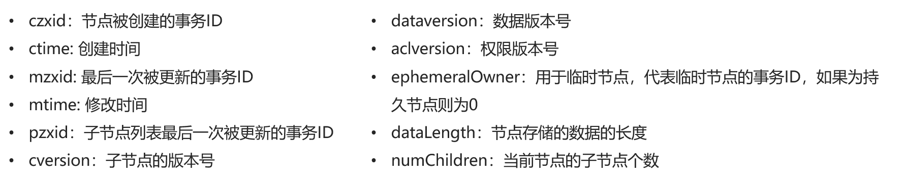

ZK是一个分布式、开源的分布式应用程序的协调服务。
管理分布式应用程序。
功能：

- 配置管理
- 分布式锁
- 集群管理

#### 数据模型
ZooKeeper 是一个树形目录服务,其数据模型和Unix的文件系统目录树很类似，拥有一个层次化结构。
这里面的每一个节点都被称为： ZNode，每个节点上都会保存自己的数据和节点信息。 
节点可以拥有子节点，同时也允许少量（1MB）数据存储在该节点之下。
节点可以分为四大类：

- PERSISTENT 持久化节点 
- EPHEMERAL 临时节点 ：-e
- PERSISTENT_SEQUENTIAL 持久化顺序节点 ：-s
- EPHEMERAL_SEQUENTIAL 临时顺序节点  ：-es

#### 常用命令
服务端命令

- 启动 ZooKeeper 服务: ./zkServer.sh start
- 查看 ZooKeeper 服务状态: ./zkServer.sh status
- 停止 ZooKeeper 服务: ./zkServer.sh stop 
- 重启 ZooKeeper 服务: ./zkServer.sh restart 

客户端命令
连接Zookeeper服务端：./zkCli.sh -server ip:port
断开连接：quit
查看命令帮助： help
显示指定路径下节点： ls path
创建节点：create [-e、-s、-es] path value
获取节点值：get /path
设置节点值：set /path value
删除单个节点：delete /path
删除有子节点的节点：deleteall /path
查看节点的详细信息：ls -s /path


#### JavaAPI
**pom**
```javascript
zookeeper version: 3.5.6
<!--curator-->
<dependency>
    <groupId>org.apache.curator</groupId>
    <artifactId>curator-framework</artifactId>
    <version>4.0.0</version>
</dependency>

<dependency>
    <groupId>org.apache.curator</groupId>
    <artifactId>curator-recipes</artifactId>
    <version>4.0.0</version>
</dependency>
```
**建立连接**
```javascript
public void testConnect() {

    /*
     *
     * @param connectString       连接字符串。zk server 地址和端口 "192.168.149.135:2181,192.168.149.136:2181"
     * @param sessionTimeoutMs    会话超时时间 单位ms
     * @param connectionTimeoutMs 连接超时时间 单位ms
     * @param retryPolicy         重试策略
     */
    /* 
    //重试策略
    RetryPolicy retryPolicy = new ExponentialBackoffRetry(3000,10);
    //1.第一种方式
    CuratorFramework client = CuratorFrameworkFactory.newClient("192.168.149.135:2181",
            60 * 1000, 15 * 1000, retryPolicy);*/
  
    //重试策略
    RetryPolicy retryPolicy = new ExponentialBackoffRetry(3000, 10);
    //2.第二种方式
    //CuratorFrameworkFactory.builder();
    client = CuratorFrameworkFactory.builder()
            .connectString("192.168.149.135:2181")
            .sessionTimeoutMs(60 * 1000)
            .connectionTimeoutMs(15 * 1000)
            .retryPolicy(retryPolicy)
            .namespace("wlpnz")  // 表示 默认在路径开头添加 /wlpnz 
            .build();

    //开启连接
    client.start();
}
```
**查询**
```
/**
 * 查询节点：
 * 1. 查询数据：get: getData().forPath()
 * 2. 查询子节点： ls: getChildren().forPath()
 * 3. 查询节点状态信息：ls -s:getData().storingStatIn(状态对象).forPath()
 */
```
**添加**
```
/**
 * 创建节点：create 持久 临时 顺序 数据
 * 1. 基本创建 ：create().forPath("/app")
 * 2. 创建节点 带有数据:create().forPath("/app",data)
 * 3. 设置节点的类型：create().withMode().forPath("/app",data)
 *     CreateMode: PERSISTENT、PERSISTENT_SEQUENTIAL、
 *  			EPHEMERAL、EPHEMERAL_SEQUENTIAL、CONTAINER、PERSISTENT_WITH_TTL、PERSISTENT_SEQUENTIAL_WITH_TTL
 * 4. 创建多级节点  /app1/p1 ：create().creatingParentsIfNeeded().forPath("",data)
 */
```
**修改**
```
/**
 * 修改数据
 * 1. 基本修改数据：setData().forPath()
 * 2. 根据版本修改: setData().withVersion().forPath()
 * * version 是通过查询出来的。目的就是为了让其他客户端或者线程不干扰我。
 */
```
**删除**
```
/**
 * 删除节点： delete deleteall
 * 1. 删除单个节点:delete().forPath("/app1");
 * 2. 删除带有子节点的节点:delete().deletingChildrenIfNeeded().forPath("/app1");
 * 3. 必须成功的删除:为了防止网络抖动。本质就是重试。  client.delete().guaranteed().forPath("/app2");
 * 4. 回调：inBackground
 */
```
#### JavaAPI--监听器
**NodeCache：给指定一个节点注册监听器**
```java
public void testNodeCache() throws Exception {
    //1. 创建NodeCache对象
    final NodeCache nodeCache = new NodeCache(client,"/app1");
    //2. 注册监听
    nodeCache.getListenable().addListener(new NodeCacheListener() {
        @Override
        public void nodeChanged() throws Exception {
            System.out.println("节点变化了~");
    
            //获取修改节点后的数据
            byte[] data = nodeCache.getCurrentData().getData();
            System.out.println(new String(data));
        }
    });
    
    //3. 开启监听.如果设置为true，则开启监听是，加载缓冲数据
    nodeCache.start(true);
    
    while (true){}  //持续监听
}
```
**PathChildrenCache：监听某个节点的所有子节点们**
```java
public void testPathChildrenCache() throws Exception {
    //1.创建监听对象
    PathChildrenCache pathChildrenCache = new PathChildrenCache(client,"/app2",true);
    
    //2. 绑定监听器
    pathChildrenCache.getListenable().addListener(new PathChildrenCacheListener() {
        @Override
        public void childEvent(CuratorFramework client, PathChildrenCacheEvent event) throws Exception {
            System.out.println("子节点变化了~");
            System.out.println(event);
            
            //监听子节点的数据变更，并且拿到变更后的数据
            //1.获取类型
            PathChildrenCacheEvent.Type type = event.getType();
            //2.判断类型是否是update
            if(type.equals(PathChildrenCacheEvent.Type.CHILD_UPDATED)){
                System.out.println("数据变了！！！");
                byte[] data = event.getData().getData();
                System.out.println(new String(data));
            }
        }
    });
    //3. 开启
    pathChildrenCache.start();
    
    while (true){}
}
```
**TreeCache：监听某个节点自己和所有子节点们**
```java
public void testTreeCache() throws Exception {
    //1. 创建监听器
    TreeCache treeCache = new TreeCache(client,"/app2");
    
    //2. 注册监听
    treeCache.getListenable().addListener(new TreeCacheListener() {
        @Override
        public void childEvent(CuratorFramework client, TreeCacheEvent event) throws Exception {
            System.out.println("节点变化了");
            System.out.println(event);
        }
    });
    
    //3. 开启
    treeCache.start();
    while (true){}
}
```
#### 集群
[Zookeeper集群搭建.pdf](https://www.yuque.com/attachments/yuque/0/2024/pdf/26677932/1715147496156-d7868644-87ef-4173-9acd-7ab9b5ea5f7c.pdf?_lake_card=%7B%22src%22%3A%22https%3A%2F%2Fwww.yuque.com%2Fattachments%2Fyuque%2F0%2F2024%2Fpdf%2F26677932%2F1715147496156-d7868644-87ef-4173-9acd-7ab9b5ea5f7c.pdf%22%2C%22name%22%3A%22Zookeeper%E9%9B%86%E7%BE%A4%E6%90%AD%E5%BB%BA.pdf%22%2C%22size%22%3A685641%2C%22ext%22%3A%22pdf%22%2C%22source%22%3A%22%22%2C%22status%22%3A%22done%22%2C%22download%22%3Atrue%2C%22taskId%22%3A%22u152879f0-85f9-40a2-a274-0bf4e724bd3%22%2C%22taskType%22%3A%22upload%22%2C%22type%22%3A%22application%2Fpdf%22%2C%22__spacing%22%3A%22both%22%2C%22mode%22%3A%22title%22%2C%22id%22%3A%22ud39a7b9b%22%2C%22margin%22%3A%7B%22top%22%3Atrue%2C%22bottom%22%3Atrue%7D%2C%22card%22%3A%22file%22%7D)
