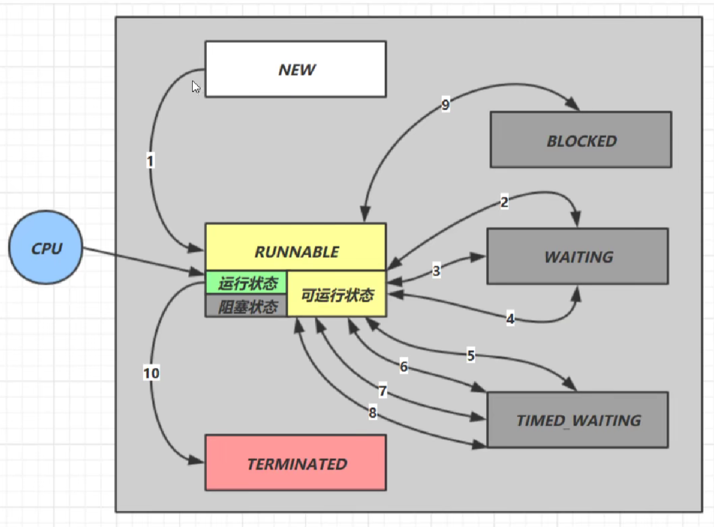
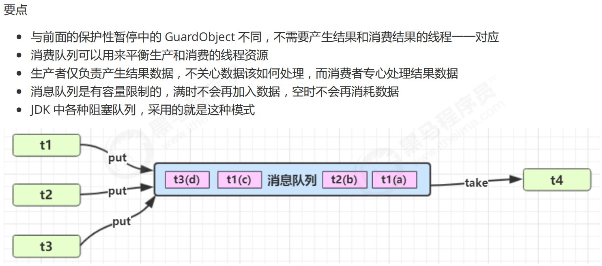
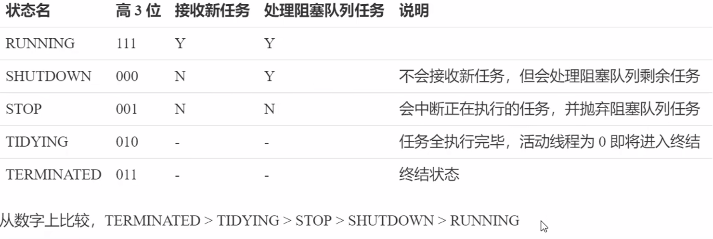
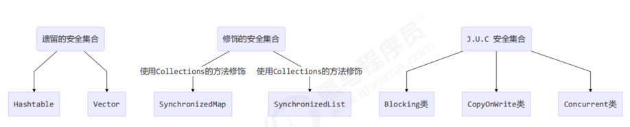

# 线程基础知识
> 基本知识：**Java知识(易忘记)--多线程**

## 补充：
```java
// 创建任务对象
FutureTask<Integer> task3 = new FutureTask<>(() -> {
 log.debug("hello");
 return 100;
});
// 参数1 是任务对象; 参数2 是线程名字，推荐
new Thread(task3, "t3").start();
// 主线程阻塞，同步等待 task 执行完毕的结果
Integer result = task3.get();
log.debug("结果是:{}", result);
```
## 方法：
| 方法名 | static | 功能说明 | 注意 |
| --- | --- | --- | --- |
| start() |  | 启动一个新线程，在新的线程运行run 方法中的代码 | start 方法只是让线程进入就绪，里面代码不一定立刻运行（CPU 的时间片还没分给它）。每个线程对象的 start方法只能调用一次，如果调用了多次会出现IllegalThreadStateException |
| run() |  | 新线程启动后会调用的方法 | 如果在构造 Thread 对象时传递了 Runnable 参数，则线程启动后会调用 Runnable 中的 run 方法，否则默认不执行任何操作。但可以创建 Thread 的子类对象，来覆盖默认行为 |
| join() |  | 等待线程运行结束 |  |
| join(long n) |  | 等待线程运行结 束,最多等待 n毫秒 |  |
| getId() |  | 获取线程长整型的 id | id唯一 |
| getName() |  | 获取线程名 |  |
| setName(String) |  | 修改线程名 |  |
| getPriority() |  | 获取线程优先级 |  |
| setPriority(int) |  | 修改线程优先级 | java中规定线程优先级是1~10 的整数，较大的优先级能提高该线程被 CPU 调度的机率 |
| getState() |  | 获取线程状态 | Java 中线程状态是用 6 个 enum 表示，分别为:NEW,RUNNABLE, BLOCKED,WAITING,TIMED_WAITING, TERMINATED |
| isInterrupted() |  | 判断是否被打断 | 不会清除`打断标记` |
| isAlive() |  | 线程是否存活（还没有运行完毕） |  |
| interrupt() |  | 打断线程 | 如果被打断线程正在 sleep，wait，join 会导致被打断的线程抛出 InterruptedException，并清除打断标记 ；如果打断的正在运行的线程，则会设置 打断标记 ；park 的线程被打断，也会设置打断标记 |
| interrupted() | static | 判断当前线程是否被打断  | 会清除`打断标记` |
| currentThread() | static | 获取当前正在执行的线程 |  |
| sleep(long n) | static | 让当前执行的线 程休眠n毫秒，休眠时让出 cpu的时间片给其它线程 |  |
| yield() | static | 提示线程调度器让出当前线程对CPU的使用 | 主要是为了测试和调试 |

## **Park & Unpark**
```java
// 暂停当前线程
LockSupport.park(); 
// 恢复某个线程的运行
LockSupport.unpark(暂停线程对象)

//先park 再unpark
```
特点：

- wait，notify 和 notifyAll 必须配合 Object Monitor 一起使用，而 park，unpark 不必
- park & unpark 是以线程为单位来【阻塞】和【唤醒】线程，而 notify 只能随机唤醒一个等待线程，notifyAll是唤醒所有等待线程，就不那么【精确】
- park & unpark 可以先 unpark，而 wait & notify 不能先 notify
## 线程状态转换

## 死锁
定位死锁
jps：查看java相关进程
jstack {pid} ：展示进程相关线程 
jsconsole 查看进程状态
## ReentrantLock
> 相对于synchronized它具备如下特点

- 可中断  `lock.lockInterruptibly()`
- 可以设置超时时间 `lock.tryLock(timeout)`
- 可以设置为公平锁 `new ReentrantLock(true)`
- 支持多个条件变量
   - synchronized中也有条件变量，就是我们讲原理时那个waitSet休息室，当条件不满足时进入waitSet等待
   ReentrantLock的条件变量比synchronized强大之处在于，它是支持多个条件变量的，这就好比synchronized是那些不满足条件的线程都在一间休息室等消息
   而ReentrantLock支持多间休息室，有专门等烟的休息室、专门等早餐的休息室、唤醒时也是按休息室来唤醒
- 与synchronized一样，都支持**可重入**（同一个线程中，在没有释放锁之前，再次获取锁）

基本语法：
```java
//获取锁
reentrantLock.lock();
try{
    //临界区
}finally{
    //释放锁
    reentrantLock.unlock();
}
```
## 共享变量的可见性(volatile)
共享变量 在声明时 加上**volatile 这里保证共享变量的可见性**（还可以保证指令不会重排序）
使用synchronized同步代码块包着 使用共享变量的代码
## 保护共享资源
### **原子整数**
J.U.C 并发包提供了： 

- AtomicBoolean 
- AtomicInteger 
- AtomicLong
```java
AtomicInteger i = new AtomicInteger(0);
// 获取并自增（i = 0, 结果 i = 1, 返回 0），类似于 i++
System.out.println(i.getAndIncrement());
// 自增并获取（i = 1, 结果 i = 2, 返回 2），类似于 ++i
System.out.println(i.incrementAndGet());
// 自减并获取（i = 2, 结果 i = 1, 返回 1），类似于 --i
System.out.println(i.decrementAndGet());
// 获取并自减（i = 1, 结果 i = 0, 返回 1），类似于 i--
System.out.println(i.getAndDecrement());
// 获取并加值（i = 0, 结果 i = 5, 返回 0）
System.out.println(i.getAndAdd(5));
// 加值并获取（i = 5, 结果 i = 0, 返回 0）
System.out.println(i.addAndGet(-5));
// 获取并更新（i = 0, p 为 i 的当前值, 结果 i = -2, 返回 0）
// 其中函数中的操作能保证原子，但函数需要无副作用
System.out.println(i.getAndUpdate(p -> p - 2));
// 更新并获取（i = -2, p 为 i 的当前值, 结果 i = 0, 返回 0）
// 其中函数中的操作能保证原子，但函数需要无副作用
System.out.println(i.updateAndGet(p -> p + 2));
// 获取并计算（i = 0, p 为 i 的当前值, x 为参数1, 结果 i = 10, 返回 0）
// 其中函数中的操作能保证原子，但函数需要无副作用
// getAndUpdate 如果在 lambda 中引用了外部的局部变量，要保证该局部变量是 final 的
// getAndAccumulate 可以通过 参数1 来引用外部的局部变量，但因为其不在 lambda 中因此不必是 final
System.out.println(i.getAndAccumulate(10, (p, x) -> p + x));
// 计算并获取（i = 10, p 为 i 的当前值, x 为参数1, 结果 i = 0, 返回 0）
// 其中函数中的操作能保证原子，但函数需要无副作用
System.out.println(i.accumulateAndGet(-10, (p, x) -> p + x));
```
### **原子引用**
为什么需要原子引用类型？ 

- AtomicReference 
- AtomicMarkableReference 
- AtomicStampedReference
```java
AtomicReference<BigDecimal> ref = new AtomicReference<>(balance);
while (true) {
     BigDecimal prev = ref.get();
     BigDecimal next = prev.subtract(amount);
     if (ref.compareAndSet(prev, next)) {
     	break;
     }
 }
```
> AtomicStampedReference

AtomicStampedReference可以给原子引用加上版本号，追踪原子引用整个的变化过程，如：A -> B -> A -> C ，通过AtomicStampedReference，我们可以知道，引用变量中途被更改了几次。 
但是有时候，并不关心引用变量更改了几次，只是单纯的关心**是否更改过**，所以就有了AtomicMarkableReference

```java
// 获取值
Object value = ref.getReference();
// 获取版本号
int stamp = ref.getStamp();
//value是执行取到的value next是待修改的值 stamp 是目前的版本号 stamp+1是执行成功后stamp的新值
ref.compareAndSet(value, next, stamp, stamp + 1)

```
> AtomicMarkableReference

AtomicMarkableReference是AtomicStampedReference的简化版
它的stamp是个boolean值

```java
AtomicMarkableReference<Object> ref = new AtomicMarkableReference<>(obj, true);
boolean success = ref.compareAndSet(prevObj, newObj, true, false);
```
### 原子数组

- AtomicIntegerArray
- AtomicLongArray 
- AtomicReferenceArray
```java
/**
 参数1，提供数组、可以是线程不安全数组或线程安全数组
 参数2，获取数组长度的方法
 参数3，自增方法，回传 array, index
 参数4，打印数组的方法
*/
// supplier 提供者 无中生有 ()->结果
// function 函数 一个参数一个结果 (参数)->结果 , BiFunction (参数1,参数2)->结果
// consumer 消费者 一个参数没结果 (参数)->void, BiConsumer (参数1,参数2)->
private static <T> void demo(
     Supplier<T> arraySupplier,
     Function<T, Integer> lengthFun,
     BiConsumer<T, Integer> putConsumer,
     Consumer<T> printConsumer ) {
     List<Thread> ts = new ArrayList<>();
     T array = arraySupplier.get();
     int length = lengthFun.apply(array);
     for (int i = 0; i < length; i++) {
         // 每个线程对数组作 10000 次操作
         ts.add(new Thread(() -> {
         	for (int j = 0; j < 10000; j++) {
         		putConsumer.accept(array, j%length);
         	}
         }));
     }
     ts.forEach(t -> t.start()); // 启动所有线程
     ts.forEach(t -> {
     	try {
     		t.join();
     	} catch (InterruptedException e) {
     		e.printStackTrace();
     	}
     }); // 等所有线程结束
     printConsumer.accept(array);
}

//不安全的数组
demo(
 ()->new int[10],
 (array)->array.length,
 (array, index) -> array[index]++,
 array-> System.out.println(Arrays.toString(array))
);
//结果
[9870, 9862, 9774, 9697, 9683, 9678, 9679, 9668, 9680, 9698]
//安全的数组
demo(
 ()-> new AtomicIntegerArray(10),
 (array) -> array.length(),
 (array, index) -> array.getAndIncrement(index),
 array -> System.out.println(array)
);
//结果
[10000, 10000, 10000, 10000, 10000, 10000, 10000, 10000, 10000, 10000]
```
### 字段更新器

- AtomicReferenceFieldUpdater // 域字段 
- AtomicIntegerFieldUpdater 
- AtomicLongFieldUpdater
> 利用字段更新器，可以针对对象的某个域（Field）进行原子操作，只能配合 volatile 修饰的字段使用，否则会出现异常：Exception in thread "main" java.lang.IllegalArgumentException: Must be volatile type

```java
AtomicIntegerFieldUpdater fieldUpdater = AtomicIntegerFieldUpdater.newUpdater(Test5.class, "field");
Test5 test5 = new Test5(); //此时：field=0
//修改成功之后：field=10
 fieldUpdater.compareAndSet(test5, 0, 10);  //第一个参数是要修改的类，第二是期望的值（现有的值），第三个是待改变的值
```
### Unsafe
> Unsafe 对象提供了非常底层的，操作内存、线程的方法，Unsafe 对象不能直接调用，只能通过反射获得

```java
public class UnsafeAccessor {
     static Unsafe unsafe;
     static {
         try { 
             Field theUnsafe = Unsafe.class.getDeclaredField("theUnsafe");
             theUnsafe.setAccessible(true);
             unsafe = (Unsafe) theUnsafe.get(null);
         } catch (NoSuchFieldException | IllegalAccessException e) {
         	throw new Error(e);
         }
     }
     static Unsafe getUnsafe() {
     	return unsafe;
     }
}
```
```java
@Data
class Student {
 volatile int id;
 volatile String name;
}

Unsafe unsafe = UnsafeAccessor.getUnsafe();
Field id = Student.class.getDeclaredField("id");
Field name = Student.class.getDeclaredField("name");
// 获得成员变量的偏移量
long idOffset = UnsafeAccessor.unsafe.objectFieldOffset(id);
long nameOffset = UnsafeAccessor.unsafe.objectFieldOffset(name);
Student student = new Student();
// 使用 cas 方法替换成员变量的值
UnsafeAccessor.unsafe.compareAndSwapInt(student, idOffset, 0, 20); // 返回 true
UnsafeAccessor.unsafe.compareAndSwapObject(student, nameOffset, null, "张三"); // 返回 true
System.out.println(student);

//输出： Student(id=20, name=张三)
```
# 模式
## 两阶段终止模式
使用interrupt()打断线程
使用volatile终止
```java
class TwoPhaseTermination {
    // 监控线程
    private Thread monitorThread;
    // 停止标记
    private volatile boolean stop = false;
    // 判断是否执行过 start 方法
    private boolean starting = false;

    // 启动监控线程
    public void start() {
        synchronized (this) { //并发
            if (starting) { // false 犹豫模式(Balking)
                return;
            }
            starting = true;
        }
        monitorThread = new Thread(() -> {
            while (true) {
                Thread current = Thread.currentThread();
                // 是否被打断
                if (stop) {
                    log.debug("料理后事");
                    break;
                }
                try {
                    Thread.sleep(1000);
                    log.debug("执行监控记录");
                } catch (InterruptedException e) {
                }
            }
        }, "monitor");
        monitorThread.start();
    }

    // 停止监控线程
    public void stop() {
        stop = true;
        monitorThread.interrupt();
    }
}
```
## 保护性暂停模式
```java
public Object get(long millis) throws InterruptedException{
    synchronized (lock) {
        // 1) 记录最初时间
        long last = System.currentTimeMillis();
        // 2) 已经经历的时间
        long timePassed = 0;
        while (response == null) {
            long waitTime = millis - timePassed;
            if (waitTime <= 0) {
                break;
            }
            lock.wait(waitTime); //预防虚假唤醒
            timePassed = System.currentTimeMillis() - last;
        }
        return response;
    }
}
```
## 生产者/消费者模式

## xxx模式


# 线程池
## 自定义线程池
```java

public class TestPool {
    public static void main(String[] args) {
        ThreadPool pool = new ThreadPool(1, 1000, TimeUnit.MILLISECONDS, 1,(queue,task)->{
            //死等
//            queue.put(task);
            // 2) 带超时等待
            queue.offer(task, 1500, TimeUnit.MILLISECONDS);
            // 3) 让调用者放弃任务执行
//            log.debug("放弃{}", task);
            // 4) 让调用者抛出异常
//            throw new RuntimeException("任务执行失败 " + task);
            // 5) 让调用者自己执行任务
//            task.run();
        });
        for (int i = 0; i < 3; i++) {
            int j = i;
            pool.execute(()->{
                try {
                    Thread.sleep(1000L);
                } catch (InterruptedException e) {
                    e.printStackTrace();
                }
                log.debug("{}",j);
            });
        }
    }

}

@Slf4j(topic = "c.WlThreadPool")
class ThreadPool{
    //任务队列
    private BlockingQueue<Runnable> taskQueue;
    //线程集合
    private HashSet<Worker> workers = new HashSet<>();
    //核心线程数
    private int coreSize;
    //获取任务的超时时间
    private int timeout;

    private TimeUnit unit;

    private RejectPolicy policy;

    //执行任务
    public void execute(Runnable task){
        //当任务数没有超过coreSize 直接交给worker对象执行
        //如果任务数超过coreSize 加入任务队列
        synchronized (workers) {
            if(workers.size() < coreSize){
                Worker worker = new Worker(task);
                log.debug("新增worker：{},{}",worker,task);
                workers.add(worker);
                worker.start(); //启动线程
            }else{
//                taskQueue.put(task);
                taskQueue.tryPut(policy,task);
            }
        }

    }

    public ThreadPool(int coreSize, int timeout, TimeUnit unit,int queueCapcity,RejectPolicy<Runnable> policy) {
        this.coreSize = coreSize;
        this.timeout = timeout;
        this.unit = unit;
        this.taskQueue = new BlockingQueue<>(queueCapcity);
        this.policy = policy;
    }

    class Worker extends Thread{
        private Runnable task;
        public Worker(Runnable task){
            this.task = task;
        }

        @Override
        public void run() {
            //执行任务
            // 当task不为空 执行任务
            //当task为空 接着从任务队列中获取任务
            while(task!=null || (task = taskQueue.poll(timeout,unit)) != null){ //超时放弃等待
//            while(task!=null || (task = taskQueue.take()) != null){  //死等
                try{
                    log.debug("正在执行...{}",task);
                    task.run();
                }catch (Exception e){
                    e.printStackTrace();
                }finally{
                    task = null;
                }
            }
            synchronized (workers){
                log.debug("worker被移除：{}",this);
                workers.remove(this);
            }
        }
    }
}

@FunctionalInterface
interface RejectPolicy<T>{
    void reject(BlockingQueue<T> queue, T task);
}

@Slf4j(topic = "c.BlockingQueue")
class BlockingQueue<T>{

    //任务队列
    private Deque<T> queue = new ArrayDeque<>();
    //锁
    private ReentrantLock lock = new ReentrantLock();
    //生产者条件变量
    private Condition fullWaitSet = lock.newCondition();

    //消费者条件变量
    private Condition emptyWaitSet = lock.newCondition();
    //容量
    private int capcity;

    public BlockingQueue(int capcity) {
        this.capcity = capcity;
    }

    //带超时的阻塞获取
    public T poll(long timeout, TimeUnit unit){
        lock.lock();
        try {
            //将超时时间统一转换为纳秒
            long nanos = unit.toNanos(timeout);
            while(queue.isEmpty()){
                try {
                    if(nanos <= 0 ){
                        return null;
                    }
                    nanos = emptyWaitSet.awaitNanos(nanos);
                } catch (InterruptedException e) {
                    e.printStackTrace();
                }
            }
            T t = queue.removeFirst();
            fullWaitSet.signal();
            return t;
        } finally {
            lock.unlock();
        }
    }
    //阻塞获取
    public T take(){
        lock.lock();
        try {
            while(queue.isEmpty()){
                try {
                    emptyWaitSet.await(); //如果队列是空的让线程进入等待
                } catch (InterruptedException e) {
                    e.printStackTrace();
                }
            }
            T t = queue.removeFirst(); //消费了一个任务 告诉生产者可以放入任务
            fullWaitSet.signal(); //告诉生产者可以放入任务
            return t;
        } finally {
            lock.unlock();
        }

    }

    //阻塞添加
    public void put(T task){
        lock.lock();
        try {
            while(queue.size() == capcity){
                try {
                    log.debug("等待加入任务队列 {} ...", task);
                    fullWaitSet.await(); //如果容量满了 就让任务进入等待
                } catch (InterruptedException e) {
                    e.printStackTrace();
                }
            }
            log.debug("加入任务队列 {}", task);
            queue.addLast(task); //放入任务
            emptyWaitSet.signal(); //唤醒消费者
        } finally {
            lock.unlock();
        }
    }

    // 带超时时间阻塞添加
    public boolean offer(T task, long timeout, TimeUnit timeUnit) {
        lock.lock();
        try {
            long nanos = timeUnit.toNanos(timeout);
            while (queue.size() == capcity) {
                try {
                    if(nanos <= 0) {
                        return false;
                    }
                    log.debug("等待加入任务队列 {} ...", task);
                    nanos = fullWaitSet.awaitNanos(nanos);
                } catch (InterruptedException e) {
                    e.printStackTrace();
                }
            }
            log.debug("加入任务队列 {}", task);
            queue.addLast(task);
            emptyWaitSet.signal();
            return true;
        } finally {
            lock.unlock();
        }
    }
    //获取大小
    public int size(){
        lock.lock();
        try {
            return queue.size();
        } finally {
            lock.unlock();
        }
    }

    public void tryPut(RejectPolicy<T> policy, T task) {
        lock.lock();
        try {
            //已满
            if(queue.size() == capcity){
                //拒绝策略
                policy.reject(this,task);
            }else{
                log.debug("加入任务队列 {}", task);
                //空闲 加入队列
                queue.addLast(task);
                //唤醒消费者
                emptyWaitSet.signal();
            }
        }finally {
            lock.unlock();
        }
    }
}
```
## 线程池状态
ThreadPoolExecutor使用int的高3位来表示线程池状态，低29位表示线程数量


```java
public ThreadPoolExecutor(
    int corePoolsize,
    int maximumPoolSize,
    long keepAliveTime,
    TimeUnit unit,
    BlockingQueue<Runnable>workQueue,
    ThreadFactory threadFactory,
    RejectedExecutionHandler handler)
    
·corePoolSize 核心线程数目（最多保留的线程数）
·maximumPoolSize 最大线程数目
·keepAliveTime 生存时间-针对救急线程
·unit 时间单位-针对救急线程
·workQueue 阻塞队列
·threadFactory 线程工厂-可以为线程创建时起个好名字
·handler 拒绝策略
```
> 工作方式：
> - 线程池中刚开始没有线程，当一个任务提交给线程池后，线程池会创建一个新线程来执行任务。
> - 当线程数达到corePoolSize并没有线程空闲，这时再加入任务，新加的任务会被加入workQueue队列排队，直到有空闲的线程。
> - 如果队列选择了有界队列，那么任务超过了队列大小时，会创建maximumPoolSize-corePoolSize数目的线程来救急。
> - 如果线程到达maximumPoolSize仍然有新任务这时会执行拒绝策略。拒绝策略jdk提供了4种实现，其它著名框架也提供了实现
>    - AbortPolicy让调用者抛出RejectedExecutionException异常，这是默认策略
>    - CallerRunsPolicy让调用者运行任务
>    - DiscardPolicy放弃本次任务
>    - DiscardOldestPolicy放弃队列中最早的任务，本任务取而代之
>    - Dubbo的实现，在抛出RejectedExecutionException异常之前会记录日志，并dump线程栈信息，方便定位问题
>    - Netty的实现，是创建一个新线程来执行任务
>    - ActiveMQ的实现，带超时等待(60s)尝试放入队列，类似我们之前自定义的拒绝策略
>    - PinPoint的实现，它使用了一个拒绝策略链，会逐一尝试策略链中每种拒绝策略
> - 当高峰过去后，超过corePoolSize的救急线程如果一段时间没有任务做，需要结束节省资源，这个时间由keepAliveTime和unit来控制。
> 
根据这个构造方法，JDK Executors类中提供了众多工厂方法来创建各种用途的线程池

## Executor
### newFixedThreadPool
```java
public static ExecutorService newFixedThreadPool(int nThreads) {
    return new ThreadPoolExecutor(nThreads, nThreads,
                                  0L, TimeUnit.MILLISECONDS,
                                  new LinkedBlockingQueue<Runnable>());
}
```
> 特点
> - 核心线程数 == 最大线程数（没有救急线程被创建），因此也无需超时时间
> - 阻塞队列是无界的，可以放任意数量的任务
> - 使用与任务量已知，相对耗时的任务

### newCachedThreadPool
```java
public static ExecutorService newCachedThreadPool() {
    return new ThreadPoolExecutor(0, Integer.MAX_VALUE,
                                  60L, TimeUnit.SECONDS,
                                  new SynchronousQueue<Runnable>());
}
```
> 特点
> - 核心线程数是0，最大线程数是Integer.MAX_VALUE,救急线程的空闲生存时间是60s,意味着
>    - 全部都是救急线程(60s后可以回收)
>    - 救急线程可以无线创建
> - 队列采用了SynchronousQueue实现特点，它没有容量，没有线程来取是放不进去的（一手交钱，一手交货
> - **评价：**整个线程池表现为线程数会根据任务量不断增长，没有上限，当任务执行完毕，空闲1分钟后释放线程。适合任务数比较密集，但每个任务执行时间较短的情况

### newSingleThreadExecutor
```java
public static ExecutorService newSingleThreadExecutor() {
    return new FinalizableDelegatedExecutorService
        (new ThreadPoolExecutor(1, 1,
                                0L, TimeUnit.MILLISECONDS,
                                new LinkedBlockingQueue<Runnable>()));
}
```
> 使用场景：
> - 希望多个任务排队执行。线程数固定为1，任务数多于1时，会放入无界队列排队。任务执行完毕，这唯一的线程也不会被释放。
> 
区别：
> - 自己创建一个单线程串行执行任务，如果任务执行失败而终止那么没有任何补救措施，而线程池还会新建一个线程，保证池的正常工作
> - Executors..newSingleThreadExecutor(0线程个数始终为1，不能修改
>    - FinalizableDelegatedExecutorService应用的是装饰器模式，只对外暴露了ExecutorService接口，因此不能调用ThreadPoolExecutor中特有的方法
> - Executors.newFixedThreadPool(1)初始时为1，以后还可以修改
>    - 对外暴露的是ThreadPoolExecutor对象，可以强转后调用setCorePoolSize等方法进行修改

### 提交任务
```java
//执行任务
void execute(Runnable command);
//提交任务task，用返回值Future获取任务执行结果
<T> Future<T> submit(Callable<T> task);
//提交tasks中所有任务
<T> List<Future<T>> invokeAll(Collection<? extends Callable<T>> tasks)
    throws InterruptedException;
//提交tasks中所有任务,带超时时间
<T> List<Future<T>> invokeAll(Collection<? extends Callable<T>> tasks,
                              long timeout, TimeUnit unit)
    throws InterruptedException;
//提交tasks中所有任务，那个任务先成功执行完毕，返回此任务执行结果，其它任务取消
<T> T invokeAny(Collection<? extends Callable<T>> tasks)
    throws InterruptedException, ExecutionException;
//提交tasks中所有任务，那个任务先成功执行完毕，返回此任务执行结果，其他任务取消，带超时时间
<T> T invokeAny(Collection<? extends Callable<T>> tasks,
                long timeout, TimeUnit unit)
    throws InterruptedException, ExecutionException, TimeoutException;
```
### 关闭线程池
```java
/*
线程池状态变为SHUTDOWN
- 不会接收新任务
- 但已提交任务会执行完
- 此方法不会阻塞调用线程的执行
*/
void shutdown();

/*
线程池状态变为STOP
- 不会接收新任务
- 会将队列中的任务返回
- 并用interrupt的方式中断正在执行的任务
*/
List<Runnable> shutdownNow();


```
### 其他方法
```java
//不在RUNNING状态的线程池，此方法就返回true
boolean isShutdown();

//线程池状态是否是 TERMINATED
boolean isTerminated();

//调用shutdown后，由于调用线程并不会等待所有任务运行结束，
//因此想要在线程池TERMINATED 后做一些事情，可以利用此方法等待
boolnean awaitTermination(long timeout,TimeUnit unit) throws InterruptedException;
```
### 任务调度线程池
> **scheduleAtFixedRate** 例子（任务执行时间超过了间隔时间）

```java
ScheduledExecutorService pool = Executors.newScheduledThreadPool(1);
log.debug("start...");
pool.scheduleAtFixedRate(() -> {
 log.debug("running...");
 sleep(2);
}, 1, 1, TimeUnit.SECONDS);
```
> 输出分析：一开始，延时1s，接下来，由于任务执行时间 > 间隔时间 间隔被 [ 撑 ]到了2s
> 21:44:30.311 c.TestTimer [main] - start... 
> 21:44:31.360 c.TestTimer [pool-1-thread-1] - running... 
> 21:44:33.361 c.TestTimer [pool-1-thread-1] - running... 
> 21:44:35.362 c.TestTimer [pool-1-thread-1] - running... 
> 21:44:37.362 c.TestTimer [pool-1-thread-1] - running... 

> **scheduleWithFixedDelay **例子

```java
ScheduledExecutorService pool = Executors.newScheduledThreadPool(1);
log.debug("start...");
pool.scheduleWithFixedDelay(()-> {
 log.debug("running...");
 sleep(2);
}, 1, 1, TimeUnit.SECONDS);
```
> 输出分析：一开始，延时 1s，scheduleWithFixedDelay 的间隔是 上一个任务结束 <-> 延时 <-> 下一个任务开始，所以间隔都是 3s
> 21:40:55.078 c.TestTimer [main] - start... 
> 21:40:56.140 c.TestTimer [pool-1-thread-1] - running... 
> 21:40:59.143 c.TestTimer [pool-1-thread-1] - running... 
> 21:41:02.145 c.TestTimer [pool-1-thread-1] - running... 
> 21:41:05.147 c.TestTimer [pool-1-thread-1] - running... 

> **评价 **整个线程池表现为：线程数固定，任务数多于线程数时，会放入无界队列排队。任务执行完毕，这些线程也不会被释放。用来执行延迟或反复执行的任务

## JUC
### MyLock
```java
// 自定义锁（不可重入锁）
class MyLock implements Lock {

    // 独占锁  同步器类
    class MySync extends AbstractQueuedSynchronizer {
        @Override
        protected boolean tryAcquire(int arg) {
            if(compareAndSetState(0, 1)) {
                // 加上了锁，并设置 owner 为当前线程
                setExclusiveOwnerThread(Thread.currentThread());
                return true;
            }
            return false;
        }

        @Override
        protected boolean tryRelease(int arg) {
            setExclusiveOwnerThread(null);
            setState(0);
            return true;
        }

        @Override // 是否持有独占锁
        protected boolean isHeldExclusively() {
            return getState() == 1;
        }

        public Condition newCondition() {
            return new ConditionObject();
        }
    }

    private MySync sync = new MySync();

    @Override // 加锁（不成功会进入等待队列）
    public void lock() {
        sync.acquire(1);
    }

    @Override // 加锁，可打断
    public void lockInterruptibly() throws InterruptedException {
        sync.acquireInterruptibly(1);
    }

    @Override // 尝试加锁（一次）
    public boolean tryLock() {
        return sync.tryAcquire(1);
    }

    @Override // 尝试加锁，带超时
    public boolean tryLock(long time, TimeUnit unit) throws InterruptedException {
        return sync.tryAcquireNanos(1, unit.toNanos(time));
    }

    @Override // 解锁
    public void unlock() {
        sync.release(1);
    }

    @Override // 创建条件变量
    public Condition newCondition() {
        return sync.newCondition();
    }
}
```
### ReentrantReadWriteLock
> **读写锁**   读-读可以并发 读-写 & 写-写 不可以并发(会被**阻塞**)

```java
private ReentrantReadWriteLock rw = new ReentrantReadWriteLock();
private ReentrantReadWriteLock.ReadLock r = rw.readLock();
private ReentrantReadWriteLock.WriteLock w = rw.writeLock();

//获取读锁
r.lock();
//释放读锁
r.unlock();
//获取写锁
w.lock();
//释放写锁
w.unlock();
```
> **注意事项：**
> - 读锁不支持条件变量
> - 重入时升级不支持：及持有读锁的情况下去获取写锁，会导致获取写锁永久等待
> - 重入时降级支持：即持有写锁的情况下去获取读锁

```java
class CachedData {
    Object data;
    // 是否有效，如果失效，需要重新计算 data
    volatile boolean cacheValid;
    final ReentrantReadWriteLock rwl = new ReentrantReadWriteLock(); 
    void processCachedData() {
     rwl.readLock().lock();
     if (!cacheValid) {
         // 获取写锁前必须释放读锁
         rwl.readLock().unlock();
         rwl.writeLock().lock();
         try {
             // 判断是否有其它线程已经获取了写锁、更新了缓存, 避免重复更新
             if (!cacheValid) {
                 data = ...
                 cacheValid = true;
             }
             // 降级为读锁, 释放写锁, 这样能够让其它线程读取缓存
             rwl.readLock().lock();
         } finally {
             rwl.writeLock().unlock();
         }
     }
     // 自己用完数据, 释放读锁 
     try {
        use(data);
     } finally {
        rwl.readLock().unlock();
     }
    }
}
```
### StampedLock
> 特点：使用读锁、写锁时都必须配合【戳】使用

```java
long stamp = lock.readLock();
lock.unlockRead(stamp);
```
```java
long stamp = lock.writeLock();
lock.unlockWrite(stamp);
```
> 乐观读，StampedLock 支持 tryOptimisticRead() 方法（乐观读），读取完毕后需要做一次 戳校验 如果校验通过，表示这期间确实没有写操作，数据可以安全使用，如果校验没通过，需要重新获取读锁，保证数据安全。

```java
class DataContainerStamped {
 private int data;
    private final StampedLock lock = new StampedLock();
    public DataContainerStamped(int data) {
    	this.data = data;
    }
    public int read(int readTime) {
        long stamp = lock.tryOptimisticRead();
        log.debug("optimistic read locking...{}", stamp);
        sleep(readTime);
        if (lock.validate(stamp)) {
            log.debug("read finish...{}, data:{}", stamp, data);
            return data;
        }
        // 锁升级 - 读锁
        log.debug("updating to read lock... {}", stamp);
        try {
            stamp = lock.readLock();
            log.debug("read lock {}", stamp);
            sleep(readTime);
            log.debug("read finish...{}, data:{}", stamp, data);
            return data;
        } finally {
            log.debug("read unlock {}", stamp);
            lock.unlockRead(stamp);
        }
    }
    public void write(int newData) {
        long stamp = lock.writeLock();
        log.debug("write lock {}", stamp);
        try {
            sleep(2);
            this.data = newData;
        } finally {
            log.debug("write unlock {}", stamp);
            lock.unlockWrite(stamp);
        }
    }
}

//测试代码
public static void main(String[] args) {
    DataContainerStamped dataContainer = new DataContainerStamped(1);
    new Thread(() -> {
    	dataContainer.read(1);
    }, "t1").start();
    sleep(0.5);
    new Thread(() -> {
    	dataContainer.write(100);
    }, "t2").start();
}
//测试结果
15:57:00.219 c.DataContainerStamped [t1] - optimistic read locking...256 
15:57:00.717 c.DataContainerStamped [t2] - write lock 384 
15:57:01.225 c.DataContainerStamped [t1] - updating to read lock... 256 
15:57:02.719 c.DataContainerStamped [t2] - write unlock 384 
15:57:02.719 c.DataContainerStamped [t1] - read lock 513 
15:57:03.719 c.DataContainerStamped [t1] - read finish...513, data:1000 
15:57:03.719 c.DataContainerStamped [t1] - read unlock 513
```
> **注意**
> - StampedLock 不支持条件变量 
> - StampedLock 不支持可重入

### Semaphore
> 信号量，用来限制能同时访问共享资源的线程上限。

```java
public static void main(String[] args) {
    // 1. 创建 semaphore 对象
    Semaphore semaphore = new Semaphore(3);
    // 2. 10个线程同时运行
    for (int i = 0; i < 10; i++) {
        new Thread(() -> {
            try {
            	semaphore.acquire(); // 3. 获取许可
            } catch (InterruptedException e) {
            	e.printStackTrace();
            }
            try {
            	log.debug("running...");
            	sleep(1); //睡眠1s
            	log.debug("end...");
            } finally {
                // 4. 释放许可
                semaphore.release();
            }
        }).start();
    }
}
//结果
07:35:15.485 c.TestSemaphore [Thread-2] - running... 
07:35:15.485 c.TestSemaphore [Thread-1] - running... 
07:35:15.485 c.TestSemaphore [Thread-0] - running... 
07:35:16.490 c.TestSemaphore [Thread-2] - end... 
07:35:16.490 c.TestSemaphore [Thread-0] - end... 
07:35:16.490 c.TestSemaphore [Thread-1] - end... 
07:35:16.490 c.TestSemaphore [Thread-3] - running... 
07:35:16.490 c.TestSemaphore [Thread-5] - running... 
07:35:16.490 c.TestSemaphore [Thread-4] - running... 
07:35:17.490 c.TestSemaphore [Thread-5] - end... 
07:35:17.490 c.TestSemaphore [Thread-4] - end... 
07:35:17.490 c.TestSemaphore [Thread-3] - end... 
07:35:17.490 c.TestSemaphore [Thread-6] - running... 
07:35:17.490 c.TestSemaphore [Thread-7] - running... 
07:35:17.490 c.TestSemaphore [Thread-9] - running... 
07:35:18.491 c.TestSemaphore [Thread-6] - end... 
07:35:18.491 c.TestSemaphore [Thread-7] - end... 
07:35:18.491 c.TestSemaphore [Thread-9] - end... 
07:35:18.491 c.TestSemaphore [Thread-8] - running... 
07:35:19.492 c.TestSemaphore [Thread-8] - end...
```
### CountDownLatch
> 用来进行线程同步协作，等待所有线程完成倒计时。 
> 其中构造参数用来初始化等待计数值，await() 用来等待计数归零，countDown() 用来让计数减一

```java
public static void main(String[] args) throws InterruptedException {
    CountDownLatch latch = new CountDownLatch(3);
    ExecutorService service = Executors.newFixedThreadPool(4);
    service.submit(() -> {
        log.debug("begin...");
        sleep(1);
        latch.countDown();
        log.debug("end...{}", latch.getCount());
    });
    service.submit(() -> {
        log.debug("begin...");
        sleep(1.5);
        latch.countDown();
        log.debug("end...{}", latch.getCount());
    });
    service.submit(() -> {
        log.debug("begin...");
        sleep(2);
        latch.countDown();
        log.debug("end...{}", latch.getCount());
    });
    service.submit(()->{
        try {
            log.debug("waiting...");
            latch.await();
            log.debug("wait end...");
        } catch (InterruptedException e) {
        	e.printStackTrace();
        }
    });
}

//结果
18:52:25.831 c.TestCountDownLatch [pool-1-thread-3] - begin... 
18:52:25.831 c.TestCountDownLatch [pool-1-thread-1] - begin... 
18:52:25.831 c.TestCountDownLatch [pool-1-thread-2] - begin... 
18:52:25.831 c.TestCountDownLatch [pool-1-thread-4] - waiting... 
18:52:26.835 c.TestCountDownLatch [pool-1-thread-1] - end...2 
18:52:27.335 c.TestCountDownLatch [pool-1-thread-2] - end...1 
18:52:27.835 c.TestCountDownLatch [pool-1-thread-3] - end...0 
18:52:27.835 c.TestCountDownLatch [pool-1-thread-4] - wait end...
```
```java
AtomicInteger num = new AtomicInteger(0);
ExecutorService service = Executors.newFixedThreadPool(10, (r) -> {
    return new Thread(r, "t" + num.getAndIncrement());
});
CountDownLatch latch = new CountDownLatch(10);
String[] all = new String[10];
Random r = new Random();
for (int j = 0; j < 10; j++) {
    int x = j;
    service.submit(() -> {
        for (int i = 0; i <= 100; i++) {
            try {
            	Thread.sleep(r.nextInt(100));//随机睡眠时间
            } catch (InterruptedException e) {
            }
            all[x] = Thread.currentThread().getName() + "(" + (i + "%") + ")";
            System.out.print("\r" + Arrays.toString(all));
        }
        latch.countDown();
    });
}
latch.await(); //等10个线程运行完
System.out.println("\n游戏开始...");
service.shutdown();
//结果
//中间输出
[t0(52%), t1(47%), t2(51%), t3(40%), t4(49%), t5(44%), t6(49%), t7(52%), t8(46%), t9(46%)]
//最后输出
[t0(100%), t1(100%), t2(100%), t3(100%), t4(100%), t5(100%), t6(100%), t7(100%), t8(100%),t9(100%)] 
游戏开始...
```
### CyclicBarrier
> [ˈsaɪklɪk ˈbæriɚ] 循环栅栏，用来进行线程协作，等待线程满足某个计数。构造时设置『计数个数』，每个线程执行到某个需要“同步”的时刻调用 await() 方法进行等待，当等待的线程数满足『计数个数』时，继续执行

```java
public class TestCyclicBarrier {
    public static void main(String[] args) {
        CyclicBarrier cb = new CyclicBarrier(2);
        for (int i = 0; i < 3; i++) {
            new Thread(()->{
                System.out.println("线程1开始.."+new Date());
                try {
                    cb.await(); // 当个数不足时，等待
                } catch (InterruptedException | BrokenBarrierException e) {
                    e.printStackTrace();
                }
                System.out.println("线程1继续向下运行..."+new Date());
            }).start();
            new Thread(()->{
                System.out.println("线程2开始.."+new Date());
                try { Thread.sleep(2000); } catch (InterruptedException e) { }
                try {
                    cb.await(); // 2 秒后，线程个数够2，继续运行
                } catch (InterruptedException | BrokenBarrierException e) {
                    e.printStackTrace();
                }
                System.out.println("线程2继续向下运行..."+new Date());
            }).start();

            try { Thread.sleep(2000); } catch (InterruptedException e) { }
        }
    }
}

//测试结果
线程1开始..Mon Mar 13 21:12:16 CST 2023
线程2开始..Mon Mar 13 21:12:16 CST 2023
线程2继续向下运行...Mon Mar 13 21:12:18 CST 2023
线程1继续向下运行...Mon Mar 13 21:12:18 CST 2023
线程1开始..Mon Mar 13 21:12:18 CST 2023
线程2开始..Mon Mar 13 21:12:18 CST 2023
线程2继续向下运行...Mon Mar 13 21:12:20 CST 2023
线程1继续向下运行...Mon Mar 13 21:12:20 CST 2023
线程1开始..Mon Mar 13 21:12:20 CST 2023
线程2开始..Mon Mar 13 21:12:20 CST 2023
线程1继续向下运行...Mon Mar 13 21:12:22 CST 2023
线程2继续向下运行...Mon Mar 13 21:12:22 CST 2023
```
> **注意** CyclicBarrier 与 CountDownLatch 的主要区别在于 CyclicBarrier 是可以重用的 CyclicBarrier 可以被比喻为『人满发车』

### 线程安全的集合类

线程安全集合类可以分为三大类： 

- 遗留的线程安全集合如 Hashtable ， Vector 
- 使用 Collections 装饰的线程安全集合，如： 
   - Collections.synchronizedCollection 
   - Collections.synchronizedList 
   - Collections.synchronizedMap 
   - Collections.synchronizedSet 
   - Collections.synchronizedNavigableMap 
   - Collections.synchronizedNavigableSet
   - Collections.synchronizedSortedMap 
   - Collections.synchronizedSortedSet 
- java.util.concurrent.* 

重点介绍 java.util.concurrent.* 下的线程安全集合类，可以发现它们有规律，里面包含三类关键词：Blocking、CopyOnWrite、Concurrent 

- Blocking 大部分实现基于锁，并提供用来阻塞的方法 
- CopyOnWrite 之类容器修改开销相对较重 
- Concurrent 类型的容器 
   - 内部很多操作使用 cas 优化，一般可以提供较高吞吐量 
   - 弱一致性 
      - 遍历时弱一致性，例如，当利用迭代器遍历时，如果容器发生修改，迭代器仍然可以继续进行遍历，这时内容是旧的 
      - 求大小弱一致性，size 操作未必是 100% 准确 
      - 读取弱一致性 
> 遍历时如果发生了修改，对于非安全容器来讲，使用 **fail-fast **机制也就是让遍历立刻失败，抛出 
> ConcurrentModifificationException，不再继续遍历

## TODO
**线程安全集合视频**
**源码方面视频**
