# JUC并发编程

### 相关概念

> 进程
>
> 是程序的一次执行，是系统进行资源分配和调度的独立单位，每个进程都有它自己的内存空间和系统资源

> 线程
>
> 在同一进程内又可以执行多个任务，这样的任务可以看做是线程
>
> 一个进程会有1个或多个线程

> 管程
>
> Monitor（监视器），也就是平时说的锁

> Java线程分为用户线程和守护线程
>
> 线程`daemon`属性为true表示是守护线程，false表示是用户线程
>
> 守护线程
>
> 是一种特殊的线程，在后台默默地完成一些系统性的服务，比如垃圾回收线程
>
> 用户线程
>
> 是系统的工作线程，会完成这个程序需要完成的业务操作

### 创建线程的方式

**直接使用Thread**

```java
new Thread("t1"){
    @Override
    public void run() {
        System.out.println(Thread.currentThread().getName());
    }
}.start(); // t1
```

**使用Runnable配合Thread**

```java
new Thread(new Runnable() {
    @Override
    public void run() {
        System.out.println(Thread.currentThread().getName());
    }
}, "t2").start(); // t2
```

**FutureTask配合Thread**

```java
FutureTask<Integer> task = new FutureTask<Integer>(() -> {
    System.out.println(Thread.currentThread().getName());
    return 1;
});
new Thread(task, "t3").start(); //t3
System.out.println(task.get()); // 1
```

###  查看进程线程的方法

windows  

- 任务管理器可以查看进程和线程数，也可以用来杀死进程 
- tasklist 查看进程 
- taskkill 杀死进程

linux

- ps -fe 查看所有进程 
- ps -fT -p  查看某个进程（PID）的所有线程 
- kill  杀死进程 
- top 按大写 H 切换是否显示线程 
- top -H -p  查看某个进程（PID）的所有线程

java

- jps 命令查看所有 Java 进程 
- jstack  查看某个 Java 进程（PID）的所有线程状态  
- jconsole 来查看某个 Java 进程中线程的运行情况（图形界面）

### 线程常用方法

- start() 启动线程
- join() 等待线程运行结束  
- join(long n) 等待线程运行结 束,最多等待 n  毫秒
- getPriority() 获取线程优先级 
- setPriority(int)  修改线程优先级  java中规定线程优先级是1~10 的整数较大的优先级 能提高该线程被 CPU 调度的机率
- getState() 获取线程状态  Java 中线程状态是用 6 个 enum 表示，分别为： NEW, RUNNABLE, BLOCKED, WAITING,  TIMED_WAITING, TERMINATED
- Thread.currentThread() 获取当前正在执 行的线程
- Thread.sleep(long n) 让当前执行的线程休眠n毫秒， 休眠时让出 cpu  的时间片给其它线程
- Thread.yield() 提示线程调度器 让出当前线程对 CPU的使用
- interrupt()  打断线程 如果被打断线程正在 sleep，wait，join 会导致被打断 的线程抛出 InterruptedException，并清除**打断标记**；如果打断的正在运行的线程，则会设置**打断标记**；park 的线程被打断，也会设置**打断标记**
-  isInterrupted() 判断是否被打断，返回打断标记
- Thread.interrupted() 判断当前线程是否被打断; 返回当前打断标记，并清除

### 线程的状态


### CompletableFuture

> Future接口和Callable接口
>
> Future接口定义了操作异步任务执行一些方法，如获取异步任务的执行结果，取消任务的执行，判断任务是否完毕等。
>
> Callable接口中定义了需要有返回的任务需要实现的方法

#### **FutureTask的缺点**

get() 阻塞，一旦调用get()方法，不管是否计算完成都会导致阻塞

isDone()轮询，轮询的方式会耗费无谓的CPU资源，而且不见得能及时得到计算结果；

如果想要异步获取结果，通常都会以轮询的方式去获取结果，尽量不要阻塞。

#### **CompleableFuture**

- 在Java8中，CompletableFuture提供了非常强大的Future的扩展功能，可以简化异步编程的复杂性，并提供了函数式编程的能力，可以通过回调处理计算结果，也提供了转换和组合CompletableFuture的方法。

- 它可能代表一个明确完成的Future，也有可能代表一个完成阶段（CompletionStage），它支持在计算完成以后触发一些函数或执行某些动作。

- 类结构：`public class CompletableFuture<T> implements Future<T>, CompletionStage<T> `

CompletionStage代表异步计算过程中的某一阶段，一个阶段完成以后可能会触发另外一个阶段（有点类似Linux中的管道符）

一个阶段的执行可能是被单个阶段的完成触发，也可能是由多个阶段一起触发

#### CompletableFuture常用API

**创建异步对象**

```java
public static CompletableFuture<Void> runAsync(Runnable runnable)
public static CompletableFuture<Void> runAsync(Runnable runnable, Executor executor)
public static <U> CompletableFuture<U> supplyAsync(Supplier<U> supplier)
public static <U> CompletableFuture<U> supplyAsync(Supplier<U> supplier, Executor executor)
```

1、runXxxx都是没有返回结果的，supplyXxx都是可以获取返回结果的

2、可以传入自定义的线程池，否则就用默认的线程池；

**计算完成时回调方法**

```java
public CompletableFuture<T> whenComplete(BiConsumer<? super T, ? super Throwable> action)
public CompletableFuture<T> whenCompleteAsync(BiConsumer<? super T, ? super Throwable> action)    
public CompletableFuture<T> whenCompleteAsync(BiConsumer<? super T, ? super Throwable> action, Executor executor)    

public CompletableFuture<T> exceptionally(Function<Throwable, ? extends T> fn)
```

whenComplete可以感知正常和异常的计算结果，但是没有返回值；exceptionally处理异常情况，并且有返回值。

whenComplete和whenCompleteAsync的区别： 

- whenComplete：是执行当前任务的线程执行继续执行whenComplete的任务。 
- whenCompleteAsync：是执行把whenCompleteAsync这个任务继续提交给线程池来进行执行。

方法不以Async结尾，意味着Action使用相同的线程执行，而Async可能会使用其他线程执行（如果是使用相同的线程池，也可能会被同一个线程选中执行）

**handle 方法**

```java
public <U> CompletableFuture<U> handle(BiFunction<? super T, Throwable, ? extends U> fn) 
public <U> CompletableFuture<U> handleAsync(BiFunction<? super T, Throwable, ? extends U> fn)
public <U> CompletableFuture<U> handleAsync(BiFunction<? super T, Throwable, ? extends U> fn, Executor executor)

```

和complete 一样，可对结果做最后的处理（可处理异常），可改变返回值。


**线程串行化方法**

```java
public <U> CompletableFuture<U> thenApply(Function<? super T,? extends U> fn)
public <U> CompletableFuture<U> thenApplyAsync(Function<? super T,? extends U> fn)
public <U> CompletableFuture<U> thenApplyAsync(Function<? super T,? extends U> fn, Executor executor)
    
public CompletableFuture<Void> thenAccept(Consumer<? super T> action)
public CompletableFuture<Void> thenAcceptAsync(Consumer<? super T> action)
public CompletableFuture<Void> thenAcceptAsync(Consumer<? super T> action, Executor executor)

public CompletableFuture<Void> thenRun(Runnable action)
public CompletableFuture<Void> thenRunAsync(Runnable action)
public CompletableFuture<Void> thenRunAsync(Runnable action, Executor executor)
```

thenApply 方法：当一个线程依赖另一个线程时，获取上一个任务返回的结果，并返回当前任务的返回值。 

thenAccept 方法：消费处理结果。接收任务的处理结果，并消费处理，无返回结果。 

thenRun 方法：只要上面的任务执行完成，就开始执行thenRun，只是处理完任务后，执行thenRun 的后续操作 

带有Async 默认是异步执行的。

同之前。 以上都要前置任务成功完成。 

Function 

- T：上一个任务返回结果的类型
- U：当前任务的返回值类型

**两任务组合- 都要完成**

```java
public <U,V> CompletableFuture<V> thenCombine(CompletionStage<? extends U> other,BiFunction<? super T,? super U,? extends V> fn)
public <U,V> CompletableFuture<V> thenCombineAsync(CompletionStage<? extends U> other,BiFunction<? super T,? super U,? extends V> fn)
public <U,V> CompletableFuture<V> thenCombineAsync(CompletionStage<? extends U> other,BiFunction<? super T,? super U,? extends V> fn, Executor executor)

public <U> CompletableFuture<Void> thenAcceptBoth(CompletionStage<? extends U> other,BiConsumer<? super T, ? super U> action)
public <U> CompletableFuture<Void> thenAcceptBothAsync(CompletionStage<? extends U> other,BiConsumer<? super T, ? super U> action)
public <U> CompletableFuture<Void> thenAcceptBothAsync(CompletionStage<? extends U> other,BiConsumer<? super T, ? super U> action, Executor executor)


public CompletableFuture<Void> runAfterBoth(CompletionStage<?> other,Runnable action)
public CompletableFuture<Void> runAfterBothAsync(CompletionStage<?> other,Runnable action)
public CompletableFuture<Void> runAfterBothAsync(CompletionStage<?> other,Runnable action,Executor executor)
```

两任务都要完成，才触发该任务

thenCombine：组合两个 future，获取两个 future 的返回结果，并返回当前任务的返回值

thenAcceptBoth：组合两个 future，获取两个 future 任务的返回结果，然后处理任务，没有返回值。

runAfterBoth：组合两个 future，不需要获取 future 的结果，只需两个 future 处理完任务后，处理该任务。


**两任务组合- 一个完成**

```java
public <U> CompletableFuture<U> applyToEither(CompletionStage<? extends T> other, Function<? super T, U> fn)
public <U> CompletableFuture<U> applyToEitherAsync(CompletionStage<? extends T> other, Function<? super T, U> fn)
public <U> CompletableFuture<U> applyToEitherAsync(CompletionStage<? extends T> other, Function<? super T, U> fn,Executor executor)

public CompletableFuture<Void> acceptEither(CompletionStage<? extends T> other, Consumer<? super T> action)
public CompletableFuture<Void> acceptEitherAsync(CompletionStage<? extends T> other, Consumer<? super T> action)
public CompletableFuture<Void> acceptEitherAsync(CompletionStage<? extends T> other, Consumer<? super T> action,Executor executor)

public CompletableFuture<Void> runAfterEither(CompletionStage<?> other,Runnable action)
public CompletableFuture<Void> runAfterEitherAsync(CompletionStage<?> other,Runnable action)
public CompletableFuture<Void> runAfterEitherAsync(CompletionStage<?> other,Runnable action,Executor executor)
```

当两个任务中，任意一个future任务完成的时候，执行任务。 

applyToEither：两个任务有一个执行完成，获取它的返回值，处理任务并有新的返回值。 

acceptEither：两个任务有一个执行完成，获取它的返回值，处理任务，没有新的返回值。 

runAfterEither：两个任务有一个执行完成，不需要获取future的结果，处理任务，也没有返回值。

**多任务组合**

```java
public static CompletableFuture<Void> allOf(CompletableFuture<?>... cfs)

public static CompletableFuture<Object> anyOf(CompletableFuture<?>... cfs)
```

allOf：等待所有任务完成 

anyOf：只要有一个任务完成

### 锁
#### synchronized
【强制】高并发时，同步调用应该去考量锁的性能损耗。能用无锁数据结构，就不要用锁；能锁区块，就
不要锁整个方法体；能用对象锁，就不要用类锁。

说明：尽可能使加锁的代码块工作量尽可能的小，避免在锁代码块中调用RPC方法。

**八锁现象**

```java
class Phone{
    public synchronized void sendEmail(){
        System.out.println("sendEmail");
        try {Thread.sleep(3 * 1000);}catch (Exception e){System.out.println(e.getMessage());}
    }
    public synchronized void sendSMS(){
        System.out.println("sendSMS");
    }
}

/**
 * 在主方法两个线程，一个调用sendEmail，一个调用sendSMS
 * 问题：
 * 1. 标准访问的两个线程，1个Phone实例，先打印email还是sms
 *  答：email sms  锁的this，也就是对象
 * 2. sendEmail方法暂停3秒，先打印email还是sms
 *  答： email sms  锁的this
 * 3. 新增一个普通方法hello，先打印email还是hello
 *  答：hello email  hello不用锁
 * 4. 2个Phone实例，分别调用，先打印email还是sms  
 *  答：sms email 锁的this，但是this不是同一个
 * 5. 两个静态同步方法，1个Phone实例，先打印email还是sms
 *  答： email sms  锁的类，有竞争
 * 6. 两个静态同步方法，2个Phone实例，先打印email还是sms
 *  答：email sms  锁的类，有竞争
 * 7. 1个静态同步方法，1个普通同步方法，1个Phone实例，先打印email还是sms
 *  答：sms email   一个锁类，一个锁this，sms没有暂停操作
 * 8. 1个静态同步方法，1个普通同步方法，2个Phone实例，先打印email还是sms
 *  答：sms email  一个锁类，一个锁this，sms没有暂停操作
 */
```
**synchronized字节码**
synchronized代码块通过 monitorenter 和 monitorexit 两个指令实现

monitorexit有时会有两个，当代码块中抛出异常的时候，只会有一个

synchronized同步方法 调用指令会检查方法的ACC_SYNCHRONIZED访问标志是否被设置，
如果设置了，执行线程会将先持有monitor然后再执行方法，在方法执行完成后，释放monitor

有synchronized的同步方法，会设置ACC_SYNCHRONIZED访问标志

  


#### 乐观锁和悲观锁
**乐观锁**

乐观锁认为自己在使用数据时不会有别的线程修改数据，所以不会添加锁，只是在更新数据的时候去判断之前有没有别的线程更新了这个数据。

如果这个数据没有被更新，当前线程将自己修改的数据成功写入。
如果数据已经被其他线程更新，则根据不同的实现方式执行不同的操作

乐观锁在Java中是通过使用无锁编程来实现，最常采用的是**CAS算法**，Java原子类中的递增操作就通过**CAS自旋**实现的。

**悲观锁**

认为自己在使用数据时一定会有线程来修改数据，因此在使用数据时都会先加锁，确保数据不会被其他线程修改。

Java中synchronized关键字和Lock接口的实现类都是悲观锁

#### 公平锁和非公平锁

公平锁（Fair Lock）和非公平锁（Nonfair Lock）主要是指在获取锁时是否考虑等待队列的顺序。

这种区别主要体现在`ReentrantLock`类中，它是Java并发包`java.util.concurrent.locks`中的一个类

**公平锁**

公平锁是指多个线程按照申请锁的顺序去获取锁。如果一个线程获取了锁，那么其他线程必须等待，直到该线程释放了锁，下一个等待的线程（按照申请顺序）才能获得该锁。公平锁的主要目的是等待时间最短，但公平锁的开销比非公平锁大，因为需要维护一个等待队列。

**非公平锁**

非公平锁是指多个线程获取锁的顺序并不是按照申请锁的顺序，可能会出现“插队”现象。也就是说，一个线程可能在另一个线程后面申请锁，但却可能先获得锁。非公平锁的优点在于吞吐量比公平锁大，因为省去了判断锁申请顺序的开销。

**为什么会有公平锁和非公平锁的设计，为什么默认是非公平锁？**

非公平锁通常能提供更好的性能，因为它减少了锁获取过程中的开销。在高吞吐量的场景下，非公平锁可以减少等待时间，从而提高整体的效率。

公平锁则提供了一种更有序的锁获取方式，可以减少线程饥饿现象，但在某些情况下可能会降低吞吐量，因为需要维护一个等待队列来确保线程按照申请锁的顺序获取锁。

默认选择非公平锁是因为在大多数情况下，它能够提供更好的性能和响应速度，但开发者可以根据需要选择公平锁来保证线程调度的公平性。

**使用公平锁会有什么问题？**

使用公平锁虽然可以减少线程饥饿，确保线程按照请求锁的顺序获得锁

公平锁需要维护一个等待队列来确保线程按照申请顺序获得锁。这个队列的维护，在高并发场景下，会显著降低系统的吞吐量。

在某些情况下，公平锁可能导致资源利用率不均。如果一个线程执行时间较长，那么它后面等待的线程就需要等待更长的时间，这可能导致CPU资源的浪费。

**什么时候用公平锁，什么时候用非公平锁？**

为了更高的吞吐量，很显然非公平锁是比较合适的，因为节省多线程切换时间，吞吐量就上去了；

否则使用公平锁，公平使用

#### 自旋锁SpinLock

是指尝试获取锁的线程不会立即阻塞，而是采循环的方式去尝试获取锁

当线程发现锁被占用时，会不断循环判断锁的状态，直到获取。这样的好处是减少线程上下文切换的消耗，缺点是循环会消耗CPU

示例：

```java
public final int getAndAddInt(Object var1, long var2, int var4) {
    int var5;
    do {
        var5 = this.getIntVolatile(var1, var2);
    } while(!this.compareAndSwapInt(var1, var2, var5, var5 + var4));

    return var5;
}
```

#### 可重入锁
可重入锁又名递归锁

是指在同一个线程在外层方法获取锁的时候，再进入该线程的内层方法会自动获取锁（前提，锁对象得是同一个对象）不会因为之前已经获取过还没释放而阻塞。

Java中**ReentrantLock**和**synchronized**都是可重入锁，可重入锁的一个优点是可一定程度避免死锁。

在外层获取到同步锁后，在内层中一样可以获取到这把同步锁，不会产生死锁，这就是可重入锁

#### 读写锁

`ReentrantReadWriteLock`

一个资源能被多个读线程访问，或者被一个写线程访问，但是不能同时存在读写线程

`读写锁ReentrantReadWriteLock`并不是真正意义上的读写分离，它只允许读读共存，而读写和写写依然是互斥的，大多实际场景是“读/读”线程间并不存在互斥关系，只有”读/写”线程或”写/写”线程间的操作需要互斥的。因此引入ReentrantReadWriteLock。

一个ReentrantReadWriteLock同时只能存在一个写锁但是可以存在多个读锁，但不能同时存在写锁和读锁。

也即一个资源可以被多个读操作访问或一个写操作访问，但**两者不能同时进行**。

只有在读多写少情境之下，读写锁才具有较高的性能体现。


**ReentrantReadWriteLock读写锁降级规则**

《Java并发编程的艺术》中关于锁降级的说明：

锁的严苛程度变强叫升级，反之叫降级

|    特性    |                             说明                             |
| :--------: | :----------------------------------------------------------: |
| 公平性选择 | 支持非公平（默认）和公平的锁获取方式，吞吐两还是非公平优于公平 |
|   重进入   | 该锁支持重进入，以读写线程为例：读线程在获取了读锁之后，能够再次获取读锁。而写线程在获取了写锁之后能够再次获取写锁，同时也可以获取读锁 |
|   锁降级   | 遵循获取写锁、获取读锁再释放写锁的次序，**写锁能够降级成读锁** |

如果一个线程获取了写锁，在不释放写锁的情况下又获取了读锁，那么称写锁降级为读锁

锁降级的目的是为了让当前线程感知到数据的变化，目的是保证数据的可见性

注意点：如果有线程获取了读锁，那么线程无法获取写锁，是悲观锁的策略

#### 邮戳锁

**介绍**

StampedLock是jdk1.8中新增的一个读写锁，也是对jdk1.5中的读写锁ReentrantReadWriteLock的优化，叫邮戳锁或票据锁

stamp（long类型）：代表了锁的状态。当stamp返回零时，表示线程获取锁失败。并且，当释放锁或者转换锁的时候，都要传入最初获取的stamp值。


ReentrantReadWriteLock：允许多个线程同时读，但是只允许一个线程写，在线程获取到写锁的时候，其他写操作和读操作都会处于阻塞状态，读锁和写锁也是互斥的，所以在读的时候是不允许写的，读写锁比传统的synchronized速度要快很多，原因就是在于ReentrantReadWriteLock支持读并发

StampedLock：ReentrantReadWriteLock的读锁被占用的时候，其他线程尝试获取写锁的时候会被阻塞但是，StampedLock采取乐观获取锁后，其他线程尝试获取写锁时不会被阻塞，这其实是对读锁的优化，所以，在获取乐观读锁后，还需要对结果进行校验。

**特点**：

- 所有获取锁的方法，都返回一个邮戳(Stamp)，Stamp为零表示获取失败，其余都表示成功
- 所有释放锁的方法，都需要一个邮戳(Stamp)，这个Stamp必须是和成功获取锁时得到的Stamp一致
- StampedLock是不可重入的，危险(如果一个线程已经持有了写锁，再去获取写锁的话就会造成死锁)

- StampedLock有三种访问模式：
  - Readling（读模式）：功能和ReentrantReadWriteLock的读锁类似
  - Writing（写模式）：功能和ReentrantReadWriteLock的写锁类似
  - Optimistic readling（乐观读模式）：无锁机制，支持读写并发。很乐观认为读取时没人修改，假如被修改再实现升级为悲观读模式

**缺点**：

- StampedLock不支持重入，没有Re开头
- StampedLock的悲观读锁和写锁都不支持条件变量(Condition),这个也需要注意。
- 使用StampedLock一定不要调用中断操作，即不要调用interrupt()方法

```java
static int number = 1;
static StampedLock stampedLock = new StampedLock();

public void write()
{
    long stamp = stampedLock.writeLock();
    System.out.println(Thread.currentThread().getName()+"\t"+"=====写线程准备修改");
    try
    {
        number = number + 13;
    }catch (Exception e){
        e.printStackTrace();
    }finally {
        stampedLock.unlockWrite(stamp);
    }
    System.out.println(Thread.currentThread().getName()+"\t"+"=====写线程结束修改");
}

//悲观读
public void read()
{
    long stamp = stampedLock.readLock();
    System.out.println(Thread.currentThread().getName()+"\t come in readlock block,4 seconds continue...");
    //暂停4秒钟线程
    for (int i = 0; i <4 ; i++) {
        try { TimeUnit.SECONDS.sleep(1); } catch (InterruptedException e) { e.printStackTrace(); }
        System.out.println(Thread.currentThread().getName()+"\t 正在读取中......");
    }
    try
    {
        int result = number;
        System.out.println(Thread.currentThread().getName()+"\t"+" 获得成员变量值result：" + result);
        System.out.println("写线程没有修改值，因为 stampedLock.readLock()读的时候，不可以写，读写互斥");
    }catch (Exception e){
        e.printStackTrace();
    }finally {
        stampedLock.unlockRead(stamp);
    }
}

//乐观读
public void tryOptimisticRead()
{
    long stamp = stampedLock.tryOptimisticRead();
    //先把数据取得一次
    int result = number;
    //间隔4秒钟，我们很乐观的认为没有其他线程修改过number值，愿望美好，实际情况靠判断。
    System.out.println("4秒前stampedLock.validate值(true无修改，false有修改)"+"\t"+stampedLock.validate(stamp));
    for (int i = 1; i <=4 ; i++) {
        try { TimeUnit.SECONDS.sleep(1); } catch (InterruptedException e) { e.printStackTrace(); }
        System.out.println(Thread.currentThread().getName()+"\t 正在读取中......"+i+
                           "秒后stampedLock.validate值(true无修改，false有修改)"+"\t"
                           +stampedLock.validate(stamp));
    }
    if(!stampedLock.validate(stamp)) {
        System.out.println("有人动过--------存在写操作！");
        //有人动过了，需要从乐观读切换到普通读的模式。
        stamp = stampedLock.readLock();
        try {
            System.out.println("从乐观读 升级为 悲观读并重新获取数据");
            //重新获取数据
            result = number;
            System.out.println("重新悲观读锁通过获取到的成员变量值result：" + result);
        }catch (Exception e){
            e.printStackTrace();
        }finally {
            stampedLock.unlockRead(stamp);
        }
    }
    System.out.println(Thread.currentThread().getName()+"\t finally value: "+result);
}
```


#### 死锁及排查
死锁是指两个或两个以上的线程在执行过程中，因争夺资源而造成的一种互相等待的现象，若无外力干涉那它们都将无法推进下去，如
果系统资源充足，进程的资源请求都能够得到满足，死锁出现的可能性就很低，否则就会因争夺有限的资源而陷入死锁。
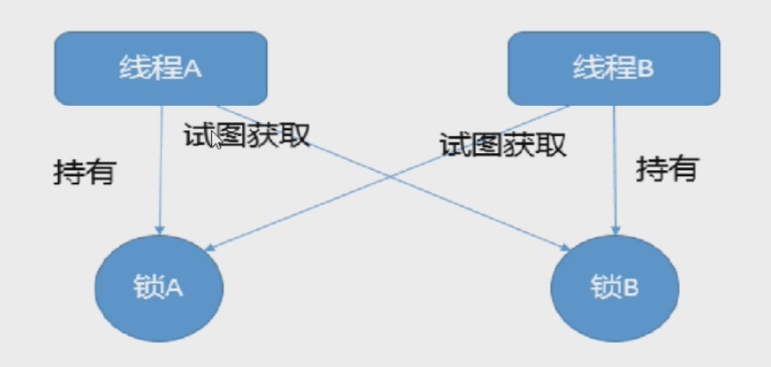

产生死锁的原因：
- 系统资源不足
- 进程运行推进的顺序不合适
- 资源分配不当

怎么证明死锁？

方法一：
1. 先通过jps -l查看 pid(进程号)

2. 通过jstack pid查看是否有死锁

  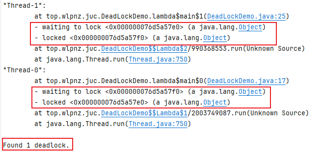

方法二：通过jconsole
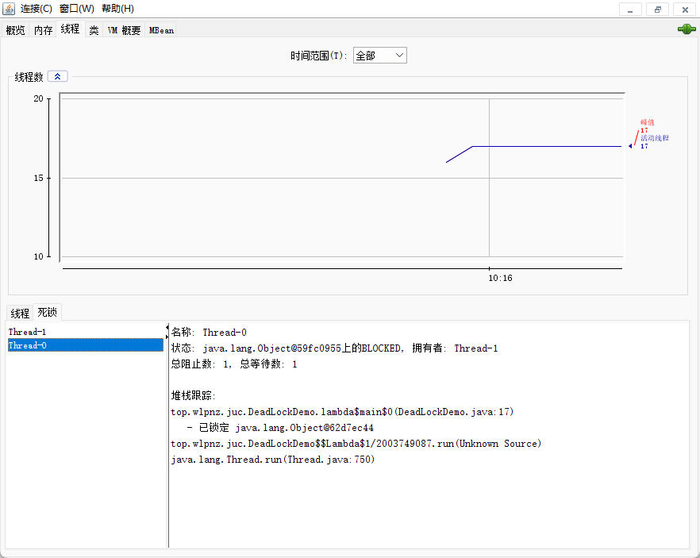


#### 锁升级

查看对象头情况：

先引入依赖，然后通过解析对象，打印对象头

```java
<dependency>
    <groupId>org.openjdk.jol</groupId>
    <artifactId>jol-core</artifactId>
    <version>0.9</version>
</dependency>
    
System.out.println(ClassLayout.parseInstance(obj).toPrintable());
```

synchronized锁：由对象头中的Mark Word根据锁标志位的不同而被复用及锁升级策略

jdk5之前，只有synchronized 这个操作系统级别的重量级锁，效率低下，因为监视器(monitor)是依赖底层的操作系统的Mutex Lock实现，挂起线程和恢复线程都需要转入内核态去完成，阻塞或唤醒一个Java线程需要操作系统切换CPU状态来完成，这种状态转换耗费处理器时间，如果同步代码块内容过于简单，切换的时间可能比任务执行的时间还要长

jdk6之后，为了提高效率，引入了偏向锁和轻量级锁 

**synchronized锁升级过程**

>  **无锁->偏向锁->轻量锁->重量锁**

无锁：

对象头情况：

```java
private static void unLock() {
    Object obj = new Object();
    System.out.println(obj.hashCode());
    System.out.println(Integer.toHexString(obj.hashCode()));

    System.out.println(ClassLayout.parseInstance(obj).toPrintable());
}

1956725890 // hash 
74a14482   // hash 16进制
java.lang.Object object internals:
 OFFSET  SIZE   TYPE DESCRIPTION                               VALUE
      0     4        (object header)                           01 82 44 a1 (00000001 10000010 01000100 10100001) (-1589345791)
      4     4        (object header)                           74 00 00 00 (01110100 00000000 00000000 00000000) (116)
      8     4        (object header)                           e5 01 00 f8 (11100101 00000001 00000000 11111000) (-134217243)
     12     4        (loss due to the next object alignment)
Instance size: 16 bytes
Space losses: 0 bytes internal + 4 bytes external = 4 bytes total
```

根据图，要倒着看上面的输出


**偏向锁**：当一段代码一直被一个线程多次访问，由于只有一个线程，那么该线程在后续访问时，便会自动获得锁

在没有其他线程竞争的情况下，一直偏向当前线程，当前线程可以一直执行

偏向锁只有遇到其他线程尝试竞争偏向锁时，持有偏向锁的线程才会释放锁，**线程是不会主动释放偏向锁的**。

可以通过命令`java -XX:+PrintFlagsInitial | grep BiasedLock*` 查看是否开启了偏向锁（`UseBiasedLocking`是否为true）

```shell
$ java -XX:+PrintFlagsInitial | grep BiasedLock*
     intx BiasedLockingBulkRebiasThreshold          = 20                                  {product}
     intx BiasedLockingBulkRevokeThreshold          = 40                                  {product}
     intx BiasedLockingDecayTime                    = 25000                               {product}
     intx BiasedLockingStartupDelay                 = 4000                                {product}
     bool TraceBiasedLocking                        = false                               {product}
     bool UseBiasedLocking                          = true                                {product}
```

jdk1.6之后是默认开启偏向锁的，但是启动时间有延迟

可以添加参数 `-XX:BiasedLockingStartupDelay=0`，让其在程序启动时立刻启动

开启偏向锁：

```shell
-XX:+UseBiasedLocking -XX:BiasedLockingStartupDelay=0
```

关闭偏向锁，关闭之后会默认进入轻量级锁

```shell
-XX:-UseBiasedLocking
```

偏向锁持有的对象头情况：

```java
private static void biasedLock() {
    Object o = new Object();
    new Thread(() -> {
        synchronized (o) {
            System.out.println(ClassLayout.parseInstance(o).toPrintable());
        }
    }).start();
}

java.lang.Object object internals:
 OFFSET  SIZE   TYPE DESCRIPTION                               VALUE
      0     4        (object header)                           05 70 ad 70 (00000101 01110000 10101101 01110000) (1890414597)
      4     4        (object header)                           68 01 00 00 (01101000 00000001 00000000 00000000) (360)
      8     4        (object header)                           e5 01 00 f8 (11100101 00000001 00000000 11111000) (-134217243)
     12     4        (loss due to the next object alignment)
Instance size: 16 bytes
Space losses: 0 bytes internal + 4 bytes external = 4 bytes total
```

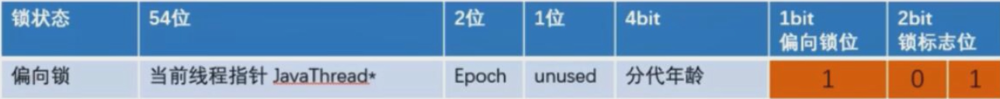

偏向锁的撤销：

当有另外线程逐步来竞争锁的时候，就不能再使用偏向锁了，要升级为轻量级锁

撤销的情况：

偏向锁使用一种等到竞争出现才释放锁的机制，只有当其他线程竞争锁时，持有偏向锁的原来线程才会被撤销。

撤销需要等待全局安全点（该时间点上没有字节码正在执行），同时检查持有偏向锁的线程是否还在执行：

- ①第一个线程正在执行synchronized方法（处于同步块），它还没有执行完，其它线程来抢夺，该偏向锁会被取消掉并出现**锁升级**。
  此时轻量级锁由原持有偏向锁的线程持有，继续执行其同步代码，而正在竞争的线程会进入**自旋**等待获得该轻量级锁。

- ②第一个线程执行完成synchronized方法（退出同步块），则将对象头设置成无锁状态并撤销偏向锁，重新偏向


**轻量级锁**：

轻量级锁是为了在线程**近乎交替**执行同步块时提高性能。

主要目的：在没有多线程竞争的前提下，通过CAS减少重量级锁使用操作系统互斥量产生的性能消耗，说白了先自旋再阻塞。

升级时机：当关闭偏向锁功能 或 多线程竞争偏向锁会导致偏向锁升级为轻量级锁

线程B竞争锁的操作中有两种情况：

如果锁获取成功，直接替换Mark Word中的线程ID为自己的ID,此时线程B成功获取偏向锁，然后执行同步代码。

如果锁获取失败，则偏向锁升级为轻量级锁，此时轻量级锁由原持锁的线程A持有，继续执行其同步代码，而线程B会进入自选等待获取该轻量级锁

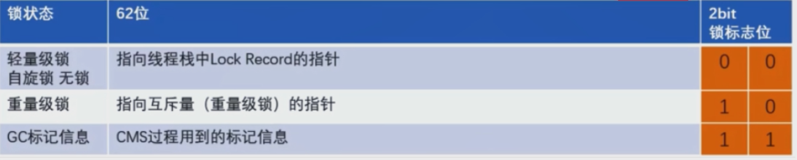

代码打印对象头信息：

```java
//打印代码同上，主要是关闭偏向锁，让线程直接获取轻量级锁
// 关闭偏向锁 -XX:-UseBiasedLocking
java.lang.Object object internals:
 OFFSET  SIZE   TYPE DESCRIPTION                               VALUE
      0     4        (object header)                           90 f0 6f dc (10010000 11110000 01101111 11011100) (-596643696)
      4     4        (object header)                           37 00 00 00 (00110111 00000000 00000000 00000000) (55)
      8     4        (object header)                           e5 01 00 f8 (11100101 00000001 00000000 11111000) (-134217243)
     12     4        (loss due to the next object alignment)
Instance size: 16 bytes
Space losses: 0 bytes internal + 4 bytes external = 4 bytes total
```


**重量级锁**

轻量级锁的情况下，如果线程超过某些条件，会升级成重量级锁

jdk1.6之前

默认启用，默认情况下自旋的次数是10次 参数设置：`-XXPreBlockSpin=10`

或者自旋线程数超过cpu核数的一半


jdk1.6之后

自旋次数自适应变化，只要是竞争线程的次数超过这个次数，轻量级锁就会升级成重量级锁

自旋次数根据 同一个线程上一次自旋的时间 以及 拥有锁线程的状态来决定


代码打印对象头：

```java
// 打印代码同上，多个线程参与竞争

java.lang.Object object internals:
 OFFSET  SIZE   TYPE DESCRIPTION                               VALUE
      0     4        (object header)                           8a 5b 5d ce (10001010 01011011 01011101 11001110) (-832742518)
      4     4        (object header)                           97 01 00 00 (10010111 00000001 00000000 00000000) (407)
      8     4        (object header)                           e5 01 00 f8 (11100101 00000001 00000000 11111000) (-134217243)
     12     4        (loss due to the next object alignment)
Instance size: 16 bytes
Space losses: 0 bytes internal + 4 bytes external = 4 bytes total
```

各种锁的优缺点：

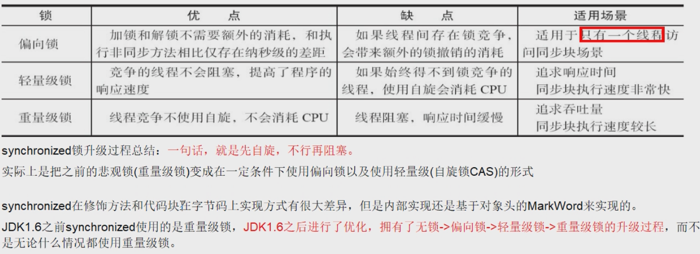

### 线程中断与LockSupport

#### 线程中断
**什么是中断？**

**首先**，一个线程不应该由其他线程来强制中断或停止，而是应该由线程自己自行停止。 
所以，Thread.stop,Thread.suspend,Thread.resume都已经被废弃了。

**其次**， 在Java中没有办法立即停止一条线程，然而停止线程却显得尤为重要，如取消一个耗时操作。
因此，Java提供了一种用于停止线程的机制一一中断。

中断只是一种协作机制，Java没有给中断增加任何语法，中断的过程完全需要程序员自己实现。
若要中断一个线程，你需要手动调用该线程的**interrupt**方法，该方法也仅仅是将线程对象的**中断标识**设成**true**;
接着你需要自己写代码不断地检测当前线程的标识位，如果为true,表示别的线程要求这条线程中断，
此时究竞该做什么需要你自己写代码实现。

每个线程对象中都有一个标识，用于表示线程是否被中断；该标识位为true表示中断，为false表示未中断；

通过调用线程对象的interrupt方法将该线程的标识位设为true:可以在别的线程中调用，也可以在自己的线程中调用。

java线程中断api：
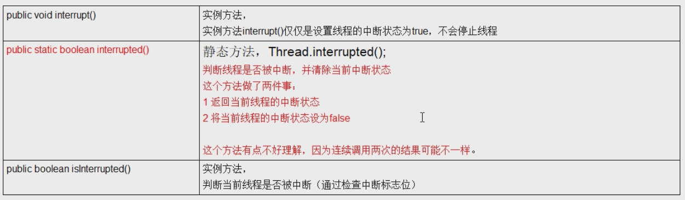

interrupt()方法，只会将中断标设为true，不会将线程立即停止

线程的中断需要协同配合

在使用sleep、join方法时，如果调用interrupt方法，则抛出InterruptedException异常，并将中断标志设为false

#### LockSupport
LockSupport是用来创建锁和其他同步类的基本线程阻塞原语

LockSupport类使用了一种名为Permit(许可)的概念来做到阻塞和唤醒线程的功能，每个线程都有一个许可(permit)), permit只有两个值1和零，默认是零。

可以把许可看成是一种(0,1)信号量(Semaphore),但与Semaphore不同的是，许可的累加上限是1。

阻塞API：**park()/park(Object blocker)**
阻塞当前线程/阻塞传入的具体线程

唤醒API：**unpark(Thread thread)**
唤醒处于阻塞状态的指定线程

```java
private static void parkAndUnpark() {
    Thread t1 = new Thread(() ->{
        try {TimeUnit.SECONDS.sleep(3);} catch (InterruptedException e) {throw new RuntimeException(e);}
        System.out.println(Thread.currentThread().getName() + " wait");
        LockSupport.park(); // 阻塞
        System.out.println(Thread.currentThread().getName() + " awake");
    }, "t1");
    t1.start();
    try {TimeUnit.SECONDS.sleep(1);} catch (InterruptedException e) {throw new RuntimeException(e);}
    new Thread(()->{
        System.out.println(Thread.currentThread().getName() + " awake t1");
        LockSupport.unpark(t1);
    },"t2").start();
}
/**
 * park与unpark顺序不强烈要求，但是，一个线程对另一个线程只能unpark一次，因为Permit上限是1
 * 输出结果：
 * t2 awake t1
 * t1 wait
 * t1 awake
 */
```

**等待唤醒机制**

三种让线程等待和唤醒的方法
- 使用Object中的wait()方法让线程等待，使用Object中的notify()方法唤醒线程
  - wait和notify必须在同步方法或同步代码块中，且成对出现使用
  - 先wait后notify，顺序不能乱
- 使用JUC包中的Condition的await()方法让线程等待，使用signal()方法唤醒线程
  - await和signal在使用前需要获取锁
  - 先await后signal，顺序不能乱
- LockSupport类可以阻塞当前线程以及唤醒指定被阻塞的线程

### Java内存模型

CPU的运行并不是直接操作内存，而是把内存中的数据读取缓存，而内存的读写有时候就会造成不一致的问题

Java虚拟机规范中试图定义一种Java内存模型（Java Memory Model，简称JMM）来屏蔽掉各种硬件和操作系统的内存访问差异，以实现让Java程序在各种平台下达到一致的访问效果。

JMM(Java内存模型Java Memory Model,简称JMM)本身是一种抽象的概念并不真实存在它仅仅描述的是一组约定或规范，通过这组规范定义了程序中（尤其是多线程）各个变量的读写访问方式并决定一个线程对共享变量的写入何时以及如何变成对另一个线程可见，关键技术点都是围绕多线程的**原子性**、**可见性**和**有序性**展开的。

原则：**JMM的关键技术点都是围绕多线程的原子性、可见性和有序性展开的**

能干嘛？

1. 通过JMM来实现线程和主内存之间的抽象关系。

2. 屏蔽各个硬件平台和操作系统的内存访问差异以实现让Java程序在各种平台下都能达到一致的内存访问效果。

总结：

- 我们定义的所有共享变量都储存在**物理主内存**中
- 每个线程都有自己独立的工作内存，里面保存该线程使用到的变量的副本（主内存中该变量的一份拷贝）
- 线程对共享变量所有的操作都必须先在自己的工作内存中进行，然后写回主内存，不能直接从主内存中读写（不能越级）
- 不同线程之间也无法直接访问其他线程的工作内存中的变量，线程间变量值的传递需要通过主内存来进行（同级不能相互访问）

#### 多线程先行发生原则之happens-before

说明：

如果Java内存模型中所有的有序性都紧靠volatile和synchronized来完成，程序就会很繁琐，但是我们在写java并发代码的时候并没有察觉到这一点

我们不需要总是添加volatile和synchronized来完成程序，是因为java语言中JMM原则下有一个“先行发生”（Happens-before）的原则限制

它是判断数据是否存在竞争，线程是否安全的非常有用的手段。依赖这个原则，我们可以通过几条简单规则一揽子解决并发环境下两个操
作之间是否可能存在冲突的所有问题，而不需要陷入Java内存模型苦涩难懂的底层编译原理之中。

总原则：

- 如果一个操作happens-before另一个操作，那么第个操作的执行结果将对第二个操作可见，而且第一个操作的执行顺序排在第二个操作之前。
- 两个操作之间存在happens-before关系，并不意味着一定要按照happens-before原则制定的顺序来执行。如果重排序之后的执行结果与按照happens-before关系来执行的结果一致，那么这种重排序并不非法。 

八种规则：

- 次序规则：一个线程内，按照代码顺序，写在前面的操作先行发生于写在后面的操作
- 锁定规则：一个unLock操作先行发生于后面（这里的“后面”是指时间上的先后）对同一个锁的lock操作
- volatile变量规则：对一个`volatile`变量的写操作先行发生于后续对同一`volatile`变量的读操作。
- 传递规则：如果操作A先行发生于操作B，而操作B先行发生于操作C，则操作A先行发生于操作C。
- 线程启动规则：在一个线程中，对另一个线程的启动操作（通过`Thread.start()`），会先行发生于该线程中的所有操作。
- 线程中断规则：对线程`interrupt()`方法的调用先行发生于被中断线程检测到中断事件（即`Thread.interrupted()`或`isInterrupted()`返回`true`）。
- 线程终止规则：一个线程的所有操作都先行发生于此线程的终止检测。即一个线程结束之后，另一个线程调用该线程的`join`方法并成功返回时，可以看到该线程中的所有操作。
- 对象构造规则：对象的构造完成先行发生于该对象的引用被发布。这意味着对象的构造过程中的操作对其他线程是可见的。

### volatile

volatile修饰的变量有两个特点：可见性&有序性

当写一个volatile变量时，JMM会把该线程对应的本地内存中的共享变量值立即刷新回主内存中。

当读一个volatile变量时，JMM会把该线程对应的本地内存设置为无效，直接从主内存中读取共享变量

所以volatile的写内存语义是直接刷新到主内存中，读的内存语义是直接从主内存中读取。

#### 内存屏障

四类屏障分别是什么

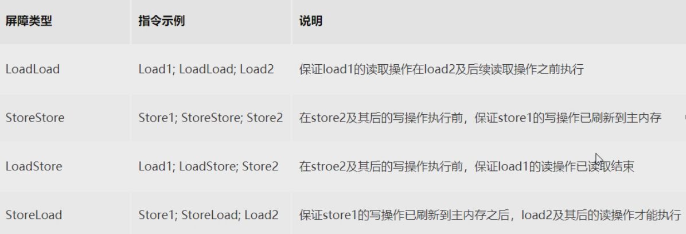

happens-before 之 volatile变量规则 

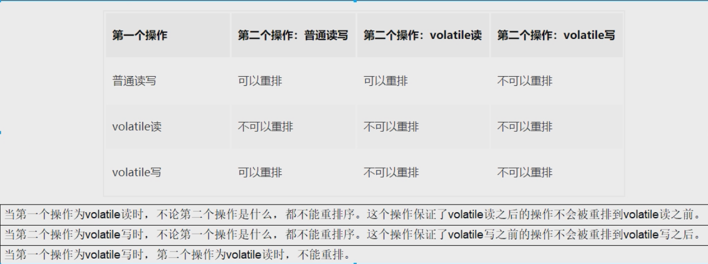

JMM将内存屏障策略分为四种

写：

- 在每个volatile写操作的前面插入一个StoreStore屏障
- 在每个volatile写操作的后面插入一个StoreLoad屏障

读：

- 在每个volatile读操作的后面插入一个LoadLoad屏障
- 在每个volatile读操作的后面插入一个LoadStore屏障

#### 两大特性

**可见性**

保证不同线程对这个变量进行操作时的可见性，即变量一旦改变，所有线程都能看到

volatile变量的读写过程


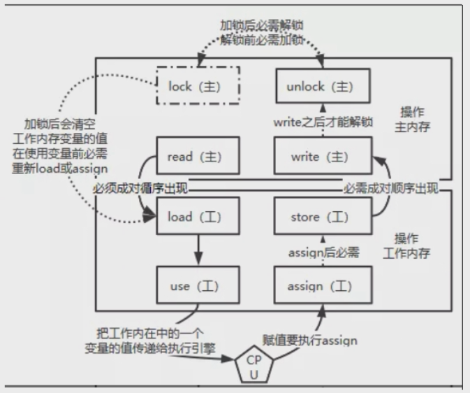 

read:作用于主内存，将变量的值从主内存传输到工作内存，主内存到工作内存

load:作用于工作内存，将read从主内存传输的变量值放入工作内存变量副本中，即数据加载

use:作用于工作内存，将工作内存变量副本的值传递给执行引擎，每当JVM遇到需要该变量的字节码指令时会执行该操作

assign:作用于工作内存，将从执行引擎接收到的值赋值给工作内存变量，每当JVM遇到一个给变量赋值字节码指令时会执行该操作

store:作用于工作内存，将赋值完毕的工作变量的值写回给主内存

write:作用于主内存，将store传输过来的变量值赋值给主内存中的变量

由于上述只能保证单条指令的原子性，针对多条指令的组合性原子保证，没有大面积加锁，所以，JVM提供了另外两个原子指令：

lock:作用于主内存，将一个变量标记为一个线程独占的状态，只是写时候加锁，就只是锁了写变量的过程。

unlock:作用于主内存，把一个处于锁定状态的变量释放，然后才能被其他线程占用

**有序性**

禁止指令重排

指令重排序：是指编译器和处理器为了优化程序性能而对指令序列进行重新排序的一种手段，有时候会改变程序语句的先后顺序

不存在数据依赖关系，可以重排序；存在数据依赖关系，禁止重排序

数据依赖性：若两个操作访问一个变量，且这两个操作中有一个为写操作，此时两个操作间就存在数据依赖性

**volatile**通过插入内存屏障保证指令禁止重排：

- 在每个volatile写操作的前面插入一个StoreStore屏障
- 在每个volatile写操作的后面插入一个StoreLoad屏障

- 在每个volatile读操作的后面插入一个LoadLoad屏障
- 在每个volatile读操作的后面插入一个LoadStore屏障

#### 怎么使用volatile

- 单一赋值可以，but含复合运算赋值不可以(++之类)
- 状态标志，判断业务是否结束
- 开销较低的读，写锁策略
- DCL双端锁的发布

通过volatile + synchronized 双端检索的方式实现单例

通过私有静态内部类实现单例

```java
public class SingletonDemo{
    private SingletonDemo(){}
    private static class SingletonDemoHandler{
        private static SingletonDemo instance = new SingletonDemo();
    }
    public static SingletonDemo getInstance(){
        return SingletonDemoHandler.instance;
    }
}
```

### CAS与Unsafe

#### CAS

compare and swap的缩写，中文翻译成比较并交换，实现并发算法时常用到的一种技术。

它包含三个操作数一一内存位置、预期原值及更新值。

执行CAS操作的时候，将内存位置的值与预期原值比较：

- 如果相匹配，那么处理器会自动将该位置值更新为新值
- 如果不匹配，处理器不做任何操作，多个线程同时执行CAS操作只有一个会成功。

CAS有3个操作数，位置内存值V,旧的预期值A,要修改的更新值B。

当且仅当旧的预期值A和内存值V相同时，将内存值V修改为B,否则什么都不做或重来

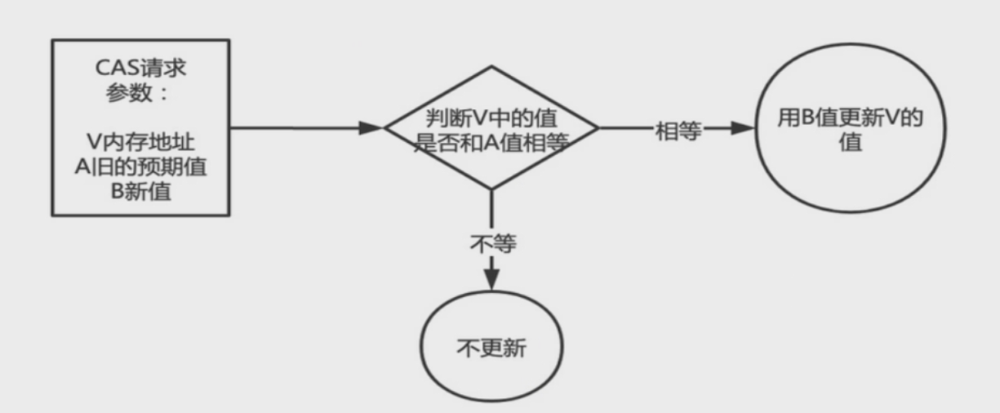

CAS的硬件级别保证：

CAS是一条CPU的原子指令(cmpxchg指令)，不会造成所谓的数据不一致问题，Unsafe提供的CAS方法(如compareAndSwapXXX)底层实现即为CPU指令cmpxchg。

执行cmpxchg指令的时候，会判断当前系统是否为多核系统，如果是就给总线加锁，只有一个线程会对总线加锁成功，加锁成功之后会执行cas操作，也就是说CAS的原子性实际上是CPU实现的，其实在这一点上还是有排他锁的，只是比起用synchronized,这里的排他时间要短的多，所以在多线程情况下性能会比较好

#### Unsafe

是CAS的核心类，由于Java方法无法直接访问底层系统，需要通过本地(native)方法来访问，Unsafe相当于一个后门，基于该类可以直接操作特定内存的数据。Unsafe类存在于sun.misc包中，其内部方法操作可以像C的指针一样直接操作内存，因为Java中CAS操作的执行依赖于Unsafe类的方法。

注意Unsafe类中的所直方法都是native修饰的，也就是说泡Unsafe类中的法都直接调用操作系统底层资源执行相应任务


CAS与Unsafe的应用

```java
class AtomicInteger{
    //...
    public final int getAndIncrement() {
        return unsafe.getAndAddInt(this, valueOffset, 1);
    }
    //...
}

class Unsafe{
    //...
    public final int getAndAddInt(Object var1, long var2, int var4) {
        int var5;
        do {
            // 重新获取值， 也就是预期值
            var5 = this.getIntVolatile(var1, var2);
           // 更新成功才退出循环
        } while(!this.compareAndSwapInt(var1, var2, var5, var5 + var4));

        return var5;
    }
    //...
}
```

CAS会导致“ABA问题”。

CAS算法实现一个重要前提需要取出内存中某时刻的数据并在当下时刻比较并替换，那么在这个时间差类会导致数据的变化。

比如说一个线程one从内存位置V中取出A,这时候另一个线程two也从内存中取出A,并且线程two进行了一些操作将值变成了B,

然后线程two又将V位置的数据变成A,这时候线程one进行CAS操作发现内存中仍然是A,然后线程one操作成功。

尽管线程one的CAS操作成功，但是不代表这个过程就是没有问题的。

解决“ABA问题”

仍然使用CAS机制，但是比较值是通过版本号
使用的类：AtomicStampeReference类

### 原子类

- AtomicBoolean

- AtomicInteger
- AtomicIntegerArray
- AtomicIntegerFieldUpdater
- AtomicLong
- AtomicLongArray
- AtomicLongFieldUpdater
- AtomicMarkableReference -- 修改标识 mark true/false
- AtomicReference
- AtomicReferenceArray
- AtomicReferenceFieldUpdater
- AtomicStampedReference -- 修改标识  stamp  
- DoubleAccumulator
- DoubleAdder
- LongAccumulator
- LongAdder

**CountDownLatch** 用来计算线程是否结束，通过await()阻塞主线程，其他线程结束时通过countDown()表示线程完成

**对象属性修改原子类**：

AtomicIntegerFieldUpdater： 原子更新对象中int类型字段的值

AtomicLongFieldUpdater： 原子更新对象中Long类型字段的值

AtomicReferenceFieldUpdater：原子更新引用类型字段的值

使用目的：以一种线程安全的方式操作非线程安全对象内的某些字段

使用要求：

- 更新的对象属性必须使用public volatile修饰符。
- 因为对象的属性修改类型原子类都是抽象类，所以每次使用都必须使用静态方法newUpdater()创建一个更新器，并且需要设置想要更新的类和属性。

示例：

```java
public class AtomicIntegerFieldUpdaterDemo {
    public static void main(String[] args) {
        BankAccount account = new BankAccount();
        for (int i = 0; i < 1000; i++) {
            new Thread(() -> {
                 account.transfer(account);
            }, String.valueOf(i)).start();
        }
        try {TimeUnit.SECONDS.sleep(1);} catch (InterruptedException e) {throw new RuntimeException(e);}
        System.out.println(account.money); //1000
    }
}

class BankAccount{
    String bankName = "ccb";

    // 更新的对象属性必须使用public volatile修饰
    public volatile int money = 0;

    // 因为对象属性修改类型原子类都是抽象类，所以每次使用都必须使用静态方法newUpdater()创建一个更新器，并且设置想要更新的类和属性
    AtomicIntegerFieldUpdater fieldUpdater = AtomicIntegerFieldUpdater.newUpdater(BankAccount.class, "money");

    public void transfer(BankAccount account) {
        fieldUpdater.incrementAndGet(account);
    }
}
```

LongAccumulator ： 提供了自定义函数的函数操作

LongAdder : 只能用来计算加法，性能最好

```java
LongAdder longAdder = new LongAdder();
longAdder.increment();
longAdder.increment();
longAdder.increment();
System.out.println(longAdder.sum());
// left 是类的value值（初始值或者是上次Operator方法执行的结果值），right是accumulate传入的参数
LongAccumulator longAccumulator = new LongAccumulator((left, right) -> left + right, 0);
longAccumulator.accumulate(1);
longAccumulator.accumulate(2);
longAccumulator.accumulate(3);
System.out.println(longAccumulator.get());
```

**LongAdder为什么快？**

`LongAdder`的基本思路就是**分散热点**，将value值分散到一个Cell数组中，不同线程会命中到数组的不同槽中，各个线程只对自己槽中的那个值进行CAS操作，这样热点就被分散了，冲突的概率就小很多。如果要获取真正的long值，只要将各个槽中的变量值累加返回。
sum()会将所有Cell数组中的value和base累加作为返回值，核心的思想就是将之前`AtomicLong`一个value的更新压力分散到多个value中去，从而降级更新热点。

小总结：`LongAdder`在无竞争的情况，跟`AtomicLong`一样，对同一个base进行操作，当出现**竞争关系**时则是采用化整为零的做法，从空间换时间，用一个**数组cells**,将一个value拆分进这个数组cells。多个线程需要同时对value进行操作时候，可以对线程id进行hash得到hash值，再根据hash值映射到这个数组cells的某个下标，再对该下标所对应的值进行自增操作。当所有线程操作完毕，将数组cells的所有值和无竞争值base都加起来作为最终结果。

源码分析：[尚硅谷视频教程](https://www.bilibili.com/video/BV1ar4y1x727?spm_id_from=333.788.videopod.episodes&vd_source=b65df187291916e801dd2d3d831fb71e&p=91)

```java
public void add(long x) {
    // as是striped64中的cells数组属性
    // b是striped64中的base属件
    // v是当前线hash到的cell中存储的值
    // m是cells的长度减1，hash时作为掩码使用
    // a是当前线指hash到的cell
    Cell[] as; long b, v; int m; Cell a;
    //首次首线程((as= cells)!= null)一定是false，此时走casBase方法，以CAS的方式更新base值，且只有当cas失败时，才会走到if中
    // 条件1:cells不为空，说明出现过竞争，cell[]已创建
    //条件2:cas操作base失败，说明其它线程先一步修改了base正在出现竞争
    if ((as = cells) != null || !casBase(b = base, b + x)) {
        // true无竞争false表示竞争激烈，多个线程hash到同一个cell，可能要扩容
        boolean uncontended = true;
        // 条件1:cells为空，说明正在出现竞争，上面是从条件2过来的
		// 条件2:应该不会出现
		// 条件3:当前线程所在的cell为空，说明当前线程还没有更新过cell，应初始化一个cell
        // 条件4:更新当前线程所在的cell失败，说明现在竞争很激烈，多个线程hash到了同一个cell，应扩容
        if (as == null || (m = as.length - 1) < 0 ||
            // getProbe()方法返回的是线程中的threadLocalRandomProbe字段
			// 它是通过随机数生成的一个值，对于一个确定的线程这个值是固定的(除非刻意修改它)
            (a = as[getProbe() & m]) == null || !(uncontended = a.cas(v = a.value, v + x)))
            longAccumulate(x, null, uncontended);  // 调用striped64中的方法处理
    }
}

// TODO

```

### ThreadLocal

**介绍**

ThreadLocal提供线程局部变量。这些变量与正常的变量不同，因为每一个线程在访问ThreadLocal实例的时候（通过其get或set方法）都有**自己的、独立初始化的变量副本**。ThreadLocal实例通常是类中的私有静态字段，使用它的目的是希望将状态（例如，用户ID或事务ID)与线程关联起来

**Thread、ThreadLocal、ThreadLocalMap的关系？**

Thread类有ThreadLocal.ThreadLocalMap的属性

ThreadLocal类里有ThreadLocalMap的静态内部类

ThreadLocalMap里面有Entry，Entry的key就是ThreadLocal 

且Entry继承WeakReference（弱引用）

当我们为threadLocal变量赋值，实际上是以当前threadLocal实例为key，值为value的Entry往threadLocalMap中存放

**ThreadLocal如何防止内存泄漏的？**

当我们往ThreadLocal中存值时，其实是把key为ThreadLocal对象的Entry往ThreadLocalMap中存，这个Entry的key还是个弱引用。当线程结束后，虚拟机栈里面的ThreadLocal强引用就释放了，此时ThreadLocal对象上只有一条弱引用，在GC回收时，ThreadLocal对象就会被回收。ThreadLocal对象回收后，会出现key为null的Entry，这时候它的value就访问不到了。如果线程结束了，那value上不存在一条强引用链，因此也会被回收；如果线程不会结束，例如使用线程池，value就不会被回收，所以在不使用ThreadLocal时，要记得调用remove方法。


**为什么Entry要使用弱引用？**

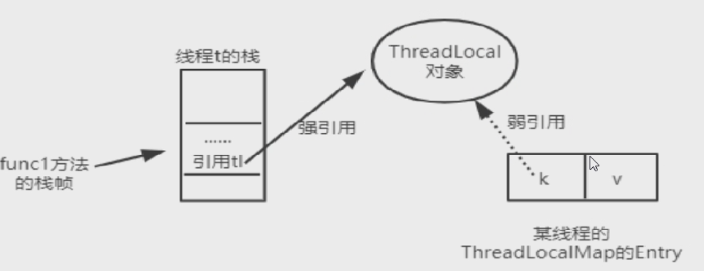

如上图，当线程中的ThreadLocal强引用对象可以被GC回收的时候，如果Entry的key是**强引用**，就会导致key指向的ThreadLocal对象以及value指向的对象不能被GC回收，造成内存泄漏；如果Entry的key是**弱引用**，就可以大概率减少内存泄漏的问题（会有key为null的问题），使用弱引用，就可以使ThreadLocal对象在方法执行完毕后顺利被回收，且Entry的key引用指向为null。

**key为null的问题？**

系统GC时，Entry的key也就是ThreadLocal对象会被回收，这时候在ThreadLocalMap中会出现Entry的key为null，并且没法访问key为null的Entry的value，如果线程长时间不结束，key为null的Entry的value就不会被回收，时间久了就会造成内存泄漏。

在线程池中，核心线程就不会结束。因此在线程池中使用ThreadLocal要格外注意内存泄漏的问题，在不适用ThreadLocal的时候，要手动remove方法来删除它

#### 引用类型

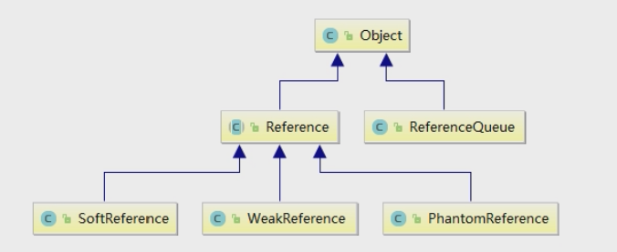

Reference：强引用

SoftReference：软引用

WeakReference：弱引用

PhantomReference：虚引用

Java技术允许使用finalize()方法在垃圾回收器将对象从内存中清除出去之前必要的清理工作

**强引用**

```java
MyObject myObj = new MyObject(); // 默认使用强引用
// 当对象是强引用的状态时，不管内存是否够用，在GC回收时只要还有引用指向引用对象，GC就不能回收强引用对象
```

**软引用**

两个特点：内存够用，不回收；内存不够，才回收

**弱引用**

当遇到GC回收时，就会被回收

**虚引用**

顾名思义，就是形同虚设，与其他几种引用都不同，虚引用并不会决定对象的生命周期。

如果一个对象仅持有虚引用，那么它就和没有任何引用一样，在任何时候都可能被垃圾回收器回收，它不能单独使用也不能通过它访问对象，虚引用必须和引用队列(ReferenceQueue)联合使用。

虚引用的主要作用是跟踪对象被垃圾回收的状态。仅仅是提供了一种确保对象被finalize以后，做某些事情的机制。

PhantomReference的get方法总是返回null,因此无法访问对应的引用对象。

其意义在于：说明一个对象已经进入finalization阶段，可以被gc回收，用来实现比finalization机制更灵活的回收操作。

换句话说，设置虚引用关联的唯一目的，就是在这个对象被收集器回收的时候收到一个系统通知或者后续添加进一步的处理。

 虚引用必定被GC回收，在回收前会触发finalize()方法，且进入ReferenceQueue队列

### AQS

**介绍**

`AbstractQueuedSynchronizer`（抽象的队列同步器）是用来构建锁或者其它同步器组件的**重量级基础框架及整个JUC体系的基石**，通过内置的**FIFO队列**来完成资源获取线程的排队工作，并通过一个int类变量表示持有锁的状态

加锁就会阻塞，有阻塞就需要排队，实现排队必然需要队列


AQS使用一个volatile的int类型的成员变量state来表示同步状态，通过内置的FIFO队列来完成资源获取的排队工作，将每条要去抢占资源的线程封装成一个Node节点来实现锁的分配，通过CAS完成对State值的修改。

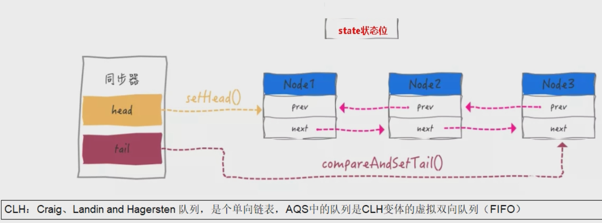

### 线程池

