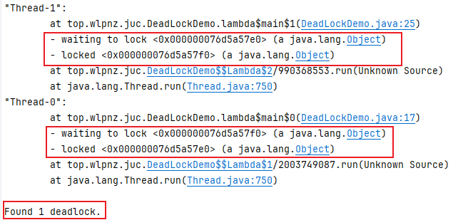
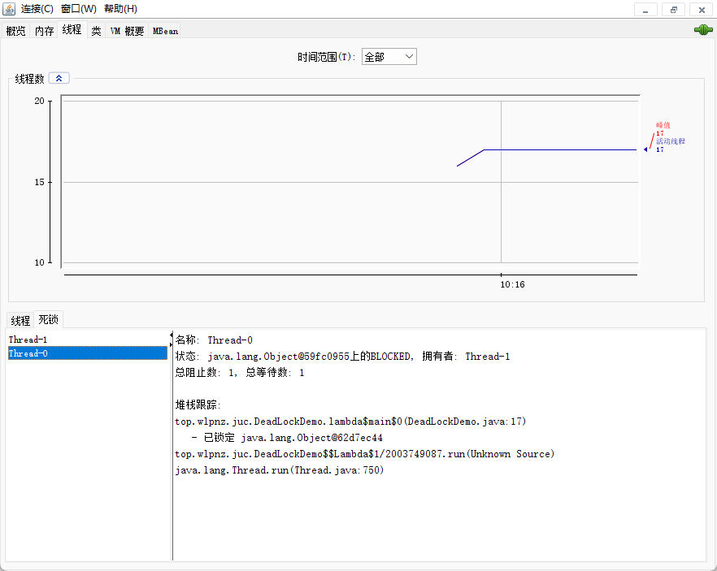
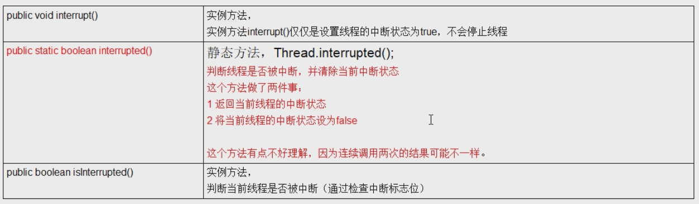
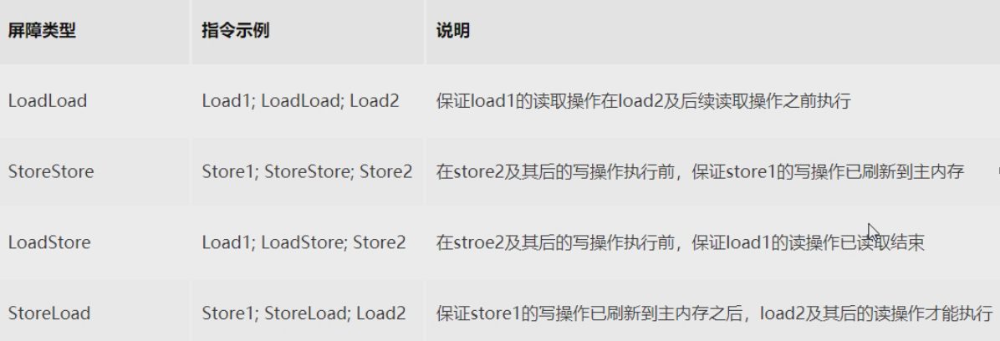
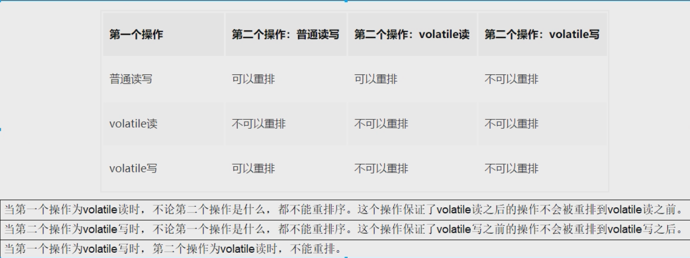
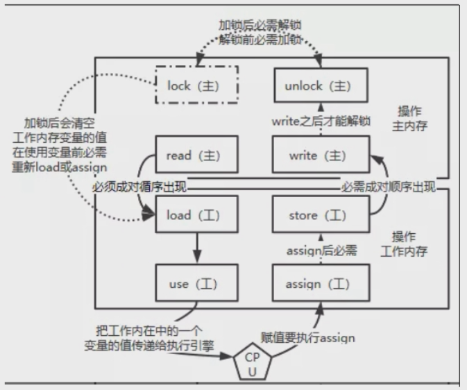

# JUC并发编程

### 相关概念

> 进程
>
> 是程序的一次执行，是系统进行资源分配和调度的独立单位，每个进程都有它自己的内存空间和系统资源

> 线程
>
> 在同一进程内又可以执行多个任务，这样的任务可以看做是线程
>
> 一个进程会有1个或多个线程

> 管程
>
> Monitor（监视器），也就是平时说的锁

> Java线程分为用户线程和守护线程
>
> 线程`daemon`属性为true表示是守护线程，false表示是用户线程
>
> 守护线程
>
> 是一种特殊的线程，在后台默默地完成一些系统性的服务，比如垃圾回收线程
>
> 用户线程
>
> 是系统的工作线程，会完成这个程序需要完成的业务操作

### CompletableFuture

> Future接口和Callable接口
>
> Future接口定义了操作异步任务执行一些方法，如获取异步任务的执行结果，取消任务的执行，判断任务是否完毕等。
>
> Callable接口中定义了需要有返回的任务需要实现的方法

#### **FutureTask的缺点**

get() 阻塞，一旦调用get()方法，不管是否计算完成都会导致阻塞

isDone()轮询，轮询的方式会耗费无谓的CPU资源，而且不见得能及时得到计算结果；

如果想要异步获取结果，通常都会以轮询的方式去获取结果，尽量不要阻塞。

#### **CompleableFuture**

- 在Java8中，CompletableFuture提供了非常强大的Future的扩展功能，可以简化异步编程的复杂性，并提供了函数式编程的能力，可以通过回调处理计算结果，也提供了转换和组合CompletableFuture的方法。

- 它可能代表一个明确完成的Future，也有可能代表一个完成阶段（CompletionStage），它支持在计算完成以后触发一些函数或执行某些动作。

- 类结构：`public class CompletableFuture<T> implements Future<T>, CompletionStage<T> `

CompletionStage代表异步计算过程中的某一阶段，一个阶段完成以后可能会触发另外一个阶段（有点类似Linux中的管道符）

一个阶段的执行可能是被单个阶段的完成触发，也可能是由多个阶段一起触发

#### CompletableFuture常用API

**创建异步对象**

```java
public static CompletableFuture<Void> runAsync(Runnable runnable)
public static CompletableFuture<Void> runAsync(Runnable runnable, Executor executor)
public static <U> CompletableFuture<U> supplyAsync(Supplier<U> supplier)
public static <U> CompletableFuture<U> supplyAsync(Supplier<U> supplier, Executor executor)
```

1、runXxxx都是没有返回结果的，supplyXxx都是可以获取返回结果的

2、可以传入自定义的线程池，否则就用默认的线程池；

**计算完成时回调方法**

```java
public CompletableFuture<T> whenComplete(BiConsumer<? super T, ? super Throwable> action)
public CompletableFuture<T> whenCompleteAsync(BiConsumer<? super T, ? super Throwable> action)    
public CompletableFuture<T> whenCompleteAsync(BiConsumer<? super T, ? super Throwable> action, Executor executor)    

public CompletableFuture<T> exceptionally(Function<Throwable, ? extends T> fn)
```

whenComplete可以感知正常和异常的计算结果，但是没有返回值；exceptionally处理异常情况，并且有返回值。

whenComplete和whenCompleteAsync的区别： 

- whenComplete：是执行当前任务的线程执行继续执行whenComplete的任务。 
- whenCompleteAsync：是执行把whenCompleteAsync这个任务继续提交给线程池来进行执行。

方法不以Async结尾，意味着Action使用相同的线程执行，而Async可能会使用其他线程执行（如果是使用相同的线程池，也可能会被同一个线程选中执行）

**handle 方法**

```java
public <U> CompletableFuture<U> handle(BiFunction<? super T, Throwable, ? extends U> fn) 
public <U> CompletableFuture<U> handleAsync(BiFunction<? super T, Throwable, ? extends U> fn)
public <U> CompletableFuture<U> handleAsync(BiFunction<? super T, Throwable, ? extends U> fn, Executor executor)

```

和complete 一样，可对结果做最后的处理（可处理异常），可改变返回值。


**线程串行化方法**

```java
public <U> CompletableFuture<U> thenApply(Function<? super T,? extends U> fn)
public <U> CompletableFuture<U> thenApplyAsync(Function<? super T,? extends U> fn)
public <U> CompletableFuture<U> thenApplyAsync(Function<? super T,? extends U> fn, Executor executor)
    
public CompletableFuture<Void> thenAccept(Consumer<? super T> action)
public CompletableFuture<Void> thenAcceptAsync(Consumer<? super T> action)
public CompletableFuture<Void> thenAcceptAsync(Consumer<? super T> action, Executor executor)

public CompletableFuture<Void> thenRun(Runnable action)
public CompletableFuture<Void> thenRunAsync(Runnable action)
public CompletableFuture<Void> thenRunAsync(Runnable action, Executor executor)
```

thenApply 方法：当一个线程依赖另一个线程时，获取上一个任务返回的结果，并返回当前任务的返回值。 

thenAccept 方法：消费处理结果。接收任务的处理结果，并消费处理，无返回结果。 

thenRun 方法：只要上面的任务执行完成，就开始执行thenRun，只是处理完任务后，执行thenRun 的后续操作 

带有Async 默认是异步执行的。

同之前。 以上都要前置任务成功完成。 

Function 

- T：上一个任务返回结果的类型
- U：当前任务的返回值类型

**两任务组合- 都要完成**

```java
public <U,V> CompletableFuture<V> thenCombine(CompletionStage<? extends U> other,BiFunction<? super T,? super U,? extends V> fn)
public <U,V> CompletableFuture<V> thenCombineAsync(CompletionStage<? extends U> other,BiFunction<? super T,? super U,? extends V> fn)
public <U,V> CompletableFuture<V> thenCombineAsync(CompletionStage<? extends U> other,BiFunction<? super T,? super U,? extends V> fn, Executor executor)

public <U> CompletableFuture<Void> thenAcceptBoth(CompletionStage<? extends U> other,BiConsumer<? super T, ? super U> action)
public <U> CompletableFuture<Void> thenAcceptBothAsync(CompletionStage<? extends U> other,BiConsumer<? super T, ? super U> action)
public <U> CompletableFuture<Void> thenAcceptBothAsync(CompletionStage<? extends U> other,BiConsumer<? super T, ? super U> action, Executor executor)


public CompletableFuture<Void> runAfterBoth(CompletionStage<?> other,Runnable action)
public CompletableFuture<Void> runAfterBothAsync(CompletionStage<?> other,Runnable action)
public CompletableFuture<Void> runAfterBothAsync(CompletionStage<?> other,Runnable action,Executor executor)
```

两任务都要完成，才触发该任务

thenCombine：组合两个 future，获取两个 future 的返回结果，并返回当前任务的返回值

thenAcceptBoth：组合两个 future，获取两个 future 任务的返回结果，然后处理任务，没有返回值。

runAfterBoth：组合两个 future，不需要获取 future 的结果，只需两个 future 处理完任务后，处理该任务。


**两任务组合- 一个完成**

```java
public <U> CompletableFuture<U> applyToEither(CompletionStage<? extends T> other, Function<? super T, U> fn)
public <U> CompletableFuture<U> applyToEitherAsync(CompletionStage<? extends T> other, Function<? super T, U> fn)
public <U> CompletableFuture<U> applyToEitherAsync(CompletionStage<? extends T> other, Function<? super T, U> fn,Executor executor)

public CompletableFuture<Void> acceptEither(CompletionStage<? extends T> other, Consumer<? super T> action)
public CompletableFuture<Void> acceptEitherAsync(CompletionStage<? extends T> other, Consumer<? super T> action)
public CompletableFuture<Void> acceptEitherAsync(CompletionStage<? extends T> other, Consumer<? super T> action,Executor executor)

public CompletableFuture<Void> runAfterEither(CompletionStage<?> other,Runnable action)
public CompletableFuture<Void> runAfterEitherAsync(CompletionStage<?> other,Runnable action)
public CompletableFuture<Void> runAfterEitherAsync(CompletionStage<?> other,Runnable action,Executor executor)
```

当两个任务中，任意一个future任务完成的时候，执行任务。 

applyToEither：两个任务有一个执行完成，获取它的返回值，处理任务并有新的返回值。 

acceptEither：两个任务有一个执行完成，获取它的返回值，处理任务，没有新的返回值。 

runAfterEither：两个任务有一个执行完成，不需要获取future的结果，处理任务，也没有返回值。

**多任务组合**

```java
public static CompletableFuture<Void> allOf(CompletableFuture<?>... cfs)

public static CompletableFuture<Object> anyOf(CompletableFuture<?>... cfs)
```

allOf：等待所有任务完成 

anyOf：只要有一个任务完成

### 锁
#### synchronized
【强制】高并发时，同步调用应该去考量锁的性能损耗。能用无锁数据结构，就不要用锁；能锁区块，就
不要锁整个方法体；能用对象锁，就不要用类锁。

说明：尽可能使加锁的代码块工作量尽可能的小，避免在锁代码块中调用RPC方法。

**八锁现象**
```java
class Phone{
    public synchronized void sendEmail(){
        System.out.println("sendEmail");
        try {Thread.sleep(3 * 1000);}catch (Exception e){System.out.println(e.getMessage());}
    }
    public synchronized void sendSMS(){
        System.out.println("sendSMS");
    }
}

/**
 * 在主方法两个线程，一个调用sendEmail，一个调用sendSMS
 * 问题：
 * 1. 标准访问的两个线程，1个Phone实例，先打印email还是sms
 *  答：email sms  锁的this，也就是对象
 * 2. sendEmail方法暂停3秒，先打印email还是sms
 *  答： email sms  锁的this
 * 3. 新增一个普通方法hello，先打印email还是hello
 *  答：hello email  hello不用锁
 * 4. 2个Phone实例，分别调用，先打印email还是sms  
 *  答：sms email 锁的this，但是this不是同一个
 * 5. 两个静态同步方法，1个Phone实例，先打印email还是sms
 *  答： email sms  锁的类，有竞争
 * 6. 两个静态同步方法，2个Phone实例，先打印email还是sms
 *  答：email sms  锁的类，有竞争
 * 7. 1个静态同步方法，1个普通同步方法，1个Phone实例，先打印email还是sms
 *  答：sms email   一个锁类，一个锁this，sms没有暂停操作
 * 8. 1个静态同步方法，1个普通同步方法，2个Phone实例，先打印email还是sms
 *  答：sms email  一个锁类，一个锁this，sms没有暂停操作
 */
```
**synchronized字节码**
synchronized代码块通过 monitorenter 和 monitorexit 两个指令实现

monitorexit有时会有两个，当代码块中抛出异常的时候，只会有一个

synchronized同步方法 调用指令会检查方法的ACC_SYNCHRONIZED访问标志是否被设置，
如果设置了，执行线程会将先持有monitor然后再执行方法，在方法执行完成后，释放monitor

有synchronized的同步方法，会设置ACC_SYNCHRONIZED访问标志


#### 乐观锁和悲观锁
**乐观锁**

乐观锁认为自己在使用数据时不会有别的线程修改数据，所以不会添加锁，只是在更新数据的时候去判断之前有没有别的线程更新了这个数据。

如果这个数据没有被更新，当前线程将自己修改的数据成功写入。
如果数据已经被其他线程更新，则根据不同的实现方式执行不同的操作

乐观锁在Java中是通过使用无锁编程来实现，最常采用的是**CAS算法**，Java原子类中的递增操作就通过**CAS自旋**实现的。

**悲观锁**
认为自己在使用数据时一定会有线程来修改数据，因此在使用数据时都会先加锁，确保数据不会被其他线程修改。

Java中synchronized关键字和Lock接口的实现类都是悲观锁

#### 公平锁和非公平锁

公平锁（Fair Lock）和非公平锁（Nonfair Lock）主要是指在获取锁时是否考虑等待队列的顺序。

这种区别主要体现在`ReentrantLock`类中，它是Java并发包`java.util.concurrent.locks`中的一个类

**公平锁**

公平锁是指多个线程按照申请锁的顺序去获取锁。如果一个线程获取了锁，那么其他线程必须等待，直到该线程释放了锁，下一个等待的线程（按照申请顺序）才能获得该锁。公平锁的主要目的是等待时间最短，但公平锁的开销比非公平锁大，因为需要维护一个等待队列。

**非公平锁**

非公平锁是指多个线程获取锁的顺序并不是按照申请锁的顺序，可能会出现“插队”现象。也就是说，一个线程可能在另一个线程后面申请锁，但却可能先获得锁。非公平锁的优点在于吞吐量比公平锁大，因为省去了判断锁申请顺序的开销。

**为什么会有公平锁和非公平锁的设计，为什么默认是非公平锁？**

非公平锁通常能提供更好的性能，因为它减少了锁获取过程中的开销。在高吞吐量的场景下，非公平锁可以减少等待时间，从而提高整体的效率。

公平锁则提供了一种更有序的锁获取方式，可以减少线程饥饿现象，但在某些情况下可能会降低吞吐量，因为需要维护一个等待队列来确保线程按照申请锁的顺序获取锁。

默认选择非公平锁是因为在大多数情况下，它能够提供更好的性能和响应速度，但开发者可以根据需要选择公平锁来保证线程调度的公平性。

**使用公平锁会有什么问题？**

使用公平锁虽然可以减少线程饥饿，确保线程按照请求锁的顺序获得锁

公平锁需要维护一个等待队列来确保线程按照申请顺序获得锁。这个队列的维护，在高并发场景下，会显著降低系统的吞吐量。

在某些情况下，公平锁可能导致资源利用率不均。如果一个线程执行时间较长，那么它后面等待的线程就需要等待更长的时间，这可能导致CPU资源的浪费。

**什么时候用公平锁，什么时候用非公平锁？**

为了更高的吞吐量，很显然非公平锁是比较合适的，因为节省多线程切换时间，吞吐量就上去了；

否则使用公平锁，公平使用

#### 可重入锁
可重入锁又名递归锁

是指在同一个线程在外层方法获取锁的时候，再进入该线程的内层方法会自动获取锁（前提，锁对象得是同一个对象），
不会因为之前已经获取过还没释放而阻塞。

如果是1个有synchronized修饰的递归调用方法，程序第2次进入被自己阻塞了岂不是天大的笑话，出现了作茧自缚。

所以Java中**ReentrantLock**和**synchronized**都是可重入锁，可重入锁的一个优点是可一定程度避免死锁。

在外层获取到同步锁后，在内层中一样可以获取到这把同步锁，不会产生死锁，这就是可重入锁

#### 写锁(独占锁)/读锁(共享锁)


#### 自旋锁SpinLock

#### 死锁及排查
死锁是指两个或两个以上的线程在执行过程中，因争夺资源而造成的一种互相等待的现象，若无外力干涉那它们都将无法推进下去，如
果系统资源充足，进程的资源请求都能够得到满足，死锁出现的可能性就很低，否则就会因争夺有限的资源而陷入死锁。


产生死锁的原因：
- 系统资源不足
- 进程运行推进的顺序不合适
- 资源分配不当

怎么证明死锁？

方法一：
1. 先通过jps -l查看 pid(进程号)

2. 通过jstack pid查看是否有死锁

  

方法二：通过jconsole


### 线程中断与LockSupport
#### 线程中断
**什么是中断？**

**首先**，一个线程不应该由其他线程来强制中断或停止，而是应该由线程自己自行停止。 
所以，Thread.stop,Thread.suspend,Thread.resume都已经被废弃了。

**其次**， 在Java中没有办法立即停止一条线程，然而停止线程却显得尤为重要，如取消一个耗时操作。
因此，Java提供了一种用于停止线程的机制一一中断。

中断只是一种协作机制，Jva没有给中断增加任何语法，中断的过程完全需要程序员自己实现。
若要中断一个线程，你需要手动调用该线程的**interrupt**方法，该方法也仅仅是将线程对象的**中断标识**设成**true**;
接着你需要自己写代码不断地检测当前线程的标识位，如果为true,表示别的线程要求这条线程中断，
此时究竞该做什么需要你自己写代码实现。

每个线程对象中都有一个标识，用于表示线程是否被中断；该标识位为true表示中断，为false表示未中断；

通过调用线程对象的interrupt方法将该线程的标识位设为true:可以在别的线程中调用，也可以在自己的线程中调用。

java线程中断api：


interrupt()方法，只会将中断标设为true，不会将线程立即停止

线程的中断需要协同配合

在使用sleep、join方法时，如果调用interrupt方法，则抛出InterruptedException异常，并将中断标志设为false

#### LockSupport
LockSupport是用来创建锁和其他同步类的基本线程阻塞原语

LockSupport类使用了一种名为Permit(许可)的概念来做到阻塞和唤醒线程的功能，每个线程都有一个许可(permit)), permit只有两个值1和零，默认是零。

可以把许可看成是一种(0,1)信号量(Semaphore),但与Semaphore不同的是，许可的累加上限是1。

阻塞API：**park()/park(Object blocker)**
阻塞当前线程/阻塞传入的具体线程

唤醒API：**unpark(Thread thread)**
唤醒处于阻塞状态的指定线程

```java
private static void parkAndUnpark() {
    Thread t1 = new Thread(() ->{
        try {TimeUnit.SECONDS.sleep(3);} catch (InterruptedException e) {throw new RuntimeException(e);}
        System.out.println(Thread.currentThread().getName() + " wait");
        LockSupport.park(); // 阻塞
        System.out.println(Thread.currentThread().getName() + " awake");
    }, "t1");
    t1.start();
    try {TimeUnit.SECONDS.sleep(1);} catch (InterruptedException e) {throw new RuntimeException(e);}
    new Thread(()->{
        System.out.println(Thread.currentThread().getName() + " awake t1");
        LockSupport.unpark(t1);
    },"t2").start();
}
/**
 * park与unpark顺序不强烈要求，但是，一个线程对另一个线程只能unpark一次，因为Permit上限是1
 * 输出结果：
 * t2 awake t1
 * t1 wait
 * t1 awake
 */
```

**等待唤醒机制**

三种让线程等待和唤醒的方法
- 使用Object中的wait()方法让线程等待，使用Object中的notify()方法唤醒线程
  - wait和notify必须在同步方法或同步代码块中，且成对出现使用
  - 先wait后notify，顺序不能乱
- 使用JUC包中的Condition的await()方法让线程等待，使用signal()方法唤醒线程
  - await和signal在使用前需要获取锁
  - 先await后signal，顺序不能乱
- LockSupport类可以阻塞当前线程以及唤醒指定被阻塞的线程

### Java内存模型

CPU的运行并不是直接操作内存，而是把内存中的数据读取缓存，而内存的读写有时候就会造成不一致的问题

Java虚拟机规范中试图定义一种Java内存模型（Java Memory Model，简称JMM）来屏蔽掉各种硬件和操作系统的内存访问差异，以实现让Java程序在各种平台下达到一致的访问效果。

JMM(Java内存模型Java Memory Model,简称JMM)本身是一种抽象的概念并不真实存在它仅仅描述的是一组约定或规范，通过这组规范定义了程序中（尤其是多线程）各个变量的读写访问方式并决定一个线程对共享变量的写入何时以及如何变成对另一个线程可见，关键技术点都是围绕多线程的**原子性**、**可见性**和**有序性**展开的。

原则：**JMM的关键技术点都是围绕多线程的原子性、可见性和有序性展开的**

能干嘛？

1. 通过JMM来实现线程和主内存之间的抽象关系。

2. 屏蔽各个硬件平台和操作系统的内存访问差异以实现让Java程序在各种平台下都能达到一致的内存访问效果。

总结：

- 我们定义的所有共享变量都储存在**物理主内存**中
- 每个线程都有自己独立的工作内存，里面保存该线程使用到的变量的副本（主内存中该变量的一份拷贝）
- 线程对共享变量所有的操作都必须先在自己的工作内存中进行，然后写回主内存，不能直接从主内存中读写（不能越级）
- 不同线程之间也无法直接访问其他线程的工作内存中的变量，线程间变量值的传递需要通过主内存来进行（同级不能相互访问）

#### 多线程先行发生原则之happens-before

说明：

如果Java内存模型中所有的有序性都紧靠volatile和synchronized来完成，程序就会很繁琐，但是我们在写java并发代码的时候并没有察觉到这一点

我们不需要总是添加volatile和synchronized来完成程序，是因为java语言中JMM原则下有一个“先行发生”（Happens-before）的原则限制

它是判断数据是否存在竞争，线程是否安全的非常有用的手段。依赖这个原则，我们可以通过几条简单规则一揽子解决并发环境下两个操
作之间是否可能存在冲突的所有问题，而不需要陷入Java内存模型苦涩难懂的底层编译原理之中。

总原则：

- 如果一个操作happens-before另一个操作，那么第个操作的执行结果将对第二个操作可见，而且第一个操作的执行顺序排在第二个操作之前。
- 两个操作之间存在happens-before关系，并不意味着一定要按照happens-before原则制定的顺序来执行。如果重排序之后的执行结果与按照happens-before关系来执行的结果一致，那么这种重排序并不非法。 

八种规则：

- 次序规则：一个线程内，按照代码顺序，写在前面的操作先行发生于写在后面的操作
- 锁定规则：一个unLock操作先行发生于后面（这里的“后面”是指时间上的先后）对同一个锁的lock操作
- volatile变量规则：对一个`volatile`变量的写操作先行发生于后续对同一`volatile`变量的读操作。
- 传递规则：如果操作A先行发生于操作B，而操作B先行发生于操作C，则操作A先行发生于操作C。
- 线程启动规则：在一个线程中，对另一个线程的启动操作（通过`Thread.start()`），会先行发生于该线程中的所有操作。
- 线程中断规则：对线程`interrupt()`方法的调用先行发生于被中断线程检测到中断事件（即`Thread.interrupted()`或`isInterrupted()`返回`true`）。
- 线程终止规则：一个线程的所有操作都先行发生于此线程的终止检测。即一个线程结束之后，另一个线程调用该线程的`join`方法并成功返回时，可以看到该线程中的所有操作。
- 对象构造规则：对象的构造完成先行发生于该对象的引用被发布。这意味着对象的构造过程中的操作对其他线程是可见的。

### volatile

volatile修饰的变量有两个特点：可见性&有序性

当写一个volatile变量时，JMM会把该线程对应的本地内存中的共享变量值立即刷新回主内存中。

当读一个volatile变量时，JMM会把该线程对应的本地内存设置为无效，直接从主内存中读取共享变量

所以volatile的写内存语义是直接刷新到主内存中，读的内存语义是直接从主内存中读取。

#### 内存屏障

四类屏障分别是什么



happens-before 之 volatile变量规则 



JMM将内存屏障策略分为四种

写：

- 在每个volatile写操作的前面插入一个StoreStore屏障
- 在每个volatile写操作的后面插入一个StoreLoad屏障

读：

- 在每个volatile读操作的后面插入一个LoadLoad屏障
- 在每个volatile读操作的后面插入一个LoadStore屏障

#### 两大特性

**可见性**

保证不同线程对这个变量进行操作时的可见性，即变量一旦改变，所有线程都能看到

volatile变量的读写过程


 

read:作用于主内存，将变量的值从主内存传输到工作内存，主内存到工作内存

load:作用于工作内存，将read从主内存传输的变量值放入工作内存变量副本中，即数据加载

use:作用于工作内存，将工作内存变量副本的值传递给执行引擎，每当JVM遇到需要该变量的字节码指令时会执行该操作

assign:作用于工作内存，将从执行引擎接收到的值赋值给工作内存变量，每当JVM遇到一个给变量赋值字节码指令时会执行该操作

store:作用于工作内存，将赋值完毕的工作变量的值写回给主内存

write:作用于主内存，将store传输过来的变量值赋值给主内存中的变量

由于上述只能保证单条指令的原子性，针对多条指令的组合性原子保证，没有大面积加锁，所以，JVM提供了另外两个原子指令：

lock:作用于主内存，将一个变量标记为一个线程独占的状态，只是写时候加锁，就只是锁了写变量的过程。

unlock:作用于主内存，把一个处于锁定状态的变量释放，然后才能被其他线程占用

**有序性**


#### 怎么使用volatile


### 锁升级
**无锁->独占锁->读写锁->邮戳锁**

**无锁->偏向锁->轻量锁->重量锁**
