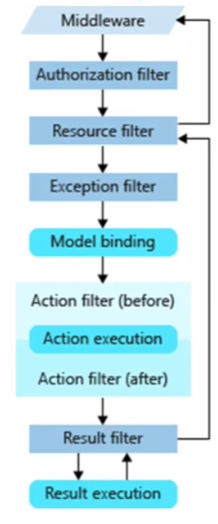

# DotNet5
## MVC页面传值
```
//声明
public IActionResult Index()
{
    base.ViewBag.Users1 = "张三";
    base.ViewData["User2"] = "李四";
    base.TempData["User3"] = "王五";
    object User4 = "赵六";
    if (HttpContext.Session.GetString("User5") == null)
    {
        HttpContext.Session.SetString("User5", "田七");
    }
    return View(User4);
}
//使用
@using Microsoft.AspNetCore.Http
@model System.String

@base.ViewBag.Users
@base.ViewData["User2"]
@base.TempData["User3"]
//model就是View(User4) 传过来的参数 需要引用命名空间
@Model  
//GetString需要引用命名空间
@Context.Session.GetString("User5")  
```
> Session的使用需要注册
> 1. 在Setup.cs中的ConfigureServices方法内添加 `services.AddSession();`
> 2. 在Configure方法内添加 `app.UseSession();`

## Log4Net组件
步骤

1. Nuget引入程序集：log4Net + Microsoft.Extensions.Logging.Log4Net.AspNetCore
2. 准备配置文件（配置文件的属性“复制到输出目录”要改为 **始终复制**）
3. 配置使用Log4Net记录日志
```
//方式一：在Programe.cs中配置
public static IHostBuilder CreateHostBuilder(string[] args) =>
    Host.CreateDefaultBuilder(args)
        .ConfigureLogging(loggingBuilder =>
        {
            //配置log4Net配置文件的读取
            loggingBuilder.AddLog4Net("Config/log4net.Config");
        })
        .ConfigureWebHostDefaults(webBuilder =>
        {
            webBuilder.UseStartup<Startup>();
        });
//方式二：Startup.cs中配置  
// using Microsoft.Extensions.Logging;
public void Configure(IApplicationBuilder app, IWebHostEnvironment env, ILoggerFactory loggerFactory)
{
    ...
    loggerFactory.AddLog4Net("Config/log4net.Config");
    ...
}
```
## IIS
#### 安装

1. 打开控制面板 
2. 点击程序 
3. 点击启动或关闭Windows功能 
4. 勾选Internet infomation Service下的所有选项全部划√ 
5. 确认  
#### 运行发布
IIS发布 
IIS直接建立网站，目录指向项目根目录下的Debug/Net5文件----不行 
把项目发布以后：目录指向项目**发布**目录 ---可以的  

 脚本启动  
在项目名称.dll所在目录执行命令
`dotnet net-mvc-study-02.dll --urls="http://*:8888"`

静态文件读取 +   脚本参数
静态文件读取：
1.Nuget引入：Nuget引入Microsoft.Extensions.FileProviders
2.配置读取静态文件的中间件
```
app.UseStaticFiles(new StaticFileOptions() {
    //执行文件下的wwwroot文件夹
    FileProvider = new PhysicalFileProvider(Path.Combine(Directory.GetCurrentDirectory(), "wwwroot"))
});
```

脚本参数：
1.可以在启动dll的脚本之后放上参数，格式：--参数名称=参数值
2.控制器通过构造函数注入IConfiguration
3.可以在控制器中通过IConfiguration[参数名称]
配置文件读取：
第一种：
通过IConfiguration索引取值；
如果遇到对象，数组时
中间使用：分割，依次读取；
```
//配置appsetting.json
"configurationId": "jike2011nuo",
"ConnectionStrings": {
  "WriteConnection": "writeConnection",
  "ReadConnectionList": [
    "read1",
    "read2",
    "read3"
  ]
}
//读取
Console.WriteLine($"configurationId:{Configuration["configurationId"]}");
Console.WriteLine($"connectionStrings:{Configuration["ConnectionStrings:WriteConnection"]}");
Console.WriteLine($"connectionStrings:{Configuration["ConnectionStrings:ReadConnectionList:0"]}");
Console.WriteLine($"connectionStrings:{Configuration["ConnectionStrings:ReadConnectionList:1"]}");
Console.WriteLine($"connectionStrings:{Configuration["ConnectionStrings:ReadConnectionList:2"]}");
```
第二种：

1. 定义一个和配置文件内容格式一致的类
2. 在ConfigureServices 配置 services.Configure(Configuration.GetSection("ConnectionStrings"));
3. 在使用的时候可以直接通过IOptions options注入
4. 获取注入的Options.Value 就是我们获取的到配置文件的一个实体类型对象
```
//对象
public class DbConnectionOptions
{
    public string WriteConnection { get; set; }
    public List<string> ReadConnectionList { get; set; }
}
//注册
services.Configure<DbConnectionOptions>(Configuration.GetSection("ConnectionStrings"));
//注入
public class FirstController : Controller
{
    private readonly DbConnectionOptions connectionOptions;
    //构造函数注入
    public FirstController(IOptions<DbConnectionOptions> options)
    {
        connectionOptions = options.Value;
    }
}
```
## Container
### IOC容器IServiceCollection
.NET5是有内置IOC容器的；
什么IOC？ 把对象的创建统一交给第三方容器来创建； 

DI依赖注入：IServiceCollection支持且仅支持构造函数注入
什么是依赖注入呢？
如果对象A依赖于对象B，对象B依赖于对象C，就可以先构造对象C,然后传递给对象B，然后把对象B传
递给对象A，得到A的具体实例；
IServiceCollection可以支持无限层级的依赖注入； 前提是都要先注入服务（注册抽象和具体的映射关
系）
#### 使用IServiceCollection
##### 第一种方式
 在Startup中的ConfigureServices 方法中注册服务
```
services.AddTransient<ITestServiceA, TestServiceA>();
```
在需要使用的控制器中，通过构造函数，定义服务的抽象类型作为参数，在运行时，自动得到服务的具体实现  
```
 private readonly ITestServiceA _ITestServicA;
 //构造函数注入
 public FifthController(ITestServiceA iTestServicA)
 {
           _ITestServicA = iTestServicA; 
 }
```
然后就可以在该类(FifthController)中使用该服务
##### 第二种方式
在Startup中的ConfigureServices 方法中注册服务 
```
services.AddTransient<ITestServiceA, TestServiceA>();
```
在需要使用的控制器中，通过构造函数，注入IServiceProvider
```
private readonly IServiceProvider _ServiceProvider = null;
public FifthController(IServiceProvider serviceProvider)
{ 
   _ServiceProvider=serviceProvider
}

```
通过_ServiceProvider获取到服务，然后通过服务实例调用服务内部的方法
```
public IActionResult Index()
{  
   ITestServiceA testServiceA = (ITestServiceA)_ServiceProvider.GetService(typeof(ITestServiceA));
   testServiceA.Show();
}
```
#####  第三种方式 
在注册服务后，视图中通过关键字@Inject 获取实例
```
@inject ITestServiceA iTestServicA   ---获取到服务实例
@{
   iTestServicA.Show();
}
```
#### IServiceCollection生命周期
那么在创建对象的时候，不同的情况，需要让对象单例，每一次都创建新的对象实例；不同的作用于创建新的实例；
瞬时生命周期：每一次getService获取的实例都是不同的实例
单例生命周期，在整个进程中获取的都是同一个实例
作用域生命周期，同一个作用域，获取的是同一个对象的实例；不同的作用域，获取的是不同的对象实例
建议：开发工作中，一般情况下，都是一次请求一个对象的实例；更多的是瞬时生命周期的使用；
### Autofac容器
 Autofac也是一款很流行的IOC容器：那如何使用
第三方的IOC容器

1. Nuget引入程序包
2. 创建一个ContainerBuilder
3. 注册抽象和实现关系
4. Build一下，得到IContainer容器
5. 通过容器获取服务实例
6. 使用服务
#### Autofac多种注入方式
```
ContainerBuilder containerBuilder = new ContainerBuilder();
containerBuilder.RegisterType<TestServiceA>().As<ITestServiceA>();
containerBuilder.RegisterType<TestServiceB>().As<ITestServiceB>().PropertiesAutowired();
containerBuilder.RegisterType<TestServiceC>().OnActivated(e => e.Instance.setService(e.Context.Resolve<ITestServiceA>())).As<ITestServiceC>();
IContainer container = containerBuilder.Build();
ITestServiceA testServiceA = container.Resolve<ITestServiceA>();//获取服务 
//属性注入的属性的访问修饰符是public
ITestServiceB testServiceB = container.Resolve<ITestServiceB>();//获取服务 属性注入
ITestServiceC testServiceC = container.Resolve<ITestServiceC>();//获取服务 方法注入
```

####  Autofac的生命周期
 瞬时生命周期--每次获取实例都是全新的实例  
```
containerBuilder.RegisterType<TestServiceA>().As<ITestServiceA>().InstancePerDependency();
```
单例生命周期 --一个进程中没有都是同一个实例
```
containerBuilder.RegisterType<TestServiceA>().As<ITestServiceA>().SingleInstance();
```
 每个生命周期范围一个实例  
```
ContainerBuilder containerBuilder = new ContainerBuilder();
containerBuilder.RegisterType<TestServiceA>().As<ITestServiceA>().InstancePerLifetimeScope();
IContainer container = containerBuilder.Build();
ITestServiceA testServiceA15 = null;
ITestServiceA testServiceA16 = null; 
using (var scope1 = container.BeginLifetimeScope())
{
     ITestServiceA testServiceA11 = scope1.Resolve<ITestServiceA>();
     ITestServiceA testServiceA12 = scope1.Resolve<ITestServiceA>();
     Console.WriteLine(object.ReferenceEquals(testServiceA11, testServiceA12)); //true
     testServiceA15 = testServiceA12;
}
using (var scope1 = container.BeginLifetimeScope())
{
     ITestServiceA testServiceA13 = scope1.Resolve<ITestServiceA>();
     ITestServiceA testServiceA14 = scope1.Resolve<ITestServiceA>();
     Console.WriteLine(object.ReferenceEquals(testServiceA13, testServiceA14)); //true
     testServiceA16 = testServiceA14;
} 
Console.WriteLine(object.ReferenceEquals(testServiceA15, testServiceA16)); //false
```
 每个【匹配生命周期范围一个实例 】
```
containerBuilder.RegisterType<TestServiceA>().As<ITestServiceA>
().InstancePerMatchingLifetimeScope("Zhaoxi");
IContainer container = containerBuilder.Build();
ITestServiceA testServiceA15 = null;
ITestServiceA testServiceA16 = null;
using (var scope1 = container.BeginLifetimeScope("Zhaoxi"))
{
     ITestServiceA testServiceA11 = scope1.Resolve<ITestServiceA>(); 
     using (var scope2 = scope1.BeginLifetimeScope())
     { 
           ITestServiceA testServiceA12 = scope2.Resolve<ITestServiceA>();
           Console.WriteLine(object.ReferenceEquals(testServiceA11, testServiceA12)); 
     }  
     testServiceA15 = testServiceA11;
}
using (var scope1 = container.BeginLifetimeScope("Zhaoxi"))
{
       ITestServiceA testServiceA13 = scope1.Resolve<ITestServiceA>();
       using (var scope2 = scope1.BeginLifetimeScope())
       {
             ITestServiceA testServiceA14 = scope2.Resolve<ITestServiceA>();
             Console.WriteLine(object.ReferenceEquals(testServiceA13, testServiceA14)); 
       } 
                        
     testServiceA16 = testServiceA13;
}
Console.WriteLine(object.ReferenceEquals(testServiceA15, testServiceA16));

```
 每个请求一个实例(InstancePerRequest)  
```
ContainerBuilder containerBuilder = new ContainerBuilder();
containerBuilder.RegisterType<TestServiceA>().As<ITestServiceA>().InstancePerRequest();
IContainer container = containerBuilder.Build(); 
using (var scope1 = container.BeginLifetimeScope())
{
     ITestServiceA testServiceA11 = scope1.Resolve<ITestServiceA>();
     ITestServiceA testServiceA12 = scope1.Resolve<ITestServiceA>();
     Console.WriteLine(object.ReferenceEquals(testServiceA11, testServiceA12)); 
}
```
### Autofac支持配置文件

1. Nuget引入程序集：
- Autofac.Extensions.DependencyInjection
- Autofac.Configuration
- Autofac
2. 准备配置文件
```
{
	"components": [
		{
      // type ： "实现类全类名, 程序集名称（非命名空间）"
			"type": "net_mvc_study_02.Service.impl.TestServiceA,net-mvc-study-02",
			"services": [
				{  // 接口全类名, 程序集
					"type": "net_mvc_study_02.Service.ITestServiceA,net-mvc-study-02"
				}
			],
			"instanceScope": "single-instance", //单例
			"injectProperties": true  //属性注入
		},
		...
	]
}

```

3. 读取配置文件，根据配置文件信息，生成抽象和映射信息
```
ContainerBuilder containerBuilder = new ContainerBuilder();
//读取配置文件，把配置关系装载到ContainerBuilder
IConfigurationBuilder config = new ConfigurationBuilder();
IConfigurationSource configurationSource = new JsonConfigurationSource()
{
    Path = "Config/autofac.json", //
    Optional = false, //boolean，默认就是false
    ReloadOnChange = true, //同上
};
config.Add(configurationSource);
ConfigurationModule module = new ConfigurationModule(config.Build());
containerBuilder.RegisterModule(module);
IContainer container = containerBuilder.Build();
ITestServiceA testServiceA = container.Resolve<ITestServiceA>();//获取服务
ITestServiceB testServiceB = container.Resolve<ITestServiceB>();//获取服务 属性注入
ITestServiceC testServiceC = container.Resolve<ITestServiceC>();//获取服务 方法注入
```
###  Autofac整合.NET5  

1. 指定Autofac工厂替换默认工厂,Program指定 
```
public static IHostBuilder CreateHostBuilder(string[] args) =>
    Host.CreateDefaultBuilder(args)
        .ConfigureWebHostDefaults(webBuilder =>
        {
            webBuilder.UseStartup<Startup>();
        })
        .UseServiceProviderFactory(new AutofacServiceProviderFactory())
    ;
```

2. 在Startup类增加ConfigureContainer 方法， 注册关系
```
public void ConfigureContainer(ContainerBuilder builder)
{
    builder.RegisterType<TestServiceA>().As<ITestServiceA>();
    builder.RegisterType<TestServiceB>().As<ITestServiceB>().PropertiesAutowired();
    builder.RegisterType<TestServiceC>().OnActivated( e => 
    e.Instance.setService(e.Context.Resolve<ITestServiceA>())).As<ITestServiceC>();
}
```

3. 可以在Controller中通过各种方式注入注册的服务
###  Autofac支持控制器属性注入 -- 未实现
 控制器是一个类，控制器的实例其实是IControllerActivator来创建的； 

1. 得让控制器使用容器来获取实例； 
2. 注册控制器抽象和具体的关系
3. 在控制器内定义属性 
4. 扩展，自己控制究竟哪些属性需要做依赖注入  
```
//Startup
public void ConfigureContainer(ContainerBuilder builder)
{
    #region 注册所有控制器的关系+控制器实例化需要的所有组件
    Type[] controllersTypesInAssembly = typeof(Startup).Assembly.GetExportedTypes()
     .Where(type => typeof(ControllerBase).IsAssignableFrom(type)).ToArray();
    //想要属性注入，需要在PropertiesAutowired方法中添加一个属性选择器，返回一个boolean，true就进行属性注入
    builder.RegisterTypes(controllersTypesInAssembly).PropertiesAutowired(new CustomPropertySelector());
    #endregion
}
//CustomPropertySelector： 自定义属性选择器
public class CustomPropertySelector : IPropertySelector
{
    public bool InjectProperty(PropertyInfo propertyInfo, object instance)
    {
        //判断 属性的自定义特性中有没有等于Autowired
        return propertyInfo.CustomAttributes.Any(item => item.AttributeType == typeof(Autowired));
    }
}
//Autowired： 自定义特性
[AttributeUsage(AttributeTargets.Property)]
public class Autowired : Attribute {}

//特性的应用  
//ITestServiceA将会在创建实例时进行属性注入
public class HomeController : Controller
{
    [Autowired]
    private ITestServiceA testA { get; set; }
}

```
###  Autofac抽象多实现的问题

1. 一个抽象多个实例都注册了，通过构造函数用抽象类型来获取实例，哪个后面注册就获取到哪一个，覆盖型 
2. 一个抽象多个实例，都注册了,可以通过一个IEnumerable<抽象>,当做构造函数参数，可以获取到所 有注册的具体的实例
3. 注册一个抽象的多个实例资源，如下方式注册，可以在控制器的构造函数中，使用具体实现类型作为 参数类型，可以匹配到不同到具体类型实例
```
ontainerBuilder.RegisterSource(new AnyConcreteTypeNotAlreadyRegisteredSource(t => 
t.IsAssignableTo<ITestServiceA>()));
```

###  Autofac单抽象多实现构造函数注入  

1. 注册的时候可以指定一个标识 
```
containerBuilder.RegisterType<TestServiceA>().Named<ITestServiceA>("TestServiceA");
containerBuilder.RegisterType<TestServiceUpdate>().Named<ITestServiceA>("TestServiceUpdate");
```

2. 在控制器中获取的时候获取一个Autofac的上下文，通过上下文+标识，得到不同的实现的实例；  
```
private readonly IComponentContext _ComponentContext = null;
public SixThController(IComponentContext componentContext)
{
   _ComponentContext = componentContext;
}
public IActionResult Index()
{
   ITestServiceA testServiceA = _ComponentContext.ResolveNamed<ITestServiceA>("TestServiceA");
   ITestServiceA testServiceUpdate = _ComponentContext.ResolveNamed<ITestServiceA>("TestServiceUpdate");
   iTestServiceAA.Show();
   return View();
}
```
###  Autofac单抽象多实例属性注入  

1. 道理和上面一样，可以把Autofac 上下文当做属性来注入 
2. 在使用的时候，通过Autofac上下文+不同注册的标识，获取到不同的具体实例  
###  Autofac支持AOP   
#### 通过接口实现
 AOP面向切面编程；不用修改之前代码的基础上，可以动态的在某个动作之前加一些操作，动态在在某 一个动作之后做点什么事儿 
**注意：AOP的扩展类必须放在与引用位置不用的命名空间下**

1. Nuget引入Castle.Core程序集+Autofac.Extras.DynamicProxy程序集 
2. 定注意切入者：如下，需要继承IInterceptor，实现方法
```
 public class CustomAutofacAop : IInterceptor
 {
     public void Intercept(IInvocation invocation)
     {
         {
             Console.WriteLine("方法执行前");
         }
         invocation.Proceed();//执行这句话就是去执行具体的实例的这个方法
         {
             Console.WriteLine("方法执行后");
         }
     }
 }
```

3. 在服务的抽象上标记[Intercept(typeof(CustomAutofacAop))] 
```
[Intercept(typeof(CustomAutofacAop))]  //AOP能够在接口生效
public interface ITestServiceA
```

4. 注册支持AOP扩展的类  
```
builder.RegisterType(typeof(CustomAutofacAop)); //注册自定义AOP拦截器
```

5. 注册服务的时候，需要需要调用EnableInterfaceInterceptors，标记说明当前服务获取实例后可以支 持AOP
```
builder.RegisterType<TestServiceA>().As<ITestServiceA>().EnableInterfaceInterceptors();
```
#### 通过类实现
EnableInterfaceInterceptors+抽象标记特性[Intercept(typeof(CustomAutofacAop))] ，只要是实现 了这个抽象就可以支持AOP
EnableClassInterceptors + 实现类标记特性[Intercept(typeof(CustomAutofacAop))] ，只有标记 了这个特性的，才能够支持AOP
如果使用EnableClassInterceptors 来支持AOP，实现类中支持AOP的方法必须为**虚方法**；   
```
[Intercept(typeof(CustomAutofacAop))]
public class TestServiceA : ITestServiceA
{
   public virtual void Show()
   {
       Console.WriteLine("a");
   }
}
```
## Filter
### .NET5 AOP 5个Filter
AOP：可以在不修改之前的代码为基础，可以动态的增加新功能
AuthorizationFilter 鉴权授权
ResourceFilter 资源
ExceptionFilter 异常
ActionFilter 方法
ResultFilter 结果

### ActionFilter的特点
自定义一个CustomActionFilterAttribute特性，继承Attribute，实现IActionFilter接口；实现方法，标记在Action上
请求标记的有CustomActionFilterAttribute 的Action:执行顺序如下

1. 执行控制器构造函数
2. 执行CustomActionFilterAttribute 内的OnActionExecuting方法
3. 执行Action
4. 执行CustomActionFilterAttribute 内的OnActionExecuted
```

public class CustomActionFilterAttribute : Attribute, IActionFilter
{
    /// <summary>
    /// 方法执行后
    /// </summary>
    /// <param name="context"></param>
    public void OnActionExecuted(ActionExecutedContext context)
    {
        Console.WriteLine("exec CustomActionFilterAttribute.OnActionExecuted");
    }

    /// <summary>
    /// 方法执行前
    /// </summary>
    /// <param name="context"></param>
    public void OnActionExecuting(ActionExecutingContext context)
    {
        Console.WriteLine("exec CustomActionFilterAttribute.OnActionExecuting");
    }
}

//标记的方法
[CustomActionFilterAttribute]
public IActionResult Index()
{
    return View();
}
```
###  ActionFilter的多种使用

1. 通过实现IActionFilter接口来完成扩展
```
public class CustomActionFilterAttribute : Attribute, IActionFilter
{
    public void OnActionExecuted(ActionExecutedContext context)
    {
    }
    public void OnActionExecuting(ActionExecutingContext context)
    {
    }
}
```

2. 通过继承ActionFilterAttribute（系统提供的实现），根据自己的需要，覆写不同的方法，达到自己的 诉求 
```
public class CustomActionChildFilterAttribute : ActionFilterAttribute
{
    public override void OnActionExecuting(ActionExecutingContext context)
    {
        base.OnActionExecuting(context);
    }
    public override void OnActionExecuted(ActionExecutedContext context)
    {
        base.OnActionExecuted(context);
    }
}
```

3. 异步版本的实现，通过实现IAsyncActionFilter接口来实现
```
public class CustomActionAsyncFilterAttribute : Attribute, IAsyncActionFilter
{
    public Task OnActionExecutionAsync(ActionExecutingContext context, ActionExecutionDelegate next)
    {
        return Task.Run(() => {
            //exec 
        });
    }
}
```
### ActionFilter应用 + 依赖注入

1. 记录日志，action比较靠近Action，日志记录，可以记录到Action内部做的一些处理
2. 通过Log4net完成日志记录，需要注入Logger
### Filter的多种注册
1.`[CustomActionFilter]`---Fitler必须有无参数构造函数 
2.`[TypeFilter(typeof(CustomActionFilterAttribute))]`，可以没有无参数构造函数，可以支持依赖注入 
3.`[ServiceFilter(typeof(CustomActionFilterAttribute))]`，可以没有无参数构造函数，可以支持依赖注 入，但是`CustomActionFilterAttribute`必须要注册服务 
```
builder.RegisterType(typeof(CustomActionFilterAttribute)).PropertiesAutowired();
```
依赖注入是如何支持的？其实是是IOC来做到的。。。如何自定义。。。  

###  FilterFactory扩展定制
为可以使用ServiceFilter/TypeFilter就可以支持依赖注入呢？----一定是IOC容器来完成；

1. 自定义一个特性类，继承Attribute,实现接口 IFilterFactory；实现接口中的方法
2. 通过构造函数传递需要实例化的特性的type类型
3. 在实现接口中，通过Type类型获取到实例
4. 标记在Action上面

###  Filter的生效范围和执行顺序

1. 标记在Action上，就只对当前Action生效
2. 标记在Controller上，就对Controller上中的所有Action生效
3. 全局注册，对于当前整个项目中的Action都生效，在ConfigureServices中增加以下代码即可
```
services.AddMvc(option=> {
   option.Filters.Add<CustomActionFilterAttribute>(); //全局注册：
});
```
 如果有三个actionFilter，分别注册全局，控制器、Action;执行顺序如何呢？ 
定义三个ActionFilter，分别**注册全局，控制器，Action **
执行顺序如下： 
1.控制器实例化 
2.全局注册的Filter-OnActionExecuting
3.控制器注册的Filter-OnActionExecuting
4.Actioin注册的Filter-OnActionExecuting
5.执行Action内部的逻辑算计
6.Action注册的Filter-OnActionExecuted
7.控制器注册的Filter-OnActionExecuted
8.全局注册的Filter-OnActionExecuted
俄罗斯套娃~ 执行顺序不能改吗？ 能改，在注册Filter的时候，指定Order的值，执行顺序
按照Order的值，**从小到大执行**； 通过继承ActionFilterAttribute实现ActionFilter有默认的Order属性

### ResourceFilter
 就是为了缓存而存在 


```
public class CustomResourceFilterAttribute : Attribute, IResourceFilter
{

    private static Dictionary<string, object> CacheDictionary = new Dictionary<string, object>();

    /// <summary>
    /// 在xxx资源之前
    /// </summary>
    /// <param name="context"></param>
    public void OnResourceExecuting(ResourceExecutingContext context)
    {
        //在这里就判断是否有缓存，只要是key 不变，缓存就不变
        string key = context.HttpContext.Request.Path;
        if (CacheDictionary.Any(item => item.Key == key))
        {
            //断路器，只要是对Result赋值，就不继续往后走了； 
            context.Result = CacheDictionary[key] as IActionResult;
        }
        Console.WriteLine("CustomResourceFilterAttribute.OnResourceExecuting");
    }

    /// <summary>
    /// 在xxx资源之后
    /// </summary>
    /// <param name="context"></param>
    public void OnResourceExecuted(ResourceExecutedContext context)
    {
        //到了这里，肯定已经完成了计算了；
        string key = context.HttpContext.Request.Path;
        CacheDictionary[key] = context.Result; 
        Console.WriteLine("CustomResourceFilterAttribute.OnResourceExecuted");
    }
}
```
### Filter匿名
 如果全局注册，Filter生效于所有的Acion；如果有部分Action我希望你不生效呢？怎么办呢？ 
匿名----可以避开Filter的检查；
如何支持自定义的Filter,匿名 

1. 自定义一个特性； 
2. 在需要匿名的Filter内部，检查是否需要匿名（检查是否标记的有匿名特性）,如果有就直接避开 
```
/// <summary>
/// 全局过滤器 --- 方法执行前
/// </summary>
/// <param name="context"></param>
public void OnActionExecuting(ActionExecutingContext context)
{
    //如果标记的有特殊的记号，就避开检查；
    if (context.ActionDescriptor.EndpointMetadata
    .Any(item=>item.GetType()==typeof(CustomAllowAnonymousAttribute))) 
    {
        return;
    }
    //other code
}
```
### ExceptionFilter

1. 自定义一个CustomExceptionFilterAttribute ,实现IExceptionFilter接口， 
2. 实现方法，先判断，异常是否被处理过，如果没有被处理过，就处理； 
3. 分情况处理：1.如果是ajax请求，就返回JosnResult，如果不是Ajax请求，就返回错误页面 
```
public class CustomExceptionFilterAttribute : Attribute, IExceptionFilter
{
   private IModelMetadataProvider _modelMetadataProvider =null;
   public CustomExceptionFilterAttribute(IModelMetadataProvider modelMetadataProvider)
   {
       _modelMetadataProvider = modelMetadataProvider;
   }
   /// <summary>
   /// 当异常发生的时候触发到这儿来
   /// </summary>
   /// <param name="context"></param>
   public void OnException(ExceptionContext context)
   {
       if (!context.ExceptionHandled) //异常是否被处理过
       {
           //在这里处理 如果是Ajax请求===返回Json
           if (this.IsAjaxRequest(context.HttpContext.Request))//header看看是不是XMLHttpRequest
           {
               context.Result = new JsonResult(new
               {
                   Result = false,
                   Msg = context.Exception.Message
               });//中断式---请求到这里结束了，不再继续Action
           }
           else
           {
               //跳转到异常页面
               var result = new ViewResult { ViewName = "~/Views/Shared/Error.cshtml" };
               result.ViewData = new ViewDataDictionary(_modelMetadataProvider, context.ModelState);
               result.ViewData.Add("Exception", context.Exception); 
               context.Result = result; //断路器---只要对Result赋值--就不继续往后了；
           }
           context.ExceptionHandled = true;
       } 
   }
   private bool IsAjaxRequest(HttpRequest request)
   {
       string header = request.Headers["X-Requested-With"];
       return "XMLHttpRequest".Equals(header);
   }
}

//Error.cshtml
@{
    ViewData["Title"] = "Error";
    Exception exception = base.ViewData["Exception"] as Exception;
}
<p>
   @exception.Message
</p>
```

4. 全局注册，在Starup中的ConfigureServices注册 
```
services.AddMvc(option=> {
     option.Filters.Add<CustomExceptionFilterAttribute>();
 });
```
### ExceptionFilter能捕捉到哪些异常

1. 控制器实例化异常 ----T 
2. 异常发生在Try-cache中 ---F 
3. 在视图中发生异常 ----F 
4. Service层发生异常 ---T 
5. 在action中发生异常 ---T 
6. 请求错误路径异常 ---可以使用中间件来支持，只要不是200的状态，就都可以处理
```
//在Configure中配置
app.UseStatusCodePagesWithReExecute("/Home/Error/{0}");//只要不是200 都能进来
app.UseExceptionHandler(errorApp =>
{
    errorApp.Run(async context =>
    {
        context.Response.StatusCode = 200;
        context.Response.ContentType = "text/html";
        await context.Response.WriteAsync("<html lang=\"en\"><body>\r\n");
        await context.Response.WriteAsync("ERROR!<br><br>\r\n");
        var exceptionHandlerPathFeature =
            context.Features.Get<IExceptionHandlerPathFeature>();

        Console.WriteLine("&&&&&&&&&&&&&&&&&&&&&&&&&&&&&&&&&&&&&&&&&");
        Console.WriteLine($"{exceptionHandlerPathFeature?.Error.Message}");
        Console.WriteLine("&&&&&&&&&&&&&&&&&&&&&&&&&&&&&&&&&&&&&&&&&");

        if (exceptionHandlerPathFeature?.Error is FileNotFoundException)
        {
            await context.Response.WriteAsync("File error thrown!<br><br>\r\n");
        }
        await context.Response.WriteAsync("<a href=\"/\">Home</a><br>\r\n");
        await context.Response.WriteAsync("</body></html>\r\n");
        await context.Response.WriteAsync(new string(' ', 512)); // IE padding
    });
});
```
### ResultFilter


1. 自定义一个类，继承Attribute,实现IResultFilter接口，实现方法 
2. 标记在Action方法头上 
3. 执行顺序：视图执行前，渲染视图，视图执行后
### ResultFilter的应用
双语言系统，其实就需要两个视图；要根据语言的不同，来选择不同的视图来渲染； 
因为在渲染视图之前，会进入到OnResultExecuting方法，就可以在这个方法中确定究竟使用哪一个视图文件
```
public class CustomResultFilterAttribute : Attribute, IResultFilter
{

    private IModelMetadataProvider _modelMetadataProvider = null;

    public CustomResultFilterAttribute(IModelMetadataProvider modelMetadataProvider)
    {
        _modelMetadataProvider = modelMetadataProvider;
    }

    /// <summary>
    /// 渲染视图之前执行
    /// </summary>
    /// <param name="context"></param>
    public void OnResultExecuting(ResultExecutingContext context)
{
    //在这里就可以有一个判断，符合某个情况，就使用哪一个视图； 
    Console.WriteLine("渲染视图之前执行");
    string view = context.HttpContext.Request.Query["View"];//也可以是配置文件
    if (view == "1")  //中文
    {
        var result = new ViewResult { ViewName = "~/Views/Seventh/IndexOne.cshtml" };
        result.ViewData = new ViewDataDictionary(_modelMetadataProvider, context.ModelState);
        context.Result = result;
    }
    else
    {
        var result = new ViewResult { ViewName = "~/Views/Seventh/IndexOne-2.cshtml" };
        result.ViewData = new ViewDataDictionary(_modelMetadataProvider, context.ModelState);
        context.Result = result; 
    }

}

    /// <summary>
    /// 渲染视图之后执行
    /// </summary>
    /// <param name="context"></param>
    public void OnResultExecuted(ResultExecutedContext context)
    {
        Console.WriteLine("渲染视图之后执行");
    }
}
```
### 鉴权授权
为了拦截一些操作； 传统的授权方式；session/Cookies来完成； 
1.在请求某个Action之前去做校验，验证当前操作者是否登录过，登录过就有权限 
2.如果没有权限就跳转到登录页中去 AOP--Filter； ActionFilter: 传统的登陆，需要匿名；

### .NET5鉴权授权
通过中间件来支持； 
第一步： 
在 app.UseRouting();之后，在app.UseEndpoints(）之前，增加鉴权授权； 
鉴权： app.UseAuthentication();---检测用户是否登录 
授权：app.UseAuthorization();//授权 检测有没有权限，是否能够访问后续的页面功能 
第二步: 
在ConfigureServices中中增加
```
services.AddAuthentication(CookieAuthenticationDefaults.AuthenticationScheme)
 .AddCookie(options =>
 {
   options.LoginPath = new PathString("/Eighth/Login"); //如果授权失败，就跳转到这个路径去中
   //options.AccessDeniedPath = new PathString("/Home/Privacy");
 });//用cookie
```
 第三步：指定哪些Action需要做鉴权授权
 标记特性：标记在哪个Action上，哪个Action就能够支持鉴权授权
```
[Microsoft.AspNetCore.Authorization.Authorize]
```
也可以标记在控制器，全局
全局配置的时候，有个action不需要鉴权，可以添加特性（[AllowAnonymousAttribute] //匿名）来避开鉴权
### .NET5鉴权授权角色授权
 不同的用户，可能会存在不同的角色，不同的角色，可能在访问不同的页面的时候，需要做不同拦截；- ---角色授权其实就是通过角色不同，做不同的权限拦截
```
var rolelist = new List<string>() 
{ //来自于数据库的角色
       "Admin",
       "Teacher",
       "Student"
}; 
//ClaimTypes.Role就是做权限认证的标识； 
var claims = new List<Claim>()//鉴别你是谁，相关信息
{
   new Claim(ClaimTypes.Role,"Admin"),
   new Claim(ClaimTypes.Name,name),
   new Claim("password",password),//可以写入任意数据
   new Claim("Account","Administrator"),
   new Claim("role","admin"),
   new Claim("zhaoxi","zhaoxi"),
   new Claim("User","zhaoxi")
};
foreach (var role in rolelist)
{
   claims.Add(new Claim(ClaimTypes.Role, role));
}

```
```
//标记的试试，通过逗号分隔不同的角色---只要是有一个角色符合
[Authorize(Roles = "Admin,Teacher,Student")]
就能够访问，角色之间是或者的关系
[Authorize(Roles = "Admin")]
[Authorize(Roles = "Teacher")]
//多个特性标记--多个角色之前是且的关系，必须要包含所有的角色，才能够访问
[Authorize(Roles = "Student")] 
```
### .NET5鉴权授权之策略鉴权
之前的角色授权是在代码中把角色定义死了；更希望能够自己来完成校验逻辑； 
第一步： 
增加CustomAuthorizationHandler-----专用做检验逻辑的； 要求继承自AuthorizationHandler<> 泛型抽象类
增加一个CustomAuthorizationRequirement，要求实现接口：IAuthorizationRequirement 
```
public class CustomAuthorizationHandler : AuthorizationHandler<CustomAuthorizationRequirement>
{
    public CustomAuthorizationHandler()
    {

    }
    protected override Task HandleRequirementAsync(AuthorizationHandlerContext context, CustomAuthorizationRequirement requirement)
    {
        if (requirement.Name == "Policy01")
        {
            ///策略1的逻辑
        }

        if (requirement.Name == "Policy02")
        {
            ///策略2的逻辑
        }
        //在这里可以自己定义自己的规则
        {
            //其实这里可以去数据库里面去做一些查询，然后根据用户的信息，做计算；
            //如果符合就context.Succeed(requirement); 
            //否则就Task.CompletedTask; 
        }
        //context.User 鉴权成功（登录成功以后），用户的信息； 
        var role = context.User.FindFirst(c => c.Value.Contains("admin"));
        if (role != null)
        {
            context.Succeed(requirement); //验证通过了
        }
        return Task.CompletedTask; //验证不同过
    }
}

public class CustomAuthorizationRequirement : IAuthorizationRequirement
{
    /// <summary>
    /// 
    /// </summary>
    public CustomAuthorizationRequirement(string policyname)
    {
        this.Name = policyname;
    }

    public string Name { get; set; }
}
```
第二步：
让自定义逻辑生效：在ConfigureServices方法中注册进来
```
services.AddSingleton<IAuthorizationHandler, CustomAuthorizationHandler>(); 
```
 第三步：支持多种策略
```
services.AddAuthorization(options =>
{
   options.AddPolicy("customPolicy", polic =>
   {
       polic.AddRequirements(new CustomAuthorizationRequirement("Policy01"));
   });
});
```
第四步：使用
```
[Authorize(policy: "Policy01")]
public IActionResult Index04()
{
    return View();
}
```
## .NET5跨平台本质
Web应用程序是一个控制台；
---Main程序的入口；
跨平台的原因在于框架已经内置了主机，只要是 程序启动，就是启动了主机，就可以监听端口；请求来了，只要是请求这个端口，主机就可以响应；无 论是在Windows还是在Linux下开发，都是要第一步完成环境的；这样就不用拘泥于是在Windows还是 在linux，
----这就是能够跨平台的本质原因；  
## NET5中间件
中间件的执行，是一个俄罗斯套娃； 

1. 先use 先执行 ，每一次Use一个中间件，其实就是在之前的基础上，套了一层； 
2. 请求来了以后，真正执行的时候，是一层一层的内部执行，然后再执行出来

增加程序的扩展性---如果想要增加一层，直接增加一个中间件就可以来完成

### .NET5常用中间件

1. app.Run，中断式，只要是使用当前中间件，后面的中间件都不执行； 
2. app.Map，判断路径中是否包含什么内容； 
3. app.MapWhen判断式，两个委托，第一个委托作为判断条件内容，第二个委托，是要执行的逻辑；  
### 中间件的多种引用方式

1. 中间件的内容可以独立开，放入到一个独立的类中去---需要一个规则  
```
public class FirstMiddleWare
{
   private readonly RequestDelegate _next;
   public FirstMiddleWare(RequestDelegate next)
   {
       _next = next;
   }
   public async Task Invoke(HttpContext context)
   {
       await context.Response.WriteAsync($"<p>{nameof(FirstMiddleWare)},Hello World1!</p>");
       await _next(context);
       await context.Response.WriteAsync($"<p>{nameof(FirstMiddleWare)},Hello World1!</p>");
   }
}
```
要求构造函数带有RequestDelegate参数类型---为了得到下一个中间件； 
必须包含async Task Invoke方法，方法参数为HttpContext

2. 在Starup中把这些中间件给引入进来
```
app.UseMiddleware<FirstMiddleWare>(); //使用某一个中间件
app.UseMiddleware<SecondMiddleWare>();
app.UseMiddleware<ThirdMiddleWare>();
```
## EFCore
EF: 通过实体和数据库的映射，可以通过对实体的操作完成对数据的操作；以面向对象的思想来完成对 数据的管理
映射：1.从数据库到代码实体的映射 2.从代码到数据库的映射
### EFCoreDBFirst
先有数据库，然后通过映射得到实体（和数据库的表对应）;  
```
//引入程序集
Install-Package Microsoft.EntityFrameworkCore
Install-Package Microsoft.EntityFrameworkCore.SqlServer
Install-Package Microsoft.EntityFrameworkCore.Tools
工具--nuget包管理器--程序包管理器控制台：命令执行：
Scaffold-DbContext "Data Source=雾岚\SQLSERVER1;Initial Catalog=db_efcore;User ID=sa;Password=abc123" Microsoft.EntityFrameworkCore.SqlServer -OutputDir Entity -Force -Context EFCoreDbContext -ContextDir /
命令参数：
-OutputDir *** 实体文件所存放的文件目录
-ContextDir *** DbContext文件存放的目录
-Context *** DbContext文件名
-Schemas *** 需要生成实体数据的数据表所在的模式
-Tables *** 需要生成实体数据的数据表的集合
-DataAnnotations
-UseDatabaseNames 直接使用数据库中的表名和列名（某些版本不支持）
-Force 强制执行，重写已经存在的实体文件
```
### EFCoreCodeFirst
 (迁移）：代码先行，现有代码再有数据库；数据库随着业务变化迁移改变； 

1. 可以通过EfCore带有的api来完成从代码生成数据库 
2. 迁移 

引入NuGet包：EntityFrameworkCore.Design
迁移命令：

| 迁移命令描述 | CLI命令 | PMC命令 |
| --- | --- | --- |
|  创建迁移：migrationname 为迁移名称   |  dotnet ef migrations add migrationName   |  add-migration migrationName |
|  移除迁移(删除最近的一次迁 移)   |  dotnet ef migrations remove    | remove-migration |
|  应用所有的迁移(使迁移文件 应用到数据库)   |  dotnet ef database update   |  update-database   |
|  指定版本进行迁移   |  dotnet ef database update migrationName   |  update-database migrationName   |
|  生成对应版本的脚本   |  dotnet ef migrations script   |  Script-Migration   |
|  查看迁移列表   |  dotnet ef migrations list   |  |
|  查看数据库上下文信息   |  dotnet ef dbcontext info   |  |

### EFCore抓取SQL语句
一、日志输出
1.Nuget引入
```
Microsoft.Extensions.Logging.Console
```
2.配置使用日志输出Sql语句
```
protected override void OnConfiguring(DbContextOptionsBuilder optionsBuilder)
{ 
   ///通过日志输出Sql语句
   optionsBuilder.UseLoggerFactory(LoggerFactory.Create(builder =>
   {
       builder.AddConsole();
   }));
}
```
二、Profiler工具
### EFCore支持Linq
```
context.Students.Where( u => idList.Contains(u.id)); //where Id in(1,2,3)

context.Students.Where(u => idList.Contains(u.Id)) // Id in(x,x,x)
                            .OrderBy(u => u.Id) //order by Id
                            .Select(u => new  // select Name, Password as Pwd
                            {
                                Name = u.Name,
                                Pwd = u.Password
                            }).Skip(3).Take(5); //跳过3条，选择5条

//每一次 .Where 都会在已有条件外面加一层括号
// where (((Name like '小%') AND and (Name like '%村长')) AND (Name like '长%')) AND ...
context.Students.Where(u => u.Name.StartsWith("小") // Name like '小%'
                       && u.Name.EndsWith("村长"))  // and Name like '%村长'
                       .Where(u => u.Name.EndsWith("长")) 
                       .Where(u => u.Name.Contains("名村")) //Name like '%名村%'
                       .Where(u => u.Name.Length < 5)  //CAST(LEN(Name) as int) < 5
                       .OrderBy(u => u.Id); order by Id

//条件不能写等号，要使用equals关键字
(from u in context.SysUsers
join c in context.SysUserRoleMappings on u.Id equals c.SysUserId //inner join 
where new int[] { 1, 2, 3, 4, 6, 7, 10 }.Contains(u.Id)
select new
{ // sql里select后面的字段 等于前面是别名 后面是字段名
    Name = u.Name,
    Pwd = u.Password,
    RoleId = c.SysRoleId.ToString(),
    UserId = u.Id
}).OrderBy(u => u.UserId).Skip(3).Take(5);

//只有左连接
var list = from u in dbContext.SysUsers
   join c in dbContext.SysUserRoleMappings on u.Id equals c.SysUserId
   into ucList
   from uc in ucList.DefaultIfEmpty();  // from SysUser left join SysUserRoleMapping

//直接写SQL 查询
string selectSql = "select * from  Students where id<@Id";
SqlParameter parameter1 = new SqlParameter("@Id", 500);
//查询出来的query是Students的集合
var query = context.Students.FromSqlRaw<Students>(selectSql, parameter1); 

//直接写SQL 更新
string sql = "Update [Students] Set Name='小新20201225' WHERE Id=@Id";
SqlParameter parameter1 = new SqlParameter("@Id", 500);
int flg = context.Database.ExecuteSqlRaw(sql, parameter1);
```
### EFCoreState
增删改的动作是统一又SaveChanges以后才落实到数据库中去； 
数据库的增改动作都是统一由SaveChanges之后，统一提交到数据库；是通过状态跟踪，任何一个增删 改查的操作都会记录一个状态在内存中；增删改查的状态；一旦SaveChanges，就根据状态去落实到数 据中去的； 
状态跟踪实现了增删改便捷，但是也会有性能损耗
```
//
// 摘要:
//     上下文未跟踪实体。
Detached = 0,
//
// 摘要:
//     实体正在被上下文跟踪，并且存在于数据库中。它的财产 
//     数据库中的值没有更改 
Unchanged = 1,
//
// 摘要:
//     实体正在被上下文跟踪，并且存在于数据库中。是的
//     已标记为从数据库中删除。
Deleted = 2,
//
// 摘要:
//     实体被上下文跟踪并存在于数据库中。一些或
//     它的所有属性值都已修改。
Modified = 3,
//
// 摘要:
//     实体正在被上下文跟踪，但在数据库中尚不存在。
Added = 4
```
### EFCore事务
SaveChange就是保证事务的；多个对于数据库的操作，统一SaveChanges，就是开启了一个事务

### 调优
EFCore默认延迟执行---在需要结果的是才去按照需求加载数据到内存中；而不是把所有的数据都加载到内存中来；----提供性能的方法

Find 方法带有缓存机制；先回去内存中查找数据，如果内存中没有数据，才回去数据库中去获取数据；
Linq查询每一次都会去数据库中查询数据；
在查询的时候，尽量的选择Find查询，可以使用到缓存机制；
状态跟踪：实体对象对应的有一个副本在内存中，我们操作了这个实体对象以后，EFCore会自动和内存中的副本做比较；任何一次操作都会去和内存中的副本；-----损耗性能；----状态跟踪 ---损耗性能；
如果我很明确，查询出来的数据，根本不需要做增删改；其实这个状态跟踪对我们来说就没有意义了；可以考虑使用AsNoTracking；去掉状态跟踪---提高性能；
```
//去掉状态跟踪；
var list = context.Students.Where(j => j.Id < 10).AsNoTracking().ToList(); 
```
### .NET5 MVC+EFCore+分层整合
没有分层: 

1. 职责不清晰 
2. 如果有一处修改，会导致全部需要重新修改，就需要全部重新测试 

分层架构： 

- UI:表现给用户查看 
- Bll：业务逻辑计算 
- Dal:数据库访问 
   - 1.职责更加清晰 
   - 2.需求的变更不用修改全部代码； 
   - 3.人员更好调配---让更加专业的人来做专业的事儿  

分层以后：要求不能跨层调用，UI层----Bll层---Bll---Dal层  

 因为每一个数据库的表，一般情况都是独立的来一个Service,那类似于一些基础操作；每个Service中都 会存在；代码有很多重复； 
支持依赖注入：必须有抽象，依赖抽象而不是依赖于细节；

 项目源码：
E:\net_code\net-mvc-study-02
net-efcore-interface
net-efcore-models
net-efcore-webui
net-efcore-service

