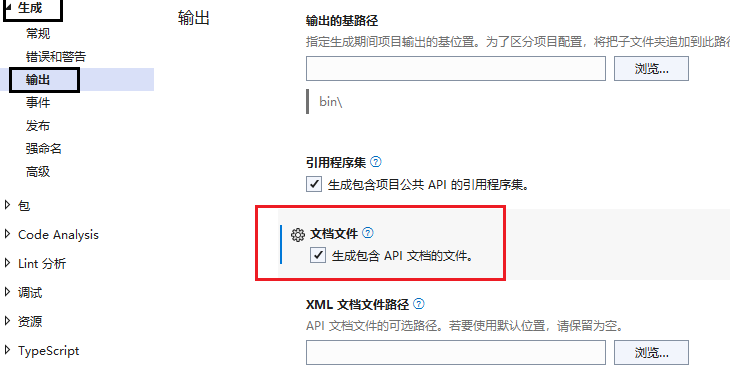

# WebApi-Net6
### Json格式化日期
安装Nuget  Microsoft.AspNetCore.Mvc.NewtonsoftJson （.net 6 对应 Newtonsoft 6.x）
Program配置
```csharp
builder.Services.AddControllers().AddNewtonsoftJson(options =>
{
    options.SerializerSettings.ContractResolver = new DefaultContractResolver();
    options.SerializerSettings.DateFormatString = "yyyy-MM-dd HH:mm:ss";
});
```

### 扩展Swagger
#### 设置默认值
自定义过滤器
```sql
//示例对象
public class QueryVO
{
    public string name { get; set; }
    public int sort { get; set; }
    [DefaultValue("2022-01-01")]  //通过特性指定默认值
    public DateTime Birthday { get; set; }
}

//过滤器
public class DefaultValueSchemaFilter : ISchemaFilter
{
    public void Apply(OpenApiSchema schema, SchemaFilterContext context)
    {
        if(schema == null)
        {
            return;
        }
        var objectSchema = schema;
        foreach(var property in objectSchema.Properties)
        {
            //通过类型指定默认值
            if (property.Value.Type == "string" && property.Value.Default == null)
            {
                property.Value.Default = new OpenApiString("");
            }
            //通过属性名指定默认值
            if(property.Key == "sort")
            {
                property.Value.Default = new OpenApiInteger(99);
            }
            //通过特性指定默认值
            DefaultValueAttribute defaultValue = (DefaultValueAttribute)(context.ParameterInfo?.GetCustomAttributes<DefaultValueAttribute>());
            if(defaultValue != null)
            {
                property.Value.Example = (IOpenApiAny)defaultValue.Value;
            }
        }
    }
}
```
在Program.cs中添加过滤器
```sql
builder.Services.AddSwaggerGen(options =>
{
    options.SchemaFilter<DefaultValueSchemaFilter>();
});
```
#### swagger添加注释
配置swagger属性
```sql
builder.Services.AddSwaggerGen(options =>
{
    //xml文档绝对路径 -- 读取根据控制api生成的xml的文件 
    //参数2： 程序集.xml (默认xml生成的位置) 
    var file = Path.Combine(AppContext.BaseDirectory, $"{AppDomain.CurrentDomain.FriendlyName}.xml");
    // true : 显示控制器层注释
    option.IncludeXmlComments(file, true);
    // 对action的名称进行排序，如果有多个，就可以看见效果了。
    option.OrderActionsBy(o => o.RelativePath);
});
```
设置程序集属性

action上使用文档注释

#### swagger添加版本
```csharp
/// <summary>
/// Api版本控制
/// </summary>
public enum ApiVersion
{
    v1,
    v2,
    v3,
    v4
}
// 添加
builder.Services.AddSwaggerGen(option =>
{
    foreach (var version in typeof(ApiVersion).GetEnumNames())
    {
        option.SwaggerDoc(version, new OpenApiInfo()
        {
            Title = $"通用后台管理项目Api文档",
            Version = version,
            Description = $"通用版本的CoreApi版本【{version}】"
        });
    }
});

// 使用
app.UseSwaggerUI(option =>
{
    foreach (string version in typeof(ApiVersion).GetEnumNames())
    {
        option.SwaggerEndpoint($"/swagger/{version}/swagger.json", string.IsNullOrWhiteSpace(docName) ? docName : $"通用后台管理项目Api文档【{version}】版本");
    }
});
```
#### swagger支持token传递
```csharp
builder.Services.AddSwaggerGen(option => 
{
    //添加安全定义--配置支持token授权机制
    option.AddSecurityDefinition("Bearer", new OpenApiSecurityScheme
    {
        Description = "请输入token,格式为 Bearer xxxxxxxx（注意中间必须有空格）",
        Name = "Authorization",
        In = ParameterLocation.Header,
        Type = SecuritySchemeType.ApiKey,
        BearerFormat = "JWT",
        Scheme = "Bearer"
    });
    //添加安全要求
    option.AddSecurityRequirement(new OpenApiSecurityRequirement
    {
        {
            new OpenApiSecurityScheme
            {
                Reference =new OpenApiReference()
                {
                    Type = ReferenceType.SecurityScheme,
                    Id ="Bearer"
                }
            },
            new string[]{ }
        }
    });
});
```
### 序列化和反序列化
```sql
string jsonStr = JsonSerializer.Serialize(list);
List<TestModel> jsonList = JsonSerializer.Deserialize<List<TestModel>>(jsonStr);
```
### 跨域处理
```sql
builder.Services.AddCors(options =>
{
    options.AddPolicy("CorsPolicy", opt => opt.AllowAnyOrigin().AllowAnyHeader().AllowAnyMethod());
});

app.UseCors("CorsPolicy");
```
### 整合EFCore
#### nuget引入
```csharp
Microsoft.EntityFrameworkCore   
Microsoft.EntityFrameworkCore.SqlServer
```
#### 准备DbContext
```csharp
public class CustomDbContext : DbContext
{
    /// <summary>
    /// 连接字符串
    /// </summary>
    private string ConnectionString;

    public CustomDbContext(string connectionStr) {
        ConnectionString = connectionStr;
    }

    public CustomDbContext(DbContextOptions<CustomDbContext> options)
        : base(options)
    {
    }

    public virtual DbSet<UserEntity> UserEntities { get; set; }
    // ... 数据库相关表实体

    /// <summary>


    /// <summary>
    /// 配置DbContext需要的参数---例如  数据库连接字符串
    /// </summary>
    /// <param name="optionsBuilder"></param>
    protected override void OnConfiguring(DbContextOptionsBuilder optionsBuilder)
    {
        if (!optionsBuilder.IsConfigured)
        {
            optionsBuilder.UseSqlServer(ConnectionString);
        }
    }

    /// <summary>
    /// 配置数据库表映射关系
    /// </summary>
    /// <param name="modelBuilder"></param>
    protected override void OnModelCreating(ModelBuilder modelBuilder)
    {
        modelBuilder.Entity<UserEntity>(entity =>
        {
            entity.ToTable("UserEntity")
            .HasKey(u => u.UserId);
        });
        // ... 数据库表相关映射
    }
}
```
#### 构建业务逻辑
##### 分页对象
```csharp
//PagingData
public class PagingData<T> where T : class
{
    public int RecordCount { get; set; }

    public int PageIndex { get; set; }

    public int PageSize { get; set; }

    public List<T>? DataList { get; set; }

    public string? SearchString { get; set; }
}
```
##### IBaseService
```csharp
 public interface IBaseService
    {

        #region Query
        /// <summary>
        /// 根据id查询实体
        /// </summary>
        /// <param name="id"></param>
        /// <returns></returns>
        T Find<T>(int id) where T : class;

        /// <summary>
        /// 提供对单表的查询
        /// </summary>
        /// <returns>IQueryable类型集合</returns>
        [Obsolete("尽量避免使用，using 带表达式目录树的 代替")]
        IQueryable<T> Set<T>() where T : class;

        /// <summary>
        /// 查询
        /// </summary>
        /// <typeparam name="T"></typeparam>
        /// <param name="funcWhere"></param>
        /// <returns></returns>
        IQueryable<T> Query<T>(Expression<Func<T, bool>> funcWhere) where T : class;

        /// <summary>
        /// 分页查询
        /// </summary>
        /// <typeparam name="T"></typeparam>
        /// <typeparam name="S"></typeparam>
        /// <param name="funcWhere"></param>
        /// <param name="pageSize"></param>
        /// <param name="pageIndex"></param>
        /// <param name="funcOrderby"></param>
        /// <param name="isAsc"></param>
        /// <returns></returns>
        PagingData<T> QueryPage<T, S>(Expression<Func<T, bool>> funcWhere, int pageSize, int pageIndex, Expression<Func<T, S>> funcOrderby, bool isAsc = true) where T : class;
        #endregion

        #region Add
        /// <summary>
        /// 新增数据，即时Commit
        /// </summary>
        /// <param name="t"></param>
        /// <returns>返回带主键的实体</returns>
        T Insert<T>(T t) where T : class;

        /// <summary>
        /// 新增数据，即时Commit
        /// 多条sql 一个连接，事务插入
        /// </summary>
        /// <param name="tList"></param>
        IEnumerable<T> Insert<T>(IEnumerable<T> tList) where T : class;
        #endregion

        #region Update
        /// <summary>
        /// 更新数据，即时Commit
        /// </summary>
        /// <param name="t"></param>
        void Update<T>(T t) where T : class;

        /// <summary>
        /// 更新数据，即时Commit
        /// </summary>
        /// <param name="tList"></param>
        void Update<T>(IEnumerable<T> tList) where T : class;
        #endregion

        #region Delete
        /// <summary>
        /// 根据主键删除数据，即时Commit
        /// </summary>
        /// <param name="t"></param>
        void Delete<T>(int Id) where T : class;

        /// <su+mary>
        /// 删除数据，即时Commit
        /// </summary>
        /// <param name="t"></param>
        void Delete<T>(T t) where T : class;

        /// <summary>
        /// 删除数据，即时Commit
        /// </summary>
        /// <param name="tList"></param>
        void Delete<T>(IEnumerable<T> tList) where T : class;
        #endregion

        #region Other
        /// <summary>
        /// 立即保存全部修改
        /// 把增/删的savechange给放到这里，是为了保证事务的
        /// </summary>
        void Commit();

        /// <summary>
        /// 执行sql 返回集合
        /// </summary>
        /// <param name="sql"></param>
        /// <param name="parameters"></param>
        /// <returns></returns>
        IQueryable<T> ExcuteQuery<T>(string sql, SqlParameter[] parameters) where T : class;

        /// <summary>
        /// 执行sql，无返回
        /// </summary>
        /// <param name="sql"></param>
        /// <param name="parameters"></param>
        void Excute<T>(string sql, SqlParameter[] parameters) where T : class;

        #endregion 
    }
}
```
##### BaseService
```csharp
//引入包 ： Microsoft.EntityFrameworkCore.Relational
public abstract class BaseService : IBaseService
{
        protected DbContext Context { get; set; }

        public BaseService(DbContext context)
        {
            Context = context;
        }

        #region Query
        public T Find<T>(int id) where T : class
        {
            return this.Context.Set<T>().Find(id);
        }

        /// <summary>
        ///  不应该暴露给上端使用者，尽量少用
        /// </summary>
        /// <typeparam name="T"></typeparam>
        /// <returns></returns>
        //[Obsolete("尽量避免使用，using 带表达式目录树的代替")]
        public IQueryable<T> Set<T>() where T : class
        {
            return Context.Set<T>();
        }

        /// <summary>
        /// 这才是合理的做法，上端给条件，这里查询
        /// </summary>
        /// <typeparam name="T"></typeparam>
        /// <param name="funcWhere"></param>
        /// <returns></returns>
        public IQueryable<T> Query<T>(Expression<Func<T, bool>> funcWhere) where T : class
        {
            return Context.Set<T>().Where(funcWhere);
        }

        /// <summary>
        /// 分页查询
        /// </summary>
        /// <typeparam name="T"></typeparam>
        /// <typeparam name="S"></typeparam>
        /// <param name="funcWhere"></param>
        /// <param name="pageSize"></param>
        /// <param name="pageIndex"></param>
        /// <param name="funcOrderby"></param>
        /// <param name="isAsc"></param>
        /// <returns></returns>
        public PagingData<T> QueryPage<T, S>(Expression<Func<T, bool>> funcWhere, int pageSize, int pageIndex, Expression<Func<T, S>> funcOrderby, bool isAsc = true) where T : class
        {

            var list = Set<T>();
            if (funcWhere != null)
            {
                list = list.Where(funcWhere);
            }
            if (isAsc)
            {
                list = list.OrderBy(funcOrderby);
            }
            else
            {
                list = list.OrderByDescending(funcOrderby);
            }
            PagingData<T> result = new PagingData<T>()
            {
                DataList = list.Skip((pageIndex - 1) * pageSize).Take(pageSize).ToList(),
                PageIndex = pageIndex,
                PageSize = pageSize,
                RecordCount = list.Count()
            };
            return result;
        }
        #endregion

        #region Insert
        /// <summary>
        /// 即使保存  不需要再Commit
        /// </summary>
        /// <typeparam name="T"></typeparam>
        /// <param name="t"></param>
        /// <returns></returns>
        public T Insert<T>(T t) where T : class
        {
            Context.Set<T>().Add(t);
            Commit();//写在这里  就不需要单独commit  不写就需要
            return t;
        }

        public IEnumerable<T> Insert<T>(IEnumerable<T> tList) where T : class
        {
            Context.Set<T>().AddRange(tList);
            Commit();//一个链接  多个sql
            return tList;
        }
        #endregion

        #region Update
        /// <summary>
        /// 是没有实现查询，直接更新的,需要Attach和State
        /// 
        /// 如果是已经在context，只能再封装一个(在具体的service)
        /// </summary>
        /// <typeparam name="T"></typeparam>
        /// <param name="t"></param>
        public void Update<T>(T t) where T : class
        {

            if (t == null) throw new Exception("t is null");

            Context.Set<T>().Attach(t);//将数据附加到上下文，支持实体修改和新实体，重置为UnChanged
            Context.Entry(t).State = EntityState.Modified;
            Commit();//保存 然后重置为UnChanged
        }

        public void Update<T>(IEnumerable<T> tList) where T : class
        {

            foreach (var t in tList)
            {
                Context.Set<T>().Attach(t);
                Context.Entry(t).State = EntityState.Modified;
            }
            Commit();
        }

        #endregion

        #region Delete
        /// <summary>
        /// 先附加 再删除
        /// </summary>
        /// <typeparam name="T"></typeparam>
        /// <param name="t"></param>
        public void Delete<T>(T t) where T : class
        {

            if (t == null) throw new Exception("t is null");
            Context.Set<T>().Attach(t);
            Context.Set<T>().Remove(t);
            Commit();
        }

        /// <summary>
        /// 还可以增加非即时commit版本的，
        /// 做成protected
        /// </summary>
        /// <typeparam name="T"></typeparam>
        /// <param name="Id"></param>
        public void Delete<T>(int Id) where T : class
        {

            T t = Find<T>(Id);//也可以附加
            if (t == null) throw new Exception("t is null");
            Context.Set<T>().Remove(t);
            Commit();
        }

        public void Delete<T>(IEnumerable<T> tList) where T : class
        {

            foreach (var t in tList)
            {
                Context.Set<T>().Attach(t);
            }
            Context.Set<T>().RemoveRange(tList);
            Commit();
        }
        #endregion

        #region Other
        public void Commit()
        {
            Context.SaveChanges(); //EFCore中对于增删改 ,必须要执行这句话才能生效
        }

        public IQueryable<T> ExcuteQuery<T>(string sql, SqlParameter[] parameters) where T : class
        {
            return this.Context.Set<T>().FromSqlRaw(sql, parameters);
        }

        /// <summary>
        /// 执行Sql语句，返回实体对象
        /// </summary>
        /// <typeparam name="T"></typeparam>
        /// <param name="sql"></param>
        /// <param name="parameters"></param>
        public void Excute<T>(string sql, SqlParameter[] parameters) where T : class
        {
            IDbContextTransaction trans = null;
            try
            {
                trans = Context.Database.BeginTransaction();
                this.Context.Database.ExecuteSqlRaw(sql, parameters);
                trans.Commit();
            }
            catch (Exception)
            {
                if (trans != null)
                    trans.Rollback();
                throw;
            }
        }

        /// <summary>
        /// 释放回收
        /// </summary>
        public virtual void Dispose()
        {
            if (Context != null)
            {
                Context.Dispose();
            }
        }
        #endregion  
    }
```
##### 业务Service
```csharp
// interface
public interface UserService : BaseService
{
}

// impl
public class UserService : BaseService, IUserService
{
    public UserService(DbContext context) : base(context)
    {
    }
}


```
##### 将相关类注入IOC容器
```csharp
//配置CustomDbContext
builder.Services.AddDbContext<DbContext, CustomDbContext>(option =>
{
    //builder.Configuration.GetConnectionString("Default") : 获取appsettings.json中ConnectionStrings配置的Default值
    option.UseSqlServer(builder.Configuration.GetConnectionString("Default"));
});

//注册服务层
builder.Services.AddTransient<IUserService, UserService>();
```
### 整合Autofac
#### nuget引入
```csharp
Autofac
Autofac.Extensions.DependencyInjection    #ASP.NET Core扩展程序
```
#### 配置Program
```csharp
//通过工厂替换，把Autofac整合进来 
builder.Host.UseServiceProviderFactory(new AutofacServiceProviderFactory());
builder.Host.ConfigureContainer<ContainerBuilder>(containerBuilder =>
{
    // 注册服务
   containerBuilder.RegisterType<UserService>().As<IUserService>();
});
```
## 整合Automapper
#### nuget引入
```csharp
// 两个依赖的版本都是 12.0.1
AutoMapper 
AutoMapper.Extensions.Microsoft.DependencyInjection
```
#### 配置映射规则
```csharp
public class AutoMapConfig : Profile
{ 
   //构造函数
   public AutoMapConfig()
   {
            //映射规则
       CreateMap<UserEntity, UserInfoVO>()                 //从UserEntity 映射转换到 UserInfoVO
         .ForMember(c => c.id, s => s.MapFrom(x => x.Id))    //Id映射到id
         .ForMember(c => c.username, s => s.MapFrom(x => x.Name)) //Name映射到username
         .ReverseMap();                            //可以相互转换
         
       //规则就在这里定义   
         
   }
}
```
#### 配置Automapper
```csharp
 ////引入Autommaper
 builder.Services.AddAutoMapper(typeof(AutoMapConfig));
```
#### 使用Automapper
```csharp
private readonly IMapper _IMapper;   //AutoMapper映射使用
public TestController(IMapper iMapper)
{
    //...
    _IMapper = iMapper;
}

[HttpGet]
[Route("user")]
public R<UserInfoVO> GetUserById(int id)
{
    UserEntity user = userService.Find<UserEntity>(id);
    UserInfoVO vo = _IMapper.Map<UserEntity, UserInfoVO>(user);
    return R<UserInfoVO>.success(vo);
}
```
