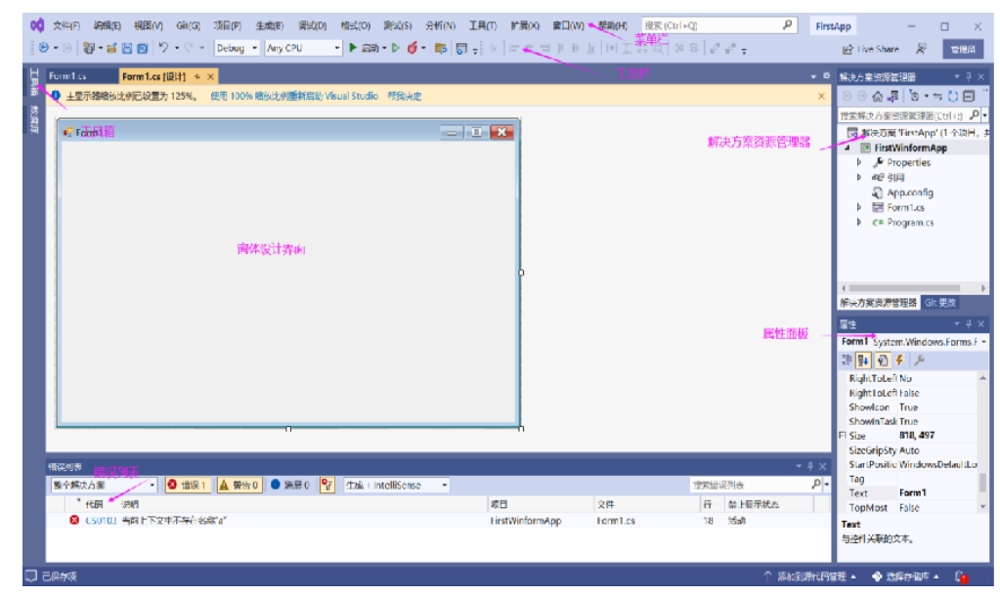
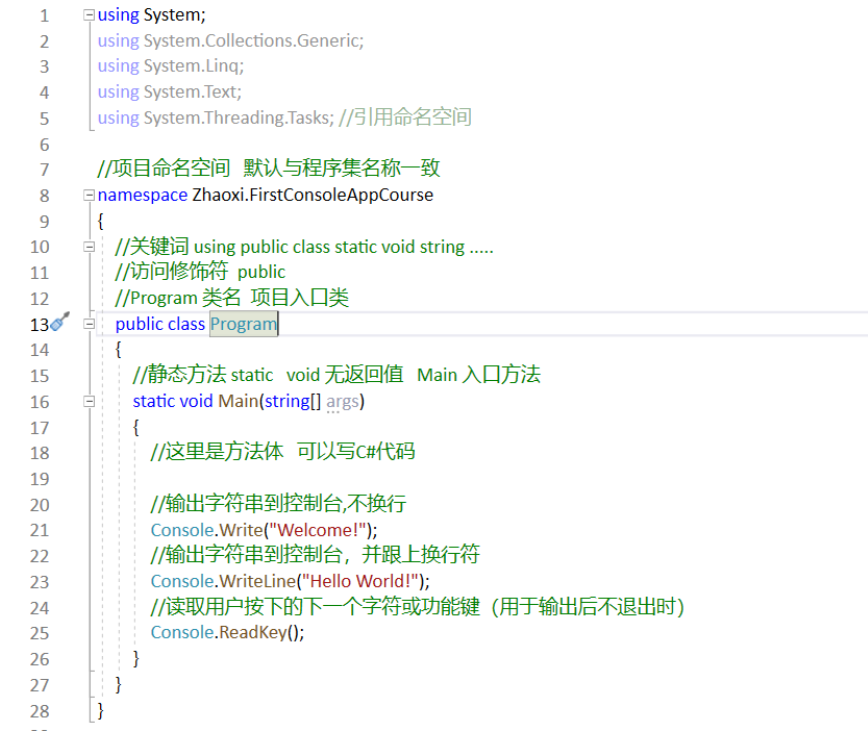
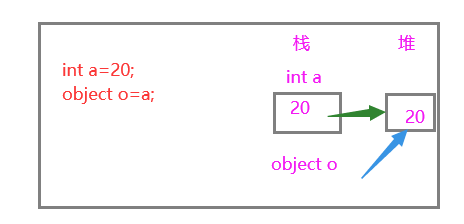
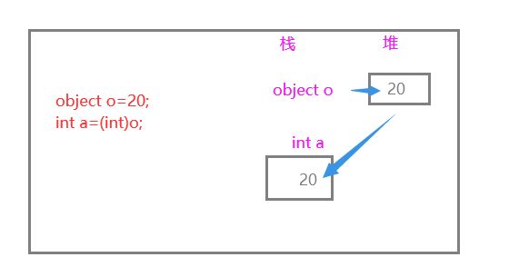

# 1. 基础准备
## 1.1 .Net相关概念

.Net：是一种用于构建多种应用的免费开源开发平台，可以在其平台上支持各种语言进行开发。.Net是.Net系列开发框架的总称。包含.NET Framework、.Net Core 、Xamarin.
.Net Framework:是一个由微软设计和开发的软件框架,主要用来开发可以在 Windows 平台上运行的应用程序。提供托管执行环境、简化的开发和部署以及与各种编程语言的集成。.NET Framework 支持 多种编程语言，如C#、VB.NET、C++等等。
.Net Core ：是适用于 Windows、[Linux](https://baike.baidu.com/item/Linux/27050?fromModule=lemma_inlink) 和 [macOS](https://baike.baidu.com/item/macOS/8654551?fromModule=lemma_inlink) 的免费、开源托管的计算机软件框架，是[微软](https://baike.baidu.com/item/%E5%BE%AE%E8%BD%AF/124767?fromModule=lemma_inlink)开发的第一个官方版本，具有跨平台能力的[应用程序](https://baike.baidu.com/item/%E5%BA%94%E7%94%A8%E7%A8%8B%E5%BA%8F/5985445?fromModule=lemma_inlink)开发框架。是跨平台的.Net平台，包含 .NET Framework 的类库，但与 .NET Framework 不同的是 采用Packages的管理方式。
Xamarin:是一款跨平台移动应用开发工具，它允许开发人员使用C#语言和.NET框架来构建iOS、Android和Windows Phone应用程序.
### C#是什么？
C# :发音为“**C Sharp**”, 是微软公司发布的一种**面向对象**、运行于**.Net Framework**和**.Net Core** 之上的**高级程序语言**。
**特点**：一种安全的、稳定的、简单的、面向对象开发、通用的语言，派生于C和C++，继承了它们的功能，但又去掉了一些复杂的特性。
C#是.Net Framework的一部分，可以在各种计算机平台上进行编译。
### C#与.Net的关系
.Net 是一个开发平台，提供了一个跨语言的统一编程环境，而 C# 是一种在 .Net 平台上使用的主流编程语言。
### C#能做什么？
通过C#编程语言，我们可以开发不同类型且安全可靠的应用程序，如：
桌面应用程序（Winform、WPF）
Web应用程序开发（Asp.Net）
游戏开发（C#与Unity）
移动应用程序开发（使用Xamarin，开发IOS、Android和Windows平台的原生移动应用程序）
## 1.3 常见项目类型介绍
### 控制台应用程序
```
控制台程序是为了兼容[DOS](https://baike.baidu.com/item/DOS/32025?fromModule=lemma_inlink)
程序而设立的，能够运行在MS-DOS环境中的程序。这种程序的执行就好像在一个DOS窗口中执行一样，
**没有自己的界面**。   只是通过**字符串**来显示或者监控程序。
控制台程序常常被应用在**测试、监控**等用途，用户往往只关心数据，不在乎界面。
```
### Winform应用程序（Windows窗体应用）
 WinForm 是 **Windows Form** 的简称，它是一种 .NET Framework 的客户端开发技术，用来开发可以在我们电脑中运行的应用程序。一般使用 C# 编程，是 C# 语言**最常见**的应用。
使用 C# 语言编写的 Windows 应用程序与 Windows 操作系统的界面类似，每个界面都是由窗体构成的，并且能通过鼠标单击、键盘输入等操作完成相应的功能。WinForm**支持可视化设计，简单易上手**。
### WPF应用程序(WPF应用)
**WPF** (Windows Presentation Foundation) 是一种用于开发 Windows 应用程序的框架。它提供了一个用于创建图形化用户界面 (GUI) 的强大的组件，可以在 Windows 操作系统上运行。 WPF 应用程序可以使用各种常用的编程语言(如 C# 和 VB.NET)开发，并且能够利用计算机硬件加速功能来提供流畅的图形呈现。
# 2.项目相关基础知识
## Winform项目窗口
Winform项目窗体设计窗口组成：

**菜单、工具栏**
**解决方案资源管理器**：一个或多个项目容器
**属性面板**：控件的属性设置面板
**工具箱** ：提供控件或组件面板，可以从中直接拖动到界面上
**错误列表** ：罗列代码中的错误，可以定位与找到错误

## Winform项目结构
Winform项目结构组成：
（1）**引用**：包括所有的系统库文件的引用依赖
（2）**App.config**：当前项目的配置文件
（3）**Form1.cs**：当前窗体的代码后台类文件
     **Form1.Designer.cs**：当前窗体的控件布局源码
     **Form1.resx**：当前窗体的资源文件（图片、图标、资源等）
**注意**：
Form1.cs和Form1.Designer.cs都定义了Form1类，该类使用了**_Partial_**关键词声明，其定义的类可以在多个地方被定义，最后编译的时候会被当作一个类来处理。因此两个文件各司其职，最后合并为一个类编译。
（4）**Program.cs**：当前项目程序的主入口，启动项目，运行初始窗口
## 项目编译、调试与运行
当写好程序后，你想要运行测试你的程序，你需要先编译。
操作：右击项目，选择“生成”即可
如果程序编写无误，状态栏会显示“生成成功”，即编译成功。
如果，程序语句有错误，错误列表会提示错误信息，并编译失败。
改正错误，然后重新生成，直到生成成功为止。
然后，点击“启动l"按钮或按F5即可运行项目，这时即弹出一个命令行窗口，并显示打印结果。
## C#程序类结构

**_行号_** ：左侧数字
**_关键词_** ： 蓝色单词，如：**using namespace public class static void string**
**引用命名空间**： using System;
**_类名_**: Program  一个类包含一个或多个方法、属性、变量等
**_命名空间_**
  namespace **Zhaoxi.FirstConsoleAppCourse**  当前程序的命名空间，默认与项目同名
**_方法_**名：Main
**方法体**：方法的具体代码
**Main:程序的入口点** ,  如**控制台、Winform应用程序**
**//注释描述** ：单行注释，用来对程序代码语句进行描述说明，不会执行

# 3.基础语法
## 3.1 基本语法知识
**using 关键字**
```
以 using 关键字开头的一行代码，如：using System;  称作using语句，C#程序中以using语句开头的，主要用来引入程序相关的命名空间，一个类中可以包含多个using语句。
```
**class关键字**
```
C#中用class关键字来声明一个类，后面跟上类名，class与类名之间一定要使用一个空格来间隔。
```
**注释**
注释用于对代码进行解释说明，在编译 C# 程序时编译器会忽略注释的内容。
C# 中有单行注释和多行注释两种：
单行注释，以“//”开头，后面注释文本内容，没有结束符，只对当行有效

```
 //这里是方法体
```
多行注释，以 `/*`开头，并且以 `*/`结尾，`/*`和`*/`之间的所有内容都属于注释内容，如：
```
/*
 这里是多行注释
文本
 */
```
文档注释，对类、属性、方法经常加有文档注释
```
  /// <summary>
  /// 文档注释
  /// </summary>
```
**成员变量**
   成员变量是用来存储类中要使用的数据的。
**成员函数**
```
成员函数（也可以称为成员方法）是执行特定任务的语句集，一个类的成员函数需要在类中声明。如上面代码中的GetTeacherInfo()就是成员方法。
```
**标识符**
```
标识符是用来为类、变量、函数或任何其他自定义内容命名。C# 中标识符的定义规则如下所示：
```

-  标识符必须以**英文字母**`**A-Z、a-z**`**开头**，后面可以跟英文字母`A-Z、a-z`、数字`0-9`或下划线`_`； 
-  标识符中的**第一个字符**不能是数字； 
-  标识符中**不能包含**空格或特殊符号，例如`? - + ! @ # % ^ & * ( ) [ ] { } . ; : " ' / \`，但是可以使用下划线`_`； 
-  标识符**不能是 C# 关键字**。 
## 3.2 C#关键字
C# 中的关键字是编译器**预先定义**好的一些单词，也可以称为保留字或者保留标识符，这些关键字对编译器有**特殊的意义**，**不能**用作标识符，除非它们有一个 @ 前缀。
在 C# 中，有些关键字在代码的上下文中具有特殊的意义，例如 get 和 set，这样的关键字被称为**上下文关键字**（contextual keywords）。一般来说，C# 语言中新增的关键字都会作为上下文关键字，这样可以避免影响到使用旧版语言编写的 C# 程序。

| 保留关键字 |  |  |  |  |  |  |
| --- | --- | --- | --- | --- | --- | --- |
| abstract | as | base | bool | break | byte | case |
| catch | char | checked | class | const | continue | decimal |
| default | delegate | do | double | else | enum | event |
| explicit | extern | false | finally | fixed | float | for |
| foreach | goto | if | implicit | in | in (generic modifier) | int |
| interface | internal | is | lock | long | namespace | new |
| null | object | operator | out | out (generic modifier) | override | params |
| private | protected | public | readonly | ref | return | sbyte |
| sealed | short | sizeof | stackalloc | static | string | struct |
| switch | this | throw | true | try | typeof | uint |
| ulong | unchecked | unsafe | ushort | using | virtual | void |
| volatile | while |  |  |  |  |  |
| 上下文关键字 |  |  |  |  |  |  |
| add | alias | ascending | descending | dynamic | from | get |
| global | group | into | join | let | orderby | partial (type) |
| partial (method) | remove | select | set |  |  |  |

## 3.3 变量
变量：存储数据的名字，有特定类型，决定变量内存的大小和布局 。
变量可以理解为是我们程序可以操作的内存区域的名称。
在 C# 中每个变量都有自己**特定的类型**，这个类型确定了变量所占内存的大小、布局、取值范围以及可以对该变量执行的操作。
变量可以当作一种通过符号（变量名）表示某个内存区域的方法，变量的值可以更改，并且可以多次重复使用。
**声明语法**：数据类型 变量名列表(可以一个或个多变量名，变量名之间用逗号隔开)

```
int a, b, c;
float d, e, f;
```
C#变量命名：不是随意取，有命名规范

-  变量名中可以包含英文字母a-z, A-Z、数字0-9和下划线_； 
-  变量名只能以英文字母a-z, A-Z或下划线_开头，不能以数字开头； 
-  变量名中不允许使用空格； 
-  变量名不能是任何 C# 中的保留字或关键字，例如 char、float 等。 

**初始化变量**
C# 中变量可以通过等号(=)后跟一个常量表达式的形式进行初始化（赋值），
语法格式如下：**变量名=值;**
如：

```
int x,y;
x=12;
y=5;
```
也可以在变量声明时直接进行初始化，语法格式如下：**数据类型 变量名=值;**
如：
```
int a=123;
float f=2.3f;
```
_注_：声明变量并初始化是一个良好的习惯，不然可能会产生意外的执行结果。
**变量接收用户输入信息**
用**Console**类提供的**ReadLine()**方法可以接收用户输入，将其输入内容存储到变量中
```
 int a=0;
 Console.WriteLine("请输入变量a的值：");
 a =int.Parse( Console.ReadLine());
 Console.WriteLine("变量a的值是："+a);
```
ReadLine()方法接收的信息是字符串格式的，所以需要将字符串转换为int类型。
## 3.4 C#数据类型
C# 语言中内置了一些基本的数据类型，数据类型用来指定程序中变量可以存储的数据的类型，C# 中的数据类型可以大致分为三类：
值类型（Value types）；
引用类型（References types）；
指针类型（Pointer types）。
### 值类型
C# 中的值类型是从 **System.ValueType** 类中派生出来的，对于值类型的变量我们可以直接为其分配一个具体的值。
当声明一个值类型的变量时，系统会自动分配一块儿内存区域用来存储这个变量的值，不同类型的其占有的内存大小也不尽相同。
C#中的值类型分为：**整型、浮点型、布尔型、字符型**。

| 类型 | 描述 | 范围 | 默认值 |
| --- | --- | --- | --- |
| bool | 布尔值 | True 或 False | False |
| byte | 8 位无符号整数 | 0 到 255 | 0 |
| char | 16 位 Unicode 字符 | U +0000 到 U +ffff | '\\0' |
| decimal | 128 位精确的十进制值，具有 28~29 个有效位数 | (-7.9 x 1028 到 7.9 x 1028) / 100 到 28 | 0.0M |
| double | 64 位双精度浮点型 | (+/-)5.0 x 10-324 到 (+/-)1.7 x 10308 | 0.0D |
| float | 32 位单精度浮点型 | -3.4 x 1038 到 + 3.4 x 1038 | 0.0F |
| int | 32 位有符号整数类型 | -2,147,483,648 到 2,147,483,647 | 0 |
| long | 64 位有符号整数类型 | -9,223,372,036,854,775,808 到 9,223,372,036,854,775,807 | 0L |
| sbyte | 8 位有符号整数类型 | -128 到 127 | 0 |
| short | 16 位有符号整数类型 | -32,768 到 32,767 | 0 |
| uint | 32 位无符号整数类型 | 0 到 4,294,967,295 | 0 |
| ulong | 64 位无符号整数类型 | 0 到 18,446,744,073,709,551,615 | 0 |
| ushort | 16 位无符号整数类型 | 0 到 65,535 | 0 |

#### 整型
整型：用来存储整数，不含小数，根据存储容量大小又分为不同的类型，还分有符号和无符号整数。 如：数量、长度、年龄、编号等等。
**有符号整数**：sbyte、short、int、long        **无符号整数**：byte、ushort、uint、ulong
```
 //sbyte b1 = -200; // error 超出范围
 sbyte b1 = -100; // 正确
 short num1 = 234;
 int count = 23456;
 //uint length = -34567;//error 超出范围
 int length1 = -34567;//正确
 //获取类型占用的字节数   必须是是一个非托管类型的名称，如int,byte,uint,long.....
 int size = sizeof(int);
```
#### 浮点型
用来存储包含**整数部分和小数部分**的数据，根据精度不同，浮点型共分为：**float** (单精度浮点型)，**double**(双精度浮点型)和**decimal**(高精度浮点型)。
**float**   精度7位有效数字               32位   单精度  有精度损耗  0.0**F**   4字节
**double** 精度**16**有效数字                64位  双精度  有精度损耗  0.0**D**  8字节         Double
**decimal** (精确) 最多有**28~29**位有效数字  128位  双精度  无损耗      0.0**M**  16字节        Decimal
```
float f1 = 4.5f;//float类型以f或F结尾
double d1 = 2.5;//默认是double类型
double d2 = 5.6d;//double类型以D或d结尾
decimal money = 53.45m;//decimal类型是M或m结尾   价格、金额、精确值
```
#### **布尔类型**
bool,只有两个值：true 或 false，常用于条件判断语句中条件表达式的结果或表示是或否的值。默认值为false
```
   bool bl= true;
   int count = 3;
   bool blAdd = (count >0); //count是否大于0   ----true
```
#### 字符型
char,是System.Char类型的别名，表示一个Unicode字符，占2个字节(16位)。 默认值是 ‘\0’
char本质上就是16位的无符号整数值，范围是0~65535，与ushort的范围是一样的。
```
//char 字符   
char c = 'A';
ushort intC = c;//  65
```
**转义字符**
有一些字符无法通过字面的意思来进行解释，这时候就可以使用转义字符。
转义字符是以 \开始，后边跟着一个有特殊意义的字符。
如： '\n' 表示换行符  '\' 表示\
#### 可空类型 Nullable
C# 提供了一个特殊的数据类型，**nullable** 类型（可空类型），可空类型可以表示其基础值类型正常范围内的值，再加上一个 null 值。
可空类型用于处理可空的值类型时特别适用。
如：int?  即 Nullable 表示可空的Int32，可以是int取值范围内的值，也可以是null值
    bool? 类型的变量可以赋值为true，false,或 null.  float? double? decimal?.....
```
//可空类型
decimal? count = null;
count = 23;
bool? bl = null;
bl = false;
```
**Null合并运算符（??）**
把操作数类型隐式转换为另一个可空或不可空的值类型。
```
 //??运算符
decimal? count=null;
decimal newCount = count ?? -1;//如果count为null,则把-1赋给newCount,如果不为空，就把count赋给newCount
decimal count1=12;
decimal newCount1 = count1 ?? -1;
Console.WriteLine(newCount);
Console.WriteLine(newCount1);
//输出的结果分别是：
-1
12
```
#### 枚举
enum 由一组具有独立标识符（名称）的整数类型常量构成。用enum关键字声明，枚举可以定义在类内部，也可以定义在类外部。
语法格式如下所示：
```
enum enum_name
{
  enumeration list;
}
```
其中，enum_name 为枚举类型名称；enumeration list 为枚举类型中的成员列表，其中包含若干使用逗号分隔的标识符，每个标识符都代表了一个整数值。
在使用枚举类型时有以下几点需要注意：

-  枚举类型中**不能定义方法**； 
-  枚举类型具有固定的常量值； 
-  枚举类型可以遍历。 
```
enum RoleType
{
   管理员,
   教务人员,
   教师,
   学生
}
若没有显式指定枚举元素值，默认从0开始，依次是0,1,2,....  也可以显式指定。
enum RoleType
{
    管理员=1,
    教务人员=2,
    教师=4,
    学生=3
}
 //声明一个RoleType的变量
 RoleType roleType = RoleType.管理员;
 //获取枚举变量的值
 int val = (int)roleType;

 int typeVal = 3;
  //获取枚举名称
 string typeName=Enum.GetName(typeof(RoleType), typeVal);
  //根据值获取枚举对象
  RoleType type1= (RoleType)Enum.Parse(typeof(RoleType), typeVal.ToString());
  //根据枚举名称获取枚举对象
  RoleType type2=  (RoleType)Enum.Parse(typeof(RoleType), typeName);

 //获取枚举名称数组
 string[] names = Enum.GetNames(typeof(RoleType));
 //获取枚举值数组
 var  values=Enum.GetValues(typeof(RoleType));
```
#### 结构体
在 C# 中，结构体也被称为结构类型，它是一种可封装**数据**和**相关功能**的值类型，在语法上结构体与类（class）非常相似，它们都可以用来封装数据，并且都可以包含成员属性和成员方法。
要定义一个结构体需要使用 **struct** 关键字，每个结构体都可以被看作是一种新的**数据类型**，其中可以包含**多个成员**（成员属性和成员方法）。
下面声明一个Student的结构体：
```
 public struct Student
 {
    //字段
    public int stuId;
    //属性
    public string StudentName { get; set; }
    public int age;
    //方法
    public void GetStudentInfo()
    {
        Console.WriteLine("编号："+stuId+"; 姓名："+StudentName+";年龄："+age);
    }
    //带参构造函数，必须初始化所有成员
    public Student(int id,string name,int age)
    {
       stuId = id;
       StudentName = name;
       this.age = age;
    }
 }
```
在设计结构体时有以下几点需要注意：

- **不能**为结构体声明无参数的构造函数，因为每个结构体中都**已经默认创建了**一个隐式的、无参数的构造函数；
- **不能**在声明成员属性时对它们进行初始化，静态属性和常量除外；
- 结构体的构造函数**必须初始化**该结构体中的所有成员属性；
- 结构体**不能从其他类或结构体中继承**，**也不能作为类的基础类型**，但是结构类型**可以实现接口**；
- 结构成员**不能**指定为 abstract、virtual 或 protected
- **不能**在结构体中**声明析构函数**。
- 当您使用 new 操作符创建一个结构对象时，会调用适当的构造函数来创建结构。与类不同，结构可以不使用 new操作符即可被实例化。
如果不使用 new 操作符，只有在所有的字段都被初始化之后，对象才被使用。
```
//创建结构体对象
//1.使用无参构造函数
Student student = new Student();
student.stuId = 101;
student.StudentName = "李明";
student.age = 22;
student.GetStudentInfo();

//2.使用带参构造函数
Student student3 = new Student(103, "王五", 26);
student3.GetStudentInfo();

//结构体中若定义了属性，声明时不使用new，会编译通不过，若没有属性，只有字段，则可以不使用new。
```
应用：描述一些轻量级对象时，用结构体可提高效率，成本更低，存储在栈中，访问速度更快
### 引用类型
引用类型的变量中**并不存储**实际的数据值，而是存储的对数据（对象）的**引用**。
换句话说就是——引用类型的变量中存储的是数据在**内存中的位置**。
当多个变量都引用同一个内存地址时，如果其中一个变量**改变了内存中数据的值**，那么所有引用这个内存地址的变量的**值都会改变**。
C# 中内置的引用类型包括 **Object**（对象）、**Dynamic**（动态）和 **string**（字符串）。
#### 1) 对象类型（Object）
**对象类型**是 C# 通用类型系统（Common Type System：CTS）中所有数据类型的**最终基类**，**object** 是 System.Object 类的别名。任何类型的值都可以分配给object类型，但是在分配值之前，需要对类型进行转换。
将值类型转换为对象类型的过程被称为“**装箱**”，反之将对象类型转换为值类型的过程则被称为“**拆箱**”。
```
int val = 123; //存储在栈上
object oId = val;//装箱  --->存储到堆上
int intVal = (int)oId;//拆箱 --->再存储到栈上
```
**注意**:只有经过装箱的数据才能进行拆箱。
**堆**：在c#里面其实叫**托管堆**。托管堆不同于堆，它是由**CLR**（公共语言运行库(Common Language Runtime)）管理，当堆中满了之后，会自动清理堆中的垃圾。所以，做为.net开发，我们不需要关心内存释放的问题。
**栈**：就是**堆栈**,简称栈。是一种**后进先出**的数据结构。
在内存中，有两个存储区（堆区，栈区）。
栈区：存放**方法的参数、局部变量、返回数据**等值，由编译器自动释放
堆区：存放着**引用类型的对象**，由CLR释放
装箱： 对值类型在堆中分配一个对象实例，并将该值复制到新的对象中。
    1.从堆中为新生成的引用对象分配内存
    2.将值类型的数据拷贝到刚刚分配的内存中
    3.返回堆中新分配对象的地址。这个地址就是一个指向对象的引用

拆箱：
    1.获取托管堆中属于值类型那部分字段的地址
    2.将引用对象中的值拷贝到位于栈上的值类型实例中。


#### 2) 动态类型（Dynamic）
可以在动态类型的变量中存储**任何类型**的值，这些变量的类型检查是在**程序运行时**进行的. **类型不安全**
**声明语法**：dymamic 变量名=值;
```
 dynamic name = "Jack";
 dynamic num = 203;
 dynamic bl=false;
```
动态类型与对象类型类似，但对象类型变量的类型检查是在**编译时**进行的，而动态类型变量的类型检查则是在程序**运行时**进行的。
#### 3) 字符串类型（String）
字符串类型的变量允许您将一个字符串赋值给这个变量，字符串类型需要通过 **string** 类来创建，string 类是 System.String 类的别名，它是从对象（Object）类型中派生的。在 C# 中有两种定义字符串类型的方式，分别是使用`**" "**`和`**@" "**`。
```
//使用" "声明
string sname = "Jack";
//使用@" "声明
string path = @"d:\folder\imgs";
```
使用`@" "`形式声明的字符串称为“逐字字符串”，逐字字符串会将转义字符`\`当作普通字符对待。在`@" "`形式声明的字符串中可以任意使用换行，换行符及缩进空格等都会计算在字符串的长度之中。
**null** 空引用
**null**:不引用内存中任何对象的空引用。引用类型变量的默认值，可以赋值给任何引用变量
一个变量赋值为null,是不会分配存储空间的。
**null与“”的区别**： “”会分配存储空间，长度为0,而null则不会。
**“”与string.Empty** ，实际值是一样的
## 3.5 类型转换
数据类型转换就是将**一种类型的数据转换为另一种类型**，在 C# 中有两种形式的类型转换方式，分别是**隐式类型转换**和**显式类型转换**。
#### 隐式类型转换
隐式类型转换是由 C# 以**类型安全**的方式执行的，转换的过程中**不会导致数据丢失**。
例如从较小的整数类型（例如 int）转换到较大的整数类型（例如 long），从派生类转换为基类。
```
short sValue = 123;
int count = sValue;
long bigValue = count;
float fVal = 3.5f;
double dVal = fVal;
//decimal decVal = dVal; //double/float类型不能隐式转换为decimal
float f2 = count;
double dVal2 = count ;
decimal decVal1 = bigValue;
```
#### 显式类型转换
显式类型转换也叫**强制类型转换**，这种转换需要使用`(type)value`的形式或者预定义函数显式的完成，显式转换需要用户**明确的指定**要转换的类型，而且在转换的过程中**可能会造成数据丢失**。
常应用于：大范围转小范围 、浮点型转整型、浮点型与decimal 、数值字符串转值类型
例如将 double 类型转换为 int 类型、将double转换为float.......
1.**(type)value**形式强转
```
double dValue = 3.56;
int intValue = (int)dValue;//  3
```
上例中，转换前的值是3.56，转换后的值为3. 造成了数据丢失。
2.**type.Parse(string)**  将字符串转换为对应的值类型
```
string strValue = "12.5";
float fValue=float.Parse(strValue);//12.5 
string strDec= "789.50";
decimal decValue=decimal.Parse(strDec);
```
3.**type.TryParse(string,out type 变量)** 这种转换，如果不成功也不会异常
```
 string str = "12.89";
 int reInt = 0;
 int.TryParse(str, out reInt);

 string strValue = "34.9";
 float.TryParse(strValue,out float reFloat);
```
4.**Convert.ToType(value)** 将一种类型转换为指定类型
```
 object oValue = 120;
 byte byteValue = Convert.ToByte(oValue);//转换为byte
 string strValue = "7896";
 int intValue=  Convert.ToInt32(strValue);//转换为int
 bool boolValue = false;
 string blValue = boolValue.ToString();//转换为字符串
 double dValue = 34.89;
 float fValue=Convert.ToSingle(dValue);//将double转换为float
```
C# 中提供了一系列**内置**的类型转换方法：

| 方法 | 描述 |
| --- | --- |
| ToBoolean | 将类型转换为布尔型 |
| ToByte | 将类型转换为字节类型 |
| ToChar | 将类型转换为单个 Unicode 字符类型 |
| ToDateTime | 将类型（整数或字符串类型）转换为日期时间的结构 |
| ToDecimal | 将浮点型或整数类型转换为十进制类型 |
| ToDouble | 将类型转换为双精度浮点型 |
| ToInt16 | 将类型转换为 16 位整数类型 |
| ToInt32 | 将类型转换为 32 位整数类型 |
| ToInt64 | 将类型转换为 64 位整数类型 |
| ToSbyte | 将类型转换为有符号字节类型 |
| ToSingle | 将类型转换为浮点数类型 |
| ToString | 将类型转换为字符串类型 |
| ToType | 将类型转换为指定类型 |
| ToUInt16 | 将类型转换为 16 位无符号整数类型 |
| ToUInt32 | 将类型转换为 32 位无符号整数类型 |
| ToUInt64 | 将类型转换为 64 位无符号整数类型 |

## 3.6 运算符
**运算符**其实就是一个符号，用来告诉编译器执行特定的数学或逻辑运算。
C#中内置了很多运算符，大致分为：算术运算符、关系运算符、逻辑运算符、位运算符、赋值运算符、其它运算符。
### 算术运算符
算术运算符就是完成特定算术运算的符号，C#中支持的算术运算符有：（a=30,b=20）

| 运算符 | 描述 | 实例 |
| --- | --- | --- |
| + | 加法运算符，对运算符左右两边的操作数执行加法操作 | a +b 值为 50 |
| - | 减法运算符，对运算符左右两边的操作数执行减法操作 | a - b 值为 10 |
| * | 乘法运算符，将运算符左右两边的操作数相乘 | a * b 值为 600 |
| / | 除法运算符，使用运算符左边的操作数除以右边的操作数 | a / b 值为 1 |
| % | 取模运算符，整除后的余数 | a % b 值为 10 |
| ++ | 自增运算符，整数值增加 1 | a++ 值为 31 |
| -- | 自减运算符，整数值减少 1 | a-- 值为 29 |

### 关系运算符
关系运算符用来**比较**运算符左右两边的操作数，C#中支持的关系运算符有：（比如A=5,B=4）

| 运算符 | 描述 | 实例 |
| --- | --- | --- |
| == | 相等 检查两个操作数的值**是否相等**，如果相等则条件为真 | (A == B) 不为真 |
| != | 不等 检查两个操作数的值是否相等，如果**不相等**则条件为真 | (A != B) 为真 |
| > | 大于 检查左操作数的值是否**大于**右操作数的值，如果是则条件为真 | (A > B) 为真 |
| < | 小于 检查左操作数的值是否**小于**右操作数的值，如果是则条件为真 | (A < B) 不为真 |
| >= | 大于等于 检查左操作数的值是否**大于或等于**右操作数的值，如果是则条件为真 | (A >= B) 为真 |
| <= | 小于等于 检查左操作数的值是否**小于或等于**右操作数的值，如果是则条件为真 | (A <= B) 为不为真 |

### 逻辑运算符
C#中支持的逻辑运算符有：&& || !  （如A为false,B为true）

| 运算符 | 描述 | 实例 |
| --- | --- | --- |
| && | 逻辑与，如果两个操作数都为真，则结果为真 | (A && B) 为假 |
| &#124;&#124; | 逻辑或，如果两个操作数中有任意一个为真，则结果为真 | (A &#124;&#124; B) 为真 |
| ! | 逻辑非，用来对操作数的逻辑状态取反，如果结果为真，那么取反后则为假 | !(A && B) 为真 |

### 位运算符
位运算符用来对**二进制位**进行操作,&、|、^的真值情况：

| p | q | p & q | p &#124; q | p ^ q |
| --- | --- | --- | --- | --- |
| 0 | 0 | 0 | 0 | 0 |
| 0 | 1 | 0 | 1 | 1 |
| 1 | 1 | 1 | 1 | 0 |
| 1 | 0 | 0 | 1 | 1 |

假设 a=30，b= 13，它们的二进制格式和位运算结果如下：
```
int a = 40; //二进制 0010 1000
int b = 13; //二进制 0000 1101
int c = a & b; //0000 1000  --8
int d = a | b; //0010 1101  --45
int e = a ^ b; //0010 0101   --37
int f = ~a;    //1101 0111  --41
//位移
int g = a << 2; //1010 0000  --160  左移2位  *4
int h = b >> 2; //0000 0011  --3    右移2位  /4
```
C#中支持的位运算符有：

| 运算符 | 描述 | 实例 |
| --- | --- | --- |
| & | 按位与，对两个操作数的二进制位进行按位与运算，即当两个数对应的二进制位**均为 1 时，结果位为 1，否则为 0** | (A & B) 将得到 12，即为 0000 1100 |
| &#124; | 按位或，对两个操作数的二进制位进行按位或运算，即当两个数对应的二进制位**有一个为 1 时，结果就为 1，否则为 0** | (A &#124; B) 将得到 61，即为 0011 1101 |
| ^ | 按位异或，对两个操作数的二进制位进行按位异或运算，即当两个数对应的二进制位**不同时，结果为 1，否则为 0** | (A ^ B) 将得到 49，即为 0011 0001 |
| ~ | 按位取反，该运算符具有"翻转"位效果，即 **0 变成 1，1 变成 0**，包括符号位 | (~A ) 将得到 -61，即为 1100 0011 |
| << | 二进制**左移**运算符，左操作数的值向左移动右操作数指定的位数 | A << 2 将得到 240，即为 1111 0000 |
| >> | 二进制**右移**运算符，左操作数的值向右移动右操作数指定的位数 | A >> 2 将得到 15，即为 0000 1111 |

### 赋值运算符
赋值运算符顾名思义就是用来**为变量赋值的**,最常用的就是 **=** ，C#中支持的赋值运算符有：

| 运算符 | 描述 | 实例 |
| --- | --- | --- |
| = | 最简单的赋值运算符，把右边操作数的值赋给左边的操作数 | C = 12 将把12赋给 C |
| += | 加且赋值运算符，把右边操作数加上左边操作数的结果赋值给左边操作数 | C += A 相当于 C = C + A |
| -= | 减且赋值运算符，把左边操作数减去右边操作数的结果赋值给左边操作数 | C -= A 相当于 C = C - A |
| *= | 乘且赋值运算符，把右边操作数乘以左边操作数的结果赋值给左边操作数 | C _= A 相当于 C = C _ A |
| /= | 除且赋值运算符，把左边操作数除以右边操作数的结果赋值给左边操作数 | C /= A 相当于 C = C / A |
| %= | 求模且赋值运算符，求两个操作数的模并赋值给左边操作数 | C %= A 相当于 C = C % A |
| <<= | 左移且赋值运算符 | C <<= 2 等同于 C = C << 2 |
| >>= | 右移且赋值运算符 | C >>= 2 等同于 C = C >> 2 |
| &= | 按位与且赋值运算符 | C &= 2 等同于 C = C & 2 |
| ^= | 按位异或且赋值运算符 | C ^= 2 等同于 C = C ^ 2 |
| &#124;= | 按位或且赋值运算符 | C &#124;= 2 等同于 C = C &#124; 2 |

```
int a = 32;
int b =10;
b+= a; //b=b+a; 44
b -= 5;//b=b-5   39
b *= 3; //b=b*3  117
b /= 3;//b=b/3   39
b %= 10;//b=b%10  9

int c = 12; // 0000 1100 
c <<= 2; //0011 0000  c=c<<2   48   左移赋值运算符
c >>= 2; //0000 1100 c=c>>2   12   右移赋值运算符

int d = 10;
//按位与赋值运算符 &=
d &= 2; //d=d&2  d: 0000 1010  2:0000 0010  --0000 0010 -->2

//按位异或赋值运算符 ^=
int e = 15;
e ^= 4; //e=e^4   e:0000 1111 4:0000 0100  --0000 1011  -->11

//按位或赋值运算符 |=
int f = 20;
f |= 5;  //f=f|5  f:0001 0100  5:0000 0101  -- 0001 0101  -->21
```
### 其它运算符
除去上面介绍的运算符之外，C# 中还支持一些其他的重要运算符：

| 运算符 | 描述 | 实例 |
| --- | --- | --- |
| **sizeof()** | 返回数据类型的大小（字节数） | sizeof(int)，将返回 4 |
| **typeof()** | 返回 class 的类型 | typeof(Student); |
| & | 返回变量的地址 | &a 将得到变量的实际地址 |
| * | 变量的指针 | *a; 将指向一个变量。 |
| **? :** | 三元（三目）运算符 | a>b ? X : Y; 如果条件为真，则值为 X : 否则值为 Y |
| **is** | 判断对象是否为某一类型 | if( c is Button) // 判断 c 是否是一个Button类型的对象 |
| **as** | 强制转换，即使转换失败也不会抛出异常。 | Teacher tea= obj as Teacher; 将obj强转为Teacher类型 |

```
获取数据类型的大小 (字节数)
int intSize =sizeof(int); //4
int floatSize=sizeof(float); //4
int decimalSize=sizeof(decimal);//16
int enumSize = sizeof(RoleType);//4
int charSize=sizeof(char);//2
获取指定的类型
Type typeInt= typeof(int);
Type typeString= typeof(string);
Type typeFloat= typeof(float);
Type  typeRoleType=typeof(RoleType);
Type typeStudent= typeof(Student);
Type typeTeacher= typeof(Teacher);

 ?:  三目运算符
 int a = 12;
 //如果a大于18，grade="A"，否则grade="B"
 string grade = a > 18 ? "A" : "B";

is 判断对象是否为某一类型
object a = 12;
if(a is int)
{
    Console.WriteLine("a是整型");
}
Teacher tea= new Teacher();
if(tea is Teacher)
{
    Console.WriteLine("tea是Teacher类型");
}

as 强制转换
object obj = "123";
string str=obj as string;
```
### 运算符的优先级
    C#中支持多种类型的运算符，当这些不同类型的运算符出现在同一个表达式中时，就必须遵循运算符的优先级来进行运算，才能保证运算的合理性和结果的正确性、唯一性。运算符的优先级决定了表达式中各个部分执行运算的**先后顺序**。
结合方向 ：
有的是从左至右，有的是从右至左。一般单目运算符是从右至左
双目运算符是从左至右，三目运算符是从右至左。
所有的赋值运算符是从右至左。
优先级顺序：
0  () . []

1. -、++、--、！、~、(type)、sizeof   单目运算符  右至左
2. *、/、%   双目运算符  左至右
3. +、-      双目运算符  左至右
4. << 、 >>、 双目运算符  左至右
5. >=、<、<=  双目运算符  左至右
6. == 、!=    双目运算符  左至右
7. &          双目运算符  左至右
8. |           双目运算符  左至右
9. ^         双目运算符  左至右
10. &&       双目运算符  左至右
11. ||        双目运算符  左至右
12. ?:        三目运算符  右至左

13 所有赋值运算符      右至左
```
 int a = 5;
 int b=8, c = 9;
 int d = a + b * c;// 77 先算b*c,再与a相加，最后再赋值给d
 int e = b > c ? 1 : 0; // 0 从右至左，先判断b>c,如果为真则1赋值给e,否则0赋给e
 int f = (a + b) * c - d;//40 先a+b,结果*c，再-d,
 int g = ++a + b * (a - b); //-10 先算++a，则a=6 ,再a-b=-2,再与c相乘，等于-16，再前面的a相加，最终得-10
 bool h = (a > b) || (c > b); //true 先判断a>b,结果为false,再判断c>b,结果为true,然后再false||true,最后结果为true
```
## 3.7 常量
**常量**和前面的变量类似，唯一不同的是常量的值在程序的编译阶段就已经确定了，而且在程序的运行期间**不允许修改**。
常量可以是任何基本数据类型，例如整数常量、浮点常量、字符串常量等等。
### 定义常量
常量使用 **const** 关键字定义，语法格式如下所示：
**const 数据类型 常量名= 值;**
其中，常量名（类似于变量名）；值为常量的值。
定义常量，需要指定常量的数据类型，定义常量名，指定值。
```
//定义常量
const int len = 12;
const double pi = 3.14;
const char c = 'A';
int a = len + 5; //17
//len = 6; //常量值不能修改，但可使用
int r = 10;
double area = pi * r * r;//314   计算圆面积
```
### 整数常量
整数常量可以是**八进制、十进制**或者**十六进制**，可以使用**前缀**指定具体的进制，如**0x**`或`**0X**`表示十六进制，**0**表示八进制，**没有前缀**则表示**十进制**。
除了前缀外，整数常量**还可以包含后缀**，后缀可以是 **U 和 L** 的组合，U 和 L 分别表示 unsigned 和 long。
后缀既**可以大写也可以小写，而且可以以任意顺序进行组合**，但是**不能重复**。
```
const int len = 12;
43    // 十进制常量
0415  // 八进制常量
0x4a  // 十六进制常量
10   // int 类型常量
30u   //无符号 int 类型常量
30l   // 合法：long 类型常量
30ul  // 合法：无符号 long 类型常量
068   // 非法：8 不是一个八进制数字
032UU  // 非法：后缀不能重复
```
### 浮点常量
浮点常量由**整数部分、小数点、小数部分**和**指数部分**组成。您可以用**小数或指数**形式来表示浮点常量。
下面列举了一些浮点常量的示例：
```
const double pi = 3.14;
const double dd=3e3;//3000
double d2 = dd * 4;//12000
const float ff = 4.567f;
2.56          // 合法
314159E-5     // 合法
510E         // 非法：不完全指数
210f         // 非法：没有小数或指数
```
当使用小数形式表示浮点常量时，必须包含**小数点、指数**或同时包含两者。
当使用指数形式表示浮点常量时，必须包括**整数部分、小数部分**或同时包含两者。有符号的指数使用 **e** 或 **E** 表示。
### 字符常量
字符常量需要使用**单引号**括起来，类似于定义字符串类型的变量，例如`'c'`。一个字符常量可以是一个普通字符（例如`'a'`）、转义序列（例如`'\t'`）或 Unicode 字符（例如`'\u02C0'`）。
在 C# 中，有些字符前面带有**一个反斜杠**，这样的字符具有特殊含义，如:`\n`用于表示换行符、`\t`表示制表符。
下表中列举了一些常用的转义字符：

| 转义序列 | 含义 |
| --- | --- |
| \\\\ | \\ 字符 |
| \\' | ' 字符 |
| \\" | " 字符 |
| \\a | Alert 或 bell |
| \\b | 退格键（Backspace） |
| \\f | 换页符（Form feed） |
| \\n | 换行符（Newline） |
| \\r | 回车 |
| \\t | 水平制表符 tab |
| \\v | 垂直制表符 tab |

```
 const  char c = 'a';
 const char c1 = '\t';
 Console.Write( "百度：\twww.baidu.com\r\n");
 Console.Write(c+","+c1+"\\? \\234\r\n");
```
### 字符串常量
字符串常量需要使用双引号`" "`或`@" "`引起来。字符串常量与字符常量相似，可以是纯字符、转义序列或 Unicode 字符。
```
const string ss = "www.taobao.com";
const string ss1 = @"Json";
```
## 3.8 条件分支结构
在C#编程中，条件分支结构有:条件判断分支、switch结构。
### if 语句
C# 中的 if 语句用于条件判断，其中包含一个**布尔表达式**，后面跟随着一段要执行的代码;
当布尔表达式为true时，后面跟随的代码就会执行，
```
//if 语句的语法格式：
if(布尔表达式)
{
    //表达式为true时要执行的代码块;
}
```
### if else 语句
C# 的 if else 语句同样用于条件判断，它比 if 语句中**多出了一个 else** 语句，当布尔表达式为假时，执行 else 语句块中的代码，
语法格式：
```
if(布尔表达式)
{
  //表达式为true时要执行的代码块;
}
else
{
  //表达式为false时要执行的代码块;
}
```
### if else if 语句
C# 的 if else if 语句：就是一个 if 语句后面跟随着一个或多个 **else if else** 语句，语句中可以包含**多个条件表达式**，程序会依次判断这些条件表达式，当条件表达式为真时则执行后面语句块中的代码；如果没有为真的条件表达式则执行 else 语句块中的代码。
其语法格式：
```
if(布尔表达式 1)
{
  //布尔表达式 1 为true时要执行的代码块;
}
else if(布尔表达式 2)
{
  //布尔表达式 2 为true时要执行的代码块;
}
else if(布尔表达式 3)
{
  //布尔表达式 3 为true时要执行的代码块;
}
...
else
{
  //当所有布尔表达式都为false时要执行的代码块；
}
```
需要注意的是，当布尔表达式为真，且成功执行它后面语句块中的代码后，**会跳出 if else if 语句**，语句中的其它部分**不会再被执行**
### switch分支
C# 中的 switch 语句有些类似于if else if语句，都可以根据表达式执行某个的语句块，其语法格式：
可能情况的值的数量，一般大于或等于3个情况，就可以使用switch.
```
switch(表达式)
{
    case value1:
               //表达式的值为 value1 时执行的代码
                break;
    case value2:
              //表达式的值为 value2 时执行的代码
              break;
    case value3:
             //表达式的值为 value3 要执行的代码
             break;
      ... ...
    default:
            //没有与表达式相匹配的值时，要执行的代码
           break;
}
```
使用 switch 语句时必须遵守以下规则：

-  switch 语句中表达式的值必须是一个**整型**、**字符串**或者**枚举类型**； 
-  在一个 switch 语句中可以有任意数量的 case 语句，每个 case 关键字后面要跟**一个值**和**一个冒号**； 
-  case 关键字后面的值必须与 switch 中表达式的值具有**相同的数据类型**，并且必须是一个**常量值**； 
-  当表达式的值等于某个 case 中的值时，就会执行 该case 后面的语句，在遇到 **break** 关键字时停止； 
-  当遇到 break 关键字时，就会跳转到 switch 语句以外； 
-  并不是每一个 case 语句后面都需要包含 break 关键字，如果 case 语句为空（case 语句后面没有要执行的代码），则可以不包含 break 关键字，这时程序会继续执行后续的 case 语句，直至遇到 break 关键字为止； 
-  switch语句只会执行某个case语句中的代码块； 
-  一个 switch 语句的末尾可以有一个**可选的** default（默认选项），当所有 case 语句都不能与表达式相匹配时则会执行 default 部分中的代码； 
-  C# 不支持从一个 case 语句跳转到另一个 case 语句。 
## 3.9 循环分支
在C#编程中，我们经常可能需要编写重复执行逻辑，所以需要用到循环分支。
C#中支持 ：for 循环、foreach 循环、while 循环和 do while 循环等循环语句。
### for循环
for 循环可以**重复执行**一段代码，而且**重复的次数**是可以设定的，多用于**确定重复次数**的循环处理，其语法格式：
```
for (初始化语句; 判断条件; 迭代器)
{
        // 循环主体代码
}
```
for 循环语句的执行流程：

-  首先执行**初始化语句**（通常是一个变量），并且**只执行一次**，在某些情况下初始化语句可以省略，只保留后面的分号即可； 
-  接下来进行**条件判断**，如果为 true，则执行循环主体，如果为假，则跳出 for 循环，执行 for 循环以外的代码； 
-  循环主体执行完成后，**更新迭代器的值**（自增或自减），然后再次进行条件判断，如果为true则**再次执行循环主体**，重复执行此步骤，直至判断条件为假，跳出循环。 
#### for嵌套循环
在 C# 中，循环语句还可以嵌套使用，也就是说我们可以在一个 for 循环内再使用一个或多个 for 循环。 
```
 //99乘法表
 for (int i = 1; i <= 9; i++)
 {
     for (int j = 1; j <= i; j++)
     {
         int re = i * j;
         string result = re.ToString().Length==1?re+" ":re.ToString();
         Console.Write("{0} x {1} = {2}   ", j, i, result);
     }
     Console.WriteLine();
 }
输出结果：
1 x 1 = 1
1 x 2 = 2    2 x 2 = 4
1 x 3 = 3    2 x 3 = 6    3 x 3 = 9
1 x 4 = 4    2 x 4 = 8    3 x 4 = 12   4 x 4 = 16
1 x 5 = 5    2 x 5 = 10   3 x 5 = 15   4 x 5 = 20   5 x 5 = 25
1 x 6 = 6    2 x 6 = 12   3 x 6 = 18   4 x 6 = 24   5 x 6 = 30   6 x 6 = 36
1 x 7 = 7    2 x 7 = 14   3 x 7 = 21   4 x 7 = 28   5 x 7 = 35   6 x 7 = 42   7 x 7 = 49
1 x 8 = 8    2 x 8 = 16   3 x 8 = 24   4 x 8 = 32   5 x 8 = 40   6 x 8 = 48   7 x 8 = 56   8 x 8 = 64
1 x 9 = 9    2 x 9 = 18   3 x 9 = 27   4 x 9 = 36   5 x 9 = 45   6 x 9 = 54   7 x 9 = 63   8 x 9 = 72   9 x 9 = 81
```
#### 无限循环
for 循环中，如果判断条件永远不会为假，那么循环将变成无限循环（也叫死循环），我们在定义循环语句时应尽量避免这种情况的出现，除非就是要用无限循环的情况，不过一般无限循环用while循环更简便。 
```
 for (int i=0; ;i++ )
 {
     if (i < 20)
         Console.WriteLine("执行中...");
     else
         break;
 }
 如果不设定退出条件，那么程序将会一直执行下去。
```
### while循环
在 C# 中，while 循环用于多次迭代一段程序代码，特别是在迭代的**次数不固定**的情况下，建议使用 while 循环而不是 for 循环。
while 循环的语法格式：
```
while(表达式)
{
  //循环主体代码
}
```
其中，循环主体可以是一个单独的语句，也可以是多条语句组成的代码块，**当表达式的为真时，循环会一直执行下去**。
while 循环**也可能一次也不会执行**，当表达式判断结果为假时会直接跳出循环，执行循环之后的代码。
### do while循环
在 C# 中，do while 循环也用于多次迭代一段程序，但它与for和while循环不同。do while循环应用得不多。
for 循环和 while 循环会在循环开始之前**先判断表达式的结果**，只有表达式结果为真时**才会开始循环**，
do while 循环会**先执行一遍循环主体中的代码**，然后**再判断表达式的结果**。
也就是说，不论表达式的结果如何，do while 循环**至少会执行一次**。
do while 循环的**语法格式**：
```
do
{
  //循环主体;    // 要执行的代码
}while(表达式);
```
**注意**：与 for 循环和 while 循环不同，do while 循环需要以**分号**`**;**`**结尾**。
### foreach循环
C#中，往往使用 foreach 遍历数组或者集合对象中的每一个元素。
其**语法格式**：
```
foreach(数据类型 变量名 in 数组或集合对象)
{
    语句块;
}
```
foreach 会在每次循环的过程中，依次从数组或集合对象中取出一个新的元素放到`foreach( )`里定义的变量中，直到所有元素都成功取出后退出循环。
### break/continue跳出循环
在使用循环语句时，并不是所有情况都要必须等待循环完成后才能退出循环，我们也可以主动退出循环。C#中提供了break和continue来跳出循环。
#### break
break 语句我们在学习switch 语句的时候已经见过了，它不仅可以用来终止 switch 语句，在循环语句中使用时还可以用来跳出当前循环。
如果是在嵌套循环中使用，在内层的循环中使用 break 语句，那么程序只会跳出内层的循环，并不会影响到外层循环的执行。
#### continue
C# 中 continue 语句的工作原理与 break 语句类似，但是 continue 语句并不会跳出当前的整个循环，而是跳过本次循环，继续执行下一次的循环。
## 3.10 方法
C# 中的函数（也可以称为**方法**）是一段具有**签名**（由方法名、参数类型和参数修饰符组成的函数信息）的**代码块**，可以用来**实现特定的功能**。
一个方法由以下几个部分组成：

-  **访问权限修饰符**：用于指定方法对一个类的可见性；如public或private 
-  **返回值类型**：用于指定方法返回值的数据类型； 
-  **方法名称**：用于进行方法调用的唯一名称； 
-  **参数列表**：在调用方法时需要传递给方法的参数，参数列表是**可选的，可以为空**； 
-  **方法主体**：其中包含了实现方法功能的代码块。 
### 方法声明
C# 中声明方法的语法格式：
```
访问修饰符 返回值类型 方法名(参数列表)
{
    代码语句块
    return ...;[如果带返回值]
}
```
另外需要注意的是，访问权限修饰符、参数列表和返回语句是**可选的，可以省略**。
```
//访问修饰符  返回值类型  方法名 （参数1，参数2）
public int Add(int num1,int num2)
{
    int sum=num1 + num2; //方法主体
    return sum; //返回值语句
}
```
### 方法调用
想要调用定义好的方法，首先需要将方法所在的类实例化为对象，然后通过`**对象.方法名()**`的形式即可调用指定的方法，
这里有几点需要注意：

-  若方法在定义时参数列表中定义了若干参数，那么在调用时也应该在方法名后面的括号中传入相应数量的参数，并且与参数列表中的参数类型一一对应； 
-  若方法在定义时没有定义参数列表，那么在调用方法时也不需要在方法名后面的括号内填入参数； 
-  对于有返回值的方法，在调用方法时可以使用一个变量（可选）来接收方法的返回值，变量的类型要与方法返回值的类型相同。 
```
调用方法
MethodClass method = new MethodClass();//实例化对象
//sum接收返回值   5,8是传入的参数值
int sum=method.Add(5, 8);
```
### 方法类型
根据方法的返回值和参数列表，方法可以分为：无参数和返回值方法、带参数无返回值方法、带参数有返回值方法、静态方法。
#### 无参数和返回值方法
如果方法不需要传入任何数据，方法可以没有参数；如果不需要返回任何内容，则可以在定义方法时使用 **void** 来修饰返回值类型
#### 带参数无返回值方法
方法可以接收一个或多个数据作为参数，并在方法内部使用或处理传入的参数。
#### 带参数有返回值方法
一个方法可以没有参数或有任意数量的参数，也可以返回指定的数据
#### 静态方法
C# 中的静态方法指的是，在一个类中使用 **static** 修饰的方法，调用静态方法比调用普通方法要简单很多，只需要方法名。如果调用另一个类的静态方法，则是类名.方法名。
### 方法的参数类型
在调用带有参数的方法时，需要将参数传递给方法。方法的参数分为**值参数、引用参数、输出参数**。在介绍这几种参数前，先了解一下形式参数和实际参数。

- 形式参数：在定义方法中，**参数列表中定义的参数**称之为形式参数，简称**形参**，可以将它看作**变量的名称，它没有具体的值**，只是用来接收方法调用时传递过来的数据；
- 实际参数：在**方法被调用时传递给方法的参数**称之为实际参数，简称**实参**，可以将它看作**变量的值**，用来为形参赋值。

参数有三种类型，对应着三种传递方式，如下表所示：

| 方式 | 描述 |
| --- | --- |
| 值传递 | 值传递会复制参数的实际值并赋值给方法的形式参数，实参和形参使用的是两个不同内存位置中的值，当形参的值发生改变时，**不会影响**实参的值，从而保证了实参数据的安全 |
| 引用传递 | 引用传递会复制参数的**内存位置**并传递给形式参数，当形参的值发生改变时，**同时也会改变**实参的值 |
| 输出传递 | 输出传递可以**一次返回多个值** |

#### 值传递
在 C# 中，值参数传递是将参数传递给方法的**默认方式**，值传递的本质就是将实参的副本传递给形参。
当调用方法时，将使用实参为每个形参赋值，并为每个形参创建一个**新的存储位置**，由于形参和实参指向**不同的**内存位置，所以无论是修改实参的值还是修改形参的值都不会对彼此造成影响。
#### 引用 传递
引用传递是对**变量内存位置**的引用。与值传递不同，使用引用传递的形式传递参数时，并不会为形参创建新的内存地址，而是与实参**共同指向**相同的内存地址。所以，当修改形参的值时，实参的值也会一起改变。
#### 输出传递
方法可以使用 return 语句从方法中返回一个值，但是如果使用输出传递则可以从方法中一次性返回多个值。
输出传递是将数据从方法中传输出来而不是传入到方法中。
```
方法内部修改了num1的值
public int AddOut(out int num1, int num2)
 {
     num1 = num2+2;
     Console.WriteLine("内部：a=" + num1);
     return num1 + num2;
 }
 //调用
Console.WriteLine("调用前：a=" + a);
int sum=  method.AddOut(out a, b);
Console.WriteLine("调用后：a=" + a);
//输出： 内部修改了输出参数的值，返回了修改后a的值
 调用前：a=45
 内部：a=25
 调用后：a=25
```
### 方法参数数组
在有些情况下，我们在定义方法时并不能确定方法的参数的数量，这时可以使用 参数数组，参数数组通常用于为方法传递**未知数量**的参数。
如果使用参数数组，我们使用 **params** 关键字，语法如下：
```
访问权限修饰符 返回值类型 函数名(params 类型名称[] 数组名称)
public        void     ShowMessage(params string[] infos)
```
使用参数数组时，调用方法时，既可以直接为方法传递一个数组作为参数，也可以使用`函数名(参数1, 参数2, ..., 参数n)`的形式传递若干个具体的值。
```
  public void ShowMessage(params string[] infos)
 {
     int i = 0;
     foreach (string info in infos)
     {
         if (i>0)
             Console.Write(",");
         Console.Write(info);
         i++;
     }
     Console.WriteLine();
 }
 method.ShowMessage(new string[] { "Leah", "Welcome", "the class" });
 method.ShowMessage("Leah", "Welcome", "the class");
```
## 3.11 访问修饰符
C# 是一门面向对象编程语言，面向对象编程语言有三大特性——**封装、继承、多态**。
所谓封装就是将数据和操作数据的方法包装在一个单元中，这个单元称之为类。封装是将类的实现细节隐藏起来，让外部代码无法访问和修改类的内部状态和实现细节。我们可以根据需要通过访问权限修饰符来设定类中成员的范围和可见性。
C# 中的访问修饰符有以下几种：

- **public**：公共的，所有对象都可以访问，但是需要引用命名空间；
- **private**：私有的，类的内部才可以访问；
- **internal**：内部的，同一个程序集的对象可以访问，程序集就是命名空间；
- **protected**：受保护的，类的内部或类的父类和子类中可以访问；
- **Protected internal**：protected 和 internal 的并集，符合任意一条都可以访问。
### public
在类中使用 public 访问修饰符修饰的**成员变量**或**成员方法**可以在其他方法和对象中访问，我们可以从类的外部访问类中的公共成员（使用 public 修饰的类成员）。
### private
类中使用 private 访问权限修饰符修饰的成员变量或成员方法**不能在其它方法或对象中访问**，即使是类的实例也不能访问这个类中的私有成员，只有同属一个类的方法才可以访问这个类的私有成员。
### internal
在类中使用 **internal** 访问权限修饰符修饰的成员变量和成员方法可以在**当前程序集中**的其他方法或对象中使用。换句话说就是，任何使用 internal 修饰的成员都可以被同一命名空间下的任何类或方法访问。
### protected
在类中使用 **protected** 访问权限修饰符修饰的成员变量和成员方法可以在其**子类中访问**，也就是说基类（父类）中使用 protected 访问权限修饰符修饰的成员变量和成员方法可以在其子类中访问，这样有助于实现继承。
### protected internal
类中使用 protected internal 访问权限修饰符修饰的成员可以在本类、派生类或者包含该类（使用 using 引入）的程序集中访问。
## 3.12 数组
C# 中也支持数组，数组是一个用来存储**相同类型数据的、固定大小的、具有连续内存位置**的顺序集合。数组中的每个元素都对应一个索引值，索引**从 0 开始**依次递增，我们可以通过索引来访问数组中的指定元素。
所有数组都是由**连续的内存位置**组成，最低的内存地址对应第一个元素，最高的内存地址对应最后一个元素。

| 第一个元素 | 第二个元素 | 第三个元素 | 第4个元素 | ....... | 最后一个元素 |
| --- | --- | --- | --- | --- | --- |
| items[0] | items[1] | items[2] | items[3] | ...... | items[n] |

#### **声明数组**
在 C# 中声明一个数组的语法格式：
**数据类型[] 数组名称;**  --- 其中[]用来指定数组的维度，数组分为一维或多维
```
int[] intArr;   //声明一个整型数组intArr
float[] fArr01; //声明一个float类型的数组
```
#### **初始化数组**
数组与变量一样，只有初始化后才可以为其中的每个元素赋值。因为数组是**引用类型**的，所以您需要使用 **new** 关键字来对数组进行初始化。
```
int[] intArr; 
intArr=new int[6];//初始化数组
//声明并初始化一起
ushort[] usArr02=new ushort[10];
double[] dArr03=new double[15];
```
在初始化数组过程中，new int[6]中[]里的数字表示数组的长度，即该数组中最多可以放多少个int元素。
#### **数组元素赋值**
1.我们可以在初始化后通过使用索引为数组中的元素赋值。不过，这种一个一个的赋值太过麻烦，一般我们不这样做。
```
int intArr=new int[6];
intArr[0]=8;
intArr[1]=25;
......
intArr[5]=10;
```
2.当我们确定这个数组中的所有元素，可以在声明时直接为数组赋值。把元素值放在{}中，元素间用逗号（,）隔开。
```
float[] fArr={2.3f,66.9f,99.9f};
ushort[] usArr2={23,567,999,10003};
```
这种方式，不需要设定数组的长度，如果需要设定数组长度像下面这样做。
```
float[] fArr= new float[3]{2.3f,66.9f,99.9f};
```
不过，这种方式，不写长度也是可以的。
```
ushort[] usArr2=new ushort[]{23,567,999,10003};
```
3.数组与变量类似，所以也可以将一个数组赋值给另一个相同类型的数组，这样两个数组将指向同一个内存地址。
```
int[] intArr1=new int[]{1,23,45,10,55,90};
int[] intArr2=intArr1;
```
4.还可以将一串用分隔符号连接字符串转换为数组。
```
 string strArr = "Lee,Json,SQLServer,GitHub,School";
 string[] items = strArr.Split(','); //这里用到了字符串的分割方法
```
#### **访问数组元素**
我们可以通过数组的索引（即下标）来访问数组中的指定元素，只需要在数组名的后面加上一个方括号`[ ]`，并在其中填写对应的索引即可。
```
int[] arr1 = new int[]{0, 11, 42,65,51, 76, 77, 98,19};
int val = arr1[5]; //访问第6个元素
```
一般我们经常通过循环结构来访问数组中的元素。
```
 int[] arr1 =new int[]{0, 11, 42,65,51, 76, 77, 98,19};
 for(int i = 0; i < arr1.Length; i++)  //一个数组的长度，用Length属性获取
 {
    Console.WriteLine("arr1[{0}] = {1}", i, arr[i]);
 }
```
**循环遍历数组**
经常，我们使用for/while/foreach循环遍历数组中的元素。
```
int[] arr1 =new int[]{43,32,11,67,100,97};
 int i=0;
 foreach(int item in arr1)  //一个数组的长度，用Length属性获取
 {
    Console.WriteLine("arr[{0}] = {1}", i, item);
    i++;
 }
```
## 3.13 二维数组
C# 中同样支持多维数组（也称为矩形数组），它可以是二维的，也可以是三维的，多维数组中的数据以类似表格（行、列）的形式存储，因此也被称为矩阵。
声明多维数组
```
int[,] arr01=new int[3,4];      // 声明一个二维数组
short[,,] arr02=new short[2,3,2];     // 声明一个三维数组
```
C#一般维数大的数组不常用，常见的最多二维护或三维。下面我们主要介绍二维数组。
如：一个3行2列的二维数组的每个元素的表示。

|  | 列0 | 列1 |
| --- | --- | --- |
| 行0 | arr[0] [0] | arr[0] [1] |
| 行1 | arr[1] [0] | arr[1] [1] |
| 行2 | arr[2] [0] | arr[2] [1] |

我们使用 arr[i,j]的形式来访问二维数组中的每个元素，i和j都表示索引，可以当作是这个表中的行和列。
#### 初始化二维数组
二维数组的初始化与一维数组类似。其实二维数组可以看作是一个一维数组，这个一维数组的每个元素又是一个一维数组。
1.方式1--指定维度
```
int[,] arr = new int[3,2]{
    {10,22},
    {45,33},
    {99,20}
};
```
2.方式2 -- 不指定维度
```
int[,] arr = new int[,]{
    {1,4,9,10,20},
    {2,8,11,20,32}
};
```
3.方式3--直接赋值，不用new
```
int[,] arr = {
    {0, 11, 12, 23},
    {24, 35, 16, 37},
    {18, 29, 30, 71}
};
```
#### 访问二维数组中的元素
二维数组中的元素一样可以通过行和列索引来访问，如：
```
int item=arr[1,2]; //表示取arr数组中第二行第3个元素的值。

 int[,] arr = new int[3,4]
 {
    {0, 11, 12, 23},
    {24, 35, 16, 37},
    {18, 29, 30, 71}
 };
//遍历数组         
for (int i = 0; i < arr.GetLength(0); i++)
{
    for (int j = 0; j < arr.GetLength(1); j++)
    {
        Console.WriteLine("arr[{0},{1}] = {2}", i, j, arr[i, j]);
    }
}
```
**GetLength(i)** 获取指定维中的元素数，i表示维度
## 3.14 Array类
**Array** 类是 C# 中所有数组的基类，其中提供了一系列用来**处理数组**的操作，例如对数组元素进行排序、搜索数组中指定的元素等。
### Array属性
Array 类中提供了一系列属性，通过这些属性可以获取数组的各种信息。Array 类中的常用属性：

| 属性 | 描述 |
| --- | --- |
| IsFixedSize | 检查数组是否具有固定大小，对于所有数组，此属性始终为 true。 |
| IsReadOnly | 检查数组是否为只读，对于所有数组，此属性始终为 false。 |
| IsSynchronized | 获取一个值，该值指示是否同步对 System.Array 的访问（线程安全） |
| **Length** | 获取 System.Array 的所有维度中的元素总数。 |
| **LongLength** | 表示 System.Array 的所有维数中元素的总数，一个 64 位整数 |
| Rank | 获取 System.Array 的秩（维数），例如一维数组返回 1，二维数组返回 2，依次类推 |
| SyncRoot | 获取可用于同步对 System.Array 的访问的对象。 |

### Array类方法
Array 类中提供了一系列操作数组的方法：

| 方法 | 描述 |
| --- | --- |
| Clear(Array, Int32, Int32) | 将数组中指定范围内的元素设置为该元素所属类型的默认值 |
| **Copy**(Array, Array, Int32) | 从第一个元素开始拷贝数组中指定长度的元素，并将其粘贴到另一个数组中（从第一个元素开始粘贴），使用 32 位整数来指定要拷贝的长度 |
| CopyTo(Array, Int32) | 从指定的目标数组索引处开始，将当前一维数组的所有元素复制到指定的一维数组中，索引使用 32 位整数指定 |
| **GetLength** | 获取数组指定维度中的元素数，并返回一个 32 位整数 |
| GetLongLength | 获取数组指定维度中的元素数，并返回一个 64 位整数 |
| GetLowerBound | 获取数组中指定维度第一个元素的索引 |
| GetType | 获取当前实例的类型（继承自 Object ） |
| GetUpperBound | 获取数组中指定维度最后一个元素的索引 |
| GetValue(Int32) | 获取一维数组中指定位置的值 |
| **IndexOf**(Array, Object) | 在一个一维数组中搜索指定对象，并返回其首个匹配项的索引 |
| **Reverse**(Array) | 反转整个一维数组中元素的顺序 |
| SetValue(Object, Int32) | 设置一维数组中指定元素的值 |
| **Sort**(Array) | 对一维数组中的元素排序 |
| ToString() | 返回一个表示当前对象的字符串（继承自 Object） |

```
int[] intArr01 = { 22, 55, 64, 89, 90, 67 };
int[] intArr02 = { 20, 30, 40, 50 };
Array.Clear(intArr02, 2, 2);//清除指定范围元素的值为该类型的默认值

int[] intArr03=new int[2];
Array.Copy(intArr01, intArr03, 2);//复制指定数目的元素到目标数组

 int[] intArr04 = new int[8];
 intArr01.CopyTo(intArr04, 2);//从目标数组的指定处开始复制源数组中的所有元素

  //获取指定维度中的元素数
int length=  intArr03.GetLength(0);
 //获取数组中指定维度第一个元素的索引
int findex = intArr01.GetLowerBound(0);
//获取指定位置处的值
var val= intArr02.GetValue(2);
//获取指定元素在数组中的索引
int index = Array.IndexOf(intArr02, 30);
Array.Reverse(intArr04);//翻转
intArr04.SetValue(99, 5);//设置指定位置的值
Array.Sort(intArr01);//排序
```
## 3.15 字符串
在 C# 中，**string**（或 String）关键字是 System.String 类的别名，其中提供了**定义字符串以及操作字符串**的一系列方法。
### 声明与初始化
可以使用以下方式来创建字符串

- 为 String 类型的变量赋值一个字符串；
- 使用字符串串联运算符`+`；
- 通过检索属性或调用返回字符串的方法；
- 通过调用格式化方法将值或对象转换为其字符串表示形式。
```
//声明字符串变量，赋字符串值
string schoolName = "朝夕教育";
//用+拼接字符串
 string str = "";
 str= "学校：" + name;

 char[] chars = { 'W', 'e', 'l', 'c', 'o','m','e' };
 string info=new string(chars);

 int[] ids={10,14,16,19,25,27};
 //调用返回字符串的方法
 string strIds=method.GetIdsString(ids);
 //获取字符串属性
 string courseName=course.CourseName;
 //整数转字符串
 int count=1245;
 string strCount=count.ToString();
 //时间转换为字符串格式
 DateTime dateTime = DateTime.Now;
 dateTime.ToString("yyyy-MM-dd");
```
```
 //方法
 public string GetIdsString(int[] ids)
 {
     return string.Join(",", ids);
 }
```
### String类属性
| 属性 | 描述 |
| --- | --- |
| this[Int32] | 获取指定位置处字符 |
| Length | 获取当前 String 对象中的字符数（字符串的长度） |

### String 类中的方法
String 类中提供了许多用来操作字符串的方法，

| 方法 | 描述 |
| --- | --- |
| Clone() | 返回对此 String 实例的引用 |
| **Compare**(String, String) | 比较两个指定的 String 对象，并返回一个指示二者在排序顺序中的相对位置的整数 |
| CompareOrdinal(String, String) | 通过比较每个字符串中的字符，来比较两个字符串是否相等 |
| CompareTo(String) | 将一个字符串与另一个字符串进行比较 |
| **Concat**(String, String) | 连接两个指定的字符串 |
| **Contains**(String) | 判断一个字符串中是否包含另一个字符串 |
| **Copy**(String) | 将字符串的值复制一份，并赋值给另一个字符串 |
| CopyTo(Int32, Char[], Int32, Int32) | 从字符串中复制指定数量的字符到一个字符数组中 |
| **EndsWith**(String) | 用来判断字符串是否以指定的字符串结尾 |
| Equals(String, String) | 判断两个字符串是否相等 |
| **Format**(String, Object) | 将字符串格式化为指定的字符串表示形式 |
| GetEnumerator() | 返回一个可以循环访问此字符串中的每个字符的对象 |
| GetHashCode() | 返回该字符串的哈希代码 |
| GetType() | 获取当前实例的类型 |
| GetTypeCode() | 返回字符串的类型代码 |
| **IndexOf**(String) | 返回字符在字符串中的首次出现的索引位置，索引从零开始 |
| **Insert**(Int32, String) | 在字符串的指定位置插入另一个字符串，并返回新形成的字符串 |
| Intern(String) | 返回指定字符串的内存地址 |
| IsInterned(String) | 返回指定字符串的内存地址 |
| IsNormalized() | 判断此字符串是否符合 Unicode 标准 |
| **IsNullOrEmpty**(String) | 判断指定的字符串是否为空（null）或空字符串（""） |
| **IsNullOrWhiteSpace**(String) | 判断指定的字符串是否为 null、空或仅由空白字符组成 |
| **Join**(String, String[]) | 串联字符串数组中的所有元素，并将每个元素使用指定的分隔符分隔开 |
| **LastIndexOf**(Char) | 获取某个字符在字符串中最后一次出现的位置 |
| LastIndexOfAny(Char[]) | 获取一个或多个字符在字符串中最后一次出现的位置 |
| Normalize() | 返回一个新字符串，新字符串与原字符串的值相等，但其二进制表示形式符合 Unicode 标准 |
| PadLeft(Int32) | 返回一个指定长度的新字符串，新字符串通过在原字符串左侧填充空格来达到指定的长度，从而实现右对齐 |
| PadRight(Int32) | 返回一个指定长度的新字符串，新字符串通过在原字符串右侧填充空格来达到指定的长度，从而实现左对齐 |
| **Remove**(Int32) | 返回一个指定长度的新字符串，将字符串中超出长度以外的部分全部删除 |
| **Replace**(String, String) | 使用指定字符替换字符串中的某个字符，并返回新形成的字符串 |
| **Split**(Char[]) | 按照某个分隔符将一个字符串拆分成一个字符串数组 |
| **StartsWith**(String) | 判断字符串是否使用指定的字符串开头 |
| **Substring**(Int32) | 从指定的位置截取字符串 |
| **ToCharArray**() | 将字符串中的字符复制到 Unicode 字符数组 |
| **ToLower**() | 将字符串中的字母转换为小写的形式 |
| ToLowerInvariant() | 使用固定区域性的大小写规则将字符串转换为小写的形式 |
| ToString() | 将其它数据类型转换为字符串类型 |
| **ToUpper**() | 将字符串中的字母转换为大写形式 |
| **Trim**() | 删除字符串首尾的空白字符 |
| TrimEnd(Char[]) | 删除字符串尾部的空白字符 |
| TrimStart(Char[]) | 删除字符串首部的空白字符 |

```
 string str1 = "hello";
 string str2 = "welcome";
 int t = string.Compare(str1, str2);//-1
 //比较两个字符串是否相同
 if (string.Compare(str1, str2) == 0)
 {
     Console.WriteLine(str1 + " 与 " + str2 + " 相同");
 }
 else
 {
     Console.WriteLine(str1 + " 与 " + str2 + " 不同");
 }

 //判断一个字符串是否包含在另一个字符串中
  string str1 = "ello";
  string str2 = "Hello";
  if(str2.Contains(str1))
  {
    Console.WriteLine(str2 + " 中包含 " + str1);
  }
  //连接字符串
  string newStr = string.Concat(str1, str2);
  bool  blEnd= str2.EndsWith("come");//以指定字符串结束
  string str3= string.Format("{0},{1}!", str2, "Leah");//格式化
  int findex = str2.IndexOf("co");//返回字符串在字符串中的首次出现的索引位置，索引从零开始
  str1=  str1.Insert(2, "AI");//在指定位置处插入指定字符串
  if(string.IsNullOrEmpty(str1))//判断字符串是否为空或空字符串
   {

   }
  string[] strArr = { "He", "Hd", "We", "CC" };
  string str4 = string.Join("、", strArr);//串连字符串数组中元素，以指定的分隔符隔开
  string str5 = str4.Remove(3, 2);//从指定位置开始删除指定数量的字符
  string str6 = str3.Substring(2, 5);//从指定位置截取指定长度的字符串
  string str7 = str3.Replace("Leah", "Jovan");//替换字符串中的指定子串为新的子串
  string[] strItems = str4.Split('、');//分割字符串
  string str8 = "  你好！Jason!    ";
  string str9 = str8.Trim();//删除字符串中的首尾空格
  string str10 = str9.ToUpper();//将字符串中的字母转换为大写
```
## 3.16 类
C#是面向对象的语言，使用**类**来进行抽象。在 C# 中，类是引用类型的。
类是对象在面向对象编程语言中的反映。类从客观事务中抽象和总结出来的“蓝图”。
类描述了一系列在概念上有相同含义的对象，并为这些对对象统一定义了各种成员。
类是一种数据结构，可以包含数据成员（常量和域）、函数成员（方法、属性、事件、索引器、构造函数和析构函数）和嵌套类型等。
我们可以创建类的实例（instance），这个实例也被称为**对象**（object），我们可以通过类和对象来编程。
### 类的定义
类的定义需要使用 **class** 关键字，语法格式如下：
```
访问修饰符 class 类名
{
    //成员变量  可多个，可以私有，可以公开
    
    // 成员属性 可多个
    private 数据类型 字段名;
    public 数据类型 属性名
    {
       get {return 字段;}
       set {字段=value;}
    }
    // 成员方法 可以一个或多个
    访问修饰符 返回值类型 方法名(参数列表......)
    {
        // 方法体
    }

}
```
语法说明如下：

- **访问修饰符**，用来指定类或类中成员的访问规则，可以忽略不写，如果没有指定，则使用默认的访问权限修饰符，**类的默认访问修饰符**是 **internal**，类中**成员的默认访问修饰符**是 **private**；
- **类名**，用Pascal 命名规范，如StudentInfo；
- **数据类型**，用来指定成员属性或变量的数据类型；
- **成员变量**：类似于变量名；
- **返回值类型**，用来指定成员方法的返回值类型；
```
public class Course
{
    //字段
    private int id;
    //属性  完整定义属性
    public int CourseId
    {
       get{return id;}
       set{id=value;}
    }
     //属性 自动属性
     public string CourseName{get;set;}
     
    //没有访问修饰符的默认是私有的
    public void ShowCourse()
    { 
        Console.WriteLine("课程编号："+CourseId+"; 课程名称："+courseName);
    }
}
```
### 对象
类和对象是两个不同的概念，**类决定了对象的类型，但不是对象本身**。另外，类是在开发阶段创建的，而对象则是在**程序运行期间创建**的。我们可以将对象看作是基于类创建的实体，所以对象也称为**类的实例**。
要创建一个类的实例需要使用 **new** 关键字，假如我们创建了一个名为 Course的类，若要创建这个类的对象，语法格式如下：
```
Course course=new Course();
```
前面的 Course是要创建的对象的类型，而 course则是一个变量，它引用了 Course类实例（即Course类的对象）的内存地址。
new 在这里的作用主要是在**程序运行时为类的实例分配内存**。
我们还可以像创建变量那样只创建一个 指定类型的变量，而不使用 new 关键字实例化 Course这个类，
```
Course course01;
```
不过不建议这样写，因为这个声明的变量只是一个 Course类型的普通变量，它并没有被赋值，所以不能使用 course01来访问对象中的属性和方法。如果一定要通过这个种方式声明，可以将一个已经实例化的对象赋给它。
```
course01=course;
```
不过，这样，course01与course都指向同一个Course对象，如果不管用哪个变量去操作对象，都会影响另一个变量中的内容。
创建好对象后，就可以通过对象访问类中的成员，用（.）运算符来访问。
```
course.CourseId=101;//访问属性，修改属性值
course.ShowCourse();//调用成员方法
```
### 类和对象的使用
```
Course course01=new Course();
Course course02=new Course();

course01.CourseId=101;
course01.CourseName="客户端基础就业课程";
course01.ShowCourse();

course02.CourseId=102;
course02.CourseName="WPF+工业互联进阶课程";
course02.ShowCourse();
```
### 属性
属性（Property）是类（class）、结构体（structure）和接口（interface）都可以包含的成员，类或结构体中的成员变量称为字段，属性是**字段的扩展**，使用**访问器**（accessors）可以读写私有字段的值。
属性**没有确切的内存位置**，但具有可读写的访问器。例如类名为 Course的类，其中包含 id 私有字段，我们不能在类的范围以外直接访问这些字段，但是可以访问这些私有字段对应的属性。
#### 访问器
属性访问器有两种，分别是 **get**和 **set** 属性访问器。其中 get 访问器用来**返回属性的值**，set 访问器用来**为属性设置新值**。
在声明访问器时可以仅声明其中一个，也可以两个访问器同时声明。
```
 定义CourseId属性
 private int id;
 public int CourseId
 {
    get{return id;}
    set{id=value;}
 }

  //CourseName属性 自动属性  
  public string CourseName{get;set;}


类中属性的使用：  
Course course01=new Course();

course01.CourseId=101;
course01.CourseName="客户端基础就业课程";
course01.ShowCourse();
```
#### 抽象属性
抽象类中可以拥有抽象属性，这些属性会在**派生类中实现**。
```
 //抽象属性
 public abstract string Name
 {
     get;
     set;
 }
```
### 抽象类
C# 中使用 **abstract** 关键字来创建，抽象类用于实现部分接口。另外，抽象类**包含抽象方法**，可以在派生类中实现。
有关抽象类的规则：

- **不能创建**一个抽象类的**实例**；
- **不能**在一个**抽象类外部声明抽象方法**；
- 通过在类定义时使用 **sealed** 关键字，可以将类声明为**密封类**，**密封类不能被继承**，因此抽象类不能声明密封类。
```
//抽象类
public abstract class People
{
    //抽象属性
    public abstract int Age
    {
         get;
         set;
     }
   public abstract void Work();
}

//学生类---People的派生类
public class Student:People
{
   private int studentId;
   private string studentName;
   private int age;
   public override int Age
   {
     get
     {
         return age;
     }
     set
     {
         age = value;
     }
   }
   public Student(int id,string name)
   {
       studentId=id;
       studentName=name;
   }
   public override void Work()
   {
       Console.WriteLine("编号：" + studentId + ",姓名：" + studentName + ",年龄："+Age+" 在学校学习！");
   }
}

Main中调用：
    StudentNew student = new StudentNew(101, "李红");
    student.Age = 25;
    student.Work();
```
### 静态成员
在 C# 中，我们可以使用 **static** 关键字声明一个类而不属于特定对象的静态成员，因此不能使用类的对象来访问静态成员。
在**类、接口**和**结构体**中都可以使用 static 关键字定义**变量、方法、构造函数、类、属性、运算符和事件**。
不过，索引器与析构函数不能是静态的。
定义类的某个成员时如果使用 static ，表示该类仅存在此成员的一个实例。无论你创建多少个该类的对象，静态成员**只会被创建一次**，这个静态成员会被所有对象共享。
#### 1.静态属性、静态变量
使用 static 定义的属性称为“**静态属性**”，定义的变量称为“**静态变量**”，静态属性或变量直接通过 `**类名.属性名**` 直接访问，不需要事先创建类的实例。
静态属性不仅可以在类的内部方法中初始化，还可以直接在类外进行初始化。
```
public class Teacher
{
     //静态变量
     public static string courseType;
     //静态属性
     public static int T_CourseCount{get;set;}
     public void AddCourse()
     {
       T_CourseCount += 1; //内部改变属性值
     }
}
//访问：
Teacher teacher = new Teacher();
Teacher.T_CourseCount = 1;//外部初始化
Teacher.courseType="计算机类";
teacher.AddCourse();
```
#### 2.静态方法
在类中，除了可以定义静态属性，static 关键字还可以用来定义成员方法，使用 static 定义的成员方法称为**“静态方法**”，静态方法只能访问静态成员，不能访问非静态成员，但方法内部可以声明非静态的局部变量。
```
public static void ShowCourse()
{
    T_CourseCount = 1;
    //AddCourse(); //不能访问非静态成员
    string classroom = "101教室";
    Console.WriteLine("课程数："+T_CourseCount+"; 教室："+classroom);
}
```
### 静态类
在C#中，用static关键字定义的类称为“**静态类**”。一个类如果定义为静态类，则该类不能被实例化，其类中的成员也必须是静态。
静态类一般用于封装通用处理类，里边封装相关的一系列通用方法，可重用。
静态类有如下**特征**：

-    静态类中只包含静态成员，可以是静态变量、静态属性、静态方法等等；
-    静态类无法实例化；
-    静态类无法派生子类 ；
-    静态类不能包含实例构造函数；
-    静态类可以包含静态构造函数 
```
//静态类
public static class CommonHelper
{
   //静态变量、属性
   public static int totalCount=0;
   public static decimal totalAmount=0.0m;
   //静态方法
   public static string GetInfo(ItemInfo itemInfo)
   {
      return "编号："+itemInfo.ItemId+", 类别："+itemInfo.ItemType+", 名称："+itemInfo.ItemName;
   }
}
```
### 密封类
在C#中，使用**sealed [siːld]**关键字修饰的类，称为“**密封类**”。密封类是无法被继承的。
在面向对象程序的设计中，密封类的主要作用就是不允许最底层的子类被继承。可以保证程序的规范性，安全性。
目前对于大家来说，可能**用处不大**。以后制作复杂系统或者程序框架时，可能会涉及。
```
public sealed class ChildClass
{

}
```
这个ChildClass类，其他类是不能继承于它的。
### 构造函数
在 C# 中，构造函数就是与类（或结构体）具有相同名称的成员函数，它在类中的地位比较特殊，不需要我们主动调用，当创建一个类的对象时会**自动调用**类中的构造函数。在程序开发的过程中，我们通常使用类中的构造函数来**初始化类中的成员属性**。
C# 中的构造函数有三种：

- 实例构造函数；
- 静态构造函数；
- 私有构造函数。
#### 1.实例构造函数
构造函数是类中特殊的成员函数，它的名称与它所在**类的名称**相同，**没有返回值**。当我们使用 new 关键字创建类的对象时，可以使用实例构造函数来初始化类中的任意成员属性或变量。
```
public class Course
{
    //属性  完整定义属性
    public int CourseId
    {
       get{return id;}
       set{id=value;}
    }
     //属性 自动属性
    public string CourseName{get;set;}
    
    //带参数的构造函数
    public Course(int id,string courseName)
    {
       CourseId=id;
       CourseName=courseName;
    }
}
```
当前创建 Course类的对象时，就会调用类中的实例构造函数，我们只需要在实例化对象时将具体的值传递给类中的构造函数即可。
```
Course course=new Course(105,"高级班课程");
```
之前，我们没有在类中定义构造函数，其实C#会为这个类隐式的创建一个没有参数的构造函数（**无参数构造函数**），这个无参的构造函数会在实例化对象时为类中的成员属性**设置默认值**。在结构体中也是如此，如果没有为结构体创建构造函数，那么 C# 将隐式的创建一个无参数的构造函数，用来将每个字段初始化为其默认值。
若要初始化静态类静态属性，可以使用静态构造函数。
#### 2.静态构造函数
静态构造函数用于初始化类中的**静态数据**或执行**仅需执行一次的特定操作**。
静态构造函数将在**创建第一个实例**或**引用类中的静态成员之前** 自动调用。
静态构造函数具有以下**特性**：

- 静态构造函数**不使用访问修饰符**修饰或不具有参数；
- 类或结构体中**只能具有一个**静态构造函数；
- 静态构造函数**不能继承或重载**；
- 静态构造函数**不能直接调用**，仅可以由公共语言运行时 (CLR) 调用；
- 用户**无法控制**程序中静态构造函数的**执行时间**；
- 在创建第一个实例或引用任何静态成员之前，将**自动调用**静态构造函数以初始化类；
- 静态构造函数会**在实例构造函数之前**运行。
```
public class Teacher
{
   public static int count=0;
   public Teacher()
   {
      count=1;
   }
   static Teacher()
   {
      count=3;
   }

}

在Program的Main方法中：
   Console.WriteLine($"count = {Teacher.count}");
   Teacher teacher1 = new Teacher();
   Console.WriteLine($"count = {Teacher.count}");
   //执行，输出：
    count = 3
    count = 1
```
通过输出结果，我们可以看出，会先执行静态构造函数，再执行实例构造函数。
#### 3.私有构造函数
私有构造函数是一种**特殊的**实例构造函数，通常用在只包含静态成员的类中。如果一个类中具有一个或多个私有构造函数而没有公共构造函数的话，那么其他类（除嵌套类外）则无法创建该类的实例。
```
public class CommonClass
{
   private CommonClass(){}
   public static double pi=3.14;

}
```
这么做的好处就是空构造函数可阻止自动生成无参数构造函数。需要注意的是，如果不对构造函数使用访问权限修饰符，则默认是private,即私有构造函数。
```
//单例
public class RecordInfo
{
    private static RecordInfo record = null;
    private RecordInfo()
    {

    }
    
    //返回实例
    public static RecordInfo GetObj()
    {
        if(record == null)
        {
            record = new RecordInfo();
        }
        return record;
    }
}

RecordInfo record1 = RecordInfo.GetObj();
RecordInfo record2= RecordInfo.GetObj();
```
### 析构函数
与构造函数类似，C# 中的析构函数也是类中的一个特殊成员函数，主要用于在**垃圾回收器回收类实例**时执行一些必要的**清理操作**。
C# 中的析构函数具有以下特点：

- 析构函数**只能在类中**定义，**不能用于结构体**；
- 一个类中**只能定义一个**析构函数；
- 析构函数**不能继承或重载**；
- 析构函数**没有返回值**；
- 析构函数是**自动调用**的，不能手动调用；
- 析构函数**不能使用**访问修饰符修饰，也**不能包含参数**。

析构函数的名称同样**与类名相同**，不过需要在名称的前面加上一个波浪号`**~**`作为前缀，
```
public class Product:IDisposable
{
   public Product()
   {
      Console.WriteLine("构造Product对象");
   }
   //析构函数
   ~Product()
   {
      Console.WriteLine("清理工作");
   }
   public void Dispose()
   {
     Console.WriteLine("已释放");
   }
}
```
### this关键字
在 C# 中，可以使用 this 关键字来表示**当前对象**，开发中我们可以使用 this 关键字来**访问类中的成员属性、变量**，也可以用来**串联构造函数**，可以作为**类的索引器**，还可以用于在**扩展方法中指明要扩展的类型**。
```
public class Product
{
   public Product()
   {
      Console.WriteLine("构造Product对象");
   }
   private int proId;
   public string ProductName{get;set;}
   private int[] noArr=new int[5];

   public Product(int id,string name)
   {
      this.proId=id;
      this.ProductName=name;
   }
   //this 串联构造函数
   public Product(string name):this()
   {
      Console.WriteLine("名称："+name);
      Console.WriteLine("通过名称构造Product");
   }
   public void Show()
   {
     Console.WriteLine("产品编号："+proId+"; 名称："+ProductName);
   }

  //给noArr赋值
  public void SetNos(int[] nos)
  {
      if(nos.Length==5)
      {
          for(int i = 0; i < nos.Length; i++)
          {
              noArr[i] = nos[i];
          }
      }
  }

  //索引器
  public int this[int index]
  {
      get
      {
          if(index>=0&&index<5)
              return noArr[index];
          return -1;
      }
      set
      {
          if(index>=0&&index<5)
              noArr[index] = value;
      }
  }
} 

Main中：
Product product=new Product(10001,"儿童短袖");
product.Show();

Product product1=new Product("春季运动鞋");
//输出结果：
构造Product对象
名称：春季运动鞋
通过名称构造Product

Product product2 = new Product();
product2.SetNos(new int[] { 1002, 1003, 1005, 1006, 1009 });
int no1 = product2[2] = 1010;
int no2 = product2[4] = 1011;
Console.WriteLine(no1+","+no2);
```
```
//扩展方法  必须是在静态类中，第一个参数的类型就是要扩展的类型，用this
//扩展string类，string类型的变量可以使用GetInt方法
 public static class StringHelper
 {
     //将整数字符串转换为整型
     public static int GetInt(this string str)
     {
         int reVal = 0;
         //输出传递
         int.TryParse(str, out reVal);
         return reVal;
     }
 }

 //调用
 string strInt = "234";
 int intVal = strInt.GetInt();//调用扩展方法
```
### 索引器
索引器（Indexer）是类中的一个特殊成员，它能够让对象以类似数组的形式来访问，使程序看起来更为直观，更容易编写。索引器与属性类似，在定义索引器时也会用到 get 和 set 访问器，但访问属性不需要提供参数，而访问索引器则需要提供相应的参数。
#### 定义索引器
C# 中属性的定义需要提供属性名称，而索引器则不需要具体名称，而是使用 **this** 关键字来定义。
```
索引器类型 this[int index]
{
    // get 访问器
    get
    {   
        // 返回 index 指定的值
    }

    // set 访问器
    set
    {
        // 设置 index 指定的值
    }
}
```
```
public class Teacher
{
   private List<Teacher> teachers = new List<Teacher>();
   //索引器
   public Teacher this[int index]
   {
     get
     {
         if(index>=0 && index<teachers.Count)
             return teachers[index];
         return null;
     }
     set
     {
         if (index >= 0 && index < teachers.Count)
              teachers[index]=value;
     }
  }
}
```
#### 索引器重载
索引器也可以被重载，而且在声明索引器时也可以带有多个参数，每个参数可以是不同的类型。另外，索引器中的索引不是必须是整数，也可以是字符串类型。
```
public class Teacher
{
   public string TeacherName {  get; set; }
   private List<Teacher> teachers = new List<Teacher>();
   //索引器
   public Teacher this[string name]
   {
     get
     {
         for(int i=0;i<teachers.Count;i++)
         {
            if(teachers[i].TeacherName==name)
              return teachers[index];
         }
         return null;
     }
     set
     {
          for(int i=0;i<teachers.Count;i++)
          {
            if(teachers[i].TeacherName==name)
            {
                teachers[i]=value;
                break;
            }
              
         }
     }
  }
}
```
## 3.17 继承
继承是面向对象编程的三大特性之一。继承就是基于一个现有的类来定义一个新类型，通过继承新定义的类可重用、扩展和修改被继承类中定义的成员。被继承的类称为“**基类**（父类）”，继承基类的类称为“**派生类**（子类）”。
#### 定义派生类
当基于一个现有类，定义一个新类，定义语法：
```
class 派生类:基类
{

}
```
```
//基类
public class People
{
   public int Id{get;set;}
   public string Name{get;set;}
}
//派生类
public class SchoolPeople:People
{
   public string No{get;set;}
   public string Position{get;set;}
}
```
需要注意的是：C# 中只支持**单继承**，也就是说一个派生类**只能继承一个基类**，但是继承是**可以传递**的，如 类型B 继承了 类型A，而 类型C继承了 类型B，那么 类型C 将继承 类型B 和 类型A 中的所有成员。
```
public class Teacher:SchoolPeople
{
   public string TeacherNo{get;set;}
}
```
这里Teacher类继承SchoolPeople类，SchoolPeople类又继承于People类，所以Teacher类拥有SchoolPeople类和People类中所有的属性。但定义时，不写像下面这样写：
```
//这个写法是错误的，C#只支持单继承
public class Teacher:SchoolPeople,People  
{

}
```
#### 多重继承
多重继承是指一个类可以同时继承**多个基类**，C# 并**不支持**多重继承，但是可以**借助接口**来实现多重继承。（接口后面会介绍）
```
public interface IPeople
{
   void Work();
}
//这里的Teacher继承People，同时实现了接口IPeople
public class Teacher:People,IPeople
{
   public void ShowInfo()
   {
      Console.WriteLine("编号："+Id+",姓名："+Name+",老师号："+TeacherNo);
   }
   public void Work()
   {
      Console.WriteLine("老师："+TeacherNo+","+Name+" 正在上课！");
   }
}
```
## 3.18 多态
多态也是为面向对象编程的三大特性之一。 多态（Polymorphism）是一个希腊词，指“多种形态”，
在 C# 中具有两种类型的多态：

- **编译时多态**：通过 C# 中的**方法重载**和**运算符重载**来实现编译时多态，也称为**静态多态**；
- **运行时多态**：通过**方法重写**（虚方法、抽象方法）实现的运行时多态，也称为**动态多态**。
#### 静态多态
在编译期间将方法与对象链接的机制称为早期绑定，也称为静态绑定。C# 提供了方法重载和运算符重载两个方式。
**方法重载**
在同一个作用域中，可以定义多个同名的方法，但是这些方法彼此之间必须有所差异，比如参数个数不同或参数类型不同等等，返回值类可以不同。
```
//方法重载
public class CalculateHelper
{
   public int Add(int a,int b)
   {
      return a+b;
   }
   public double Add(double d1,double d2)
   {
      return d1+d2;
   }
   public int Add(int a,int b,int c)
   {
     return a+b+c;
   }
}

//调用
CalculateHelper helper=new CalculateHelper();
int re1=Add(10,24);
int re2=Add(23,10,45);
double re3=Add(4.5,1.9);
```
上面三个Add方法就是方法重载，调用时，通过传入参数就确定了调用的方法。
**运算符重载**
C# 中支持运算符重载，运算符重载就是我们可以使用自定义类型来重新定义 C# 中大多数运算符的功能。运算符重载需要通过 **operator** 关键字后跟运算符的形式来定义的，我们可以将被重新定义的运算符看作是具有特殊名称的函数，与其他函数一样，该函数也有返回值类型和参数列表。如下代码：
```
 public class StringNew
 {
     public string Str1 {  get; set; }
     public string Str2 { get; set; }

     public void SetStrs(string str1, string str2)
     {
         Str1 = str1;
         Str2 = str2;
     }
    
     public static StringNew operator+(StringNew s1 , StringNew s2)
     {
         StringNew str = new StringNew();
         str.Str1=(int.Parse(s1.Str1)+int.Parse(s2.Str1)).ToString();
         str.Str2 = (int.Parse(s1.Str2) + int.Parse(s2.Str2)).ToString();
         return str;
     }
 }
 //使用：
 StringNew str1 = new StringNew();
 StringNew str2= new StringNew();
 str1.SetStrs("12", "23");
 str2.SetStrs("30", "40");
 StringNew str3= new StringNew();
 str3 = str1 + str2; //使用运算符重载
 Console.WriteLine(str3.Str1+","+str3.Str2);  //42,63
```
这段代码定义了一个新的类型StringNew，对运算符+重载，实现将两个StringNew对象中的数字字符串的数值分别求和，最后得到的是两对象的求和后的两个数值字符串。
#### 动态多态
当程序运行时，才能决定执行何种操作，就是运行时多态。通过抽象方法和虚方法实现运行时多态。
**虚方法**
在基类中，定义一个方法前面用**virtual**修饰，并可以在子类中用**override**重写的方法就是虚方法。
特点：
必须用**virtual**修饰的方法---基类；
用**override**重写，可以在子类重写，也可以不重写
方法体**必须有，哪怕空的也行**；
**不能使用sealed**修饰，否则不能重写
子类中重写基类中的虚方法，必须保证三相同：**方法名称**相同、**参数列表**相同、**返回值类型**相同
```
public class People
{
   //虚方法
   public virtual void Work()
   {
      Console.WriteLine("正在工作");
   }
}
public class Teacher:People
{
  //重写虚方法
  public override void Work()
  {
      Console.WriteLine("老师正在工作");
  }
}
public class Student:People
{
  //重写虚方法
  public override void Work()
  {
      Console.WriteLine("学生正在工作");
  }
}
```
子类Teacher和Student都重写了基类People中的虚方法Work，不同的子类，重写的实现不同，就会表现出不同的行为。
**覆写**
派生类中可以声明和基类同名方法，虚方法和非虚方法都可以被覆写。在子类中用new关键字修饰。
```
基类中
public void EatFood()
{
    Console.WriteLine( "吃饭");
}
子类中
//new 将非虚方法覆写  
public new void EatFood()
{
    Console.WriteLine("教师：" + Name + " 正在吃饭！");
}
//调用
 teacher.EatFood();//调用子类中的方法
 people.EatFood();//执行的People类中的方法
```
C# 允许您使用 **abstract** 关键字来创建抽象类（前面介绍过）。抽象类包含抽象方法，可以在派生类中实现。
**抽象方法**
C# 允许使用关键字 **abstract** 修饰的方法——**抽象方法**。
特点：
抽象只能在抽象类中定义，在抽象类的派生类中实现。
抽象方法实现用**override**,是隐式的虚方法
实现抽象方法的方法不能是抽象成员。
```
public abstract class AbPeople
{
   //抽象方法
   public abstract void Work();
}
public class AbTeacher:AbPeople
{
   public string TeacherName{get;set;}
   //实现抽象方法
   public override void Work()
   {
      Console.WriteLine($"老师:{TeacherName} 正在工作");
   }
}

AbTeacher teacher=new AbTeacher();
teacher.Work();
```
抽象方法与虚方法**区别**：
**关键字**不同：  抽象方法 :  **abstract**  虚方法：**virtual**;
**定义位置**要求：抽象方法**必须在抽象类**中，虚方法不需要（**抽象类或普通类**均可）
**默认实现**：    抽象方法**不能有实现**，虚方法**必须实现**
**是否必须实现**：抽象方法**子类必须**实现，虚方法子类**可以不实现**
## 3.19 接口
**接口**（Interface）用来定义一种程序的**语法合同**,可以看作是一个**约定**，其中定义了类或结构体继承接口后需要实现的功能。
接口定义了“**做什么**”，不管“怎么做”。
接口的特点：

- 接口是一个**引用类型**，通过接口可以实现**多重继承**；
- 接口中只能声明"抽象"成员，所以**不能直接实例化**接口；
- 接口中可以包含方法、属性、事件、索引器等成员，但主要定义方法，但不提供成员的实现；
- 接口名称一般使用字母“**I**”作为开头（不是必须的，但最好这样定义）；
- 接口中成员的**访问权限默认为 public**，因此在定义接口时**不指定**接口成员的访问修饰符，否则编译器会报错；
- 不能为接口成员编写具体的实现代码，只要在定义成员时指明成员方法的**名称、参数列表、返回值类型**就可以了；
- 接口一旦被实现，派生类就**必须实现**接口中的所有成员。
### 声明接口
C# 中声明接口需要使用 **interface** 关键字，语法如下：
```
public interface 接口名{
    返回值类型 方法名1(参数列表...);
    返回值类型 方法名2(参数列表...);
    ... ...
}
```
其中，接口名称以I开头命名。
接口实现：一个类如果实现接口，需要实现接口中的方法，方法名必须与接口中定义的方法名一致。
```
//接口
public interface IUser
{
   bool Login(string userName,string userPwd);
   void AddUser(UserInfo user);
}
//实现接口
public Class UserService:IUser
{
  List<UserInfo> userList=new List<UserInfo>();
  public bool  Login(string userName,string userPwd)
  {
     if(userName=="admin" && userPwd=="123456")
           return true;
     else
           return false;
  }

  public void AddUser(UserInfo user)
  {
      userList.Add(user);
      
  }
}

//调用接口
IUser userService=new UserService();
bool blLogin=userService.Login("lycchun","123456");
userService.AddUser(new UserInfo(){UserId=101,UserName="lycchun",UserPwd="123456"});
```
### 接口继承
在 C# 中，一个接口可以继承另一个接口。如果一个接口继承其他接口，那么实现类或结构就需要实现所有接口的成员。
如：接口 1 继承接口 2，一个类来实现接口 1 时，必须同时实现接口 1 和接口 2 中的所有成员。
```
接口1
public interface IPeople
{
   void Work();
}
//接口2，继承于接口1
public interface ITeacher:IPeople
{
   void ShowInfo(TeacherInfo teacher);
}
//实现接口2
public class TeacherService:ITeacher
{
   public void Work()
   {
      Console.WriteLine("老师正在上课！");
   }
   public void ShowInfo(TeacherInfo teacher)
   {
       Console.WriteLine("Id:"+teacher.TeacherId+", 姓名:"+teacher.TeacherName);
   }
}
//调用
ITeacher teacherService=new TeacherService();
teacherService.Work();
TeacherInfo teacher=new TeacherInfo(){
    TeacherId=111,
    TeacherName="李老师"
};
teacherService.ShowInfo(teacher);
```
### 接口 与抽象类对比
**相同点**：
都可以被继承（实现）
都不能被实例化
都可以包含方法声明
派生类必须实现定义的方法
**区别**：
抽象类可以定义字段、属性、方法实现。接口只能定义属性、索引器、事件、和方法声明，不能包含字段。（一般通常只定义方法）
抽象类是一个**不完整的类**，需要进一步细化；而接口是一个**行为规范**，规定能“做什么”。
接口可以被**多重实现**，抽象类只能被**单一继承**
抽象类更多的是对一系列紧密相关的类的抽象出来的概念，强调“**是什么**”；而接口大多数是对众多类型的相同功能的规定，重在行为定义（功能），强调“**做什么**”,而不关心怎么做。
**两者选择**：
如果是关系密切的对象，**特征和行为**都包含，选择抽象类
如果只是**注重行为**的抽象，选择接口
## 3.20 命名空间
在 C# 中，可以将命名空间看作是一个范围，用来标注命名空间中**成员的归属**，一个命名空间中类与另一个命名空间中**同名的类**互不冲突，但在同一个命名空间中类的名称**必须唯一**。
如果要访问某个命名空间中的类，我们需要使用 命名空间名.类名 的形式。当然也可以使用 **using** 关键字来引用需要的命名空间，然后就直接使用 类名.方法名()的形式。
使用命名空间的好处：可以避免命名冲突，同时也便于管理类。
### 定义命名空间
定义命名空间需要使用 **namespace** 关键字，语法格式如下：
```
namespace 命名空间名
{
    // 命名空间中的代码  类及类中的成员
}
```
有的情况下，不同命名空间下有相同的类名，要调用指定命名空间下的类，则需要使用`命名空间.类名 的形式。
```
namespace MySpace1
{
   public class UserInfo
   {
       public void Show()
       {
           Console.WriteLine("编号：01,姓名：李明");
       }
   }
}

namespace MySpace2
{
   public class UserInfo
   {
       public void Show()
       {
           Console.WriteLine("编号：02,姓名：王林");
       }
   }
}

namespace Zhaoxi.ConsoleApp.ClassCourse
{
  class Program
  {
     static Main(string[] args)
     {
         MySpace1.UserInfo user01=new MySpace1.UserInfo();
         user01.Show();
         MySpace2.UserInfo user02=new MySpace2.UserInfo();
         user02.Show();
     }
  }

}
```
### 引用命名空间
用**using** 关键字来引用指定的命名空间，它可以告诉编译器后面的代码中我们需要用到某个命名空间。
如我们在程序中需要使用到 System 命名空间，只需要在程序的开始使用`using System`引用该命名空间即可。后面在代码中我们如果用到System命名空间下的类，不需要在类名前加命名空间名了。
```
using System;
using MySpace2;
namespace Zhaoxi.ConsoleApp.ClassCourse
{
  class Program
  {
     static Main(string[] args)
     {
         MySpace1.UserInfo user01=new MySpace1.UserInfo();
         user01.Show();
         UserInfo user02=new UserInfo();
         user02.Show();
     }
  }
}
```
## 3.21 异常处理
在 C# 中，异常是在程序运行时出现的错误，如将一个空字符串转换为值类型时，就会引发异常。
所有异常都派生自 **System.Exception** 类。
异常处理就是：处理运行时错误的过程，使用异常处理可以使程序在发生错误时保持正常运行，而不中断运行。
异常提供了一种把程序控制权从某个部分转移到另一个部分的方式。
C# 中的异常处理基于四个关键字构建，分别是 **try、catch、finally** 和 **throw**。

- try：try 语句块中通常用来放容易出现异常的代码，其后面紧跟一个或多个 catch 语句块；
- catch：catch 语句块用来捕获 try 语句块中的出现的异常；
- finally：finally 语句块用于执行特定的语句，不管异常是否被抛出都会执行；
- throw：throw 用来抛出一个异常。
### try catch语句
try catch 组合语句用来捕获程序异常，语法格式：
```
try
{
   // 可能会引起异常的语句块
}
catch( ExceptionName e1 )  //异常类型1
{
   // 错误处理代码
}
catch( ExceptionName e2 ) //异常类型2
{
   throw e2; //抛出异常
}
。。。
finally   //可以没有finally语句块
{
   // 不管是否有异常，都要执行的语句
}
```
```
int val;
try
   { 
      string str="";
      val=int.Parse(str);
   }
catch (Exception e) 
  {
      Console.WriteLine($"异常消息:{e.Message}");
  }
  finally
  {
     val=-1;
  }
```
### C#异常类
C# 中的异常有多种类型，异常类主要是直接或间接地派生于 从 System.**Exception** 类派生的，比如 System.ApplicationException 和 System.SystemException 两个异常类就是从 System.Exception 类派生的。

-  System.ApplicationException 类支持由**应用程序**产生的异常，因此我们自定义的异常都应继承此类； 
-  System.SystemException 类是所有**系统预定义**异常的基类。 

下表中列举了一些从 Sytem.SystemException 类派生的预定义异常类：

| 异常类 | 描述 |
| --- | --- |
| System.IO.IOException | 处理 I/O 错误 |
| System.IndexOutOfRangeException | 处理当方法引用超出范围的数组索引时产生的错误 |
| System.ArrayTypeMismatchException | 处理当数组类型不匹配时产生的错误 |
| System.NullReferenceException | 处理引用一个空对象时产生的错误 |
| System.DivideByZeroException | 处理当除以零时产生的错误 |
| System.InvalidCastException | 处理在类型转换期间产生的错误 |
| System.OutOfMemoryException | 处理空闲内存不足产生的错误 |
| System.StackOverflowException | 处理栈溢出产生的错误 |

```
  int val;
  int a = 12;
  int b = 0;
  try
  { 
      string str="";
      val=int.Parse(str);
      int count=a/b;
  }
  catch (FormatException e) 
  {
      Console.WriteLine($"异常消息:{e.Message}");
  }
  catch (DivideByZeroException e) 
  {
      Console.WriteLine($"异常消息:{e.Message}");
  }
```
如果存在方法调用，在调用的方法内部进行了异常捕获，调用处即使异常捕获也是捕获不到的。因此，异常捕获在调用层面进行，调用方法的内部一般不进行异常捕获，即便不得不进行异常捕获，也不能把异常给处理了，将异常向上抛，这样上方才能捕获到。
