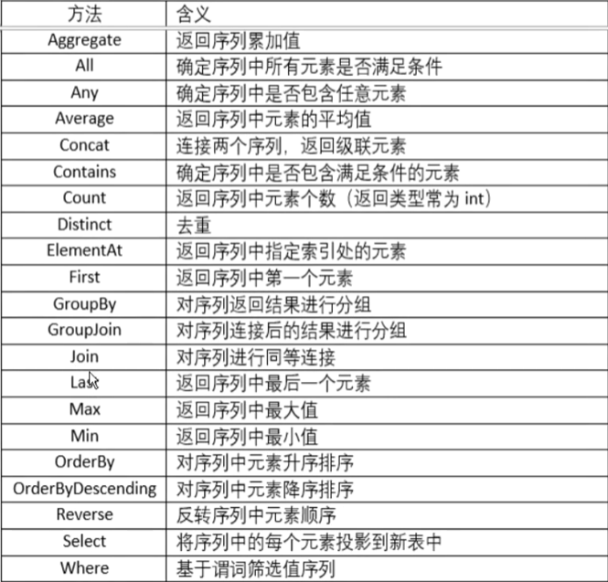

# C#进阶语法
### 泛型
#### 定义
泛型(generic)是专门处理多段代码在不同的数据类型上执行相同的指令的情况而设计的。
利用泛型的特性可以定义泛型类、泛型方法、泛型接口、泛型委托。

定义： 用占位符 T(或其他大写字母)代替实际数据类型，若定义方法，在方法名后加上`<T>`，如`GetClassName<T>`;
若是泛型类，则在类名后加上`<T>`，如`BaseModel<T>`
同理，还有泛型接口、泛型委托，如`IData<T>`、`CustHandler<int, string>`。
```C#
//泛型方法
public static string GetClassName<E>(E t) 
{
    return t.GetType().Name;
}
//泛型类
internal class BaseModel<T>
{
    public static void ShowInfo(T t)
    {
        Console.WriteLine(t);
    }
}
//泛型接口
public interface IData<T>
{
    void ShowInfo(T t);
}
//泛型委托
public delegate void GenericDelegate<T>(T item);
```
#### 泛型约束
泛型定义中，有时有**where**子句，用于指定对用作泛型类型、方法、委托或本地函数中类型参数的约束。
泛型约束包含接口、基类、引用类型约束、值类型约束和无参构造函数约束。
泛型约束，简言之，就是**限定类型的范围**。
约束规则：

1. 可以同时使用一个以上的约束
2. 值类型约束与引用类型约束不能同时使用
3. 引用类型约束不能与基类约束同时使用
4. 如果有基类约束，还有其他约束，基类约束必须在最前面
5. 如果同时使用多个约束，**如果有new(),它必须是最后一个**
##### 值类型约束
```
//值类型的约束 where T:struct限定类型参数的实际类型不能是引用类型
public static T ToType<T>(string str) where T : struct
{
    return (T)Convert.ChangeType(str, typeof(T));
}
```
##### 引用类型约束
```
//引用类型约束 where T:class
public class Record<T> where T : class
{
    public List<T> list = new List<T>();
    //添加记录
    public void AddRecord(T t)
    {
        list.Add(t);
    }
}
```
##### 基类约束
```
// T 必须是基类People或其子类
public static void ShowInfo<T>(T t) where T : People
{
    t.ShowInfo();
}
```
##### 接口约束
```
//接口约束 where T : IData T的实际类型必须实现了IData接口
public static void ShowData<T>(T t) where T : IData<string>
{
    t.ShowInfo("string");
}
```
##### 无参构造函数约束
```
//无参构造函数约束 可以在方法体内部new一个新的泛型对象
//注意：new()必须是最后一个
public static T CreateObj<T>() where T : new()
{
    return new T();
}
```
#### 常见集合类型
##### ArrayList
使用大小会根据需要动态增加的数组来实现IList接口的集合。是动态数组，可以动态的增加和减少元素，但使用中会有性能损耗
因为它的Add方法可以添加任意一个类型的项，可以是int/double,f1ot,.,甚至可以是一个引用类型，所以在使用中对于值类型的存取会
有装箱与拆箱的操作，会产生性能损耗，所以不建议使用这个集合类型，建议使用`List<T>`类型。
```
ArrayList arrList new ArrayList();
arrList.Add(12);
arrList.Add(35.6);
arrList.Add(new IncomeInfo(){IncomeId = 1,IncomeName ="领工资"}
arrList.RemoveAt(1);
int ival=Convert.ToInt32(arrList[0]);//拆箱
```
##### List
一个泛型的集合类型，可通过索引访问的对象的强类型列表，提供用于对列表进行搜索、排序和操作的方法。
它是一个强类型集合，是类型安全的。也是根据需要动态添加或移除其中的项，用于存储不固定数目的一组信息。
lst列表集合操作Add/Insert/AddRange/Remove/RemoveAt/ContainsFind/FindIndex/ndexof/Sort/Reverse/Clear…
```
List<int> ids = new List<int>();// 存储一组int类型的集合
ids.Add(101);//添加到列表尾部
ids.Add(102);
ids.AddRange(new int[] { 103, 104, 105, 106 });//添加多个到末尾
ids.Remove(103);//移除指定元秦
ids.RemoveAt(2);//移除第3个元素
bool b1 = ids.Contains(105);//判断某个元素是否存在
int newId = ids.Find(item => item > 103);//查找符合条件的项 存在返回匹配的第一项，不符合返回0
int index = ids.IndexOf(105);//获取指定元素的索引 没有找到返回-1 找到返回相应索引
List<int> newList = ids.Where(id => id > 103).ToList();//按条件筛选
ids.Sort();//排序
ids.Reverse();//反转
Console.ReadKey();
```
##### Dictionary<TKey, TValue>
表示键和值的集合。它也是一个泛型集合类，强类型集合，类型安全的。
Dictionary<T,V>类型提供从一组键到一组值的映射。每次对字典的添加都包含一个值和与其关联的键。使用键检索值的速度非常快。
键必须是唯一的而值不需要唯一的。
键和值都是类型参数，其实际类型可以是任何类型（比如：string,int,自定义类型，等等）。
键值对操作：Add/遍历/根据键取对应的值。
```
Dictionary<int, string> list = new Dictionary<int, string>();
list.Add(101, "收入1");
list.Add(102, "收入2");
list.Add(103, "收入3");
List<int> itemIds = new List<int>();
foreach (KeyValuePair<int, string> item in list) 
{
    Console.WriteLine($"{item.Key} < === > {item.Value}");
}
foreach (int key in list.Keys)
{
    Console.Write($"{list[key]} \t");
}
```
### 反射
#### 反射的定义
反射一一程序可以**访问、检测和修改**它本身状态或行为的一种能力。反射是.NET中的重要机制。
反射中提供了用来描述**程序集、模块和类型**的对象，可以使用反射**动态地创建类型的实例**，并将类型绑定到现有对象，或者从现有对象中获取类型，然后调用其方法或访问其字段和属性。如果代码中使用了特性，也可以利用反射来访问它们。
通过反射，可以在运行时获得程序或程序集中每一个类型（包括类、结构、委托、接口和枚举等）的成员和成员的信息，即元数据。有了反射，即可对每一个类型了如指掌。
反射用到的类：System.Type、System.Relection.Assembly、Activator
Type:类的信息类，可以**获取类的相关信息**（构造函数、方法、字段、属性、事件等）》
Assembly:程序集类，**加载其他程序集**，加载后能用Type获取其中某类的信息
Activator:快速实例化对象的类，可将Type对象实例化为相应类型的对象
#### 反射的用途
C#中反射具有以下用途：

- 在运行时查看类型元数据
- 检查装配中的各种类型并动态实例化这些类型
- 运行时动态读写对象的属性值，调用方法、动态加载程序集
- 运行时访问应用的特性
#### 动态实例化
类型实例化，除了可以直接使用类型实例化创建对象以外，当不能直接引用类型时，还可以通过反射技术来动态实例化。
```
string fullName = "net_consoleApp_2.Models.Student";//完整名称
Type itemType = Type.GetType(fullName);//ItemIrfol的Type对象
 
//创建对象实例
object itemInfo = Activator.CreateInstance(itemType);//调用无参构造函数来动态创建
Student item1 = (Student)itemInfo;
item1.ShowInfo();

//typeof(type) 返回的对象就是Type类型
Student item2 = (Student)Activator.CreateInstance(typeof(Student));
item2.ShowInfo();
```
#### 元数据
```
//查看元数据
ItemInfo item = new ItemInfo()
{
  Id = 101,
  ItemType = "收入",
  ItemName = "银行转账"
};
item.remark = "通过银行转账获取收入";
Type typeItem = typeof(ItemInfo);//类型对象
//1.属性
PropertyInfo[] properties = typeItem.GetProperties();//所有公开的属性数组
//不通过直接代码访问，读取对象中的属性值：  属性名--属性值
foreach (PropertyInfo property in properties) {
   Console.WriteLine(property.Name+"："+property.GetValue(item).ToString());
}
//property.Name  获取属性名称   property.GetValue(obj) 获取obj对象中property属性的值
//获取ItemType属性的值
PropertyInfo itemTypeProp = typeItem.GetProperty("ItemType");//获取ItemType属性
string itemType = itemTypeProp.GetValue(item).ToString();//获取ItemType属性的值

//修改属性值
item.ItemName = "工资发放";//直接代码修改
//通过属性对象来修改ItemName的属性值
typeItem.GetProperty("ItemName").SetValue(item, "朋友还钱");

//2.字段
//公有字段
var fileds=  typeItem.GetFields();
FieldInfo fRemark = typeItem.GetField("remark");//指定名称的字段
fRemark.SetValue(item, "通过工资发放");//修改字段的值
string remark = fRemark.GetValue(item).ToString();//获取字段的值
Console.WriteLine( "字段remark:"+remark);

FieldInfo fType= typeItem.GetField("itemType", BindingFlags.NonPublic | BindingFlags.Instance);//获取私有字段
string typeStr = fType.GetValue(item).ToString();//获取字段的值

//3.方法
string strInfo=  item.GetItemInfo();//直接调用

//反射方式调用
//获取方法
MethodInfo[] methods=  typeItem.GetMethods();
foreach( MethodInfo method in methods )
{
    Console.WriteLine(method.Name);//方法名
}
//获取指定的方法
MethodInfo getItemInfo = typeItem.GetMethod("GetItemInfo");
//调用方法  无参方法  没有参数--null
string  reStr= getItemInfo.Invoke(item,null).ToString();

MethodInfo getCount = typeItem.GetMethod("GetCount");
//调用静态方法  第一个参数：null 
int reCount = (int)getCount.Invoke(null, null);

Console.WriteLine(reStr);
//获取带一个参数的方法
MethodInfo setCount = typeItem.GetMethod("SetCount", new Type[] { typeof(int) });
int count = 5;
//调用一个参数的方法
setCount.Invoke(item, new object[] { count });
Console.WriteLine("数量："+ItemInfo.count);
setCount.Invoke(item, new object[] { 6 });
Console.WriteLine("数量：" + ItemInfo.count);

ExpendInfo expendInfo = new ExpendInfo();
Type expendType= typeof(ExpendInfo);
//获取带一个参数的方法
MethodInfo addAmount = expendType.GetMethod("AddAmount", new Type[] { typeof(decimal),typeof(decimal) });
decimal amount1 = 300m, amount2 = 50m;
//调用两个参数的方法
decimal totalAmount=(decimal)addAmount.Invoke(expendInfo,new object[] {amount1, amount2 });
Console.WriteLine("总金额："+totalAmount);

//补充：泛型方法获取与调用
MethodInfo createObj = typeof(GenericMethodClass).GetMethod("CreateObj");//获取方法
MethodInfo createObjNew=createObj.MakeGenericMethod(typeof(IncomeInfo));//转换为泛型方法，传入实际类型对象
IncomeInfo income=  (IncomeInfo)createObjNew.Invoke(null, null);//调用泛型方法，创建一个实例

//获取类型，创建实例
Type incomeType = typeof(IncomeInfo);
//object incomeObj = Activator.CreateInstance(incomeType);
//获取构造函数
//1). 无参构造函数
ConstructorInfo cons0=   incomeType.GetConstructor(new Type[] { });
//调用无参构造函数创建一个默认实例
IncomeInfo income0= (IncomeInfo)cons0.Invoke(null);
//2) 带一个参数的构造函数
ConstructorInfo cons1 = incomeType.GetConstructor(new Type[] { typeof(int)});
//调用带一个参数构造函数创建一个实例
int id = 102;
IncomeInfo income1 = (IncomeInfo)cons1.Invoke(new object[] {id});
//3) 带2个参数的构造函数
ConstructorInfo cons2 = incomeType.GetConstructor(new Type[] { typeof(int),typeof(decimal) });
//调用带2个参数构造函数创建一个实例
int id1 = 103;
decimal amount1 = 300;
IncomeInfo income2= (IncomeInfo)cons2.Invoke(new object[] { id1,amount1 });
//4) 带3个参数的构造函数
ConstructorInfo cons3 = incomeType.GetConstructor(new Type[] { typeof(int),typeof(string), typeof(decimal) });
//调用带3个参数构造函数创建一个实例
int id2 = 104;
decimal amount2 = 100;
IncomeInfo income3 = (IncomeInfo)cons3.Invoke(new object[] { id2,"发奖金", amount2 });

//动态加载程序集
Assembly assModels = null;
//1) Load  传入程序集文件名，不带.dll后缀名  dll文件放入起始位置  .Net8 识别不到程序
//Models项目添加引用进来，这种方式就可以
 assModels = Assembly.Load("Zhaoxi.Models");
//2) LoadFile 传入程序集文件的完整路径（绝对路径）
assModels = Assembly.LoadFile("D:\\xxxxx\\Zhaoxi.Models.dll");
//3)LoadFrom(程序集文件名,带.dll后缀名)
assModels = Assembly.LoadFrom("Zhaoxi.Models.dll");

Type stuType = assModels.GetType("Zhaoxi.Models.Student");
Student stu = (Student)Activator.CreateInstance(stuType);
```
#### 反射的优缺点
优点：

- 反射提高了程序的灵活性和扩展性。
- 降低耦合性，提高自适应能力。
- 它允许程序创建和控制任何类的对象，无需提前硬编码目标类。

缺点：

- 性能问题：使用反射基本上是一种解释操作，用于字段和方法接入时要远慢于直接代码。因此反射机制主要应用在对灵活性和拓展性要求很高的系统框架上，普通程序不建议使用。
- 使用反射会模糊程序内部逻辑；程序员希望在源代码中看到程序的逻辑，反射却绕过了源代码的技术，因而会带来维护的问题，反射代码比相应的直接代码更复杂。
### 委托
#### 委托的定义与特点
C#中的委托(Delegate)类似于C或C+中的函数指针，是一种引用类型，表示对具有特定参数列表和返回类型的**方法的引用**。
委托经常适用于实现**事件和回调方法**，所有的委托都派生自**System.Delegate**类。
在实例化委托时，可以将**委托的实例**与具有相同参数列表与返回值类型的**方法相关联**，然后就可以通过委托实例来调用方法。
使用委托还可以将**方法作为参数**传递给其他方法。
委托具有以下特点：

- 委托是完全面向对象的，委托是同时封装对象实例和方法，
- 委托允许将方法作为参数进行传递：
- 委托可用于定义回调方法：
- 委托可以将多个方法链接在一起；
- 方法不必与委托类型完全匹配：
- C#2.0版引入了匿名函数的概念，可以将代码块作为参数（而不是单独定义的方法）进行传递。C#3.0引入了Lambda表达式，利用它们可以更简练地编写内联代码块。匿名方法和Lambda表达式都可编译为委托类型，这些功能现在统称为匿名函数。
#### 委托声明与实例化
声明委托需要使用**delegate**关键字，语法如下：
```
delegate 返回值类型 委托名(参数列表...)
delegate int Calculate(int a, int b);
delegate void ShowMsg(string msg);
```
委托可以引用与委托具有**相同签名**的方法，也就是说委托在声明时即**确定了委托可以引用的方法**。
相同签名：方法的**返回值类型、参数类型、参数个数、参数顺序**都完全相同，并不是方法名与委托名相同

实例化

1. 委托声明后，可用**new**关键字来实例化，即创建委托对象，将其与特定的方法关联。
```
delegate int Calculate(int a, int b); //声明一个计算的委托
//提过两个与之对应的方法
public int Add(int a, int b)
{
  return a + b;
}
public void Test(){
  //实例化委托
  Calculate add = new Calculate(Add); //创建委托对象，并与Add关联
  add(10,20); //30
}
```
2. 委托还可以通过将方法签名赋给委托对象
```
Calculate add1 = Add;
add1(20,5); //25
```
#### 多播委托
委托对象可使用"+="运算符合并多个委托。只有相同类型的委托可被合并。使用"="运算符可用于从合并的委托中移除委托。
使用委托的这个特点，可以创建一个委托被调用时要调用的方法列表，这被称为委托的多播(multicasting)。
多播委托应用于：一个动作触发一连串的的操作。
```
//声明
delegate void ShowMsg(string msg);
public static void Show1(string msg)
{
    Console.WriteLine($"show1: {msg}");
}
public static void Show2(string msg)
{
    Console.WriteLine($"show2: {msg}");
}

//使用
ShowMsg msg = Show1;
msg += Show2;
msg("Hello World！");
// show1: Hello World！
// show2: Hello World！
```
### Lambda
#### Lambda表达式简介
Lambda表达式：就是一个匿名函数，可以表示为委托的代码，或者表示为表达式树的代码，它所表示的表达式树会编译为委托。
简言之：Lambda表达式就是匿名方法的另一种表现形式，是一种高效的类似于函数式编程的表达式。
Lambda表达式可**应用于**：将要执行的代码传递给异步方法、Linq扩展方法中、创建表达式树。
优点：Lambda表达式**简化了匿名委托的使用，减少开发中需要编写的代码量**。
**匿名函数（方法）**：提供了一种**传递代码块**作为委托参数的技术。匿名方法是**没有名称只有主体的方法**。在匿名方法中您不需要指定返回类
型，它是从方法主体内的**return**语句推断的。
#### Lambda表达式语法
```
(参数列表) => 语句或语句块
```
其中的"**=>**"该运算符读作“goes to“。Lambda运算符的左边是输入参数（如果有），右边是表达式或语句块。
```
Calculate add = (a, b) => a + b;
```
其中的(a, b)就是参数列表， a + b 就是表达式，如果有多个语句，右侧就是语句块，将多条语句写到{}中。
#### .Net自带的委托
##### Action委托
Action`<in T>`委托表示引用一个返回类型为void的方法，即封装了一个无返回值的方法。这种委托有多种不同的变体，可以没有传入参数，可以最多有16个参数。
没有泛型的Action可以调用没有参数的方法。如：
```
Action printAct = () => Console.WriteLine("Welcome to here!");
```
`Action<in T>`表示有一个传入参数的方法，如：
```
Action<String> printMsg = msg => 
{
  string message = $"Welcome to here! {msg}";
  Console.WriteLine(message);
}
```
`Action<in T1, in T2>`表示有两个个传入参数的方法，如：
```
Action<int, int> printAdd = (a, b) => Console.WriteLine(a + b);
```
....
依次类推，最多16个参数
##### Func委托
`Func<out T>`可以引用一个带一个返回值的方法。使用方式与Action类似，不过`Func<T>`允许调用带返回参数的方法。`Func<T>`也有不同的变体，最多可以传递16个参数和一个返回类型。
`Func<out T>`可以调用一个没有传入参数，有返回值的方法，T表示返回值类型。
```
Func<int> func1 = () => {
  int a = 5;
  return a + 2;
}
```
`Func<in T1, out T2>` 可以调用有一个传入参数，有返回值的方法，T1表示传入参数的类型，T2表示返回值的类型。
```
Func<int, int> func2 = num => {
  int re = num + 5;
  return re;
}
```
Func<in T1, in T2, out T3>可以调用有两个传入参数，有返回值的方法，T1，T2表示表示传入参数类型，T3表示返回值类型。
```
Func<int, int, int> funcAdd = (a, b) = a + b;
```
....(泛型中，返回值类型永远在最后一个)
以此类推，以后应用中，如果需要用带返回值的委托，可以使用Func委托的各种变体形式。
### 事件
事件是允许类或对象的某些状态发生改变时**通知其它类或对象**。在C#编程中，在客户端开发中，事件(Event)可以看作是用户的一系列操作，例如按下键盘的某个按键、单击界面上一个按钮或选择某个选项等，当事件发生时我们可以针对事件做出一系列的响应，例如显示一个界面、退出程序、记录日志等等。
事件需要在一个类中**声明和触发**，并通过**委托与事件处理程序关联**。
事件可以分为**发布器**和**订阅器**两个部分：

- 发布器类是一个包含事件和委托的类，事件和委托之间的联系也定义在这个类中，发布器类的对象可以触发事件，并使用委托通知其他的对象。
- 订阅器类则是一个接收事件并提供事件处理程序的类，发布器类中的委托调用订阅器类中的方法（事件处理程序）。

有关事件我们需要注意：
- 发布器才能触发事件，订阅器决定对事件作出何种响应；
- 一个事件可以拥有多个订阅器，同时订阅器也可以处理来自多个发布器的事件：
- 没有订阅器的事件永远也不会触发；
- 事件通常用于定义针对用户的操作，例如单击某个按钮：
- 如果事件拥有多个订阅器，当事件被触发时会同步调用所有的事件处理程序：
- 在.NET类库中，事件基于EventHandler委托和EventArg基类。
### 特性
#### 特性介绍
**特性**(Attribute)是一种用于在程序**运行时**传递各种元素（例如类、方法、结构、枚举等）**行为信息**的**声明性标签**。使用特性可以将元数据（例如编译器指令、注释、描述、方法和类等信息）添加到程序中。
.Net Framework提供了两种类型的特性，分别是**预定义特性和自定义特性**。
特性具有以下属性：

- 使用特性可以向程序中添加元数据；
- 可以将一个或多个特性应用于整个程序、模块或者较小的程序元素（例如类和属性）中
- 特性可以像方法和属性一样接受自变量
- 程序可使用反射来检查自己的元数据或其他程序中的元数据
#### 特性语法
在要应用特性的元素前面用方括号[]来应用。如[Table("tableName")]
```
[特姓名(指定信息参数)]
[Table("StudentInfos")]
public class StudentInfo{}
```
#### 预定义特性
Net Framework 中提供了三个预定义的特性：

- AttributeUsage
- Conditional
- Obsolete
##### AttributeUsage
预定义特性AttributeUsage用来描述如何使用自定义特性类，用于自定义特性类前面，规定了特性可应用到的项目的类型。
格式如下：
```
[AttributeUsage(
  validon,
  AllowMultiple = allowmultiple,
  Inherited = inherited
)]
```
参数说明如下：
- 参数validon用来定义特性**可被放置的程序元素**。它是枚举器**AttributeTargets**的值的组合。默认值是AttributeTargets.All
- 参数allowmultiple(可选参数)用来为该特性的AllowMultiple属性(property)提供一个布尔值，默认值为false(单用的)，如果为true,则该特性是多用的，
- 参数inherited(可选参数)用来为该特性的Inherited属性(property)提供一个布尔值，默认为false(不被继承)，如果为true,则该特性可被派生类继承。
##### Conditional
预定义特性Conditional用来标记一个方法，它的执行依赖于指定的预处理标识符。根据该特性值的不同，在编译时会起到不同的效果。
```
[Conditional("out")]
public void Print(string msg)
{
  Console.WriteLine(msg);
}
```
如果没有定义这个，就会忽略该方法。
##### Obsolete
预定义特性Obsolete用来标记不应被使用的程序，可以使用它来通知编译器放弃某个目标元素。
```
语法: [Obsolete (message, iserror)]

[Obsolete("PrintOut 已弃用",false)]
public void PrintOut(string msg)
{
  Console.WriteLine($"输出消息:{msg}");
}
```
语法说明如下：

- 参数message是一个字符串，用来描述项目为什么过时以及应该使用什么代替
- 参数iserror是一个布尔值，默认值是false(编译器会生成一个警告)，如果设置为true，那么编译器会把该项目当做一个错误。
#### 自定义特性
.Net Framework允许创建自定义特性，自定义特性不但用于存储声明性的信息，还可以在运行时被检索。
创建并使用自定义特性可以分为四个步骤：

- **声明自定义特性**----特性名一般规定以**Attribute**结尾，派生于System.Attribute类
- **构建自定义特性**----定义属性或字段，创建构造函数、指定应用目标
- **在目标程序上应用自定义特性**----[特性名(参数值)]
- **通过反射访问特性**

最后一步涉及编写一个简单的程序来读取元数据以便查找各种符号。该程序应在运行时使用反射来访问特性。
##### 声明自定义特性
自定义特性应该集成System.Attribute类
```
public class RemarkAttribute:Attribute {}
```
##### 构建自定义特性
给RemarkAttribute类定义属性或字段、构建函数，并指定应用目标。
```
[AttributeUsage(AttributeTargets.Class|AttributeTargets.Property|AttributeTargets.Method|AttributeTargets.Field)]
public class RemarkAttribute : Attribute
{
  public string Description { get; set; }
  public RemarkAttribute(string desp){
    Description = desp;
  }
}
```
##### 在目标程序上应用自定义特性
通过把特性放置在紧挨着它的目标上面来应用改特性。
```
[Remark("名目信息")]
public class ItemInfo
{
  [Remark("编号")]
  public int ItemNo { get; set; }
  [Remark("名称")]
  public string ItemName { get; set; }
  [Remark("类别")]
  public ItemTypes ItemType { get; set; }
}
```
##### 通过反射访问特性
在程序中，用**反射的方式**获取应用元素智商的特性标注的特性信息
```
public static class RemarkAttrHelper
{
    /// <summary>
    /// 获取指定类型的Remark描述文本
    /// </summary>
    /// <typeparam name="T"></typeparam>
    /// <returns></returns>
    public static string GetClassDescription<T>()
    {
        string remark = null;
        Type type = typeof(T);
        RemarkAttribute remarkAttr= type.GetCustomAttribute<RemarkAttribute>();
        if(remarkAttr != null)
        {
            remark = remarkAttr.Description;
        }
        return remark;
    }

    public static string GetClassDescription(this Type type)
    {
        string remark = null;
        RemarkAttribute remarkAttr = type.GetCustomAttribute<RemarkAttribute>();
        if (remarkAttr != null)
        {
            remark = remarkAttr.Description;
        }
        return remark;
    }

    /// <summary>
    /// 获取指定属性的描述文本
    /// </summary>
    /// <param name="pro"></param>
    /// <returns></returns>
    public static string GetPropertyDescription(this PropertyInfo pro)
    {
        string remark = null;
        RemarkAttribute remarkAttr = pro.GetCustomAttribute<RemarkAttribute>();
        if (remarkAttr != null)
        {
            remark = remarkAttr.Description;
        }
        else
            remark = pro.Name;
        return remark;
    }

    public static string GetObjectInfo<T>(T obj)
    {
        string result = "";
        var type = typeof(T);
        var props= type.GetProperties();
        foreach( var prop in props)
        {
            string remark = prop.GetPropertyDescription();
            if (result != "")
                result += ",";
            result += remark + " : " + prop.GetValue(obj);
        }
        return result;
    }
}
```
### Linq
#### Linq介绍
LINQ(读音link)一一**语言集成查询**(Language Integrated Query),是.NET框架的扩展，一系列直接将查询功能集成到C#语言的技术统称，是一种使用类似SQL语句操作多种数据源的功能。
使用Linq,你可以从access数据库、程序对象的集合以及XML文档以及实现了`Enumerable`或`Enumerable<T>`接口的集合类中查询数据。从.net framework3.5中开始引入，
能够提升程序数据处理能力和开发效率，具有集成性、统一性、可扩展性、抽象性、说明式编程可组成型、可转换性等优势。
Ling提供的程序

- Linq to Object。提供程序查询内存中的集合和数组。
- Linq to DataSet。提供程序查询ADQ.NEI数据集中的数据。
- Linq to SQL。提供程序查询和修改Sql Server数据库中的数据，将应用程序中的对象模型映射到数据库表。
- Linq to Entities。使用ing to entities时，会在后台将ing语句转换为sql语句与数据库交互，并能提供数据变化追踪。
- Linq to XML。提供程序查询和修改XML,既能修改内存中的xl,也可以修改从文件中加载的。
#### Linq查询
Linq查询包括两种方式：

- 语句查询
- 方法查询
##### 语句查询
查询语法
```
from 迭代变量 in 数据源 where ... select 迭代变量
```
```
//查询遍历数组
//1.数据源
int[] nums = {12, 34, 9, 45, 54, 99, 76, 120};
//2.创建查询
var numQuery = from m in nums select m;
//3.执行查询
foreach( var m in numQuery)
{
  Console.WriteLine(m);
}
```
查询表达式在循环访问查询变量时（如上述示例中foreach），才会执行
**select字句，**基于查询结果返回需要的值或字段，并能对返回值指定类型。
```
List<ItemInfo> list = new List<ItemInfo>()
{
    new ItemInfo(){Id=101,ItemType="收入",ItemName="银行转账"},
    new ItemInfo(){Id=102,ItemType="收入",ItemName="股票收入"},
    new ItemInfo(){Id=106,ItemType="支出",ItemName="向客户付款"},
    new ItemInfo(){Id=104,ItemType="支出",ItemName="借钱给朋友"},
    new ItemInfo(){Id=105,ItemType="支出",ItemName="生活消费"}
};
//返回指定字段
var items = from item in list select item.ItemName;
//返回指定类型
var items2 = from item in list 
             select new
             {
                 id = item.Id,
                 name = item.ItemName
             };
```
**where字句**：用来指定筛选的条件，与sql查询语句中的where功能一样。通过where字句获取满足条件的结果
```
var items2 = from item in list
             where item.Id > 103 && item.ItemType == "支出"
             select item;
```
**orderby**:用来排序，与sql中order by的功能相同，使得返回结果可以根据某字段或某种规则实现升序或降序排列。
Linq中语句默认展示为升序，降序使用【orderby表达式 descending】
```
var items2 = from item in list
             orderby item.Id descending
             select item;
```
**group by**子句：用来对查询结果进行分组。且未指定key的情况下，key取值默认是true和false。.如果分为多组，获取数据结果时需要手动遍历key获取对应的value
```
var groupList = from item in list group item by item.ItemType;
foreach ( var item in groupList)
{
    Console.WriteLine(item.Key + "count:" + item.Count());
    foreach ( var item2 in item)
    {
        Console.WriteLine($"id:{item2.Id}--name:{item2.ItemName}");
    }
}
```
Join子句：用于联合查询，一般会存在两个数据源，且两个数据源中有相同的字段可进行比较。
使用格式为【join 数据 in 数据源1 on key1 equals key2】
```
//list2 = [{id=101,count=101},...]
//inner join 只匹配能匹配上的
var joinList = from item in list
               join item2 in list2 on item.Id equals item2.id
               select new
               {
                   id = item.Id,
                   count = item2.count,
               };
//left join 以左边为准，右边匹配不上，置为null
var joinList = from item in list
               join item2 in list2 on item.Id equals item2.id
               into ItemsNew //将join右边的数据 into ItemsNew
               from newItem in ItemsNew.DefaultIfEmpty() //如果序列为空就为默认值
               select new
               {
                   id = item.Id,
                   count = newItem != null ? newItem.count : 0,
               };

//right join 就是切换join两边的数据源，equals两边的变量的位置要对应join两边的位置
var joinList1 = from item in list2
               join item2 in list on item.id equals item2.Id
               into ItemsNew
               from newItem in ItemsNew.DefaultIfEmpty()
               select new
               {
                   id = newItem != null ? newItem.Id : 0,
                   count = item.count,
               };
```
#### Linq扩展方法
Linq查询中，为了更加清晰明了的阅读，我们一般采用查询语法，但有些查询操作没有等效的查询表达式，只能采用方法查询，即调用内部方法，有些场景中也可以将查询语法和方法语法结合使用。

```
//查询方法
int[] nums1 = { 12, 34, 9, 45, 12,76,52, 99, 76, 120 };
var queryList1 = from num in nums1 select num;
int max = queryList1.Max();//最大值
double avg = queryList1.Average();//平均值
int  min= queryList1.Min();//最小值

//扩展方法
var orderList=  nums1.OrderBy(num=>num);
var orderListDesc = nums1.OrderByDescending(num => num);
var newList = nums1.Where(num => num > 30);//筛选的扩展方法
var numStrs = nums1.Select(num => num.ToString("000"));//投影的方法
//去重
var numList2 = nums1.Distinct();
//incomeList列表为例
//扩展方法支持链式写法
var incomeList6 = incomeList.Where(income => income.ItemId > 102)
                            .OrderBy(income => income.Id)  
                            .Select(income => new
                              {
                                  IncomeId = income.Id,
                                  IncomeRemark = income.Remark,
                                  ItemId = income.ItemId
                              }); 

var itemList5 = list.Where(item => item.Id > 110).FirstOrDefault();//返回第一个元素，集合为空，返回的Null
//var itemList6 = list.Where(item => item.Id > 110).First();// 返回第一个元素，集合为空，就会异常

int itemIdMax = list.Max(item => item.Id);//最大编号
int incomeIdMin = incomeList.Min(item => item.Id);//记录的最小编号
int incomeCount = incomeList.Count();//获取列表的元数数目

var itemList4 = list.Where(item => item.Id > 103);
var itemList7= list.Where(item => item.Id > 105);
var itemList8 = itemList7.Union(itemList4);//合并成一个集合，去重
var itemList9 = itemList7.Concat(itemList4);//合并成一个集合，不去重

var itemList10 = itemList4.Except(itemList7);//得到一个差集，去掉公共的部分

//Skip 跳过指定数目的元素/  /Take   连续取指定数目的元素
var incomeList7 = incomeList.Skip(3).Take(4);

//Join方法---inner join    //Join 连接两个集合，关联属性，合并一个集合，包含两个集合中的信息  inner join
var incomeList8 = list.Join(incomeList, item => item.Id, income => income.ItemId, (item, income) => new
{
    ItemId = item.Id,
    ItemName = item.ItemName,
    IncomeId = income.Id,
    Income = income.Remark
});
//分组 
var incomeList9 = incomeList.GroupBy(income => income.ItemId);

//GroupJoin ---等同性将两个序列的元素进行关联，并对结果进行分组。
var groups = list.GroupJoin(incomeList, item => item.Id, income => income.ItemId, (item, income) => new
{
    ItemId = item.Id,
    ItemName = item.ItemName,
    Records = income.Select(r => new { Id = r.Id, Income = r.Remark })
});
foreach (var item in groups)
{
    Console.WriteLine(item.ItemId + "," + item.ItemName);
    foreach (var r in item.Records)
    {
        Console.WriteLine("编号：" + r.Id + " , 名称：" + r.Income);
    }
}
```