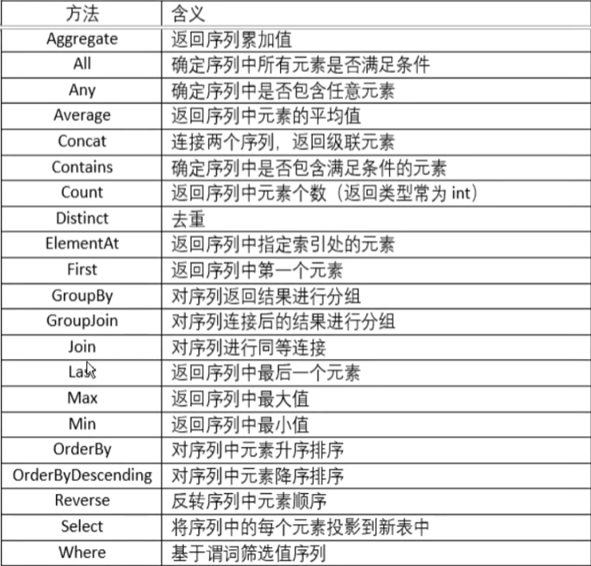

# C#进阶语法
### Lambda
#### Lambda表达式简介
Lambda表达式：就是一个匿名函数，可以表示为委托的代码，或者表示为表达式树的代码，它所表示的表达式树会编译为委托。
简言之：Lambda表达式就是匿名方法的另一种表现形式，是一种高效的类似于函数式编程的表达式。
Lambda表达式可**应用于**：将要执行的代码传递给异步方法、Linq扩展方法中、创建表达式树。
优点：Lambda表达式**简化了匿名委托的使用，减少开发中需要编写的代码量**。
**匿名函数（方法）**：提供了一种**传递代码块**作为委托参数的技术。匿名方法是**没有名称只有主体的方法**。在匿名方法中您不需要指定返回类
型，它是从方法主体内的**return**语句推断的。
#### Lambda表达式语法
```
(参数列表) => 语句或语句块
```
其中的"**=>**"该运算符读作“goes to“。Lambda运算符的左边是输入参数（如果有），右边是表达式或语句块。
```
Calculate add = (a, b) => a + b;
```
其中的(a, b)就是参数列表， a + b 就是表达式，如果有多个语句，右侧就是语句块，将多条语句写到{}中。
#### .Net自带的委托
##### Action委托
Action<in T>委托表示引用一个返回类型为void的方法，即封装了一个无返回值的方法。这种委托有多种不同的变体，可以没有传入参数，可以最多有16个参数。
没有泛型的Action可以调用没有参数的方法。如：
```
Action printAct = () => Console.WriteLine("Welcome to here!");
```
Action<in T>表示有一个传入参数的方法，如：
```
Action<String> printMsg = msg => 
{
  string message = $"Welcome to here! {msg}";
  Console.WriteLine(message);
}
```
Action<in T1, in T2>表示有两个个传入参数的方法，如：
```
Action<int, int> printAdd = (a, b) => Console.WriteLine(a + b);
```
....
依次类推，最多16个参数
##### Func委托
Func<out T>可以引用一个带一个返回值的方法。使用方式与Action类似，不过Func<T>允许调用带返回参数的方法。Func<T>也有不同的变体，最多可以传递16个参数和一个返回类型。
Func<out T>可以调用一个没有传入参数，有返回值的方法，T表示返回值类型。
```
Func<int> func1 = () => {
  int a = 5;
  return a + 2;
}
```
Func<in T1, out T2> 可以调用有一个传入参数，有返回值的方法，T1表示传入参数的类型，T2表示返回值的类型。
```
Func<int, int> func2 = num => {
  int re = num + 5;
  return re;
}
```
Func<in T1, in T2, out T3>可以调用有两个传入参数，有返回值的方法，T1，T2表示表示传入参数类型，T3表示返回值类型。
```
Func<int, int, int> funcAdd = (a, b) = a + b;
```
....(泛型中，返回值类型永远在最后一个)
以此类推，以后应用中，如果需要用带返回值的委托，可以使用Func委托的各种变体形式。
### 事件
事件是允许类或对象的某些状态发生改变时**通知其它类或对象**。在C#编程中，在客户端开发中，事件(Event)可以看作是用户的一系列操作，例如按下键盘的某个按键、单击界面上一个按钮或选择某个选项等，当事件发生时我们可以针对事件做出一系列的响应，例如显示一个界面、退出程序、记录日志等等。
事件需要在一个类中**声明和触发**，并通过**委托与事件处理程序关联**。
事件可以分为**发布器**和**订阅器**两个部分：

- 发布器类是一个包含事件和委托的类，事件和委托之间的联系也定义在这个类中，发布器类的对象可以触发事件，并使用委托通知其他的对象。
- 订阅器类则是一个接收事件并提供事件处理程序的类，发布器类中的委托调用订阅器类中的方法（事件处理程序）。

有关事件我们需要注意：

- 发布器才能触发事件，订阅器决定对事件作出何种响应；
- 一个事件可以拥有多个订阅器，同时订阅器也可以处理来自多个发布器的事件：
- 没有订阅器的事件永远也不会触发；
- 事件通常用于定义针对用户的操作，例如单击某个按钮：
- 如果事件拥有多个订阅器，当事件被触发时会同步调用所有的事件处理程序：
- 在.NET类库中，事件基于EventHandler委托和EventArg基类。
### 特性
#### 特性介绍
**特性**(Attribute)是一种用于在程序**运行时**传递各种元素（例如类、方法、结构、枚举等）**行为信息**的**声明性标签**。使用特性可以将元数据（例如编译器指令、注释、描述、方法和类等信息）添加到程序中。
.Net Framework提供了两种类型的特性，分别是**预定义特性和自定义特性**。
特性具有以下属性：

- 使用特性可以向程序中添加元数据；
- 可以将一个或多个特性应用于整个程序、模块或者较小的程序元素（例如类和属性）中
- 特性可以像方法和属性一样接受自变量
- 程序可使用反射来检查自己的元数据或其他程序中的元数据
#### 特性语法
在要应用特性的元素前面用方括号[]来应用。如[Table("tableName")]
```
[特姓名(指定信息参数)]
[Table("StudentInfos")]
public class StudentInfo{}
```
#### 预定义特性
Net Framework 中提供了三个预定义的特性：

- AttributeUsage
- Conditional
- Obsolete
##### AttributeUsage
预定义特性AttributeUsage用来描述如何使用自定义特性类，用于自定义特性类前面，规定了特性可应用到的项目的类型。
格式如下：
```
[AttributeUsage(
  validon,
  AllowMultiple = allowmultiple,
  Inherited = inherited
)]
```
参数说明如下：

- 参数validon用来定义特性**可被放置的程序元素**。它是枚举器**AttributeTargets**的值的组合。默认值是AttributeTargets.All
- 参数allowmultiple(可选参数)用来为该特性的AllowMultiple属性(property)提供一个布尔值，默认值为false(单用的)，如果为true,则该特性是多用的，
- 参数inherited(可选参数)用来为该特性的Inherited属性(property)提供一个布尔值，默认为false(不被继承)，如果为true,则该特性可被派生类继承。
##### Conditional
预定义特性Conditional用来标记一个方法，它的执行依赖于指定的预处理标识符。根据该特性值的不同，在编译时会起到不同的效果。
```
[Conditional("out")]
public void Print(string msg)
{
  Console.WriteLine(msg);
}
```
如果没有定义这个，就会忽略该方法。
##### Obsolete
预定义特性Obsolete用来标记不应被使用的程序，可以使用它来通知编译器放弃某个目标元素。
```
语法: [Obsolete (message, iserror)]

[Obsolete("PrintOut 已弃用",false)]
public void PrintOut(string msg)
{
  Console.WriteLine($"输出消息:{msg}");
}
```
语法说明如下：

- 参数message是一个字符串，用来描述项目为什么过时以及应该使用什么代替
- 参数iserror是一个布尔值，默认值是false(编译器会生成一个警告)，如果设置为true，那么编译器会把该项目当做一个错误。
#### 自定义特性
.Net Framework允许创建自定义特性，自定义特性不但用于存储声明性的信息，还可以在运行时被检索。
创建并使用自定义特性可以分为四个步骤：

- **声明自定义特性**----特性名一般规定以**Attribute**结尾，派生于System.Attribute类
- **构建自定义特性**----定义属性或字段，创建构造函数、指定应用目标
- **在目标程序上应用自定义特性**----[特性名(参数值)]
- **通过反射访问特性**

最后一步涉及编写一个简单的程序来读取元数据以便查找各种符号。该程序应在运行时使用反射来访问特性。
##### 声明自定义特性
自定义特性应该集成System.Attribute类
```
public class RemarkAttribute:Attribute {}
```
##### 构建自定义特性
给RemarkAttribute类定义属性或字段、构建函数，并指定应用目标。
```
[AttributeUsage(AttributeTargets.Class|AttributeTargets.Property|AttributeTargets.Method|AttributeTargets.Field)]
public class RemarkAttribute : Attribute
{
  public string Description { get; set; }
  public RemarkAttribute(string desp){
    Description = desp;
  }
}
```
##### 在目标程序上应用自定义特性
通过把特性放置在紧挨着它的目标上面来应用改特性。
```
[Remark("名目信息")]
public class ItemInfo
{
  [Remark("编号")]
  public int ItemNo { get; set; }
  [Remark("名称")]
  public string ItemName { get; set; }
  [Remark("类别")]
  public ItemTypes ItemType { get; set; }
}
```
##### 通过反射访问特性
在程序中，用**反射的方式**获取应用元素智商的特性标注的特性信息
```
public static class RemarkAttrHelper
{
    /// <summary>
    /// 获取指定类型的Remark描述文本
    /// </summary>
    /// <typeparam name="T"></typeparam>
    /// <returns></returns>
    public static string GetClassDescription<T>()
    {
        string remark = null;
        Type type = typeof(T);
        RemarkAttribute remarkAttr= type.GetCustomAttribute<RemarkAttribute>();
        if(remarkAttr != null)
        {
            remark = remarkAttr.Description;
        }
        return remark;
    }

    public static string GetClassDescription(this Type type)
    {
        string remark = null;
        RemarkAttribute remarkAttr = type.GetCustomAttribute<RemarkAttribute>();
        if (remarkAttr != null)
        {
            remark = remarkAttr.Description;
        }
        return remark;
    }

    /// <summary>
    /// 获取指定属性的描述文本
    /// </summary>
    /// <param name="pro"></param>
    /// <returns></returns>
    public static string GetPropertyDescription(this PropertyInfo pro)
    {
        string remark = null;
        RemarkAttribute remarkAttr = pro.GetCustomAttribute<RemarkAttribute>();
        if (remarkAttr != null)
        {
            remark = remarkAttr.Description;
        }
        else
            remark = pro.Name;
        return remark;
    }

    public static string GetObjectInfo<T>(T obj)
    {
        string result = "";
        var type = typeof(T);
        var props= type.GetProperties();
        foreach( var prop in props)
        {
            string remark = prop.GetPropertyDescription();
            if (result != "")
                result += ",";
            result += remark + " : " + prop.GetValue(obj);
        }
        return result;
    }
}
```
### Linq
#### Linq介绍
LINQ(读音link)一一**语言集成查询**(Language Integrated Query),是.NET框架的扩展，一系列直接将查询功能集成到C#语言的技术统称，是一种使用类似SQL语句操作多种数据源的功能。
使用Linq,你可以从access数据库、程序对象的集合以及XML文档以及实现了Enumerable或Enumerable<T>接口的集合类中查询数据。从.net framework3.5中开始引入，能够提升程序数据处理能力和开发效率，具有集成性、统一性、可扩展性、抽象性、说明式编程可组成型、可转换性等优势。
Ling提供的程序

- Linq to Object。提供程序查询内存中的集合和数组。
- Linq to DataSet。提供程序查询ADQ.NEI数据集中的数据。
- Linq to SQL。提供程序查询和修改Sql Server数据库中的数据，将应用程序中的对象模型映射到数据库表。
- Linq to Entities。使用ing to entities时，会在后台将ing语句转换为sql语句与数据库交互，并能提供数据变化追踪。
- Linq to XML。提供程序查询和修改XML,既能修改内存中的xl,也可以修改从文件中加载的。
#### Linq查询
Linq查询包括两种方式：

- 语句查询
- 方法查询
##### 语句查询
查询语法
```
from 迭代变量 in 数据源 where ... select 迭代变量
```
```
//查询遍历数组
//1.数据源
int[] nums = {12, 34, 9, 45, 54, 99, 76, 120};
//2.创建查询
var numQuery = from m in nums select m;
//3.执行查询
foreach( var m in numQuery)
{
  Console.WriteLine(m);
}
```
查询表达式在循环访问查询变量时（如上述示例中foreach），才会执行
**select字句，**基于查询结果返回需要的值或字段，并能对返回值指定类型。
```
List<ItemInfo> list = new List<ItemInfo>()
{
    new ItemInfo(){Id=101,ItemType="收入",ItemName="银行转账"},
    new ItemInfo(){Id=102,ItemType="收入",ItemName="股票收入"},
    new ItemInfo(){Id=106,ItemType="支出",ItemName="向客户付款"},
    new ItemInfo(){Id=104,ItemType="支出",ItemName="借钱给朋友"},
    new ItemInfo(){Id=105,ItemType="支出",ItemName="生活消费"}
};
//返回指定字段
var items = from item in list select item.ItemName;
//返回指定类型
var items2 = from item in list 
             select new
             {
                 id = item.Id,
                 name = item.ItemName
             };
```
**where字句**：用来指定筛选的条件，与sql查询语句中的where功能一样。通过where字句获取满足条件的结果
```
var items2 = from item in list
             where item.Id > 103 && item.ItemType == "支出"
             select item;
```
**orderby**:用来排序，与sql中order by的功能相同，使得返回结果可以根据某字段或某种规则实现升序或降序排列。
Linq中语句默认展示为升序，降序使用【orderby表达式 descending】
```
var items2 = from item in list
             orderby item.Id descending
             select item;
```
**group by**子句：用来对查询结果进行分组。且未指定key的情况下，key取值默认是true和false。.如果分为多组，获取数据结果时需要手动遍历key获取对应的value
```
var groupList = from item in list group item by item.ItemType;
foreach ( var item in groupList)
{
    Console.WriteLine(item.Key + "count:" + item.Count());
    foreach ( var item2 in item)
    {
        Console.WriteLine($"id:{item2.Id}--name:{item2.ItemName}");
    }
}
```
Join子句：用于联合查询，一般会存在两个数据源，且两个数据源中有相同的字段可进行比较。
使用格式为【join 数据 in 数据源1 on key1 equals key2】
```
//list2 = [{id=101,count=101},...]
//inner join 只匹配能匹配上的
var joinList = from item in list
               join item2 in list2 on item.Id equals item2.id
               select new
               {
                   id = item.Id,
                   count = item2.count,
               };
//left join 以左边为准，右边匹配不上，置为null
var joinList = from item in list
               join item2 in list2 on item.Id equals item2.id
               into ItemsNew //将join右边的数据 into ItemsNew
               from newItem in ItemsNew.DefaultIfEmpty() //如果序列为空就为默认值
               select new
               {
                   id = item.Id,
                   count = newItem != null ? newItem.count : 0,
               };

//right join 就是切换join两边的数据源，equals两边的变量的位置要对应join两边的位置
var joinList1 = from item in list2
               join item2 in list on item.id equals item2.Id
               into ItemsNew
               from newItem in ItemsNew.DefaultIfEmpty()
               select new
               {
                   id = newItem != null ? newItem.Id : 0,
                   count = item.count,
               };
```
#### Linq扩展方法
Linq查询中，为了更加清晰明了的阅读，我们一般采用查询语法，但有些查询操作没有等效的查询表达式，只能采用方法查询，即调用内部方法，有些场景中也可以将查询语法和方法语法结合使用。

```
//查询方法
int[] nums1 = { 12, 34, 9, 45, 12,76,52, 99, 76, 120 };
var queryList1 = from num in nums1 select num;
int max = queryList1.Max();//最大值
double avg = queryList1.Average();//平均值
int  min= queryList1.Min();//最小值

//扩展方法
var orderList=  nums1.OrderBy(num=>num);
var orderListDesc = nums1.OrderByDescending(num => num);
var newList = nums1.Where(num => num > 30);//筛选的扩展方法
var numStrs = nums1.Select(num => num.ToString("000"));//投影的方法
//去重
var numList2 = nums1.Distinct();
//incomeList列表为例
//扩展方法支持链式写法
var incomeList6 = incomeList.Where(income => income.ItemId > 102)
                            .OrderBy(income => income.Id)  
                            .Select(income => new
                              {
                                  IncomeId = income.Id,
                                  IncomeRemark = income.Remark,
                                  ItemId = income.ItemId
                              }); 

var itemList5 = list.Where(item => item.Id > 110).FirstOrDefault();//返回第一个元素，集合为空，返回的Null
//var itemList6 = list.Where(item => item.Id > 110).First();// 返回第一个元素，集合为空，就会异常

int itemIdMax = list.Max(item => item.Id);//最大编号
int incomeIdMin = incomeList.Min(item => item.Id);//记录的最小编号
int incomeCount = incomeList.Count();//获取列表的元数数目

var itemList4 = list.Where(item => item.Id > 103);
var itemList7= list.Where(item => item.Id > 105);
var itemList8 = itemList7.Union(itemList4);//合并成一个集合，去重
var itemList9 = itemList7.Concat(itemList4);//合并成一个集合，不去重

var itemList10 = itemList4.Except(itemList7);//得到一个差集，去掉公共的部分

//Skip 跳过指定数目的元素/  /Take   连续取指定数目的元素
var incomeList7 = incomeList.Skip(3).Take(4);

//Join方法---inner join    //Join 连接两个集合，关联属性，合并一个集合，包含两个集合中的信息  inner join
var incomeList8 = list.Join(incomeList, item => item.Id, income => income.ItemId, (item, income) => new
{
    ItemId = item.Id,
    ItemName = item.ItemName,
    IncomeId = income.Id,
    Income = income.Remark
});
//分组 
var incomeList9 = incomeList.GroupBy(income => income.ItemId);

//GroupJoin ---等同性将两个序列的元素进行关联，并对结果进行分组。
var groups = list.GroupJoin(incomeList, item => item.Id, income => income.ItemId, (item, income) => new
{
    ItemId = item.Id,
    ItemName = item.ItemName,
    Records = income.Select(r => new { Id = r.Id, Income = r.Remark })
});
foreach (var item in groups)
{
    Console.WriteLine(item.ItemId + "," + item.ItemName);
    foreach (var r in item.Records)
    {
        Console.WriteLine("编号：" + r.Id + " , 名称：" + r.Income);
    }
}
```
