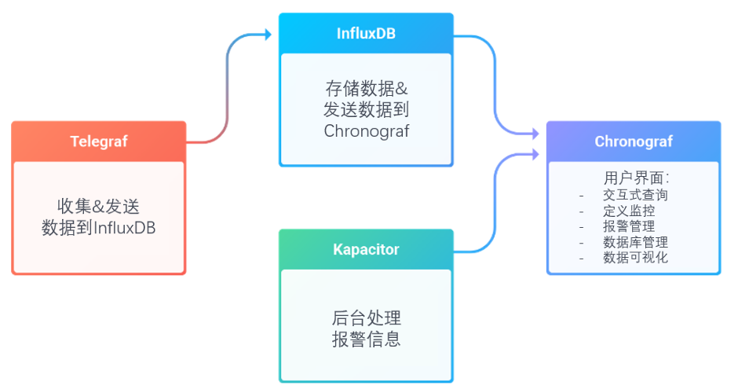
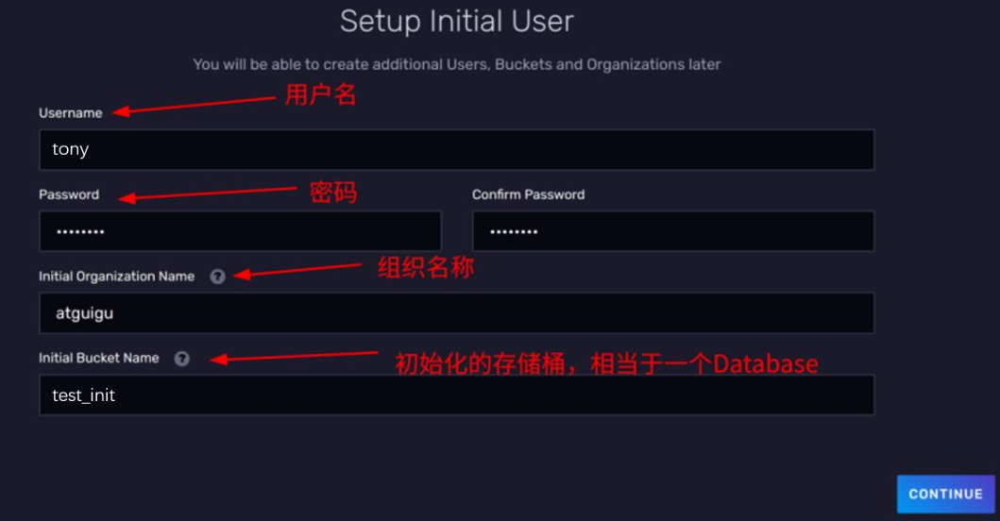

# InfluxDB

### InfluxDB 的使用场景

InfluxDB 是一种时序数据库，时序数据库通常被用在监控场景，比如运维和IOT（物 联网）领域。这类数据库旨在存储时序数据并实时处理它们。

比如。我们可以写一个程序将服务器上CPU的使用情况每隔10秒钟向InfluxDB中写 入一条数据。接着，我们写一个查询语句，查询过去 30秒 CPU的平均使用情况，然后让 这个查询语句也每隔10秒钟执行一次。最终，我们配置一条报警规则，如果查询语句的执 行结果>xxx，就立刻触发报警。 

上述就是一个指标监控的场景，在 IOT 领域中，也有大量的指标需要我们监控。比如， 机械设备的轴承震动频率，农田的湿度温度等等。

可以看得出，时序数据一般用在监控场景。大体上，数据的应用可以分为4步走：

- 数据采集
- 数据存储
- 数据查询（聚合操作）
- 报警

这样一看，只给一个数据库其实只能完成数据的存储和查询功能，上游的采集和下游 的报警都需要自己来实现。因此InfluxData在InfluxDB 1.X的时候推出了TICK生态来推出 start 全套的解决方案。

TICK4个字母分别对应4个组件。 

- T : Telegraf - 数据采集组件，收集&发送数据到InfluxDB。
- I : InfluxDB - 存储数据&发送数据到Chronograf。 

- C : Chronograf - 总的用户界面，起到总的管理功能。

- K : Kapacitor - 后台处理报警信息。

   

到了2.x,TICK进一步融合,ICK的功能全部融入了InfluxDB，仅需安装InfluxDB就能得到一个管理页面，而且附带了定时任务和报警功能。

### Install InfluxDB

在Linux中可以通过yum或者是二进制程序的压缩包安装，这里选择**压缩包安装**，

压缩包下载链接：https://download.influxdata.com/influxdb/releases/influxdb2-2.7.10_linux_amd64.tar.gz

官网下载文档：[Install InfluxDB | InfluxDB OSS v2](https://docs.influxdata.com/influxdb/v2/install/?t=Linux)

下载完压缩包后解压

```shell
tar xvzf ./influxdb2-2.7.10_linux_amd64.tar.gz
```

然后就把启动文件复制到（可选）`/usr/local/bin`

```shell
sudo cp ./influxdb2-2.7.10/usr/bin/influxd /usr/local/bin/
```

启动influxdb

```shell
# 如果复制到了 /usr/local/bin中可以直接使用influxd命令启动
./influxdb2-2.7.10/usr/bin/influxd
```

### Use InfluxDB

官网：[InfluxDB OSS v2 Documentation](https://docs.influxdata.com/influxdb/v2/)

尚硅谷视频：https://www.bilibili.com/video/BV1xd4y1c73c

在安装完成后，可以通过ip:8086访问Web UI

首次使用会进入初始化界面



填写完后点击CONTINUE按钮进入下一步。

接下来就是通过WebUI使用InfluxDB了

### Flux

注意：在InfluxDB3.0中，Flux将不再使用

[Flux Documentation](https://docs.influxdata.com/flux/v0/)

### InfluxQL 

[Query data with InfluxQL | InfluxDB OSS v2 Documentation](https://docs.influxdata.com/influxdb/v2/query-data/influxql/)

### Java中操作InfluxDB

github链接：[influxdata/influxdb-client-java: InfluxDB 2 JVM Based Clients](https://github.com/influxdata/influxdb-client-java)

依赖（需要使用jdk17，想要用jdk8需要用更早的版本）：

```xml
<dependency>
    <groupId>com.influxdb</groupId>
    <artifactId>influxdb-client-java</artifactId>
    <version>7.2.0</version>
</dependency>
```

**写数据**

```java
public class InfluxDBWriteDemo {

    private static char[] token = "Influxdb-token".toCharArray();
    private static String org = "org";
    private static String bucket = "example-java";

    public static void main(String[] args) {
        InfluxDBClient influxDBClient = InfluxDBClientFactory.create("http://locallinux:8086", token, org, bucket);

        //
        // Sync Write data
        //
        WriteApiBlocking writeApi = influxDBClient.getWriteApiBlocking();

//        WriteOptions writeOptions =
//                new WriteOptions.Builder()
//                        .batchSize(10)
//                        .flushInterval(10000)
//                        .build();
        // Async Write data
//        WriteApi writeApi = influxDBClient.makeWriteApi(writeOptions);
//        for (int i = 0; i < 10; i++) {
//            writeApi.writeRecord(WritePrecision.NS, "temperature,location=west value=60.0");
//        }

        //
        // Write by Data Point
        //
        Point point = Point.measurement("temperature")
                .addTag("location", "west")
                .addField("value", 55d)
                .time(Instant.now().toEpochMilli(), WritePrecision.MS);

        writeApi.writePoint(point);

        //
        // Write by LineProtocol
        //
        writeApi.writeRecord(WritePrecision.NS, "temperature,location=west value=60.0");

        //
        // Write by POJO
        //
        Temperature temperature = new Temperature();
        temperature.location = "west";
        temperature.value =49D;
        temperature.time = Instant.now();

        writeApi.writeMeasurement( WritePrecision.NS, temperature);

        influxDBClient.close();
    }
}

@Measurement(name = "temperature")
public class Temperature {
    @Column(tag = true)
    String location;

    @Column
    Double value;

    @Column(timestamp = true)
    Instant time;
}

```

**查数据**

```java
public class InfluxDBQueryDemo {
    private static char[] token = "influxdb-token".toCharArray();
    private static String org = "org";

    public static void main(String[] args) {
        InfluxDBClient influxDBClient = InfluxDBClientFactory.create("http://locallinux:8086", token, org);

        //
        // Query data
        //
        String flux = "from(bucket:\"bucket-name\") |> range(start: -15m)";

        QueryApi queryApi = influxDBClient.getQueryApi();

        List<FluxTable> tables = queryApi.query(flux);
        for (FluxTable fluxTable : tables) {
            List<FluxRecord> records = fluxTable.getRecords();
            for (FluxRecord fluxRecord : records) {
                System.out.println(fluxRecord.getTime() + ": " + fluxRecord.getValueByKey("_value") + " ：" + fluxRecord.getValueByKey("location"));
//                System.out.println(fluxRecord);
//                System.out.println(fluxRecord.getValues());
            }
        }

        influxDBClient.close();
    }
}
```

