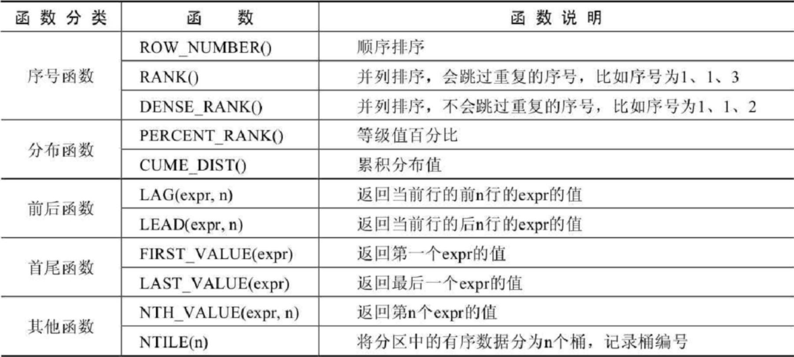

### 窗口函数

语法结构
窗口函数的语法结构是：

```sql
函数 OVER ([PARTITION BY 字段名 ORDER BY 字段名 ASC|DESC])
or
函数 OVER 窗口名 … WINDOW 窗口名 AS ([PARTITION BY 字段名 ORDER BY 字段名 ASC|DESC])
```
OVER 关键字指定函数窗口的范围。 

- 如果省略后面括号中的内容，则窗口会包含满足WHERE条件的所有记录，窗口函数会基于所 有满足WHERE条件的记录进行计算。 
- 如果OVER关键字后面的括号不为空，则可以使用如下语法设置窗口。 

窗口名：为窗口设置一个别名，用来标识窗口。 
PARTITION BY子句：指定窗口函数按照哪些字段进行分组。分组后，窗口函数可以在每个分组中分 别执行。
ORDER BY子句：指定窗口函数按照哪些字段进行排序。执行排序操作使窗口函数按照排序后的数据 记录的顺序进行编号。 
FRAME子句：为分区中的某个子集定义规则，可以用来作为滑动窗口使用。
**ROW_NUMBER()函数**

```sql
SELECT ROW_NUMBER() OVER(PARTITION BY category_id ORDER BY price DESC) AS row_num,
id, category_id, category, NAME, price, stock from goods;
# 根据category_id 分区， 每个分区根据price降序排序
# ROW_NUMBER() 为每个分区中的记录设置行号
```
**RANK()函数**
使用RANK()函数能够对序号进行并列排序，并且会跳过重复的序号，比如序号为1、1、3。

```sql
# 使用RANK()函数获取 goods 数据表中各类别的价格从高到低排序的各商品信息。
SELECT RANK() OVER(PARTITION BY category_id ORDER BY price DESC) AS row_num,
id, category_id, category, NAME, price, stock from goods;
# RANK()根据顺序，进行排序，会跳过重复的序号
```
**DENSE_RANK()函数**
DENSE_RANK()函数对序号进行并列排序，并且不会跳过重复的序号，比如序号为1、1、2。

```sql
SELECT DENSE_RANK() OVER(PARTITION BY category_id ORDER BY price DESC) AS row_num,
id, category_id, category, NAME, price, stock from goods;
# DENSE_RANKK(): 相较于RANK(),不会跳过重复的序号
```
**PERCENT_RANK()函数**
PERCENT_RANK()函数是等级值百分比函数。按照如下方式进行计算。
```sql
(rank - 1) / (rows - 1)
其中，rank的值为使用RANK()函数产生的序号，rows的值为当前窗口的总记录数。
```
```sql
SELECT RANK() OVER (PARTITION BY category_id ORDER BY price DESC) AS r,
PERCENT_RANK() OVER (PARTITION BY category_id ORDER BY price DESC) AS pr,
id, category_id, category, NAME, price, stock
FROM goods
WHERE category_id = 1;
```
**CUME_DIST()函数**
CUME_DIST()函数主要用于查询小于或等于某个值的比例。
```sql
SELECT CUME_DIST() OVER(PARTITION BY category_id ORDER BY price ASC) AS cd,
id, category, NAME, price from goods;
```
**LAG(expr,n)函数**
LAG(expr,n)函数返回当前行的前n行的expr的值。
```sql
SELECT id, category, NAME, price,
LAG(price,1) OVER (PARTITION BY category_id ORDER BY price)  AS pre_price 
FROM goods
```
**LEAD(expr,n)函数**
LEAD(expr,n)函数返回当前行的后n行的expr的值。  

```sql
SELECT id, category, NAME, price,
LEAD(price,1) OVER (PARTITION BY category_id ORDER BY price)  AS behind_price 
FROM goods
```
**FIRST_VALUE(expr)函数**
FIRST_VALUE(expr)函数返回第一个expr的值。
```sql
SELECT id, category, NAME, price, stock,
FIRST_VALUE(price) OVER (PARTITION BY category_id ORDER BY price) AS first_price
FROM goods
```
**LAST_VALUE(expr)函数**
LAST_VALUE(expr)函数返回最后一个expr的值。
```sql
SELECT id, category, NAME, price, stock,
LAST_VALUE(price) OVER (PARTITION BY category_id ORDER BY price) AS last_price
from goods
```
**NTH_VALUE(expr,n)函数**
NTH_VALUE(expr,n)函数返回第n个expr的值。
```sql
# 查询goods数据表中排名第2和第3的价格信息。
SELECT id, category, NAME, price,NTH_VALUE(price,2) OVER w AS second_price,
NTH_VALUE(price,3) OVER w AS third_price
FROM goods WINDOW w AS (PARTITION BY category_id ORDER BY price);
```
**NTILE(n)函数**
NTILE(n)函数将分区中的有序数据分为n个桶，记录桶编号。
```sql
# 将goods表中的商品按照价格分为3组。
SELECT NTILE(3) OVER w AS nt,id, category, NAME, price
FROM goods WINDOW w AS (PARTITION BY category_id ORDER BY price);
```
窗口函数的特点是可以分组，而且可以在分组内排序。另外，窗口函数不会因为分组而减少原表中的行数，这对我们在原表数据的基础上进行统计和排序非常有用。
### 公用表表达式
公用表表达式（或通用表表达式）简称为CTE（Common Table Expressions）。CTE是一个命名的临时结果集，作用范围是当前语句。CTE可以理解成一个可以复用的子查询，当然跟子查询还是有点区别的，CTE可以引用其他CTE，但子查询不能引用其他子查询。所以，可以考虑代替子查询。
依据语法结构和执行方式的不同，公用表表达式分为 **普通公用表表达式** 和 **递归公用表表达式** 2 种。
**普通公用表表达式**
语法结构
```sql
WITH CTE名称
AS （子查询）
SELECT|DELETE|UPDATE 语句;
```
普通公用表表达式类似于子查询，不过，跟子查询不同的是，它可以被多次引用，而且可以被其他的普通公用表表达式所引用。
```sql
# 获取员工所在部门的信息
WITH emp_dept_id
AS (SELECT DISTINCT department_id FROM employees)
SELECT *
FROM departments d JOIN emp_dept_id e
ON d.department_id = e.department_id;
```
公用表表达式可以起到子查询的作用。以后如果遇到需要使用子查询的场景，你可以在查询之前，先定义公用表表达式，然后在查询中用它来代替子查询。而且，跟子查询相比，公用表表达式有一个优点，就是定义过公用表表达式之后的查询，可以像一个表一样多次引用公用表表达式，而子查询则不能。
**递归公用表表达式**
递归公用表表达式也是一种公用表表达式，只不过，除了普通公用表表达式的特点以外，它还有自己的
特点，就是可以**调用自己**。它的语法结构是：
```sql
WITH RECURSIVE
CTE名称 AS （子查询）
SELECT|DELETE|UPDATE 语句;
```
递归公用表表达式由 2 部分组成，分别是**种子查询和递归查询**，中间通过关键字 UNION [ALL]进行连接。这里的种子查询，意思就是获得递归的初始值。这个查询只会运行一次，以创建初始数据集，之后递归查询会一直执行，直到没有任何新的查询数据产生，递归返回。
```sql
# 示例 查询所有是下下属身份的人
WITH RECURSIVE cte
AS
(
# 种子查询，找到第一代领导
SELECT employee_id,last_name,manager_id,1 AS n FROM employees WHERE manager_id = 0 
UNION ALL
SELECT a.employee_id,a.last_name,a.manager_id,n+1 FROM employees AS a JOIN cte
ON (a.manager_id = cte.employee_id) # 递归查询，找出以递归公用表表达式的人为领导的人
)
SELECT employee_id,last_name FROM cte WHERE n >= 3;
```
