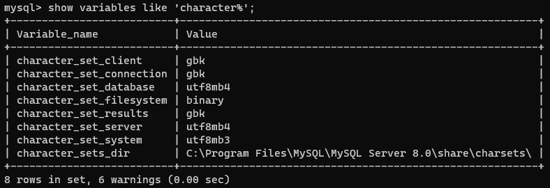
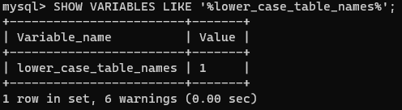
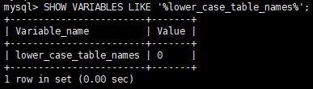
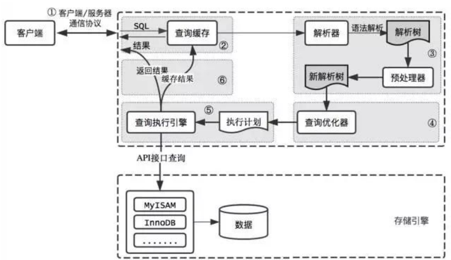
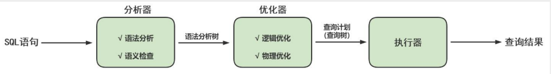
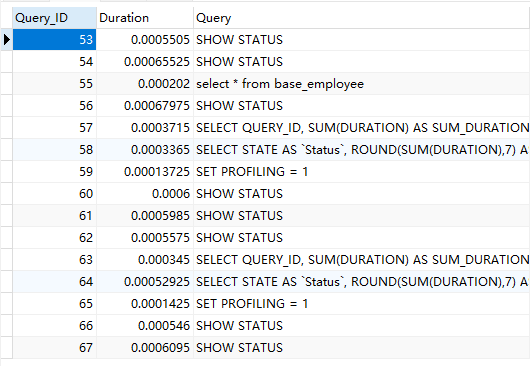
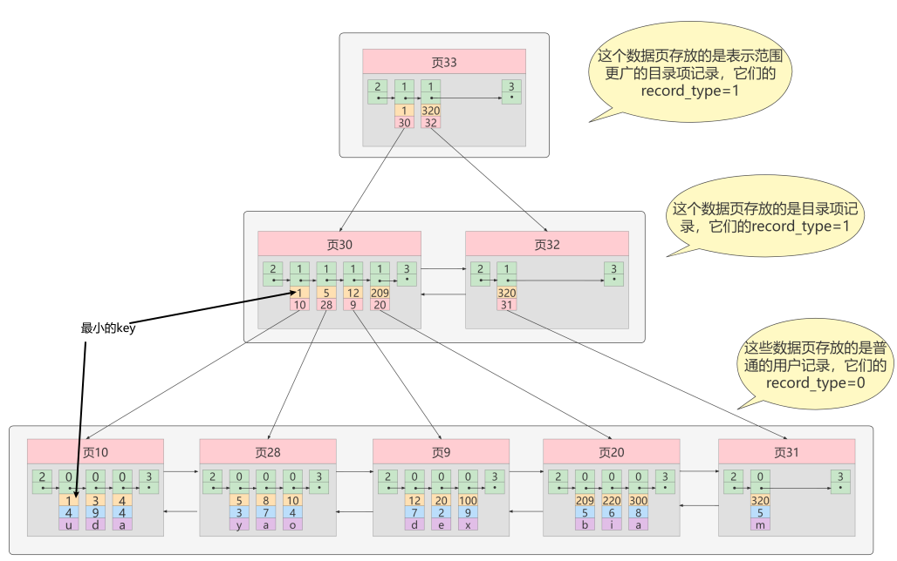
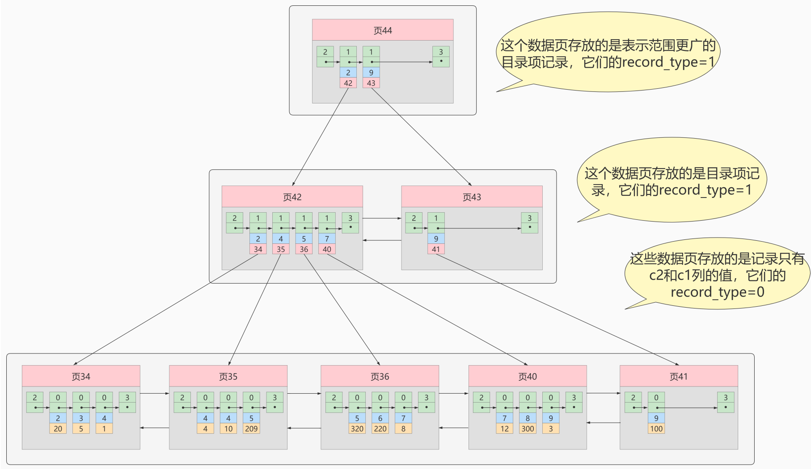
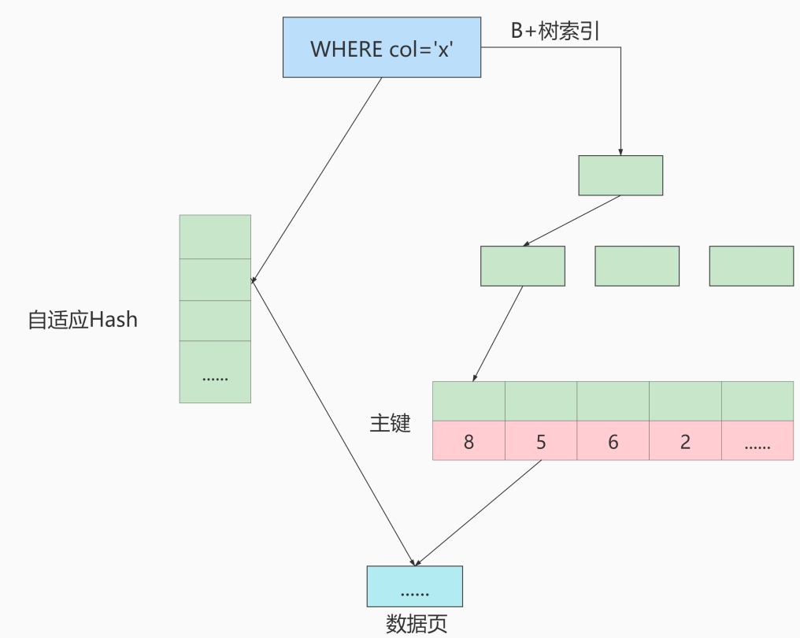

### 字符集
#### 查看默认使用的字符集
```sql
show variables like ''character%;

show variables like '%char%';
```


- character_set_server：服务器级别的字符集 
- character_set_database：当前数据库的字符集 
- character_set_client：服务器解码请求时使用的字符集 
- character_set_connection：服务器处理请求时会把请求字符串从character_set_client转为 character_set_connection 
- character_set_results：服务器向客户端返回数据时使用的字符集  
#### 修改字符集
显示已有表的创建SQL
```sql
show create table tb_student;
```
修改已创建数据库的字符集
```sql
alter database dbtest1 character set 'utf8';
```
 修改已创建数据表的字符集  
```sql
alter table t_emp convert to character set 'utf8';
```
#### 各级别的字符集
MySQL有四个级别的字符集和比较规则

- 服务器级别
- 数据库级别
- 表级别
- 列级别
##### 服务器级别
`character_set_server`：服务器级别的字符集
我们可以在启动服务器程序时通过启动选项或者在服务程序运行过程中使用Set语句修改者两个变量的值
语法：
```sql
[server]
character_set_server=gbk # 默认字符集
collation_server=gbk_chinese_ci #对应的默认的比较规则
```
##### 数据库级别
`character_set_database` ：当前数据库的字符集
我们在创建和修改数据库的时候可以指定该数据库的字符集和比较规则，具体语法如下：
```sql
CREATE DATABASE 数据库名
  [[DEFAULT] CHARACTER SET 字符集名称]
  [[DEFAULT] COLLATE 比较规则名称];

ALTER DATABASE 数据库名
  [[DEFAULT] CHARACTER SET 字符集名称]
  [[DEFAULT] COLLATE 比较规则名称]
ALTER DATABASE dbtest1 DEFAULT CHARACTER SET 'utf8' COLLATE 'utf8_general_ci';
```
##### 表级别
 我们也可以在创建和修改表的时候指定表的字符集和比较规则，语法如下：  
```sql
CREATE TABLE 表名 (列的信息)
  [[DEFAULT] CHARACTER SET 字符集名称]
  [COLLATE 比较规则名称]]
  
ALTER TABLE 表名
  [[DEFAULT] CHARACTER SET 字符集名称]
  [COLLATE 比较规则名称]
ALTER TABLE emp1 DEFAULT CHARACTER SET 'utf8' COLLATE 'utf8_general_ci';
```
**如果创建和修改表的语句中没有指明字符集和比较规则，将使用该表所在数据库的字符集和比较规则作为该表的字符集和比较规则。**
##### 列级别
 对于存储字符串的列，同一个表中的不同的列也可以有不同的字符集和比较规则。我们在创建和修改列 定义的时候可以指定该列的字符集和比较规则，语法如下：  
```sql
CREATE TABLE 表名(
  列名 字符串类型 [CHARACTER SET 字符集名称] [COLLATE 比较规则名称],
  其他列...
);

ALTER TABLE 表名 MODIFY 列名 字符串类型 [CHARACTER SET 字符集名称] [COLLATE 比较规则名称];
```
**对于某个列来说，如果在创建和修改的语句中没有指明字符集和比较规则，将使用该列所在表的字符集**
**和比较规则作为该列的字符集和比较规则。**
### SQL大小写规范
#### Windows和Linux平台的区别
在 SQL 中，关键字和函数名是不用区分字母大小写的，比如 SELECT、WHERE、ORDER、GROUP BY 等关 键字，以及 ABS、MOD、ROUND、MAX 等函数名。 
不过在 SQL 中，你还是要确定大小写的规范，因为在 Linux 和 Windows 环境下，你可能会遇到不同的大 小写问题。 windows系统默认大小写不敏感 ，但是 linux系统是大小写敏感的 。 
通过如下命令查看：  
```sql
SHOW VARIABLES LIKE '%lower_case_table_names%'
```

- Windows下

 

- Linux下

 

- lower_case_table_names参数值的设置
   - 默认为0，大小写敏感 。 
   - 设置1，大小写不敏感。创建的表，数据库都是以小写形式存放在磁盘上，对于sql语句都是转 换为小写对表和数据库进行查找。 
   - 设置2，创建的表和数据库依据语句上格式存放，凡是查找都是转换为小写进行。  
>  MySQL在Linux下数据库名、表名、列名、别名大小写规则是这样的：
> 1、数据库名、表名、表的别名、变量名是严格区分大小写的； 
> 2、关键字、函数名称在 SQL 中不区分大小写； 
> 3、列名（或字段名）与列的别名（或字段别名）在所有的情况下均是忽略大小写的； 
> 
> MySQL在Windows的环境下全部不区分大小写  

#### Linux下设置大小写规则
 当想设置为大小写不敏感时，要在 my.cnf 这个配置文件 [mysqld] 中加入 `lower_case_table_names=1` ，然后重启服务器。  

- 但是要在重启数据库实例之前就需要将原来的数据库和表转换为小写，否则将找不到数据库名。  
- 此参数适用于MySQL5.7。在MySQL 8下禁止在重新启动 MySQL 服务时将 lower_case_table_names 设置成不同于初始化 MySQL 服务时设置的 lower_case_table_names 值。如果非要将MySQL8设置为大小写不敏感，具体步骤为：  
```sql
1、停止MySQL服务
2、删除数据目录，即删除 /var/lib/mysql 目录
3、在MySQL配置文件（ /etc/my.cnf ）中添加 lower_case_table_names=1
4、启动MySQL服务
```
#### SQL编写建议
 如果你的变量名命名规范没有统一，就可能产生错误。这里有一个有关命名规范的建议：  
> 1. 关键字和函数名称全部大写； 
> 2. 数据库名、表名、表别名、字段名、字段别名等全部小写； 
> 3. SQL 语句必须以分号结尾。  

数据库名、表名和字段名在 Linux MySQL 环境下是区分大小写的，因此建议统一这些字段的命名规则，比如全部采用小写的方式。
虽然关键字和函数名称在 SQL 中不区分大小写，也就是如果小写的话同样可以执行。但是同时将关键词和函数名称全部大写，以便于区分数据库名、表名、字段名。

### MySQL8的主要目录结构
数据库文件的存放路径：`/var/lib/mysql`
相关命令目录：`/usr/bin（mysqladmin、mysqlbinlog、mysqldump等命令）和/usr/sbin`
配置文件目录：` /usr/share/mysql-8.0（命令及配置文件），/etc/mysql（如my.cnf）`

### 数据库和文件系统的关系
MySQL自带4个系统数据库

- mysql
   - MySQL 系统自带的核心数据库，它存储了MySQL的用户账户和权限信息，一些存储过程、事件的定义信息，一些运行过程中产生的日志信息，一些帮助信息以及时区信息等。
- information_schema
   - MySQL 系统自带的数据库，这个数据库保存着MySQL服务器 `维护的所有其他数据库的信息` ，比如有哪些表、哪些视图、哪些触发器、哪些列、哪些索引。这些信息并不是真实的用户数据，而是一些描述性信息，有时候也称之为 元数据 。在系统数据库 `information_schema` 中提供了一些以`innodb_sys` 开头的表，用于表示内部系统表。
- performance_schema
   - MySQL 系统自带的数据库，这个数据库里主要保存MySQL服务器运行过程中的一些状态信息，可以用来 `监控 MySQL 服务的各类性能指标 `。包括统计最近执行了哪些语句，在执行过程的每个阶段都花费了多长时间，内存的使用情况等信息。
- sys
   - MySQL 系统自带的数据库，这个数据库主要是通过 视图 的形式把 `information_schema` 和`performance_schema` 结合起来，帮助系统管理员和开发人员监控 MySQL 的技术性能。

### 用户与权限管理
#### 用户管理
启动MySQL服务后，可以通过mysql命令来登录MySQL服务器，命令如下：
```sql
mysql –h hostname|hostIP –P port –u username –p DatabaseName –e "SQL语句"
```
下面详细介绍命令中的参数：

- `-h参数` 后面接主机名或者主机IP，hostname为主机，hostIP为主机IP。
- `-P参数` 后面接MySQL服务的端口，通过该参数连接到指定的端口。MySQL服务的默认端口是3306，不使用该参数时自动连接到3306端口，port为连接的端口号。
- `-u参数` 后面接用户名，username为用户名。
- `-p参数` 会提示输入密码。
- `DatabaseName参数` 指明登录到哪一个数据库中。如果没有该参数，就会直接登录到MySQL数据库中，然后可以使用USE命令来选择数据库。
- `-e参数` 后面可以直接加SQL语句。登录MySQL服务器以后即可执行这个SQL语句，然后退出MySQL服务器。

示例：`mysql -uroot -p -hlocalhost -P3306 mysql -e "select host,user from user"`
##### 创建用户
CREATE USER语句的基本语法形式如下：
```sql
CREATE USER 用户名 [IDENTIFIED BY '密码'][,用户名 [IDENTIFIED BY '密码']];
```

- 用户名参数表示新建用户的账户，由 用户（User） 和 主机名（Host） 构成；
- “[ ]”表示可选，也就是说，可以指定用户登录时需要密码验证，也可以不指定密码验证，这样用户可以直接登录。不过，不指定密码的方式不安全，不推荐使用。如果指定密码值，这里需要使用IDENTIFIED BY指定明文密码值。
- CREATE USER语句可以同时创建多个用户。

示例：`CREATE USER zhang3 IDENTIFIED BY '123123'; # 默认host是 %`
##### 修改用户
**修改用户名**

```sql
UPDATE mysql.user SET USER='li4' WHERE USER='wang5';
FLUSH PRIVILEGES;
```
**删除用户**
**使用Drop方式删除**
使用DROP USER语句来删除用户时，必须拥有DROP USER权限。DROP USER语句的基本语法形式如下：
`DROP USER user[,user]…;`
示例：`DROP USER 'kangshifu'@'localhost';`
**使用Delete方式删除**
`DELETE FROM mysql.user WHERE Host='hostname' AND User='username';`
执行完DELETE命令后要使用FLUSH命令来使用户生效，命令如下：
`FLUSH PRIVILEGES;`

> 注意：不推荐使用Delete方式删除用户，会残留用户信息。
> 使用Drop方式会删除用户的基本信息和用户的权限信息

##### 设置密码
**设置当前登录用户密码**
使用ALTER USER命令来修改当前用户密码 
用户可以使用ALTER命令来修改自身密码，如下语句代表修改当前登录用户的密码。基本语法如下：
```sql
ALTER USER USER() IDENTIFIED BY 'new_password';
```
使用SET语句来修改当前用户密码
使用root用户登录MySQL后，可以使用SET语句来修改密码，具体SQL语句如下：

```sql
SET PASSWORD='new_password';
```
**设置其他用户的密码**
使用ALTER语句来修改普通用户的密码 
可以使用ALTER USER语句来修改普通用户的密码。基本语法形式如下：
```sql
ALTER USER user [IDENTIFIED BY '新密码'][,user[IDENTIFIED BY '新密码']]…;
```
使用SET命令来修改普通用户的密码 
使用root用户登录到MySQL服务器后，可以使用SET语句来修改普 通用户的密码。SET语句的代码如下：  

```sql
SET PASSWORD FOR 'username'@'hostname'='new_password';
```
 使用UPDATE语句修改普通用户的密码（不推荐）  
```sql
UPDATE MySQL.user SET authentication_string=PASSWORD("123456")
WHERE User = "username" AND Host = "hostname";
```
#### 权限管理
##### 权限列表
```sql
# 显示所有权限
show privileges;
```
> （1） CREATE和DROP权限 ，可以创建新的数据库和表，或删除（移掉）已有的数据库和表。如果将 MySQL数据库中的DROP权限授予某用户，用户就可以删除MySQL访问权限保存的数据库。 
> （2） SELECT、INSERT、UPDATE和DELETE权限 允许在一个数据库现有的表上实施操作。 
> （3） SELECT权限 只有在它们真正从一个表中检索行时才被用到。 
> （4） INDEX权限 允许创建或删除索引，INDEX适用于已 有的表。如果具有某个表的CREATE权限，就可以在CREATE TABLE语句中包括索引定义。 
> （5） ALTER权 限 可以使用ALTER TABLE来更改表的结构和重新命名表。 
> （6） CREATE ROUTINE权限 用来创建保存的 程序（函数和程序），ALTER ROUTINE权限用来更改和删除保存的程序， EXECUTE权限 用来执行保存的 程序。 
> （7） GRANT权限 允许授权给其他用户，可用于数据库、表和保存的程序。 
> （8） FILE权限 使用 户可以使用LOAD DATA INFILE和SELECT ... INTO OUTFILE语句读或写服务器上的文件，任何被授予FILE权 限的用户都能读或写MySQL服务器上的任何文件（说明用户可以读任何数据库目录下的文件，因为服务 器可以访问这些文件）。  

##### 授予权限原则
权限控制主要是出于安全因素，因此需要遵循以下几个 经验原则 ：
1、只授予能满足**需要的最小权限** ，防止用户干坏事。比如用户只是需要查询，那就只给select权限就可以了，不要给用户赋予update、insert或者delete权限。
2、创建用户的时候**限制用户的登录主机** ，一般是限制成指定IP或者内网IP段。
3、为每个用户 **设置满足密码复杂度的密码** 。
4、 **定期清理不需要的用户 **，回收权限或者删除用户。

##### 授予权限
给用户授权的方式有 2 种，分别是通过把 **角色赋予用户给用户授权** 和 **直接给用户授权** 。用户是数据库的
使用者，我们可以通过给用户授予访问数据库中资源的权限，来控制使用者对数据库的访问，消除安全
隐患。
授权命令：
```sql
GRANT 权限1,权限2,…权限n ON 数据库名称.表名称 TO 用户名@用户地址 [IDENTIFIED BY '密码口令'];
# 该权限如果发现没有该用户，则会直接新建一个用户。
```
示例：
```sql
# 给li4用户用本地命令行方式，授予atguigudb这个库下的所有表的插删改查的权限。
GRANT SELECT,INSERT,DELETE,UPDATE ON atguigudb.* TO li4@localhost ;

# 授予通过网络方式登录的joe用户 ，对所有库所有表的全部权限，密码设为123。
# 注意这里唯独不包括grant的权限
GRANT ALL PRIVILEGES ON *.* TO joe@'%' IDENTIFIED BY '123';
# 授权并创建用户
```
>  我们在开发应用的时候，经常会遇到一种需求，就是要根据用户的不同，对数据进行横向和纵向的 分组。
> - 所谓横向的分组，就是指用户可以接触到的数据的范围，比如可以看到哪些表的数据； 
> - 所谓纵向的分组，就是指用户对接触到的数据能访问到什么程度，比如能看、能改，甚至是 删除。  

##### 查看权限
**查看当前用户权限**
```sql
SHOW GRANTS;
# 或
SHOW GRANTS FOR CURRENT_USER;
# 或
SHOW GRANTS FOR CURRENT_USER();
```
**查看某用户的全局权限**
```sql
SHOW GRANTS FOR 'user'@'主机地址' ;
```
#####  收回权限
收回权限就是取消已经赋予用户的某些权限。**收回用户不必要的权限可以在一定程度上保证系统的安全性。**MySQL中使用 **REVOKE语句** 取消用户的某些权限。使用REVOKE收回权限之后，用户账户的记录将从db、host、tables_priv和columns_priv表中删除，但是用户账户记录仍然在user表中保存（删除user表中的账户记录使用DROP USER语句）。
**注意：在将用户账户从user表删除之前，应该收回相应用户的所有权限。**
收回权限命令

```sql
REVOKE 权限1,权限2,…权限n ON 数据库名称.表名称 FROM 用户名@用户地址;
```
举例
```sql
#收回全库全表的所有权限
REVOKE ALL PRIVILEGES ON *.* FROM joe@'%';

#收回mysql库下的所有表的插删改查权限
REVOKE SELECT,INSERT,UPDATE,DELETE ON mysql.* FROM joe@localhost;
```
注意： 须用户重新登录后才能生效

#### 角色管理
##### 角色的理解
引入角色的目的是 方便管理拥有相同权限的用户 。**恰当的权限设定，可以确保数据的安全性**，**这是至关**
**重要的。**

##### 创建角色
创建角色使用 CREATE ROLE 语句，语法如下：
```sql
CREATE ROLE 'role_name'[@'host_name'] [,'role_name'[@'host_name']]...
```
角色名称的命名规则和用户名类似。如果 host_name省略，默认为% ， role_name不可省略 ，不可为空。
示例：创建一个经理角色

```sql
CREATE ROLE 'manager'@'localhost';
```
##### 给角色授权
创建角色之后，默认这个角色是没有任何权限的，我们需要给角色授权。给角色授权的语法结构是：
```sql
GRANT privileges ON table_name TO 'role_name'[@'host_name'];
```
上述语句中privileges代表权限的名称，多个权限以逗号隔开。可使用`SHOW PRIVILEGES`语句查询权限名称
示例：给经理角色授予商品信息表、盘点表和应付账款表的只读权限，就可以用下面的代码来实现：

```sql
GRANT SELECT ON demo.settlement TO 'manager';
GRANT SELECT ON demo.goodsmaster TO 'manager';
GRANT SELECT ON demo.invcount TO 'manager';
```
##### 查看角色的权限
赋予角色权限之后，我们可以通过 SHOW GRANTS 语句，来查看权限是否创建成功了
```sql
mysql> SHOW GRANTS FOR 'manager';
+-------------------------------------------------------+
| Grants for manager@% |
+-------------------------------------------------------+
| GRANT USAGE ON *.* TO `manager`@`%` |
| GRANT SELECT ON `demo`.`goodsmaster` TO `manager`@`%` |
| GRANT SELECT ON `demo`.`invcount` TO `manager`@`%` |
| GRANT SELECT ON `demo`.`settlement` TO `manager`@`%` |
+-------------------------------------------------------+
```
只要你创建了一个角色，系统就会自动给你一个“ USAGE ”权限，意思是 连接登录数据库的权限 。
代码的最后三行代表了我们给角色“manager”赋予的权限，也就是对商品信息表、盘点表和应付账款表的只读权限。
结果显示，库管角色拥有商品信息表的只读权限和盘点表的增删改查权限。

##### 回收角色的权限
撤销角色权限的SQL语法如下：
```sql
REVOKE privileges ON tablename FROM 'rolename';
```
示例：撤销school_write角色的权限。
```sql
REVOKE INSERT, UPDATE, DELETE ON school.* FROM 'school_write';
```
##### 删除角色
SQL语法
```sql
DROP ROLE role [,role2]...
```
示例： 执行如下SQL删除角色school_read。  
```sql
DROP ROLE 'school_read';
```
##### 给用户赋予角色
角色创建并授权后，要赋给用户并处于 激活状态 才能发挥作用。给用户添加角色可使用GRANT语句，语法形式如下：
```sql
GRANT role [,role2,...] TO user [,user2,...];
```
在上述语句中，role代表角色，user代表用户。可将多个角色同时赋予多个用户，用逗号隔开即可。
示例：给kangshifu用户添加角色school_read

```sql
GRANT 'school_read' TO 'kangshifu'@'localhost';
```
查看授权
```sql
SHOW GRANTS FOR 'kangshifu'@'localhost';
```
使用kangshifu用户登录，然后查询当前角色，如果角色未激活，结果将显示NONE。SQL语句如下
```sql
SELECT CURRENT_ROLE();
```
##### 激活角色
使用`set default role`命令激活角色
示例：集合 kangshifu的角色
```sql
SET DEFAULT ROLE ALL TO 'kangshifu'@'localhost';
```
将`activate_all_roles_on_login`设置为ON
默认情况
```sql
mysql> show variables like 'activate_all_roles_on_login';
+-----------------------------+-------+
| Variable_name | Value |
+-----------------------------+-------+
| activate_all_roles_on_login | OFF |
+-----------------------------+-------+
1 row in set (0.00 sec)
```
设置变量属性
```sql
SET GLOBAL activate_all_roles_on_login=ON;
```
这条 SQL 语句的意思是，对 所有角色永久激活 。运行这条语句之后，用户才真正拥有了赋予角色的所有权限。
##### 撤销用户的角色
撤销用户角色的SQL语法如下：
```sql
REVOKE role FROM user;
```
示例：撤销kangshifu用户的school_read角色。
```sql
REVOKE 'school_read' FROM 'kangshifu'@'localhost';
```
##### 设置强制角色(mandatory role)
服务启动前设置
```sql
[mysqld]
mandatory_roles='role1,role2@localhost,r3@%.atguigu.com'
```
运行时设置
```sql
SET PERSIST mandatory_roles = 'role1,role2@localhost,r3@%.example.com'; #系统重启后仍然有效
SET GLOBAL mandatory_roles = 'role1,role2@localhost,r3@%.example.com'; #系统重启后失效
```
### 逻辑架构
#### MySQL中的SQL执行流程

执行流程： **SQL语句 -> 查询缓存 -> 解析器 -> 优化器 -> 执行器**



#### MySQL8中SQL执行原理
确认profiling是否开启
```sql
select @@profiling;

 show variables like 'profiling';
```

profiling=0 代表关闭，我们需要把 profiling 打开，即设置为 1：
```sql
set profiling=1;
```
查看profiles
```sql
# 查看当前会话所产生的所有profiles
show profiles;
```

查看profile

```sql
# 显示执行计划，查看程序的执行步骤
show profile

# 指定Query ID
show profile for query 74;

# 查看更丰富的内容
show profile cpu,block io for query 74;
```
### 存储引擎
#### 查看存储引擎
查看mysql提供的存储引擎
```sql
show engines;
```
设置系统默认的存储引擎
```sql
show variables like '%storage_engine%';
#或
SELECT @@default_storage_engine;
```
如果在创建表的语句中没有显式指定表的存储引擎的话，那就会默认使用 InnoDB 作为表的存储引擎。
如果我们想改变表的默认存储引擎的话，可以这样写启动服务器的命令行：
```sql
SET DEFAULT_STORAGE_ENGINE=MyISAM;
```
或者修改 **my.cnf **文件：
```sql
default-storage-engine=MyISAM
# 重启服务
systemctl restart mysqld.service
```
#### 设置表的存储引擎
指定表的存储引擎
```sql
CREATE TABLE 表名(
建表语句;
) ENGINE = 存储引擎名称;
```
修改表的存储引擎
```sql
ALTER TABLE 表名 ENGINE = 存储引擎名称;
# 示例
ALTER TABLE engine_demo_table ENGINE = InnoDB;
```
### 索引的数据结构

这个数据结构，它的名称是 B+树 。
一个B+树的节点其实可以分成好多层，规定最下边的那层，也就是存放我们用户记录的那层为第 0 层，之后依次往上加。

#### 常见索引概念
索引按照物理实现方式，索引可以分为 2 种：聚簇（聚集）和非聚簇（非聚集）索引。我们也把非聚集索引称为二级索引或者辅助索引。
##### 聚簇索引
**特点**：

1. 使用记录主键值的大小进行记录和页的排序，这包括三个方面的含义：
   1. 页内 的记录是按照主键的大小顺序排成一个 **单向链表** 。
   2. 各个存放 用户记录的页 也是根据页中用户记录的主键大小顺序排成一个 **双向链表** 。
   3. 存放 目录项记录的页 分为不同的层次，在同一层次中的页也是根据页中目录项记录的主键大小顺序排成一个 **双向链表**。
2. B+树的 叶子节点 存储的是完整的用户记录。
所谓完整的用户记录，就是指这个记录中存储了所有列的值（包括隐藏列）。

**优点**：

- 数据访问更快 ，因为聚簇索引将索引和数据保存在同一个B+树中，因此从聚簇索引中获取数据比非聚簇索引更快
- 聚簇索引对于主键的 排序查找 和 范围查找 速度非常快
- 按照聚簇索引排列顺序，查询显示一定范围数据的时候，由于数据都是紧密相连，数据库不用从多个数据块中提取数据，所以 节省了大量的io操作 。

**缺点**：

- 插入速度严重依赖于插入顺序 ，按照主键的顺序插入是最快的方式，否则将会出现页分裂，严重影
响性能。因此，对于InnoDB表，我们一般都会定义一个**自增的ID列为主键**
- 更新主键的代价很高 ，因为将会导致被更新的行移动。因此，对于InnoDB表，我们一般定义主键为不可更新
- 二级索引访问需要两次索引查找 ，第一次找到主键值，第二次根据主键值找到行数据
##### 非聚簇索引

非聚簇索引是通过非主键的字段建立的索引树
非聚簇索引树叶子节点内容本分只会存储索引字段和主键，不会存储完整的表记录
查询时，先通过查询这个非聚簇索引树，得到主键，然后回表查询聚簇索引树得到记录
**概念：回表** 我们根据这个以c2列大小排序的B+树只能确定我们要查找记录的主键值，所以如果我们想根 据c2列的值查找到完整的用户记录的话，仍然需要到 聚簇索引 中再查一遍，这个过程称为 回表 。也就 是根据c2列的值查询一条完整的用户记录需要使用到 2 棵B+树！  

##### 联合索引
我们也可以同时以多个列的大小作为排序规则，也就是同时为**多个列**建立索引，比方说我们想让B+树按 照 c2和c3列 的大小进行排序，这个包含两层含义： 

- 先把各个记录和页按照c2列进行排序。 
- 在记录的c2列相同的情况下，采用c3列进行排序 

注意一点，以c2和c3列的大小为排序规则建立的B+树称为** 联合索引** ，本质上也是一个二级索引。它的意思与分别为c2和c3列分别建立索引的表述是不同的，不同点如下： 

- 建立联合索引只会建立1棵B+树。 （内容字段有：c2，c3，id）
- 为c2和c3列分别建立索引会分别以c2和c3列的大小为排序规则建立2棵B+树。  
#### InnoDB的B+树索引的注意事项

1. 根页面位置万年不动
2. 内节点中目录项记录的唯一性
3. 一个页面最少存储2条记录
#### Hash结构
 Hash索引  

| 索引/存储引擎 | MyISAM | InnoDB | Memory |
| --- | --- | --- | --- |
| Hash索引 | false | false | true |

**自适应Hash**
自适应Hash指：某个查询非常常用时，系统会将该查询结果放到自适应Hash表中

通过 **innodb_adaptive_hash_index** 变量来查看是否开启了自适应 Hash，比如：  

```csharp
# 默认开启
show variables like '%adaptive_hash_index'; 
```

### 索引的声明和使用
#### 索引的分类
MySQL的索引包括普通索引、唯一性索引、全文索引、单列索引、多列索引和空间索引等。

- 从**功能逻辑**上说，索引主要有 4 种，分别是普通索引、唯一索引、主键索引、全文索引。 
- 按照**物理实现方式**，索引可以分为 2 种：聚簇索引和非聚簇索引。 
- 按照**作用字段个数**进行划分，分成单列索引和联合索引。  

小结：不同的存储引擎支持的索引类型也不一样 InnoDB ：支持 B-tree、Full-text 等索引，不支持 Hash索引； MyISAM ： 支持 B-tree、Full-text 等索引，不支持 Hash 索引； Memory ：支持 B-tree、Hash 等索引，不支持 Full-text 索引； NDB ：支持 Hash 索引，不支持 B-tree、Full-text 等索引； Archive ：不支持 B-tree、Hash、Full-text 等索引；
#### 创建索引
##### 创建表的时候创建索引
示例：
```sql
CREATE TABLE dept(
  dept_id INT PRIMARY KEY AUTO_INCREMENT, # 主键索引
  dept_name VARCHAR(20)
);
CREATE TABLE emp(
  emp_id INT PRIMARY KEY AUTO_INCREMENT,
  emp_name VARCHAR(20) UNIQUE,  # 唯一索引
  dept_id INT,
  CONSTRAINT emp_dept_id_fk FOREIGN KEY(dept_id) REFERENCES dept(dept_id) #外键索引
);
```
如果显示创建表时创建索引的话，基本语法格式如下：
```sql
CREATE TABLE table_name [col_name data_type]
[UNIQUE | FULLTEXT | SPATIAL] [INDEX | KEY] [index_name] (col_name [length]) [ASC | DESC]
```

- UNIQUE 、 FULLTEXT 和 SPATIAL 为可选参数，分别表示唯一索引、全文索引和空间索引； 
- INDEX 与 KEY 为同义词，两者的作用相同，用来指定创建索引； 
- index_name 指定索引的名称，为可选参数，如果不指定，那么MySQL默认col_name为索引名； 
- col_name 为需要创建索引的字段列，该列必须从数据表中定义的多个列中选择； 
- length 为可选参数，表示索引的长度，只有字符串类型的字段才能指定索引长度； 
- ASC 或 DESC 指定升序或者降序的索引值存储。  

**创建普通索引**
```sql
CREATE TABLE book(
  book_id INT ,
  book_name VARCHAR(100),
  authors VARCHAR(100),
  info VARCHAR(100) ,
  comment VARCHAR(100),
  year_publication YEAR,
  INDEX(year_publication)
);
```
**创建唯一索引**
```sql
CREATE TABLE test1(
  id INT NOT NULL,
  name varchar(30) NOT NULL,
  UNIQUE INDEX uk_idx_id(id) 
);
```
** 主键索引**
```sql
# 设定为主键后数据库会自动建立索引，innodb为聚簇索引
# 随表一起创建索引
CREATE TABLE student (
  id INT(10) UNSIGNED AUTO_INCREMENT ,
  student_no VARCHAR(200),
  student_name VARCHAR(200),
  PRIMARY KEY(id)
);
# 删除主键索引
ALTER TABLE student
drop PRIMARY KEY;
注意： 标注 AUTO_INCREMENT的主键索引不能被删除
```
**查询索引**
```sql
SHOW INDEX FROM test1;
```
**单列索引**
```sql
CREATE TABLE test2(
  id INT NOT NULL,
  name CHAR(50) NULL,
  INDEX single_idx_name(name(20))
);
```
**联合索引**
```sql
CREATE TABLE test3(
  id INT(11) NOT NULL,
  name CHAR(30) NOT NULL,
  age INT(11) NOT NULL,
  info VARCHAR(255),
  INDEX multi_idx(id,name,age)
);

```
**全文索引**
```sql
CREATE TABLE test4(
  id INT NOT NULL,
  name CHAR(30) NOT NULL,
  age INT NOT NULL,
  info VARCHAR(255),
  FULLTEXT INDEX futxt_idx_info(info)
) ENGINE=MyISAM;
# 注意： 在MySQL5.7及之后版本中可以不指定最后的ENGINE了，因为在此版本中InnoDB支持全文索引。

CREATE TABLE articles (
  id INT UNSIGNED AUTO_INCREMENT PRIMARY KEY,
  title VARCHAR (200),
  body TEXT,
  FULLTEXT index (title, body)
) ENGINE = INNODB ;

```
全文索引查询需要引用 match + against方式查询
```sql
SELECT * FROM articles WHERE MATCH(title,body) AGAINST (‘查询字符串’);
```
:::info
注意点 

1. 使用全文索引前，搞清楚版本支持情况；
2. 全文索引比 like + % 快 N 倍，但是可能存在精度问题； 
3. 如果需要全文索引的是大量数据，建议先添加数据，再创建索引。  
:::
**空间索引**
```sql
# 空间索引创建中，要求空间类型的字段必须为 非空 。
# 创建表test5，在空间类型为GEOMETRY的字段上创建空间索引，SQL语句如下：
CREATE TABLE test5(
  geo GEOMETRY NOT NULL,
  SPATIAL INDEX spa_idx_geo(geo)
) ENGINE=MyISAM;
```
##### 在已存在的表上创建索引
 在已经存在的表中创建索引可以使用ALTER TABLE语句或者CREATE INDEX语句。  
** 使用ALTER TABLE语句创建索引**
```sql
ALTER TABLE table_name ADD [UNIQUE | FULLTEXT | SPATIAL] [INDEX | KEY]
[index_name] (col_name[length],...) [ASC | DESC]
```
** 使用CREATE INDEX创建索引**
```sql
# CREATE INDEX语句可以在已经存在的表上添加索引，
# 在MySQL中，CREATE INDEX被映射到一个ALTER TABLE语句上，基本语法结构为：
CREATE [UNIQUE | FULLTEXT | SPATIAL] INDEX index_name
ON table_name (col_name[length],...) [ASC | DESC]
```
#### 删除索引
**使用ALTER TABLE删除索引**
```sql
ALTER TABLE table_name DROP INDEX index_name;
```
**使用DROP INDEX删除索引**
```sql
DROP INDEX index_name ON table_name;
```
:::info
 删除表中的列时，如果要删除的列为索引的组成部分，则该列也会从索引中删除。
如果组成 索引的所有列都被删除，则整个索引将被删除。  
:::
### MySQL8.0索引新特性
#### 支持排序索引
```sql
CREATE TABLE ts1(a int,b int,index idx_a_b(a,b desc));

# 使用
SELECT * FROM ts1 ORDER BY a,b DESC LIMIT 5;
```
#### 隐藏索引
在MySQL 5.7版本及之前，只能通过显式的方式删除索引。此时，如果发现删除索引后出现错误，又只能通过显式创建索引的方式将删除的索引创建回来。如果数据表中的数据量非常大，或者数据表本身比较大，这种操作就会消耗系统过多的资源，操作成本非常高。
从MySQL 8.x开始支持 **隐藏索引（invisible indexes）** ，只需要将待删除的索引设置为隐藏索引，使 查询优化器不再使用这个索引（即使使用force index（强制使用索引），优化器也不会使用该索引）， 确认将索引设置为隐藏索引后系统不受任何响应，就可以彻底删除索引。 **这种通过先将索引设置为隐藏索 引，再删除索引的方式就是软删除 。  **
**创建表时直接创建 **在MySQL中创建隐藏所以你通过SQL语句INVISIBLE来实现，语法形式如下：
```sql
CREATE TABLE tablename(
  propname1 type1[CONSTRAINT1],
  propname2 type2[CONSTRAINT2],
  ……
  propnamen typen,
  INDEX [indexname](propname1 [(length)]) INVISIBLE
);
# 上述语句比普通索引多了一个关键字INVISIBLE，用来标记索引为不可见索引。
```
**在已存在的表上创建**
```sql
CREATE INDEX indexname
ON tablename(propname[(length)]) INVISIBLE;

# 通过ALTER TABLE语句创建
ALTER TABLE tablename
ADD INDEX indexname (propname [(length)]) INVISIBLE;
```
**切换索引可见状态 **已存在的索引可通过如下语句切换可见状态
```sql
ALTER TABLE tablename ALTER INDEX index_name INVISIBLE; #切换成隐藏索引
ALTER TABLE tablename ALTER INDEX index_name VISIBLE; #切换成非隐藏索引
```
如果将index_cname索引切换成可见状态，通过explain查看执行计划，发现优化器选择了index_cname索引。
:::info
注意 当索引被隐藏时，它的内容仍然是和正常索引一样实时更新的。如果一个索引需要长期被隐 藏，那么可以将其删除，因为索引的存在会影响插入、更新和删除的性能。  
通过设置隐藏索引的可见性可以查看索引对调优的帮助。  
:::
**使隐藏索引对查询优化器可见**
 在MySQL 8版本中，为索引提供了一种新的测试方式，可以通过查询优化器的一个开关（use_invisible_indexes)来打开某个设置，使隐藏索引对查询优化器可见。如果 use_invisible_indexes 设置为off(默认)，优化器会忽略隐藏索引。如果设置为on，即使隐藏索引不可见，优化器在生成执行计 划时仍会考虑使用隐藏索引。  
在MySQL命令行执行如下命令查看查询优化器的开关设置。
```sql
select @@optimizer_switch 
# 在输出结果信息中找到如下属性配置：
use_invisible_indexes=off
# 此属性配置值为off，说明隐藏索引默认对查询优化器不可见
```
使隐藏索引对查询优化器可见，需要在MySQL命令行执行如下命令  
```sql
set session optimizer_switch="use_invisible_indexes=on";
```
### 索引设计的原则
> 提示： 创建函数加入报错： This function has none of DETERMINISTIC...... 
> 由于开启过慢查询日志bin-log, 我们就必须为我们的function指定一个参数。 
> 主从复制，主机会将写操作记录在bin-log日志中。从机读取bin-log日志，执行语句来同步数据。如果使用函数来操作数据，会导致从机和主键操作时间不一致。所以，默认情况下，mysql不开启创建函数设置。
>
> 查看mysql是否允许创建函数
> `show variables like 'log_bin_trust_function_creators'; `
> 命令开启：允许创建函数设置 
>
>  #不加global只是当前窗口有效。
>
> `set global log_bin_trust_function_creators=1;`
>  mysqld重启，上述参数又会消失。永久方法： 
> windows下my.ini[mysqld] 或者 linux下/etc/my.cnf[mysqld] 加上：
> `log_bin_trust_function_creators=1`

#### 哪些情况适合创建索引

- **字段的数值有唯一性限制**

业务上具有唯一特性的字段，即使是组合字段，也必须建成唯一索引。（来源：Alibaba）
说明：不要以为唯一索引影响了 insert 速度，这个速度损耗可以忽略，但提高查找速度是明显的。

- **频繁作为WHERE查询条件的字段**

某个字段在SELECT语句的 WHERE 条件中经常被使用到，那么就需要给这个字段创建索引了。尤其是在数据量大的情况下，创建普通索引就可以大幅提升数据查询的效率。
比如student_info数据表（含100万条数据），假设我们想要查询 student_id=123110 的用户信息。

- **经常GROUP BY 和 ORDER BY的列**

索引就是让数据按照某种顺序进行存储或检索，因此当我们使用 GROUP BY 对数据进行分组查询，或者使用 ORDER BY 对数据进行排序的时候，就需要 **对分组或者排序的字段进行索引** 。如果待排序的列有多
个，那么可以在这些列上建立 **组合索引** 。

- **UPDATE、DELETE的WHERE条件列**

对数据按照某个条件进行查询后再进行 UPDATE 或 DELETE 的操作，如果对 WHERE 字段创建了索引，就
能大幅提升效率。原理是因为我们需要先根据 WHERE 条件列检索出来这条记录，然后再对它进行更新或
删除。**如果进行更新的时候，更新的字段是非索引字段，提升的效率会更明显，这是因为非索引字段更**
**新不需要对索引进行维护**。

- **DISTINCT字段需要创建索引**

有时候我们需要对某个字段进行去重，使用 DISTINCT，那么对这个字段创建索引，也会提升查询效率。  

- **多表 JOIN 连接操作时，创建索引注意事项**

首先，** 连接表的数量尽量不要超过 3 张** ，因为每增加一张表就相当于增加了一次嵌套的循环，数量级增长会非常快，严重影响查询的效率。
其次， **对 WHERE 条件创建索引** ，因为 WHERE 才是对数据条件的过滤。如果在数据量非常大的情况下，没有 WHERE 条件过滤是非常可怕的。
最后， **对用于连接的字段创建索引** ，并且该字段在多张表中的 **类型必须一致 **。

- **使用列的类型小的创建索引**
- **使用字符串前缀创建索引**
```sql
# 创建一张商户表，因为地址字段比较长，在地址字段上建立前缀索引
create table shop(address varchar(120) not null);
alter table shop add index(address(12));
```
怎么计算不同的长度的选择性呢？
通过不同长度去计算，与全表的选择性对比：
```sql
count(distinct left(列名, 索引长度))/count(*)
```
>  **索引列前缀对排序的影响**
> 【 强制 】在 varchar 字段上建立索引时，必须指定索引长度，没必要对全字段建立索引，根据实际文本 区分度决定索引长度。 
> 说明：索引的长度与区分度是一对矛盾体，一般对字符串类型数据，长度为 20 的索引，区分度会 高达 90% 以上 ，可以使用 count(distinct left(列名, 索引长度))/count(*)的区分度来确定。  

- **区分度高(散列性高)的列适合作为索引**
- **使用最频繁的列放到联合索引的左侧**

这样也可以较少的建立一些索引。同时，由于"最左前缀原则"，可以增加联合索引的使用率。

- **在多个字段都要创建索引的情况下，联合索引优于单值索引**
#### 限制索引的数目
#### 哪些情况不适合创建索引

- 在where中使用不到的字段，不要设置索引
- 数据量小的表最好不要使用索引
- 有大量重复数据的列上不要建立索引
- 避免对经常更新的表创建过多的索引
- 不建议用无序的值作为索引
   - 例如身份证、UUID(在索引比较时需要转为ASCII，并且插入时可能造成页分裂)、MD5、HASH、无序长字符串等。
- 删除不再使用或者很少使用的索引
- 不要定义冗余或重复的索引
   - 冗余索引
     
   - 重复索引

### 课程文档
[第01章_Linux下MySQL的安装与使用.pdf](https://www.yuque.com/attachments/yuque/0/2024/pdf/26677932/1711590150128-f3f209d1-ec57-4371-9eff-e99d930e118e.pdf?_lake_card=%7B%22src%22%3A%22https%3A%2F%2Fwww.yuque.com%2Fattachments%2Fyuque%2F0%2F2024%2Fpdf%2F26677932%2F1711590150128-f3f209d1-ec57-4371-9eff-e99d930e118e.pdf%22%2C%22name%22%3A%22%E7%AC%AC01%E7%AB%A0_Linux%E4%B8%8BMySQL%E7%9A%84%E5%AE%89%E8%A3%85%E4%B8%8E%E4%BD%BF%E7%94%A8.pdf%22%2C%22size%22%3A2766453%2C%22ext%22%3A%22pdf%22%2C%22source%22%3A%22%22%2C%22status%22%3A%22done%22%2C%22download%22%3Atrue%2C%22taskId%22%3A%22uc2a80418-0f38-499d-9cfe-f854e50c92c%22%2C%22taskType%22%3A%22upload%22%2C%22type%22%3A%22application%2Fpdf%22%2C%22__spacing%22%3A%22both%22%2C%22mode%22%3A%22title%22%2C%22id%22%3A%22ubf51dd5f%22%2C%22margin%22%3A%7B%22top%22%3Atrue%2C%22bottom%22%3Atrue%7D%2C%22card%22%3A%22file%22%7D)
[第02章_MySQL的数据目录.pdf](https://www.yuque.com/attachments/yuque/0/2024/pdf/26677932/1711590150100-87f23cb6-d0f8-4d59-81d3-8d207c190ec0.pdf?_lake_card=%7B%22src%22%3A%22https%3A%2F%2Fwww.yuque.com%2Fattachments%2Fyuque%2F0%2F2024%2Fpdf%2F26677932%2F1711590150100-87f23cb6-d0f8-4d59-81d3-8d207c190ec0.pdf%22%2C%22name%22%3A%22%E7%AC%AC02%E7%AB%A0_MySQL%E7%9A%84%E6%95%B0%E6%8D%AE%E7%9B%AE%E5%BD%95.pdf%22%2C%22size%22%3A418980%2C%22ext%22%3A%22pdf%22%2C%22source%22%3A%22%22%2C%22status%22%3A%22done%22%2C%22download%22%3Atrue%2C%22taskId%22%3A%22udbcc4f39-fd5c-48ca-99e3-b801f141425%22%2C%22taskType%22%3A%22upload%22%2C%22type%22%3A%22application%2Fpdf%22%2C%22__spacing%22%3A%22both%22%2C%22mode%22%3A%22title%22%2C%22id%22%3A%22FixfE%22%2C%22margin%22%3A%7B%22top%22%3Atrue%2C%22bottom%22%3Atrue%7D%2C%22card%22%3A%22file%22%7D)
[第03章_用户与权限管理.pdf](https://www.yuque.com/attachments/yuque/0/2024/pdf/26677932/1711590150101-1ba22aec-d7dd-4853-aab0-a85c096e24e0.pdf?_lake_card=%7B%22src%22%3A%22https%3A%2F%2Fwww.yuque.com%2Fattachments%2Fyuque%2F0%2F2024%2Fpdf%2F26677932%2F1711590150101-1ba22aec-d7dd-4853-aab0-a85c096e24e0.pdf%22%2C%22name%22%3A%22%E7%AC%AC03%E7%AB%A0_%E7%94%A8%E6%88%B7%E4%B8%8E%E6%9D%83%E9%99%90%E7%AE%A1%E7%90%86.pdf%22%2C%22size%22%3A1148687%2C%22ext%22%3A%22pdf%22%2C%22source%22%3A%22%22%2C%22status%22%3A%22done%22%2C%22download%22%3Atrue%2C%22taskId%22%3A%22ue52b46dc-0fc0-4c3b-8d29-bd63d8f225f%22%2C%22taskType%22%3A%22upload%22%2C%22type%22%3A%22application%2Fpdf%22%2C%22__spacing%22%3A%22both%22%2C%22mode%22%3A%22title%22%2C%22id%22%3A%22PaAWV%22%2C%22margin%22%3A%7B%22top%22%3Atrue%2C%22bottom%22%3Atrue%7D%2C%22card%22%3A%22file%22%7D)
[第04章_逻辑架构.pdf](https://www.yuque.com/attachments/yuque/0/2024/pdf/26677932/1711590150117-9e1b4bb9-a1bd-4b04-bfed-5a03ecb634eb.pdf?_lake_card=%7B%22src%22%3A%22https%3A%2F%2Fwww.yuque.com%2Fattachments%2Fyuque%2F0%2F2024%2Fpdf%2F26677932%2F1711590150117-9e1b4bb9-a1bd-4b04-bfed-5a03ecb634eb.pdf%22%2C%22name%22%3A%22%E7%AC%AC04%E7%AB%A0_%E9%80%BB%E8%BE%91%E6%9E%B6%E6%9E%84.pdf%22%2C%22size%22%3A3498601%2C%22ext%22%3A%22pdf%22%2C%22source%22%3A%22%22%2C%22status%22%3A%22done%22%2C%22download%22%3Atrue%2C%22taskId%22%3A%22u6920df5a-dd10-4d07-9752-39c43aeab5e%22%2C%22taskType%22%3A%22upload%22%2C%22type%22%3A%22application%2Fpdf%22%2C%22__spacing%22%3A%22both%22%2C%22mode%22%3A%22title%22%2C%22id%22%3A%22UCvxl%22%2C%22margin%22%3A%7B%22top%22%3Atrue%2C%22bottom%22%3Atrue%7D%2C%22card%22%3A%22file%22%7D)
[第05章_存储引擎.pdf](https://www.yuque.com/attachments/yuque/0/2024/pdf/26677932/1711590150208-98bbcfda-8fa9-45dd-bdf3-f33b9a3c7173.pdf?_lake_card=%7B%22src%22%3A%22https%3A%2F%2Fwww.yuque.com%2Fattachments%2Fyuque%2F0%2F2024%2Fpdf%2F26677932%2F1711590150208-98bbcfda-8fa9-45dd-bdf3-f33b9a3c7173.pdf%22%2C%22name%22%3A%22%E7%AC%AC05%E7%AB%A0_%E5%AD%98%E5%82%A8%E5%BC%95%E6%93%8E.pdf%22%2C%22size%22%3A829595%2C%22ext%22%3A%22pdf%22%2C%22source%22%3A%22%22%2C%22status%22%3A%22done%22%2C%22download%22%3Atrue%2C%22taskId%22%3A%22u38400c0c-ee22-4d43-904d-ad90df418a8%22%2C%22taskType%22%3A%22upload%22%2C%22type%22%3A%22application%2Fpdf%22%2C%22__spacing%22%3A%22both%22%2C%22mode%22%3A%22title%22%2C%22id%22%3A%22QaxpY%22%2C%22margin%22%3A%7B%22top%22%3Atrue%2C%22bottom%22%3Atrue%7D%2C%22card%22%3A%22file%22%7D)
[第06章_索引的数据结构.pdf](https://www.yuque.com/attachments/yuque/0/2024/pdf/26677932/1711590150515-55eb0cdc-0618-4a68-b0bd-63e150a58c83.pdf?_lake_card=%7B%22src%22%3A%22https%3A%2F%2Fwww.yuque.com%2Fattachments%2Fyuque%2F0%2F2024%2Fpdf%2F26677932%2F1711590150515-55eb0cdc-0618-4a68-b0bd-63e150a58c83.pdf%22%2C%22name%22%3A%22%E7%AC%AC06%E7%AB%A0_%E7%B4%A2%E5%BC%95%E7%9A%84%E6%95%B0%E6%8D%AE%E7%BB%93%E6%9E%84.pdf%22%2C%22size%22%3A4528277%2C%22ext%22%3A%22pdf%22%2C%22source%22%3A%22%22%2C%22status%22%3A%22done%22%2C%22download%22%3Atrue%2C%22taskId%22%3A%22u330c8fe8-a25f-42b9-a9e5-1e638406fe0%22%2C%22taskType%22%3A%22upload%22%2C%22type%22%3A%22application%2Fpdf%22%2C%22__spacing%22%3A%22both%22%2C%22mode%22%3A%22title%22%2C%22id%22%3A%22j7Sar%22%2C%22margin%22%3A%7B%22top%22%3Atrue%2C%22bottom%22%3Atrue%7D%2C%22card%22%3A%22file%22%7D)
[第08章_索引的创建与设计原则.pdf](https://www.yuque.com/attachments/yuque/0/2024/pdf/26677932/1711590150489-fc52ba3f-85f2-46a7-8542-791a4c923e25.pdf?_lake_card=%7B%22src%22%3A%22https%3A%2F%2Fwww.yuque.com%2Fattachments%2Fyuque%2F0%2F2024%2Fpdf%2F26677932%2F1711590150489-fc52ba3f-85f2-46a7-8542-791a4c923e25.pdf%22%2C%22name%22%3A%22%E7%AC%AC08%E7%AB%A0_%E7%B4%A2%E5%BC%95%E7%9A%84%E5%88%9B%E5%BB%BA%E4%B8%8E%E8%AE%BE%E8%AE%A1%E5%8E%9F%E5%88%99.pdf%22%2C%22size%22%3A707895%2C%22ext%22%3A%22pdf%22%2C%22source%22%3A%22%22%2C%22status%22%3A%22done%22%2C%22download%22%3Atrue%2C%22taskId%22%3A%22u1e10df59-6817-4ecd-9061-eab8ea9cb65%22%2C%22taskType%22%3A%22upload%22%2C%22type%22%3A%22application%2Fpdf%22%2C%22__spacing%22%3A%22both%22%2C%22mode%22%3A%22title%22%2C%22id%22%3A%22pP1Ld%22%2C%22margin%22%3A%7B%22top%22%3Atrue%2C%22bottom%22%3Atrue%7D%2C%22card%22%3A%22file%22%7D)
[第09章_性能分析工具的使用.pdf](https://www.yuque.com/attachments/yuque/0/2024/pdf/26677932/1711590150544-90fa6c19-41bc-47ba-81cd-a6d6214bf02e.pdf?_lake_card=%7B%22src%22%3A%22https%3A%2F%2Fwww.yuque.com%2Fattachments%2Fyuque%2F0%2F2024%2Fpdf%2F26677932%2F1711590150544-90fa6c19-41bc-47ba-81cd-a6d6214bf02e.pdf%22%2C%22name%22%3A%22%E7%AC%AC09%E7%AB%A0_%E6%80%A7%E8%83%BD%E5%88%86%E6%9E%90%E5%B7%A5%E5%85%B7%E7%9A%84%E4%BD%BF%E7%94%A8.pdf%22%2C%22size%22%3A1936890%2C%22ext%22%3A%22pdf%22%2C%22source%22%3A%22%22%2C%22status%22%3A%22done%22%2C%22download%22%3Atrue%2C%22taskId%22%3A%22u5ed8ed27-47db-463c-badf-4212bd3c62f%22%2C%22taskType%22%3A%22upload%22%2C%22type%22%3A%22application%2Fpdf%22%2C%22__spacing%22%3A%22both%22%2C%22mode%22%3A%22title%22%2C%22id%22%3A%22FIOYE%22%2C%22margin%22%3A%7B%22top%22%3Atrue%2C%22bottom%22%3Atrue%7D%2C%22card%22%3A%22file%22%7D)
[第10章_索引优化与查询优化.pdf](https://www.yuque.com/attachments/yuque/0/2024/pdf/26677932/1711590150592-9554ba7a-dc99-49e8-bacf-bab64e4c79b1.pdf?_lake_card=%7B%22src%22%3A%22https%3A%2F%2Fwww.yuque.com%2Fattachments%2Fyuque%2F0%2F2024%2Fpdf%2F26677932%2F1711590150592-9554ba7a-dc99-49e8-bacf-bab64e4c79b1.pdf%22%2C%22name%22%3A%22%E7%AC%AC10%E7%AB%A0_%E7%B4%A2%E5%BC%95%E4%BC%98%E5%8C%96%E4%B8%8E%E6%9F%A5%E8%AF%A2%E4%BC%98%E5%8C%96.pdf%22%2C%22size%22%3A3560985%2C%22ext%22%3A%22pdf%22%2C%22source%22%3A%22%22%2C%22status%22%3A%22done%22%2C%22download%22%3Atrue%2C%22taskId%22%3A%22uabb83356-4cdf-446f-8c64-06e52816b4c%22%2C%22taskType%22%3A%22upload%22%2C%22type%22%3A%22application%2Fpdf%22%2C%22__spacing%22%3A%22both%22%2C%22mode%22%3A%22title%22%2C%22id%22%3A%22KXbvX%22%2C%22margin%22%3A%7B%22top%22%3Atrue%2C%22bottom%22%3Atrue%7D%2C%22card%22%3A%22file%22%7D)
[第11章_数据库的设计规范.pdf](https://www.yuque.com/attachments/yuque/0/2024/pdf/26677932/1711590150750-b7340739-862e-4623-ad3e-d1150587fe67.pdf?_lake_card=%7B%22src%22%3A%22https%3A%2F%2Fwww.yuque.com%2Fattachments%2Fyuque%2F0%2F2024%2Fpdf%2F26677932%2F1711590150750-b7340739-862e-4623-ad3e-d1150587fe67.pdf%22%2C%22name%22%3A%22%E7%AC%AC11%E7%AB%A0_%E6%95%B0%E6%8D%AE%E5%BA%93%E7%9A%84%E8%AE%BE%E8%AE%A1%E8%A7%84%E8%8C%83.pdf%22%2C%22size%22%3A3596890%2C%22ext%22%3A%22pdf%22%2C%22source%22%3A%22%22%2C%22status%22%3A%22done%22%2C%22download%22%3Atrue%2C%22taskId%22%3A%22ua2936a15-79c7-4a89-9689-0b725ef22e6%22%2C%22taskType%22%3A%22upload%22%2C%22type%22%3A%22application%2Fpdf%22%2C%22__spacing%22%3A%22both%22%2C%22mode%22%3A%22title%22%2C%22id%22%3A%22WOxj5%22%2C%22margin%22%3A%7B%22top%22%3Atrue%2C%22bottom%22%3Atrue%7D%2C%22card%22%3A%22file%22%7D)
[第12章_数据库其它调优策略.pdf](https://www.yuque.com/attachments/yuque/0/2024/pdf/26677932/1711590150789-e4384b12-c559-4e84-9d88-355c13000862.pdf?_lake_card=%7B%22src%22%3A%22https%3A%2F%2Fwww.yuque.com%2Fattachments%2Fyuque%2F0%2F2024%2Fpdf%2F26677932%2F1711590150789-e4384b12-c559-4e84-9d88-355c13000862.pdf%22%2C%22name%22%3A%22%E7%AC%AC12%E7%AB%A0_%E6%95%B0%E6%8D%AE%E5%BA%93%E5%85%B6%E5%AE%83%E8%B0%83%E4%BC%98%E7%AD%96%E7%95%A5.pdf%22%2C%22size%22%3A1215464%2C%22ext%22%3A%22pdf%22%2C%22source%22%3A%22%22%2C%22status%22%3A%22done%22%2C%22download%22%3Atrue%2C%22taskId%22%3A%22ua88e0576-b11f-4f02-b28d-267db5b564b%22%2C%22taskType%22%3A%22upload%22%2C%22type%22%3A%22application%2Fpdf%22%2C%22__spacing%22%3A%22both%22%2C%22mode%22%3A%22title%22%2C%22id%22%3A%22kNyA7%22%2C%22margin%22%3A%7B%22top%22%3Atrue%2C%22bottom%22%3Atrue%7D%2C%22card%22%3A%22file%22%7D)
[第13章_事务基础知识.pdf](https://www.yuque.com/attachments/yuque/0/2024/pdf/26677932/1711590150873-3bcd3edb-83c3-4d43-8420-f43f76f25d29.pdf?_lake_card=%7B%22src%22%3A%22https%3A%2F%2Fwww.yuque.com%2Fattachments%2Fyuque%2F0%2F2024%2Fpdf%2F26677932%2F1711590150873-3bcd3edb-83c3-4d43-8420-f43f76f25d29.pdf%22%2C%22name%22%3A%22%E7%AC%AC13%E7%AB%A0_%E4%BA%8B%E5%8A%A1%E5%9F%BA%E7%A1%80%E7%9F%A5%E8%AF%86.pdf%22%2C%22size%22%3A1019962%2C%22ext%22%3A%22pdf%22%2C%22source%22%3A%22%22%2C%22status%22%3A%22done%22%2C%22download%22%3Atrue%2C%22taskId%22%3A%22u14834a45-9b8f-49ae-9b6d-63808f3b23f%22%2C%22taskType%22%3A%22upload%22%2C%22type%22%3A%22application%2Fpdf%22%2C%22__spacing%22%3A%22both%22%2C%22mode%22%3A%22title%22%2C%22id%22%3A%22eBVn3%22%2C%22margin%22%3A%7B%22top%22%3Atrue%2C%22bottom%22%3Atrue%7D%2C%22card%22%3A%22file%22%7D)
[第14章_MySQL事务日志.pdf](https://www.yuque.com/attachments/yuque/0/2024/pdf/26677932/1711590150891-204b0667-d9c5-4005-8297-5433e2107225.pdf?_lake_card=%7B%22src%22%3A%22https%3A%2F%2Fwww.yuque.com%2Fattachments%2Fyuque%2F0%2F2024%2Fpdf%2F26677932%2F1711590150891-204b0667-d9c5-4005-8297-5433e2107225.pdf%22%2C%22name%22%3A%22%E7%AC%AC14%E7%AB%A0_MySQL%E4%BA%8B%E5%8A%A1%E6%97%A5%E5%BF%97.pdf%22%2C%22size%22%3A2063282%2C%22ext%22%3A%22pdf%22%2C%22source%22%3A%22%22%2C%22status%22%3A%22done%22%2C%22download%22%3Atrue%2C%22taskId%22%3A%22ud452c8ac-ab11-46a7-b7ba-a94e8e9b5fc%22%2C%22taskType%22%3A%22upload%22%2C%22type%22%3A%22application%2Fpdf%22%2C%22__spacing%22%3A%22both%22%2C%22mode%22%3A%22title%22%2C%22id%22%3A%22my1wg%22%2C%22margin%22%3A%7B%22top%22%3Atrue%2C%22bottom%22%3Atrue%7D%2C%22card%22%3A%22file%22%7D)
[第15章_锁.pdf](https://www.yuque.com/attachments/yuque/0/2024/pdf/26677932/1711590150925-4c0761b5-3e8d-416f-a253-d34d3f6ac93d.pdf?_lake_card=%7B%22src%22%3A%22https%3A%2F%2Fwww.yuque.com%2Fattachments%2Fyuque%2F0%2F2024%2Fpdf%2F26677932%2F1711590150925-4c0761b5-3e8d-416f-a253-d34d3f6ac93d.pdf%22%2C%22name%22%3A%22%E7%AC%AC15%E7%AB%A0_%E9%94%81.pdf%22%2C%22size%22%3A1805707%2C%22ext%22%3A%22pdf%22%2C%22source%22%3A%22%22%2C%22status%22%3A%22done%22%2C%22download%22%3Atrue%2C%22taskId%22%3A%22uc195d3d2-3d59-49a1-80ec-e35597e5540%22%2C%22taskType%22%3A%22upload%22%2C%22type%22%3A%22application%2Fpdf%22%2C%22__spacing%22%3A%22both%22%2C%22mode%22%3A%22title%22%2C%22id%22%3A%22p3dW3%22%2C%22margin%22%3A%7B%22top%22%3Atrue%2C%22bottom%22%3Atrue%7D%2C%22card%22%3A%22file%22%7D)
[第16章_多版本并发控制.pdf](https://www.yuque.com/attachments/yuque/0/2024/pdf/26677932/1711590151073-c3418a7f-07a4-4b7a-abe1-fd711e46c7d1.pdf?_lake_card=%7B%22src%22%3A%22https%3A%2F%2Fwww.yuque.com%2Fattachments%2Fyuque%2F0%2F2024%2Fpdf%2F26677932%2F1711590151073-c3418a7f-07a4-4b7a-abe1-fd711e46c7d1.pdf%22%2C%22name%22%3A%22%E7%AC%AC16%E7%AB%A0_%E5%A4%9A%E7%89%88%E6%9C%AC%E5%B9%B6%E5%8F%91%E6%8E%A7%E5%88%B6.pdf%22%2C%22size%22%3A1047979%2C%22ext%22%3A%22pdf%22%2C%22source%22%3A%22%22%2C%22status%22%3A%22done%22%2C%22download%22%3Atrue%2C%22taskId%22%3A%22u354c79f0-e7f9-426d-ac86-b783795f89f%22%2C%22taskType%22%3A%22upload%22%2C%22type%22%3A%22application%2Fpdf%22%2C%22__spacing%22%3A%22both%22%2C%22mode%22%3A%22title%22%2C%22id%22%3A%22Sfzsi%22%2C%22margin%22%3A%7B%22top%22%3Atrue%2C%22bottom%22%3Atrue%7D%2C%22card%22%3A%22file%22%7D)
[第17章_其它数据库日志.pdf](https://www.yuque.com/attachments/yuque/0/2024/pdf/26677932/1711590151135-0aa86d9f-1e37-4854-89e5-37bed0a3576d.pdf?_lake_card=%7B%22src%22%3A%22https%3A%2F%2Fwww.yuque.com%2Fattachments%2Fyuque%2F0%2F2024%2Fpdf%2F26677932%2F1711590151135-0aa86d9f-1e37-4854-89e5-37bed0a3576d.pdf%22%2C%22name%22%3A%22%E7%AC%AC17%E7%AB%A0_%E5%85%B6%E5%AE%83%E6%95%B0%E6%8D%AE%E5%BA%93%E6%97%A5%E5%BF%97.pdf%22%2C%22size%22%3A3170967%2C%22ext%22%3A%22pdf%22%2C%22source%22%3A%22%22%2C%22status%22%3A%22done%22%2C%22download%22%3Atrue%2C%22taskId%22%3A%22u2ef2bec5-50d9-4659-88d9-9357a023cb3%22%2C%22taskType%22%3A%22upload%22%2C%22type%22%3A%22application%2Fpdf%22%2C%22__spacing%22%3A%22both%22%2C%22mode%22%3A%22title%22%2C%22id%22%3A%22uLbPa%22%2C%22margin%22%3A%7B%22top%22%3Atrue%2C%22bottom%22%3Atrue%7D%2C%22card%22%3A%22file%22%7D)
[第18章_主从复制.pdf](https://www.yuque.com/attachments/yuque/0/2024/pdf/26677932/1711590151209-bac059b6-94b2-4081-86d3-b9fac032d402.pdf?_lake_card=%7B%22src%22%3A%22https%3A%2F%2Fwww.yuque.com%2Fattachments%2Fyuque%2F0%2F2024%2Fpdf%2F26677932%2F1711590151209-bac059b6-94b2-4081-86d3-b9fac032d402.pdf%22%2C%22name%22%3A%22%E7%AC%AC18%E7%AB%A0_%E4%B8%BB%E4%BB%8E%E5%A4%8D%E5%88%B6.pdf%22%2C%22size%22%3A1453925%2C%22ext%22%3A%22pdf%22%2C%22source%22%3A%22%22%2C%22status%22%3A%22done%22%2C%22download%22%3Atrue%2C%22taskId%22%3A%22u0edea525-2802-41ec-bd39-84296c37063%22%2C%22taskType%22%3A%22upload%22%2C%22type%22%3A%22application%2Fpdf%22%2C%22__spacing%22%3A%22both%22%2C%22mode%22%3A%22title%22%2C%22id%22%3A%22RWQgG%22%2C%22margin%22%3A%7B%22top%22%3Atrue%2C%22bottom%22%3Atrue%7D%2C%22card%22%3A%22file%22%7D)
[第19章_数据库备份与恢复.pdf](https://www.yuque.com/attachments/yuque/0/2024/pdf/26677932/1711590151263-1d3818c2-3732-4834-9563-c4609c76333e.pdf?_lake_card=%7B%22src%22%3A%22https%3A%2F%2Fwww.yuque.com%2Fattachments%2Fyuque%2F0%2F2024%2Fpdf%2F26677932%2F1711590151263-1d3818c2-3732-4834-9563-c4609c76333e.pdf%22%2C%22name%22%3A%22%E7%AC%AC19%E7%AB%A0_%E6%95%B0%E6%8D%AE%E5%BA%93%E5%A4%87%E4%BB%BD%E4%B8%8E%E6%81%A2%E5%A4%8D.pdf%22%2C%22size%22%3A1055123%2C%22ext%22%3A%22pdf%22%2C%22source%22%3A%22%22%2C%22status%22%3A%22done%22%2C%22download%22%3Atrue%2C%22taskId%22%3A%22u775a6e12-cb4a-4e88-9492-57b7884dd92%22%2C%22taskType%22%3A%22upload%22%2C%22type%22%3A%22application%2Fpdf%22%2C%22__spacing%22%3A%22both%22%2C%22mode%22%3A%22title%22%2C%22id%22%3A%22J3N0l%22%2C%22margin%22%3A%7B%22top%22%3Atrue%2C%22bottom%22%3Atrue%7D%2C%22card%22%3A%22file%22%7D)
[写在最后.pdf](https://www.yuque.com/attachments/yuque/0/2024/pdf/26677932/1711590151425-b53dfe56-2739-4060-8354-57d3954509e4.pdf?_lake_card=%7B%22src%22%3A%22https%3A%2F%2Fwww.yuque.com%2Fattachments%2Fyuque%2F0%2F2024%2Fpdf%2F26677932%2F1711590151425-b53dfe56-2739-4060-8354-57d3954509e4.pdf%22%2C%22name%22%3A%22%E5%86%99%E5%9C%A8%E6%9C%80%E5%90%8E.pdf%22%2C%22size%22%3A107084%2C%22ext%22%3A%22pdf%22%2C%22source%22%3A%22%22%2C%22status%22%3A%22done%22%2C%22download%22%3Atrue%2C%22taskId%22%3A%22ueae805ea-37a1-4977-82a4-a5b436eb436%22%2C%22taskType%22%3A%22upload%22%2C%22type%22%3A%22application%2Fpdf%22%2C%22__spacing%22%3A%22both%22%2C%22mode%22%3A%22title%22%2C%22id%22%3A%22SSoE6%22%2C%22margin%22%3A%7B%22top%22%3Atrue%2C%22bottom%22%3Atrue%7D%2C%22card%22%3A%22file%22%7D)
