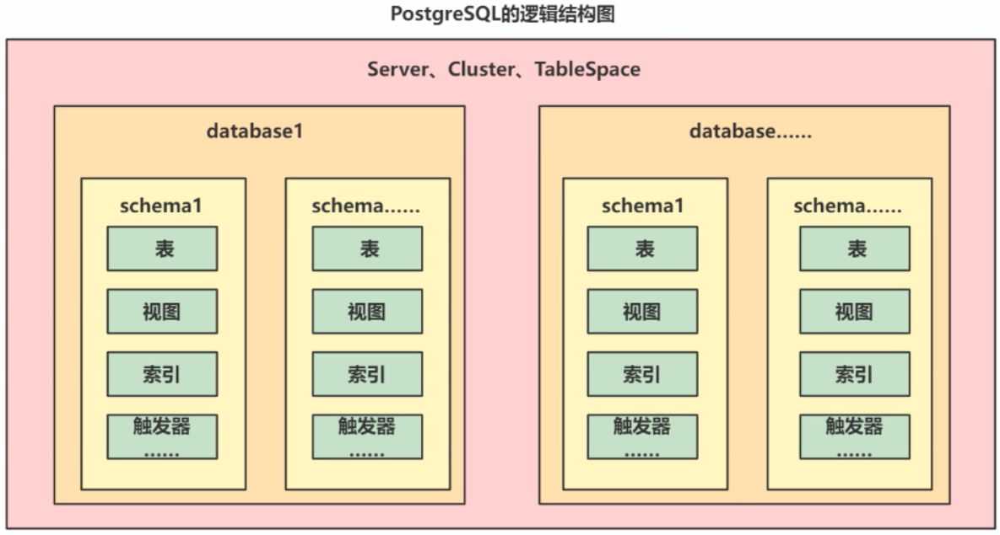

## PostgreSQL

### docker安装

```shell
docker pull postgres:14.19

docker run -d `
 --name postgres `
 -e POSTGRES_PASSWORD=postgres `
 -v E:\develop_tool\docker\postgres\data:/var/lib/postgresql/data `
 -p 5432:5432 `
 postgres:14.19
```

### 权限管理

命令行操作

PostgreSQL安装后会默认创建一个**postgres**账号，登录需要先切换到**postgres**账号

```shell
su postgres
```

输入**psql**,进入命令行交互界面

```shell
psql
可以直接进入到命令行的原因，是psql默认情况下，就是以postgres用户去连接本地的pgsql，所以可以直接进入

可以通过 psql --help 查看更多的参数
下面是建立连接的相关参数 

Connection options:
  -h, --host=HOSTNAME      database server host or socket directory (default: "local socket")
  -p, --port=PORT          database server port (default: "5432")
  -U, --username=USERNAME  database user name (default: "postgres")
  -w, --no-password        never prompt for password
  -W, --password           force password prompt (should happen automatically)
```

```shell
\help 查看数据库级别的命令
\help create user 可以查看命令的具体详情
\? 查看PostgreSQL服务级别的命令,q：退出
```


#### 用户操作

```sql
# 区别： create user默认有连接权限，create role没有，不过可以基于选项去设置
CREATE USER name [ [ WITH ] option [ ... ] ]
CREATE ROLE name [ [ WITH ] option [ ... ] ]

# 构建一个超级管理员用户
create user root with SUPERUSER PASSWORD 'root';

# root用户登录
psql -U root -W
```

光有用户并不能登录，还需要创建数据库

```sql
create database root;
```

在创建完数据库后，可以在不退出psql的情况下直接切换到另一个数据库

```sql
# 语法
\c[onnect] {[DBNAME|- USER|- HOST|- PORT|-] | conninfo}

# 切换到数据库 dbname， 使用的用户是当前登录用户
\c dbname;

# 切换到数据库 root，使用用户是root
\c root root;
```

如果要修改用户可以用`ALTER USER`

如果要删除用户可以用`DROP USER`

列出数据库的用户列表`\du`

#### 权限操作

**PGSQL的逻辑结构**

 

PGSQL一个数据库中有多个schema，在每个schema下都有自己的相应的库表信息，权限粒度会MySQL更细一些。

在PGSQL，权限管理可以分很多层

> server、cluster、tablespace级别：这个级别一般基于pg_hba.conf去配置
>
> database级别：通过命令级别操作，grant
>
> namespace、schema级别：玩的不多...不去多了解这个～~
>
> 对象级别：通过grant命令去设置

```sql
\help grant 查看命令详情
```

```sql
# 用有权限的用户在相应库中执行
# 把当前库下dbschema下的所以表的增改查权限赋予给dbuser
grant select,insert,update on all tables in schema dbschema to dbuser; 
```

对于拥有者来说，拥有对象相应所有的操作权限。

### 数据类型

数据类型，中文社区：http://www.postgres.cn/docs/12/datatype.html

| 名称     | 说明                                                         | 对比MySQL                                                    |
| -------- | ------------------------------------------------------------ | ------------------------------------------------------------ |
| 布尔类型 | boolean，标准的布尔类型，只能存储true，false                 | MySQL中虽然没有对应的boolean，但是有替换的类型，数值的tinyint类型，和PGSQL的boolean都是占1个字节。 |
| 整型     | smallint（2字节），integer（4字节），bigint（8字节）         | 跟MySQL没啥区别。                                            |
| 浮点型   | decimal，numeric（和decimal一样一样的，精准浮点型），real（float），double precision（double），money（货币类型） | 和MySQL基本也没区别，MySQL支持float，double，decimal。MySQL没有这个货币类型。 |
| 字符串型 | varchar(n) (character varying), char(n)(character), text     | 和MySQL没啥区别。<br />PGSQL的varchar类型，可以存储一个G，MySQL只能存储64KB |
| 日期类型 | date(年月日), time(时分秒), timestamp(年月日时分秒)          | 区别不大，MySQL有个datetime                                  |
| 二进制类型 | bytea-存储二进制类型                                | MySQL也支持，MySQL中是blob                      |
| 位图类型   | bit(n)（定长位图），bit varying(n)（可变长度位图）  | 就是存储0，1。MySQL也有，只是这个类型用的不多。 |
| 枚举类型   | enum，跟Java的enum一样                              | MySQL也支持。                                   |
| 几何类型   | 点，直线，线段，圆......                            | MySQL没有，但是一般开发也用不到                 |
| 数组类型   | 在类型后，追加，代表存储数组                        | MySQL没有~~                                     |
| JSON类型   | json（存储JSON数据的文本），jsonb（存储JSON二进制） | 可以存储JSON，MySQL8.x也支持                    |
| ip类型     | cidr（存储ip地址）                                  | MySQL也不支持~                                  |