1.缓存定义

> **缓存**就是数据交换的缓冲区（称作Cache），是临时存贮数据的地方，一般读写性能比较高

# 2.缓存使用
操作缓存和数据库时有三个问题需要考虑：
> **删除缓存还是更新缓存？**

更新缓存：每次更新数据库都更新缓存，无效写操作较多
**删除缓存：更新数据库时让缓存失效，查询时再更新缓存 √**

> **如何保证缓存与数据库的操作的同时成功或失败？**

单体系统，将缓存与数据库操作放在一个事务
分布式系统，利用TCC等分布式事务方案
> **先操作缓存还是先操作数据库？**

先操作数据库，再删除缓存
图示：
操作缓存的时间短，操作数据库的时间长；因此**先操作的数据库后删除缓存时**造成的数据不一致的可能性小
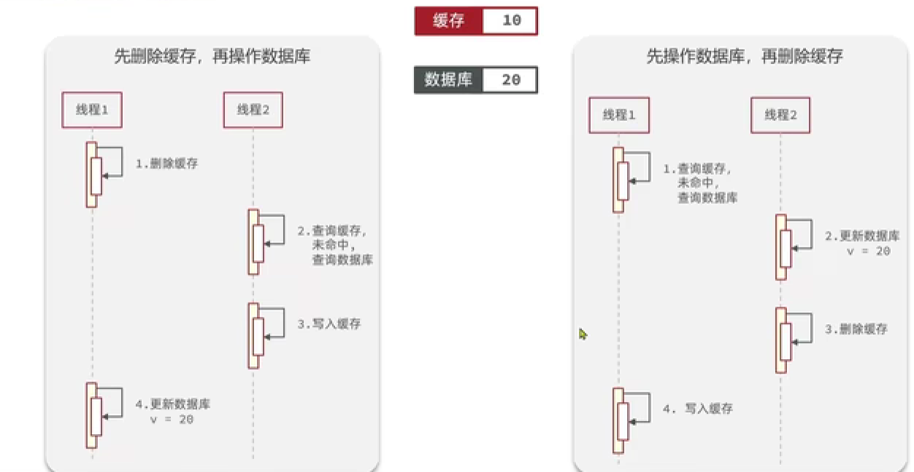

# 3.缓存穿透
> 定义：**缓存穿透**是指客户端请求的数据在缓存中和数据库中都不存在，这样缓存永远不会生效，这些请求都会打到数据库。

> 解决方案：
> 缓存空对象：
>  	在缓存和数据库中查询不到数据时，返回null，并存入缓存(设置较短的有效期)；以后的请求在缓存未过期前都会命中缓存而返回null。
>  	优点：实现简单，维护方便 缺点：- 额外的内存消耗 - 可能造成短期的数据不一致
> 布隆过滤


# 4.缓存雪崩
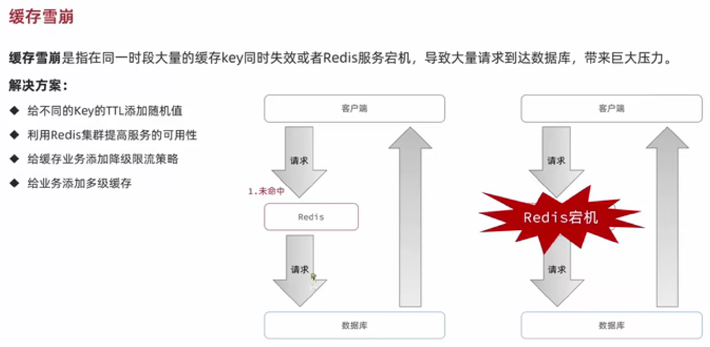
# 5.缓存击穿
> 定义：**缓存击穿问题**也叫热点Key问题，就是一个被**高并发访问**并且**缓存重建业务**较复杂的key突然失效了，无数的请求访问会在瞬间给数据库带来巨大的冲击。

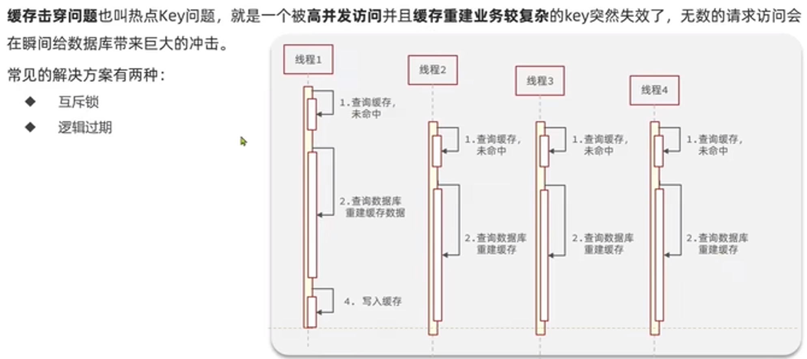
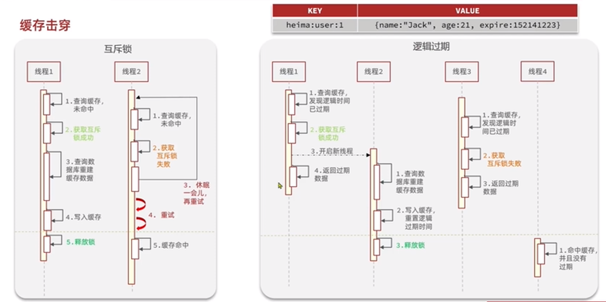

| 解决方案 | 优点 | 缺点 |
| --- | --- | --- |
| 互斥锁 | - 没有额外的内存消耗- 保证一致性- 实现简单 | - 线程需要等待，性能受影响- 可能有死锁风险|
| 逻辑过期 | - 线程无需等待，性能较好 | - 不保证一致性- 有额外内存消耗- 实现负载 |

```java
@Slf4j
@Component
public class CacheClient {

    private final StringRedisTemplate stringRedisTemplate;

    private static final ExecutorService CACHE_REBUILD_EXECUTOR = Executors.newFixedThreadPool(10);

    public CacheClient(StringRedisTemplate stringRedisTemplate) {
        this.stringRedisTemplate = stringRedisTemplate;
    }

    //保存到redis中
    public void set(String key, Object value, Long time, TimeUnit unit) {
        stringRedisTemplate.opsForValue().set(key, JSONUtil.toJsonStr(value), time, unit);
    }

    //设置逻辑过期
    public void setWithLogicalExpire(String key, Object value, Long time, TimeUnit unit) {
        // 设置逻辑过期
        RedisData redisData = new RedisData();
        redisData.setData(value);
        redisData.setExpireTime(LocalDateTime.now().plusSeconds(unit.toSeconds(time)));
        // 写入Redis
        stringRedisTemplate.opsForValue().set(key, JSONUtil.toJsonStr(redisData));
    }

    //解决缓存击穿
    public <R,ID> R queryWithPassThrough(
            String keyPrefix, ID id, Class<R> type, Function<ID, R> dbFallback, Long time, TimeUnit unit){
        String key = keyPrefix + id;
        // 1.从redis查询商铺缓存
        String json = stringRedisTemplate.opsForValue().get(key);
        // 2.判断是否存在
        if (StrUtil.isNotBlank(json)) {
            // 3.存在，直接返回
            return JSONUtil.toBean(json, type);
        }
        // 判断命中的是否是空值
        if (json != null) {
            // 返回一个错误信息
            return null;
        }

        // 4.不存在，根据id查询数据库
        R r = dbFallback.apply(id);
        // 5.不存在，返回错误
        if (r == null) {
            // 将空值写入redis
            stringRedisTemplate.opsForValue().set(key, "", CACHE_NULL_TTL, TimeUnit.MINUTES);
            // 返回错误信息
            return null;
        }
        // 6.存在，写入redis
        this.set(key, r, time, unit);
        return r;
    }
	//解决缓存击穿 逻辑过期实现
    public <R, ID> R queryWithLogicalExpire(
            String keyPrefix, ID id, Class<R> type, Function<ID, R> dbFallback, Long time, TimeUnit unit) {
        String key = keyPrefix + id;
        // 1.从redis查询商铺缓存
        String json = stringRedisTemplate.opsForValue().get(key);
        // 2.判断是否存在
        if (StrUtil.isBlank(json)) {
            // 3.存在，直接返回
            return null;
        }
        // 4.命中，需要先把json反序列化为对象
        RedisData redisData = JSONUtil.toBean(json, RedisData.class);
        R r = JSONUtil.toBean((JSONObject) redisData.getData(), type);
        LocalDateTime expireTime = redisData.getExpireTime();
        // 5.判断是否过期
        if(expireTime.isAfter(LocalDateTime.now())) {
            // 5.1.未过期，直接返回店铺信息
            return r;
        }
        // 5.2.已过期，需要缓存重建
        // 6.缓存重建
        // 6.1.获取互斥锁
        String lockKey = LOCK_SHOP_KEY + id;
        boolean isLock = tryLock(lockKey);
        // 6.2.判断是否获取锁成功
        if (isLock){
            // 6.3.成功，开启独立线程，实现缓存重建
            CACHE_REBUILD_EXECUTOR.submit(() -> {
                try {
                    // 查询数据库
                    R newR = dbFallback.apply(id);
                    // 重建缓存
                    this.setWithLogicalExpire(key, newR, time, unit);
                } catch (Exception e) {
                    throw new RuntimeException(e);
                }finally {
                    // 释放锁
                    unlock(lockKey);
                }
            });
        }
        // 6.4.返回过期的商铺信息
        return r;
    }

    //解决缓存穿透
    public <R, ID> R queryWithMutex(
            String keyPrefix, ID id, Class<R> type, Function<ID, R> dbFallback, Long time, TimeUnit unit) {
        String key = keyPrefix + id;
        // 1.从redis查询商铺缓存
        String shopJson = stringRedisTemplate.opsForValue().get(key);
        // 2.判断是否存在
        if (StrUtil.isNotBlank(shopJson)) {
            // 3.存在，直接返回
            return JSONUtil.toBean(shopJson, type);
        }
        // 判断命中的是否是空值
        if (shopJson != null) {
            // 返回一个错误信息
            return null;
        }

        // 4.实现缓存重建
        // 4.1.获取互斥锁
        String lockKey = LOCK_SHOP_KEY + id;
        R r = null;
        try {
            boolean isLock = tryLock(lockKey);
            // 4.2.判断是否获取成功
            if (!isLock) {
                // 4.3.获取锁失败，休眠并重试
                Thread.sleep(50);
                return queryWithMutex(keyPrefix, id, type, dbFallback, time, unit);
            }
            // 4.4.获取锁成功，根据id查询数据库
            r = dbFallback.apply(id);
            // 5.不存在，返回错误
            if (r == null) {
                // 将空值写入redis
                stringRedisTemplate.opsForValue().set(key, "", CACHE_NULL_TTL, TimeUnit.MINUTES);
                // 返回错误信息
                return null;
            }
            // 6.存在，写入redis
            this.set(key, r, time, unit);
        } catch (InterruptedException e) {
            throw new RuntimeException(e);
        }finally {
            // 7.释放锁
            unlock(lockKey);
        }
        // 8.返回
        return r;
    }

    private boolean tryLock(String key) {
        Boolean flag = stringRedisTemplate.opsForValue().setIfAbsent(key, "1", 10, TimeUnit.SECONDS);
        return BooleanUtil.isTrue(flag);
    }

    private void unlock(String key) {
        stringRedisTemplate.delete(key);
    }
}
```
# 6.秒杀案例seckill
## 6.1秒杀业务

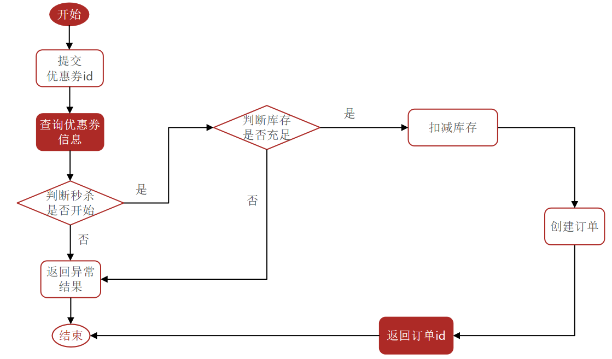

## 6.2秒杀超卖问题
> 超卖问题：例如多个线程同时取到stock=1，在线程中stock-=1且改变数据库记录，最后会造成stock<0；形成超卖问题

> 超卖问题是典型的多线程安全问题，针对这一问题的常见解决方案就是加锁：
> **悲观锁**：认为线程安全问题一定会发生，因此在操作数据之前先获取锁，确保线程串行执行。
> 例如：Synchronized、Lock都属于悲观锁
> **乐观锁**：认为线程安全问题不一定会发生，因此不加锁，只是在更新数据时去判断有没有其它线程对数据做了修改。
> - 如果没有修改则认为是安全的，自己才更新数据。
> - 如果已经被其它线程修改说明发生了安全问题，此时可以重试或异常。
> 
乐观锁判断数据是否有被修改过，常见的两种方式：**版本号法&CAS法**
> 版本号法：在数据库表中添加**version**字段，在修改数据时判断version是否等于取到数据时的version
> 例如：取数据：stock=1,version=1 更新时：set stock = stock-1 where  version =1 and ...
> CAS法：通过在更新时添加 **待修改字段原数据 **的条件
> 例如：取数据：stock = 1 更新时：set stock = stock - 1 where stock = 1 and ...
> 悲观锁：添加同步锁，让线程串行执行
> - 优点：简单粗暴
> - 缺点：性能一般
> 
乐观锁：不加锁，在更新时判断是否有其它线程在修改
> - 优点：性能好
> - 缺点：存在成功率低的问题

## 6.2一人一单
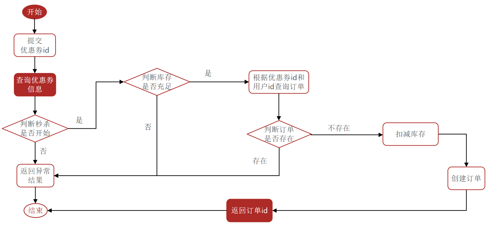
> 在判断订单是否存在这里需要加锁，防止并发安全问题
> 通过加锁可以解决在单机情况下的一人一单安全问题，但是在集群模式下就不行了。
> 通过加**分布式锁**可以解决集群模式下的一人一大安全问题。

## 6.3分布式锁
> 满足分布式系统或集群模式下多进程可见并且互斥的锁。特征：多进程可见、互斥、高可用、高性能、安全性

> 分布式锁的实现

|  | MySQL | Redis | Zookeeper |
| --- | --- | --- | --- |
| 互斥 | 利用MySQL本身的互斥锁机制 | 利用setnx这样的互斥命令 | 利用节点的唯一性和有序性实现互斥 |
| 高可用 | 好 | 好 | 好 |
| 高性能 | 一般 | 好 | 一般 |
| 安全性 | 断开连接，自动释放锁 | 利用锁超时时间，到期释放 | 临时节点，断开连接自动释放 |

> 这里通过redis实现分布式锁，通过redis实现分布式锁需要注意操作的原子性

```java
public class SimpleRedisLock implements ILock {

    private String name;
    private StringRedisTemplate stringRedisTemplate;

    public SimpleRedisLock(String name, StringRedisTemplate stringRedisTemplate) {
        this.name = name;
        this.stringRedisTemplate = stringRedisTemplate;
    }

    private static final String KEY_PREFIX = "lock:";
    private static final String ID_PREFIX = UUID.randomUUID().toString(true) + "-";
    private static final DefaultRedisScript<Long> UNLOCK_SCRIPT;
    static {
        UNLOCK_SCRIPT = new DefaultRedisScript<>();
        UNLOCK_SCRIPT.setLocation(new ClassPathResource("unlock.lua"));
        UNLOCK_SCRIPT.setResultType(Long.class);
    }

    @Override
    public boolean tryLock(long timeoutSec) {
        // 获取线程标示
        String threadId = ID_PREFIX + Thread.currentThread().getId();
        // 获取锁
        Boolean success = stringRedisTemplate.opsForValue()
                .setIfAbsent(KEY_PREFIX + name, threadId, timeoutSec, TimeUnit.SECONDS);
        return Boolean.TRUE.equals(success);
    }

    @Override
    public void unlock() {
        // 调用lua脚本
        stringRedisTemplate.execute(
                UNLOCK_SCRIPT,
                Collections.singletonList(KEY_PREFIX + name),
                ID_PREFIX + Thread.currentThread().getId());
    }
    /*
    //为了保证操作的原子性，防止出现极端情况，调用lua脚本实现释放锁的操作
	@Override
    public void unlock() {
        // 获取线程标示
        String threadId = ID_PREFIX + Thread.currentThread().getId();
        // 获取锁中的标示
        String id = stringRedisTemplate.opsForValue().get(KEY_PREFIX + name);
        // 判断标示是否一致
        if(threadId.equals(id)) {
            // 释放锁
            stringRedisTemplate.delete(KEY_PREFIX + name);
        }
    }*/
}
```
```lua
-- 比较线程标示与锁中的标示是否一致
if(redis.call('get', KEYS[1]) ==  ARGV[1]) then
    -- 释放锁 del key
    return redis.call('del', KEYS[1])
end
return 0
```
> 基于Redis的分布式锁实现思路：
> - 利用set nx ex获取锁，并设置过期时间，保存线程标示
> - 释放锁时先判断线程标示是否与自己一致，一致则删除锁（防止误删）
> 
特性：
> - 利用set nx满足互斥性
> - 利用set ex保证故障时锁依然能释放，避免死锁，提高安全性
> - 利用Redis集群保证高可用和高并发特性

## 6.4Redisson
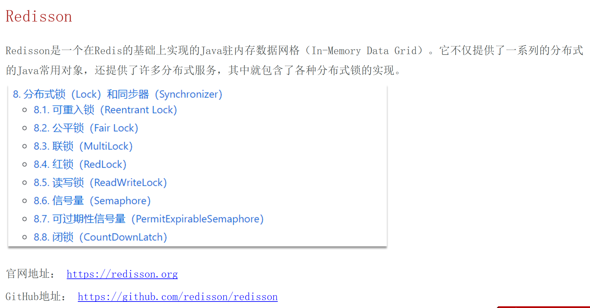
> Redisson使用

```xml
<!--redisson-->
<dependency>
    <groupId>org.redisson</groupId>
    <artifactId>redisson</artifactId>
    <version>3.13.6</version>
</dependency>
```
```java
@Configuration
public class RedissonConfig {
    @Bean
    public RedissonClient redissonClient(){
        // 配置
        Config config = new Config();
        config.useSingleServer().setAddress("redis://192.168.150.101:6379").setPassword("123321");
        // 创建RedissonClient对象
        return Redisson.create(config);
    }
}
```
```java
@Resource
private RedissonClient redissonClient;

@Test
void testRedisson() throws InterruptedException{
    //获取锁（可重入） 指定锁名称
    RLock lock = redissonClient.getLock("anyLock");
	//尝试获取锁，参数分别是 获取锁的最大等待时间（期间会重试），锁自动释放时间，时间单位
	boolean isLock = lock.tryLock(1,10,TimeUnit.SECONDS);
	//判断释放获取成功
	if(!isLock){
        System.out.println("执行业务");
    }finally{
        //释放锁
        lock.unlock();
    }
}
```
## 6.5Redis优化秒杀(含消息队列实现异步秒杀)
todo
# 7.点赞（利用Set或Zset实现）
需求：同一个用户只能点赞一次，再次点击则取消点赞如果当前用户已经点赞，则点赞按钮高亮显示（前端实现，判断字段Blog类的isLike属性）
实现步骤：给Blog类中添加一个isLike字段，标示是否被当前用户点赞修改点赞功能，利用Redis的**Set或Zset(使用ZSet的原因是为了获取点赞排行)**集合判断是否点赞过，未点赞过则点赞数+1，已点赞过则点赞数-1修改根据id查询Blog的业务，判断当前登录用户是否点赞过，赋值给isLike字段修改分页查询Blog业务，判断当前登录用户是否点赞过，赋值给isLike字段
疑问：是否需要将点赞的记录保存到数据库 如果保存到数据库，该如何实现

# 8.关注
## 8.1关注和取关
> 关注是User之间的关系，是博主和粉丝的关系，数据库中有一张tb_follow来表示：（主键自增）

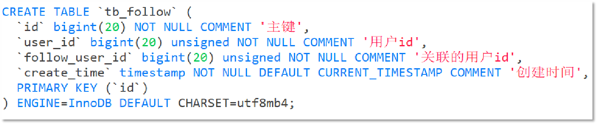
> 思路

关注(取关)请求只需要传入被关注用户id(**followUserId**)和判断是否为关注的字段(**isFollow**)；通过判断isFollow来确定是关注还是取关，在业务处理时需要获取登录用户的id；关注则保存到数据库，取关则从数据库中删除。
是否关注的判断则是通过传入的被关注用户id(**followUserId**)和登录用户id从数据库查询，判断数量是否大于0
## 8.2共同关注
> 实现共同关注的思路就是获取两个用户的关注列表的交集。
> 可以通过redis的**set集合(唯一，有实现交集的方法(intersect))**实现。


## 8.3关注推送（Feed流）
> 关注推送也叫做Feed流，直译为投喂。为用户持续的提供“沉浸式”的体验，通过无限下拉刷新获取新的信息。

Feed流产品的两种常见模式：
Timeline：不做内容筛选，简单的按照内容发布时间排序，常用于好友或关注。

- 例如朋友圈优点：信息全面，不会有缺失。并且实现也相对简单
- 缺点：信息噪音较多，用户不一定感兴趣，内容获取效率低

智能排序：利用智能算法屏蔽掉违规的、用户不感兴趣的内容。推送用户感兴趣信息来吸引用户

- 优点：投喂用户感兴趣信息，用户粘度很高，容易沉迷
- 缺点：如果算法不精准，可能起到反作用

本例中的个人页面，是基于关注的好友来做Feed流，因此采用Timeline的模式。
该模式的实现方案有三种：

- 拉模式
- 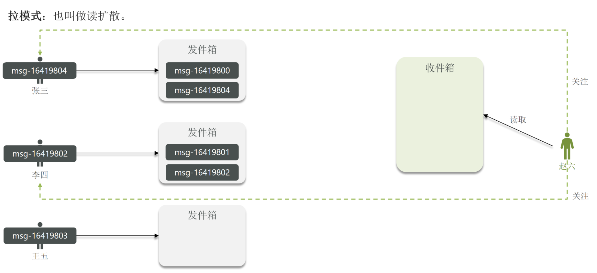
- 推模式
- 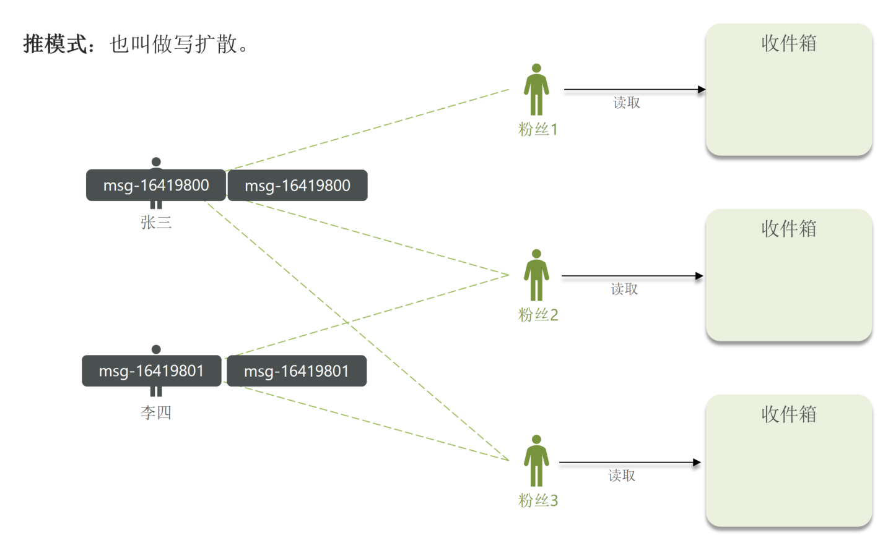
- 推拉结合
- 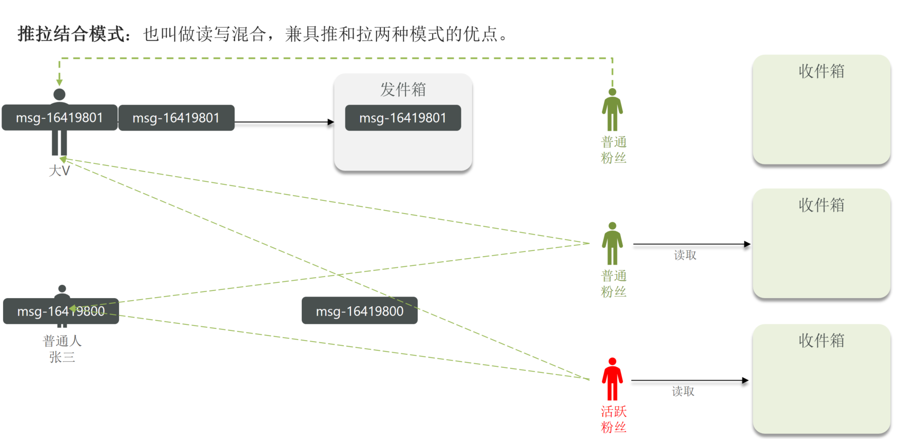
- 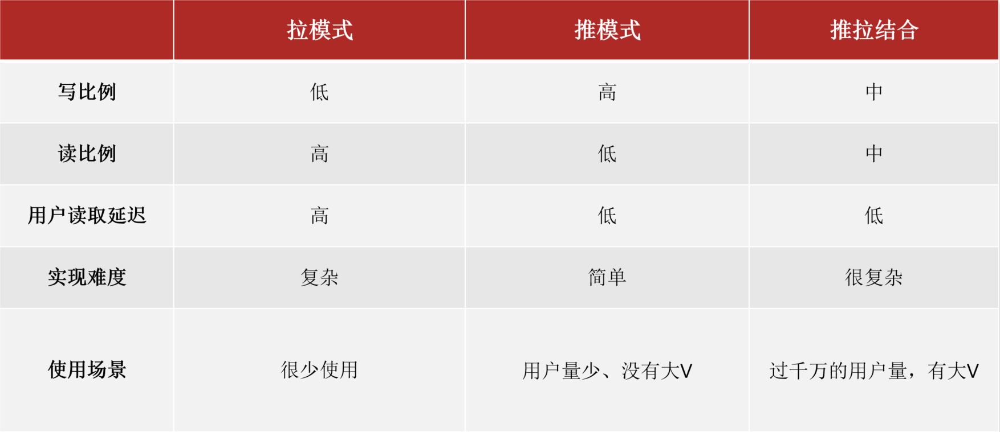
> Feed流的滚动分页 [视频链接](https://www.bilibili.com/video/BV1cr4y1671t?p=84&vd_source=b65df187291916e801dd2d3d831fb71e)
> Feed流中的数据会不断更新，所以数据的角标也在变化，因此不能采用传统的分页模式。
> 滚动分页：参数lastId(**必须** 作为查询条件 一般为某个字段的最大值)&offset(redis实现需要 偏移量)
> 实现(redis)：主要通过zset集合实现 在添加zset元素时以当前时间戳为score，查询时通过ZREVRANGEBYSCORE方法获取数据（根据时间戳降序排序 偏移量是为了防止有相同的score）

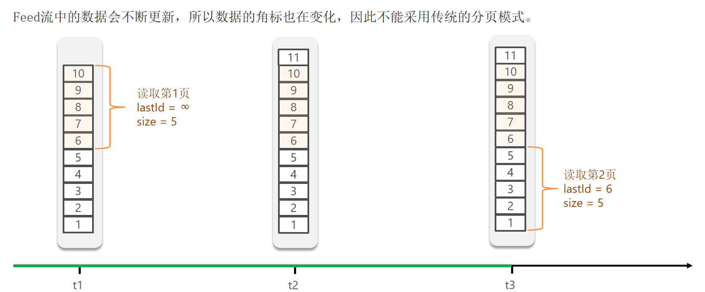
# 9.GEO数据结构
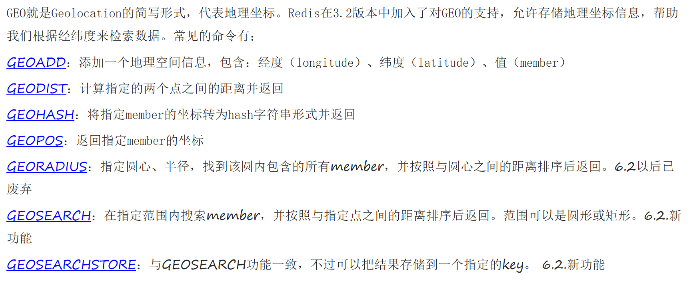
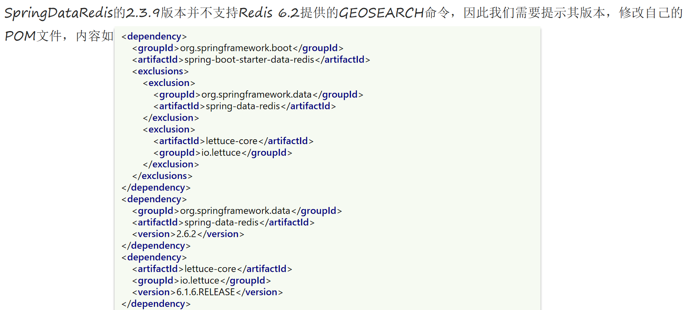

> 处理坐标相关的业务

# 10.BitMap
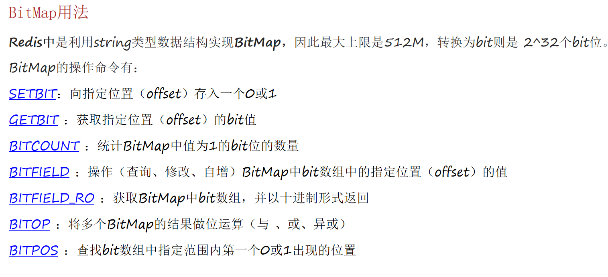
> 可以用来做签到这类的业务

# 11.TODO
