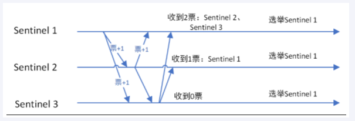

### 命令查看链接
[英文](https://redis.io/commands/)
[中文](https://redis.com.cn/commands.html)
[下载位置](https://download.redis.io/releases/)
### 十大数据类型
#### string
string（字符串）
string是redis最基本的类型，一个key对应一个value。
string类型是二进制安全的，意思是redis的string可以包含任何数据，比如jpg图片或者序列化的对象 。
string类型是Redis最基本的数据类型，一个redis中字符串value最多可以是**512M**

#### List列表
List（列表）
Redis列表是简单的字符串列表，按照插入顺序排序。你可以添加一个元素到列表的头部（左边）或者尾部（右边）
它的底层实际是个双端链表，最多可以包含 2^32 - 1 个元素 (4294967295, 每个列表超过40亿个元素)
#### Hash
Redis hash 是一个 string 类型的 field（字段） 和 value（值） 的映射表，hash 特别适合用于存储对象。
Redis 中每个 hash 可以存储 2^32 - 1 键值对（40多亿）
#### Set
Set（集合）
Redis 的 Set 是 String 类型的无序集合。集合成员是唯一的，这就意味着集合中不能出现重复的数据，集合对象的编码可以是 intset 或者 hashtable。
Redis 中Set集合是通过哈希表实现的，所以添加，删除，查找的复杂度都是 O(1)。
集合中最大的成员数为 2^32 - 1 (4294967295, 每个集合可存储40多亿个成员)
#### ZSet
zset(sorted set：有序集合)
Redis zset 和 set 一样也是string类型元素的集合,且不允许重复的成员。
不同的是每个元素都会关联一个double类型的分数，redis正是通过分数来为集合中的成员进行从小到大的排序。
zset的成员是唯一的,但分数(score)却可以重复。
zset集合是通过哈希表实现的，所以添加，删除，查找的复杂度都是 O(1)。 集合中最大的成员数为 2^32 - 1
#### GEO
Redis GEO 主要用于存储地理位置信息，并对存储的信息进行操作，包括
添加地理位置的坐标。
获取地理位置的坐标。
计算两个位置之间的距离。
根据用户给定的经纬度坐标来获取指定范围内的地理位置集合

#### HyperLogLog
HyperLogLog 是用来做基数统计的算法，HyperLogLog 的优点是，在输入元素的数量或者体积非常非常大时，计算基数所需的空间总是固定且是很小的。
在 Redis 里面，每个 HyperLogLog 键只需要花费 12 KB 内存，就可以计算接近 2^64 个不同元素的基 数。这和计算基数时，元素越多耗费内存就越多的集合形成鲜明对比。
但是，因为 HyperLogLog 只会根据输入元素来计算基数，而不会储存输入元素本身，所以 HyperLogLog 不能像集合那样，返回输入的各个元素。

#### bitmap

由0和1状态表现的二进制位的bit数组

#### bitfield
位域
通过bitfield命令可以一次性操作多个比特位域(指的是连续的多个比特位)，它会执行一系列操作并返回一个响应数组，这个数组中的元素对应参数列表中的相应操作的执行结果。
说白了就是通过bitfield命令我们可以一次性对多个比特位域进行操作。

#### Stream
Redis Stream 是 Redis 5.0 版本新增加的数据结构。
Redis Stream 主要用于消息队列（MQ，Message Queue），Redis 本身是有一个 Redis 发布订阅 (pub/sub) 来实现消息队列的功能，但它有个缺点就是消息无法持久化，如果出现网络断开、Redis 宕机等，消息就会被丢弃。
简单来说发布订阅 (pub/sub) 可以分发消息，但无法记录历史消息。
而 Redis Stream 提供了消息的持久化和主备复制功能，可以让任何客户端访问任何时刻的数据，并且能记住每一个客户端的访问位置，还能保证消息不丢失

### 持久化
#### RDB（Redis DataBase）
##### 概述
是什么

根据触发规则自动或手动将内存中的数据集快照写入磁盘，也就是Snapshot内存快照，它恢复时再将磁盘中的快照文件直接读回到内存。

能干嘛

将Redis的内存数据持久化。Redis的数据都在内存中，保存备份是它执行的是全量快照，也就是说，把内存中的所有数据都记录在磁盘中。

RDB自动触发规则

在redis.conf配置 save  <seconds> <changes> 
解释：
seconds意为距离上次保存RDB文件seconds秒
changes意为在这个时间内key改变了changes次
自动触发需要两个条件都满足
示例：save 60 3 意为距离上次保存RDB文件之后的60秒之内，key已经改变了3次自动触发保存【】

##### RDB手动触发
①save
在主程序中执行会阻塞当前redis服务器，直到持久化工作完成，执行save命令，redis不能处理其他命令，**线上禁止使用**

②bgsave
redis会在后台异步进行快照操作，不阻塞，快照同时还可以响应客户端请求，该触发方式会fork一个子进程复制持久化过程。
**fork是什么**：在Linux程序中，fork()会产生一个和父进程完全相同的子进程，但子进程在此后多会exec系统调用，出于效率考虑，尽量避免膨胀。
命令：**lastsave** 获取最后一次成功执行快照的时间


##### RDB恢复数据
将备份文件移动到配置文件中dir指定的目录中
注意：执行flushall/flushdb命令也会产生dump.rdb文件，但是里面是空的，无意义

##### RDB其他操作
修复dump.rdb文件
使用redis-check-rdb dump.rdb 可以修复.rdb文件

哪些情况会触发RDB快照
配置文件中默认的快照配置
手动的save/bgsave命令
执行flushall/flushdb命令
执行shutdown命令
主从复制时，主节点自动触发

如何禁用快照
将配置文件中的save <seconds> <changes> 设置为 save ""

RDB优化配置项详解
save <seconds> <changes> 自动触发RDB保存
dbfilename 保存的文件名
dir 保存rdb文件目录
stop-writes-on-bgsave-error 默认yes，如果配置成no，表示不在意数据不一致，那么在快照写入失败时，也能保证redis继续接收新的请求
rdbcompression 默认yes，对于存储到磁盘中的快照，可以设置是否进行压缩存储。如果是的话，redis会采用LZF算法进行压缩。如果你不想消耗CPU来进行压缩的话，可以设置为关闭此功能
rdbchecksum 默认yes，在存储快照后，还可以让redis使用CRC64算法来进行数据校验，但是这样做会增加大约10%的性能消耗，如果希望获取到最大的性能提升，可以关闭此功能
rdb-del-sync-files 在没有持久性的情况下删除复制中使用的RDB文件启用。默认情况下no，此选项是禁用的。

优势：
RDB适合大规模的数据恢复
按照业务定时备份
对数据完整性和一致性要求不高
RDB文件在内存中的加载速度要比AOF快得多

劣势：

> 在做备份时，如果redis意外down掉的话，会丢失当前至最近一次快照期间的数据，快照之间的数据会丢失
> 内存数据的全量同步，如果数据量太大会导致IO严重影响服务器性能
> RDB依赖主进程的fork，在更大的数据集中，这可能会导致服务请求的瞬间延迟。fork的时候内存中的数据也被克隆一份，大致2被的膨胀性，需要考虑

##### 小总结

#### AOF(Append Only File)
##### 是什么
以日志的形式来记录每个操作，将Redis执行过的写操作记录下来，只许追加文件，但不可以改写文件，redis启动时会读取该文件恢复数据。换言之，redis在重启时，会根据日志文件将写指令从前到后执行一次，以完成数据的恢复。
默认情况下，redis是没有开启AOF的，开启AOF需要在配置文件中设置**appendonly yes**

##### 能干嘛
将客户端的写操作记录下来，以达到内存中的数据持久化的目的
AOF保存的文件是appendonly.aof文件

##### AOF持久化工作流程

##### AOF缓冲区的三种写回策略
**配置项：appendfsync**


##### AOF配置/启动/修复/恢复
**配置说明（6 VS 7）**：
AOF文件-保存路径
redis6：AOF保存文件的位置和RDB保存文件的位置一样，都是通过配置文件的dir配置
redis7：需要先配置 appenddirname，然后配置dir，最终路径是 dir + appenddirname
AOF文件-保存名称（配置项：**appendfilename**）
redis6：有且仅有一个
redis7：有三个，分为base基本文件、incr增量文件、manifest清单文件


**正常启动**
设置appendonly为yes
**恢复**
redis重启时会加载dir+appenddirname目录下的aof文件，以达到恢复数据的目的
**修复**
如果aof文件出现异常可以尝试使用命令 redis-check-aof --fix修复


##### 优势
更好的保护数据不丢失、性能高、可做紧急恢复
##### 劣势
相同数据集的数据而言，aof文件要远大于rdb文件，恢复速度慢于rdb
aof运行效率要慢于rdb，每秒同步策略效率较好，不同步效率和rdb相同
##### AOF重写机制
**是什么**
启动AOF文件的内容压缩，只保留可以恢复数据的最小指令集
**触发机制**

- 自动触发：
   - 满足配置文件中的选项后，Redis会记录上次重写时的AOF大小
   -  
- 手动触发：
   - 客户端向服务器发送bgreriteaof命令


**重写原理**
1：在重写开始前，redis会创建一个“重写子进程”，这个子进程会读取现有的AOF文件，并将其包含的指令进行分析压缩并写入到一个临时文件中。
2：与此同时，主进程会将新接收到的写指令一边累积到内存缓冲区中，一边继续写入到原有的AOF文件中，这样做是保证原有的AOF文件的可用性，避免在重写过程中出现意外。
3：当“重写子进程”完成重写工作后，它会给父进程发一个信号，父进程收到信号后就会将内存中缓存的写指令追加到新AOF文件中
4：当追加结束后，redis就会用新AOF文件来代替旧AOF文件，之后再有新的写指令，就都会追加到新的AOF文件中
5：重写aof文件的操作，并没有读取旧的aof文件，而是将整个内存中的数据库内容用命令的方式重写了一个新的aof文件，这点和快照有点类似

##### AOF优化配置详解

##### 小总结

#### RDB-AOF混合持久化
**数据恢复顺序和加载流程**
在同时开启rdb和aof持久化时，重启时只会加载aof文件，不会加载rdb文件

**开启RDB+AOF混合方式**


#### 纯缓存模式
开启：
save "" ： 禁用rdb，在禁用rdb的时候，我们可以使用save、bgsave生成rdb文件
appendonly no ：禁用aof，在禁用aof时，可以使用bgrewriteaof生成aof文件

### Redis事务
#### 是什么
可以一次执行多个命令，本质是一组命令的集合。一个事务中的所有命令都会序列化，按顺序地串行化执行而不会被其他命令插入，不允许加塞。
#### 能干嘛
一个队列中，一次性、顺序性、排他性的执行一系列命令
#### Redis事务 VS 数据库事务

1. 单独的隔离级别：redis事务仅仅是保证事务里的操作会被连续独占的执行，redis命令执行是单线程架构，在执行完事务内所有指令前是不可能再去同时执行其他客户端的请求的
2. 没有隔离级别的概念：因为事务提交前任何指令都不会被实际执行，也就不存在”事务内的查询要看到事务里的更新，在事务外查询不能看到”这种问题了
3. 不保证原子性：Redis的事务不保证原子性，也就是不保证所有指令同时成功或同时失败，只有决定是否开始执行全部指令的能力，没有执行到一半进行回滚的能力
4. 排它性：Redis会保证一个事务内的命令依次执行，而不会被其它命令插入
#### 使用
**常用命令**
**discard：**取消事务，放弃执行事务快内的所有命令
**exec：**执行所有事务块内的命令
**multi：**标记一个事务块的开始
**unwatch：**取消watch命令对所有key的监视
**watch key [key ...]：**监视一个（或多个）key，如果事务执行之前，监视的key被其他命令改动，那么事务被打断。
**事务执行情况**
case1：正常执行 正常使用multi标记事务块的开始，exec执行事务块内的命令
case2：放弃事务 正常使用multi标记事务块的开始，discard放弃事务块
case3：全体连坐 正常使用multi标记事务块的开始，事务块内的命令有语法错误，导致事务块中所有命令都不会执行
case4：冤头债主 正常使用multi标记事务块的开始，事务块内的命令语法编译通过，但是执行报错，那么报错的命令失效，其他命令正常执行
case5：watch监视 先使用watch监视一个key，然后开启事务，如果被监视的key没有改变，事务在exec时正常执行所有命令，如果被监视的key有改变，事务在exec时不会执行事务块中的命令。
case3&case4总结：事务在exec前的报错会导致全部命令执行失败，exec后报错，正确的指令照样执行成功
**注意**：一旦执行了exec之前加的监视锁都会被取消掉，当客户端连接丢失时，所有东西都会被取消监视


### Redis管道
#### 是什么
Pipeline是为了解决RTT往返回时，仅仅是将命令打包一次性发送，对整个redis的执行不造成其他任何影响
批处理命令变种优化措施，类似redis的原生批命令(mget 和 mset)
#### 演示
 
#### 小总结
**Pipeline与原生批量命令对比**

- 原生批量命令是原子性（例如：mset,mget),pipeline是非原子性
- 原生批量命令一次只能执行一种命令，pipeline支持批量执行不同命令
- 原生批命令是服务端实现，而pipeline需要服务端与客户端共同完成

**Pipeline与事务对比**

- 事务具有部分原子性，管道不具有原子性
- 管道一次性将多条命令发送到服务器，事务是一条条的发，事务只有在接收到exec命令后才会执行，管道不会
- 执行事务时会阻塞其他命令的执行，而执行管道中的命令时不会

**使用Pipeline注意事项**

- pipeline缓冲的指令只是会依次执行，不保证原子性，如果执行中指令发生异常，将会继续执行后续的指令
- 使用pipeline组装的命令个数不能太多，不然数据量过大客户端部阻塞的时间可能过久，同时服务端此时也被迫回复一个队列答复，占用很多内存

### Redis发布订阅
#### 是什么
是一种消息通信模式：发布者（PUBLISH）发送消息，订阅者（SUBSCRIBE）接收消息，可以实现进程间的消息传递
#### 能干嘛
Redis客户端可以订阅任意数量的频道，类似微信中可以关注多个公众号
发布/订阅其实是一个轻量的队列，只不过数据不会被持久化，一般用来处理实时性较高的异步消息。

#### 常用命令
subscribe channel [channel ...] 订阅给定的一个或多个频道
publish channel message 发布消息到指定的频道
psubscribe pattern [patttern ...] 按照模式批量订阅，订阅一个或多个符合给定模式（支持*号和？号之类）的频道
pubsub channels 查看活跃频道组成的列表
pubsub numsub [channel [channel ...]] 某个频道有几个订阅者
pubsub numpat 只统计使用psubscribe命令执行的，返回客户端订阅的唯一模式的数量
unsubscribe [channel [channel ...]] 取消订阅
punsubscribe [pattern [pattern ...]] 退订所有给定模式的频道

### Redis复制(replica)
#### 是什么
主从复制，master以写为主，slave以读为主
当master数据发生变化时，自动将新数据异步同步到所属slave数据库

#### 能干嘛

- 读写分离
- 容灾恢复
- 数据备份
- 水平扩容支撑高并发
#### 案例演示
##### 一主二仆
**配置从库不配置主库**
**权限细节：**master如果配置了requirepass，那么slave需要配置masterauth来设置校验密码，否则master会拒绝slave的访问请求
**基本操作命令：**
**info replication ：**可以查看复制节点的主从关系和配置信息
**replicaof 主库ip 主库port ：**一般写进redis.conf配置文件内
**slaveof 主库ip 主库port：** 每次与master断开之后，都需要重新连接，除非配置redis.conf文件。在运行期间修改slave节点的信息，如果该数据库已经是某个数据库的从库，那么会停止与原主库的同步关系，转而和新的主库同步。
**slaveof no one：**使当前数据库停止与其他数据库的同步，装成主数据库，自立为王
注意：**在配置时要注意防火墙的端口的开放**
配置细节（从默认redis.conf开始）：

1. 开启daemonize yes
2. 注释bind 127.0.0.1
3. protected-mode no
4. 指定port
5. 指定当前工作目录，dir
6. pid文件名字，pidfile
7. log文件名字，logfile
8. requirepass
9. dump.rdb名字
10. aof文件，appendfilename（如果开启了aof功能）
11. 从机需要配置 replicaof 主库ip 主库port 和 masterauth 主库密码
##### 薪火相传
上一个slave可以是下一个slave的master，slave同样可以接收其他slaves的连接和同步请求，那么该slave作为链条中的下一个master，可以有效减轻主master的写压力
中途变更转向会清楚之前的数据，重新建立拷贝最新的数据
`slaveof 新主库ip 新主库port` 

##### 反客为主
`slaveof no one` 使当前数据库停止与其他数据库同步，转成主数据库
**主从问题**
**从机可以执行写命令吗？**
不可以

**从机切入点问题？**
首次连接则一次全部同步，后续连接则master写，slave跟

**主机shutdown后，从机会上位吗？**
不会
从机不动，原地待命，从机数据可以正常使用；等待主机重启动归来

**主机shutdown后，重启后主从关系还在吗？从机还能否顺利同步数据？**
主机重启后，主从关系依旧存在，从机仍能顺利同步数据

**某台从机down后，master继续，从机重启后可以同步master的所有数据吗？**
可以，从机重启首先会同步master所有数据

#### 复制原理和工作流程

#### 复制的缺点

- 复制延时，信号衰减
- master挂了怎么办？
   - 默认情况下，不会在slave节点中自动重选一个master
   - 每次需要人工干预
### Redis哨兵(sentinel)
#### 是什么
吹哨人巡查监控后台master主机是否故障，如果故障根据投票数自动将某个从库转换成新主库
作用：无人值守运维

#### 能干嘛
主从监控：监控主库运行是否正常
消息通知：哨兵可以将故障转移的结果发送给客户端
故障转移：如果master异常，会进行主从切换，将其中一个slave作为新master
配置中心：客户端通过链接哨兵来获得当前redis服务的主节点地址

#### 配置哨兵集群
在工作目录中新建或拷贝sentinel.conf文件，名字绝对不能错
**重点参数说明：**
**sentinel monitor <master-name> <ip> <redis-port> <quorum>：**设置要监控的master服务器
quorum表示最少有几个哨兵认可客观下线，同意故障迁移的法定票数
**sentinel auth-pass <master-name> <password> ：**设置连接master的密码
注意：因为可能进行主从切换，因此，主从库的密码应设置成一样

**sentinel down-after-milliseconds <master-name> <milliseconds>：**
指定多少毫秒之后，主节点没有应答哨兵，此时哨兵主观上认为主节点下线
**sentinel parallel-syncs <master-name> <nums>：**
表示允许并行同步的slave个数，当Master挂了后，哨兵会选出新的Master，此时，剩余的slave会向新的master发起同步数据
**sentinel failover-timeout <master-name> <milliseconds>：**
故障转移的超时时间，进行故障转移时，如果超过设置的毫秒，表示故障转移失败
**sentinel notification-script <master-name> <script-path> ：**
配置当某一事件发生时所需要执行的脚本
**sentinel client-reconfig-script <master-name> <script-path>：**
客户端重新配置主节点参数脚本
①通用配置：
bind 0.0.0.0
daemonize yes
protected-mode no
port 26379
logfile "/opt/redis/sentinel26379.log"
pidfile "/var/run/redis-sentinel26379.pid"
dir "/opt/redis"
sentinel monitor mymaster 192.168.10.201 6301 2
sentinel auth-pass mymaster abc123
②先启动一主二仆集群，查看主从复制集群是否顺利
注意：该集群中的master节点也需要配置mastereauth项
③启动哨兵节点，完成监控
redis-sentinel sentinel26379.conf --sentinel
至此，哨兵集群配置完成
case1：一切正常，主从复制正常使用
case2：原master挂了
两台原从机数据是否OK？
OK，认可访问
是否会从剩下的两台从机中选举出新master？
会，通过投票新选
之前down掉的master库，重启后主从关系如何？
原master库被切换为slave库，其主库为新选举的新master库

#### 运行流程和选举原理
当一个主从配置中的master失效之后，sentinel可以选举出一个新的master用于自动接替原master的工作，主从配置中的其他redis服务器自动指向新的master同步数据，一般建议sentinel采取奇数台，防止某一台sentinel无法连接到master导致误切换

**SDown主观下线(Subjectively Down)**
所谓主观下线（Subjectively Down， 简称 SDOWN）指的是单个Sentinel实例对服务器做出的下线判断，即单个sentinel认为某个服务下线（有可能是接收不到订阅，之间的网络不通等等原因）。主观下线就是说如果服务器在[sentinel down-after-milliseconds]给定的毫秒数之内没有回应PING命令或者返回一个错误消息， 那么这个Sentinel会主观的(单方面的)认为这个master不可以用了，o(╥﹏╥)o
sentinel down-after-milliseconds <masterName> <timeout>
 表示master被当前sentinel实例认定为失效的间隔时间，这个配置其实就是进行主观下线的一个依据
master在多长时间内一直没有给Sentine返回有效信息，则认定该master主观下线。也就是说如果多久没联系上redis-servevr，认为这个redis-server进入到失效（SDOWN）状态。

**ODown客观下线(Objectively Down)**
ODown需要一定数量的sentinel，多个哨兵达成一致意见才能认为一个master客观上已经宕掉
`sentinel monitor <master-name> <ip> <redis-port> <quorum>`
masterName是对某个master+slave组合的一个区分标识(一套sentinel可以监听多组master+slave这样的组合)
quorum这个参数是进行客观下线的一个依据，法定人数/法定票数
意思是至少有quorum个sentinel认为这个master有故障才会对这个master进行下线以及故障转移。因为有的时候，某个sentinel节点可能因为自身网络原因导致无法连接master，而此时master并没有出现故障，所以这就需要多个sentinel都一致认为该master有问题，才可以进行下一步操作，这就保证了公平性和高可用。

**选举出领导者哨兵(在所有哨兵中选出进行故障切换的哨兵（兵王）)**
当主节点被判断客观下线以后，各个哨兵节点会进行协商，先选举出一个领导者哨兵节点（兵王）并由该领导者节点，也即被选举出的兵王进行failover(故障迁移)

选举兵王的算法：
**Raft算法**

监视该主节点的所有哨兵都有可能被选为领导者，选举使用的算法是Raft算法；Raft算法的基本思路是先到先得：
即在一轮选举中，哨兵A向B发送成为领导者的申请，如果B没有同意过其他哨兵，则会同意A成为领导者

**有兵王开始推动故障切换流程并选出一个新master**


#### 使用建议
- 哨兵节点的数量应为多个，哨兵本身应该集群，保证高可用
- 哨兵节点的数量应该是奇数
- 各个哨兵节点的配置应一致
- 如果哨兵节点部署在Docker等容器里面，尤其要注意端口的正确映射
- 哨兵集群+主从复制，并不能保证数据零丢失

### Redis集群(cluster)
#### 是什么
Redis集群是一个提供在多个redis节点间共享数据的程序集
Redis集群可以支持多个Master


#### 能干嘛
Redis集群能支持多个Master，每个Master又可以挂载多个Slave
读写分离
支持数据的高可用
支持海量数据的读写存储操作
由于Cluster自带的Sentinel的故障转义机制，内置了高可用的支持，无需再去使用哨兵功能
客户端与Redis的节点连接，不再需要连接集群中的所有节点，只需要任意连接集群中的一个可用节点即可
**槽位slot**负责分配到各个物理服务节点，有对应的集群来负责维护节点、插槽和数据之间的关系

#### 集群算法-分片-槽位slot
**Redis集群的槽位slot**
Redis集群没有使用一致性hash，而是引入哈希槽的概念。
Redis集群有16384个哈希槽，每个key通过CRC16校验后对16384取模来确定放置在哪个槽，集群的每个节点负责一部分hash槽
**Redis进群的分片**
分片是什么：
使用Redis集群时我们会将存储的数据分散到多台redis机器上，这称为分片。简言之，集群中的每个Redis实例都被认为是整个数据的一个分片。
如何找到给定key的分片：
为了找到给定key的分片，我们对key进行CRC16(key)算法处理并通过对总分片数量取模。然后，使用确定性哈希函数，这意味着给定的key将多次始终映射到同一个分		片，我们可以推断将来读取特定key的位置。
**优势：**
最大优势，方便扩缩容和数据分派查找

**注意：**
Redis集群不保证强一致性，这意味着在特定的条件下，Redis集群可能会丢掉一些被系统收到的写入请求命令
#### 集群环境配置
##### 三主三从redis集群配置

新建文件夹：mkdir -p /myredis/cluster
新建6台独立的redis实例并启动：

```shell
bind 0.0.0.0
daemonize yes
protected-mode no
port 6381
logfile "/myredis/cluster/cluster6381.log"
pidfile /myredis/cluster6381.pid
dir /myredis/cluster
dbfilename dump6381.rdb
appendonly yes
appendfilename "appendonly6381.aof"
requirepass 111111
masterauth 111111
 
cluster-enabled yes
cluster-config-file nodes-6381.conf
cluster-node-timeout 5000
```
通过redis-cli命令为6台redis实例构建集群关系
构建主从命令
redis-cli -a 111111 --cluster create --cluster-replicas 1 192.168.10.201:6381 192.168.10.201:6382 192.168.10.202:6383 192.168.10.202:6384 192.168.10.203:6385 192.168.10.203:6386
--cluster-replicas 1 表示为每个master创建一个slave节点 
链接进入3681作为切入点，查看并检验集群状态

- info replication
- cluster nodes
- cluster info

注意：当要进行读写是，需要在连接客户端是添加-c参数
示例：`redis-cli -a 111111 -p 6381 -c`
如果不加-c参数，当写入的key取模得到的slot_value不在当前master所属范围内会报错
加上-c参数，redis会在得到slot_value时进行路由查找，并且切换到对应master进行写入
命令：cluster keyslot key_name ：查看key_name对应的slot_value
##### 主从容错切换迁移
当前master出现故障shutdown时，集群会自动将该master的slave上位为新的master
当原master重启回到集群时会变成新master的slave
**想要恢复原先关系时**：
①手动
在原master(新slave)重启后，手动shutdown新master，系统会将原master恢复成master，新master重新变回原master的slave
②命令
`cluster failover`
##### 主从扩容案例
新建两个redis实例(6387/6388)并启动服务
将6387作为master**加入集群**
`redis-cli -a password --cluster add-node ip:new_port ip:old_port`
`redis-cli -a 111111  --cluster add-node 192.168.10.201:6387 192.168.10.201:6381`
6387 就是将要作为master新增节点
6381 就是原来集群节点里面的领路人，相当于6387拜拜6381的码头从而找到组织加入集群
此时可以**检查集群情况**第一次
`redis-cli -a password --cluster check ip:port` 
`redis-cli -a 111111 --cluster check 192.168.10.201:6381`
会发现，新节点已作为master加入集群，但是没有分配插槽
**重新分配槽号(reshard)**
命令:
`redis-cli -a password --cluster reshard ip:port`
`redis-cli -a 111111 --cluster reshard 192.168.10.201:6381`

此时检查集群情况第二次
会发现新节点已经有槽号区间了，但是不是连续的
因为重新分配槽号成本高，是从之前集群中的master节点上各自匀一些出来给新master节点的
**为新master节点6387分配slave节点6388**
命令：
`redis-cli -a password --cluster add-node ip:new_slave_port ip:new_master_port --cluster-slave --cluster-master-id master_node_id`
`redis-cli -a 111111 --cluster add-node 192.168.10.201:6388 192.168.10.201:6387 --cluster-slave --cluster-master-id 4feb6a7ee0e...`
`4feb6a7ee0e...`-------这个是6387的节点id
此时检查集群情况会发现，新添加的master和slave都正常运行了，至此集群扩容完成

##### 主从缩容案例
说明：该案例将上例中新添加的master和slave移出集群
检查集群情况第一次，获取slave节点的node_id
`redis-cli -a password --cluster check ip:port`   ==》 `redis-cli -a 111111 --cluster check 192.168.10.201:6388`
**从集群中将从节点6388删除**
`redis-cli -a password --cluster del-node ip:slave_port **slave_node_id**`
`redis-cli -a 111111 --cluster del-node 192.168.10.201:6388 218e7b8b4f...`---218e7b8b4f...为从节点6388的节点id
此时检查集群情况发现从节点已经被删除
**将master的槽号清空，重新分配**，本例中将全部分配给6381
`redis-cli -a 111111 --cluster reshard 192.168.10.201:6381`

此时检查集群情况发现4096个槽位都指给6381，它变成了8192个槽位，相当于全部都给6381了
从集群中将主节点6387删除
`redis-cli -a 111111 --cluster del-node 192.168.10.201:6387 218e1123123f...`
检查集群情况发现上例中添加的master和slave全部移除

#### 集群常用操作命令
值得注意的是：不在同一个slot槽位下的键值无法使用mset、mget等多键操作
可以通过{}来定义同一个组的概念，使key中{}内相同内容的键值对放到一个slot槽位去，对照下图类似k1k2k3都映射为x，自然槽位一样

常用命令：
cluster-require-full-coverage
默认YES，现在集群架构是3主3从的redis cluster由3个master平分16384个slot，每个master的小集群负责1/3的slot，对应一部分数据。
cluster-require-full-coverage： 默认值 yes , 即需要集群完整性，方可对外提供服务 通常情况，如果这3个小集群中，任何一个（1主1从)挂了，你这个集群对外可提供的数据只有2/3了， 整个集群是不完整的， redis 默认在这种情况下，是不会对外提供服务的。
如果你的诉求是，集群不完整的话也需要对外提供服务，需要将该参数设置为no ，这样的话你挂了的那个小集群是不行了，但是其他的小集群仍然可以对外提供服务。

cluster countkeysinslot 槽位数字编号
1，该槽位被占用
0，该槽位没占用

cluster keyslot key_name
该键应该存在哪个槽位上
