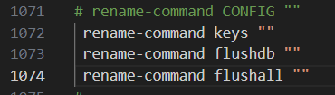
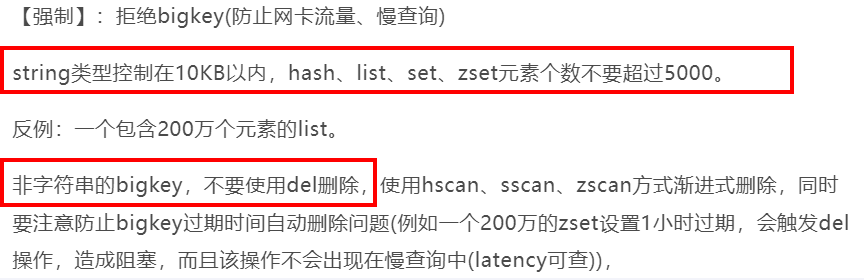
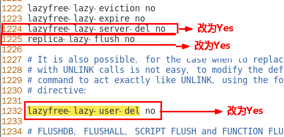
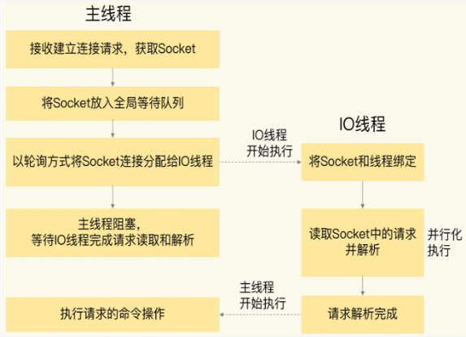
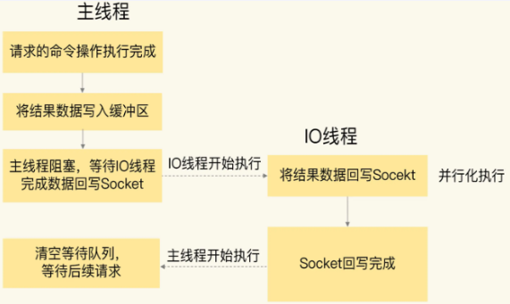
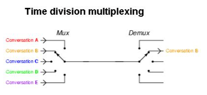
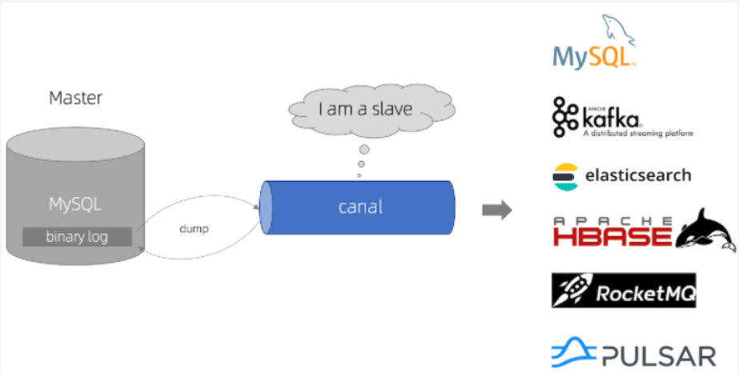
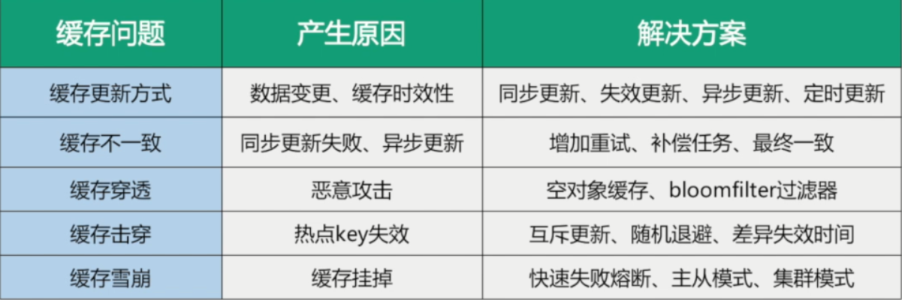

# Redis进阶

[Redis中文学习网 - Redis开发与运维技术、Redis教程、使用手册](https://redis.com.cn/)

[小林coding图解网站](https://xiaolincoding.com/redis/)

## 面试题

> Redis为什么快？

IO多路复用+epoll函数使用，才是redis为什么这么快的直接原因，而不是仅仅单线程命令+redis安装在内存中。

> Redis到底是单线程还是多线程？

就整体而言是多线程，但是处理数据读写的主进程是单线程的

> IO多路复用听说过吗？

一个同步的IO模型，实现一个服务端进程可以同时处理多个TCP连接

这种模型使用 `select`、`poll` 或 `epoll` 等系统调用来监视多个文件描述符（包括网络套接字），并在其中任何一个变得可读或可写时通知程序。

>  加入多线程的原因?

当使用单线程的时候，删除一个非常大的对象时会造成Redis主线程的卡顿

在Redis4.0新增了多线程模块，此版本的多线程主要是为了解决删除诗句效率比较低的问题

这时使用惰性删除可以有效避免Redis卡顿的问题

惰性删除即在删除一个很大的对象时，使用将删除的工作交给后台的子线程异步处理

命令：

- unlink key
- flushdb async
- flushall async

因为Redis是单个主线程处理，redis之父antirez一直强调"Lazy Redis is better Redis".

而lazy free的本质就是把某些cost(主要时间复制度，占用主线程cpu时间片)较高删除操作，从redis主线程剥离让bio子线程来处理，极大地减少主线阻塞时间。从而减少删除导致性能和稳定性问题。

尽管在Redis4.0就引入了多个线程来实现数据的异步惰性删除等功能，但是其处理读写请求的仍然只有一个线程，所以仍然算是狭义上的单线程。

> 怎么限制keys、flushdb、flushall等危险命令，以防止误删误用？

修改配置文件redis.conf的SECURITY这一项内容

 

> Memory USAGE命令有了解过吗？

[MEMORY USAGE](https://redis.com.cn/commands/memory-usage.html) 命令给出一个 `key` 和它的值在 RAM 中所占用的字节数。

返回的结果是 `key` 的值以及为管理该 `key` 分配的内存总字节数。

对于嵌套数据类型，可以使用选项 `SAMPLES`，其中 `count` 表示抽样的元素个数，默认值为 5 。当需要抽样所有元素时，使用 `SAMPLES 0` 。

语法：MEMORY USAGE key [SAMPLES count]


> BigKey问题，多大算big？怎么发现，如何删除，如何处理？

**多大算big key?**



**如何发现?**

`redis-cli --bigkeys`

redis-cli -h 127.0.0.1 -p 6379 -a 111111 --bigkeys

每隔 100 条 scan 指令就会休眠 0.1s，ops 就不会剧烈抬升，但是扫描的时间会变长

redis-cli -h 127.0.0.1 -p 7001 –-bigkeys -i 0.1

不足：想查询大于10kb的所有key，--bigkeys参数就无能为力了，需要用到memory usage来计算每个键值的字节数

`MEMORY USAGE`计算每个键值的字节数

[MEMORY USAGE](https://redis.com.cn/commands/memory-usage.html) 命令给出一个 `key` 和它的值在 RAM 中所占用的字节数。

返回的结果是 `key` 的值以及为管理该 `key` 分配的内存总字节数。

对于嵌套数据类型，可以使用选项 `SAMPLES`，其中 `count` 表示抽样的元素个数，默认值为 5 。当需要抽样所有元素时，使用 `SAMPLES 0` 。

**如何删除?**

使用hscan、sscan、zscan方式渐进式删除

- String：一般使用del,如果过于庞大使用unlink
- hash：使用hscan每次获取少量field-value，再使用hdel删除每个field
- list：使用ltrim渐进式逐步删除，直到全部删除
- set：使用sscan每次获取部分元素，再使用srem命令删除每个元素
- zset：使用zscan每次获取部分元素，再使用ZREMRANGEBYRANK命令删除每个元素

具体代码参考阿里手册

> Bigkey有做过调优吗？惰性释放lazyfree了解过吗？

非阻塞删除命令：

- unlink key
- flushdb async
- flushall async

优化配置：

 

> 海量数据里查询某一固定前缀的key

- [SCAN](https://redis.com.cn/commands/scan.html) 用于遍历当前数据库中的键。
- [SSCAN](https://redis.com.cn/commands/sscan.html) 用于遍历集合键中的元素。
- [HSCAN](https://redis.com.cn/commands/hscan.html) 用于遍历哈希键中的键值对。
- [ZSCAN](https://redis.com.cn/commands/zscan.html) 用于遍历有序集合中的元素（包括元素成员和元素分值）。

使用Scan查询

语法：SCAN cursor [MATCH pattern] [COUNT count]

- cursor - 游标。
- pattern - 匹配的模式。
- count - 指定从数据集里返回多少元素，默认值为 10 。

示例：scan 0 match k* count 5

## Redis6/7的多线程特性

> 对于Redis主要的性能瓶颈是内存或者网络带宽，而不是CPU。

在Redis6/7中，非常受关注的第一个新特性就是多线程。

这是因为，Redis一直被大家熟知的就是它的单线程架构，虽然有些命令操作可以用后台线程或子进程执行（比如数据删除、快照生成、AOF重写）。但是，从网络IO处理到实际的读写命令处理，都是由单个线程完成的。

随着网络硬件的性能提升，Redis的性能瓶颈有时会出现在网络IO的处理上，也就是说，单个主线程处理网络请求的速度跟不上底层网络硬件的速度,

为了应对这个问题:

采用多个IO线程来处理网络请求，提高网络请求处理的并行度，Redis6/7就是采用的这种方法。

但是，Redis的多IO线程只是用来处理网络请求的，对于读写操作命令Redis仍然使用单线程来处理。这是因为，Redis处理请求时，网络处理经常是瓶颈，通过多个IO线程并行处理网络操作，可以提升实例的整体处理性能。而继续使用单线程执行命令操作，就不用为了**保证Lua脚本、事务的原子性**，额外开发多线程互斥加锁机制了(不管加锁操作处理)，这样一来，Redis线程模型实现就简单了

**主线程使用单线程执行读写命令操作是为了保证Lua脚本和事务的原子性**

> 主线程和IO线程是怎么协作完成请求处理的？

**阶段一：服务端和客户端建立Socket连接，并分配处理线程**

首先，主线程负责接收建立连接请求。当有客户端请求和实例建立socket连接时，主线程会创健和客户端的连接，并把Socket放入全局等待队列中。紧接着，主线程通过轮询方法把Socket连接分配给IO线程

**阶段二：IO线程读取并解折请求**
主线程一旦把socket份配给IO线程，就会进入阻塞状态，等待IO线程完成客户端请求读取和解析。因为有多个IO线程在并行处理，所以，这个过程很快就可以完成，

**阶段三：主线程执行请求操作**
等到IO线程解析完请求，主线程还是会以单线程的方式执行这些命令操作。

**阶段四：IO线程回写Socket和主线程清空全局队列**
当主线程执行完请求操作后，会把需要返回的结果写入缓冲区，然后，主线程会阻塞等待I0线程，把这些结果回写到Socket中，并返回给客户端。和IO线程读取和解析请求一样，IO线程回写Socket时，也是有多个线程在并发执行，所以回写Socket的速度也很快。等到IO线程回写Socket完毕，主线程会清空全局队列，等待客户端的后续请求。

> 简单说就是从Redis6开始，将主线程的 IO 读写任务拆分给一组独立的线程去执行，这样就可以使多个 socket 的读写可以并行化了，采用多路 I/O 复用技术可以让单个线程高效的处理多个连接请求（尽量减少网络IO的时间消耗），将最耗时的Socket的读取、请求解析、写入单独外包出去，剩下的命令执行仍然由主线程串行执行并和内存的数据交互。





> Redis7中使用多线程

Redis7将所有数据放在内存中，内存的响应时长大约为100纳秒，对于小数据包，Redis服务器可以处理8W到10W的QPS，

这也是Redis处理的极限了，对于80%的公司来说，单线程的Redis已经足够使用了。

在Redis6.0及7后，多线程机制默认是关闭的，如果需要使用多线程功能，需要在redis.conf中完成两个设置

1. 设置io-thread-do-reads配置项为yes，表示启动多线程。

2. 设置`io-threads count`线程个数。关于线程数(count)的设置，官方的建议是如果为 4 核的 CPU，建议线程数设置为 2 或 3，如果为 8 核 CPU 建议线程数设置为 6，线程数一定要小于机器核数，线程数并不是越大越好。

## IO多路复用

> FileDescriptor
>

**文件描述符**简称FD，句柄

文件描述符（File descriptor）是计算机科学中的一个术语，是一个用于表述指向文件的引用的抽象化概念。

文件描述符在形式上是一个非负整数。实际上，它是一个索引值，指向内核为每一个进程所维护的该进程打开文件的记录表。当程序打开一个现有文件或者创建一个新文件时，内核向进程返回一个文件描述符。在程序设计中，文件描述符这一概念往往只适用于UNIX、Linux这样的操作系统。

> IO多路复用
>

一种同步的IO模型，实现一个线程监视多个文件句柄，一旦某个文件句柄就绪就能够通知到对应应用程序进行相应的读写操作，没有文件句柄就绪时就会阻塞应用程序，从而释放CPU资源

I/O：网络I/O，尤其在操作系统层面指数据在内核态和用户态之间的读写操作

多路：多个客户端连接（连接就是套接字描述符，即socket或者channel）

复用：复用一个或几个线程

IO多路复用：也就是说一个或一组线程处理多个TCP连接，使用单进程就能够同时处理多个客户端的连接，无需创建或者维护过多的进程/线程

一句话描述：一个服务端进程可以同时处理多个套接字描述符（响应式处理）。

实现IO多路复用的模型有3种：可以分select -> poll -> epoll三个阶段描述

> epoll
>

将用户socket对应的文件描述符(FileDescriptor)注册进epoll，然后epoll帮你监听哪些socket上有消息到达，这样就避免了大量的无用操作。此时的socket应该采用非阻塞模式。这样，整个过程只在调用select、poll、epoll这些调用的时候才会阻塞，收发客户消息是不会阻塞的，整个进程或者线程就被充分利用起来，这就是事件驱动，所谓的reactor反应模式。



在单个线程通过记录跟踪每一个Socket(I/O流)的状态来同时管理多个I/O流. 一个服务端进程可以同时处理多个套接字描述符。

## 缓存双写一致

一般来说更新策略有四种

- 先更新数据库，然后更新缓存
- 先更新缓存，然后更新数据库
- 先删除缓存，然后更新数据库
- 先更新数据库，然后删除缓存

一般选用先更新数据，然后删除缓存

> **原因**
>
> 先看有更新缓存的两种，这两种都会有个问题，读到旧数据并且将旧数据更新到缓存，后续请求不会再去读取数据库，得到的都是旧数据
>
> 再看删除缓存的两种，假设a线程更新数据，b线程读取数据，先删除缓存的最坏情况是a刚好删了缓存，然后b来读取，没有命中缓存，马上就读取数据库旧数据并存入缓存，然后a再更新的数据库，此时缓存中的数据不会被删除，后续读取到的数据都是旧数据；而先更新数据库最坏情况是b命中缓存，读取一次旧数据，a更新数据库后会删除旧数据的缓存

**使用Canal实现MySQL与Redis双写一致性落地案例**

Canal仓库地址：https://github.com/alibaba/canal

Canal能干嘛：

- 数据库镜像
- 数据库实时备份
- 索引构建和实时维护(拆分异构索引、倒排索引)
- 业务cache刷新
- 带业务逻辑的增量数据处理

### 工作原理



#### MySQL主备复制原理

- MySQL master 将数据变更写入二进制日志( binary log, 其中记录叫做二进制日志事件binary log events，可以通过 show binlog events 进行查看)
- MySQL slave 将 master 的 binary log events 拷贝到它的中继日志(relay log)
- MySQL slave 重放 relay log 中事件，将数据变更反映它自己的数据

#### canal 工作原理

- canal 模拟 MySQL slave 的交互协议，伪装自己为 MySQL slave ，向 MySQL master 发送dump 协议
- MySQL master 收到 dump 请求，开始推送 binary log 给 slave (即 canal )
- canal 解析 binary log 对象(原始为 byte 流)

### 案例

#### MySQL配置

对于自建 MySQL , 需要先开启 Binlog 写入功能，配置 binlog-format 为 ROW 模式，my.cnf 中配置如下

修改配置文件my.ini(win)、my.cnf(Linux) 

```
[mysqld]
log-bin=mysql-bin # 开启 binlog
binlog-format=ROW # 选择 ROW 模式
server_id=1 # 配置 MySQL replaction 需要定义，不要和 canal 的 slaveId 重复
```

授权 canal 链接 MySQL 账号具有作为 MySQL slave 的权限, 如果已有账户可直接 grant

```sql
CREATE USER canal IDENTIFIED BY 'canal';  
GRANT SELECT, REPLICATION SLAVE, REPLICATION CLIENT ON *.* TO 'canal'@'%';
-- GRANT ALL PRIVILEGES ON *.* TO 'canal'@'%' ;
FLUSH PRIVILEGES;
```


#### Canal服务端

下载 canal, 访问 [release 页面](https://github.com/alibaba/canal/releases) , 选择需要的包下载, 如以 1.0.17 版本为例

解压到指定目录

修改配置文件`conf/example/instance.properties`

```properties
## mysql serverId
canal.instance.mysql.slaveId = 1234
#position info，需要改成自己的数据库信息
canal.instance.master.address = 127.0.0.1:3306 
canal.instance.master.journal.name = 
canal.instance.master.position = 
canal.instance.master.timestamp = 
#canal.instance.standby.address = 
#canal.instance.standby.journal.name =
#canal.instance.standby.position = 
#canal.instance.standby.timestamp = 
#username/password，需要改成自己的数据库信息
canal.instance.dbUsername = canal  
canal.instance.dbPassword = canal
canal.instance.defaultDatabaseName =
canal.instance.connectionCharset = UTF-8
#table regex
canal.instance.filter.regex = .\*\\\\..\*
```

- canal.instance.connectionCharset 代表数据库的编码方式对应到 java 中的编码类型，比如 UTF-8，GBK , ISO-8859-1
- 如果系统是1个 cpu，需要将 canal.instance.parser.parallel 设置为 false

**启动服务**

```shell
sh bin/startup.sh
```

查看日志，检查是否启动成功

```shell
vi logs/canal/canal.log

...com.alibaba.otter.canal.deployer.CanalLauncher - ## start the canal server.
...com.alibaba.otter.canal.deployer.CanalController - ## start the canal server[10.1.29.120:11111]
...com.alibaba.otter.canal.deployer.CanalLauncher - ## the canal server is running now ......
```

```shell
vi logs/example/example.log

...c.a.o.c.i.spring.support.PropertyPlaceholderConfigurer - Loading properties file from class path resource [canal.properties]
...c.a.o.c.i.spring.support.PropertyPlaceholderConfigurer - Loading properties file from class path resource [example/instance.properties]
...c.a.otter.canal.instance.spring.CanalInstanceWithSpring - start CannalInstance for 1-example 
...c.a.otter.canal.instance.spring.CanalInstanceWithSpring - start successful....
```

关闭

```shell
sh bin/stop.sh
```

#### Canal客户端(Java)

客户端示例：https://github.com/alibaba/canal/wiki/ClientExample

POM：

```xml
<dependency>
    <groupId>com.alibaba.otter</groupId>
    <artifactId>canal.client</artifactId>
    <version>1.1.0</version>
</dependency>

<dependency>
    <groupId>redis.clients</groupId>
    <artifactId>jedis</artifactId>
    <version>3.8.0</version>
</dependency>
```

RedisUtils

```java
import redis.clients.jedis.Jedis;
import redis.clients.jedis.JedisPool;
import redis.clients.jedis.JedisPoolConfig;

public class RedisUtils
{
    public static final String  REDIS_IP_ADDR = "locallinux";
    public static final String  REDIS_pwd = "abc123";
    public static JedisPool jedisPool;

    static {
        JedisPoolConfig jedisPoolConfig=new JedisPoolConfig();
        jedisPoolConfig.setMaxTotal(20);
        jedisPoolConfig.setMaxIdle(10);
        jedisPool=new JedisPool(jedisPoolConfig,REDIS_IP_ADDR,6379,10000,REDIS_pwd);
    }

    public static Jedis getJedis() throws Exception {
        if(null!=jedisPool){
            return jedisPool.getResource();
        }
        throw new Exception("Jedispool is not ok");
    }

}
```

客户端代码

```java
import com.alibaba.fastjson.JSONObject;
import com.alibaba.otter.canal.client.CanalConnector;
import com.alibaba.otter.canal.client.CanalConnectors;
import com.alibaba.otter.canal.protocol.CanalEntry.*;
import com.alibaba.otter.canal.protocol.Message;
import redis.clients.jedis.Jedis;
import top.wlpnz.redis.util.RedisUtils;

import java.net.InetSocketAddress;
import java.util.List;
import java.util.UUID;
import java.util.concurrent.TimeUnit;

public class RedisCanalClientExample
{
    public static final Integer _60SECONDS = 60;
    public static final String  REDIS_IP_ADDR = "locallinux";

    private static void redisInsert(List<Column> columns)
    {
        JSONObject jsonObject = new JSONObject();
        for (Column column : columns)
        {
            System.out.println(column.getName() + " : " + column.getValue() + "    update=" + column.getUpdated());
            jsonObject.put(column.getName(),column.getValue());
        }
        if(columns.size() > 0)
        {
            try(Jedis jedis = RedisUtils.getJedis())
            {
                jedis.set(columns.get(0).getValue(),jsonObject.toJSONString());
            }catch (Exception e){
                e.printStackTrace();
            }
        }
    }

    private static void redisDelete(List<Column> columns)
    {
        JSONObject jsonObject = new JSONObject();
        for (Column column : columns)
        {
            jsonObject.put(column.getName(),column.getValue());
        }
        if(columns.size() > 0)
        {
            try(Jedis jedis = RedisUtils.getJedis())
            {
                jedis.del(columns.get(0).getValue());
            }catch (Exception e){
                e.printStackTrace();
            }
        }
    }

    private static void redisUpdate(List<Column> columns)
    {
        JSONObject jsonObject = new JSONObject();
        for (Column column : columns)
        {
            System.out.println(column.getName() + " : " + column.getValue() + "    update=" + column.getUpdated());
            jsonObject.put(column.getName(),column.getValue());
        }
        if(columns.size() > 0)
        {
            try(Jedis jedis = RedisUtils.getJedis())
            {
                jedis.set(columns.get(0).getValue(),jsonObject.toJSONString());
                System.out.println("---------update after: "+jedis.get(columns.get(0).getValue()));
            }catch (Exception e){
                e.printStackTrace();
            }
        }
    }

    public static void printEntry(List<Entry> entrys) {
        for (Entry entry : entrys) {
            if (entry.getEntryType() == EntryType.TRANSACTIONBEGIN || entry.getEntryType() == EntryType.TRANSACTIONEND) {
                continue;
            }

            RowChange rowChage = null;
            try {
                //获取变更的row数据
                rowChage = RowChange.parseFrom(entry.getStoreValue());
            } catch (Exception e) {
                throw new RuntimeException("ERROR ## parser of eromanga-event has an error,data:" + entry.toString(),e);
            }
            //获取变动类型
            EventType eventType = rowChage.getEventType();
            System.out.println(String.format("================&gt; binlog[%s:%s] , name[%s,%s] , eventType : %s",
                    entry.getHeader().getLogfileName(), entry.getHeader().getLogfileOffset(),
                    entry.getHeader().getSchemaName(), entry.getHeader().getTableName(), eventType));

            for (RowData rowData : rowChage.getRowDatasList()) {
                if (eventType == EventType.INSERT) {
                    redisInsert(rowData.getAfterColumnsList());
                } else if (eventType == EventType.DELETE) {
                    redisDelete(rowData.getBeforeColumnsList());
                } else {//EventType.UPDATE
                    redisUpdate(rowData.getAfterColumnsList());
                }
            }
        }
    }


    public static void main(String[] args)
    {
        System.out.println("---------O(∩_∩)O哈哈~ initCanal() main方法-----------");

        //=================================
        // 创建链接canal服务端
        CanalConnector connector = CanalConnectors.newSingleConnector(new InetSocketAddress(REDIS_IP_ADDR,
                11111), "example", "", "");
        int batchSize = 1000;
        //空闲空转计数器
        int emptyCount = 0;
        System.out.println("---------------------canal init OK，开始监听mysql变化------");
        try {
            connector.connect();
            //connector.subscribe(".*\\..*");
            connector.subscribe("db_temp.t_user");
            connector.rollback();
            int totalEmptyCount = 10 * _60SECONDS;
            while (emptyCount < totalEmptyCount) {
                System.out.println("我是canal，每秒一次正在监听:"+ UUID.randomUUID().toString());
                Message message = connector.getWithoutAck(batchSize); // 获取指定数量的数据
                long batchId = message.getId();
                int size = message.getEntries().size();
                if (batchId == -1 || size == 0) {
                    emptyCount++;
                    try { TimeUnit.SECONDS.sleep(1); } catch (InterruptedException e) { e.printStackTrace(); }
                } else {
                    //计数器重新置零
                    emptyCount = 0;
                    printEntry(message.getEntries());
                }
                connector.ack(batchId); // 提交确认
                // connector.rollback(batchId); // 处理失败, 回滚数据
            }
            System.out.println("已经监听了"+totalEmptyCount+"秒，无任何消息，请重启重试......");
        } finally {
            connector.disconnect();
        }
    }
}
```

> 注意
>
> connector.subscribe("regex")
>
> regex内容：
>
> ```
> 1.  所有表：.*   or  .*\\..*
> 2.  canal schema下所有表： canal\\..*
> 3.  canal下的以canal打头的表：canal\\.canal.*
> 4.  canal schema下的一张表：canal.test1
> 5.  多个规则组合使用：canal\\..*,mysql.test1,mysql.test2 (逗号分隔)
> ```

## Hyperloglog、GEO、Bitmap

> 术语
>
> UV: Unique Visitor，独立访客，一般理解为客户端IP
>
> PV: Page View，页面浏览量
>
> DAU: Daily Active User，日活跃用户量
>
> MAU: Monthly Active User，月活跃用户量

### HyperLogLog

Redis 在 **2.8.9** 版本添加了 HyperLogLog 结构。

基数：是一种数据集，去重后的真实数据。

基数示例：数据集 {1, 3, 5, 7, 5, 7, 8}， 那么这个数据集的基数集为 {1, 3, 5 ,7, 8}, 基数(不重复元素)为5

Redis HyperLogLog 是用来做基数统计的算法，HyperLogLog 的优点是，在输入元素的数量或者体积非常非常大时，计算基数所需的空间总是固定 的、并且是很小的。

HyperLogLog只会计算基数，不会像集合一样，返回输入的元素

基本命令：

| 命令         | 描述    |
| ----------------------------------------- | :------------------------------ |
| PFADD key element [element ...]           | 添加指定元素到HyperLogLog       |
| PFCOUNT key [key ...]                     | 返回给定HyperLogLog的基数估算值 |
| PFMERGE destkey sourcekey [sourcekey ...] | 将多个HyperLogLog合并为一个     |

> 注意：HyperLogLog会有0.81%的误差

> Java-RedisTemplate
>
> ```java
> // PFADD  将ip添加到HyperLogLog
> Long hll = redisTemplate.opsForHyperLogLog().add("hll", ip);
> // PFCOUNT 查看当前网站UV是多少
> Long uv = redisTemplate.opsForHyperLogLog().size("hll");
> ```

### GEO

Redis GEO 主要用于存储地理位置信息，并对存储的信息进行操作，该功能在 Redis **3.2** 版本新增。

> 术语
>
> 经度(longitude)：东经为正数，西经为负数。东西经
>
> 纬度(latitude)：北纬为正数，南纬为负数。南北纬
>
> 坐标类型
>
> WGS84：为一种大地坐标系，也是目前广泛使用的GPS全球卫星定位系统使用的坐标系。
> GCJ02：又称火星坐标系，是由中国国家测绘局制订的地理信息系统的坐标系统。由WGS84坐标系经加密后的坐标系。
> BD09：为百度坐标系，在GCJ02坐标系基础上再次加密。其中bd09ll表示百度经纬度坐标，bd09mc表示百度墨卡托米制坐标。
> 非中国地区地图，服务坐标统一使用WGS84坐标。
>
> 主要地图API坐标系说明：
>
> | 坐标系              | 使用厂商               |
> | :------------------ | ---------------------- |
> | 百度坐标（BD09）    | 百度地图               |
> | 火星坐标（GCJ02）   | 腾讯搜搜地图           |
> | 火星坐标（GCJ02）   | 搜狐搜狗地图           |
> | 火星坐标（GCJ02）   | 阿里云地图             |
> | 火星坐标（GCJ02）   | 高德地图               |
> | 火星坐标（GCJ02）   | 灵图地图               |
> | 火星坐标（GCJ02）   | 图吧地图               |
> | 大地坐标系（WGS84） | GPS定位系统及相关设备  |
> | 大地坐标系（WGS84） | 北斗定位系统及相关设备 |

GEO操作方法有：

- geoadd：添加地理位置的坐标。
  - GEOADD key longitude latitude member [longitude latitude member ...]
- geopos：获取地理位置的坐标。
  - GEOPOS key member [member ...]
- geodist：计算两个位置之间的距离。
  - GEODIST key member1 member2 [m|km|ft|mi]
- georadius：根据用户给定的经纬度坐标来获取指定范围内的地理位置集合。
  - GEORADIUS key longitude latitude radius m|km|ft|mi [WITHCOORD] [WITHDIST] [WITHHASH] [COUNT count] [ASC|DESC] [STORE key] [STOREDIST key]
  - m ：米，默认单位。
  - km ：千米。
  - mi ：英里。
  - ft ：英尺。
  - WITHDIST: 在返回位置元素的同时， 将位置元素与中心之间的距离也一并返回。
  - WITHCOORD: 将位置元素的经度和维度也一并返回。
  - WITHHASH: 以 52 位有符号整数的形式， 返回位置元素经过原始 geohash 编码的有序集合分值。 这个选项主要用于底层应用或者调试， 实际中的作用并不大。
  - COUNT 限定返回的记录数。
  - ASC: 查找结果根据距离从近到远排序。
  - DESC: 查找结果根据从远到近排序。
- georadiusbymember：根据储存在位置集合里面的某个地点获取指定范围内的地理位置集合。
  - GEORADIUSBYMEMBER key member radius m|km|ft|mi [WITHCOORD] [WITHDIST] [WITHHASH] [COUNT count] [ASC|DESC] [STORE key] [STOREDIST key]
- geohash：返回一个或多个位置对象的 geohash 值。
  - GEOHASH key member [member ...]

> Java - RedisTemplate

```java
// GEOADD
Map<String, Point> map= new HashMap<>();
//百度坐标系
map.put("天安门",new Point(116.403963,39.915119));
map.put("故宫",new Point(116.403414 ,39.924091));
map.put("长城" ,new Point(116.024067,40.362639));
redisTemplate.opsForGeo().add(CITY,map);

//GEOPOS
//获取经纬度坐标
List<Point> list= this.redisTemplate.opsForGeo().position(CITY,member);

//GEODIST
//获取两个给定位置之间的距离
Distance distance= this.redisTemplate.opsForGeo()
    .distance(CITY,member1,member2, RedisGeoCommands.DistanceUnit.KILOMETERS);

//GEORADIUS
//通过经度，纬度查找附近的,北京王府井位置116.418017,39.914402
Circle circle = new Circle(116.418017, 39.914402, Metrics.KILOMETERS.getMultiplier());
//返回50条
RedisGeoCommands.GeoRadiusCommandArgs args = RedisGeoCommands.GeoRadiusCommandArgs
    .newGeoRadiusArgs().includeDistance().includeCoordinates().sortAscending().limit(50);
GeoResults<RedisGeoCommands.GeoLocation<String>> geoResults = 
    this.redisTemplate.opsForGeo().radius(CITY,circle, args);

//GEORADIUSBYMEMBER
//通过地方查找附近
String member="天安门";
//返回50条
RedisGeoCommands.GeoRadiusCommandArgs args = RedisGeoCommands.GeoRadiusCommandArgs
    .newGeoRadiusArgs().includeDistance().includeCoordinates().sortAscending().limit(50);
//半径10公里内
Distance distance=new Distance(10, Metrics.KILOMETERS);
GeoResults<RedisGeoCommands.GeoLocation<String>> geoResults = 
    this.redisTemplate.opsForGeo().radius(CITY,member, distance,args);

//GEOHASH
//算法生成的base32编码值
List<String> list= this.redisTemplate.opsForGeo().hash(CITY,member);
```

### BitMap

**位图简介**：Bitmap，也称为位图，是一种用于实现对位的操作的数据结构。它使用bit位来表示一个东西的状态，因为bit位是二进制，所以只有两种状态，0和1。

数据类型：Bitmap虽然底层是基于Redis的String数据类型实现的，但Redis为Bitmap提供了一套单独的命令，使其用法区别于普通的字符串。

**存储上限**：Redis中一个字符串类型的值最多能存储512MB的内容，因此一个Bitmap可以存储的最大位数约为2 ^ 32个（考虑到字符串末尾的结束符，实际可用的偏移量是 0 ~ 2^32 - 1）。

**操作指令**：Redis提供了一些位操作的指令，如SETBIT、GETBIT、BITCOUNT、BITOP等，用于对Bitmap进行常见的位操作。这些指令支持位的设置、获取、统计、合并等操作。

**应用场景**
用户签到次数：可以使用Bitmap来记录用户的签到状态，其中1代表签到，0代表未签到。通过统计Bitmap中被设置的位数，可以轻松地统计出用户的活跃程度。

**布隆过滤器**：Bitmap也可以用于布隆过滤器的实现，用于高效地判断一个元素是否存在于一个集合中。

**基本命令**

- SETBIT key offset value ， 设置或清除指定偏移量上的位(bit)。
  - `offset`必须大于或等于0，小于2^32
  - `value`：要设置的位的值，只能是0或1。
- GETBIT key offset ， 获取指定偏移量上的位的值(0 或 1)。
- BITCOUNT key [start end] ， 计算键内指定范围内(或整个键)为1的位的数量。
- BITOP operation destkey key [key ...]，对一个或多个键执行位操作，并将结果保存到destkey。
  - operation：位操作类型，包括AND、OR、XOR、NOT。
  - destkey：保存操作结果的键。
- BITPOS key bit [start] [end]，查找指定键内第一个值为bit（0 或 1）的位的偏移量，可指定范围。

## 布隆过滤器(BloomFilter)

布隆过滤器不支持删除操作，因为一旦一个位被设置为1，它就不能被“撤销”为0。如果需要删除操作，可以考虑使用计数布隆过滤器（Counting Bloom Filter）或其他支持删除的数据结构。

优点：高效地插入和查询，内存占用bit空间少

缺点：不能删除元素，存在误判，不能精准过滤

布隆过滤器，有，是可能有；无，是肯定无

使用：Guava中的BloomFilter

```xml
//POM
<dependency>
    <groupId>com.google.guava</groupId>
    <artifactId>guava</artifactId>
    <version>30.1.1-jre</version>
</dependency>
```

java代码：

```java
BloomFilter<Integer> bloomFilter = BloomFilter.create(Funnels.integerFunnel(), 100);
//判断指定元素是否存在
System.out.println(bloomFilter.mightContain(1)); //false
//添加元素
bloomFilter.put(1);
System.out.println(bloomFilter.mightContain(1)); //true
```


## 穿透&雪崩&击穿

> 穿透：缓存和数据库都没有数据，数据库存在被暴击风险
>
> 雪崩：大量key同时过期大面积失效 或者 redis主机挂机，Redis全盘崩溃
>
> 击穿(热点key失效)：大量请求同时查询一个key，且此key构建逻辑复杂，导致数据库被暴击

穿透的解决

- 缓存空对象或者缺省值(约定为 零、负数、defaultNull等)

- Google布隆过滤器Guava解决缓存穿透

雪崩的解决

- key过期时间错开
- 服务降级
- redis集群实现高可用

击穿的解决

- key设置为逻辑过期
- 差异失效时间，建立两个缓存主A和从B，B的过期时间要比A长，先查询主A，如果A消失再查询B
- 互斥更新，采用双检加锁策略



## 分布式锁

### 锁的种类

单机版同一个JVM虚拟机内，synchronized或者Lock接口

分布式多个不同JVM虚拟机，单机的线程锁机制不再起作用，资源类在不同的服务器之间共享了

### 条件和刚需

独占性

- OnlyOne，任何时刻只能有且仅有一个线程持有

高可用

- 若redis集群环境下，不能因为某一个节点挂了而出现获取锁和释放锁失败的情况
- 高并发请求下，依旧性能OK

防死锁

- 杜绝死锁，必须有超时控制机制或者撤销操作，有个兜底方案终止跳出方案

不乱抢

- 防止张冠李戴，不能私下unlock别人的锁，只能自己加锁自己释放

重入性

- 同一个节点的同一个线程如果获得锁之后，他也可以再次获取这个锁。

### 自定义分布式锁

```java
public class RedisDistributedLock implements Lock
{
    private StringRedisTemplate stringRedisTemplate;

    private String lockName;//KEYS[1]
    private String uuidValue;//ARGV[1]
    private long   expireTime;//ARGV[2]

    public RedisDistributedLock(StringRedisTemplate stringRedisTemplate, String lockName){
        this.stringRedisTemplate = stringRedisTemplate;
        this.lockName = lockName;
        this.uuidValue = IdUtil.simpleUUID()+":"+Thread.currentThread().getId();//UUID:ThreadID
        this.expireTime = 30L;
    }
    @Override
    public void lock(){
        tryLock();
    }
    @Override
    public boolean tryLock(){
        try {tryLock(-1L,TimeUnit.SECONDS);} catch (InterruptedException e) {e.printStackTrace();}
        return false;
    }

    /**
     * 干活的，实现加锁功能，实现这一个干活的就OK，全盘通用
     */
    @Override
    public boolean tryLock(long time, TimeUnit unit) throws InterruptedException{
        if(time != -1L){
            this.expireTime = unit.toSeconds(time);
        }
        String script =
                "if redis.call('exists',KEYS[1]) == 0 or redis.call('hexists',KEYS[1],ARGV[1]) == 1 then " +
                        "redis.call('hincrby',KEYS[1],ARGV[1],1) " +
                        "redis.call('expire',KEYS[1],ARGV[2]) " +
                        "return 1 " +
                "else " +
                        "return 0 " +
                "end";
        System.out.println("script: "+script);
        System.out.println("lockName: "+lockName);
        System.out.println("uuidValue: "+uuidValue);
        System.out.println("expireTime: "+expireTime);
        while (!stringRedisTemplate.execute(new DefaultRedisScript<>(script,Boolean.class), Arrays.asList(lockName),uuidValue,String.valueOf(expireTime))) {
            TimeUnit.MILLISECONDS.sleep(50);
        }
        this.renewExpire();
        return true;
    }

    /**
     *干活的，实现解锁功能
     */
    @Override
    public void unlock()
    {
        String script =
                "if redis.call('HEXISTS',KEYS[1],ARGV[1]) == 0 then " +
                "   return nil " +
                "elseif redis.call('HINCRBY',KEYS[1],ARGV[1],-1) == 0 then " +
                "   return redis.call('del',KEYS[1]) " +
                "else " +
                "   return 0 " +
                "end";
        // nil = false 1 = true 0 = false
        System.out.println("lockName: "+lockName);
        System.out.println("uuidValue: "+uuidValue);
        System.out.println("expireTime: "+expireTime);
        Long flag = stringRedisTemplate.execute(new DefaultRedisScript<>(script, Long.class), Arrays.asList(lockName),uuidValue,String.valueOf(expireTime));
        if(flag == null)
        {
            throw new RuntimeException("This lock doesn't EXIST");
        }
    }
    
    //自定续期
    private void renewExpire()
    {
        String script =
                "if redis.call('HEXISTS',KEYS[1],ARGV[1]) == 1 then " +
                        "return redis.call('expire',KEYS[1],ARGV[2]) " +
                        "else " +
                        "return 0 " +
                        "end";

        new Timer().schedule(new TimerTask()
        {
            @Override
            public void run()
            {
                if (stringRedisTemplate.execute(new DefaultRedisScript<>(script, Boolean.class), Arrays.asList(lockName),uuidValue,String.valueOf(expireTime))) {
                    renewExpire();
                }
            }
        },(this.expireTime * 1000)/3);
    }
    //===下面的redis分布式锁暂时用不到=======================================
    @Override
    public void lockInterruptibly() throws InterruptedException
    { }

    @Override
    public Condition newCondition()
    {    return null;  }
}
```

单机锁不行上分布式

使用setnx实现分布式锁，必须在代码层面finally中释放锁

防止代码无法走到finally中，需要设置过期时间

为了保证原子性需要使用lua脚本

防止删除别人的锁，需要再删除前判断锁是否是自己的

判断和删除需要是原子性的，需要使用lua脚本

为了保证锁重入，需要使用hash代替setnx来实现分布式锁

这里也需要使用lua脚本保证原子性

为了业务未完成，需要保证锁有自动续期的功能

### Redisson

Redisson是Redlock算法的实现

>  Redlock算法设计理念
>
> Redlock 是一种分布式锁算法，由 Redis 的创始人 Salvatore Sanfilippo 设计，旨在解决分布式系统中资源并发访问的问题。它的设计理念基于可靠地在分布式环境中实现互斥锁。
>
> 主要包括以下关键点：
>
> - **多实例互锁**：为了确保分布式锁的可靠性，Redlock 使用多个 Redis 实例来分配锁。客户端必须在这些实例上获取锁，并确保大多数实例同意加锁请求。
>
> - **时间限制**：每个锁都有一个超时时间，以防止死锁的发生。如果客户端在锁定的资源上挂起或崩溃，锁最终会自动释放。
>
> - **故障容忍**：即使有少数 Redis 实例出现故障，Redlock 仍能正常工作。只要大多数实例（一般是 N/2 + 1）可用，锁就能被成功获取和释放。

```xml
<!--redisson-->
<dependency>
    <groupId>org.redisson</groupId>
    <artifactId>redisson</artifactId>
    <version>3.13.4</version>
</dependency>
```

```java
//单Redis节点模式
@Bean
public Redisson redisson()
{
    Config config = new Config();
    config.useSingleServer().setAddress("redis://192.168.111.175:6379")
        .setDatabase(0)
        .setPassword("111111");
    return (Redisson) Redisson.create(config);
}
```

```java
//锁的使用
@Autowired
private Redisson redisson;
public String saleByRedisson()
{
    String retMessage = "";
    String key = "RedisLock";
    RLock redissonLock = redisson.getLock(key);
    redissonLock.lock();
    try
    {
       //...
    }finally {
        redissonLock.unlock();
    }
    return retMessage;
}
```

### 多重锁

[Redis多重锁](https://www.bilibili.com/video/BV13R4y1v7sP?p=141&vd_source=b65df187291916e801dd2d3d831fb71e)

https://github.com/redisson/redisson/wiki/8.-distributed-locks-and-synchronizers/#83-multilock

## 缓存淘汰策略

> 生产上redis内存设置多少?
>
> 如何配置、修改redis的内存大小？
>
> 如果内存满了怎么办？

redis默认内存多少？再哪里查看，如何设置修改？

查看reids最大占用内存：打开redis配置文件，设置maxmemory参数，maxmemory是bytes字节类型，注意转换。

redis默认内存：如果不设置最大内存大小或者设置最大内存大小为0，在64位操作系统下不限制内存大小，在32位操作系统下最多使用3GB内存

生产上如何配置：一般推荐将redis最大内存设置为最大物理内存的四分之三

如何修改：①通过修改配置文件 ②通过命令修改 `config set maxmemory 104857600`

如何查看：①`config get maxmemory` ②`info memory`

如果redis内存真的满了会报**OOM**的异常

> redis清理内存的方式，定期删除和惰性删除了解过吗？

三种不同的删除策略？

**立即删除**能保证内存中数据的最大新鲜度，因为它保证过期键值会在过期后马上被删除，其所占用的内存也会随之释放。但是立即删除对cpu是最不友好的。因为删除操作会占用cpu的时间，这会产生大量的性能消耗，同时也会影响数据的读取操作。

**惰性删除**：数据到达过期时间，不做处理。等下次访问该数据时，如果未过期，返回数据 ；发现已过期，删除，返回不存在。惰性删除的缺点是对内存最不友好的

**定期删除**策略是前两种策略的折中：定期删除策略每隔一段时间执行一次删除过期键操作并通过限制删除操作执行时长和频率来减少删除操作对CPU时间的影响。

> redis缓存淘汰策略有哪些？分别是什么，用过哪个？

- 在所有的key都是最近最经常使用，那么就需要选择**allkeys-lru**进行置换最近最不经常使用的
  key,如果你不确定使用哪种策略，那么推荐使用**allkeys-lru**
- 如果所有的key的访问概率都是差不多的，那么可以选用**allkeys-random**策略去置换数据
- 如果对数据有足够的了解，能够为key指定hint(通过expire/ttl指定)，那么可以选择**volatile-ttl**进行置换

> LRU和LFU算法的区别是什么

LRU：最近最少使用页面置换算法，淘汰最长时间未被使用的页面，看页面最后一次被使用到发生调度的时间长短，首先淘汰最长时间未被使用的页面。

LFU：最近最不常用页面置换算法，淘汰一定时期内被访问次数最少的页，看一定时间段内页面被使用的频率，淘汰一定时期内被访问次数最少的页

> 缓存淘汰策略

- **noeviction**：当内存达到上限时，不淘汰任何数据，直接返回错误。
- **allkeys-lfu**：淘汰整个键空间中最不常用的（LFU）键。
- **allkeys-lru**：淘汰整个键空间中最近最少使用的（LRU）键。
- **allkeys-random**：从整个键空间中随机淘汰键。
- **volatile-ttl**：淘汰具有最短剩余生存时间（TTL）的键。
- **volatile-lfu**：淘汰过期键集中最不常用的键。
- **volatile-lru**：淘汰过期键集中最近最少使用的键。
- **volatile-random**：从过期键集中随机淘汰键。

如何修改：修改配置文件 `maxmemory-policy noeviction`

## IO多路复用

[IO多路复用-bilibili](https://www.bilibili.com/video/BV13R4y1v7sP?p=165&vd_source=b65df187291916e801dd2d3d831fb71e)


