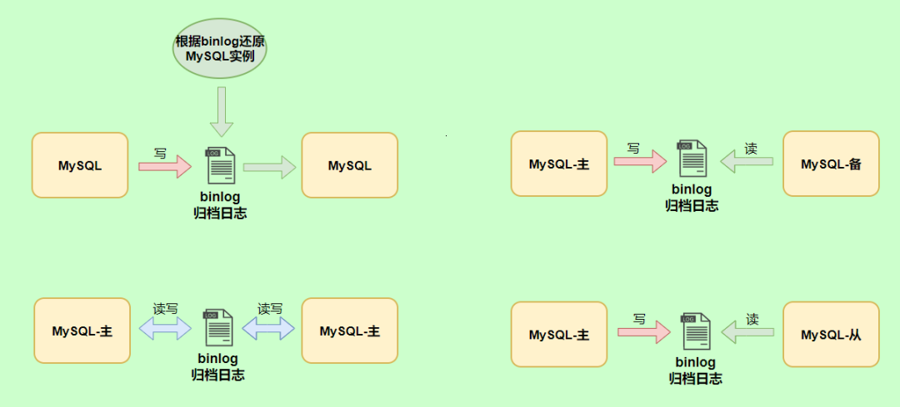
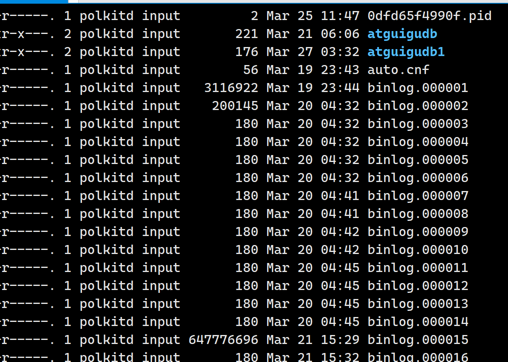

# 第 17 章_其他数据库日志

我们在讲解数据库事务时，讲过两种日志:重做日志、回滚日志。

对于线上数据库应用系统，突然遭遇`数据库宕机`怎么办?在这种情况下，定位宕机的原因就非常关键。我们可以查看数据库的`错误日志`。因为日志中记录了数据库运行中的诊断信息，包括了错误、警告和注释等信息。比如:从日志中发现某个连接中的SQL操作发生了死循环，导致内存不足，被系统强行终止了。明确了原因，处理起来也就轻松了，系统很快就恢复了运行。

除了发现错误，日志在数据复制、数据恢复、操作审计，以及确保数据的永久性和一致性等方面，都有着不可替代的作用。


千万不要小看日志 。很多看似奇怪的问题，答案往往就藏在日志里。很多情况下，只有通过查看日志才能发现问题的原因，真正解决问题。所以，一定要学会查看日志，养成检查日志的习惯，对提升你的数据库应用开发能力至关重要。

MySQL8.0 官网日志地址：“ https://dev.mysql.com/doc/refman/8.0/en/server-logs.html ”

## 1. MySQL支持的日志


### 1. 1 日志类型

MySQL有不同类型的日志文件，用来存储不同类型的日志，分为`二进制日志`、`错误日志`、`通用查询日志`和`慢查询日志`，这也是常用的 4 种。MySQL 8又新增两种支持的日志：中继日志和数据定义语句日志。使用这些日志文件，可以查看MySQL内部发生的事情。

**这 6 类日志分别为：**

- 慢查询日志： 记录所有执行时间超过long_query_time的所有查询，方便我们对查询进行优化。
- 通用查询日志： 记录所有连接的起始时间和终止时间，以及连接发送给数据库服务器的所有指令，对我们复原操作的实际场景、发现问题，甚至是对数据库操作的审计都有很大的帮助。
- 错误日志： 记录MySQL服务的启动、运行或停止MySQL服务时出现的问题，方便我们了解服务器的状态，从而对服务器进行维护。
- 二进制日志： 记录所有更改数据的语句，可以用于主从服务器之间的数据同步，以及服务器遇到故障时数据的无损失恢复。

- 中继日志： 用于主从服务器架构中，从服务器用来存放主服务器二进制日志内容的一个中间文件。从服务器通过读取中继日志的内容，来同步主服务器上的操作。

- 数据定义语句日志： 记录数据定义语句执行的元数据操作。

除二进制日志外，其他日志都是`文本文件`。默认情况下，所有日志创建于`MySQL数据目录`中。

### 1. 2 日志的弊端

- 日志功能会`降低MySQL数据库的性能`。例如，在查询非常频繁的MysQL数据库系统中，如果开启了通用查询日志和慢查询日志，MySQL数据库会花费很多时间记录日志。
- 日志会占用`大量的磁盘空间`。对于用户量非常大、操作非常频繁的数据库,日志文件需要的存储空间设置比数
  据库文件需要的存储空间还要大


## 2. 慢查询日志(slow query log)

前面章节《第 09 章_性能分析工具的使用》已经详细讲述。

## 3. 通用查询日志(general query log)

通用查询日志用来`记录用户的所有操作`，包括启动和关闭MySQL服务、所有用户的连接开始时间和截止时间、发给 MySQL 数据库服务器的所有 SQL 指令等。当我们的数据发生异常时， **查看通用查询日志，还原操作时的具体场景** ，可以帮助我们准确定位问题。

### 3. 1 问题场景

在电商系统中，购买商品并且使用微信支付完成以后，却发现支付中心的记录并没有新增，此时用户再次使用支付宝支付，就会出现`重复支付`的问题。但是当去数据库中查询数据的时候，会发现只有一条记录存在。那么此时给到的现象就是只有一条支付记录，但是用户却支付了两次。

我们对系统进行了仔细检查，没有发现数据问题，因为用户编号和订单编号以及第三方流水号都是对的。可是用户确实支付了两次，这个时候，我们想到了检查通用查询日志，看看当天到底发生了什么。

查看之后，发现: 1月1日下午2点，用户使用微信支付完以后，但是由于网络故障，支付中心没有及时收到微信支付的回调通知，导致当时没有写入数据。1月1日下午2点30，用户又使用支付宝支付，此时记录更新到支付中心。1月1日晚上9点，微信的回调通知过来了，但是支付中心已经存在了支付宝的记录，所以只能覆盖记录了。


### 3. 2 查看当前状态


```mysql
mysql> SHOW VARIABLES LIKE '%general%';
+------------------+------------------------------+
| Variable_name | Value |
+------------------+------------------------------+
| general_log | OFF | #通用查询日志处于关闭状态
| general_log_file | /var/lib/mysql/atguigu01.log | #通用查询日志文件的名称是atguigu01.log
+------------------+------------------------------+
2 rows in set (0.03 sec)
```


### 3. 3 启动日志

**方式 1 ：永久性方式**

修改my.cnf或者my.ini配置文件来设置。在[mysqld]组下加入log选项，并重启MySQL服务。格式如下：

```properties
[mysqld]
general_log=ON
general_log_file=[path[filename]] #日志文件所在目录路径，filename为日志文件名		
```


如果不指定目录和文件名，通用查询日志将默认存储在MySQL数据目录中的hostname.log文件中，hostname表示主机名。

**方式 2 ：临时性方式**

```mysql
SET GLOBAL general_log=on;  # 开启通用查询日志
```
```mysql
SET GLOBAL general_log_file=’path/filename’; # 设置日志文件保存位置
```


对应的，关闭操作SQL命令如下：

```mysql
SET GLOBAL general_log=off;  # 关闭通用查询日志
```


查看设置后情况：

```mysql
SHOW VARIABLES LIKE 'general_log%';			
```

### 3. 4 查看日志

通用查询日志是以文本文件的形式存储在文件系统中的，可以使用文本编辑器直接打开日志文件。每台MySQL服务器的通用查询日志内容是不同的。

- 在Windows操作系统中，使用文本文件查看器；

- 在Linux系统中，可以使用vi工具或者gedit工具查看；
- 在Mac OSX系统中，可以使用文本文件查看器或者vi等工具查看。

从`SHOW VARIABLES LIKE 'general_log%';`结果中可以看到通用查询日志的位置。

```mysql
/usr/sbin/mysqld, Version: 8.0.26 (MySQL Community Server - GPL). started with:
Tcp port: 3306 Unix socket: /var/lib/mysql/mysql.sock
Time Id Command Argument
2022 - 01 - 04 T07:44:58.052890Z 10 Query SHOW VARIABLES LIKE '%general%'
2022 - 01 - 04 T07:45:15.666672Z 10 Query SHOW VARIABLES LIKE 'general_log%'
2022 - 01 - 04 T07:45:28.970765Z 10 Query select * from student
2022 - 01 - 04 T07:47:38.706804Z 11 Connect root@localhost on using Socket
2022 - 01 - 04 T07:47:38.707435Z 11 Query select @@version_comment limit 1
2022 - 01 - 04 T07:48:21.384886Z 12 Connect root@172.16.210.1 on using TCP/IP
2022 - 01 - 04 T07:48:21.385253Z 12 Query SET NAMES utf
2022 - 01 - 04 T07:48:21.385640Z 12 Query USE `atguigu12`
2022 - 01 - 04 T07:48:21.386179Z 12 Query SHOW FULL TABLES WHERE Table_Type !=
'VIEW'
2022 - 01 - 04 T07:48:23.901778Z 13 Connect root@172.16.210.1 on using TCP/IP
2022 - 01 - 04 T07:48:23.902128Z 13 Query SET NAMES utf
2022 - 01 - 04 T07:48:23.905179Z 13 Query USE `atguigu`
2022 - 01 - 04 T07:48:23.905825Z 13 Query SHOW FULL TABLES WHERE Table_Type !=
'VIEW'
2022 - 01 - 04 T07:48:32.163833Z 14 Connect root@172.16.210.1 on using TCP/IP
2022 - 01 - 04 T07:48:32.164451Z 14 Query SET NAMES utf
2022 - 01 - 04 T07:48:32.164840Z 14 Query USE `atguigu`
2022 - 01 - 04 T07:48:40.006687Z 14 Query select * from account
```
在通用查询日志里面，我们可以清楚地看到，什么时候开启了新的客户端登陆数据库，登录之后做了什么 SQL 操作，针对的是哪个数据表等信息。

### 3. 5 停止日志

**方式 1 ：永久性方式**

修改my.cnf或者my.ini文件，把[mysqld]组下的general_log值设置为OFF或者把general_log一项注释掉。修改保存后，再重启MySQL服务，即可生效。 举例 1 ：


```properties
[mysqld]
general_log=OFF
```
举例 2 ：

```properties
[mysqld]
#general_log=ON
```


**方式 2 ：临时性方式**

使用SET语句停止MySQL通用查询日志功能：

```mysql
SET GLOBAL general_log=off;
```
查询通用日志功能：

```mysql
SHOW VARIABLES LIKE 'general_log%';
```


### 3. 6 删除\刷新日志

如果数据的使用非常频繁，那么通用查询日志会占用服务器非常大的磁盘空间。数据管理员可以删除很长时间之前的查询日志，以保证MySQL服务器上的硬盘空间。

**手动删除文件**

```mysql
SHOW VARIABLES LIKE 'general_log%';
```

可以看出，通用查询日志的目录默认为MySQL数据目录。在该目录下手动删除通用查询日志atguigu 01 .log。

使用如下命令重新生成查询日志文件，具体命令如下。刷新MySQL数据目录，发现创建了新的日志文件。前提一定要开启通用日志。

```bash
mysqladmin -uroot -p flush-logs
```

## 4. 错误日志(error log)

### 4. 1 启动日志

在MySQL数据库中，错误日志功能是默认开启的。而且，错误日志无法被禁止。默认情况下，错误日志存储在MySQL数据库的数据文件夹下，名称默认为mysqld.log（Linux系统）或hostname.err（mac系统）。如果需要制定文件名，则需要在my.cnf或者my.ini中做如下配置：

```properties
[mysqld]
log-error=[path/[filename]] #path为日志文件所在的目录路径，filename为日志文件名
```

修改配置项后，需要重启MySQL服务以生效。

### 4. 2 查看日志

MySQL错误日志是以文本文件形式存储的，可以使用文本编辑器直接查看。

查询错误日志的存储路径：

```mysql
mysql> SHOW VARIABLES LIKE 'log_err%';
+----------------------------+----------------------------------------+
| Variable_name | Value |
+----------------------------+----------------------------------------+
| log_error | /var/log/mysqld.log |
| log_error_services | log_filter_internal; log_sink_internal |
| log_error_suppression_list | |
| log_error_verbosity | 2 |
+----------------------------+----------------------------------------+
4 rows in set (0.01 sec)
```


执行结果中可以看到错误日志文件是mysqld.log，位于MySQL默认的数据目录下。

### 4. 3 删除\刷新日志

对于很久以前的错误日志，数据库管理员查看这些错误日志的可能性不大，可以将这些错误日志删除，以保证MySQL服务器上的硬盘空间。MySQL的错误日志是以文本文件的形式存储在文件系统中的，可以直接删除。

```mysql
[root@atguigu01 log]# mysqladmin -uroot -p flush-logs
Enter password:
mysqladmin: refresh failed; error: 'Could not open file '/var/log/mysqld.log' for
error logging.'
```

官网提示：

补充操作：

```bash
install -omysql -gmysql -m0644 /dev/null /var/log/mysqld.log
```


## 5. 二进制日志(bin log)

binlog可以说是MySQL中比较`重要`的日志了，在日常开发及运维过程中，经常会遇到。

binlog即binary log，二进制日志文件，也叫作变更日志（update log）。它记录了数据库所有执行的DDL和DML等数据库更新事件的语句，但是不包含没有修改任何数据的语句（如数据查询语句select、show等）。

它以`事件形式`记录并保存在`二进制文件`中。通过这些信息，我们可以再现数据更新操作的全过程。

> 如果想要记录所有语句（例如，为了识别有问题的查询)，需要使用通用查询日志。

binlog主要应用场景：

- 一是用于`数据恢复`，如果MySQL数据库意外停止，可以通过二进制日志文件来查看用户执行了哪些操作，对数据库服务器文件做了哪些修改，然后根据二进制日志文件中的记录来恢复数据库服务器。

- 二是用于`数据复制`，由于日志的延续性和时效性，master把它的二进制日志传递给slaves来达到master-slave数据一致的目的。

可以说MySQL**数据库的数据备份、主备、主主、主从**都离不开binlog,需要依靠binlog来同步数据，保证数据一致性。



### 5. 1 查看默认情况

查看记录二进制日志是否开启：在MySQL8中默认情况下，二进制文件是开启的。

```mysql
mysql>  show variables like '%log_bin%';
+---------------------------------+-----------------------------+
| Variable_name                   | Value                       |
+---------------------------------+-----------------------------+
| log_bin                         | ON                          |  开关
| log_bin_basename                | /var/lib/mysql/binlog       | // 存放路径
| log_bin_index                   | /var/lib/mysql/binlog.index |
| log_bin_trust_function_creators | ON                          |// 
| log_bin_use_v1_row_events       | OFF                         |
| sql_log_bin                     | ON                          |变更sql记录下来
+---------------------------------+-----------------------------+
6 rows in set (0.01 sec)
```

log_bin_trust_function_creators 防止主机和从机函数产生不一样。。例如now(),



### 5. 2 日志参数设置

方式 1 ：永久性方式

修改MySQL的my.cnf或my.ini文件可以设置二进制日志的相关参数：

```properties
[mysqld]
#启用二进制日志
log-bin=atguigu-bin
binlog_expire_logs_seconds= 600
max_binlog_size=100M
```

> 提示:
> 1. log-bin=mysql-bin #打开日志(主机需要打开)，这个mysql-bin也可以自定义，这里也可以加上路径，
> 如:/home/www/mysql_bin_log/mysql-bin
> 2. binlog_expire_logs_seconds:此参数控制二进制日志文件保留的时长单位是秒，默认2592000 30天
> --14400 4小时;86400 1天; 259200 3天;
> 3. max_binlog_size:控制单个二进制日志大小，当前日志文件大小超过此变量时，执行切换动作。此参数
> 的`最大和默认值是1GB`，该设置并`不能严格控制Binlog的大小`，尤其是Binlog比较靠近最大值而又遇到一个比较大事务时，为了保证事务的完整性，可能不做切换日志的动作只能将该事务的所有SQL都记录进当前日志，直到事务结束。一般情况下可采取默认值。

重新启动MySQL服务，查询二进制日志的信息，执行结果：

```mysql
mysql> show variables like '%log_bin%';
+---------------------------------+----------------------------------+
| Variable_name 				  | Value |
+---------------------------------+----------------------------------+
| log_bin | ON |
| log_bin_basename | /var/lib/mysql/atguigu-bin |
| log_bin_index | /var/lib/mysql/atguigu-bin.index |
| log_bin_trust_function_creators | OFF |
| log_bin_use_v1_row_events | OFF |
| sql_log_bin | ON |
+---------------------------------+----------------------------------+
6 rows in set (0.00 sec)
```


**设置带文件夹的bin-log日志存放目录**

如果想改变日志文件的目录和名称，可以对my.cnf或my.ini中的log_bin参数修改如下：

```properties
[mysqld]
log-bin="/var/lib/mysql/binlog/atguigu-bin"
```


注意：新建的文件夹需要使用mysql用户，使用下面的命令即可。

```bash
chown -R -v mysql:mysql binlog
```


> 提示
> 数据库文件最好不要与日志文件放在同一个磁盘上!这样，当数据库文件所在的磁盘发生故障时，可以使用日志文件恢复数据。

**方式 2 ：临时性方式**

如果不希望通过修改配置文件并重启的方式设置二进制日志的话，还可以使用如下指令，需要注意的是在mysql 8 中只有会话级别的设置，没有了global级别的设置。

```mysql
# global 级别
mysql> set global sql_log_bin= 0 ;
ERROR 1228 (HY000): Variable 'sql_log_bin' is a SESSION variable and can`t be used
with SET GLOBAL

# session级别
mysql> SET sql_log_bin= 0 ;
Query OK, 0 rows affected (0.01 秒)
```


### 5. 3 查看日志

当MySQL创建二进制日志文件时，先创建一个以“filename”为名称、以“.index”为后缀的文件，再创建一个以“filename”为名称、以“.000001”为后缀的文件。

MySQL服务重新启动一次，以“.000001”为后缀的文件就会增加一个，并且后缀名按 1 递增。即日志文件的数与MySQL服务启动的次数相同；如果日志长度超过了max_binlog_size的上限（默认是1GB），就会创建一个新的日志文件。

查看当前的二进制日志文件列表及大小。指令如下：

```mysql
mysql> SHOW BINARY LOGS;
+--------------------+-----------+-----------+
| Log_name | File_size | Encrypted |
+--------------------+-----------+-----------+
| atguigu-bin.000001 | 156 | No |
+--------------------+-----------+-----------+
1 行于数据集 (0.02 秒)
```
所有对数据库的修改都会记录在binglog中。但binlog是二进制文件，无法直接查看，借助mysqlbinlog命令工具了。指令如下:在查看执行，先执行一条sQL语句，如下

```mysql
 update student set name='张三_back' where id=1;
```


```mysql
root@0dfd65f4990f:/var/lib/mysql# mysqlbinlog  "/var/lib/mysql/lqhdb-binlog.000001"
#看不懂数据
```


执行结果可以看到，这是一个简单的日志文件，日志中记录了用户的一些操作，这里并没有出现具体的SQL语句，这是因为binlog关键字后面的内容是经过编码后的二进制日志。

这里一个update语句包含如下事件

- Query事件负责开始一个事务(BEGIN)
- Table_map事件负责映射需要的表
- Update_rows事件负责写入数据
- Xid事件负责结束事务

下面命令将行事件以`伪SQL的形式`表现出来

```mysql
mysqlbinlog -v "/var/lib/mysql/binlog/atguigu-bin.000002"
#220105 9:16:37 server id 1 end_log_pos 324 CRC32 0x6b31978b Query thread_id=
exec_time=0 error_code=
SET TIMESTAMP= 1641345397 /*!*/;
SET @@session.pseudo_thread_id= 10 /*!*/;
SET @@session.foreign_key_checks= 1 , @@session.sql_auto_is_null= 0 ,
@@session.unique_checks= 1 , @@session.autocommit= 1 /*!*/;
SET @@session.sql_mode= 1168113696 /*!*/;
SET @@session.auto_increment_increment= 1 , @@session.auto_increment_offset= 1 /*!*/;
/*!\C utf8mb3 *//*!*/;
SET
@@session.character_set_client= 33 ,@@session.collation_connection= 33 ,@@session.collatio
n_server= 255 /*!*/;
SET @@session.lc_time_names= 0 /*!*/;
SET @@session.collation_database=DEFAULT/*!*/;
/*!80011 SET @@session.default_collation_for_utf8mb4=255*//*!*/;
BEGIN
/*!*/;
# at 324
#220105 9:16:37 server id 1 end_log_pos 391 CRC32 0x74f89890 Table_map:
`atguigu14`.`student` mapped to number 85
# at 391
#220105 9:16:37 server id 1 end_log_pos 470 CRC32 0xc9920491 Update_rows: table id
85 flags: STMT_END_F

BINLOG '
	dfHUYRMBAAAAQwAAAIcBAAAAAFUAAAAAAAEACWF0Z3VpZ3UxNAAHc3R1ZGVudAADAw8PBDwAHgAG
AQEAAgEhkJj4dA==
dfHUYR8BAAAATwAAANYBAAAAAFUAAAAAAAEAAgAD//8AAQAAAAblvKDkuIkG5LiA54+tAAEAAAAL
5byg5LiJX2JhY2sG5LiA54+tkQSSyQ==
'/*!*/;
### UPDATE `atguigu`.`student`
### WHERE
### @1=
### @2='张三'
### @3='一班'
### SET
### @1=
### @2='张三_back'
### @3='一班'
# at 470
#220105 9:16:37 server id 1 end_log_pos 501 CRC32 0xca01d30f Xid = 15
COMMIT/*!*/;
```


前面的命令同时显示binlog格式的语句，使用如下命令不显示它

```mysql
mysqlbinlog -v --base64-output=DECODE-ROWS "/var/lib/mysql/binlog/atguigu-bin.000002"
#220105 9:16:37 server id 1 end_log_pos 324 CRC32 0x6b31978b Query thread_id=
exec_time=0 error_code=
SET TIMESTAMP= 1641345397 /*!*/;
SET @@session.pseudo_thread_id= 10 /*!*/;
SET @@session.foreign_key_checks= 1 , @@session.sql_auto_is_null= 0 ,
@@session.unique_checks= 1 , @@session.autocommit= 1 /*!*/;
SET @@session.sql_mode= 1168113696 /*!*/;
SET @@session.auto_increment_increment= 1 , @@session.auto_increment_offset= 1 /*!*/;
/*!\C utf8mb3 *//*!*/;
SET
@@session.character_set_client= 33 ,@@session.collation_connection= 33 ,@@session.collatio
n_server= 255 /*!*/;
SET @@session.lc_time_names= 0 /*!*/;
SET @@session.collation_database=DEFAULT/*!*/;
/*!80011 SET @@session.default_collation_for_utf8mb4=255*//*!*/;
BEGIN
/*!*/;
# at 324
#220105 9:16:37 server id 1 end_log_pos 391 CRC32 0x74f89890 Table_map:
`atguigu14`.`student` mapped to number 85
# at 391
#220105 9:16:37 server id 1 end_log_pos 470 CRC32 0xc9920491 Update_rows: table id
85 flags: STMT_END_F
### UPDATE `atguigu14`.`student`
### WHERE
### @1=
### @2='张三'
### @3='一班'
### SET
### @1=
### @2='张三_back'
### @3='一班'
# at 470
#220105 9:16:37 server id 1 end_log_pos 501 CRC32 0xca01d30f Xid = 15
```

关于mysqlbinlog工具的使用技巧还有很多，例如只解析对某个库的操作或者某个时间段内的操作等。简单分享几个常用的语句，更多操作可以参考官方文档。

```mysql
# 可查看参数帮助
mysqlbinlog --no-defaults --help

# 查看最后 100 行
mysqlbinlog --no-defaults --base64-output=decode-rows -vv atguigu-bin.000002 |tail - 100

# 根据position查找
mysqlbinlog --no-defaults --base64-output=decode-rows -vv atguigu-bin.000002 |grep -A 
20 '4939002'
```


上面这种办法读取出binlog日志的全文内容比较多，不容易分辨查看到pos点信息，下面介绍一种更为方便的查询命令：

```mysql
mysql> show binlog events [IN 'log_name'] [FROM pos] [LIMIT [offset,] row_count];
```
- IN 'log_name'：指定要查询的binlog文件名（不指定就是第一个binlog文件）　
- FROM pos：指定从哪个pos起始点开始查起（不指定就是从整个文件首个pos点开始算）

- LIMIT [offset]：偏移量(不指定就是 0 )

- row_count :查询总条数（不指定就是所有行）

```mysql
mysql> show binlog events in 'atguigu-bin.000002';
+--------------------+-----+----------------+-----------+-------------+---------------
--------------------------------------------------------------+
| Log_name | Pos | Event_type | Server_id | End_log_pos | Info
|
+--------------------+-----+----------------+-----------+-------------+---------------
--------------------------------------------------------------+
| atguigu-bin.000002 | 4 | Format_desc | 1 | 125 | Server ver:
8.0.26, Binlog ver: 4 |
| atguigu-bin.000002 | 125 | Previous_gtids | 1 | 156 |
|
| atguigu-bin.000002 | 156 | Anonymous_Gtid | 1 | 235 | SET
@@SESSION.GTID_NEXT= 'ANONYMOUS' |
| atguigu-bin.000002 | 235 | Query | 1 | 324 | BEGIN
|
| atguigu-bin.000002 | 324 | Table_map | 1 | 391 | table_id: 85
(atguigu14.student) |
| atguigu-bin.000002 | 391 | Update_rows | 1 | 470 | table_id: 85
flags: STMT_END_F |
| atguigu-bin.000002 | 470 | Xid | 1 | 501 | COMMIT /*
xid=15 */ |
| atguigu-bin.000002 | 501 | Anonymous_Gtid | 1 | 578 | SET
@@SESSION.GTID_NEXT= 'ANONYMOUS' |
| atguigu-bin.000002 | 578 | Query | 1 | 721 | use
`atguigu14`; create table test(id int, title varchar( 100 )) /* xid=19 */ |
| atguigu-bin.000002 | 721 | Anonymous_Gtid | 1 | 800 | SET
@@SESSION.GTID_NEXT= 'ANONYMOUS' |
| atguigu-bin.000002 | 800 | Query | 1 | 880 | BEGIN
|
| atguigu-bin.000002 | 880 | Table_map | 1 | 943 | table_id: 89
(atguigu14.test) |
| atguigu-bin.000002 | 943 | Write_rows | 1 | 992 | table_id: 89
flags: STMT_END_F |
| atguigu-bin.000002 | 992 | Xid | 1 | 1023 | COMMIT /*
xid=21 */ 							|
+--------------------+-----+----------------+-----------+-------------+---------------

--------------------------------------------------------------+

14 行于数据集 (0.02 秒)
```

上面这条语句可以将指定的binlog日志文件，分成有效事件行的方式返回，并可使用limit指定pos点的起始偏移，查询条数。其它举例:

```mysql
#a、查询第一个最早的binlog日志:
show binlog events\G ;

#b、指定查询mysql-bin.088802这个文件
show binlog events in 'atguigu-bin. 008002'\G;

#c、指定查询mysql-bin. 080802这个文件，从pos点:391开始查起:
show binlog events in 'atguigu-bin.008802' from 391\G;

#d、指定查询mysql-bin.000802这个文件，从pos点:391开始查起，查询5条（即5条语句)
show binlog events in 'atguigu-bin.000882' from 391 limit 5\G

#e、指定查询 mysql-bin.880002这个文件，从pos点:391开始查起，偏移2行〈即中间跳过2个）查询5条（即5条语句)。
show binlog events in 'atguigu-bin.088882' from 391 limit 2,5\G;
```


上面我们讲了这么多都是基于binlog的默认格式，binlog格式查看

```mysql
mysql> show variables like 'binlog_format';
+---------------+-------+
| Variable_name | Value |
+---------------+-------+
| binlog_format | ROW |
+---------------+-------+
1 行于数据集 (0.02 秒)
```

除此之外，binlog还有 2 种格式，分别是 Statement 和 Mixed

- Statement

  每一条会修改数据的sql都会记录在binlog中。

  优点：不需要记录每一行的变化，减少了binlog日志量，节约了IO，提高性能。

- Row

  5.1.5版本的MySQL才开始支持row level 的复制，它不记录sql语句上下文相关信息，仅保存哪条记录被修改。

  优点：row level 的日志内容会非常清楚的记录下每一行数据修改的细节。而且不会出现某些特定情况下的存储过程，或function，以及trigger的调用和触发无法被正确复制的问题。

- Mixed

  从5.1.8版本开始，MySQL提供了Mixed格式，实际上就是Statement与Row的结合。

  详细情况，下章讲解。

### 5. 4 使用日志恢复数据

mysqlbinlog恢复数据的语法如下：

```mysql
mysqlbinlog [option] filename|mysql –uuser -ppass;
```

这个命令可以这样理解：使用mysqlbinlog命令来读取filename中的内容，然后使用mysql命令将这些内容恢复到数据库中。

- filename：是日志文件名。

- option：可选项，比较重要的两对option参数是--start-date、--stop-date 和 --start-position、--stop-position。

  - --start-date 和 - -stop-date：可以指定恢复数据库的起始时间点和结束时间点。

  - --start-position和--stop-position：可以指定恢复数据的开始位置和结束位置。


> 注意：使用mysqlbinlog命令进行恢复操作时，必须是编号小的先恢复，例如atguigu-bin.000001必须在atguigu-bin.000002之前恢复。

```mysql
flush logs; #可以生成新的binLog 文件，，不然这个文件边恢复边变大是不行的。

show binary logs; # 显示有哪些binLog 文件
```


最早的数据情况。


下图 Pos  236 到1071 是张三林俊杰、张三3 生成的sql


不小心改错了成这样了。


```mysql
mysqlbinlog [option] filename|mysql –uuser -ppass;
mysqlbinlog --no-defaults  --start-position=236  --stop-position=1071 --database=my_db1 /var/lib/mysql/lqhdb-bin.000002 | /usr/bin/mysql -root -p123456 -v my_db1
和
```


因为id 3只是修改。所以，后面又创建id3 就报错了。


### 5. 5 删除二进制日志

MySQL的二进制文件可以配置自动删除，同时MySQL也提供了安全的手动删除二进制文件的方法。`PURGE MASTER LOGS`只删除指定部分的二进制日志文件，`RESET MASTER`删除所有的二进制日志文件。具体如下：

**1.PURGE MASTER LOGS：删除指定日志文件**

PURGE MASTER LOGS语法如下：

```mysql
PURGE {MASTER | BINARY} LOGS TO ‘指定日志文件名’

PURGE {MASTER | BINARY} LOGS BEFORE ‘指定日期’
```


**举例**:使用PURGE MASTER LOGS语句删除创建时间比binlog.000005早的所有日志

(1)多次重新启动MysSQL服务，便于生成多个日志文件。然后用SHOW语句显示二进制日志文件列表

```mysql
SHOW BINARY LOGS;
```

(2）执行PURGE MASTER LOGS语句删除创建时间比binlog.000005早的所有日志

```mysql
PURGE MASTER LOGS T0 "binlog. 000005";
```

(3）显示二进制日志文件列表

```mysql
SHGW BINARY LOGS;
```

举例:使用PURGE MASTER LOGS语句删除2020年10月25号前创建的所有日志文件。具体步骤如下:

(1)显示二进制日志文件列表

```mysql
SHOW BINARY LOGS;
```


(2）执行mysqlbinlog命令查看二进制日志文件binlog.000005的内容

```mysql
mysqlbinlog --no-defaults "/var/lib/mysql/binlog/atguigu-bin.000005"
```


结果可以看出20220105为日志创建的时间，即2022年1月05日。

(3）使用PURGE MASTER LOGS语句删除2o22年1月q5日前创建的所有日志文件

```mysql
PURGE MASTER LOGS before "20220105";
```

(4）显示二进制日志文件列表

```mysql
SHOW BINARY LOGS;
```

2022年o1月o5号之前的二进制日志文件都已经被删除，最后一个没有删除，是因为当前在用，还未记录最后的时间，所以未被删除。

**2.RESET MASTER:删除所有二进制日志文件**

```mysql
reset master;
```


### 5. 6 其它场景

二进制日志可以通过数据库的`全量备份`和二进制日志中保存的`增量信息`，完成数据库的`无损失恢复`。但是，如果遇到数据量大、数据库和数据表很多（比如分库分表的应用）的场景，用二进制日志进行数据恢复，是很有挑战性的，因为起止位置不容易管理。

在这种情况下，一个有效的解决办法是`配置主从数据库服务器`，甚至是`一主多从`的架构，把二进制日志文件的内容通过中继日志，同步到从数据库服务器中，这样就可以有效避免数据库故障导致的数据异常等问题。

## 6. 再谈二进制日志(binlog)

### 6. 1 写入机制

binlog的写入时机也非常简单，事务执行过程中，先把日志写到`binlog cache`，事务提交的时候，再把binlog cache写到binlog文件中。因为一个事务的binlog不能被拆开，无论这个事务多大，也要确保一次性写入，所以系统会给每个线程分配一个块内存作为binlog cache。

我们可以通过`binlog_cache_size`参数控制单个线程binlog cache大，如果存储内容超过了这个参数，就要
暂存到磁盘(Swap)。binlog日志刷盘流程如下:


> - 上图的write，是指把日志写入到文件系统的page cache，并没有把数据持久化到磁盘，所以速度比较快。
> - 上图的fsync，才是将数据持久化到磁盘的操作

write和fsync的时机，可以由参数sync_binlog控制，默认是 `0` 。为 0 的时候，表示每次提交事务都只write，由系统自行判断什么时候执行fsync。虽然性能得到提升，但是机器宕机，page cache里面的binglog 会丢失。如下图：


为了安全起见，可以设置为 `1` ，表示每次提交事务都会执行fsync，就如同 **redo log 刷盘流程** 一样。最后还有一种折中方式，可以设置为N(N>1)，表示每次提交事务都write，但累积N个事务后才fsync。


在出现IO瓶颈的场景里，将sync_binlog设置成一个比较大的值，可以提升性能。同样的，如果机器宕机，会丢失最近N个事务的binlog日志。

### 6.2 binlog与redolog对比

- redo log 它是`物理日志`，记录内容是“在某个数据页上做了什么修改”，属于 InnoDB 存储引擎层产生的。

- 而 binlog 是`逻辑日志`，记录内容是语句的原始逻辑，类似于“给 ID=2 这一行的 c 字段加 1”，属于MySQL Server 层
- 虽然它们都属于持久化的保证，但是则重点不同。
  - redo log让InnoDB存储引擎拥有了崩溃恢复能力。
  - binlog保证了MySQL集群架构的数据一致性。

### 6.3 两阶段提交

在执行更新语句过程，会记录redo log与binlog两块日志，以基本的事务为单位，redo log在事务执行过程中可以不断写入，而`binlog`只有在提交事务时才写入，所以redo log与binlog的`写入时机`不一样。


**redo log与binlog两份日志之间的逻辑不一致，会出现什么问题？**

以update语句为例，假设id=2的记录，字段c值是0，把字段c值更新成1，sQL语句为update Tset c=1 where id=2。

假设执行过程中写完redo log日志后，binlog日志写期间发生了异常，会出现什么情况呢?


由于binlog没写完就异常，这时候binlog里面没有对应的修改记录。因此之后用binlog日志恢复数据时，就会少这一次更新，恢复出来的这一行c值是o，而原库因为redo log日志恢复，这一行c值是1，最终数据不一致。


为了解决两份日志之间的逻辑一致问题，InnoDB存储引擎使用**两阶段提交**方案。原理很简单，将redo log的写入拆成了两个步骤prepare和commit，这就是**两阶段提交**。


使用 **两阶段提交** 后，写入binlog时发生异常也不会有影响，因为MySQL根据redo log日志恢复数据时，发现redolog还处于prepare阶段，并且没有对应binlog日志，就会回滚该事务。


另一个场景，redo log设置commit阶段发生异常，那会不会回滚事务呢？


并不会回滚事务，它会执行上图框住的逻辑，虽然redo log是处于prepare阶段，但是能通过事务id找到对应的binlog日志，所以MySQL认为是完整的，就会提交事务恢复数据。

## 7. 中继日志(relay log)

### 7. 1 介绍

**中继日志只在主从服务器架构的从服务器上存在** 。从服务器为了与主服务器保持一致，要从主服务器读取二进制日志的内容，并且把读取到的信息写入`本地的日志文件`中，这个从服务器本地的日志文件就叫`中继日志`。然后，从服务器读取中继日志，并根据中继日志的内容对从服务器的数据进行更新，完成主从服务器的`数据同步`。

搭建好主从服务器之后，中继日志默认会保存在从服务器的数据目录下。

文件名的格式是：`从服务器名 - relay-bin.序号`。中继日志还有一个索引文件：`从服务器名 - relay-bin.index`，用来定位当前正在使用的中继日志。

### 7. 2 查看中继日志

中继日志与二进制日志的格式相同，可以用 mysqlbinlog 工具进行查看。下面是中继日志的一个片段：

```mysql
SET TIMESTAMP= 1618558728 /*!*/;
BEGIN
/*!*/;
# at 950
#210416 15:38:48 server id 1 end_log_pos 832 CRC32 0xcc16d651 Table_map:
`atguigu`.`test` mapped to number 91
# at 1000
#210416 15:38:48 server id 1 end_log_pos 872 CRC32 0x07e4047c Delete_rows: table id
91 flags: STMT_END_F -- server id 1 是主服务器，意思是主服务器删了一行数据
BINLOG '
CD95YBMBAAAAMgAAAEADAAAAAFsAAAAAAAEABGRlbW8ABHRlc3QAAQMAAQEBAFHWFsw=
CD95YCABAAAAKAAAAGgDAAAAAFsAAAAAAAEAAgAB/wABAAAAfATkBw==
'/*!*/;
# at 1040
```


这一段的意思是，主服务器（“server id 1”）对表 atguigu.test 进行了 2 步操作：

```mysql
定位到表 atguigu.test 编号是 91 的记录，日志位置是 832 ；

删除编号是 91 的记录，日志位置是 872 。
```


### 7. 3 恢复的典型错误

如果从服务器宕机，有的时候为了系统恢复，要重装操作系统，这样就可能会导致你的`服务器名称`与之前`不同`。而中继日志里是`包含从服务器名的`。在这种情况下，就可能导致你恢复从服务器的时候，无法从宕机前的中继日志里读取数据，以为是日志文件损坏了，其实是名称不对了。

解决的方法也很简单，把从服务器的名称改回之前的名称。


