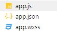
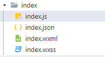
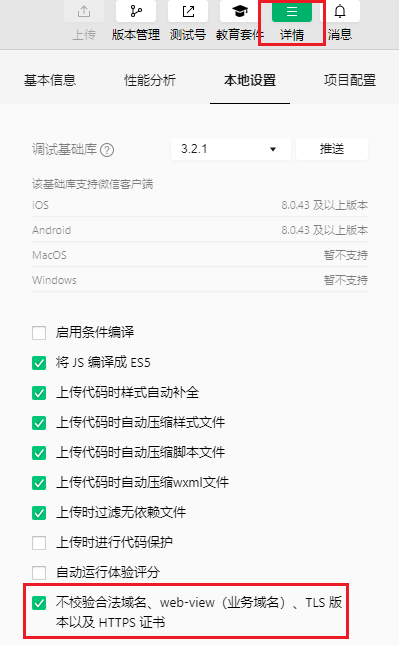
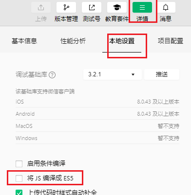
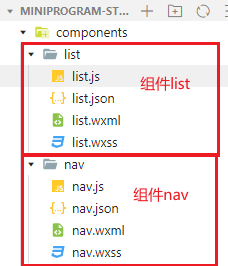

### 小程序结构
小程序全局文件

小程序页面文件(局部文件)

wxml：是框架设计的一套标签语言（组件)，用来构建小程序页面的结构，作用类似html
wxss：是一套样式语言，用于描述`wxml`的组件样式，类似css，wxss具有css大部分特性
新增了尺寸单位--rpx，一个rpx为页面宽度的 1/750
支持的选择器

- .class（推荐使用）和 #id
- element
- 并集选择器和后代选择器
- ::after 和 ::before 等伪类选择器

js：存放用于`wxml`的js代码
json：json分为项目根目录下的app.json文件和页面的.json文件
app.json：修改项目的基本配置
页面的.json文件：修改页面的基本配置（优先级更高）
当前页面文件内容（局部文件）和全局文件内容冲突，以页面文件（局部文件）内容为准

### 小程序组件
[组件文档](https://developers.weixin.qq.com/miniprogram/dev/component/)
### 事件与属性
#### 绑定事件
小程序中点击事件不是click而是tap，监听tap事件需要用到bind

1. bindtap(推荐)
2. bind:tap
#### 事件传参
**单向绑定**
为事件传递参数：

1. event 对象：形参
2. data- 属性：实参
   1. 小程序中，不能直接为回调方法传递实参
   2. 通过属性绑定的形式，把需要传递的参数绑定到当前的DOM元素的data-xx 属性下

示例：
```javascript
//wxml代码
<button type="primary" data-num="5" bindtap="countAddNum">count + n</button>
//js代码
var { num } = e.target.dataset
this.setData({
  //传递过来的参数都为string类型
  'product.count' : this.data.product.count + parseInt(num)
})
```
**双向绑定**
什么是双向绑定？
当视图发生变化，数据也会发生变化
当数据发生变化，视图跟随发生变化
实现双向绑定：
通过value为input视图绑定数据
通过监听bindinput获取视图变化，在回调中修改数据

#### 修改属性值
修改属性值需要用到函数this.setData()
```javascript
this.setData({
  msg:'无特殊字符，不需要添加单引号',
  //有特殊字符 “.” key需要添加单引号
  'product.count' : this.data.product.count + 1
})
```
### 条件渲染

1. wx:if ... wx:elif ... wx:else
2. hidden:结果为true时【隐藏】为false时【显示】
3. 当wx:if 条件满足时 进行渲染，否则不渲染
4. 当hidden条件满足 进行隐藏 否则显示 （会全部渲染）
### 配置文件解读
app.json配置文件 [配置文件文档](https://developers.weixin.qq.com/miniprogram/dev/reference/configuration/app.html)

| 属性 | 类型 | 必填 | 描述 |
| --- | --- | --- | --- |
| pages | string[] | 是 | 页面路径列表 |
| window | Object | 否 | 全局的默认窗口表现 |
| tabBar | Object | 否 | 底部tab栏的表现 |

### 数据请求
开发环境下，不校验https请求：
左上角 -> 详情 -> 本地设置 -> 不校验合法域名

使用wx.request发送请求  [文档](https://developers.weixin.qq.com/miniprogram/dev/api/network/request/wx.request.html)

### 异步编程
Promise是一个构造函数，所以我们可以通过new关键字来构建promise的实例
Promise的状态：

1. 待定(pending)：初始状态，既没有被兑现，也没有被拒绝。
2. 已兑现(fulfilled):意味着操作成功完成。
3. 已拒绝(rejected)：意味着操作失败。

示例
```javascript
// 创建一个Promise实例
// 构造函数中接收一个回调函数
// resolve：表示执行成功 reject：表示执行失败
function a(){
	return new Promise((resolve, reject) => {
    //处于待定状态下，代码会立即执行
    console.log('执行方法 a 的逻辑')
    if(isA){
      // 执行成功
      resolve('方法a执行成功')
    }else{
      //执行失败
      reject('方法a执行失败')
    }
  })
}
// 使用promise实例
// .then 接收【已兑现】的结果，即 执行成功的结果
// .catch 接收【已拒绝】的结果，即 执行失败的结果
const promise = a()
promise.then(res => {})
promise.catch(res => {})

```
async+await必须配合promise使用，同时async和await必须一起使用
async+await可以简化promise的异步操作，把promise的异步操作编程【同步的写法】
async:标记一个函数，把一个函数标记为【异步函数】
await:需要在【异步函数】中使用，标记当前的操作为【异步操作】
使用：

```javascript
//this.a()【b(), c()】这三个方法均返回一个Promise实例
async sendAsyncClick(){
    const a = await this.a();
    console.log(a);
    const b = await this.b();
    console.log(b);
    const c = await this.c();
    console.log(c);
}
```
**注意：**使用async + await 需要ES6的语法，则在微信开发者工具中需要将【将JS编译成ES5】取消勾选


### 页面的生命周期
```javascript
/** 生命周期回调—监听页面加载
 *
 * 页面加载时触发。一个页面只会调用一次，可以在 onLoad 的参数中获取打开当前页面路径中的参数。
 * 通过onLoad的options参数获取当前页面路径中的参数
 * 例如： options.id, id为页面路径参数
 */
onLoad(
    /** 打开当前页面路径中的参数 */
    options
)

/** 生命周期回调—监听页面显示
 *
 * 页面显示/切入前台时触发。
 */
onShow()

/** 生命周期回调—监听页面初次渲染完成
*
* 页面初次渲染完成时触发。一个页面只会调用一次，代表页面已经准备妥当，可以和视图层进行交互。
*
* 注意：对界面内容进行设置的 API 如`wx.setNavigationBarTitle`，请在`onReady`之后进行。
* 
* 一般在onReady中通过接口获取数据，进行渲染
*/
onReady()

/** 生命周期回调—监听页面隐藏
 *
 * 页面隐藏/切入后台时触发。 如 `navigateTo` 或底部 `tab` 切换到其他页面，小程序切入后台等。
 */
onHide()

/** 生命周期回调—监听页面卸载
 *
 * 页面卸载时触发。如`redirectTo`或`navigateBack`到其他页面时。
 */
onUnload()
```
### 上拉加载&下拉刷新
```javascript
/** 监听用户下拉动作
 *
 * 监听用户下拉刷新事件。
 * - 需要在`app.json`的`window`选项中或页面配置中开启`enablePullDownRefresh`。
 * - 可以通过`wx.startPullDownRefresh`触发下拉刷新，调用后触发下拉刷新动画，效果与用户手动下拉刷新一致。
 * - 当处理完数据刷新后，`wx.stopPullDownRefresh`可以停止当前页面的下拉刷新。
 */
onPullDownRefresh(): void | Promise<void>
/** 页面上拉触底事件的处理函数
 *
 * 监听用户上拉触底事件。
 * - 可以在`app.json`的`window`选项中或页面配置中设置触发距离`onReachBottomDistance`。
 * - 在触发距离内滑动期间，本事件只会被触发一次。
 */
onReachBottom(): void | Promise<void>
```
开启下拉刷新功能：
在页面的json文件中添加`"enablePullDownRefresh": true`，一般设置背景颜色突显效果`"backgroundColor": "#cccccc"`
### 页面跳转
页面跳转分为声明式导航和编程式导航
声明式导航：
```html
<navigator url="/pages/index/index" open-type="switchTab">声明式导航，跳转到tabbar页面</navigator>
<navigator url="/pages/detail/detail">声明式导航，跳转到非tabbar页面</navigator>
<navigator open-type="navigateBack">声明式导航，后退页面</navigator>
```
编程式导航
```javascript
//跳转tabbar页面
wx.switchTab({
  url: '/pages/index/index'
})
//跳转非tabbar页面
wx.navigateTo({
  url: '/pages/detail/detail?id='+this.data.max
})
//后退一步
wx.navigateBack({
  delta: 1
})
```
页面传参：使用?分割请求和参数，使用&分割不同参数，
在页面中通过onLoad的options参数获取页面路径上的参数
### 组件
组件的生命周期应该被定义在`lifetimes`中，而方法必须要放入到`methods`中。
组件的生命周期一共有三个：

1. created：组件实例刚刚被创建好。此时还不能调用setData
2. attached：组件完全初始化完毕、进入页面节点树后。**绝大多数初始化工作可以在这个时机进行**
3. detached:在组件离开页面节点树后 
#### 组件的使用
在项目的根目录下的components文件夹下创建组件

在页面的json文件的`usingComponents`中引用组件

```json
//key为当前组件在该页面中的标签名 value为组件的代码路径
{
  "usingComponents": {
    "nav":"/components/nav/nav",
    "list":"/components/list/list"
  }
}
```
在页面的wxml文件中以定义的key为标签使用组件
```html
<scroll-view scroll-y>
	<view>
    <!-- 使用nav组件 -->
		<nav></nav>
	</view>
	<view>
    <!-- 使用list组件 -->
		<list></list>
	</view>
</scroll-view>
```
#### 监听数据
```javascript
//observers和lifetimes、methods同级
observers:{
  //key: 要监听的数据
  //value：数据变化时，调用的函数
  active: (val) =>{
    console.log('active:'+val);
  }
}
```
#### 组件间传参
```javascript
//子组件：通过properties声明从父组件中接收的数据
/**
* 组件的属性列表
*/
properties:{
  tabId: String
}
//父组件： 通过自定义的属性列表传递参数，以子组件中定义的key为属性名，以要传递的参数为属性值
<list tabId="{{tabSelectId}}">
```
```javascript
//子组件：通过triggerEvent方法发送一个通知，通知父组件接收数据。
//方法的第一个参数为：通知名
//方法的第二个参数为：要传递的数据
this.triggerEvent('change', {
id
)
//父组件：通过bind监听子组件中发送的通知
//bind后的内容为子组件发送的通知名，表达式为接收到该通知时所触发的方法
<nav bind:change="onTabChange"></nav>
//方法被触发后可以通过e.detai1的形式获取子组件传递过来的数据对象
onTabChange (e){
  const {id} = e.detail;
  this.setData({
  	tabSelectId:id
  })
}
```
兄弟组件之间传参，需要通过父组件
### 插槽
#### 单个插槽
定义：在组件中使用 `slot` 组件定义插槽
表示：占据了一块空间，等待父组件填充
使用：在父组件中使用组件时，以`innerHTML`的形式插入内容
```html
//定义   这是在list.wxml组件中 使用<slot>组件定位插槽
<slot></slot>
<view>components/list/list.wxml</view>
//使用   这是在父组件中使用list组件
<list navId="{{selectId}}">
  <view style="text-align: center;">
    这是插槽
  </view>
</list>
```
#### 多个插槽
定义：在组件中使用`命名的slot`组件定义插槽
表示：占据多块空间，等待父组件的填充
使用：需要在组件的`options`对象中，将`multipleSlots`设置为`true`，然后在父组件中以`innerHTML`形式插入内容，定位不同的插槽需要使用slot属性定义
```javascript
//定义 list.js
Component({
  options:{
    multipleSlots:true
  },
})
  
//定义 list.wxml
<slot name="header"></slot>
<view>components/list/list.wxml</view>
<slot name="footer"></slot>
  
//使用 父组件中使用list组件的多插槽
<list navId="{{selectId}}">
  <view slot="header" style="text-align: center;">
    这是多个插槽--header
  </view>
  <view slot="footer">
    这是多个插槽--footer
  </view>
</list>
```


