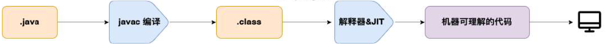
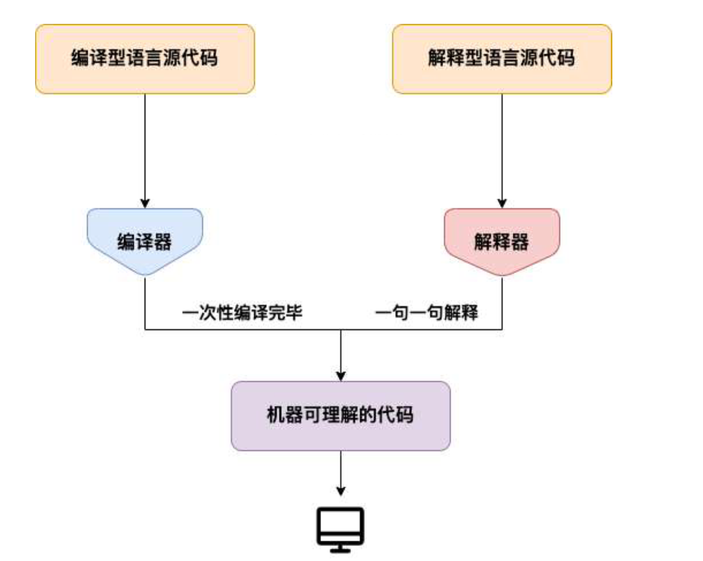
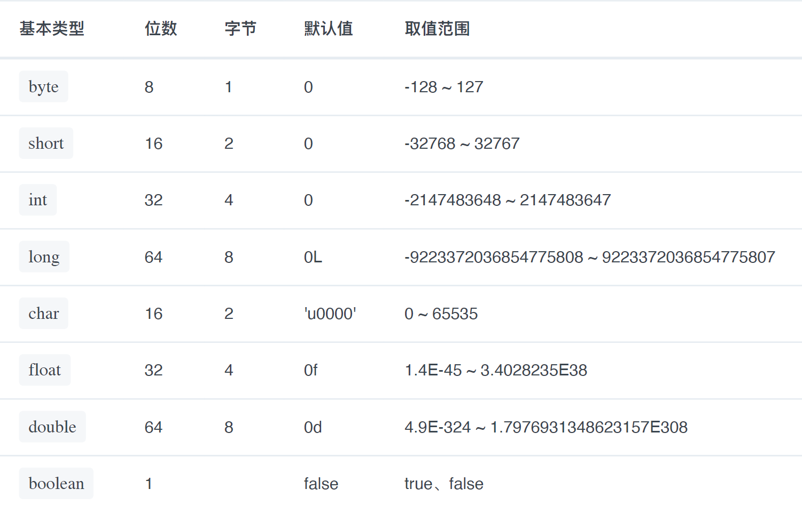
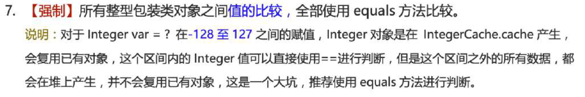

# Java基础

### JVM

Java 虚拟机（JVM）是运行 Java 字节码的虚拟机。JVM 有针对不同系统的特定实现（Windows，Linux，macOS），目的是使用相同的字节码，它们都会给出相同的结果。字节码和不同系统的JVM 实现是 Java 语言“一次编译，随处可以运行”的关键所在。

JVM 并不是只有一种！只要满足 JVM 规范，每个公司、组织或者个人都可以开发自己的专属JVM。平时接触到的 HotSpot VM 仅仅是是 JVM 规范的一种实现而已。除了我们平时最常用的 HotSpot VM 外，还有 J9 VM、Zing VM、JRockit VM 等 JVM 。

### JDK 和 JRE

**JDK** 是 Java Development Kit 缩写，它是功能⻬全的 Java SDK。它拥有 JRE 所拥有的一切，还有编译器（javac）和工具（如 javadoc 和 jdb）。它能够创建和编译程序。

**JRE** 是 Java 运行时环境。它是运行已编译 Java 程序所需的所有内容的集合，包括 Java 虚拟机（JVM），Java 类库，java 命令和其他的一些基础构件。但是，它不能用于创建新程序。

如果为了运行 Java 程序的话，那么你只需要安装 JRE 就可以了。如果需要进行一些Java 编程方面的工作，那么就需要安装 JDK 了。但是，这不是绝对的。有时，即使您不打算在计算机上进行任何 Java 开发，仍然需要安装 JDK。例如，如果要使用 JSP 部署 Web 应用程序，那么从技术上讲，您只是在应用程序服务器中运行 Java 程序。那你为什么需要 JDK 呢？因为应用程序服务器会将 JSP 转换为 Java servlet，并且需要使用 JDK 来编译 servlet。

### 什么是字节码?采用字节码的好处是什么?

在 Java 中，JVM 可以理解的代码就叫做字节码（即扩展名为**.class**的文件），它不面向任何特定的处理器，只面向虚拟机。Java 语言通过字节码的方式，在一定程度上解决了传统解释型语言执行效率低的问题，同时又保留了解释型语言可移植的特点。所以， Java 程序运行时相对来说还是高效的（不过，和 C++，Rust，Go 等语言还是有一定差距的），而且，由于字节码并不针对一种特定的机器，因此，Java 程序无须重新编译便可在多种不同操作系统的计算机上运行。

Java 程序从源代码到运行的过程如下图所示：



我们需要格外注意的是`.class->机器码`这一步。在这一步 JVM 类加载器首先加载字节码文件，然后通过解释器逐行解释执行，这种方式的执行速度会相对比较慢。而且，有些方法和代码块是经常需要被调用的(也就是所谓的热点代码)，所以后面引进了 JIT（just-in-time compilation）编译器，而 JIT属于运行时编译。当 JIT 编译器完成第一次编译后，其会将字节码对应的机器码保存下来，下次可以直接使用。而我们知道，机器码的运行效率肯定是高于 Java 解释器的。这也解释了我们为什么经常会说Java 是编译与解释共存的语言

> HotSpot 采用了惰性评估(Lazy Evaluation)的做法，根据二八定律，消耗大部分系统资源的只有那一小部分的代码（热点代码），而这也就是 JIT 所需要编译的部分。JVM 会根据代码每次被执行的情况收集信息并相应地做出一些优化，因此执行的次数越多，它的速度就越快。JDK 9引入了一种新的编译模式 AOT(Ahead of Time Compilation)，它是直接将字节码编译成机器码，这样就避免了 JIT 预热等各方面的开销。JDK 支持分层编译和 AOT 协作使用。

### 为什么不全部使用 AOT 呢？

AOT 可以提前编译节省启动时间，那为什么不全部使用这种编译方式呢？

⻓话短说，这和 Java 语言的动态特性有千丝万缕的联系了。举个例子，CGLIB 动态代理使用的是ASM 技术，而这种技术大致原理是运行时直接在内存中生成并加载修改后的字节码文件也就是.class文件，如果全部使用 AOT 提前编译，也就不能使用 ASM 技术了。为了支持类似的动态特性，所以选择使用 JIT 即时编译器。

### 为什么说 Java 语言“编译与解释并存”？

我们可以将高级编程语言按照程序的执行方式分为两种：

- 编译型：编译型语言会通过编译器将源代码一次性翻译成可被该平台执行的机器码。一般情况下，编译语言的执行速度比较快，开发效率比较低。常⻅的编译性语言有 C、C++、Go、Rust等等。
- 解释型：解释型语言会通过解释器一句一句的将代码解释（interpret）为机器代码后再执行。解释型语言开发效率比较快，执行速度比较慢。常⻅的解释性语言有 Python、JavaScript、PHP等等。



> 根据维基百科介绍：为了改善编译语言的效率而发展出的[即时编译 ](https://zh.wikipedia.org/wiki/即時編譯)技术，已经缩小了这两种语言间的差距。这种技术混合了编译语言与解释型语言的优点，它像编译语言一样，先把程序源代码编译成[字节码](https://zh.wikipedia.org/wiki/字节码)。到执行期时，再将字节码直译，之后执行。[Java](https://zh.wikipedia.org/wiki/Java)与[LLVM ](https://zh.wikipedia.org/wiki/LLVM)是这种技术的代表产物。

问题答案：这是因为 Java 语言既具有编译型语言的特征，也具有解释型语言的特征。因为 Java 程序要经过先编译，后解释两个步骤，由 Java 编写的程序需要先经过编译步骤，生成字节码（.class文件），这种字节码必须由 Java 解释器来解释执行

### Oracle JDK vs OpenJDK


### Java 语言关键字有哪些？


> default这个关键字很特殊，既属于程序控制，也属于类，方法和变量修饰符，还属于访问控制。
>
> - 在程序控制中，当在switch中匹配不到任何情况时，可以使用default来编写默认匹配的情况。
> - 在类，方法和变量修饰符中，从 JDK8 开始引入了默认方法，可以使用default关键字来定义一个方法的默认实现。
> - 在访问控制中，如果一个方法前没有任何修饰符，则默认会有一个修饰符default，但是这个修饰符加上了就会报错

### 自增自减运算符

在写代码的过程中，常⻅的一种情况是需要某个整数类型变量增加 1 或减少 1，Java 提供了一种特殊的运算符，用于这种表达式，叫做自增运算符（++)和自减运算符（--）。

++ 和 -- 运算符可以放在变量之前，也可以放在变量之后，当运算符放在变量之前时(前缀)，先自增/减，再赋值；当运算符放在变量之后时(后缀)，先赋值，再自增/减。

例如，当b = ++a时，先自增（自己增加 1），再赋值（赋值给 b）；当b = a++时，先赋值(赋值给 b)，再自增（自己增加1）。也就是，++a 输出的是 a+1 的值，a++输出的是 a 值。用一句口诀就是：“符号在前就先加/减，符号在后就后加/减”

### 成员变量与局部变量的区别？

语法形式：从语法形式上看，成员变量是属于类的，而局部变量是在代码块或方法中定义的变量或是方法的参数；成员变量可以被public,private,static等修饰符所修饰，而局部变量不能被访问控制修饰符及static所修饰；但是，成员变量和局部变量都能被final所修饰。

存储方式：从变量在内存中的存储方式来看,如果成员变量是使用static修饰的，那么这个成员变量是属于类的，如果没有使用static修饰，这个成员变量是属于实例的。而对象存在于堆内存，局部变量则存在于栈内存。

生存时间：从变量在内存中的生存时间上看，成员变量是对象的一部分，它随着对象的创建而存在，而局部变量随着方法的调用而自动生成，随着方法的调用结束而消亡。

默认值：从变量是否有默认值来看，成员变量如果没有被赋初始值，则会自动以类型的默认值而赋值（一种情况例外:被final修饰的成员变量也必须显式地赋值），而局部变量则不会自动赋值。

### 静态变量有什么作用？

静态变量可以被类的所有实例共享。无论一个类创建了多少个对象，它们都共享同一份静态变量。

通常情况下，静态变量会被final关键字修饰成为常量。

### 静态方法和实例方法有何不同？

**1、调用方式**

在外部调用静态方法时，可以使用`类名.方法名`的方式，也可以使用`对象.方法名`的方式，而实例方法只有后面这种方式。也就是说，调用静态方法可以无需创建对象。

**2、访问类成员是否存在限制**

静态方法在访问本类的成员时，只允许访问静态成员（即静态成员变量和静态方法），不允许访问实例成员（即实例成员变量和实例方法），而实例方法不存在这个限制。

### 重载和重写有什么区别？

**重载**发生在同一个类中（或者父类和子类之间），方法名必须相同，参数类型不同、个数不同、顺序不同，方法返回值和访问修饰符可以不同。

重载就是同一个类中多个同名方法根据不同的传参来执行不同的逻辑处理。

**重写**发生在运行期，是子类对父类的允许访问的方法的实现过程进行重新编写。

1.方法名、参数列表必须相同，子类方法返回值类型应比父类方法返回值类型更小或相等，抛出的异常范围小于等于父类，访问修饰符范围大于等于父类。

2.如果父类方法访问修饰符为private/final/static则子类就不能重写该方法，但是被static修饰的方法能够被再次声明。3. 构造方法无法被重写

重写就是子类对父类方法的重新改造，外部样子不能改变，内部逻辑可以改变。

> 注意：如果方法的返回类型是 void 和基本数据类型，则返回值重写时不可修改。但是如果方法的返回值是引用类型，重写时是可以返回该引用类型的子类的。

### 什么是可变长参数？

从 Java5 开始，Java 支持定义可变⻓参数，所谓可变⻓参数就是允许在调用方法时传入不定⻓度的参数。就比如下面的这个method1方法就可以接受 0 个或者多个参数。

```java
public static void method1(String... args) {//......}
```

另外，可变参数只能作为函数的最后一个参数，但其前面可以有也可以没有任何其他参数。

```java
public static void method2(String arg1, String... args) {//......}
```

**遇到方法重载的情况怎么办呢？会优先匹配固定参数还是可变参数的方法呢？**

答案是会优先匹配固定参数的方法，因为固定参数的方法匹配度更高。

另外，Java 的可变参数编译后实际会被转换成一个数组，我们看编译后生成的class文件就可以看出来了。

### Java 中的几种基本数据类型了解么？

Java 中有 8 种基本数据类型，分别为：

- 6 种数字类型：
  - 4 种整数型：byte、short、int、long
  - 2 种浮点型：float、double
- 1 种字符类型：char
- 1 种布尔型：boolean。

这 8 种基本数据类型的默认值以及所占空间的大小如下：



> 注意：
>
> Java 里使用long类型的数据一定要在数值后面加上L，否则将作为整型解析。
>
> char a = 'h'  char :单引号，String a = "hello" :双引号。
>
> 这八种基本类型都有对应的包装类分别为：Byte、Short、Integer、Long、Float、Double、Character、Boolean

### 基本类型和包装类型的区别？

- 成员变量包装类型不赋值就是null，而基本类型有默认值且不是null。

- 包装类型可用于泛型，而基本类型不可以。

- 基本数据类型的局部变量存放在 Java 虚拟机栈中的局部变量表中，基本数据类型的成员变量（未被static修饰）存放在 Java 虚拟机的堆中。包装类型属于对象类型，我们知道几乎所有对象实例都存在于堆中。

- 相比于对象类型，基本数据类型占用的空间非常小。

为什么说是几乎所有对象实例呢？

这是因为 HotSpot 虚拟机引入了 JIT 优化之后，会对对象进行逃逸分析，如果发现某一个对象并没有逃逸到方法外部，那么就可能通过标量替换来实现栈上分配，而避免堆上分配内存

注意：基本数据类型存放在栈中是一个常见的误区！基本数据类型的成员变量如果没有被static修饰的话（不建议这么使用，应该要使用基本数据类型对应的包装类型），就存放在堆中。

### 包装类型的缓存机制了解么？

Java 基本数据类型的包装类型的大部分都用到了缓存机制来提升性能。

`Byte`,`Short`,`Integer`,`Long`这 4 种包装类默认创建了数值[-128，127]的相应类型的缓存数据，`Character`创建了数值在[0,127]范围的缓存数据，`Boolean`直接返回True or False

如果超出对应范围仍然会去创建新的对象，缓存的范围区间的大小只是在性能和资源之间的权衡。两种浮点数类型的包装类Float,Double并没有实现缓存机制。

> 所有整型包装类对象之间值的比较，全部使用 equals 方法比较



### 自动装箱与拆箱了解吗？原理是什么？

什么是自动拆装箱？

装箱：将基本类型用它们对应的引用类型包装起来；

拆箱：将包装类型转换为基本数据类型；

```java
ntegeri=10; //装箱
int n=i; //拆箱
```

从字节码中，会发现装箱其实就是调用了包装类的valueOf()方法，拆箱其实就是调用了xxxValue()方法

`Integer i = 10` 等价于`Integer i = Integer.valueOf(10)`

`int n = i`等价于`int n = i.intValue()`

如果频繁拆装箱的话，也会严重影响系统的性能。我们应该尽量避免不必要的拆装箱操作。