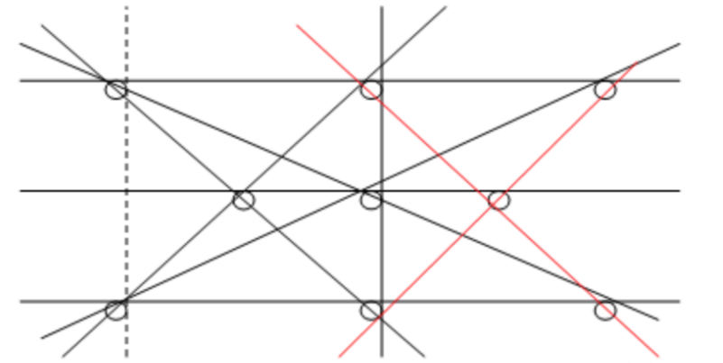

# 智力题

### 有 25 匹马和 5 条赛道，赛马过程无法进行计时，只能知道相对快慢。问最少需要几场赛马 可以知道前3名?

先把25匹马分成5组，进行5场赛马，得到每组的排名。

再将每组的第1名选出，进行1场赛马，按照这场的排名将5组先后标为A、B、C、D、E。

可以知道，A组的第1名就是所有25匹马的第1名。

而第2、3名只可能在A组的2、3名，B组的第1、2名，和 C组的第1名，总共5匹马。

让这5匹马再进行1场赛马，前两名就是第2、3名。所以总共是5+1+1=7场赛马。

### 给定两条绳子，每条绳子烧完正好一个小时，并且绳子是不均匀的。问要怎么准确测量15分钟。

- 点燃第一条绳子R1两头的同时，点燃第二条绳子R2的一头；
- 当R1烧完，正好过去30分钟，而R2还可以再烧30分钟；
- 点燃R2的另一头，15分钟后，R2将全部烧完。

### 有 9 个球，其中 8 个球质量相同，有 1 个球比较重。要求用2 次天平，找出比较重的那个 球。

- 将这些球均分成3个一组共3组，选出2组称重，如果1组比较重，那么重球在比较重的那1组；如果1组重量相等，那么重球在另外1组。
- 对比较重的那1组的3个球再分成3组，重复上面的步骤。

### 有 20 瓶药丸，其中 19 瓶药丸质量相同为 1克，剩下⼀瓶药丸质量为 1.1 克。瓶子中有无数个药丸。要求用一次天平找出药丸质量 1.1克的药瓶。

- 可以从药丸的数量上来制造差异：从第 i 瓶药丸中取出 i 个药丸，然后⼀起称重。

- 可以知道，如果第 i 瓶药丸重 1.1克/粒，那么称重结果就会⽐正常情况下重 0.1 * i 克。

### 有两个杯子，容量分别为 5 升和 3 升，水的供应不断。问怎么用这两个杯子得到 4 升的水。

不能从 3 做减法得到 4，那么只能从 5 做减法得到 4，即最后⼀个运算应该为 5 - 1 = 4，此时问题转换为得到1 升的水；

1 升的水 可以由 3 做减法得到，3 - 2 = 1，此时问题转换为得到 2 升的水；

5 - 3 = 2

### 有 100 个囚犯分别关在 100 间牢房⾥。牢房外有⼀个空荡荡的房间，房间⾥有⼀个由开关控制的灯泡。初始时，灯是关着的。看守每次随便选择⼀名囚犯进⼊房间，但保证每个囚犯都会被选中⽆穷多次。如果在某⼀时刻，有囚犯成功断定出所有⼈都进过这个房间了，所有囚犯都能释放。游戏开始前，所有囚犯可以聚在⼀起商量对策，但在此之后它们唯⼀可⽤来交流的⼯具就只有那个灯泡。他们应该设计⼀个怎样的协议呢？

⾸先，第⼀天出来的⼈，担当“计数者”，它把灯开起来（原来开着就不必动了）, 然后每天出来⼀个囚犯。 如果他不是“计数者”，并且没有关过灯， 并且灯开着， 那么就把灯关了。如果他是“计数者”， 如果灯关了， 就把他开起来（计数+1）。 当然如果灯被关了99次， 那么就去和国王说吧。

第⼀天出来的是“计数者”， 这是⼀个必然事件， 从第⼆天开始， 我们要完成以下过程 99 次

出来⼀个新的囚犯，  然后等待“计数者”出来把灯开起来。
第⼀次出来新的囚犯的概率是： 99 / 100 --- 除去计数者， 其他任何囚犯出来都满⾜要求 , 完成这⼀步的平均时间是 100 / 99 天

完成上⾯这个过程后，接着要求“计数者”出来，开灯。 这个概率是 1 / 100 , 完成这⼀步的平均时间是 100 天

第⼆次， 新囚犯出来的概率是 98 / 100, 完成这⼀步的平均时间是100 / 98 , 计数者出来的率还是 1 / 100 , 完成这⼀步的平均时间还是100 天
...

第99次， 新囚犯出来的概率是 1 / 100 (只有⼀个囚犯没有出来了) , 计数者出来的率还是 1 / 100

然后我们把时间加起来:

100 / 99 + 100 + 100 / 98 + 100 + ... 100 / 1 + 100

= 100 * 99 + 100 * (1 / 99 + 1 / 98 + 1 / 97 + ... + 1)

= 9900 + 100 * (1 + 1 / 2 + 1 / 3 + ... 1 / 99)

1 + 1 / 2 + 1 / 3 + ... 1 / 99 这是⼀个调和级数 ⼤概等于 ln 99 + 1 ，
所以上述值为： 10417

### 家⾥有两个孩⼦，⼀个是⼥孩，另⼀个也是⼥孩的概率是多少？

https://www.bilibili.com/video/BV1ws411j77v

### 参赛者会看⻅三扇关闭了的⻔，其中⼀扇的后⾯有⼀辆汽⻋，选中后⾯有⻋的那扇⻔可赢得该汽⻋，另外两扇⻔后⾯则各藏有⼀只⼭⽺。当参赛者选定了⼀扇⻔，但未去开启它的时 候，节⽬主持⼈开启剩下两扇⻔的其中⼀扇，露出其中⼀只⼭⽺。主持⼈其后会问参赛者要不要换另⼀扇仍然关上的⻔。问题是：换另⼀扇⻔会否增加参赛者赢得汽⻋的机率。

https://www.bilibili.com/video/av25648623/

### ⼀副牌52张,告诉瞎⼦⾥⾯有10张牌是正⾯朝上的, 要求瞎⼦把这52张牌分成两堆, 并且每堆牌正⾯朝上的张数相同，可任意翻动牌，但是⼀直不可以看。

分成10和42， 10 中的所有牌。

proof： 第⼀堆（10张牌⾥有x张向上），全翻 = 10-x 张向上，等于第⼆堆向上的牌数

### 有⽆限的⽔，5L和6L 的桶精确装4L ⽔

通⽤解法： ⽤⼩的桶不断往⼤桶填⽔

### 1000瓶药，有⼀些可能有毒，⽤⽼⿏来喝药， 喝到有毒的⼀周就死。⼀周内⾄少需要多少只 ⽼⿏才能检测到哪些有毒

⼆进制，死=1，不死=0，⽼⿏=bit，答案 lg1000 = 10

### 13个⽯头，有⼀个⽐较重其他都⼀样，⽤天平 测量最多需要⼏次才能测出重的那个

⼀般都是分成3份ABC，称A和B，如果A=B，那么在C那，A>B 在A那， A<B 在B那，⼀次排除了2/3

4 4 5
 \1) 如果 4 == 4 在 5 ⾥⾯ 分为 2 2 1
 1.1) 如果 2 == 2 在 1 那 ok 两次
 1.2) 如果 2 != 2 称 1 1 ，那个沉就是答案，三次
 \2) 4 != 4 在 沉的那堆⾥⾯
 2.1) 称2 2 排除 2个 再称1 1 ，那个沉就是答案，三次

ps 评论提醒，最好是1次，直接 6 6 1 ，如果平衡那个1就是答案，但是不确保能测出

### 五对夫妇举⾏家庭聚会 每⼀个⼈都可能和其他⼈握⼿, 但夫妇之间绝对不握⼿. 聚会结束时,A先⽣提问⼤家握⼿⼏次（很关键），结果是每个⼈的握⼿次数不相同。问A先⽣的太太握⼿⼏次

⾸先有⼀个隐含的信息，他们握⼿的次数分别是0，1，2，3，4，5，6，7，8。为什么呢?显然，握⼿次数是⼩于等于8的，因为10个⼈，⾃⼰不和⾃⼰握⼿，⾃⼰不和配偶握⼿，只能是10-2=8，刚刚好⼤家的都不同所以就是0-8了

其次，握⼿x次和握⼿8-x次的是⼀家⼈。抽象来说，俩夫妻握⼿总次数刚刚好铺满其他8⼈。

⽐如0次和8次是⼀家⼈。因为⼀个⼈握了0次⼿，说明他（她）没有和其他任何⼈握⼿，⽽握了8次⼿的⼈握了别家的所有⼈的⼿，如果握了8次⼿的这个⼈和握了0次⼿的这个⼈不是⼀家⼈，握了8次⼿的这个⼈就必然握过握了0次⼿的⼈，那么，握了0次⼿的⼈就被握了8次⼿的⼈握了1次，这就⽭盾了。

再⽐如，握1次⼿的⼈和握7次⼿的⼈是⼀家⼈。因为现在⼤家都⾄少握过⼀次⼿了（和握过8次⼿的那个⼈握的），所以握过7次⼿的⼈必须和除了第⼀家和⾃⼰家的所有⼈握⼿，⽽握过1次⼿的⼈已经不能再和任何⼈握⼿了，因此，他们只能是⼀家⼈。其他同理。接着，既然握⼿次数之和为8的必定是⼀对夫妻,九⼈中⼜没有两个⼈握⼿的次数相同,⽽0-8次握⼿⾥⾯没有配对成功的是4（成功的是0-8，1-7，2-6，3-5），所以只有A先⽣和A太太握⼿次数同为4次

### 两⼈玩游戏，在脑⻔上贴数字（正整数 >=1），只看⻅对⽅的，看不⻅⾃⼰的，⽽且 两⼈的数字相差1。两⼈的对话： A：我不知 道 B：我也不知道 A：我知道了 B：我也知道 了。问A头上的字是多少，B头上的字是多少？

每⼀个数n都是 有n-1和n+1两个相邻数，但是1只有⼀个2是相邻数

A：我不知道 。不知道⾃⼰是1还是3
B：我也不知道。  如果A是1，那么B肯定是能够确定他⾃⼰是2。
A：我知道了。⾃⼰不是1 ⽽是3
B：我也知道了。  既然A知道⾃⼰，肯定是从2推出的3，那么也知道
⾃⼰是2了

所以A是3，B是2

### 如果你是⼀名艾滋病患者，那么经过检测后，结果显示为阳性的概率为 99% 。如果你并没有携带艾滋病毒，经过检测后，结果显示为阳性的概率仅为 1% 。也就是说，这种设备较为‘可靠’， 不论你是否患有艾滋病，它基本能作出正确的判断。假如现在，⽤艾滋病检测试纸对⾃⼰进⾏⼀次 检测，检测结果显示是阳性，那请问你觉得⾃⼰得艾滋病的概率是多⼤？患艾滋病的概率是 1/10000 .

当随机从总体中抽出⼀个⼈，利⽤检测试纸进⾏检 测，如果检测结果 呈阳性，并不意味着这个⼈⼀定患病，他患病的可能性其实不⾼，原 因是没患病的⼈基数实在太⾼了。

阳性的情况（假阳+真有病）： 9999/10000 * 1% + 1/10000 * 99%

真有病概率 ： 1/10000 * 99% / （ 9999/10000 * 1% + 1/10000 *99% ） 约1%

后续问题： 连续2次都是阳性，真有病的概率？

阳性的情况（假阳+真有病）： 9999/10000 * 1%* 1% + 1/10000 * 99% * 99%

真有病概率 ： 1/10000 * 99% * 99% / （ 9999/10000 * 1% * 1% + 1/10000 * 99% * 99%） 约50%

### 有10瓶药，每瓶有10粒药，其中有⼀瓶是变质 的。好药每颗重1克，变质的药每颗⽐好药重 0.1克。问怎样⽤天秤称⼀次找出变质的那瓶 药。

编号1-10 分别取1-10颗，重量为x, 坏药编号为 (x - 55) /0.1

### 有7克、2克砝码各⼀个，天平⼀只，如何只⽤ 这些物品三次将140克的盐分成50、90克各⼀ 份？

第⼀步：把140克盐分成两等份，每份70克。

第⼆步：把天平⼀边放上2+7克砝码，另⼀边放盐，这样就得到9克和61克分开的盐。

第三步：将9克盐和2克砝码放在天平⼀边，另⼀边放盐，这样就得到11克和50克。于是50和90就分开了

### 有⼀辆⽕⻋以每⼩时15公⾥的速度离开洛杉矶 直奔纽约，另⼀辆⽕⻋以每⼩时20公⾥的速度 从纽约开往洛杉矶。如果有⼀只⻦，以外30公 ⾥每⼩时的速度和两辆⽕⻋现时启动，从洛杉 矶出发，碰到另⼀辆⻋后返回，依次在两辆⽕ ⻋来回的⻜⾏，直道两⾯辆⽕⻋相遇，假设洛 杉矶到纽约的距离为s, 请问，这只⼩⻦⻜⾏了 多⻓距离？

　那⼩⻦⻜⾏的距离就是(s/(15+20))*30。 时间 * 速度

### 你有两个罐⼦，50个红⾊弹球，50个蓝⾊弹 球，随机选出⼀个罐⼦，随机选取出⼀个弹球 放⼊罐⼦，怎么给红⾊弹球最⼤的选中机会？ 在你的计划中，得到红球的准确⼏率是多少？

罐1 ： 红1

罐2 ： 红49+蓝50

红概率 = 1/2 * 1 + 1/2 * 49 /（49+50） 约3/4

### 想象你在镜⼦前，请问，为什么镜⼦中的影像 可以颠倒左右，却不能颠倒上下？

因为⼈的两眼在⽔平⽅向上对称。

### 病狗问题 ⼀个住宅区内有100户⼈家，每户⼈ 家养⼀条狗，每天傍晚⼤家都在同⼀个地⽅遛 狗。已知这些狗中有⼀部分病狗，由于某种原 因，狗的主⼈⽆法判断⾃⼰的狗是否是病狗， 却能够分辨其他的狗是否有病，现在，上级传 来通知，要求住户处决这些病狗，并且不允许 指认他⼈的狗是病狗(就是只能判断⾃⼰的)， 过了7天之后，所有的病狗都被处决了，问， ⼀共有⼏只病狗?为什么?

https://www.bilibili.com/video/av27732823/

### 桌上有100个苹果，你和另⼀个⼈⼀起拿，⼀ ⼈⼀次，每次拿的数量⼤于等于1⼩于等于5， 问：如何拿能保证最后⼀个苹果由你来拿？

分析：如果要保证拿最后⼀个，那么就得保证拿到第94个，以此类推，要拿第94个，就要保证拿到第88个、82、76、70...最后只要保证你拿到第四个就⾏了，所以看下⾯：

解答：只需要你先拿，第⼀次拿4个，以后看对⽅拿的个数，根据对⽅拿的个数，保证每轮对⽅和你拿的加起来是6就⾏了，其实就是保证你拿到4，还要拿到10,16...直到94

### 两位盲⼈ , 他们都各⾃买了两对⿊袜和两对⽩ 袜，⼋对袜⼦的布质、⼤⼩完全相同，⽽每对 袜都有⼀张商标纸连着。两位盲⼈不⼩⼼将⼋ 对袜⼦混在⼀起。 他们每⼈怎样才能取回⿊袜 和⽩袜各两对呢？

每⼀对分开，⼀⼈拿⼀只，因为袜⼦不分左右脚的；

### 有三筐⽔果，⼀筐装的全是苹果，第⼆筐装的 全是橘⼦，第三筐是橘⼦与苹果混在⼀起。筐 上的标签都是错的 , 你的任务是拿出其中⼀ 筐，从⾥⾯只拿⼀只⽔果，然后正确写出三筐 ⽔果的标签。

从标着“混合”标签的筐⾥拿⼀只⽔果，就可以知道另外两筐装的是什么⽔果了。

### ⼀个⼩猴⼦边上有100 根⾹蕉，它要⾛过50 ⽶ 才能到家，每次它最多搬50 根⾹蕉，每⾛1 ⽶ 就要吃掉⼀根，请问它最多能把多少根⾹蕉搬 到家⾥。

设 ⼩猴从 0 ⾛到 50, 到 A 点时候他可以直接抱⾹蕉回家了, 可是到 A点时候他⾄少消耗了3A 的⾹蕉( 到A, 回0, 到A), ⼀个限制就是⼩猴只能抱 50 只⾹蕉, 那么在 A 点⼩猴最多 49 只⾹蕉.100-3A=49, 所以

A=17.

0 -> 17 放下 50 - 2*17 = 16 根

17-> 0 消耗完

0 -> 17 还有 50 - 17 + 16 = 49 根

直接回家 49 - （50 - 17） = 16 根

### 连续整数之和为1000的共有⼏组？

⾸先1000为⼀个解。连续数的平均值设为x，1000必须是x的整数倍。 假如连续数的个数为偶数个，x就不是整数了。x的2倍只能是5，25， 125才⾏。因为平均值为12.5,要连续80个达不到。125/2 = 62.5是可 以的。即62，63，61，64，等等。连续数的个数为奇数时，平均值为 整数。1000为平均值的奇数倍。1000 = 2×2×2×5×5×5；x可以为2， 4，8，40，200排除后剩下40和200是可以的。所以答案为平均值为62.5，40，200，1000的4组整数。

### 据说有⼈给酒肆的⽼板娘出了⼀个难题：此⼈ 明明知道店⾥只有两个舀酒的勺⼦，分别能舀 7两和11两酒，却硬要⽼板娘卖给他2两酒。聪 明的⽼板娘毫不含糊，⽤这两个勺⼦在酒缸⾥ 舀酒，并倒来倒去，居然量出了2两酒，聪明 的你能做到吗？

### 在9个点上画10条直线，要求每条直线上⾄少 有三个点？

### 五个囚犯先后从100颗绿⾖中抓绿⾖。抓得最 多和最少的⼈将被处死，不能交流，可以摸出 剩下绿⾖的数量，谁的存活⼏率最⼤？

1、他们都是很聪明的⼈；

2、他们的原则是先 求保命，再去多杀⼈；

3、100颗不必都分完， 但要保证每⼈⾄少抓⼀颗；

4、若有重复的情 况，则也算最⼤和最⼩，⼀并处死。

### 有甲、⼄两⼈，其中，甲只说假话，⽽不说真 话；⼄则是只说真话，不说假话。但是，他们 两个⼈在回答别⼈的问题时，只通过点头与摇 头来表示，不讲话。有⼀天，⼀个⼈⾯对两条 路：A与B，其中⼀条路是通向京城的，⽽另⼀ 条路是通向⼀个⼩村庄的。这时，他⾯前站着 甲与⼄两⼈，但他不知道此⼈是甲还是⼄，也 不知道“点头”是表示“是”还是表示“否”。现 在，他必须问⼀个问题，才可能断定出哪条路 通向京城。那么，这个问题应该怎样问？

这个⼈只要站在A与B任何⼀条路上，然后，对着其中的⼀个⼈问： “如果我问他（甲、⼄中的另外⼀个⼈）这条路通不通向京城，他会怎 么回答？”如果甲与⼄两个⼈都摇头的话，就往这条路向前⾛去，如果 都点头，就往另⼀外⼀条⾛去。 f( g(x ) ) = g( f( x ) )

### 甲、⼄、丙三个⼈在⼀起做作业，有⼀道数学 题⽐较难，当他们三个⼈都把⾃⼰的解法说出 来以后，甲说：“我做错了。”⼄说：“甲做对 了。”丙说：“我做错了。” , 在⼀旁的丁看到他 们的答案并听了她们的意⻅后说：“你们三个 ⼈中有⼀ 个⼈做对了，有⼀个⼈说对了。”请 问，他们三⼈中到底谁做对了？

假设丙做对了，那么甲、⼄都做错了，这样，甲说的是正确的，⼄、 丙都说错了，符合条件，因此，丙做对了。

### 50名运动员按顺序排成⼀排，教练下令：“单 数运动员出列！”剩下的运动 员重新排列编 号，教练⼜下令：“单数运动员出列！”如此下 去，最后只剩下⼀个⼈，他是⼏号运动员？最 后剩下的⼜是谁？

教练下令“单数”运动员出列时，教练只要下5次命令，就能知道剩下的 那个⼈。此⼈在下第五次令之前排序为2，在下4次令之前排序为4， 在下3次令之前排序为8，在下2次令之前排序为16，在下1次令之前排 序为32，即32位运动员。 因此：32号。

### 赵⼥⼠买了⼀些⽔果和⼩⻝品准备去看望⼀个 朋友，谁知，这些⽔果和⼩⻝品被他的⼉⼦们 偷吃了，但她不知道是哪个⼉⼦。为此，赵⼥ ⼠⾮常⽣⽓，就盘问4个⼉⼦谁偷吃了⽔果和 ⼩⻝品。⽼⼤说道：“是⽼⼆吃的。”⽼⼆说 道：“是⽼四偷吃的。”⽼三说道：“反正我没 有偷吃。”⽼四说道：“⽼⼆在说谎。”这4个⼉ ⼦中只有⼀个⼈说了实话，其他的3个都在撒 谎。那么，到底是谁偷吃了这些⽔果和⼩⻝ 品？

是⽼三偷吃了⽔果和⼩⻝品，只有⽼四说了实话。⽤假设法分别假设 ⽼⼤、⽼⼆、⽼三、⽼四都说了实话，看是否与题意⽭盾，就可以得 出答案

### 某企业⽼板在对其员⼯的思维能⼒进⾏测试时 出了这样⼀道题：某⼤型企业的员⼯⼈数在 1700～1800之间，这些员⼯的⼈数如果被5除 余3，如果被7除余4，如果被11除余6。那么， 这个企业到底有多少员⼯？员⼯⼩王略想了⼀ 下便说出了答案，请问他是怎么算出来的？

对题⽬中所给的条件进⾏分析，假如把全体员⼯的⼈数扩⼤2倍，则它被5除余1，被7除余1，被11除余1，那么，余数就相同了。假设这个企业员⼯的⼈数在3400 - 3600之间，满⾜被5除余1，被7除余1，被11除余1的数是

( x - 1 ) % 5 ==0

( x - 1 ) % 7 ==0

( x - 1 ) % 11 ==0

lcm (5 , 7 , 11 ) = 35 * 11 = 385

385 * 9 = 3465

x = 3466，符合要求，所以这个企业共有1733个员⼯。

### ⽼师让幼⼉园的⼩朋友排成⼀⾏，然后开始发 ⽔果。⽼师分发⽔果的⽅法是这样的：从左⾯ 第⼀个⼈开始，每隔2⼈发⼀个梨；从右边第 ⼀个⼈开始，每隔4⼈发⼀个苹果。如果分发 后的结果有10个⼩朋友既得到了梨，⼜得到了 苹果，那么这个幼⼉园有多少个⼩朋友？

158个⼩朋友。10个⼩朋友拿到梨和苹果最少⼈数是（2+1）× （4+1）×（101）+1=136⼈，然后从左右两端开始向外延伸，假设梨 和苹果都拿到的⼈为“1”，左右两边的延伸数分别为：3×5－3=12⼈， 3×5－5=10⼈。所以，总⼈数为136+12+10=158。

### 有⼀个外地⼈路过⼀个⼩镇，此时天⾊已晚， 于是他便去投宿。当他来到⼀个⼗字路⼝时， 他知道肯定有⼀条路是通向宾馆的，可是路⼝ 却没有任何标记，只有三个⼩⽊牌。第⼀个⽊ 牌上写着：这条路上有宾馆。第⼆个⽊牌上写 着：这条路上没有宾馆。第三个⽊牌上写着： 那两个⽊牌有⼀个写的是事实，另⼀个是假 的。相信我，我的话不会有错。假设你是这个 投宿的⼈，按照第三个⽊牌的话为依据，你觉 得你会找到宾馆吗？如果可以，那条路上有宾 馆哪条路上有宾馆

假设第⼀个⽊牌是正确的，那么第⼀个⼩⽊牌所在的路上就有宾馆， 第⼆条路上就没有宾馆，第⼆句话就该是真的，结果就有两句真话 了；假设第⼆句话是正确的，那么第⼀句话就是假的，第⼀⼆条路上 都没有宾馆，所以⾛第三条路，并且符合第三句所说，第⼀句是错误 的，第⼆句是正确的。

### 有⼀富翁，为了确保⾃⼰的⼈身安全，雇了双 胞胎兄弟两个作保镖。兄弟两个确实尽职尽 责，为了保证主⼈的安全，他们做出如下⾏事 准则：

a．每周⼀、⼆、三，哥哥说谎；

 b．每逢四、五、六，弟弟说谎；

 c．其他时间两⼈都说真话。

### ⼀天，富翁的⼀个朋友急着找富翁，他知道要 想找到富翁只能问兄弟俩，并且他也知道兄弟 俩个的做事准则，但不知道谁是哥哥，谁是弟 弟。另外，如果要知道答案，就必须知道今天 是星期⼏。于是他便问其中的⼀个⼈：昨天是 谁说谎的⽇⼦？结果两⼈都说：是我说谎的⽇ ⼦。你能猜出今天是星期⼏吗？

⾸先分析，兄弟两个必定有⼀个⼈说真话，其次，如果两个⼈都说真 话，那么今天就是星期⽇，但这是不可能的，因为如果是星期⽇，那 么两个⼈都说真话，哥哥就说谎了。 假设哥哥说了真话，那么今天⼀ 定就是星期四，因为如果是星期四以前的任⼀天，他都得在今天再撒 ⼀次谎，如果今天星期三，那么昨天就是星期⼆，他昨天确实撒谎 了，但今天也撒谎了，与假设不符，所以不可能是星期⼀、⼆、三。 由此类推，今天也不会是星期五以后的⽇⼦，也不是星期⽇。 假设弟 弟说了真话，弟弟是四五六说谎，那么先假设今天是星期⼀，昨天就 是星期⽇，他说谎，与题设⽭盾；今天星期⼆，昨天就是星期⼀，不 合题意；⽤同样的⽅法可以去掉星期三的可能性。如果今天星期四， 那么他今天就该撒谎了，他说昨天他撒谎，这是真话，符合题意。假 设今天星期五，他原本应该撒谎但他却说真话，由“昨天我撒谎了”就 知道不存在星期五、六、⽇的情况，综上所述，两个结论都是星期 四，所以今天星期四。

### 对地理⾮常感兴趣的⼏个同学聚在⼀起研究地 图。其中的⼀个同学在地图上标上了标号A、 B、C、D、E，让其他的同学说出他所标的地 ⽅都是哪些城市。甲说：B是陕⻄。E是⽢肃； ⼄说：B是湖北，D是⼭东；丙说：A是⼭东， E是吉林；丁说：C是湖北，D是吉林；戊说： B是⽢肃，C是陕⻄。这五个⼈每⼈只答对了⼀ 个省，并且每个编号只有⼀个⼈答对。你知道 ABCDE分别是哪⼏个省吗？

假设甲说的第⼀句话正确，那么B是陕⻄，戊的第⼀句话就是错误 的，戊的第⼆句话就是正确的；C是陕⻄就不符合条件。甲说的第⼆ 句话正确。那么E就是⽢肃。戊的第⼆句话就是正确的，C是陕⻄。同 理便可推出A是⼭东，B是湖北，C是陕⻄，D是吉林，E是⽢肃。

### 已知：有N架⼀样的⻜机停靠在同⼀个机场， 每架⻜机都只有⼀个油箱，每箱油可使⻜机绕 地球⻜半圈。注意：天空没有加油站，⻜机之 间只是可以相互 加油。 如果使某⼀架⻜机平 安地绕地球⻜⼀圈，并安全地回到起⻜时的机 场，问：⾄少需要出动⼏架⻜机？ 注：路途中 间没有⻜机场，每架⻜机都必须安全返回起⻜ 时的机场，不许中途降落。

⼀共需要6架⻜机。假设绕地球⼀圈为1，3 架⻜机同时顺时针⻜，在 1/8 处 油量为 3/4 3/4 3/4 其中⼀辆給另外两加满往回⻜，此时油量为 1，1，到1/4 处 油量为3/4，3/4， 加满⼀辆，另⼀辆往回 2/4 ，1， 可以⻜到3/4 的位置 此时油量为0

3架⻜机往逆时针⽅向⻜，在7/8 位置3/4， 3/4， 3/4 ，⼀架给另两加 满然后往回⻜ 1，1，0，继续⻜，在3/4 位置 油量为 3/4， 3/4， 0 ， 平衡⼀下 2/4 ，2/4 ，2/4 可以把之前的⻜机接回去

### 两个直径分别是2和4的圆环，如果⼩圆在⼤圆 内部绕⼤圆转⼀周，那么⼩圆⾃身转了⼏周？ 如果在⼤圆的外部转，⼩圆⾃身⼜要转⼏周 呢？

⼩圆能转3周。 分析：两圆的直径分别为2、4，那么半径分别为1、 2。假如把⼤圆剪开并 拉直，那么⼩圆绕⼤圆转⼀周，就变成从直线 的⼀头移动到另⼀头。因为这条直线⻓就是⼤圆的周⻓，是⼩圆周⻓ 的2倍，所以⼩圆需要滚动2圈。 但现在⼩圆在沿⼤圆滚动的同时，⾃ 身还要作转动。⼩圆在沿着⼤圆滚动1周并回到原出发点的同时，⼩ 圆⾃身也转了1周。如果⼩圆在⼤圆的内部滚动，其⾃转的⽅向与滚 动的转向相反，因此⼩圆⾃身转了1周；如果⼩圆在⼤圆的外部滚 动，其⾃转的⽅向与滚动的转向相同，因此⼩圆⾃身转了3周。

### 在⼀个夜晚，同时有4⼈需要过⼀桥，⼀次最 多只能通过两个⼈，且只有⼀只⼿电筒，⽽且 每⼈的速度不同。A，B，C，D需要时间分别 为：1，2，5，10分钟。问：在17分钟内这四 个⼈怎么过桥？

总共是17分钟 

第⼀步：A、B过花时间2分钟。

第⼆步：B回花时间2分钟。 

第三步：C、D过花时间10分钟。 

第四步：A回花时间1分钟。 

第五步：A、B再过花时间2分钟。