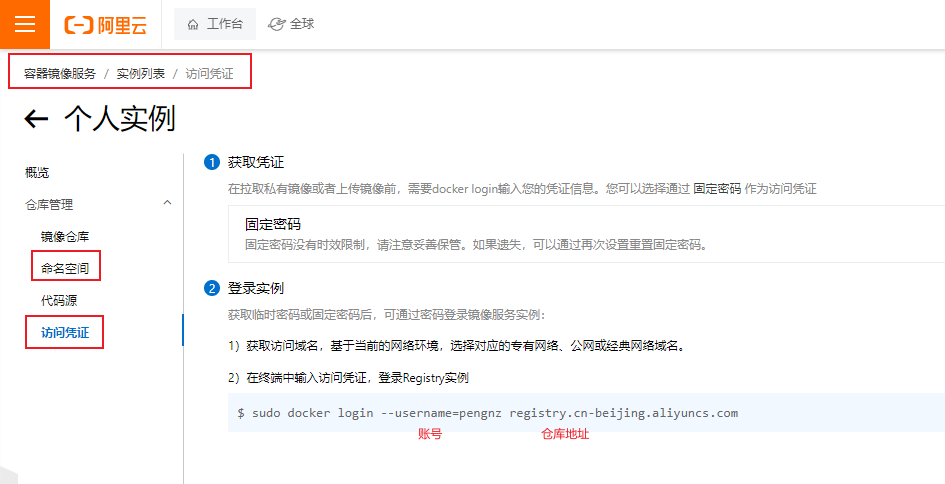
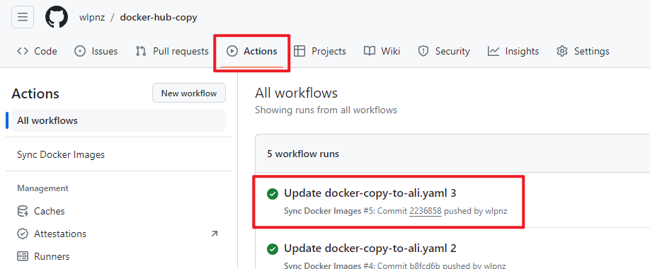

# Docker镜像To阿里云

### 阿里云

先需要准备阿里云账号，开通**容器镜像服务 ACR**

开通个人实例，在访问凭证中获取账号密码，并创建命名空间



### GitHub

创建一个仓库

创建文件夹 `.github/workflows`

在该文件夹下创建yaml文件

示例

```yaml
# .github/workflows/docker-copy-to-ali.yaml
name: Sync Docker Images

on: 
  push:
    branches:
      - main

jobs:
  sync-images:
    runs-on: ubuntu-latest
    
    steps:
      - name: Checkout repository
        uses: actions/checkout@v2

      - name: Set up Skopeo
        run: |
          sudo apt-get update
          sudo apt-get install -y skopeo

      - name: Login to Alibaba Cloud Registry
        env:
         # ALIBABA_CLOUD_REGISTRY 示例 registry.cn-beijing.aliyuncs.com
          ALIBABA_CLOUD_REGISTRY: your registry path
          USERNAME: your username
          PASSWORD: your password
        run: |
          echo $PASSWORD | docker login $ALIBABA_CLOUD_REGISTRY -u $USERNAME --password-stdin

      - name: Use Skopeo Tools to Sync Images to Alibaba Cloud
        run: |
          skopeo copy docker://docker.io/library/mysql:8.0.33 docker://registry.cn-beijing.aliyuncs.com/wulan/mysql:8.0.33
          skopeo copy docker://docker.io/canal/canal-server:v1.1.1 docker://registry.cn-beijing.aliyuncs.com/wulan/canal-server:v1.1.1
```

然后点击Actions，运行脚本




**注意**：

> skopeo copy docker://docker.io/library/mysql:8.0.33 docker://registry.cn-beijing.aliyuncs.com/wulan/mysql:8.0.33
>
> library 和 wulan为两个镜像仓库的命名空间
>
> docker官方的镜像的命名空间为**library**，非官方的镜像要注意**修改**
>
> 例如：skopeo copy docker://docker.io/**canal**/canal-server:v1.1.1 docker://registry.cn-beijing.aliyuncs.com/wulan/canal-server:v1.1.1