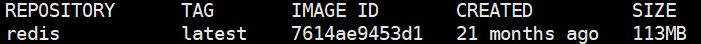
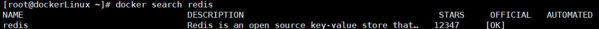
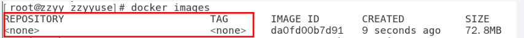
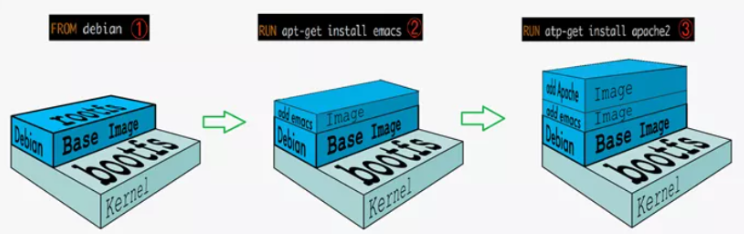
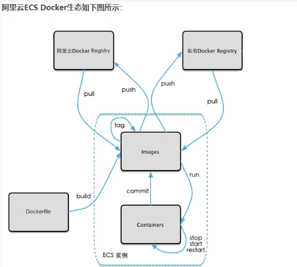
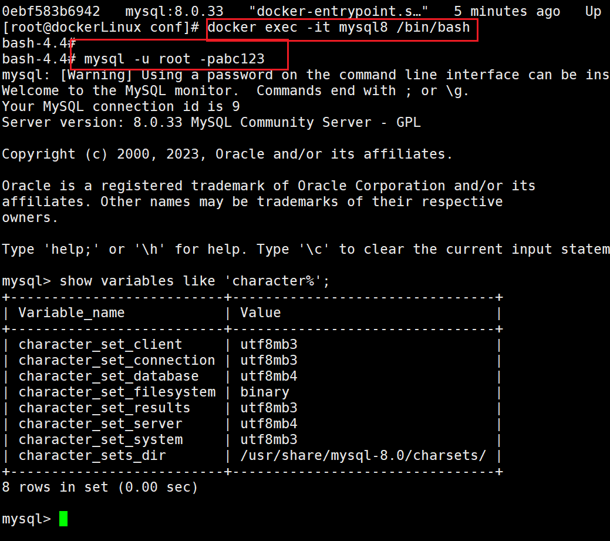

docker官网：[https://www.docker.com/](https://www.docker.com/)
docker hub：[https://hub.docker.com/](https://hub.docker.com/)
### Docker的基本组成
镜像image、容器container、仓库repository
**Docker镜像(Image)**是一个只读的模板，可以用来创建Docker容器，一个镜像可以创建很多容器。
它类似Java中的类，容器类似Java中的对象
一种轻量级、可执行的独立软件包

**Docker容器(container)**是用镜像创建出来的运行的实例。
Docker利用容器运行一个或一组应用，应用程序或服务运行在容器里面，容器就类似于一个虚拟化的运行环境。
从面向对象的角度：像Java中的类和实例对象一样，镜像是静态的定义，容器是镜像运行时的实体。容器为镜像提供一个标准的和隔离的运行环境，可以被启动、开始、停止、删除。每个容器都是相互隔离的、保证安全的平台。
从镜像容器角度：可以把容器看做是一个简易版的 Linux 环境（包括root用户权限、进程空间、用户空间和网络空间等）和运行在其中的应用程序。

**仓库(repository)**是集中存放镜像文件的场所
类似Maven仓库，存放各种jar包的地方
Docker公司提供的官方registry被称为Docker Hub，存放各种镜像模板
仓库分为公开仓库（Public）和私有仓库（Private）两种形式

总结：image文件看作是容器的模板，这些image文件模板都会存放在仓库，Docker根据image文件模板创建容器实例。一个image文件模板可以创建多个同时运行容的器实例。


### Docker常用命令
#### 帮助启动类命令
启动docker：systemctl start docker
停止docker：systemctl stop docker
重启docker：systemctl restart docker
查看docker状态：systemctl status docker
开机启动：systemctl enable docker
查看docker概要信息：docker info
查看docker总体帮助文档：docker --help
查看docker命令帮助文档：docker 具体命令 --help

#### 镜像命令
docker images [OPTIONS] "列出本地主机上的镜像"

REPOSITORY: 表示镜像的仓库源
TAG: 镜像的标签版本号
IMAGE ID: 镜像id
CREATED: 镜像创建时间
SIZE: 镜像大小
options：
-a 列出本地所有镜像
-q 只展示IMAGE ID
同一仓库源可以有多个TAG版本，代表这不同版本，通过REPOSITORY:TAG来定义不同的镜像。
如果不指定TAG，系统默认使用最新的镜像，例如：redis:latest镜像

docker search  某个镜像的名字   “搜索镜像”

NAME：镜像名称
DESCRIPTION：描述
STARS：点赞数
OFFICIAL：是否为官方
AUTOMATED：是否是自动构建的

options：
--limit N：只列出N个镜像

docker pull 某个镜像的名字 “下载镜像”
docker pull 镜像名称[:TAG]
没有TAG默认最新版
docker pull redis =》 docker pull redis:latest

docker system df "查看镜像/容器/数据卷所占空间"

docker rmi 镜像id  “删除镜像”
删除单个 docker rmi -f 镜像id
删除多个 docker rmi -f 镜像名1:TAG 镜像名2::TAG
删除全部 docker rmi -f $(docker images -qa)

docker的虚悬镜像：仓库名、标签都是`<none>`的镜像,俗称虚悬镜像dangling image


#### 容器命令
docker run [options] images [command][arg...] “新建+启动容器”
docker run -it ubuntu /bin/bash
options：
--name="容器新名字" 指定名称
-d：后台运行容器并返回容器id，即启动守护式容器（后台运行）
-i：以交互模式运行容器，通常与-t同时使用
-t：为容器重新分配一个伪输入终端，通常与-i同时使用，即启动交互式容器

-P：随机端口映射，大写P
-p：指定端口映射，小写p
-p hostPort:containerPort ==》端口映射 -p 80:80

docker ps [options] 列出当前所有正在运行的容器
options:
-a :列出当前所有正在运行的容器+历史上运行过的
-l :显示最近创建的容器。
-n：显示最近n个创建的容器。
-q :静默模式，只显示容器编号。

退出容器
两种退出方式
- exit run进去容器，exit退出，容器停止
- ctrl+p+q  run进去容器，ctrl+p+q退出，容器不停止

docker start 容器id或容器名称 "启动已停止运行的容器"

docker restart 容器id或容器名称 “重启容器”

docker stop 容器id或容器名称 “停止容器”

docker kill 容器id或容器名称 “强制停止容器”

docker rm 容器id “删除已停止的容器”
一次性删除多个容器实例
①docker rm -f $(docker ps -a -q) 
②docker ps -a -q | xargs docker rm

#### 启动守护式容器（后台服务器）
docker run -d 容器名
redis启动演示
前台交互式启动 docker run -it redis:latest
后台守护式启动 docker run -d redis:latest

查看容器日志	docker logs 容器id
查看容器内运行的进程	docker top 容器id
查看容器内部细节	docker inspect 容器id

#### 进入正在运行的容器并以命令进行交互
docker exec -it 容器id bashShell
重新进入docker attach 容器id
区别：
attach直接进入容器启动命令的终端，不会启动新的进程 
用exit退出，会导致容器的停止
exec是在容器中打开新的终端，并且可以启动新的进程
用exit退出，不会导致容器的停止
使用redis容器实例测试：
docker exec -it 容器ID /bin/bash
docker exec -it 容器ID redis-cli
**一般用-d后台启动的程序，再用exec进入对应容器实例**

从容器内拷贝文件到主机上
容器 -> 主机
docker cp 容器id:容器内路径 目的主机路径

导入和导出容器
export 导出容器的内容留作一个tar归档文件[对应 import 命令]
import 从tar包中的内容创建一个新的文件系统再导入为镜像[对应export]
示例：
docker export 容器id > 文件名.tar
cat 文件名.tar | docker import - 镜像用户/镜像名:镜像版本号
### Docker镜像详解
#### UnionFS(联合文件系统)
UnionFS（联合文件系统）：Union文件系统（UnionFS）是一种分层、轻量级并且高性能的文件系统，它支持对文件系统的修改作为一次提交来一层层的叠加，同时可以将不同目录挂载到同一个虚拟文件系统下(unite several directories into a single virtual filesystem)。
Union 文件系统是 Docker 镜像的基础。镜像可以通过分层来进行继承，基于基础镜像（没有父镜像），可以制作各种具体的应用镜像。

#### Docker镜像加载原理
 docker的镜像实际上由一层一层的文件系统组成，这种层级的文件系统UnionFS。
docker镜像分层的最大好处就是共享资源，方便复制迁移，为了复用。
比如，多个镜像从相同的base镜像构建而来，那么Docker Host只需要在磁盘上保存一份base镜像
同时内存中也只需加载一份base镜像，就可以为所有容器服务了。而且镜像的每一层都可以被共享。

当容器启动时，一个新的可写层被加载到镜像的顶部。
这一层通常被称作“容器层”，“容器层”之下的都叫“镜像层”。所有对容器的改动 - 无论添加、删除、还是修改文件都只会发生在容器层中。只有容器层是可写的，容器层下面的所有镜像层都是只读的。

Docker中的镜像分层，支持通过扩展现有镜像，创建新的镜像。类似Java继承于一个Base基础类，自己再按需扩展。
新镜像是从 base 镜像一层一层叠加生成的。每安装一个软件，就在现有镜像的基础上增加一层


#### Docker镜像commit操作案例
docker commit提交容器副本使之成为一个新镜像
docker commit -m="描述信息" -a="作者" 容器ID 要创建的目标镜像名:[标签名]
docker commit -m="add vim command" -a="pnz" 46afb6beff40 wulan/ubuntu:2.0

#### 本地镜像发布到阿里云
本地镜像发布到阿里云流程

**镜像的生成方法**
方法一：
基于当前容器创建一个新镜像
docker commit [OPTIONS] 容器ID [REPOSITORY[:TAG]]
方法二：
基于DockerFile

**将本地镜像推送到阿里云**
创建仓库镜像 ==> 最终获取管理界面脚本

通过管理界面脚本获取命令，通过命令上传镜像
类似git操作
示例(示例代码中的“[]”在实际中不需要)：

```
docker login --username=pengnz registry.cn-beijing.aliyuncs.com
docker tag [ImageId] registry.cn-beijing.aliyuncs.com/wulan/myubuntu:[镜像版本号]
docker push registry.cn-beijing.aliyuncs.com/wulan/myubuntu:[镜像版本号]
```

**将阿里云上的镜像下载到本地**
通过命令下载到本地

```
docker pull registry.cn-beijing.aliyuncs.com/wulan/myubuntu:[镜像版本号]
```

本地镜像发布到私有库
[发布到私有库视频](https://www.bilibili.com/video/BV1gr4y1U7CY/?p=28&spm_id_from=pageDriver&vd_source=b65df187291916e801dd2d3d831fb71e)

### Docker容器数据库卷
**将docker容器内的数据保存到宿主机的磁盘中**

#### 运行一个带有容器卷存储功能的容器实例
```
docker run -it --privileged=true -v /宿主机绝对路径目录:/容器内目录 镜像名|镜像id
docker run -it --privileged=true -v /opt/ubuntumap:/opt/dockerubuntu ba6acccedd29 /bin/bash
--privileged=true 记得加入
```

可以使用**docker inspect 容器id** 查看数据卷是否挂载成功

#### --privileged=true为什么要加
Docker挂载主机目录访问如果出现cannot open directory .: Permission denied
解决办法：在挂载目录后多加一个--privileged=true参数即可
如果是CentOS7安全模块会比之前系统版本加强，不安全的会先禁止，所以目录挂载的情况被默认为不安全的行为，
在SELinux里面挂载目录被禁止掉了额，如果要开启，我们一般使用--privileged=true命令，扩大容器的权限解决挂载目录没有权限的问题，也即
使用该参数，container内的root拥有真正的root权限，否则，container内的root只是外部的一个普通用户权限。

#### 读写规则
情况一：读写(默认) docker run -it --privileged=true  -v /宿主机绝对路径目录:/容器内目录:rw 镜像名|镜像id
情况二：只读 docker run -it --privileged=true  -v /宿主机绝对路径目录:/容器内目录:r 镜像名|镜像id
情况一是 宿主机和容器都可以读写
情况二是 宿主机可以读写，容器内部只能读

#### 数据卷的继承和共享
docker run -it --privileged=true  --volumes-from 父类(容器id|容器名)  镜像名|镜像id 
示例：
docker run -it --name u1 --privileged=true -v /opt/ubuntumap:/opt/dockerubuntu ubuntu /bin/bash
docker run -it --name u2 --privileged=true --volumes-from u1 ubuntu /bin/bash

### Docker常规安装简介
#### docker下安装mysql
①下载mysql镜像  docker pull mysql:8.0.33
②启动容器实例
```
docker run -d -p 3306:3306 --privileged=true \
-v /opt/app/mysql/log:/var/log/mysql \
-v /opt/app/mysql/data:/var/lib/mysql \
-v /opt/app/mysql/conf:/etc/mysql/conf.d \
--restart=always \
-e MYSQL_ROOT_PASSWORD=abc123 --name mysql8 mysql:8.0.33 --lower-case-table-names=1

# 如果要设置表名小写，需要在 mysql:8.0.33 添加 --lower-case-table-names=1
```
③在/opt/app/mysql/conf 下创建my.cnf 并写入
```
[client]
default_character_set=utf8
[mysqld]
character_set_server=utf8
lower_case_table_names=1 # 设置表名小写
```
④进入容器实例测试

注意：**当容器不小心删掉，只要容器卷的数据文件夹没有被删除，重新运行一个容器，数据仍然存在。**

#### docker下安装redis
①拉去镜像  docker pull redis:latest
②在宿主机上新建目录  /opt/app/redis
③将一份redis.conf文件模板拷贝进/opt/app/redis目录下
④修改redis.conf文件
- 开启验证 requirepass abc123
- 允许redis外地连接 将 bind 127.0.0.1 注释
- 设置redis后台启动 将daemonize设置为no
在启动容器的时候会使用参数 -d 会与 daemonize yes 冲突
- 取消保护模式 将protected-mode设置为no
⑤使用redis:latest镜像创建容器 
```
docker run -p 6379:6379 --name=myredis --privileged=true \
-v /opt/app/redis/redis.conf:/etc/redis/redis.conf \
-v /opt/app/redis/data:/data \
-d redis:latest redis-server /etc/redis/redis.conf
```
⑥使用redis-cli测试  docker exec -it myredis redis-cli

值得注意的是：当关闭宿主机防火墙时，使用docker run -p映射端口会出现失败的情况 错误提示的关键字有iptables
#### docker下安装nacos
**mysql中创建nacos_config数据库**
```java
/*
 * github地址：https://github.com/alibaba/nacos/blob/master/config/src/main/resources/META-INF/nacos-db.sql
 * Copyright 1999-2018 Alibaba Group Holding Ltd.
 *
 * Licensed under the Apache License, Version 2.0 (the "License");
 * you may not use this file except in compliance with the License.
 * You may obtain a copy of the License at
 *
 *      http://www.apache.org/licenses/LICENSE-2.0
 *
 * Unless required by applicable law or agreed to in writing, software
 * distributed under the License is distributed on an "AS IS" BASIS,
 * WITHOUT WARRANTIES OR CONDITIONS OF ANY KIND, either express or implied.
 * See the License for the specific language governing permissions and
 * limitations under the License.
 */

/******************************************/
/*   数据库全名 = nacos_config   */
/*   表名称 = config_info   */
/******************************************/
CREATE TABLE `config_info` (
  `id` bigint(20) NOT NULL AUTO_INCREMENT COMMENT 'id',
  `data_id` varchar(255) NOT NULL COMMENT 'data_id',
  `group_id` varchar(128) DEFAULT NULL,
  `content` longtext NOT NULL COMMENT 'content',
  `md5` varchar(32) DEFAULT NULL COMMENT 'md5',
  `gmt_create` datetime NOT NULL DEFAULT '2010-05-05 00:00:00' COMMENT '创建时间',
  `gmt_modified` datetime NOT NULL DEFAULT '2010-05-05 00:00:00' COMMENT '修改时间',
  `src_user` text COMMENT 'source user',
  `src_ip` varchar(20) DEFAULT NULL COMMENT 'source ip',
  `app_name` varchar(128) DEFAULT NULL,
  `tenant_id` varchar(128) DEFAULT '' COMMENT '租户字段',
  `c_desc` varchar(256) DEFAULT NULL,
  `c_use` varchar(64) DEFAULT NULL,
  `effect` varchar(64) DEFAULT NULL,
  `type` varchar(64) DEFAULT NULL,
  `c_schema` text,
  `encrypted_data_key` text NULL COMMENT '秘钥',
  PRIMARY KEY (`id`),
  UNIQUE KEY `uk_configinfo_datagrouptenant` (`data_id`,`group_id`,`tenant_id`)
) ENGINE=InnoDB DEFAULT CHARSET=utf8 COLLATE=utf8_bin COMMENT='config_info';

/******************************************/
/*   数据库全名 = nacos_config   */
/*   表名称 = config_info_aggr   */
/******************************************/
CREATE TABLE `config_info_aggr` (
  `id` bigint(20) NOT NULL AUTO_INCREMENT COMMENT 'id',
  `data_id` varchar(255) NOT NULL COMMENT 'data_id',
  `group_id` varchar(128) NOT NULL COMMENT 'group_id',
  `datum_id` varchar(255) NOT NULL COMMENT 'datum_id',
  `content` longtext NOT NULL COMMENT '内容',
  `gmt_modified` datetime NOT NULL COMMENT '修改时间',
  `app_name` varchar(128) DEFAULT NULL,
  `tenant_id` varchar(128) DEFAULT '' COMMENT '租户字段',
  PRIMARY KEY (`id`),
  UNIQUE KEY `uk_configinfoaggr_datagrouptenantdatum` (`data_id`,`group_id`,`tenant_id`,`datum_id`)
) ENGINE=InnoDB DEFAULT CHARSET=utf8 COLLATE=utf8_bin COMMENT='增加租户字段';


/******************************************/
/*   数据库全名 = nacos_config   */
/*   表名称 = config_info_beta   */
/******************************************/
CREATE TABLE `config_info_beta` (
  `id` bigint(20) NOT NULL AUTO_INCREMENT COMMENT 'id',
  `data_id` varchar(255) NOT NULL COMMENT 'data_id',
  `group_id` varchar(128) NOT NULL COMMENT 'group_id',
  `app_name` varchar(128) DEFAULT NULL COMMENT 'app_name',
  `content` longtext NOT NULL COMMENT 'content',
  `beta_ips` varchar(1024) DEFAULT NULL COMMENT 'betaIps',
  `md5` varchar(32) DEFAULT NULL COMMENT 'md5',
  `gmt_create` datetime NOT NULL DEFAULT '2010-05-05 00:00:00' COMMENT '创建时间',
  `gmt_modified` datetime NOT NULL DEFAULT '2010-05-05 00:00:00' COMMENT '修改时间',
  `src_user` text COMMENT 'source user',
  `src_ip` varchar(20) DEFAULT NULL COMMENT 'source ip',
  `tenant_id` varchar(128) DEFAULT '' COMMENT '租户字段',
  `encrypted_data_key` text NOT NULL COMMENT '秘钥',
  PRIMARY KEY (`id`),
  UNIQUE KEY `uk_configinfobeta_datagrouptenant` (`data_id`,`group_id`,`tenant_id`)
) ENGINE=InnoDB DEFAULT CHARSET=utf8 COLLATE=utf8_bin COMMENT='config_info_beta';

/******************************************/
/*   数据库全名 = nacos_config   */
/*   表名称 = config_info_tag   */
/******************************************/
CREATE TABLE `config_info_tag` (
  `id` bigint(20) NOT NULL AUTO_INCREMENT COMMENT 'id',
  `data_id` varchar(255) NOT NULL COMMENT 'data_id',
  `group_id` varchar(128) NOT NULL COMMENT 'group_id',
  `tenant_id` varchar(128) DEFAULT '' COMMENT 'tenant_id',
  `tag_id` varchar(128) NOT NULL COMMENT 'tag_id',
  `app_name` varchar(128) DEFAULT NULL COMMENT 'app_name',
  `content` longtext NOT NULL COMMENT 'content',
  `md5` varchar(32) DEFAULT NULL COMMENT 'md5',
  `gmt_create` datetime NOT NULL DEFAULT '2010-05-05 00:00:00' COMMENT '创建时间',
  `gmt_modified` datetime NOT NULL DEFAULT '2010-05-05 00:00:00' COMMENT '修改时间',
  `src_user` text COMMENT 'source user',
  `src_ip` varchar(20) DEFAULT NULL COMMENT 'source ip',
  PRIMARY KEY (`id`),
  UNIQUE KEY `uk_configinfotag_datagrouptenanttag` (`data_id`,`group_id`,`tenant_id`,`tag_id`)
) ENGINE=InnoDB DEFAULT CHARSET=utf8 COLLATE=utf8_bin COMMENT='config_info_tag';

/******************************************/
/*   数据库全名 = nacos_config   */
/*   表名称 = config_tags_relation   */
/******************************************/
CREATE TABLE `config_tags_relation` (
  `id` bigint(20) NOT NULL COMMENT 'id',
  `tag_name` varchar(128) NOT NULL COMMENT 'tag_name',
  `tag_type` varchar(64) DEFAULT NULL COMMENT 'tag_type',
  `data_id` varchar(255) NOT NULL COMMENT 'data_id',
  `group_id` varchar(128) NOT NULL COMMENT 'group_id',
  `tenant_id` varchar(128) DEFAULT '' COMMENT 'tenant_id',
  `nid` bigint(20) NOT NULL AUTO_INCREMENT,
  PRIMARY KEY (`nid`),
  UNIQUE KEY `uk_configtagrelation_configidtag` (`id`,`tag_name`,`tag_type`),
  KEY `idx_tenant_id` (`tenant_id`)
) ENGINE=InnoDB DEFAULT CHARSET=utf8 COLLATE=utf8_bin COMMENT='config_tag_relation';

/******************************************/
/*   数据库全名 = nacos_config   */
/*   表名称 = group_capacity   */
/******************************************/
CREATE TABLE `group_capacity` (
  `id` bigint(20) unsigned NOT NULL AUTO_INCREMENT COMMENT '主键ID',
  `group_id` varchar(128) NOT NULL DEFAULT '' COMMENT 'Group ID，空字符表示整个集群',
  `quota` int(10) unsigned NOT NULL DEFAULT '0' COMMENT '配额，0表示使用默认值',
  `usage` int(10) unsigned NOT NULL DEFAULT '0' COMMENT '使用量',
  `max_size` int(10) unsigned NOT NULL DEFAULT '0' COMMENT '单个配置大小上限，单位为字节，0表示使用默认值',
  `max_aggr_count` int(10) unsigned NOT NULL DEFAULT '0' COMMENT '聚合子配置最大个数，，0表示使用默认值',
  `max_aggr_size` int(10) unsigned NOT NULL DEFAULT '0' COMMENT '单个聚合数据的子配置大小上限，单位为字节，0表示使用默认值',
  `max_history_count` int(10) unsigned NOT NULL DEFAULT '0' COMMENT '最大变更历史数量',
  `gmt_create` datetime NOT NULL DEFAULT '2010-05-05 00:00:00' COMMENT '创建时间',
  `gmt_modified` datetime NOT NULL DEFAULT '2010-05-05 00:00:00' COMMENT '修改时间',
  PRIMARY KEY (`id`),
  UNIQUE KEY `uk_group_id` (`group_id`)
) ENGINE=InnoDB DEFAULT CHARSET=utf8 COLLATE=utf8_bin COMMENT='集群、各Group容量信息表';

/******************************************/
/*   数据库全名 = nacos_config   */
/*   表名称 = his_config_info   */
/******************************************/
CREATE TABLE `his_config_info` (
  `id` bigint(64) unsigned NOT NULL,
  `nid` bigint(20) unsigned NOT NULL AUTO_INCREMENT,
  `data_id` varchar(255) NOT NULL,
  `group_id` varchar(128) NOT NULL,
  `app_name` varchar(128) DEFAULT NULL COMMENT 'app_name',
  `content` longtext NOT NULL,
  `md5` varchar(32) DEFAULT NULL,
  `gmt_create` datetime NOT NULL DEFAULT '2010-05-05 00:00:00',
  `gmt_modified` datetime NOT NULL DEFAULT '2010-05-05 00:00:00',
  `src_user` text,
  `src_ip` varchar(20) DEFAULT NULL,
  `op_type` char(10) DEFAULT NULL,
  `tenant_id` varchar(128) DEFAULT '' COMMENT '租户字段',
  `encrypted_data_key` text NULL COMMENT '秘钥',
  PRIMARY KEY (`nid`),
  KEY `idx_gmt_create` (`gmt_create`),
  KEY `idx_gmt_modified` (`gmt_modified`),
  KEY `idx_did` (`data_id`)
) ENGINE=InnoDB DEFAULT CHARSET=utf8 COLLATE=utf8_bin COMMENT='多租户改造';


/******************************************/
/*   数据库全名 = nacos_config   */
/*   表名称 = tenant_capacity   */
/******************************************/
CREATE TABLE `tenant_capacity` (
  `id` bigint(20) unsigned NOT NULL AUTO_INCREMENT COMMENT '主键ID',
  `tenant_id` varchar(128) NOT NULL DEFAULT '' COMMENT 'Tenant ID',
  `quota` int(10) unsigned NOT NULL DEFAULT '0' COMMENT '配额，0表示使用默认值',
  `usage` int(10) unsigned NOT NULL DEFAULT '0' COMMENT '使用量',
  `max_size` int(10) unsigned NOT NULL DEFAULT '0' COMMENT '单个配置大小上限，单位为字节，0表示使用默认值',
  `max_aggr_count` int(10) unsigned NOT NULL DEFAULT '0' COMMENT '聚合子配置最大个数',
  `max_aggr_size` int(10) unsigned NOT NULL DEFAULT '0' COMMENT '单个聚合数据的子配置大小上限，单位为字节，0表示使用默认值',
  `max_history_count` int(10) unsigned NOT NULL DEFAULT '0' COMMENT '最大变更历史数量',
  `gmt_create` datetime NOT NULL DEFAULT '2010-05-05 00:00:00' COMMENT '创建时间',
  `gmt_modified` datetime NOT NULL DEFAULT '2010-05-05 00:00:00' COMMENT '修改时间',
  PRIMARY KEY (`id`),
  UNIQUE KEY `uk_tenant_id` (`tenant_id`)
) ENGINE=InnoDB DEFAULT CHARSET=utf8 COLLATE=utf8_bin COMMENT='租户容量信息表';


CREATE TABLE `tenant_info` (
  `id` bigint(20) NOT NULL AUTO_INCREMENT COMMENT 'id',
  `kp` varchar(128) NOT NULL COMMENT 'kp',
  `tenant_id` varchar(128) default '' COMMENT 'tenant_id',
  `tenant_name` varchar(128) default '' COMMENT 'tenant_name',
  `tenant_desc` varchar(256) DEFAULT NULL COMMENT 'tenant_desc',
  `create_source` varchar(32) DEFAULT NULL COMMENT 'create_source',
  `gmt_create` bigint(20) NOT NULL COMMENT '创建时间',
  `gmt_modified` bigint(20) NOT NULL COMMENT '修改时间',
  PRIMARY KEY (`id`),
  UNIQUE KEY `uk_tenant_info_kptenantid` (`kp`,`tenant_id`),
  KEY `idx_tenant_id` (`tenant_id`)
) ENGINE=InnoDB DEFAULT CHARSET=utf8 COLLATE=utf8_bin COMMENT='tenant_info';

CREATE TABLE users (
	username varchar(50) NOT NULL PRIMARY KEY,
	password varchar(500) NOT NULL,
	enabled boolean NOT NULL
);

CREATE TABLE roles (
	username varchar(50) NOT NULL,
	role varchar(50) NOT NULL,
	constraint uk_username_role UNIQUE (username,role)
);

CREATE TABLE permissions (
    role varchar(50) NOT NULL,
    resource varchar(512) NOT NULL,
    action varchar(8) NOT NULL,
    constraint uk_role_permission UNIQUE (role,resource,action)
);

INSERT INTO users (username, password, enabled) VALUES ('nacos', '$2a$10$EuWPZHzz32dJN7jexM34MOeYirDdFAZm2kuWj7VEOJhhZkDrxfvUu', TRUE);

INSERT INTO roles (username, role) VALUES ('nacos', 'ROLE_ADMIN');
```
**获取nacos的配置文件**
# 任意启动一容器，将容器内的配置文件复制到宿主机
docker run -p 8848:8848 --name nacos -d nacos/nacos-server:1.4.1
mkdir -p /develop_env/nacos/logs/                      #新建logs目录
mkdir -p /develop_env/nacos/conf/			#新建conf目录
docker run -p 8848:8848 --name nacos -d nacos/nacos-server
docker cp nacos:/home/nacos/logs/ /develop_env/nacos/
docker cp nacos:/home/nacos/conf/ /develop_env/nacos/
docker rm -f nacos #删除容器
**修改application.properties(/develop_env/nacos/conf)**
```java
# spring
server.servlet.contextPath=/nacos
server.contextPath=/nacos
server.port=8848
spring.datasource.platform=mysql
nacos.cmdb.dumpTaskInterval=3600
nacos.cmdb.eventTaskInterval=10
nacos.cmdb.labelTaskInterval=300
nacos.cmdb.loadDataAtStart=false
db.num=1
db.url.0=jdbc:mysql://192.168.10.190:3308/nacos_config?characterEncoding=utf8&connectTimeout=1000&socketTimeout=3000&autoReconnect=true
db.user=root
db.password=abc123
### The auth system to use, currently only 'nacos' is supported:
nacos.core.auth.system.type=nacos


### The token expiration in seconds:
nacos.core.auth.default.token.expire.seconds=18000

### The default token:
nacos.core.auth.default.token.secret.key=SecretKey012345678901234567890123456789012345678901234567890123456789

### Turn on/off caching of auth information. By turning on this switch, the update of auth information would have a 15 seconds delay.
nacos.core.auth.caching.enabled=false
nacos.core.auth.enable.userAgentAuthWhite=false
nacos.core.auth.server.identity.key=serverIdentity
nacos.core.auth.server.identity.value=security
server.tomcat.accesslog.enabled=false
server.tomcat.accesslog.pattern=%h %l %u %t "%r" %s %b %D
# default current work dir
server.tomcat.basedir=
## spring security config
### turn off security
nacos.security.ignore.urls=/,/error,/**/*.css,/**/*.js,/**/*.html,/**/*.map,/**/*.svg,/**/*.png,/**/*.ico,/console-fe/public/**,/v1/auth/**,/v1/console/health/**,/actuator/**,/v1/console/server/**
# metrics for elastic search
management.metrics.export.elastic.enabled=false
management.metrics.export.influx.enabled=false

nacos.naming.distro.taskDispatchThreadCount=10
nacos.naming.distro.taskDispatchPeriod=200
nacos.naming.distro.batchSyncKeyCount=1000
nacos.naming.distro.initDataRatio=0.9
nacos.naming.distro.syncRetryDelay=5000
nacos.naming.data.warmup=true
```
**启动容器实例**
```java
docker run -d \
-e MODE=standalone \
-p 8848:8848 \
-v /develop_env/nacos/conf:/home/nacos/conf \
-v /develop_env/nacos/logs:/home/nacos/logs \
-v /develop_env/nacos/data:/home/nacos/data \
--name nacos \
--restart=always \
nacos/nacos-server:1.4.1
```
**访问：192.168.10.190:8848/nacos**

