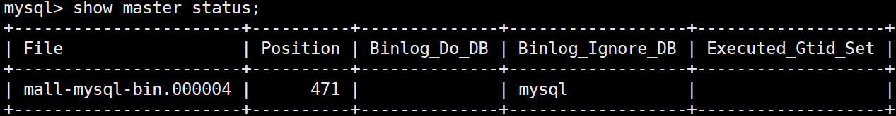
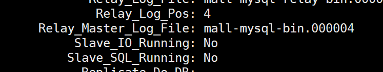
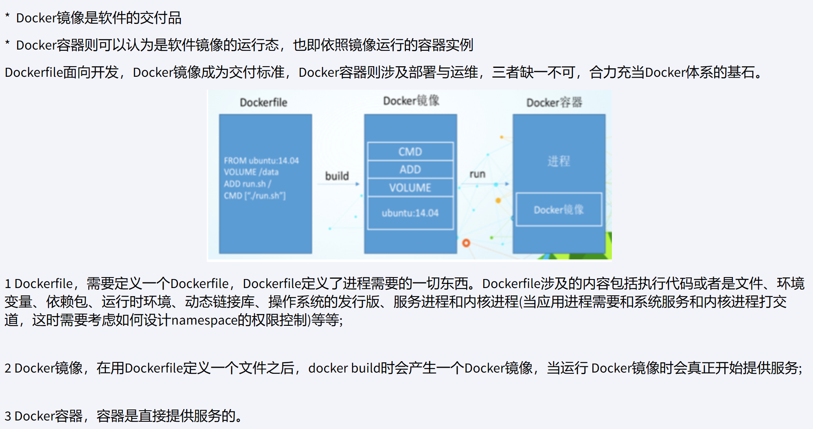
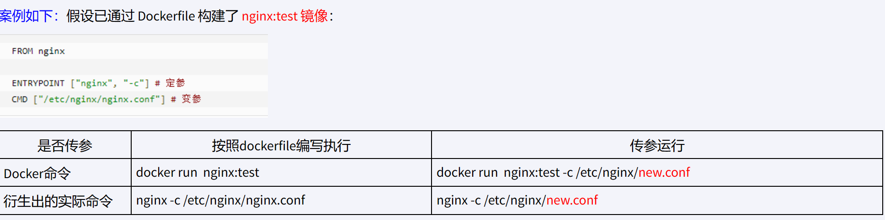
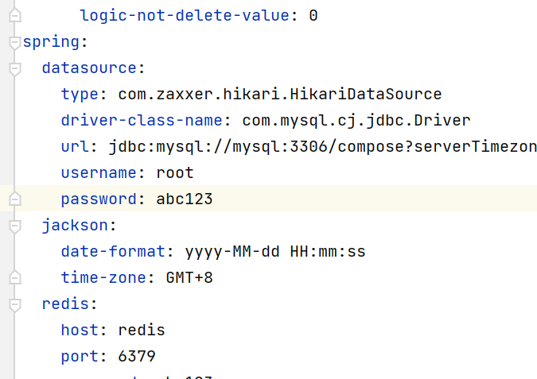

### Docker复杂安装详说
#### MySQL主从
**新建主服务器容器实例3307**
```java
docker run -d -p 3307:3306 --name mysql-master --privileged=true \
-v /mydata/mysql-master/log:/var/log/mysql \
-v /mydata/mysql-master/data:/var/lib/mysql \
-v /mydata/mysql-master/conf:/etc/mysql/conf.d \
-e MYSQL_ROOT_PASSWORD=abc123  mysql:8.0.33
```
**在/mysql-master/conf目录下新建my.cnf**
```java
[mysqld]
## 设置server_id，同一局域网中需要唯一
server_id=101
## 指定不需要同步的数据库名称
binlog-ignore-db=mysql  
## 开启二进制日志功能
log-bin=mall-mysql-bin  
## 设置二进制日志使用内存大小（事务）
binlog_cache_size=1M
## 设置使用的二进制日志格式（mixed,statement,row）
binlog_format=mixed  
## 二进制日志过期清理时间。默认值为0，表示不自动清理。
expire_logs_days=7  
## 跳过主从复制中遇到的所有错误或指定类型的错误，避免slave端复制中断。
## 如：1062错误是指一些主键重复，1032错误是因为主从数据库数据不一致
slave_skip_errors=1062
```
添加my.cnf后重启容器
**进入mysql-master容器实例**
`docker exec -it mysql-master /bin/bash`
`mysql -uroot -pabc123`
**在master容器实例中的mysql中创建同步用户**
`create user 'slave'@'%' identified by 'abc123'`
`grant replication slave,replication client on _._to 'slave'@'%';`
**新建从服务器容器实例3308**
```java
docker run -d -p 3308:3306 --name mysql-slave --privileged=true \
-v /mydata/mysql-slave/log:/var/log/mysql \
-v /mydata/mysql-slave/data:/var/lib/mysql \
-v /mydata/mysql-slave/conf:/etc/mysql/conf.d \
-e MYSQL_ROOT_PASSWORD=abc123  mysql:8.0.33
```
**在/mydata/mysqll-slave/conf目录下新建my.cnf**
```java
[mysqld]
## 设置server_id，同一局域网中需要唯一
server_id=102
## 指定不需要同步的数据库名称
binlog-ignore-db=mysql  
## 开启二进制日志功能，以备Slave作为其它数据库实例的Master时使用
log-bin=mall-mysql-slave1-bin  
## 设置二进制日志使用内存大小（事务）
binlog_cache_size=1M  
## 设置使用的二进制日志格式（mixed,statement,row）
binlog_format=mixed  
## 二进制日志过期清理时间。默认值为0，表示不自动清理。
expire_logs_days=7  
## 跳过主从复制中遇到的所有错误或指定类型的错误，避免slave端复制中断。
## 如：1062错误是指一些主键重复，1032错误是因为主从数据库数据不一致
slave_skip_errors=1062  
## relay_log配置中继日志
relay_log=mall-mysql-relay-bin  
## log_slave_updates表示slave将复制事件写进自己的二进制日志
log_slave_updates=1  
## slave设置为只读（具有super权限的用户除外）
read_only=1
```
添加my.cnf后重启容器
**在主机中查看主从同步状态**
`show master status;`

**进去mysql-slave容器**
`docker exec -it mysql-slave /bin/bash`
`mysql -uroot -pabc123`
**在从数据中配置主从同步**
:::info
change master to master_host='192.168.10.190', master_user='slave', master_password='abc123', master_port=3307, master_log_file='mall-mysql-bin.000004', master_log_pos=471, master_connect_retry=30;

参数说明：
master_host：主数据库的IP地址；
master_port：主数据库的运行端口；
master_user：在主数据库创建的用于同步数据的用户账号；
master_password：在主数据库创建的用于同步数据的用户密码；
master_log_file：指定从数据库要复制数据的日志文件，通过查看主数据的状态，获取File参数；
master_log_pos：指定从数据库从哪个位置开始复制数据，通过查看主数据的状态，获取Position参数；
master_connect_retry：连接失败重试的时间间隔，单位为秒。
:::
**在从机中查看主从同步状态**
`show slave status \G;`

**在从机中开启主从同步**
`start slave;`
**再次查看同步状态**

至此，主从同步已完成。

#### Redis集群
新建6个docker容器redis实例
```java
docker run -d --name redis-node-1 --net host --privileged=true -v /mydata/redis/share/redis-node-1:/data redis:7.0.0 --cluster-enabled yes --appendonly yes --port 6381
docker run -d --name redis-node-2 --net host --privileged=true -v /mydata/redis/share/redis-node-2:/data redis:7.0.0 --cluster-enabled yes --appendonly yes --port 6382
docker run -d --name redis-node-3 --net host --privileged=true -v /mydata/redis/share/redis-node-3:/data redis:7.0.0 --cluster-enabled yes --appendonly yes --port 6383
docker run -d --name redis-node-4 --net host --privileged=true -v /mydata/redis/share/redis-node-4:/data redis:7.0.0 --cluster-enabled yes --appendonly yes --port 6384
docker run -d --name redis-node-5 --net host --privileged=true -v /mydata/redis/share/redis-node-5:/data redis:7.0.0 --cluster-enabled yes --appendonly yes --port 6385
docker run -d --name redis-node-6 --net host --privileged=true -v /mydata/redis/share/redis-node-6:/data redis:7.0.0 --cluster-enabled yes --appendonly yes --port 6386
```
进入redis-node-1并为6台容器实例构建集群关系
`docker exec -it redis-node-1 /bin/bash`
`redis-cli --cluster create --cluster-replicas 1 192.168.10.190:6381 192.168.10.190:6382 192.168.10.190:6383 192.168.10.190:6384 192.168.10.190:6385 192.168.10.190:6386`
进入6381查看集群状态
redis-cli -p 6381 -c
cluster info
cluster nodes
### DockerFile解析
#### 是什么
Dockerfile是用来构建Docker镜像的文本文件，是由一条条构建镜像所需的指令和参数构成的脚本。
构建三步骤：

- 编写Dockerfile文件
- docker build命令构建镜像
- docker run用镜像运行容器实例
#### Dockerfile构建过程解析
Dockerfile内容基础知识

- 每条保留字指令都必须为**大写字母**且后面要跟随至少一个参数
- 指令按照从上到下，顺序执行
- #表示注释
- 每条指令都会创建一个新的镜像层并对镜像进行提交

Docker执行Dockerfile的大致流程

- docker从基础镜像运行一个容器
- 执行一条指令并对容器作出修改
- 执行类似docker commit的操作提交一个新的镜像层
- docker 再基于刚提交的镜像运行一个新容器
- 执行dockerfile中的下一条指令直到所有指令都执行完成

小总结


#### 保留字
:::info
FROM：基础镜像，当前新镜像是基于哪个镜像的，第一条必须是from
MAINTAINER：镜像维护者的姓名和邮箱地址
RUN：容器构建时需要运行的命令（在docker build时运行）
两种格式：shell格式 和 exec格式
shell示例：RUN yum install -y vim*
exec示例：RUN["java","-jar","docker_boot.jar"] => java -jar docker_boot.jar
EXPOSE：当前容器对外暴露出的端口
WORKDIR：指定进入容器的工作目录
USER：指定镜像以什么样的用户去执行，如果不指定默认是root
ENV：用来在构建镜像过程中设置环境变量
ADD：将宿主机目录下的文件保内进镜像且会自动处理URL和解压tar压缩包
COPY:拷贝文件到镜像中。将从构建上下文目录中<源路径>的文件/目录复制到新的一层的镜像内的<目标路径>位置 COPY src dest 或COPY ["src","dest"]；目标路径不用事先创建，系统会自动创建。
VOLUME：容器数据卷，用于数据保存和持久化工作
CMD：指定容器启动后要干的事情
注意：Dockerfile中可以有多个CMD指令，但只有最后一个生效，CMD会被docker run之后的参数替换
ENTRYPOINT：也是一种指定容器启动时要运行的命令
类似于CMD指令，但是ENTRYPOINT不会被docker run后面的命令覆盖，而且这些命令行参数会被当前参数送给ENTRYPOINT指令指定的程序。
优点：在执行docker run时可以指定ENTRYPOINT运行所需的参数。
注意：如果Dockerfile中如果存在多个ENTRYPOINT执行，仅最后一个生效
ENTRYPOINT命令格式：ENTRYPOINT ["executeable","param1","param2"]
当指定了ENTRYPOINT后，CMD的含义变成了为ENTRYPOINT提供参数

:::
Dockerfile实例：

```
FROM centos:7
MAINTAINER wulan<wl_pnz@163.com>
 
ENV MYPATH /usr/local
WORKDIR $MYPATH
 
#安装vim编辑器
RUN yum -y install vim
#安装ifconfig命令查看网络IP
RUN yum -y install net-tools
#安装java8及lib库
RUN yum -y install glibc.i686
RUN mkdir /usr/local/java
#ADD 是相对路径jar,把jdk-8u171-linux-x64.tar.gz添加到容器中,安装包必须要和Dockerfile文件在同一位置
ADD jdk-8u171-linux-x64.tar.gz /usr/local/java/
#配置java环境变量
ENV JAVA_HOME /usr/local/java/jdk1.8.0_171
ENV JRE_HOME $JAVA_HOME/jre
ENV CLASSPATH $JAVA_HOME/lib/dt.jar:$JAVA_HOME/lib/tools.jar:$JRE_HOME/lib:$CLASSPATH
ENV PATH $JAVA_HOME/bin:$PATH
 
EXPOSE 80
 
CMD echo $MYPATH
CMD echo "success--------------ok"
CMD /bin/bash
```
编写完Dockerfile文件后，构建镜像文件
命令：`docker build -t image_name:tag .` =>`docker build -t centosjava8:1.0 .`
运行镜像：`docker run image_name:tag`
### Docker微服务实战
示例Dockerfile文件
```
# 基础镜像使用java
FROM java:8

# 作者
MAINTAINER zzyy

# VOLUME 指定临时文件目录为/tmp，在主机/var/lib/docker目录下创建了一个临时文件并链接到容器的/tmp
VOLUME /tmp

# 将jar包添加到容器中并更名为zzyy_docker.jar
ADD docker_boot-0.0.1-SNAPSHOT.jar zzyy_docker.jar

# 运行jar包
RUN bash -c 'touch /zzyy_docker.jar'
ENTRYPOINT ["java","-jar","/zzyy_docker.jar"]

#暴露6001端口作为微服务
EXPOSE 6001
```
构建镜像：docker build -t docker_boot:1.0 .
启动容器：docker run -d -p 6001:6001 docker_boot:1.0

### Docker网络
docker安装后，会产生一个docker0的虚拟网桥
#### 常用命令
docker network connect 连接一个容器到网络
docker network disconnect 断开一个容器与网络的连接
docker network create 网络名字 创建一个网络
docker network ls 查看网络
docker network inspect xxx网络名字 查看网络源数据
docker network rm xxx网络名字 删除网络

#### 能干嘛
容器减的互联和通信以及端口映射
容器IP变动时可以通过服务名直接网络通信而不受到影响
#### 网络模式
**bridge模式**：使用--network bridge指定，默认使用docker0
为每一个容器分配、设置IP等，并将容器连接到docker0虚拟网桥，默认为该模式
**host模式**：使用--network host指定
容器将不会虚拟出自己的网卡，配置自己的IP等，而是使用宿主机的IP和端口
**none模式**：使用--network none指定
容器有独立的Network namespace，但并没有对其进行任何网络设置，如分配veth pair和网桥连接，IP等
**container模式**：使用--network container:Name或者容器ID指定
新创建的容器不会创建自己的网卡和配置自己的IP，而是和一个指定的容器共享IP、端口范围等。
注意：docker容器内部的ip是有可能发生变化的

#### 自定义网络
解决docker容器内部ip可能发生变化的问题
自定义网络默认使用的是桥接网络bridge
创建命令：docker network create wl_pnz
启动容器指定网络为自定义网络
docker run -it --network wl_pnz --name u1 ubuntu:latest /bin/bash
docker run -it --network wl_pnz --name u2 ubuntu:latest /bin/bash
相互ping测试 ip/服务名
### Docker-compose容器编排
#### 是什么
Compose 是 Docker 公司推出的一个工具软件，可以管理多个 Docker 容器组成一个应用。你需要定义一个 YAML 格式的配置文件**docker-compose.yml**，写好多个容器之间的调用关系。然后，只要一个命令，就能同时启动/关闭这些容器
#### 安装
[compose下载](https://docs.docker.com/compose/install/linux/)
下载命令：
:::info
下载插件
DOCKER_CONFIG=${DOCKER_CONFIG:-$HOME/.docker}
mkdir -p $DOCKER_CONFIG/cli-plugins
curl -SL [https://github.com/docker/compose/releases/download/v2.20.3/docker-compose-linux-x86_64](https://github.com/docker/compose/releases/download/v2.20.3/docker-compose-linux-x86_64) -o $DOCKER_CONFIG/cli-plugins/docker-compose
添加权限
chmod +x $DOCKER_CONFIG/cli-plugins/docker-compose
查看是否安装成功
docker compose version

:::
#### 核心概念
一文件：docker-compose.yml
两要素：服务(service)和工程(project)
服务：一个个应用容器实例
工程：由一组关联的应用容器组成的一个完整的业务单元，在docker-compose.yml文件中定义。
#### 使用的三个步骤
编写Dockerfile定义各个微服务应用并构建出对应的镜像
使用docker-compose.yml定义个完整业务单元，安排好整体应用中的各个容器服务。
执行docker compose up命令，启动并运行整个应用程序，完成一键部署上线。

#### compose常用命令
:::info
docker compose -h                           # 查看帮助
docker compose up                           # 启动所有docker-compose服务
docker compose up -d                        # 启动所有docker-compose服务并后台运行
docker compose down                         # 停止并删除容器、网络、卷、镜像。
docker compose exec  yml里面的服务id                 # 进入容器实例内部  docker-compose exec docker compose.yml文件中写的服务id /bin/bash
docker compose ps                      # 展示当前docker-compose编排过的运行的所有容器
docker compose top                     # 展示当前docker-compose编排过的容器进程
docker compose logs  yml里面的服务id     # 查看容器输出日志
docker compose config     # 检查配置
docker compose config -q  # 检查配置，有问题才有输出
docker compose restart   # 重启服务
docker compose start     # 启动服务
docker compose stop      # 停止服务
:::

#### 使用compose编排微服务
**准备应用程序所需镜像**
使用Dockerfile构建jar的镜像
jar包配置项所需ip的位置可以使用服务名

配置运行jar所需镜像的配置
**编写docker-compose.yml文件**

```
version: "3"
services:
  microService:
    image: docker_boot:1.2
    container_name: ms01
    ports:

      - "8899:8899"
        volumes:
            - /app/microService:/data
            networks: 
                  - compose_net 
                depends_on: 
                        - redis
                              - mysql

  redis:
    image: redis:latest
    ports:
      - "6379:6379"
    volumes:
      - /opt/app/redis/redis.conf:/etc/redis/redis.conf
      - /opt/app/redis/data:/data
    networks: 
      - compose_net
    command: redis-server /etc/redis/redis.conf
  mysql:
    image: mysql:8.0.33
    environment:
      MYSQL_ROOT_PASSWORD: 'abc123'
      MYSQL_ALLOW_EMPTY_PASSWORD: 'no'
      MYSQL_DATABASE: 'compose'
      MYSQL_USER: 'tute'
      MYSQL_PASSWORD: 'abcd1234'
    ports:
       - "3306:3306"
    volumes:
       - /opt/app/mysql/log:/var/log/mysql
       - /opt/app/mysql/data:/var/lib/mysql
       - /opt/app/mysql/conf:/etc/mysql/conf.d
    networks:
      - compose_net
    command: --default-authentication-plugin=mysql_native_password #解决外部无法访问

networks: 
   compose_net: 
```
**启动应用程序**
docker compose up 或 docker compose up -d
**测试**
发送请求，查看返回结果
**关停**
docker compose stop
```

### 可视化&容器监控
[Portainer视频](https://www.bilibili.com/video/BV1gr4y1U7CY?p=87)
[CIG视频](https://www.bilibili.com/video/BV1gr4y1U7CY?p=90)
