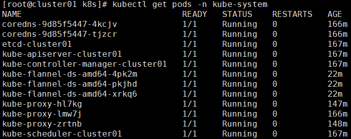

> [黑马程序员Kubernetes（K8S）教程 - 2020-12-08](https://www.bilibili.com/video/BV1cK4y1L7Am)
> 使用版本：
> - kubernetes server ：1.17.4
> - docker engine : 19.03.10
> 
笔记：
> [all_note.pdf](https://www.yuque.com/attachments/yuque/0/2024/pdf/26677932/1716283996030-18253c99-19b0-4789-9efc-ee52f01603a2.pdf?_lake_card=%7B%22src%22%3A%22https%3A%2F%2Fwww.yuque.com%2Fattachments%2Fyuque%2F0%2F2024%2Fpdf%2F26677932%2F1716283996030-18253c99-19b0-4789-9efc-ee52f01603a2.pdf%22%2C%22name%22%3A%22all_note.pdf%22%2C%22size%22%3A4434215%2C%22ext%22%3A%22pdf%22%2C%22source%22%3A%22%22%2C%22status%22%3A%22done%22%2C%22download%22%3Atrue%2C%22taskId%22%3A%22u9715dcbd-27d3-4ad8-9774-585755d5b69%22%2C%22taskType%22%3A%22upload%22%2C%22type%22%3A%22application%2Fpdf%22%2C%22__spacing%22%3A%22both%22%2C%22mode%22%3A%22title%22%2C%22id%22%3A%22u92b48266%22%2C%22margin%22%3A%7B%22top%22%3Atrue%2C%22bottom%22%3Atrue%7D%2C%22card%22%3A%22file%22%7D)
> 笔记相关问题：镜像使用默认镜像就好，要修改的镜像已经无了   -- 2024.5
> 高版本的kubernetes client 使用kubectl run 命令不能创建 deployment（例如：kubernetes client ：1.28.2）


> 强制删除pod
> `kubectl delete pod <POD-NAME> --force --grace-period=0`
>
> 强制删除pvc
> `kubectl delete pvc <PVC-NAME> --force --grace-period=0`
> 
> 强制删除资源
> `kubectl delete resrouce res_name --force --grace-period=0`


一种容器编排软件
```yaml
curl -L "https://github.com/containernetworking/plugins/releases/download/${CNI_VERSION}/cni-plugins-linux-${ARCH}-${CNI_VERSION}.tgz" | sudo tar -C /opt/cni/bin -xz
```

查看命名空间(kube-system)中的pods
kubectl get pods -n kube-system

查看pod的详细信息
kubectl describe pods kube-flannel-ds-amd64-4pk2m -n kube-system

如果cni插件不存在，需要下载，解压到/opt/cni/bin
```bash
CNI_PLUGINS_VERSION="v1.3.0"
ARCH="amd64"
DEST="/opt/cni/bin"
sudo mkdir -p "$DEST"
curl -L "https://github.com/containernetworking/plugins/releases/download/${CNI_PLUGINS_VERSION}/cni-plugins-linux-${ARCH}-${CNI_PLUGINS_VERSION}.tgz" | sudo tar -C "$DEST" -xz
```
