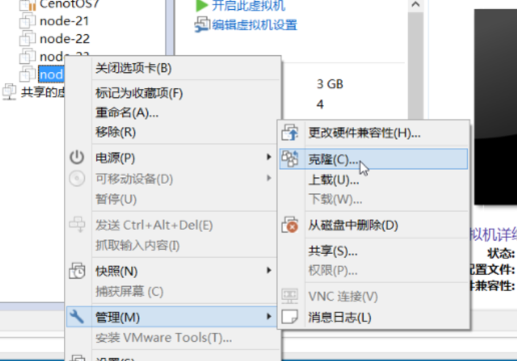
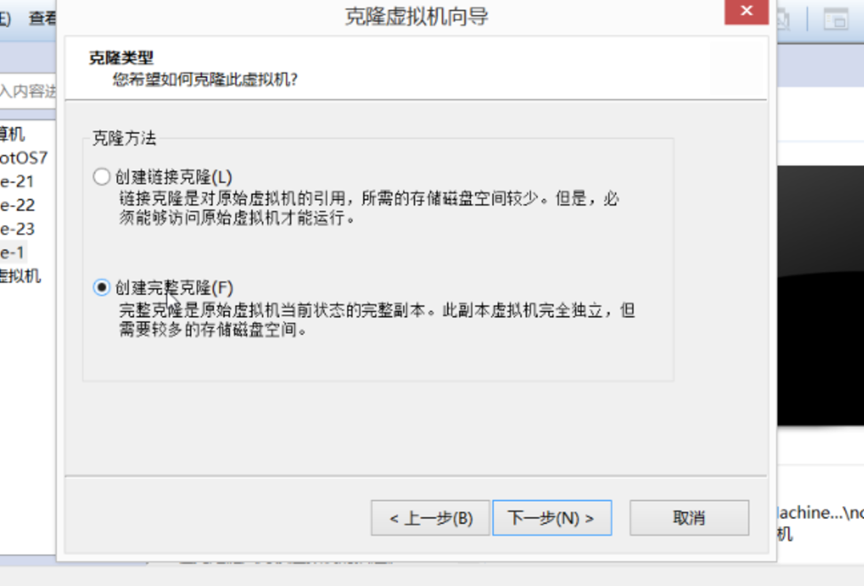
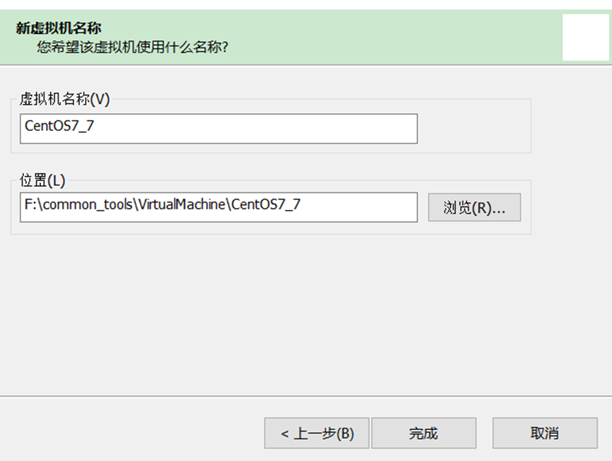
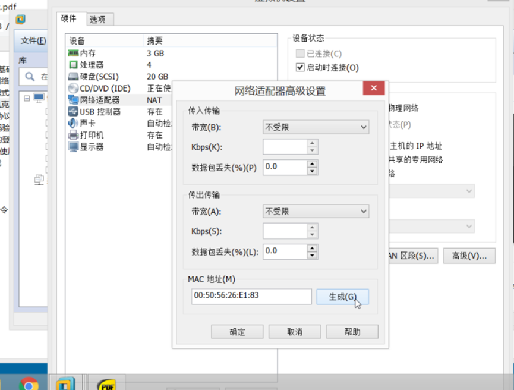

# Linux 常用文档

### 命令

**检查Linux版本 **`cat /etc/redhat-release`

**修改Hosts文件 ** `vim /etc/hosts`

**修改主机名**  `hostnamectl set-hostname new-hostname`  记得修改hosts文件，修改完成后重启

**修改主机名**  `vim /etc/hostname`

### 修改IP

> 注意
>
> 修改项、BOOTPROTO、UUID
>
> 添加项：
>
> GATEWAY、DNS1、IPADDR、ZONE

```shell
vim /etc/sysconfig/network-scripts/ifcfg-ens33
```

```latex
TYPE="Ethernet"
PROXY_METHOD="none"
BROWSER_ONLY="no"
BOOTPROTO="static"
DEFROUTE="yes"
IPV4_FAILURE_FATAL="no"
IPV6INIT="yes"
IPV6_AUTOCONF="yes"
IPV6_DEFROUTE="yes"
IPV6_FAILURE_FATAL="no"
IPV6_ADDR_GEN_MODE="stable-privacy"
NAME="ens33"
UUID="037931f4-527f-40bf-bacd-232e95171234"
DEVICE="ens33"
ONBOOT="yes"
GATEWAY=192.168.10.2
DNS1=192.168.10.2
IPADDR=192.168.10.170
ZONE=public
```

### 虚拟机克隆

vmware中的完整克隆是基于指定的虚拟机克隆出相同的一份出来，不必再安装。

但是我们要保证几个地方不能一样，一个是主机名称（hostname），一个是虚拟网卡设备mac地址，还有就是是ip地址和UUID。

所以我们在克隆后要对这四个地方进行修改。

这里以centos为例

1. 首先进行完全克隆，注意（要克隆的虚拟机在克隆前是需要处于关闭状态）

选择要克隆的虚拟机右键，选择管理，然后选择克隆



然后直到这一步选择完整克隆，注意：链接克隆是指在一些资源上两个虚拟机会共用，这里不做详细介绍，完整克隆是完全独立出来的一个新虚拟机。



然后下一步，虚拟机名称输入你想要的名称就完成了。



注意，克隆完之后所有信息与原虚拟机一样，所以下面我们进行一些信息的修改

2.开机前修改mac地址（注意：如果是动态生成IP地址，请在启动前先启动被克隆的虚拟机，以保证原来虚拟机的ip不会变，否则原来虚拟机ip会变，克隆后的虚拟机ip是原来的虚拟机ip）

点击编辑虚拟机设置,选择网络适配器，点击右下角高级然后下边就是mac地址，这个mac地址和被克隆的是一样的，我们点击生成，重新生成一个新的：



然后mac地址就修改完了。

3.开机后修改主机名称

修改主机名可能不同linux版本不同，修改方法也不同。

centos7就是`vim /etc/hostname` 命令来编辑主机名。

需要重启。（reboot）

4.修改IP地址 

此处需要注意的是：如果虚拟机使用的是动态ip分配，那么不需要更改ip，如果想改为静态ip，请修改：

vim /etc/sysconfig/network-scripts/ifcfg-ens33 

5.修改UUID

同样在修改IP地址的路径中修改即可

systemctl restart network

