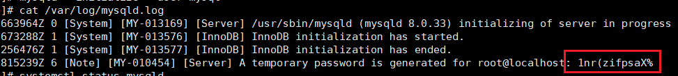

### Linux下安装
下载链接：[https://downloads.mysql.com/archives/community/](https://downloads.mysql.com/archives/community/)
选择下载RPM Bundle全量包
依次执行命令

```shell
chmod -R 777 /tmp
yum remove mysql-libs
rpm -ivh mysql-community-common-8.0.25-1.el7.x86_64.rpm
rpm -ivh mysql-community-client-plugins-8.0.25-1.el7.x86_64.rpm
rpm -ivh mysql-community-libs-8.0.25-1.el7.x86_64.rpm
rpm -ivh mysql-community-client-8.0.25-1.el7.x86_64.rpm
rpm -ivh mysql-community-server-8.0.25-1.el7.x86_64.rpm
```

安装过程中出现的问题，安装提示处理
安装成功后，执行mysql --version查看版本

### 服务初始化

设置/etc/my.cnf

```shell
[mysqld]
# 设置大小写不敏感
lower_case_table_names=1
```

`mysqld --initialize --user=mysql`
说明： `--initialize` 选项默认以“安全”模式来初始化，则会为 root 用户生成一个密码并将 该密码标记为过期 ，登录后你需要设置一个新的密码。生成的 临时密码 会往日志中记录一份。
查看密码：`cat /var/log/mysqld.log`

root@localhost: 后面就是初始化的密码
进入系统 ： mysql -u root -p 
修改密码： ALTER USER 'root'@'localhost' IDENTIFIED BY 'new_password' 
若是出现密码安全策略，可以进行修改
	修改密码长度：set global validate_password.length=1;（长度）
	修改密码等级：set global validate_password.policy=0;（等级)

### 设置远程登录
先在防火墙开放端口 
放行端口：firewall-cmd --permanent --zone=public --add-port=3306/tcp 

最后刷新：firewall-cmd --reload 

查看已开放端口：firewall-cmd --list-ports --permanent

修改mysql数据库下user表的host属性

例如：

```mysql
use mysql; 
update user set host = '%' where user ='root';
select Host,User from user; 
```

### 使配置立即生效
```sql
flush privileges;
```

### 添加新用户
```mysql
CREATE USER 用户名 [IDENTIFIED BY '密码'][,用户名 [IDENTIFIED BY '密码']];
```
- 用户名表示新用户的账户，由“用户User”和“主机名Host”构成

- create user 语句可以同时创建多个用户

- 不指定host时默认为‘%’

  示例：创建用户pnz@%密码为abc123，创建用户zhangsan@%密码为abc123

```mysql
create user 'pnz'@'%' identified by 'abc123', 'zhangsan' identified by 'abc123';
```
### 授权
#### 直接授权
GRANT 权限1,权限2,…权限n ON 数据库名称.表名称 TO 用户名@用户地址 [IDENTIFIED BY '密码']; 
- 如果没有该用户，系统会直接创建一个用户
例如：给pnz授予db_poster_collection这个库下所有表的增删改查的权限
`GRANT SELECT,INSERT,DELETE,UPDATE ON db_poster_collection.* TO 'pnz'@'%';`

### Linux重置Root密码
**设置MySQL无密码启动**
修改**/etc/my.cnf**配置文件
```shell
vim /etc/my.cnf
# 在[mysqld]下添加skip-grant-tables
[mysqld]
...
skip-grant-tables
...


# 设置完成后，重启MySQL服务
systemctl restart mysqld
```
进入MySQL，将mysql.user表的Root账号的密码忘记
```sql
# 不用输入密码 直接回车两次
mysql -uroot -p
# 选择mysql数据库
use mysql;
# 忘记root密码
update user set authentication_string='' where user='root';
```
退出控制台，注释skip-grant-tables
```shell
vim /etc/my.cnf

[mysqld]
...
# skip-grant-tables
...

# 修改配置文件记得重启服务
systemctl restart mysqld
```
重新进入MySQL控制台
```shell
# 密码被清空，直接回车两次，进入控制台
mysql -uroot -p

# 设置root密码  注意 user和host
alter user 'root'@'%' identified by 'abc123';

# 让密码生效
FLUSH PRIVILEGES;
```

### Linux重置MySQL

先停止mysql服务

```shell
systemctl stop mysqld
```

备份数据目录

```shell
mv /var/lib/mysql /var/lib/mysql_backup
```

初始化mysql，以及重启服务

```shell
mysqld --initialize --user=mysql
查看初始密码
cat /var/log/mysqld.log

systemctl start mysqld
```

登录mysql，已经修改root密码

### MySQL修改数据目录

先停止mysql服务

```shell
systemctl stop mysqld
```

迁移数据目录到自己想要设置的目录

```shell
sudo mkdir -p /home/mysql/data
sudo mkdir -p /home/mysql/logs

rsync -av /var/lib/mysql/ /home/mysql/data/
```

修改my.cnf配置

```shell
[mysqld]
datadir = /home/mysql/data
log-error = /home/mysql/logs/error.log
socket=/home/mysql/data/mysql.sock

[client]
socket=/home/mysql/data/mysql.sock
```

更改数据目录权限

```shell
sudo chown -R mysql:mysql /home/mysql/data
sudo chown -R mysql:mysql /home/mysql/logs
```

更新SELinux配置

```shell
sudo semanage fcontext -a -t mysqld_db_t "/home/mysql/data(/.*)?"
sudo semanage fcontext -a -t mysqld_log_t "/home/mysql/logs(/.*)?"
sudo restorecon -Rv /home/mysql/data
sudo restorecon -Rv /home/mysql/logs
```

重启服务

```shell
systemctl start mysqld && systemctl status mysqld
```


