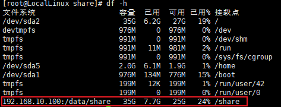
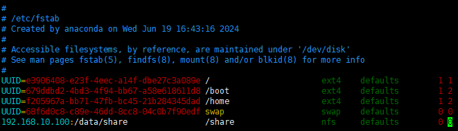

# NFS共享存储

参考配置：

1.  [Linux 环境下 NFS 服务安装及配置使用-腾讯云开发者社区-腾讯云](https://cloud.tencent.com/developer/article/1433259)
2.  [NFS共享存储服务（图文详解）\_nsf存储-CSDN博客](https://blog.csdn.net/Lucien010230/article/details/114100524)


## 1.NFS 介绍
- **NFS 是一种基于 TCP/IP 传输的网络文件系统协议**。通过使用 NFS 协议，客户机可以像访问本地目录一样访问远程服务器中的共享资源。
-   对于大多数负载均衡群集来说，使用NFS协议来共享数据存储是比较常见的做法，NFS也是NAS存储设备必然支持的一种协议。但是由于NFS没有用户认证机制，而且数据在网络上明文传输，所以安全性很差，一般只能在局域网中使用。
-  **NFS 服务的实现依赖于 RPC（Remote Process Call，远端过程调用）机制**，以完成远程到本地的映射过程。所以需要安装 nfs-utils、rpcbind 软件包来提供 NFS共享服务，前者用于 NFS 共享发布和访问，后者用于 RPC 支持

## 2. NFS 配置
### 2.1 NFS 安装
> NFS 是依赖 RPC 服务，NFS 服务端需要安装 `rpcbind` 和 `nfs-utils`，客户端只需要安装 `nfs-utils`，我们系统为 CentOS 系统，可以使用 `yum` 安装
#### 1. 检查是否安装
```shell
#命令
rpm -qa nfs-utils rpcbind 

# 输出  -- 为空就是未安装
nfs-utils-1.3.0-0.54.el7.x86_64 
rpcbind-0.2.0-38.el7.x86_64
```
#### 2. 安装
**服务端**：
```shell
yum install -y nfs-utils rpcbind
```
**客户端**：
```shell
yum install -y nfs-utils
```
#### 3. 配置-启动
##### 服务端
> 在服务端创建一个共享目录 `/data/share`，作为客户端挂载的远端端口，然后设置权限

```shell
# 创建共享文件夹
mkdir -p /data/share
chmod 666 /data/share
```
> 修改 NFS 配置文件 `/etc/exports`，添加共享目录和客户端权限设置

```shell
vim /etc/exports
# 写入
/data/share 192.168.10.0/24(rw,sync,insecure,no_subtree_check,no_root_squash)
```
说明一下，这里配置后边有很多参数，每个参数有不同的含义，具体可以参考下边。此处，配置了将 `/data/share` 文件目录设置为允许 IP 为该 `192.168.10.0/24` 区间的客户端挂载，当然，如果客户端 IP 不在该区间也想要挂载的话，可以设置 IP 区间更大或者设置为 `*` 即允许所有客户端挂载

例如：`/home *(ro,sync,insecure,no_root_squash)` 设置 `/home` 目录允许所有客户端只读挂载。

**参数配置**：

> 配置后面可以配置参数

|参数|解释 |
|:-----|:-----|
|**ro**|只读访问|
|**rw**|读写访问|
|**sync**|所有数据在请求时写入共享.表示同步写入到内存与硬盘中|
|**async**|nfs在写入数据前可以响应请求，将数据先保存在内存缓冲区中，必要时才写入磁盘|
|secure |nfs 通过 1024 以下的安全 TCP/IP 端口发送|
|insecure|nfs 通过 1024 以上的端口发送|
|wdelay|如果多个用户要写入 nfs 目录，则归组写入（默认）|
|no_wdelay|如果多个用户要写入 nfs 目录，则立即写入，当使用 async 时，无需此设置|
|hide|在 nfs 共享目录中不共享其子目录|
|no_hide|共享 nfs 目录的子目录|
|subtree_check|如果共享 /usr/bin 之类的子目录时，强制 nfs 检查父目录的权限（默认）|
|all_squash|共享文件的 UID 和 GID 映射匿名用户 anonymous，适合公用目录|
|no_all_squash |保留共享文件的 UID 和 GID（默认） |
|root_squash|root 用户的所有请求映射成如 anonymous 用户一样的权限（默认）|
|**no_root_squash**|root 用户具有根目录的完全管理访问权限|
|anonuid=xxx|指定 nfs 服务器 /etc/passwd 文件中匿名用户的 UID|
|anongid=xxx|指定 nfs 服务器 /etc/passwd 文件中匿名用户的 GID |

>没启动 NFS 只能监听` 111` 端口

```shell
# 查看 NFS 服务项 rpc 服务器注册的端口列表
rpcinfo -p localhost

# 输出
   program vers proto   port  service
    100000    4   tcp    111  portmapper
    100000    3   tcp    111  portmapper
    100000    2   tcp    111  portmapper
    100000    4   udp    111  portmapper
    100000    3   udp    111  portmapper
    100000    2   udp    111  portmapper
```
> 启动 NFS
```shell
# 启动 NFS 服务
systemctl start nfs-server

# 启动 NFS 服务后 rpc 服务已经启用了对 NFS 的端口映射列表
rpcinfo -p localhost

#输出
   program vers proto   port  service
    100000    4   tcp    111  portmapper
    100000    3   tcp    111  portmapper
    100000    2   tcp    111  portmapper
    100000    4   udp    111  portmapper
    100000    3   udp    111  portmapper
    100000    2   udp    111  portmapper
    100024    1   udp  33745  status
    100024    1   tcp  36980  status
    100005    1   udp  20048  mountd
    100005    1   tcp  20048  mountd
    100005    2   udp  20048  mountd
    100005    2   tcp  20048  mountd
    100005    3   udp  20048  mountd
    100005    3   tcp  20048  mountd
    100003    3   tcp   2049  nfs
    100003    4   tcp   2049  nfs
    100227    3   tcp   2049  nfs_acl
    100003    3   udp   2049  nfs
    100003    4   udp   2049  nfs
    100227    3   udp   2049  nfs_acl
    100021    1   udp  38960  nlockmgr
    100021    3   udp  38960  nlockmgr
    100021    4   udp  38960  nlockmgr
    100021    1   tcp  38362  nlockmgr
    100021    3   tcp  38362  nlockmgr
    100021    4   tcp  38362  nlockmgr
```
> 检查服务端是否正确加载了设置 `/etc/exports` 配置

```shell
showmount -e localhost

# 输出
Export list for localhost:
/data/share 192.168.10.0/24
```
>配置防火墙规则

```shell
sudo firewall-cmd --permanent --add-service=nfs
sudo firewall-cmd --permanent --add-service=mountd
sudo firewall-cmd --permanent --add-service=rpc-bind
sudo firewall-cmd --reload
```

##### 客户端 
>启动 NFS

```shell
systemctl start nfs-server
```
>配置防火墙规则

```shell
sudo firewall-cmd --permanent --add-service=nfs
sudo firewall-cmd --permanent --add-service=mountd
sudo firewall-cmd --permanent --add-service=rpc-bind
sudo firewall-cmd --reload
```
>验证链接

```shell
服务端IP：192.168.10.100
showmount -e 192.168.10.100

#输出
Export list for 192.168.10.100:
/data/share 192.168.10.0/24
```
> 挂载共享目录
>
> 注意：成功挂在后，需要再使用**cd命令进入挂在目录**才是进入共享目录

```shell
mkdir /share

# 挂载
mount 192.168.10.100:/data/share /share
```
使用命令：`df -h`可以查看是否挂在成功

 

> 设置自动挂载（确保系统在启动时自动挂载指定的 NFS 共享目录）

```shell
# 修改自动挂载配置文件
vim /etc/fstab

192.168.10.100:/data/share                /share                  nfs     defaults        0 0
```
- `192.168.6.129:/data/share` : NFS 服务器的 IP 地址和共享目录路径
- ` /share`：本地挂载点
- `nfs`：文件系统类型
- `defaults`：挂载选项，默认选项
- `0 0`：这两个字段通常用于备份和文件系统检查，对于 NFS 来说通常设置为 0


**挂载验证**

```
# 解挂载
umount /data/share
# 查看 
df -h

# 重新加载自动挂载配置文件，并查看
mount -a
df -h
```
>服务器故障时，`umount` 和 `df` 解挂载会卡住, 使用 `-lf` 参数进行强行解挂载

```shell
umount -lf /share
```
>备注：NFS 默认使用用 UDP 协议来进行挂载，为了提高 NFS 的稳定性，可以使用 TCP 协议挂载，那么客户端挂载命令可使用如下命令：

```shell
mount 192.168.10.0:/data/share /share -o proto=tcp -o nolock
```
- `-o proto=tcp`：指定挂载使用的协议
- `-o nolock`：禁止 NFS 文件锁定（NFS 客户端和服务端之间存在兼容问题时，避免挂载问题）