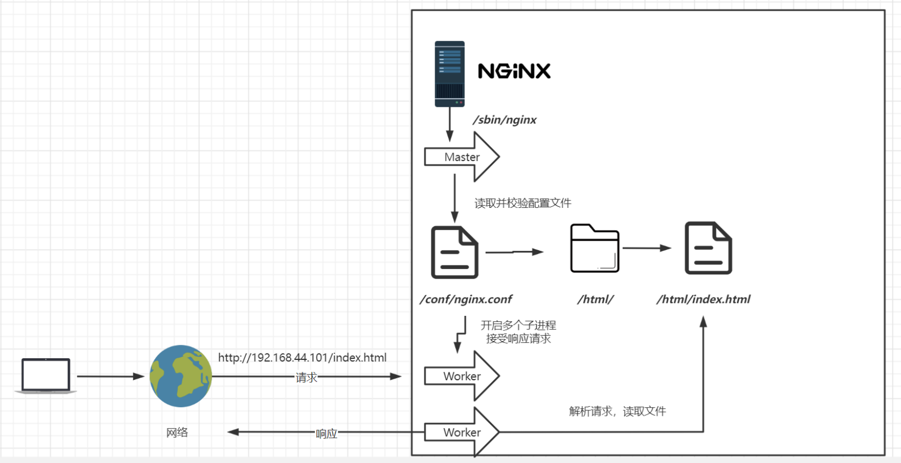
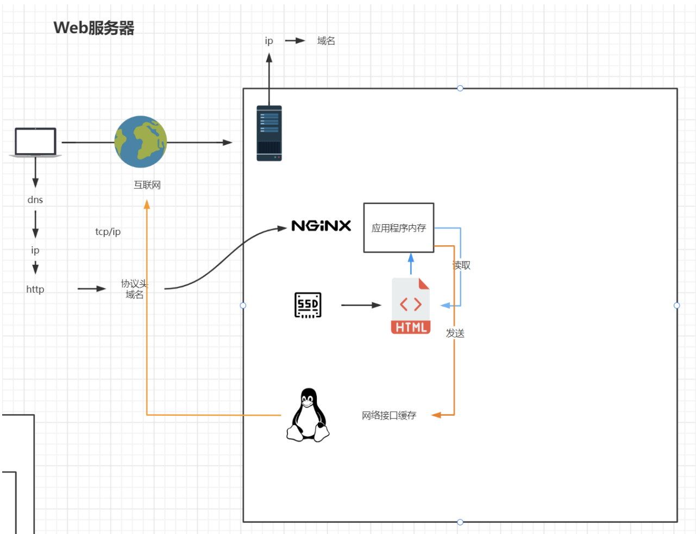
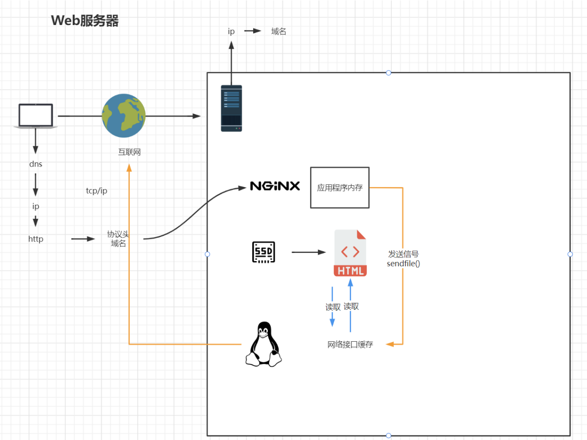

## Nginx基础使用

### 目录结构

#### conf

存放配置文件相关

#### html

存放静态文件的默认目录

#### sbin

存放nginx运行文件

### 基本原理



### Nginx配置与应用场景

#### 最小配置

**worker_processes** 

worker_processes 1; 默认为1，表示开启一个业务进程 

**worker_connections** 

worker_connections 1024; 单个业务进程可接受连接数 

**include mime.types;** 

include mime.types; 引入http mime类型 

**default_type application/octet-stream;** default_type application/octet-stream; 如果mime类型没匹配上，默认使用二进制流的方式传输。 

**sendfile on;** 

sendfile on; 使用linux的 sendfile(socket, file, len) 高效网络传输，也就是数据0拷贝。 

未开启sendfile




开启sendfile



**keepalive_timeout 65;** 

keepalive_timeout 65; 

在 Nginx 中，`keepalive_timeout` 指令用于设置在最后一个请求之后，客户端连接保持活跃的时间。这有助于通过减少为来自同一客户端的多个请求建立新连接的开销来提高网站的性能。

**server**

虚拟主机配置

```conf
server {
    listen 80; 监听端口号
    server_name localhost; 主机名
    
    location / { 匹配路径
        root html; 文件根目录
        index index.html index.htm; 默认页名称
    }
    
    error_page 500 502 503 504 /50x.html; 报错编码对应页面
    location = /50x.html {
        root html;
    }
}
```

#### 虚拟主机

原本一台服务器只能对应一个站点，通过虚拟主机技术可以虚拟化成多个站点同时对外提供服务

**server_name匹配规则**

我们需要注意的是server_name匹配分先后顺序，写在前面的匹配上就不会继续往下匹配了。

**精确匹配**

我们可以在同一servername中匹配多个域名

```shell
# 优先级最高
server_name www.locallinux void.locallinux
```

**前缀通配符匹配**

```shell
# 前缀通配符 比 后缀通配符 优先级高
server_name *.locallinux
```

**后缀通配符匹配**

```shell
server_name locallinux.*
```

**正则匹配**

```shell
# 使用正则表达式来匹配主机名， 格式为 `~`后跟正则表达式
server_name ~^[0-9]+\.locallinux\.com$;
```
**默认服务器**

```shell
# 如果没有匹配到任何`server_name`， Nginx会使用`default_server`参数指定的服务器块作为默认服务器，例如  'server_name  _;'
server {
    listen       80 default_server;
    server_name  _;
}
```


##### 反向代理

> 小知识： 
>
> `http://wlpnz.top/todo/list` 
>
> uri: /todo/list 资源路径
>
> url: http://wlpnz.top/todo/list

```shell
location / {
	proxy_pass http://atguigu.com/;
}
```

##### 负载均衡

基于反向代理的负载均衡

**轮询**

默认情况下使用轮询方式，注意转发，这种方式适用于无状态请求

```shell
# weight 权重， 指定轮巡几率，weight和访问比率成正比，用于后端服务器性能不均的情况。
# down：表示当前的server暂时不参与负载
# weight：默认为1.weight越大，负载的权重就越大。
# backup： 其它所有的非backup机器down或者忙的时候，请求backup机器。
upstream server-api{
    server 192.168.10.1:8988 weight=10 down; 
    server 192.168.10.1:8989 weight=5;
    server 192.168.10.1:8990 weight=2 backup;
}
server {
    listen       80;
    server_name  *.locallinux;

    location / {
        proxy_pass http://server-api;
    }
}
```

**ip_hash**

根据客户端的ip地址转发同一台服务器，可以保持回话

**least_conn**

最少连接访问

**url_hash**

根据用户访问的url定向转发请求

**fair**

根据后端服务器响应时间转发请求

##### location

**location路径匹配规则**

**精确匹配(`=`)**

如果路径与指定的字符串完全匹配，则优先使用这种规则

```shell
location = /exact {}
```

**前缀匹配(`^~`)**

这种匹配是默认的，并且按照配置文件中出现的顺序进行匹配。

如果路径与指定的字符串前缀匹配，并且不需要进一步处理正则表达式，则使用这种规则。

```shell
location ^~ /images/ {}
```

**正则表达式匹配 ('~' 和 '~*')：**

区分大小写的正则表达式 (`~`)：

```shell
location ~ \.php$ {}
```

不区分大小写的正则表达式 (`~*`)：

```shell
location ~* \.(jpg|jpeg|png|gif|ico)$ {}
```

**通配符匹配**

使用` *` 作为通配符字符的匹配

```shell
location /something* {}
```

**匹配顺序和优先级**

当 Nginx 处理请求时，按照以下顺序查找匹配：

1. **精确匹配**：首先检查是否有精确匹配。
2. **前缀匹配 (`^~`)**：如果没有精确匹配，则检查前缀匹配。
3. **正则表达式匹配**：如果前两者没有匹配，则按配置文件中出现的**顺序**测试正则表达式匹配。
4. **前缀匹配**：如果以上都没有匹配，则进行前缀匹配。

##### 静态资源映射

在进行静态资源映射的时候，注意区别`root`和`alias`

在 Nginx 配置中，`root` 和 `alias` 指令都用于指定文件系统路径，但它们的工作方式有所不同。

`root` 指令指定的路径是相对于 location 匹配到的 URL 路径的根目录。也就是说，请求的路径会附加到 `root` 指定的路径后。

```nginx
server {
    listen 80;
    
    location /static/ {
        root /var/www/html;
    }
}
# 在这个示例中，请求 http://example.com/static/image.png 将映射到文件系统路径 /var/www/html/static/image.png。
```

`alias` 指令指定的路径是一个绝对路径，完全替换掉 location 匹配到的 URL 路径。

```nginx
server {
    listen 80;

    location /static/ {
        alias /var/www/html/static_files/;
    }
}
# 在这个示例中，请求 http://example.com/static/image.png 将映射到文件系统路径 /var/www/html/static_files/image.png。
```

**详细区别**

**路径附加方式**：

- `root`：请求路径的剩余部分会附加到 `root` 指定的目录后。例如，请求 `/static/image.png`，`root` 指定为 `/var/www/html`，则实际路径为 `/var/www/html/static/image.png`。
- `alias`：请求路径的匹配部分会替换为 `alias` 指定的目录。例如，请求 `/static/image.png`，`alias` 指定为 `/var/www/html/static_files/`，则实际路径为 `/var/www/html/static_files/image.png`。

**配置格式**：

- `root` 通常用于简单的路径拼接，适用于静态文件目录在服务器根目录下的情形。
- `alias` 更灵活，可以用于重映射复杂的路径结构。

**注意事项**

**目录斜杠**：在使用 `alias` 时，确保路径以斜杠结尾，以避免路径拼接错误。

**路径匹配**：`alias` 更适合用于路径重定向和复杂路径结构，而 `root` 更适合用于简单的目录层次。

**资源映射参数获取**

```nginx
location /manage/ {  
    alias   D:/data/dsjoa/;
    autoindex on;
    error_page 405 =200 http://$host$request_uri;
    if ($arg_attname ~ "^(.+)") {
        add_header Content-Type application/x-download;
        add_header Content-Disposition "attachment;filename=$arg_attname";
        charset                 utf-8,gbk,ISO8859-1; 
    }
}
# http://localhost:8888/manage/temp.jpg?attname=test.jpg   下载文件，且下载文件名为 test.jpg
```


##### UrlRewrite

在 Nginx 中，`rewrite` 指令用于重写 URL，通常用于 URL 重定向和重写。它可以在 `server`、`location` 和 `if` 块中使用。`rewrite` 指令的语法格式和参数如下：

```nginx
rewrite regex replacement [flag];
# regex：要匹配的正则表达式。
# replacement：用于替换的字符串，可以包含捕获组。
# flag：可选参数，指定重写行为。
```

常用的 `flag` 参数

- `last`：停止重写检查，并在重写后的新位置重新开始处理。这类似于 Apache 的 `L` 标志。

- `break`：停止重写检查，并在当前位置处理请求，不再继续检查后续的 `rewrite` 指令。

- `redirect`：返回 HTTP 302 临时重定向。

- `permanent`：返回 HTTP 301 永久重定向。

**基本示例**：

```nginx
# 简单重写
location /old-path/ {
    rewrite ^/old-path/(.*)$ /new-path/$1 permanent;
}
# 请求 http://example.com/old-path/foo 将被重定向到 http://example.com/new-path/foo，并返回 HTTP 301 状态码。

server {
    listen 80;
    server_name example.com;

    location / {
        rewrite ^/search/(.*)$ /search.php?q=$1 last;
    }

    location /search.php {
        fastcgi_pass 127.0.0.1:9000;
        # include fastcgi_params; 指令将fastcgi_params文件包含的参数引入，从而确保 Nginx 将必要的信息传递给服务器。
        include fastcgi_params; 
    }
}
# 请求 http://example.com/search/keyword 将被内部重定向到 http://example.com/search.php?q=keyword，并在新位置重新开始处理请求。

location /images/ {
    rewrite ^/images/(.*)\.jpg$ /images/$1.png break;
    root /data;
}
# 请求 http://example.com/images/pic.jpg 将被内部重定向到 http://example.com/images/pic.png，但不会继续进行重写检查，并直接处理 /data/images/pic.png 文件。
```

**捕获组和引用**

在正则表达式中使用括号 `()` 定义捕获组，并在 `replacement` 中使用 `$1`、`$2` 等引用对应的捕获组。

```nginx
location /blog/ {
    rewrite ^/blog/(.*)$ /blog.php?title=$1 last;
}
# 请求 http://example.com/blog/my-post 将被重定向到 http://example.com/blog.php?title=my-post。
```

**if中使用rewrite**

```nginx
server {
    listen 80;
    server_name example.com;

    location / {
        if ($http_user_agent ~* "Mobile") {
            rewrite ^/$ /mobile/ permanent;
        }
    }
}
# 如果请求来自移动设备，将重定向到 /mobile/。
```

##### 防盗链配置

```nginx
valid_referers none | blocked | server_names | strings ....;
# none， 检测 Referer 头域不存在的情况。
# blocked，检测 Referer 头域的值被防火墙或者代理服务器删除或伪装的情况。这种情况该头域的值不以 “http://” 或 “https://” 开头。
# server_names ，设置一个或多个 URL ，检测 Referer 头域的值是否是这些 URL 中的某一个。
```

**示例**

```nginx
location /images/ {
    # 设置防盗链
    valid_referers none blocked server_names *.example.com *.anotherdomain.com;
    if ($invalid_referer) {
        return 403; # 禁止访问
    }
    root /var/www/html;
}
```
**配置解释**

- `valid_referers`：指定哪些 `Referer` 值是合法的。
  - `none`：匹配没有 `Referer` 头的请求。
  - `blocked`：匹配被防火墙或代理服务器删除 `Referer` 头的请求。
  - `server_names`：匹配服务器的主机名。
  - `*.example.com`：允许来自 `example.com` 子域的请求。
  - `*.anotherdomain.com`：允许来自 `anotherdomain.com` 子域的请求。
- `if ($invalid_referer)`：检查请求是否包含无效的 `Referer` 头。
  - 如果 `Referer` 头不在 `valid_referers` 列表中，则变量 `$invalid_referer` 为真，执行相应的动作。
  - `return 403;`：返回 HTTP 403 Forbidden 状态码，拒绝访问。
- `root /var/www/html;`：指定资源的根目录。

### 高可用Keepalived

**yum安装**

```shell
yum install keepalived 
```

配置使用yum安装后，配置文件在`/etc/keepalived/keepalived.conf`

**最小配置**

第一台机器

```shell
! Configuration File for keepalived

global_defs {
   router_id lb100
}

vrrp_instance VI_1 {
    state MASTER
    interface ens33
    virtual_router_id 51
    priority 100
    advert_int 1
    authentication {
        auth_type PASS
        auth_pass 1111
    }
    virtual_ipaddress {
        192.168.10.200
    }
}
```

第二台机器

```shell
! Configuration File for keepalived

global_defs {
   router_id lb101
}

vrrp_instance VI_1 {
    state BACKUP
    interface ens33
    virtual_router_id 51
    priority 90
    advert_int 1
    authentication {
        auth_type PASS
        auth_pass 1111
    }
    virtual_ipaddress {
        192.168.10.200
    }
}
```

> 注意事项：
>
> 注意： 
>
> - 优先级范围 0-255
> - ip要处于同一网段
> - 同一组VRRP路由器应具有相同的ID `virtual_router_id`、相同的名字`VI_1`、相同的`authentication`
> - 备份服务器其优先级应低于主服务器

**启动**

`systemctl start keepalived `

**核心组件**

VRRP（Virtual Router Redundancy Protocol）：

- VRRP 是一种网络协议，用于在多个路由器之间实现高可用性。它通过将多个路由器配置成一个虚拟路由器组，提供一个虚拟 IP 地址（VIP）给客户端。当主路由器不可用时，备份路由器会自动接管 VIP，从而保证服务的连续性。

健康检查

- Keepalived 提供对后端服务器的健康检查功能。当检测到某个服务器故障时，它会从负载均衡池中移除该服务器，确保流量只分发到健康的服务器。

**Keepalived的工作原理**

VRRP 实现高可用性：

- Keepalived 使用 VRRP 创建一个虚拟路由器实例（`vrrp_instance`），该实例由多个实际的物理路由器（或服务器）组成。每个物理设备都有一个优先级（`priority`），优先级最高的设备成为主设备（Master），其余的为备份设备（Backup）。

- 主设备会周期性地向备份设备发送 VRRP 广播消息。如果备份设备在指定时间内没有收到主设备的消息，它们会进行选举，选择一个新的主设备，通常是优先级最高的备份设备。

健康检查：

- Keepalived 配置文件中可以定义对后端服务器进行健康检查的脚本（如 HTTP、TCP、SSL 检查）。如果健康检查失败，Keepalived 会将该服务器标记为不可用，从负载均衡池中移除。健康检查成功时，该服务器会被重新加入到池中。


## Nginx进阶使用

