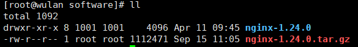
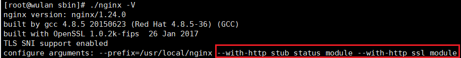

### 安装
上传安装包并解压



进入解压目录

安装perl库 

yum install -y pcre pcre-devel

安装zlib库 

yum install -y zlib zlib-devel 

编译安装

./configure --prefix=/usr/local/nginx 

make

make install

### 常用命令
```shell
./nginx -v #查看nginx 版本
./nginx -V #查看nginx的配置信息
./nginx  #启动命令
./nginx -s stop #关闭命令
./nginx -s reload #重新加载命令
./nginx -c  nginx.config #指定配置文件启动
./nginx -t -c  nginx.config #检查指定配置文件是否正确

#查看nginx 监听了哪些端口
ps -ef  | grep nginx
netstat -anp | grep ${pid} # pid 为上面查询出来的nginx进程号

# 开放防火墙端口
firewall-cmd --zone=public --add-port=80/tcp --permanent
firewall-cmd --reload
firewall-cmd --list-ports
```


### 配置https
先安装nginx的ssl模块

编译之前安装openssl

yum -y install openssl openssl-devel

然后在nginx的解压目录中执行

./configure --prefix=/usr/local/nginx --with-http_stub_status_module --with-http_ssl_module

make

使用nginx -V查看是否成功



将objs中的nginx复制到/usr/local/nginx/sbin/nginx

rm -rf /usr/local/nginx/sbin/nginx

cp ./nginx /usr/local/nginx/sbin/nginx

将下载好的证书（pem文件和key文件）上传到/usr/local/nginx/conf的cert中

然后配置nginx.conf

```
 server {
        listen       443 ssl;
        server_name  wlpnz.top;
    
        ssl_certificate      /usr/local/nginx/conf/cert/10145087_wlpnz.top.pem;
        ssl_certificate_key  /usr/local/nginx/conf/cert/10145087_wlpnz.top.key;

        ssl_session_cache    shared:SSL:1m;
        ssl_session_timeout  5m;

        ssl_ciphers  HIGH:!aNULL:!MD5;
        ssl_prefer_server_ciphers  on;

        location / {
            root   html;
            index  index.html index.htm;
        }
    }
```


### 配置成系统服务

```shell
vim /usr/lib/systemd/system/nginx.service
```

将以下内容插入nginx.service
```shell
[Unit]
Description=nginx - web server
After=network.target remote-fs.target nss-lookup.target

[Service]
Type=forking
PIDFile=/usr/local/nginx/logs/nginx.pid
ExecStartPre=/usr/local/nginx/sbin/nginx -t -c /usr/local/nginx/conf/nginx.conf
ExecStart=/usr/local/nginx/sbin/nginx -c /usr/local/nginx/conf/nginx.conf
ExecReload=/usr/local/nginx/sbin/nginx -s reload
ExecStop=/usr/local/nginx/sbin/nginx -s stop
ExecQuit=/usr/local/nginx/sbin/nginx -s quit
PrivateTmp=true

[Install]
WantedBy=multi-user.target
```

重新加载系统服务

```shell
systemctl daemon-reload
```

应用

```shell
systemctl start nginx
systemctl stop nginx
systemctl restart nginx
systemctl status nginx
```

