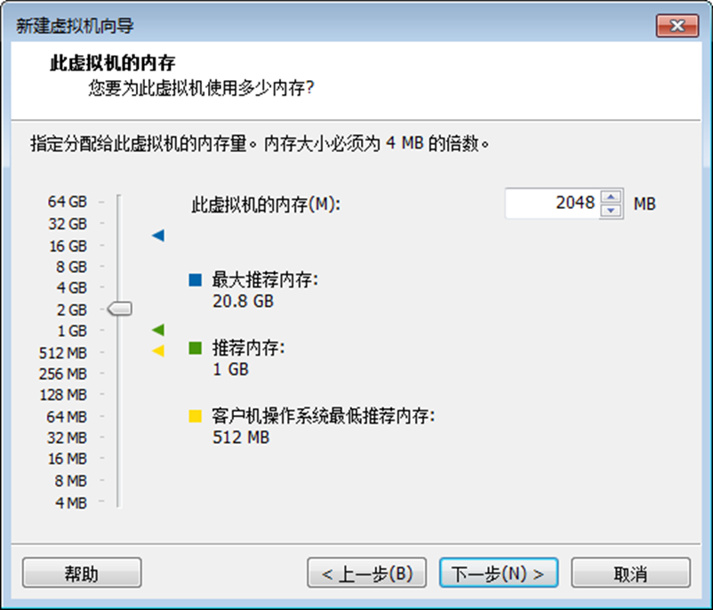
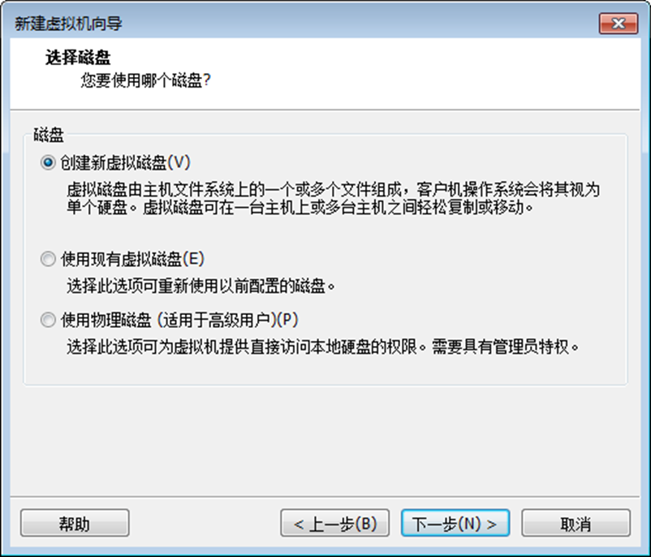

# 使用VMWare安装CentOS7

## 安装CentOS 7

整个安装过程分两大步，第一步装机器，第二步装系统.

**第一步: 装机器**

检查物理机虚拟化支持是否开启，需要进入到BIOS中设置，因各种电脑型号进入BIOS方式不同，同学们自行查找对应品牌电脑如何进入BIOS

建议: 先安装，如果安装中提示虚拟化未开启，再进入BIOS设置，如安装一切顺序，则不需要进行任何设置。

可以在任务管理器查看是否开启虚拟化

在VMware中新建虚拟机


默认即可,不需要做任何修改，直接下一步


选择稍后安装操作系统，然后下一步


选择安装的操作系统为Linux,版本为CentOS7 64位


虚拟机命名，可随意取， 安装位置最好选择固态硬盘(有固态的情况..)，快的飞起


按照物理机CPU实际情况，选择处理器配置, 处理器数量\*每个处理器内存数量要小于等于物理机CPU的数量，否则报错.

查看物理机CPU数量:


选择虚拟机CPU配置


选择分配给虚拟机的内存，最少2G



网络类型选择NAT


I/O控制器类型选择默认推荐即可，同学们无须纠结不同处，不重要。


磁盘类型选择SCSI， 同学们无须纠结不同处，不重要。


IDE: 老的磁盘类型

SCSI: 服务器上推荐使用的磁盘类型，串口。

SATA: 也是串口，也是新的磁盘类型。

选择创建新虚拟磁盘



磁盘容量指定20G（或50GB），选择将虚拟磁盘拆分成多个文件. 不要勾选立即分配所有磁盘空间,否则会直接占用20G(或50GB)大小的磁盘空间。


选择Linux文件的存储位置，建议选择到Linux的安装位置，存储到先前创建的目录下


至此，装机器完成。 点击完成即可。如果想更改配置，可点击自定义硬件。对之前步骤的选择进行更改。


**第二步 装系统**

选择系统盘位置


加电，开启虚拟机


进入倒计时,鼠标点进去, 键盘上下键可以选择，选择Install CentOS 7 ，然后回车即可.

不要选择Test this media & install CentOS 7, 然后就没有然后了......

> TIPS: Ctrl+Alt可以实现Windows主机和VM之间窗口的切换


选择简体中文


设置日期和时间 选择亚洲/上海


设置软件选择 GNOME桌面,

> TIPS：第一次安装建议选择GNOME桌面，实际以后真实服务器中不会带桌面,都是最小化安装，进入系统就是Shell界面，全部通过命令操作。 等学习完Linux命令，能使用命令熟练操作Linux后，可选择最小安装.


设置安装位置,即进行分区。（可选）


选择我要配置分区,然后点左上角完成进入分区界面


第一个分区: /boot 引导分区,建议给1G


修改设备类型为标准分区,文件系统为ext4


第二个分区 swap , 交换分区，建议设置与内存大小一致. 2G


修改设备类型为标准分区,文件系统为swap


第三个分区 / , 剩余的磁盘大小全部分配。 /为linux文件系统的根目录。


修改设备类型为标准分区,文件系统为ext4


确认最终分区后的情况,点击左上角完成即可。


关闭KDUMP

> Kdump在实际生产环境中需要勾选，这里我在授课环境中就不勾选了。


配置网络和主机名(可选,也可在安装好后进入到系统中配置).


最后确认配置的各个选项无误,点击开启安装即可.

配置ROOT密码 和 创建用户。Linux会默认提供一个超级管理员用户，就是root. 


等待安装完成，重启虚拟机


初始设置,接受许可证即可， 其他的不用配置。


点击完成配置


进入欢迎界面，选择汉语 ，点击右上角 前进


选择键盘布局为汉语


隐私设置 ，根据自己的喜好选择即可


确定时区


跳过关联账号


CentOS要求必须设置一个普通账户,可随意设置


设置普通账户密码


终于可以开始使用了


关闭Getting Started

注销当前普通用户，使用root用户登录

选择未列出,使用root登录

为root用户配置欢迎设置。参考上面设置的步骤

安装总结:

整个Linux的安装分两大步，第一个大步装机器，也就是要虚拟一台机器出来,这里需要注意的是以后工作中不需要装虚拟机，全部都是真实的服务器，直接装系统即可.

第二大步就是装系统。

步骤比较多，大家安装时一定要仔细,如果安装过程出错，可选择删除重新安装.多试几次也好，毕竟慢慢就熟练了。

到此，可以开心的使用Linux了。

## 卸载CentOS 7

1、打开虚拟机VMware Wvorkstation


2、在菜单栏选择"虚拟机"，在弹出的子菜单栏中选择"管理"


3、点击"从磁盘中删除"


4、弹出警告，点击"是"


5、在我的计算机列表中已经移除了CentOS 7


6、在D:\\Program Files (x86)\\Virtual Machines目录下已移除了CentOS 7


7、至此从虚拟机卸载CentOS 7已完成。

## 配置静态IP

打开VMWare

选择【虚拟网络编辑器】


配置VMnet8网络、子网IP、子网掩码


设置网关


修改DHCP设置


打开Windows网络适配器配置


修改IPv4配置，和VMWare网络配置处于同一子网


进入Linux命令行界面

输入

``` shell
vim /etc/sysconfig/network-scripts/ifcfg-ens33
```

 

修改配置

> 修改项： BOOTPROTO、UUID
>
> 添加项：GATEWAY、DNS1、IPADDR、ZONE

```shell
TYPE="Ethernet"
PROXY_METHOD="none"
BROWSER_ONLY="no"
BOOTPROTO="static"
DEFROUTE="yes"
IPV4_FAILURE_FATAL="no"
IPV6INIT="yes"
IPV6_AUTOCONF="yes"
IPV6_DEFROUTE="yes"
IPV6_FAILURE_FATAL="no"
IPV6_ADDR_GEN_MODE="stable-privacy"
NAME="ens33"
UUID="20f658d8-f2b2-4ac9-a70c-b717f3a260aa"
DEVICE="ens33"
ONBOOT="yes"
GATEWAY=192.168.10.2
DNS1=192.168.10.2
IPADDR=192.168.10.100
ZONE=public
```

重启网络

```shell
systemctl restart network
```

输入`ifconfig`查看IP

