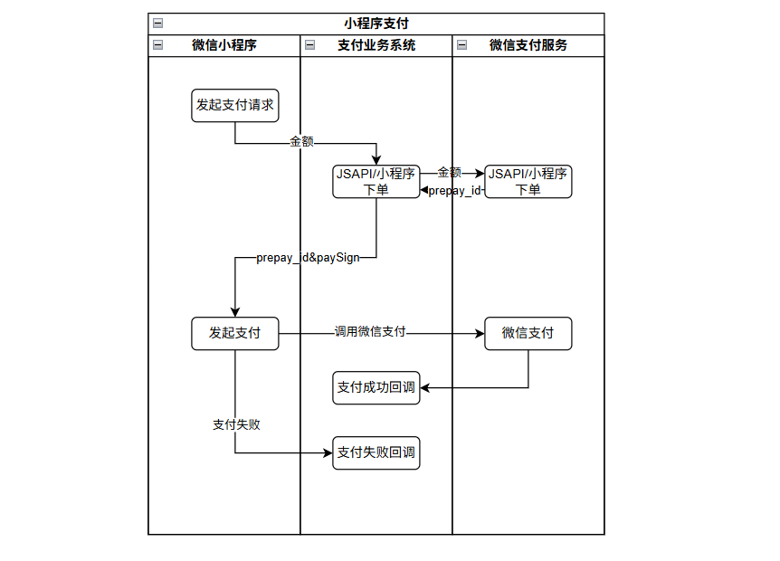

### 微信支付

#### 1 名词解释

微信支付有两种模式：

- 普通商户模式

- 服务商+特约商户模式


#### 2 普通商户模式


#### 3 服务商+特约商户模式

注： 服务商是普通服务商，服务商还有收付通类型

##### 3.1 小程序支付（[JavaSDK](https://github.com/wechatpay-apiv3/wechatpay-java)）

支付资料准备：

- 小程序的AppID和AppSecret
- 商户API证书私钥：[官方文档](https://pay.weixin.qq.com/doc/v3/merchant/4013053053)

- 商户API证书的证书序列号
- APIv3秘钥：[文档](https://pay.weixin.qq.com/doc/v3/merchant/4013053267)
- 微信支付公钥（商户接收APIv3的请求应答、回调时验签使用）
- 微信支付公钥ID（申请支付公钥时获取）

支付流程：



###### 3.1.1 [POM依赖](https://github.com/wechatpay-apiv3/wechatpay-java?tab=readme-ov-file)

```xml
<!-- 官方的微信支付 -->
<dependency>
    <groupId>com.github.wechatpay-apiv3</groupId>
    <artifactId>wechatpay-java</artifactId>
    <version>0.2.17</version>
</dependency>
```

###### 3.1.2 配置属性类

```java
/**
 * 微信支付配置属性
 * @author wulan
 */
@Data
@Configuration
@ConfigurationProperties(prefix = "payment.wx")
public class WxPayProperties {
    /** 应用ID */
    private String appId = "wx89dd13b9a9*****";
    /** 小程序密钥 */
    private String secret = "0d883cacfc29acea17b901e2ece*****";
    /** 服务商商户号 */
    private String mchId = "1719******";
    /** 商户API证书序列号 */
    private String mchSerialNo = "41F22582CF54A62BACCE15F2C8*****19BE3816";
    /** 商户APIv3密钥 */
    private String apiKey = "YGmhQdBPnmKUPCcF4afJTdpeNC******";
    /** 商户API私钥文件路径 */
    private String privateKeyPath = "cert/apiclient_key.pem";
    /** 微信支付公钥ID */
    private String publicKeyId = "PUB_KEY_ID_0117193469652025061200442301******";
    /** 微信支付公钥文件路径 */
    private String publicKeyPath = "cert/pub_key.pem";
    /** 回调地址 */
    private String notifyUrl = "http://callback.com";
}

# 微信支付相关配置
payment:
  wx:
    # 微信小程序应用ID
    app-id: wx89dd13b9a9*****
    # 小程序密钥
    secret: 0d883cacfc29acea17b901e2ece*****
    # 服务商商户号
    mch-id: 1719******
    # 商户API证书序列号
    mch-serial-no: 41F22582CF54A62BACCE15F2C8*****19BE3816
    # 商户APIv3密钥
    api-key: YGmhQdBPnmKUPCcF4afJTdpeNC******
    # 商户API私钥文件路径
    private-key-path: cert/apiclient_key.pem
    # 微信支付公钥ID
    public-key-id: PUB_KEY_ID_0117193469652025061200442301******
    # 微信支付公钥文件路径
    public-key-path: cert/pub_key.pem
    # 支付结果回调地址
    notify-url: http://callback.com
```
###### 3.1.3 回调工具类

```java
/**
 * 回调地址枚举
 * @author wulan
 */
public enum CallbackUrl {

    /** 支付成功回调地址 */
    PAYMENT_CALLBACK("/payment/notify/payNotify"),
    /** 退款回调地址 */
    REFUND_CALLBACK("/payment/notify/refundNotify");

    private static String baseUrl;
    private final String path;

    CallbackUrl(String path) {
        this.path = path;
    }

    public String getUrl() {
        if (baseUrl == null) {
            throw new BizException("CallbackUrl.baseUrl 未初始化");
        }
        return baseUrl + path;
    }
    /** 设置回调基地址 */
    public static void initBaseUrl(String baseUrl) {
        CallbackUrl.baseUrl = baseUrl.endsWith("/") ? 
            baseUrl.substring(0, baseUrl.length() - 1) : baseUrl;
    }
}
```

###### 3.1.4 支付配置类

```java
/**
 * 微信支付配置类
 * 配置微信支付相关服务和解析器
 * @author wulan
 */
@Getter
@Configuration
@RequiredArgsConstructor
public class WechatPayConfig {
    private final WxPayProperties wechatPayProperties;
    private Config config;

    /**
     * 初始化微信支付配置
     */
    @PostConstruct
    public void init() {
        // 初始化回调URL基地址
        CallbackUrl.initBaseUrl(wechatPayProperties.getNotifyUrl());
        //初始化微信支付核心配置
        initConfig();
    }

    /**
     * RSAPublicKeyConfig 用于 API 请求加密和验签
     */
    public void initConfig() {
        // 一个商户号只能初始化一个配置，否则会因为重复的下载任务报错
        // RSAPublicKeyConfig 就是公钥验签配置
        try {
            String privateKeyContent = PemFileUtil.readPemFromClasspath(
                    wechatPayProperties.getPrivateKeyPath()
            );
            String publicKeyContent = PemFileUtil.readPemFromClasspath(
                    wechatPayProperties.getPublicKeyPath()
            );

            config = new RSAPublicKeyConfig.Builder()
                    .merchantId(wechatPayProperties.getMchId())
                    .privateKey(privateKeyContent)
                    .publicKey(publicKeyContent)
                    .publicKeyId(wechatPayProperties.getPublicKeyId())
                    .merchantSerialNumber(wechatPayProperties.getMchSerialNo())
                    .apiV3Key(wechatPayProperties.getApiKey())
                    .build();
        } catch (Exception e) {
            throw new BizException("初始化微信支付配置失败", e);
        }
    }
    /**
     * 支付回调 解密
     */
    @Primary
    @Bean
    public NotificationParser notificationParser() {

        RSAPublicKeyNotificationConfig notificationConfig = null;
        try {
            String publicKeyContent = PemFileUtil.readPemFromClasspath(
                    wechatPayProperties.getPublicKeyPath()
            );
            notificationConfig = new RSAPublicKeyNotificationConfig.Builder()
                    .publicKey(publicKeyContent)
                    .publicKeyId(wechatPayProperties.getPublicKeyId())
                    .apiV3Key(wechatPayProperties.getApiKey())
                    .build();
        } catch (Exception e) {
            throw new BizException("初始化微信支付回调解密配置失败", e);
        }
        return new NotificationParser(notificationConfig);
    }
    /**
     * JSAPI支付/小程序支付
     * 提供商户在微信客户端内部浏览器网页中使用微信支付收款的能力。（包含小程序）
     * 其他接口的Service也可以在这里注册到容器中（H5Service、NativePayService）
     */
    @Bean
    public JsapiService jsapiService() {
        return new JsapiService.Builder().config(config).build();
    }

    /**  申请退款 */
    @Bean
    public RefundService refundService() {
        return new RefundService.Builder().config(config).build();
    }
}
```

###### 3.1.5 工具类

```java
/**
 * 微信支付工具类
 * 提供签名生成和请求参数处理等功能
 * @author wulan
 * @date 2025/8/14
 */
public class WeChatUtil {

    private WeChatUtil() {
    }

    /**
     * 生成支付签名
     *
     * @param appId          应用ID
     * @param privateKeyPath 私钥路径
     * @param prepayId       预支付交易会话标识
     * @param timeStamp      时间戳
     * @param nonceStr       随机字符串
     * @param mchSerialNo    商户证书序列号
     * @return 签名字符串
     */
    public static String paySign(String appId,
                                 String privateKeyPath,
                                 String prepayId,
                                 String timeStamp,
                                 String nonceStr,
                                 String mchSerialNo) {
        String privateKeyStr = PemFileUtil.readPemFromClasspath(privateKeyPath);
        PrivateKey privateKey = PemUtil.loadPrivateKeyFromString(privateKeyStr);
        RSASigner rsaSigner = new RSASigner(mchSerialNo, privateKey);
        String signatureStr = Stream.of(appId,
                timeStamp,
                nonceStr,
                prepayId).collect(Collectors.joining("\n", "", "\n"));
        SignatureResult signatureResult = rsaSigner.sign(signatureStr);
        return signatureResult.getSign();
    }

    /**
     * 构造 RequestParam 回调的时候获取请求头
     */
    public static RequestParam handleNodifyRequestParam(HttpServletRequest request) throws IOException {
        // 请求头Wechatpay-Signature
        String signature = request.getHeader("Wechatpay-Signature");
        // 请求头Wechatpay-nonce
        String nonce = request.getHeader("Wechatpay-Nonce");
        // 请求头Wechatpay-Timestamp
        String timestamp = request.getHeader("Wechatpay-Timestamp");
        // 微信支付证书序列号
        String serial = request.getHeader("Wechatpay-Serial");
        // 构造 RequestParam
        return new RequestParam.Builder()
                .serialNumber(serial)
                .nonce(nonce)
                .signature(signature)
                .timestamp(timestamp)
                .body(getRequestBody(request))
                .build();

    }

    public static String getRequestBody(HttpServletRequest request) throws IOException {
        StringBuilder sb = new StringBuilder();
        try (ServletInputStream stream = request.getInputStream();
             BufferedReader reader = new BufferedReader(new InputStreamReader(stream));
        ) {
            String line;
            while ((line = reader.readLine()) != null) {
                sb.append(line);
            }
        } catch (IOException e) {
            throw new IOException("读取返回支付接口数据流出现异常！");
        }
        return sb.toString();
    }


    public static RequestBody createRequestBody(Object requestBody) {
        return new JsonRequestBody.Builder().body(JSONUtil.toJsonStr(requestBody)).build();
    }
}

/**
 * PEM 文件读取工具类，支持从 classpath 加载 .pem 文件并返回其字符串内容
 * @author 周欢
 * @version 1.0
 * @Date 2025/6/13
 */
public class PemFileUtil {

    /**
     * 从 classpath 加载 PEM 文件并返回其字符串内容
     * @param classpathPath 例如 "cert/apiclient_key.pem"
     * @return PEM 文件的字符串内容
     * @throws RuntimeException 加载失败会抛出异常
     */
    public static String readPemFromClasspath(String classpathPath) {
        InputStream is = null;
        BufferedReader reader = null;
        try {
            is = Thread.currentThread().getContextClassLoader().getResourceAsStream(classpathPath);
            if (is == null) {
                throw new IllegalArgumentException("无法从 classpath 加载文件: " + classpathPath);
            }

            reader = new BufferedReader(new InputStreamReader(is, StandardCharsets.UTF_8));
            StringBuilder sb = new StringBuilder();
            String line;

            while ((line = reader.readLine()) != null) {
                sb.append(line).append("\n");
            }

            return sb.toString();
        } catch (IOException e) {
            throw new RuntimeException("读取 PEM 文件失败: " + classpathPath, e);
        } finally {
            try {
                if (reader != null) {
                    reader.close();
                }
                if (is != null) {
                    is.close();
                }
            } catch (IOException ignore) {
            }
        }
    }
}

/**
 * 生成订单号
 *
 * @author kuangxin
 * date 2025/6/6
 */
public class OrderIdGenerator {

    private OrderIdGenerator() {
    }

    private static final Snowflake SNOWFLAKE = new Snowflake(1, 1);
    /**
     * 生成微信支付订单号
     * 规则：28位 (前缀2位 + 时间8位 + 序列18位)
     */
    public static String generateOrderId(String prefix) {

        // 2. 时间部分：年月日 (YYMMDD)
        SimpleDateFormat sdf = new SimpleDateFormat("yyMMdd");
        String datePart = sdf.format(new Date());

        // 3. 序列号：18位 (雪花算法生成)
        long sequence = SNOWFLAKE.nextId() % 1000000000000000000L;
        String sequencePart = String.format("%018d", sequence);
        return CharSequenceUtil.format("{}{}{}", prefix, datePart, sequencePart);
    }
}
```

###### 3.1.6 下单方法（预支付）

> [下单API参数说明](https://pay.weixin.qq.com/doc/v3/partner/4012759974)

```java
@Transactional(rollbackFor = Exception.class)
public PaymentOrder prepay(String openId) {
    // 创建支付订单
    PaymentOrder order = new PaymentOrder();
    order.setUserId(openId);
    // 业务系统订单号
    order.setOrderNo(OrderIdGenerator.generateOrderId("AA"));
    // 金额， 单位为分
    order.setAmount(1);
    order.setDescription("支付测试");
    order.setStatus(PaymentStatus.PENDING.getCode());
    order.setPaymentMethod(PaymentMethod.WECHAT.getCode());
    LocalDateTime now = LocalDateTime.now();
    order.setTimeStart(now);
    // 设置订单过期时间，30分钟后
    order.setTimeExpire(now.plusMinutes(30L));
    // 微信支付预支付请求
    wxpayPrepayRequest(openId, order);
    boolean save = paymentOrderService.save(order);
    if (!save) {
        throw new BizException("创建支付订单失败");
    }
    return order;
}

/**
     * 微信支付预支付请求
     *
     * @param openId 用户OpenId
     * @param order  支付订单
     */
private void wxpayPrepayRequest(String openId, PaymentOrder order) {
    PrepayRequest request = new PrepayRequest();
    Amount amount = new Amount();
    amount.setTotal(order.getAmount());
    request.setAmount(amount);
    request.setSpAppid(wxPayProperties.getAppId());
    request.setSpMchid(wxPayProperties.getMchId());
    request.setSubMchid(SUB_MERCHANT_ID);
    request.setDescription(order.getDescription());
    request.setOutTradeNo(order.getOrderNo());
    request.setNotifyUrl(CallbackUrl.PAYMENT_CALLBACK.getUrl());

    Payer payer = new Payer();
    payer.setSpOpenid(openId);
    request.setPayer(payer);

    PrepayResponse response = jsapiService.prepay(request);
    String prepayId = response.getPrepayId();
    order.setWxPrepayId(prepayId);
}
```

```java
/**
 * 创建订单(预支付)
 */
@GetMapping("/prepay")
@Operation(summary = "创建预支付订单", description = "根据用户OpenId创建微信预支付订单")
public Result<WechatPayDTO> prepay(@RequestParam String openId){
    String timeStamp = String.valueOf(System.currentTimeMillis() / 1000);
    String nonceStr = RandomUtil.randomString(32);
    PaymentOrder order = wxPayService.prepay(openId);
    // 通过工具类生成支付签名
    String paySign = WeChatUtil.paySign(wxPayProperties.getAppId(),
                                        wxPayProperties.getPrivateKeyPath(),
                                        "prepay_id=" + order.getWxPrepayId(),
                                        timeStamp,
                                        nonceStr,
                                        wxPayProperties.getMchSerialNo());
    WechatPayDTO dto = new WechatPayDTO();
    dto.setOrderNo(order.getOrderNo());
    dto.setPrepayId("prepay_id=" + order.getWxPrepayId());
    dto.setNonceStr(nonceStr);
    dto.setSignType("RSA");
    dto.setPaySign(paySign);
    dto.setTimeStamp(timeStamp);
    return Result.success(dto);
}
```


###### 3.1.7 支付成功回调

```java
	/**
     * 微信支付回调示例：
     * class Transaction {
     * amount: class TransactionAmount {
     * currency: CNY
     * payerCurrency: CNY
     * payerTotal: 1
     * total: 1
     * }
     * spAppid: wx89dd13b9a90fe9f0
     * subAppid: wx89dd13b9a90fe9f0
     * spMchid: 1719346965
     * subMchid: 1719496148
     * attach:
     * bankType: CCB_DEBIT
     * outTradeNo: AA250818957129074233184256
     * payer: class TransactionPayer {
     * spOpenid: ot0oG7rop-dce9jo0XLuZfMVJjhs
     * subOpenid: ot0oG7rop-dce9jo0XLuZfMVJjhs
     * }
     * promotionDetail: null
     * successTime: 2025-08-18T01:15:21+08:00
     * tradeState: SUCCESS
     * tradeStateDesc: 支付成功
     * tradeType: JSAPI
     * transactionId: 4200002741202508186224492838
     * }
     */
public boolean payNotify(HttpServletRequest request) {
    try {
        Transaction transaction = notificationParser.parse(WeChatUtil.handleNodifyRequestParam(request), Transaction.class);
        log.info("支付成功，回调结果：{}", transaction.toString());
        // 支付成功回调
        return true;
    } catch (Exception e) {
        log.error("处理微信回调时发生系统异常", e);
        return false;
    }
}

/**
 * 支付成功回调
 */
@RequestMapping("/payNotify")
public ResponseEntity<Object> prepayCallback(HttpServletRequest request, HttpServletResponse response) {
    boolean flag = wxpayService.payNotify(request);
    if (flag) {
        return ResponseEntity.status(HttpStatus.OK).body(flag);
    } else {
        HashMap<String, Object> map = new HashMap<>(2);
        map.put("code", "FAIL");
        map.put("message", "失败");
        return ResponseEntity.status(HttpStatus.INTERNAL_SERVER_ERROR).body(map);
    }

}
```

###### 3.1.8 关闭订单

> 关闭订单：https://pay.weixin.qq.com/doc/v3/partner/4012739019

```java
/**
 * 取消订单：关闭未支付订单，关闭微信侧订单
 *
 * @param orderNo 订单号
 * @return 是否取消成功
*/
@Transactional(rollbackFor = Exception.class)
public boolean cancelOrder(String orderNo) {
    PaymentOrder order = paymentOrderService.lambdaQuery().eq(PaymentOrder::getOrderNo, orderNo).one();
    if (order == null) {
        throw new BizException("订单不存在");
    }
    // 判断未支付
    if (!order.getStatus().equals(PaymentStatus.PENDING.getCode())) {
        throw new BizException("订单状态不允许取消");
    }
    // 调用微信支付API关闭订单
    try {
        CloseOrderRequest closeOrderRequest = new CloseOrderRequest();
        closeOrderRequest.setOutTradeNo(orderNo);
        // 设置服务商商户号和特约商户商户号
        closeOrderRequest.setSpMchid(wxPayProperties.getMchId());
        closeOrderRequest.setSubMchid(SUB_MERCHANT_ID);
        jsapiService.closeOrder(closeOrderRequest);
        log.info("关闭微信订单:{}", orderNo);
    } catch (Exception e) {
        log.error("关闭微信订单失败", e);
        throw new BizException("微信订单关闭失败");
    }
    // 更新本地订单状态为已取消
    order.setStatus(PaymentStatus.CANCELLED.getCode());
    paymentOrderService.updateById(order);
    return true;
}
```

###### 3.1.9 申请退款

> 申请退款参数说明：https://pay.weixin.qq.com/doc/v3/partner/4012739034

```java
/**
 * 微信支付退款
 * @author pnz
 */
@Data
public class WxPayRefundParam {

    /** 商户订单号 自己生成的 */
    @NotBlank(message = "订单号不能为空")
    private String orderNo;

    /** 退款金额(分) */
    @NotNull(message = "退款金额不能为空")
    private Integer refundMoney;

    /** 退款原因 */
    @Size(min = 0, max = 80, message = "退款原因长度不能超过80个字符")
    private String reason;
}

/**
 * 申请退款：根据订单号发起微信退款
 *
 * @param param 退款参数
 * @return 是否退款成功
 */
@Transactional(rollbackFor = Exception.class)
public boolean refund(WxPayRefundParam param) {
    PaymentOrder order = paymentOrderService.lambdaQuery().eq(PaymentOrder::getOrderNo, param.getOrderNo()).one();
    if (order == null) {
        throw new BizException("订单不存在");
    }
    if (!PaymentStatus.allowRefund(order.getStatus())) {
        throw new BizException("仅已支付订单可退款");
    }
    // 检查退款金额
    if (param.getRefundMoney() <= 0 || param.getRefundMoney() > order.getAmount()) {
        throw new BizException("退款金额不符合条件");
    }
    try {
        // 构建退款对象
        PaymentOrderRefund refund = buildRefund(order, param);
        // 构建微信退款请求
        Refund wxRefund = buildRefundRequest(order, refund);
        refund.setWxRefundId(wxRefund.getRefundId());
        paymentOrderRefundService.save(refund);
        log.info("发起微信退款，订单号:{}", param.getOrderNo());
    } catch (Exception e) {
        log.error("微信退款失败", e);
        throw new BizException("微信退款失败");
    }
    // 更新本地订单状态为已取消（如有退款状态可自定义）
    order.setStatus(PaymentStatus.REFUNDED.getCode());
    paymentOrderService.updateById(order);
    return true;
}

// 微信退款请求
private Refund buildRefundRequest(PaymentOrder order, PaymentOrderRefund refund) {
    CreateRequest request = new CreateRequest();
    request.setSubMchid(SUB_MERCHANT_ID);
    request.setOutTradeNo(order.getOrderNo());
    request.setOutRefundNo(refund.getRefundNo());
    request.setReason(refund.getReason());
    request.setNotifyUrl(CallbackUrl.REFUND_CALLBACK.getUrl());
    AmountReq amount = new AmountReq();
    amount.setRefund(refund.getRefundAmount().longValue());
    amount.setTotal(order.getAmount().longValue());
    amount.setCurrency("CNY");
    request.setAmount(amount);

    try {
        return refundService.create(request);
    } catch (Exception e) {
        throw new BizException("微信退款请求失败!", e);
    }
}

// 构建业务系统订单退款对象
private PaymentOrderRefund buildRefund(PaymentOrder order, WxPayRefundParam param) {
    PaymentOrderRefund refund = new PaymentOrderRefund();
    refund.setOrderNo(order.getOrderNo());
    // 生成业务系统退款单号
    refund.setRefundNo(OrderIdGenerator.generateOrderId("RF"));
    // 分
    refund.setRefundAmount(param.getRefundMoney());
    refund.setReason(param.getReason());
    refund.setStatus(PaymentRefundStatus.PROCESSING.getCode());
    refund.setWxTransactionId(order.getWxTransactionId());
    return refund;
}
```

###### 3.1.10 退款回调

> 退款回调参数说明：https://pay.weixin.qq.com/doc/v3/partner/4012085298

```java
/**
 * {
 *     "refund_id": "50302404342025082065879181803",
 *     "out_refund_no": "RF250820958055148806868992",
 *     "transaction_id": "4200002724202508207823923704",
 *     "out_trade_no": "AA250820958054891272409088",
 *     "user_received_account": "建设银行借记卡7503",
 *     "success_time": "2025-08-20T14:35:04+08:00",
 *     "promotion_detail": [
 *
 *     ],
 *     "amount": {
 *         "total": 1,
 *         "refund": 1,
 *         "payer_total": 1,
 *         "payer_refund": 1
 *     },
 *     "refund_status": "SUCCESS"
 * }
 */
public boolean refundNotify(HttpServletRequest request) {
        try {
            RefundNotification refundResponse = notificationParser.parse(WeChatUtil.handleNodifyRequestParam(request), RefundNotification.class);
            log.info("退款回调结果：{}", refundResponse.toString());
            // 退款回调处理
            return true;
        } catch (Exception e) {
            // 退款回调处理异常
            log.error("处理微信退款回调时发生异常", e);
            return false;
        }
    }

/**
 * 退款成功回调
 */
@RequestMapping("/refundNotify")
public ResponseEntity<Object> refundCallback(HttpServletRequest request, HttpServletResponse response) {
    boolean flag = wxpayService.refundNotify(request);
    if (flag) {
        return ResponseEntity.status(HttpStatus.OK).body(flag);
    } else {
        HashMap<String, Object> map = new HashMap<>(2);
        map.put("code", "FAIL");
        map.put("message", "失败");
        return ResponseEntity.status(HttpStatus.INTERNAL_SERVER_ERROR).body(map);
    }
}
```


##### 3.2 特约商户进件

> 注：对于30天未签约的商户自动取消申请

方式：

- 微信支付合作伙伴后台进件
- API进件

###### 3.2.1 后台进件

进入开发者后台（合作伙伴管理后台） => 合作伙伴功能 => 商户基础服务 => 商户资料填写 => “前往填写”按钮

###### 3.2.2 API进件

> 商户进件API文档：[文档](https://pay.weixin.qq.com/doc/v3/partner/4012719997)

主要是填写资料，然后进行发送API请求之前对必要数据进行加密

收集填写资料这里的步骤省略

###### 3.2.3 微信请求工具类

```java
/**
 * 用于发送微信支付请求
 * 微信支付的相关API请求需要携带公钥加密后的请求头
 */
@Component
@Slf4j
@RequiredArgsConstructor
public class WxRequestUtil {

    private final WechatPayConfig wechatPayConfig;
    private final WechatPayProperties wechatPayProperties;

    /**
     * 微信 POST请求
     * @param requestPath 请求路径
     * @param requestBody 请求体
     * @return 返回响应体
     */
    public HashMap wxPostRequest(String requestPath, Object requestBody){
        try {
            Config config = wechatPayConfig.getConfig();
            // 以此创建的HttpClient会自动在请求前加上验签的请求头
            HttpClient httpClient = new DefaultHttpClientBuilder().config(config).build();
            HttpRequest request = new HttpRequest.Builder()
                    .addHeader(Constant.ACCEPT, MediaType.APPLICATION_JSON.getValue())
                    .addHeader(Constant.CONTENT_TYPE, MediaType.APPLICATION_JSON.getValue())
                    .httpMethod(HttpMethod.POST)
                    .url(requestPath)
                    .body(createRequestBody(requestBody))
                    .build();
            return httpClient.execute(request, HashMap.class).getServiceResponse();
        } catch (ServiceException e) {
            throw new JeecgBootBizTipException(e.getErrorMessage());
        }
    }

    private RequestBody createRequestBody(Object requestBody) {
        return new JsonRequestBody.Builder().body(JSONUtil.toJsonStr(requestBody)).build();
    }

    /**
     * 微信 GET请求
     * @param requestPath 请求路径
     * @return 返回响应体
     */
    public HashMap wxGetRequest(String requestPath){
        try {
            Config config = wechatPayConfig.getConfig();
            HttpClient httpClient = new DefaultHttpClientBuilder().config(config).build();
            HttpRequest request = new HttpRequest.Builder()
                    .addHeader(Constant.ACCEPT, MediaType.APPLICATION_JSON.getValue())
                    .httpMethod(HttpMethod.GET)
                    .url(requestPath)
                    .build();
            return httpClient.execute(request, HashMap.class).getServiceResponse();
        } catch (ServiceException e) {
            throw new JeecgBootBizTipException(e.getErrorMessage());
        }
    }

    /**
     * 微信公钥加密
     * @param message 加密内容
     * @return 加密串
     */
    public String wxPubKeyEncrypt(String message) {
        // 为空直接返回
        if(CharSequenceUtil.isBlank(message)){
            return message;
        }
        try {
            String publicKeyStr = PemFileUtil.readPemFromClasspath(wechatPayProperties.getPublicKeyPath());
            String publicKeyPEM = publicKeyStr
                    .replace("-----BEGIN PUBLIC KEY-----", "")
                    .replace("-----END PUBLIC KEY-----", "")
                    .replaceAll("\\s", "");
            byte[] encoded = Base64.getDecoder().decode(publicKeyPEM);
            X509EncodedKeySpec keySpec = new X509EncodedKeySpec(encoded);
            KeyFactory keyFactory = KeyFactory.getInstance("RSA");
            PublicKey publicKey = keyFactory.generatePublic(keySpec);
            Cipher cipher = Cipher.getInstance("RSA/ECB/OAEPWithSHA-1AndMGF1Padding");
            cipher.init(Cipher.ENCRYPT_MODE, publicKey);
            byte[] data = message.getBytes(StandardCharsets.UTF_8);
            byte[] cipherData = cipher.doFinal(data);
            return Base64.getEncoder().encodeToString(cipherData);
        } catch (NoSuchAlgorithmException | NoSuchPaddingException e) {
            throw new JeecgBootBizTipException("当前Java环境不支持RSA v1.5/OAEP", e);
        } catch (InvalidKeyException e) {
            throw new JeecgBootBizTipException("无效的公钥", e);
        } catch (IllegalBlockSizeException | BadPaddingException e) {
            throw new JeecgBootBizTipException("加密原文错误：" + e.getMessage(), e);
        } catch (InvalidKeySpecException e) {
            throw new JeecgBootBizTipException(e);
        }
    }
}
```

###### 3.2.4 提交进件申请

> 根据填写的资料构建请求体，发送请求 https://pay.weixin.qq.com/doc/v3/partner/4012719997

```java
/**
* 提交申请
*/
@Override
@Transactional(rollbackFor = Exception.class)
public MerchantApplyment submitApplyment(String applymentId){
    MerchantApplyment applyment = baseMapper.selectById(applymentId);
    // 超级管理员信息加密处理
    ContactInfoDTO contactInfo = JSONUtil.toBean(applyment.getContactInfo(), ContactInfoDTO.class);
    contactInfo.setContact_name(wxRequestUtil.wxPubKeyEncrypt(contactInfo.getContact_name()));
    contactInfo.setContact_id_number(wxRequestUtil.wxPubKeyEncrypt(contactInfo.getContact_id_number()));
    contactInfo.setMobile_phone(wxRequestUtil.wxPubKeyEncrypt(contactInfo.getMobile_phone()));
    contactInfo.setContact_email(wxRequestUtil.wxPubKeyEncrypt(contactInfo.getContact_email()));

    SubjectInfoDTO subjectInfo = JSONUtil.toBean(applyment.getSubjectInfo(), SubjectInfoDTO.class);
    if(subjectInfo == null){
        throw new JeecgBootBizTipException("主体信息不能为空!");
    }
    if("SUBJECT_TYPE_INDIVIDUAL".equals(subjectInfo.getSubject_type()) || "SUBJECT_TYPE_ENTERPRISE".equals(subjectInfo.getSubject_type())){
        // 当主体是个体户/企业时，登记证书为空
        subjectInfo.setCertificate_info(null);
    }else{
        // 当主体是政府机关/事业单位/其他组织时，营业执照为空
        subjectInfo.setBusiness_license_info(null);
    }
    if(!"SUBJECT_TYPE_ENTERPRISE".equals(subjectInfo.getSubject_type())){
        // 主体不是企业时，是否为受益人和受益人列表为空
        subjectInfo.getIdentity_info().setOwner(null);
        subjectInfo.setUbo_info_list(null);
    }
    // 身份证信息加密, 本系统不对 非身份证证件类型的信息处理
    IdCardInfoDTO idCardInfo = subjectInfo.getIdentity_info().getId_card_info();
    if(idCardInfo != null){
        idCardInfo.setId_card_name(wxRequestUtil.wxPubKeyEncrypt(idCardInfo.getId_card_name()));
        idCardInfo.setId_card_number(wxRequestUtil.wxPubKeyEncrypt(idCardInfo.getId_card_number()));
        idCardInfo.setId_card_address(wxRequestUtil.wxPubKeyEncrypt(idCardInfo.getId_card_address()));
    }

    if(CollUtil.isNotEmpty(subjectInfo.getUbo_info_list())){
        // 受益人信息加密处理
        for (UboInfoDTO uboInfo : subjectInfo.getUbo_info_list()) {
            uboInfo.setUbo_id_doc_name(wxRequestUtil.wxPubKeyEncrypt(uboInfo.getUbo_id_doc_name()));
            uboInfo.setUbo_id_doc_number(wxRequestUtil.wxPubKeyEncrypt(uboInfo.getUbo_id_doc_number()));
            uboInfo.setUbo_id_doc_address(wxRequestUtil.wxPubKeyEncrypt(uboInfo.getUbo_id_doc_address()));
        }
    }

    // 设置经营场景，锁死小程序
    BusinessInfoDTO businessInfo = JSONUtil.toBean(applyment.getBusinessInfo(), BusinessInfoDTO.class);
    businessInfo.setSales_info(SalesInfoDTO.builder()
                               // 小程序经营场景类型
                               .sales_scenes_type(List.of("SALES_SCENES_MINI_PROGRAM"))
                               .mini_program_info(MiniProgramInfoDTO.builder()
                                                  //.mini_program_sub_appid(wechatPayProperties.getAppId())
                                                  // mini_program_appid 是服务商小程序的appId
                                                  .mini_program_appid(wechatPayProperties.getAppId())
                                                  .build()).build());

    SettlementInfoDTO settlementInfo = JSONUtil.toBean(applyment.getSettlementInfo(), SettlementInfoDTO.class);
    // 计算银行账户信息加密处理
    BankAccountInfoDTO bankAccountInfo = JSONUtil.toBean(applyment.getBankAccountInfo(), BankAccountInfoDTO.class);
    bankAccountInfo.setAccount_name(wxRequestUtil.wxPubKeyEncrypt(bankAccountInfo.getAccount_name()));
    bankAccountInfo.setAccount_number(wxRequestUtil.wxPubKeyEncrypt(bankAccountInfo.getAccount_number()));

    ApplyReqBodyDTO body = ApplyReqBodyDTO.builder()
        .business_code(applyment.getBusinessCode())
        .contact_info(contactInfo)
        .subject_info(subjectInfo)
        .business_info(businessInfo)
        .settlement_info(settlementInfo)
        .bank_account_info(bankAccountInfo)
        .build();
    // 提交申请
    String requestUrl = "https://api.mch.weixin.qq.com/v3/applyment4sub/applyment/";
    HashMap<String, Object> res = wxRequestUtil.wxPostRequest(requestUrl, body);
    // 保存微信支付返回的申请单号
    Double applymentNoDoubleType = (Double) res.get("applyment_id");
    DecimalFormat df = new DecimalFormat("0");
    // 获取返回的微信支付申请单号
    String applymentNo = df.format(applymentNoDoubleType);
    applyment.setApplymentNo(applymentNo);
    baseMapper.updateById(applyment);
    getStatusByApplymentId(applymentId);
    return applyment;
}
```

###### 3.2.5 获取状态

> 根据申请单号查询申请状态 https://pay.weixin.qq.com/doc/v3/partner/4012697052

```java
@Override
public HashMap getStatusByApplymentId(String applymentId){
    MerchantApplyment applyment = baseMapper.selectById(applymentId);
    String applymentNo = applyment.getApplymentNo();
    String requestPath =
        CharSequenceUtil.format("https://api.mch.weixin.qq.com/v3/applyment4sub/applyment/applyment_id/{}", applymentNo);
    HashMap result = wxRequestUtil.wxGetRequest(requestPath);
    // 修改商户状态
    String applymentState = (String) result.get("applyment_state");
    Integer statusCode = ApplymentStatusEnum.getCode(applymentState);
    if(!applyment.getApplymentStatus().equals(statusCode)){
        // 本地状态和线上状态不一致，更新
        applyment.setApplymentStatus(statusCode);
        baseMapper.updateById(applyment);
        // 商户表也需要更新
        Merchant merchant = Merchant.builder().applymentStatus(statusCode).applymentId(applymentId).build();
        // 状态是待签约，获取商户号
        if(statusCode.equals(ApplymentStatusEnum.APPLYMENT_STATE_TO_BE_SIGNED.getCode())){
            merchant.setSubMchId((String) result.get("sub_mchid"));
        }
        merchantService.updateInfoByApplymentId(merchant);
        baseMapper.updateById(applyment);
    }
    ContactInfoDTO contactInfo = JSONUtil.toBean(applyment.getContactInfo(), ContactInfoDTO.class);
    Map<Object, Object> merchantInfo = MapUtil.builder().put("superAdmin", contactInfo.getContact_name()).build();
    SubjectInfoDTO subjectInfo = JSONUtil.toBean(applyment.getSubjectInfo(), SubjectInfoDTO.class);
    if("SUBJECT_TYPE_INDIVIDUAL".equals(subjectInfo.getSubject_type()) || "SUBJECT_TYPE_ENTERPRISE".equals(subjectInfo.getSubject_type())){
        // 当主体是个体户/企业时，登记证书为空
        merchantInfo.put("merchantName", subjectInfo.getBusiness_license_info().getMerchant_name());
    }else{
        // 当主体是政府机关/事业单位/其他组织时
        merchantInfo.put("merchantName", subjectInfo.getCertificate_info().getMerchant_name());
    }
    result.put("merchantInfo", merchantInfo);
    result.put("applymentInfo", applyment);
    return result;
}
```

###### 3.2.6 资料文件上传

> 微信特约商户进件API所需的图片和视频都是上传mediaId

```java
@Service
@Slf4j
@RequiredArgsConstructor
public class WxFileService {

    private final WechatPayConfig wechatPayConfig;
    private static final String IMAGE_UPLOAD_PATH = "https://api.mch.weixin.qq.com/v3/merchant/media/upload";
    private static final String VIDEO_UPLOAD_PATH = "https://api.mch.weixin.qq.com/v3/merchant/media/video_upload";
    // 2MB
    private static final long IMAGE_MAX_FILE_SIZE = 2 * 1024 * 1024;
    // 允许上传的图片
    private static final List<String> IMAGE_ALLOWED_EXTENSIONS = Arrays.asList("jpg", "png", "bmp", "jpeg");
    // 5MB
    private static final long VIDEO_MAX_FILE_SIZE = 5 * 1024 * 1024;
    // 允许上传的视频
    private static final List<String> VIDEO_ALLOWED_EXTENSIONS = Arrays.asList("avi", "wmv", "mpeg", "mp4", "mov", "mkv", "flv", "f4v", "m4v", "rmvb");


    public Map<String, Object> uploadImage(MultipartFile file) {
        // 文件大小不能超过2M
        // 1. 检查文件大小
        if (file.getSize() > IMAGE_MAX_FILE_SIZE) {
            throw new JeecgBootBizTipException("文件大小不能超过 2MB！");
        }
        String filename = file.getOriginalFilename();
        String suffix = FileUtil.getSuffix(filename);
        // 图片类型支持JPG、BMP、PNG格式
        if (!IMAGE_ALLOWED_EXTENSIONS.contains(suffix)) {
            throw new JeecgBootBizTipException("只支持 JPG、BMP、PNG 格式的文件！");
        }
        Map<String, Object> result = MapUtil.<String, Object>builder().build();
        Config config = wechatPayConfig.getConfig();
        FileUploadService service = new FileUploadService.Builder().config(config).build();
        File localFile = FileUtil.createTempFile("." + suffix, true);
        try {
            // 上传到对象存储
            // 把文件上传到Oss放在 transferTo方法执行之前
            // transferTo 执行之后，OssBootUtil获取不到文件内容
            String url = OssBootUtil.upload(file, "upload/wx");
            result.put("url", url);
            file.transferTo(localFile);
        } catch (Exception e) {
            log.error(e.getMessage());
            throw new JeecgBootBizTipException("文件上传失败！");
        }
        try {
            byte[] bytes = FileUtil.readBytes(localFile);
            String sha256 = DigestUtil.sha256Hex(bytes);
            Map<Object, Object> meta = MapUtil.builder().put("filename", filename).put("sha256", sha256).build();
            // 上传到微信服务器
            FileUploadResponse response = service.uploadImage(IMAGE_UPLOAD_PATH, JSONUtil.toJsonStr(meta), filename, bytes);
            result.put("mediaId", response.getMediaId());
            return result;
        } catch (Exception e) {
            log.error(e.getMessage());
            throw new JeecgBootBizTipException("文件上传失败！");
        }
    }

    public Map<String, Object> uploadVideo(MultipartFile file) {
        // 文件大小不能超过5M
        // 1. 检查文件大小
        if (file.getSize() > VIDEO_MAX_FILE_SIZE) {
            throw new JeecgBootBizTipException("文件大小不能超过 5MB！");
        }
        String filename = file.getOriginalFilename();
        String suffix = FileUtil.getSuffix(filename);
        // 检查视频格式
        if (!VIDEO_ALLOWED_EXTENSIONS.contains(suffix)) {
            throw new JeecgBootBizTipException("只支持 avi、wmv、mpeg、mp4、mov、mkv、flv、f4v、m4v、rmvb格式的文件！");
        }
        Map<String, Object> result = MapUtil.<String, Object>builder().build();
        Config config = wechatPayConfig.getConfig();
        FileUploadService service = new FileUploadService.Builder().config(config).build();
        File localFile = FileUtil.createTempFile("." + suffix, true);
        try {
            // 上传到对象存储
            // 把文件上传到Oss放在 transferTo方法执行之前
            // transferTo 执行之后，OssBootUtil获取不到文件内容
            String url = OssBootUtil.upload(file, "upload/wx");
            result.put("url", url);
            file.transferTo(localFile);
        } catch (Exception e) {
            log.error("文件保存失败！");
            throw new JeecgBootBizTipException("文件上传失败！");
        }
        try {
            byte[] bytes = FileUtil.readBytes(localFile);
            String sha256 = DigestUtil.sha256Hex(bytes);
            Map<Object, Object> meta = MapUtil.builder().put("filename", filename).put("sha256", sha256).build();
            // 上传到微信服务器
            FileUploadResponse response = service.uploadVideo(VIDEO_UPLOAD_PATH, JSONUtil.toJsonStr(meta), filename, bytes);
            result.put("mediaId", response.getMediaId());
            return result;
        } catch (Exception e) {
            log.error(e.getMessage());
            throw new JeecgBootBizTipException("文件上传失败！");
        }
    }
}
```

###### 3.2.7 银行信息获取

> 特约商户进件获取银行信息
>
> 因为获取的银行列表直接获取全部，因此对请求进行缓存处理

```java
@Service
@Slf4j
@RequiredArgsConstructor
public class WxBankService {

    private final WxRequestUtil wxRequestUtil;
    private final RedisUtil redisUtil;

    /**
     * 获取省份列表
     */
    public HashMap getProvinces() {
        String url = "https://api.mch.weixin.qq.com/v3/capital/capitallhh/areas/provinces";
        return wxRequestUtil.wxGetRequest(url);
    }

    /**
     * 获取城市列表
     * @param provinceCode 省份编码
     */
    public HashMap getCities(String provinceCode) {
        String url = StrUtil.format("https://api.mch.weixin.qq.com/v3/capital/capitallhh/areas/provinces/{}/cities", provinceCode);
        return wxRequestUtil.wxGetRequest(url);
    }

    /**
     * 获取支持个人业务的银行列表
     */
    public List<HashMap> getPersonalBankList(){
        // 目前支持个人业务的银行有4408个
        String key = "payment:wx:PersonalBankList";
        Object cacheObj = redisUtil.get(key);
        List<HashMap> result;
        if (cacheObj != null) {
            log.info(" 查询缓存");
            result = JSONUtil.toList(String.valueOf(cacheObj), HashMap.class);
        }else{
            log.info(" getPersonalBankList没有走缓存");
            // 还没有存入缓存
            result = new ArrayList<>(4500);
            String currentUrl = "/v3/capital/capitallhh/banks/personal-banking?limit=200";
            while (StrUtil.isNotBlank(currentUrl)) {
                String url = StrUtil.format("https://api.mch.weixin.qq.com{}", currentUrl);
                HashMap hashMap = wxRequestUtil.wxGetRequest(url);
                Object data = hashMap.get("data");
                JSONArray array = JSONUtil.parseArray(data);
                List<HashMap> list = array.toList(HashMap.class);
                result.addAll(list);
                log.info("当前currentUrl：{}", currentUrl);
                currentUrl = (String) JSONUtil.parseObj(hashMap.get("links")).getOrDefault("next", "");
            }
            String value = JSONUtil.toJsonStr(result);
            redisUtil.set(key, value);
            redisUtil.expire(key, 60L *  60L * 24L * 30L);
        }
        return result;
    }

    /**
     * 获取支持对公业务的银行列表
     */
    public List<HashMap> getPublicBankList(){
        // 目前支持对公业务的银行有4414个
        String key = "payment:wx:PublicBankList";
        Object cacheObj = redisUtil.get(key);
        List<HashMap> result;
        if (cacheObj != null) {
            log.info("getPublicBankList 查询缓存");
            result = JSONUtil.toList(String.valueOf(cacheObj), HashMap.class);
        }else{
            log.info("getPublicBankList 没有走缓存");
            // 还没有存入缓存
            result = new ArrayList<>(4500);
            // 一次最大请求200条数据
            String currentUrl = "/v3/capital/capitallhh/banks/corporate-banking?limit=200";
            while (StrUtil.isNotBlank(currentUrl)) {
                String url = StrUtil.format("https://api.mch.weixin.qq.com{}", currentUrl);
                HashMap hashMap = wxRequestUtil.wxGetRequest(url);
                Object data = hashMap.get("data");
                JSONArray array = JSONUtil.parseArray(data);
                List<HashMap> list = array.toList(HashMap.class);
                result.addAll(list);
                log.info("getPublicBankList 当前currentUrl：{}", currentUrl);
                currentUrl = (String) JSONUtil.parseObj(hashMap.get("links")).getOrDefault("next", "");
            }
            String value = JSONUtil.toJsonStr(result);
            redisUtil.set(key, value);
            redisUtil.expire(key, 60L *  60L * 24L * 30L);
        }
        return result;
    }

    /**
     * 获取支行列表
     */
    public List<HashMap> getBranchBankList(String bankCode, String cityCode) {
        // 一次最大请求200条数据
        String currentUrl = StrUtil.format("/v3/capital/capitallhh/banks/{}/branches?city_code={}&limit=200", bankCode, cityCode);
        List<HashMap> result = new  ArrayList<>(200);
        while (CharSequenceUtil.isNotBlank(currentUrl)) {
            String url = StrUtil.format("https://api.mch.weixin.qq.com{}", currentUrl);
            HashMap hashMap = wxRequestUtil.wxGetRequest(url);
            Object data = hashMap.get("data");
            JSONArray array = JSONUtil.parseArray(data);
            List<HashMap> list = array.toList(HashMap.class);
            result.addAll(list);
            log.info("getBranchBankList 当前currentUrl：{}", currentUrl);
            String temp = (String) JSONUtil.parseObj(hashMap.get("links")).getOrDefault("next", "");
            if(CharSequenceUtil.isNotBlank(temp)){
                // 返回的链接不会带上city_code
                currentUrl = temp + "&city_code=10";
            }else {
                currentUrl = temp;
            }
        }
        return result;
    }
}
```


#### 4 商户注销

> 注：特约商户也算是属于特约商户
>
> 特约商户注销后，服务商的特约商户列表中注销的特约商户仍然存在

商户注销链接：https://kf.qq.com/touch/sappfaq/221220E32IBV221220rEnqI7.html?scene_id=kf594&platform=14

目前服务商还不支持主动注销
