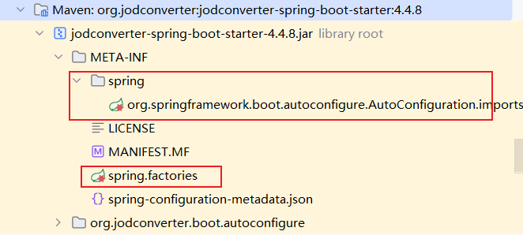

# Java实现Office文件转PDF

### 使用SpringBoot集成Jodconverter

官网代码示例仓库：[GitHub - jodconverter/jodconverter-samples: Sample projects which demonstrate typical use cases using JODConverter.](https://github.com/jodconverter/jodconverter-samples)

**依赖**

```xml
<dependency>
    <groupId>org.jodconverter</groupId>
    <artifactId>jodconverter-spring-boot-starter</artifactId>
    <version>4.4.8</version>
</dependency>
<dependency>
    <groupId>org.jodconverter</groupId>
    <artifactId>jodconverter-local-lo</artifactId>
    <version>4.4.8</version>
</dependency>
```

**注意点：**

> 4.4.8版本的`jodconverter-spring-boot-starter`也可以被SpringBoot2.7以上版本引用

 

**配置**

配置详解：[Configuration · jodconverter/jodconverter Wiki · GitHub](https://github.com/jodconverter/jodconverter/wiki/Configuration)

```yml
jodconverter:
  local:
    enabled: true
    format-options:
      html:
        store:
          TEXT:
            FilterOptions: EmbedImages
      xhtml:
        store:
          TEXT:
            FilterOptions: EmbedImages
    # OpenOffice 或 libreOffice 安装根目录
    # OpenOffice在windows下默认的officeHome是C:\Program Files (x86)\OpenOffice 4
    # OpenOffice在linux下默认的officeHome是/opt/openoffice4
    office-home: C:\Program Files (x86)\OpenOffice 4
    # 一个进程的超时时间
    process-timeout: 86400000
    # 任务执行的超时时间
    task-execution-timeout: 86400000
    # 任务队列的超时时间
    task-queue-timeout: 86400000
```

**格式转换表**：[Supported Formats · jodconverter/jodconverter Wiki · GitHub](https://github.com/jodconverter/jodconverter/wiki/Supported-Formats)

**转换代码**

```java
@Controller
public class ConverterController {
  @Autowired
  private DocumentConverter converter;

  @PostMapping("/converter")
  Object convert(
      @RequestParam("inputFile") final MultipartFile inputFile,
      @RequestParam(name = "outputFormat", required = false) final String outputFormat,
      final RedirectAttributes redirectAttributes) {

    // Here, we could have a dedicated service that would convert document
    try (ByteArrayOutputStream baos = new ByteArrayOutputStream()) {

      // 通过格式参数，获取DocumentFormat
      final DocumentFormat targetFormat =
          DefaultDocumentFormatRegistry.getFormatByExtension(outputFormat);
      // 执行转换，将文件输出到OutputStream
      converter.convert(inputFile.getInputStream()).to(baos).as(targetFormat).execute();
	  // 将转换后的文件，存储Response，以实现下载文件的目的
      final HttpHeaders headers = new HttpHeaders();
      headers.setContentType(MediaType.parseMediaType(targetFormat.getMediaType()));
      headers.add(
          "Content-Disposition",
          "attachment; filename="
              + FileUtils.getBaseName(inputFile.getOriginalFilename())
              + "."
              + targetFormat.getExtension());
      return new ResponseEntity<>(baos.toByteArray(), headers, HttpStatus.OK);

    } catch (OfficeException | IOException e) {
      redirectAttributes.addFlashAttribute(
          ATTRNAME_ERROR_MESSAGE,
          "Could not convert the file "
              + inputFile.getOriginalFilename()
              + ". Cause: "
              + e.getMessage());
    }

    return "redirect:/";
  }

	
  /**
  * windows下
  * 将传入的文件转换成pdf
  */
  @PostMapping("/toPdf")
  @ResponseBody
  public String toPdf(@RequestParam("file") final MultipartFile inputFile){
    String filename = inputFile.getOriginalFilename();
    String targetPath ="E:\\workspace\\office-converter\\" + filename + "." + "pdf";
    try {
        	// 通过 DefaultDocumentFormatRegistry.PDF 制定转换的文件格式
          converter.convert(inputFile.getInputStream()).to(new File(targetPath)).as(DefaultDocumentFormatRegistry.PDF).execute();
      } catch (IOException e) {
          System.out.println("error");
          return "error";
      } catch (OfficeException e) {
        return "error";
    }
      return "success";
  }

  @PostMapping("/linux/toPdf")
  @ResponseBody
  public String toPdfLinux(@RequestParam("file") final MultipartFile inputFile){
    String dir = "/opt/file/";
    File dirFile = new File(dir);
    if(!dirFile.exists()){
      dirFile.mkdirs();
    }
    String filename = inputFile.getOriginalFilename();
    String targetPath = dir + filename + "." + "pdf";
    try {
      converter.convert(inputFile.getInputStream()).to(new File(targetPath)).as(DefaultDocumentFormatRegistry.PDF).execute();
    } catch (IOException e) {
      System.out.println("error");
      return "error";
    } catch (OfficeException e) {
      return "error";
    }
    return "success";
  }
}

```

### 安装openoffice

官网链接：[Apache OpenOffice - 下载](https://www.openoffice.org/zh-cn/download/)

安装向导：[下载并安装Apache OpenOffice 说明](https://www.openoffice.org/zh-cn/download/common/instructions.html)

**基于Windows下安装**

1. 查看Apache OpenOffice的[系统要求](http://www.openoffice.org/dev_docs/source/sys_reqs_aoo34.html).
2. 下载和安装[Java JRE](http://www.java.com/)如果你需要依赖Java的功能.
3. [下载Apache OpenOffice](http://www.openoffice.org/download/).
4. 请以作为管理员权限登录您的电脑(如果需要).
5. 解压并安装下载的Apache OpenOffice的文件.
6. 运行Apache OpenOffice以确保安装成功.


**基于RPM的Linux安装**

1. 查看[系统要求](http://www.openoffice.org/dev_docs/source/sys_reqs_aoo34.html)

2. [下载Apache OpenOffice你最喜欢的Linux版本](http://www.openoffice.org/download/)

3. 在 [安装向导](http://documentation.openoffice.org/setup_guide2/index.html#12)查看有用的信息和安装选项。

4. 解压下载的镜像，为安装做好准备.

   使用下面的命令：`tar -xvzf “linux包的名字”.tar.gz` "linux包的名字"应该替换你刚刚下载的tar.gz包的前一部分，也就是除了tar.gz以外的那一串字符.

   这将创建一个安装目录。

   安装目录的名称很可能会有语言名的缩写，例如，en-US.

5. `su`到 root 用户,如果有必要，浏览到Apache OpenOffice的安装目录（解压缩后的档案的位置）.
   *您可能需要以root身份运行rpm命令来安装软件。*

6. `cd`到安装目录下RPMS子目录.
   你应该能看到许多rpm包和一个名为"desktop-integration"的子目录.

7. 输入`rpm -Uvih *rpm`，安装新版本.

   默认将会安装/升级Apache OpenOffice到`/opt`目录.

   或者不用命令行,你也可以使用GUI程序安装rpm包, 引用安装目录,安装所有rpm包在top level.这也可以帮助你监测依赖问题，如果有的话.

8. 安装桌面集成功能
   在安装目录下`cd` 到 `desktop-integration`,
   根据软件包管理器/系统，安装相应的桌面界面的RPM包。

9. 最后，启动 Apache OpenOffice确保它正常工作.

> 注意点：
>
> jodconverter-spring-boot-starter在使用OpenOffice时不需要手动启动的OpenOffice
>
> 程序在启动时自动启动OpenOffice，在程序关闭时，自动关闭OpenOffice