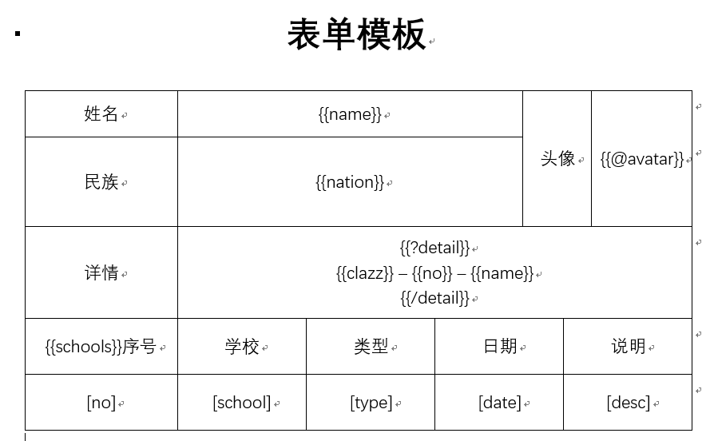

# Java实现Word模板填充

### 基于Poi-tl实现

#### poi-tl介绍

poi-tl（poi template language）是Word模板引擎，使用模板和数据**创建很棒的Word文档**。

官网：[Poi-tl Documentation](https://deepoove.com/poi-tl/)

#### word模板



以上模板具体应用标签：

- 文本
- 图片
- 区块对-非空集合
- 插件-表格行循环

#### Java代码实现

**将填充完成的数据保存到指定路径**

```java
// 准备数据
HashMap<String, Object> params = new HashMap<>();
params.put("name", "小name");
params.put("nation", "汉族");
params.put("avatar", Pictures.ofLocal("E:\\images\\02.jpg").size(100, 120).create());
List<Detail> details = new ArrayList<>();
for (int i = 0; i < 3; i++) {
    details.add(Detail.builder().no(String.valueOf(i)).clazz("detail:" + i).name("name:" + i).build());
}
params.put("detail", details);
ArrayList<School> schools = new ArrayList<>();
for (int i = 0; i < 3; i++) {
    schools.add(School.builder()
                .no(String.valueOf(i)).school("学校：" + i).type("高中：" + i)
                .date(new Date()).desc("描述：" + i).build());
}
params.put("schools", schools);

// 绑定表格行循环插件
LoopRowTableRenderPolicy policy = new LoopRowTableRenderPolicy();
Configure config = Configure.builder().bind("schools", policy).build();
// 模板的绝对地址， 也可以传入一个InputStream、File等
String absolutePath = "E:\\workspace\\office-converter\\表单模板.docx";
XWPFTemplate render = XWPFTemplate.compile(absolutePath, config).render(params);
// 将填充完成的内容保存到指定路径
render.writeAndClose(new FileOutputStream("E:\\workspace\\office-converter\\表单模板-data.docx"));
render.close();
```

**将填充完成的数据保存到OutputStream**

```java
// 数据准备同上

// 绑定表格行循环插件
LoopRowTableRenderPolicy policy = new LoopRowTableRenderPolicy();
Configure config = Configure.builder().bind("schools", policy).build();
// 模板的绝对地址， 也可以传入一个InputStream、File等
String absolutePath = "E:\\workspace\\office-converter\\表单模板.docx";
// 将填充完成的docx保存到 outputstream
FileOutputStream fileOps = new FileOutputStream(absolutePath + ".docx");
XWPFTemplate render = XWPFTemplate.compile(absolutePath, config).render(params, fileOps);
// 强制将缓冲区的内容存入磁盘
fileOps.flush();
fileOps.close();
render.close();
```

