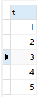
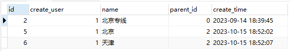

### SQL的递归查询
#### MySQL的递归查询
示例
```sql
with recursive t1 as (
	select 1 as t
	union all
	select t1.t+1 from t1 where t1.t < 5
)
select * from t1
```
结果：
示例：

```sql
with recursive p as(
	select t1.* from tb_category t1 where id = 2
	union all
	select t2.* from tb_category t2 inner join p on t2.parent_id = p.id
)
select * from p;
```
结果：
