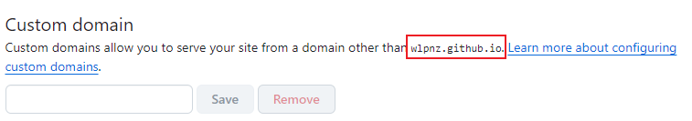

# 搭建笔记仓库

### 创建项目

> [官方文档](https://vitepress.dev/zh/guide/getting-started#installation)

```shell
先创建项目文件夹`vitepress-demo`
mkdir 'vitepress-demo'
进入该文件夹
cd vitepress-demo
下载项目
npm add -D vitepress
npx vitepress init

然后回回答几个问题
┌  Welcome to VitePress!
│
◇  Where should VitePress initialize the config?
│  ./  # 保存到当前目录
│
◇  Site title:
│  My Awesome Project
│
◇  Site description:
│  A VitePress Site
│
◆  Theme:
│  ○ Default Theme (Out of the box, good-looking docs)
│  ● Default Theme + Customization   # 这里可以选择是ts还是js
│  ○ Custom Theme
└
```

### index.md

> 位置：/
>
> [官方文档](https://vitepress.dev/zh/reference/default-theme-home-page)

### config.mjs

> 位置：/.vitepress/
>
> [官方文档](https://vitepress.dev/zh/reference/default-theme-config)

**示例**

我的目录结构

 

```js
import { defineConfig } from 'vitepress'
// 改成自己的路径
import { set_sidebar } from "../utils/auto-gen-sidebar.mjs";	

export default defineConfig({
  title: "小小浮游",
  titleTemplate: ":title",
  description: "雾岚的笔记仓库",
  // base: `/planktonic-life/`,
  // head: [['link', { rel: 'icon', href: `/planktonic-life/favicon.svg` }]],
  head: [['link', { rel: 'icon', href: `/favicon.svg` }]],
  lang: 'zh-CN',
  lastUpdated: true,
  themeConfig: {
    outline: [2, 6],
    search: {
      provider: 'local'
    },
    nav: [
      { text: '首页', link: '/' },
      { text: '后端', link: '/backend' },
      { text: '前端', link: '/frontend' },
      { text: '数据库', link: '/database' },
      { text: '运维', link: '/operations' },
      { text: '工具', link: '/devtools' },
      { text: '经验', link: '/project_exp' },
    ],
    sidebar:{
      "/backend": set_sidebar("/backend"),
      "/frontend": set_sidebar("/frontend"),
      "/database": set_sidebar("/database"),
      "/operations": set_sidebar("/operations"),
      "/devtools": set_sidebar("/devtools"),
      "/project_exp": set_sidebar("/project_exp")
    },
    logo: "plankton.svg", // 配置logo位置，public目录
    socialLinks: [
      { icon: 'github', link: 'https://github.com/wlpnz/planktonic-life' }
    ],
    footer: {
      message: '开发者笔记仓库',
      copyright: 'Copyright © 2024 雾岚'
    },
    docFooter: {
      prev: false,
      next: false
    }
  },
  sitemap: {
    hostname: 'https://blog.wlpnz.top/'
  }
})

```

**set_sidebar脚本**：根据本地文件动态获取侧边栏

```js
import path from "node:path";
import fs from "node:fs";

// 文件根目录
const DIR_PATH = path.resolve();
// 白名单,过滤不是文章的文件和文件夹
const WHITE_LIST = [
    ".vitepress",
    "node_modules",
    ".idea",
    "assets",
    "images",
    "index.md",
];

// 判断是否是文件夹
const isDirectory = (path) => fs.lstatSync(path).isDirectory();

// 取差值
const intersections = (arr1, arr2) =>
    Array.from(new Set(arr1.filter((item) => !new Set(arr2).has(item))));

// 把方法导出直接使用
function getList(params, path1, pathname) {
    // 存放结果
    const res = [];
    // 开始遍历params
    for (let file in params) {
        // 拼接目录
        const dir = path.join(path1, params[file]);
        // 判断是否是文件夹
        const isDir = isDirectory(dir);
        if (isDir) {
            // 如果是文件夹,读取之后作为下一次递归参数
            const files = fs.readdirSync(dir);
            const name = path.basename(params[file]);
            const items = intersections(files, WHITE_LIST);
            res.push({
                text: name,
                collapsed: false,
                items: getList(items, dir, `${pathname}/${name}`),
            });
        } else {
            // 获取名字
            const name = path.basename(params[file]);
            // 排除非 md 文件
            const suffix = path.extname(params[file]);
            if (suffix !== ".md") {
                continue;
            }
            res.push({
                text: name,
                link: `${pathname}/${name}`,
            });
        }
    }
    // 对name做一下处理，把后缀删除
    res.map((item) => {
        item.text = item.text.replace(/\.md$/, "");
    });
    return res;
}

export const set_sidebar = (pathname) => {
    // 获取pathname的路径
    const dirPath = path.join(DIR_PATH, pathname);
    // 读取pathname下的所有文件或者文件夹
    const files = fs.readdirSync(dirPath);
    // 过滤掉
    const items = intersections(files, WHITE_LIST);
    // getList 函数后面会讲到
    return getList(items, dirPath, pathname);
};
```

### 部署

#### 上传GitHub

将已有代码上传到github仓库

>  注意：如果不设置自定义域名，需要将`Base`设置为仓库名，具体看[base配置](https://vitepress.dev/zh/reference/site-config#base)

#### 设置GitHub Page

先把github page 的 `Build and deployment`设置成`GitHub Actions`


然后在本地添加空文件`.nojekyll`到根目录

原因：


添加action脚本文件:`.github/workflows/deploy.yml`

脚本内容：[官网示例](https://vitepress.dev/zh/guide/deploy#github-pages)

```yaml
# 构建 VitePress 站点并将其部署到 GitHub Pages 的示例工作流程
#
name: Deploy VitePress site to Pages

on:
  # 在针对 `main` 分支的推送上运行。如果你
  # 使用 `master` 分支作为默认分支，请将其更改为 `master`
  push:
    branches: [master]

  # 允许你从 Actions 选项卡手动运行此工作流程
  workflow_dispatch:

# 设置 GITHUB_TOKEN 的权限，以允许部署到 GitHub Pages
permissions:
  contents: read
  pages: write
  id-token: write

# 只允许同时进行一次部署，跳过正在运行和最新队列之间的运行队列
# 但是，不要取消正在进行的运行，因为我们希望允许这些生产部署完成
concurrency:
  group: pages
  cancel-in-progress: false

jobs:
  # 构建工作
  build:
    runs-on: ubuntu-latest
    steps:
      - name: Checkout
        uses: actions/checkout@v4
        with:
          fetch-depth: 0 # 如果未启用 lastUpdated，则不需要
      # - uses: pnpm/action-setup@v3 # 如果使用 pnpm，请取消注释
      # - uses: oven-sh/setup-bun@v1 # 如果使用 Bun，请取消注释
      - name: Setup Node
        uses: actions/setup-node@v4
        with:
          node-version: 18.12.0
          cache: npm # 或 pnpm / yarn
      - name: Setup Pages
        uses: actions/configure-pages@v4
      - name: Install dependencies
        run: npm ci # 或 pnpm install / yarn install / bun install
      - name: Build with VitePress
        run: npm run docs:build # 或 pnpm docs:build / yarn docs:build / bun run docs:build
      - name: Upload artifact
        uses: actions/upload-pages-artifact@v3
        with:
          path: .vitepress/dist

  # 部署工作
  deploy:
    environment:
      name: github-pages
      url: ${{ steps.deployment.outputs.page_url }}
    needs: build
    runs-on: ubuntu-latest
    name: Deploy
    steps:
      - name: Deploy to GitHub Pages
        id: deployment
        uses: actions/deploy-pages@v4

```

将添加内容上传到github

等待action执行

执行成功后，github会在下图位置给一个默认域名使用


#### 自定义域名

> 注意：如果使用自定义域名，需要将`base`删除，具体看[base配置](https://vitepress.dev/zh/reference/site-config#base)

在域名服务商那里将自己域名解析到 `account.github.io`，解析类型：`CNAME`



示例：


然后在github page页面将自己的域名添加到`Custom domain`

点击保存后github会验证dns

等待个几分钟(或者更久)，显示DNS check successful表示域名可用，然后等待域名可用

如果报错：**github 拒绝访问**不要着急，再等等...

更多错误信息请查看[官方文档](https://docs.github.com/en/pages/configuring-a-custom-domain-for-your-github-pages-site)

### 附加1

使用utools 和 bat脚本 通过快捷键自动上传

bat脚本内容：**在项目根目录添加文件auto-commit.bat**

```bash
@echo off

REM 使用PowerShell获取当前日期和时间
FOR /F "usebackq tokens=*" %%i IN (`powershell -NoProfile -Command "Get-Date -Format 'yyyy-MM-dd HH:mm:ss'"`) DO SET currentDateTime=%%i

REM 输出中文信息
ECHO 当前日期和时间是: %currentDateTime%

REM 
REM cd E:\planktonic-life\

cd /d %~dp0

git pull origin "master"
IF %ERRORLEVEL% NEQ 0 (
    ECHO 拉取时遇到冲突或错误，请手动解决冲突后再推送。
    PAUSE
    EXIT /B 1
)
ECHO 拉取结束
ECHO 开始推送

git add .
git commit -m "%currentDateTime%"
git push -u origin "master"
IF %ERRORLEVEL% NEQ 0 (
    ECHO 推送时遇到错误，请检查。
    PAUSE
    EXIT /B 1
)
ECHO 文件已推送至远程仓库
PAUSE
```

打开utools偏好设置 -> 文件启动，将auto-commit拖入


然后在全局能力中，设置快捷键


以后，每天在写完笔记后，通过快捷键 Ctrl+E快捷上传代码

### 附加2

每次开电脑时自动拉取代码

utools搜索**任务**，打开任务计划程序


在任务计划程序库，右键，选择`创建基本任务`

- 第一步名称自定义
- 第二步触发器可以选择用户登录时
- 第三步选择 启动程序，然后选择auto-commit.bat脚本文件
- 点击完成后，在任务列表看到添加的任务，可以点击运行测试


### 附加3

使用Algolia Search

> [搜索 | VitePress](https://vitepress.dev/zh/reference/default-theme-search#algolia-search)

先申请[计划](https://docsearch.algolia.com/apply/)


文档地址，要填对

发送申请后，会在邮箱接受到通知，在几小时后会收到通过的邮件


在该邮件的下面会给出`appId`、`apiKey`、`IndexName`

 然后再config.mjs中配置

```js
import { defineConfig } from 'vitepress'

export default defineConfig({
  themeConfig: {
    search: {
      provider: 'algolia',
      options: {
        appId: '...',
        apiKey: '...',
        indexName: '...'
      }
    }
  }
})
```

::: info 注意

如果你的域名填写错误，你需要打开脚本的那个网站的[域名配置](https://crawler.algolia.com/admin/domains)

添加你的域名

然后进入脚本页面，在侧边栏选择`Editor`,将其中的域名修改成你自己的域名

然后重新执行爬虫

:::
