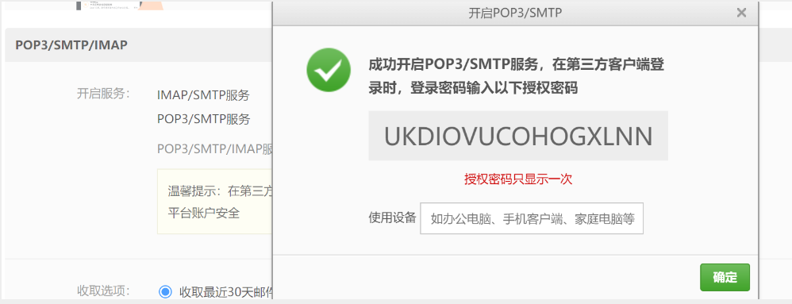

### 问题描述
> 使用邮箱验证

### 解决方案
#### 解决方案一
##### POM
```xml
<dependencies>
        <!-- 邮件服务 -->
        <dependency>
            <groupId>org.springframework.boot</groupId>
            <artifactId>spring-boot-starter-mail</artifactId>
        </dependency>
        <!-- Thymeleaf 模版，用于发送模版邮件 -->
        <dependency>
            <groupId>org.springframework.boot</groupId>
            <artifactId>spring-boot-starter-thymeleaf</artifactId>
        </dependency>
    </dependencies>
```
##### 配置文件
```properties
...

#email服务
spring.mail.host=smtp.163.com
spring.mail.username=wl_pnz@163.com
#开启邮箱 POP3/SMTP/IMAP服务 会显示授权密码
spring.mail.password=ASCBTXDBWHJDGQZN
spring.mail.default-encoding=utf-8

# redis服务
spring.redis.host=123.57.18.11
spring.redis.port=8379
spring.redis.password=abc123
spring.redis.database=0
#设置缓存的过期时间
spring.cache.redis.time-to-live=1800000

...
```

##### 发送短信的实现类
```java
@Service
public class EmailServiceImpl implements EmailService {

    @Value("${spring.mail.username}")
    private String from; //wl_pnz@163.com
    @Autowired
    private JavaMailSender mailSender;

    @Override
    public void sendMsg(String to, String subject, String context) {
        SimpleMailMessage mailMessage = new SimpleMailMessage();
        mailMessage.setFrom(from);
        mailMessage.setTo(to);
        mailMessage.setSubject(subject);
        mailMessage.setText(context);
        mailSender.send(mailMessage);
    }
}
```
##### 将生成的验证码保存到redis中
```java
@PostMapping("/sendMsg/{to}")
public R sendMsg(@PathVariable("to") String to){
    //to 用户验证的邮箱账号
    String subject = "登录验证码";
    if(StringUtils.isNotEmpty(to)){
        String code = ValidateCodeUtils.generateValidateCode(4).toString();
        String context = "欢迎使用该系统，登录验证码为：" + code + "，五分钟内有效";
        emailService.sendMsg(to,subject,context);
        //将验证码保存到redis中 有效期 5分钟
        redisTemplate.opsForValue().set(to,code,5, TimeUnit.MINUTES);
        log.info("登录验证码：{}",code);
        return R.success("发送成功",null);
    }
    return R.error("sendMsg Error");
}
```
##### 验证验证码是否正确
```java
@PostMapping("/validateMsg/{to}/{code}")
public R validateMsg(@PathVariable("to") String to,@PathVariable("code") String code){
    if(StringUtils.isNotEmpty(to) && StringUtils.isNotEmpty(code)){
        log.info("输入的验证码：{}",code);
        Object o = redisTemplate.opsForValue().get(to);
        if(code.equals(o.toString())){
            return R.success("验证成功",null);
        }else{
            return R.error("验证失败 录入的验证码："+code);
        }
    }
    return R.error("validate fail");
}
```
#### 解决方案二
> 

