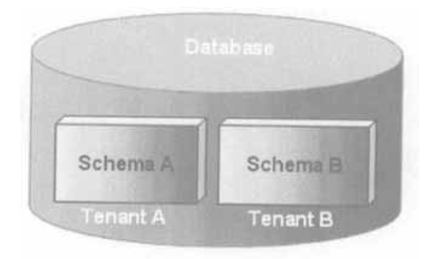

##### 租户模式

- 独立数据库

- - DataSource模式或数据源模式
  - 一个租户独享一个独立的数据库，可以是物理数据库或云数据库，隔离级别最高、最安全、同时成本也更高。
  - 

- 共享数据库，隔离数据结构

- - Schema模式 或 数据库模式
  - 多个租户共享一个数据库(基础数据)，但一个租户独立使用一个SCHEMA(业务数据)。
  - 

- 共享数据库，共享数据结构

- - Column模式、列模式 或 字段模式
  - 一个租户共享一个数据库、共享一个SCHEMA，通过在表中增加tenant_code字段来区分租户的数据。(基础数据和业务数据都在一个数据库里)
  - 

- 大租户+小租户模式

- - 独立数据源+字段模式、DataSource_Column模式、大租户小门店模式
  - 大租户 独享一个独立的数据库（可以是物理数据库或云数据库)， 小租户在大租户 的数据库中通过 tenant_code 字段来隔离数据。 即大租户采用DATASOURCE模式隔离后，小租户在采用Column模式隔离，大租户可以查询小租户的数据。
  - 

##### 非租户模式

None模式或非租户模式

即没有租户的概念，跟普通的web项目一样。

##### 实现方式

1. 通过注解 + 拦截器的方式实现租户数据隔离
2. 程序员sql编写完全无需拼接租户相关的sql（一套业务代码，可以通用所有模式）
3. 通过启动配置决定启用何种模式的插件，程序就能按照何种模式来隔离数据